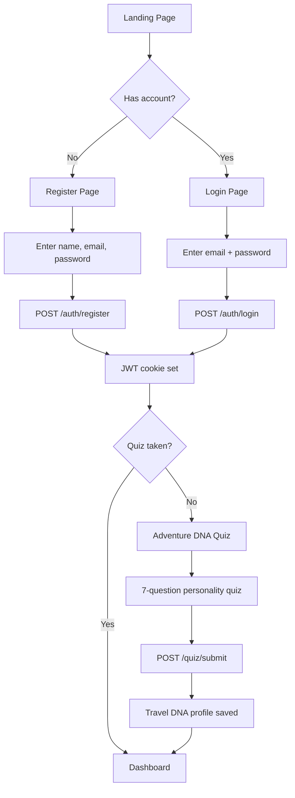
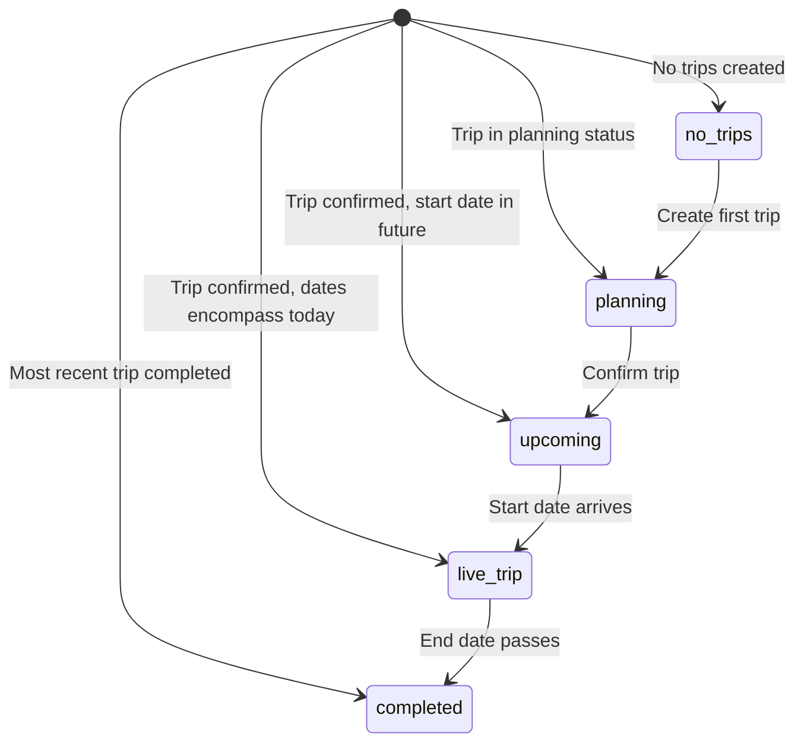
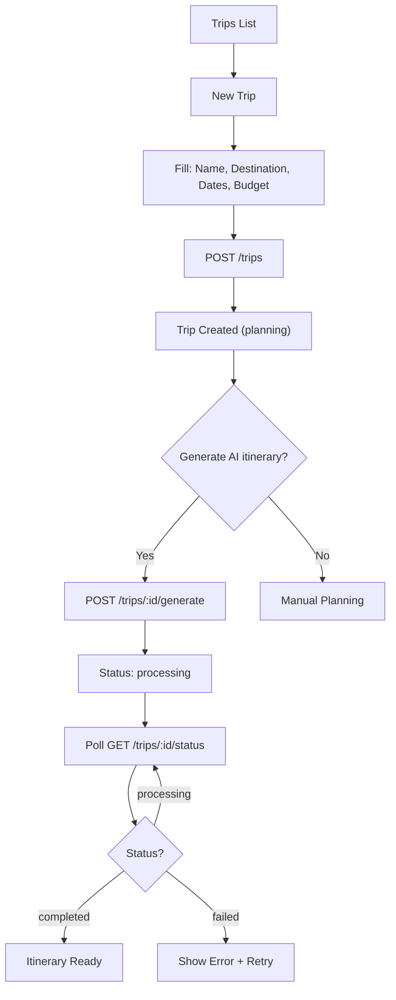
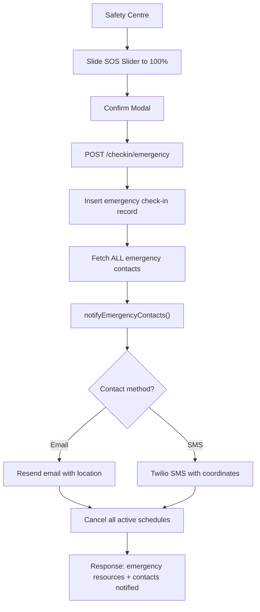
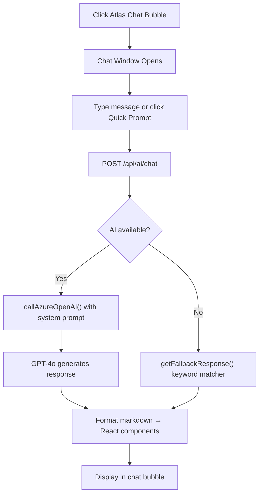
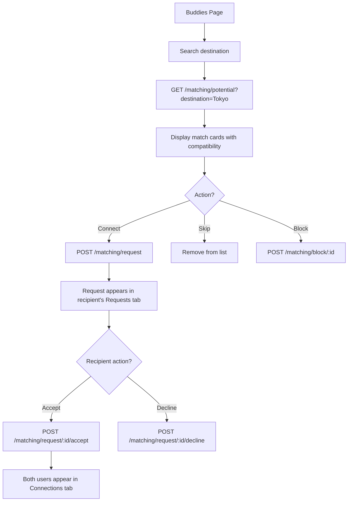
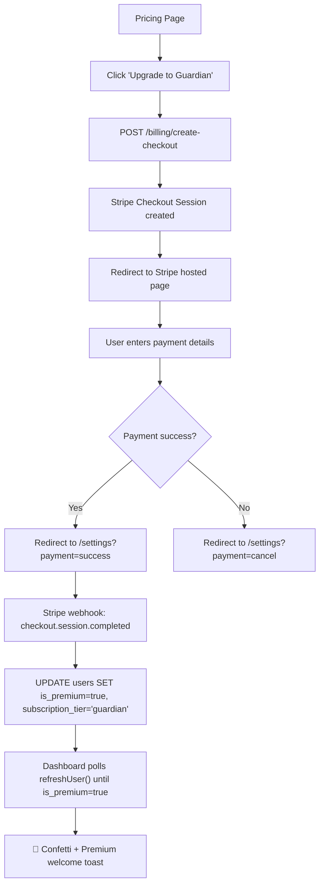
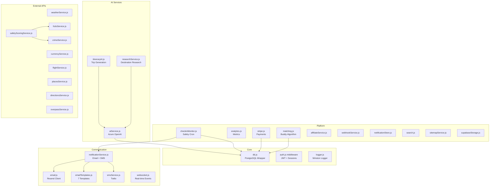
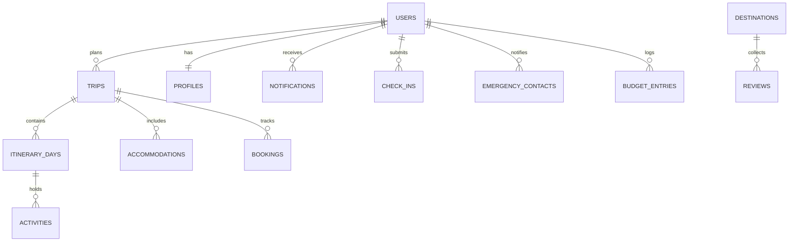

## Merged Files List
- 1. Complete Feature & Workflow Map 33923712644980b18edbe9b06d2c1ff6.md (35.1 KB)
- 2. SC-32 Product — Homepage Tech & Feature Matrix f3cd29f109d94e0e95754132efb52cd1.md (12.2 KB)
- 3. SC-33 Product — Dashboard UX 337237126449804482deea01f28b6474.md (4.6 KB)
- 4. SC-34 Product — Safety Feature Suite ec73868d7203424d9d7600edc5e64feb.md (4.5 KB)
- 5. SC-36 Product — Notifications System Map 4aa7b20162364f449edc71aafb156b25.md (12.7 KB)
- 6. SoloCompass — Admin Panel QA Test Plan 33d23712644981fbbb0fe02883ce7041.md (4.7 KB)
- 7. Deploy full SoloCompass app to Azure 33323712644981e8be84f71c1e4ac093.md (359 B)
- 8. Integrate Agoda affiliate program 33323712644981608095c14faecc86a3.md (89 B)
- 9. Integrate Amazon Associates affiliate links 333237126449811d94c2f4688b346d81.md (99 B)
- 10. Integrate Aviasales affiliate program 333237126449812c83b4d6ec44a6e2e2.md (93 B)
- 11. Integrate AviationStack flight status API 333237126449811f81c8f9044c5231d2.md (100 B)
- 12. Integrate Frankfurter currency conversion API 333237126449815ba487e6df2b11647f.md (102 B)
- 13. Integrate Google Directions API (transit routing) 333237126449819e9f28f8e33a557e18.md (106 B)
- 14. Integrate Google Places API (venue data, photos, h 3332371264498186bac5d217cca43562.md (112 B)
- 15. Integrate OpenWeatherMap weather forecasts 33323712644981db9f5df07434daf342.md (99 B)
- 16. Integrate Safety Wing travel insurance affiliate 33323712644981dd9ba0df955b2d707c.md (104 B)
- 17. Integrate Viator affiliate program 333237126449815c921bc2914218555e.md (90 B)
- 18. Route Spec Template ddff0f0f0b6343c19119e8a90fb526a3.md (1.9 KB)
- 19. SC-31 Product — Homepage Overhaul Plan 63f9b5fe160046b4b6dca544710bfab5.md (16.5 KB)
- 20. SC-35 Product — App Screens Readiness 653f3918b3b54a2f9975ef34263d28b6.md (3.3 KB)
- 21. SC-54 Ops — Admin Command Centre Blueprint b0dcc060d12b49d29e2e07639af5444c.md (58.2 KB)
- 22. SC-A02 API — AI b538c05d4466494fabc783ecbcebafa2.md (2.5 KB)
- 23. SC-A03 API — Trips c27c77a5f8de4949afb62b949a012754.md (2.4 KB)
- 24. SC-A04 API — Accommodations ed2c7670484847bf9a7b03a4127143ea.md (2.4 KB)
- 25. SC-A05 API — Bookings cea438a2d64a48bebde554249aebd087.md (2.4 KB)
- 26. SC-A06 API — Trip Documents d3d825079fd94c2e96b299188d0d1627.md (2.3 KB)
- 27. SC-A07 API — Trip Places ab19e34c26394db3a388adb381bb2f09.md (2.1 KB)
- 28. SC-A08 API — Destinations a8910b97ad7e4ca3b694cbfb8aaea2d3.md (5.4 KB)
- 29. SC-A09 API — Users a478a7ab85ad4747896a8be056a64521.md (2.2 KB)
- 30. SC-A11 API — Check-In ea36094d26454b349e53bf3d15f1b929.md (2.3 KB)
- 31. SC-A12 API — Safety fbc601339ead4cfdb812af91909c912e.md (2.2 KB)
- 32. SC-A15 API — Admin d6a50bf69b7348f4b2e831da638792a8.md (64.2 KB)
- 33. SC-A17 API — Notifications e5b0decea1164c1fbc8da14c776a781a.md (2.2 KB)
- 34. SC-A18 API — Help 977d9dae5f4a4db7afe743881ff864b1.md (2.1 KB)
- 35. SC-A20 API — Weather f8e65489630c4538995a55021d432a35.md (2.2 KB)
- 36. SC-A21 API — Matching cee82648f8524c11aa5d9609115136cd.md (2.2 KB)
- 37. SC-A23 API — Quiz e2748fc253494fb1b1fb507c5032b848.md (1.9 KB)
- 38. SC-A24 API — Places b5bedb7d86cc4e29af8c3fea9a3e9897.md (1.9 KB)
- 39. SC-A29 API — Resources a7aa6ac89bb94a2ab816f0dac0c12646.md (1.9 KB)
- 40. SC-A30 API — Preferences f1458c89b4414600b5d250d3938c260e.md (2 KB)
- 41. SC-A31 API — Affiliates a439d6dcb6eb4b0da6bb6b5d1526ca67.md (3.1 KB)
- 42. SC-A33 API — Budget b287281a9609453a9105e8a4aa1f8ee1.md (2.7 KB)
- 43. SC-C01 Component — Layout Shell fb7efb616d32467fa5e06cd996d929f5.md (1.1 KB)
- 44. SC-C02 Component — Bottom Navigation cfe018ce874a439fbd8c642696f3e492.md (1.5 KB)
- 45. SC-C03 Component — AI Chat Widget dc9fc6c091e24d219879c172f733d027.md (1 KB)
- 46. SC-C04 Component — Dashboard Hero a3e35cb7d1c641d5a197e6922cc6de8a.md (1 KB)
- 47. SC-C10 Component — Destination Chat 9c46cff8f26741568f010f034f117a9a.md (1.9 KB)
- 48. SC-C11 Component — Notification Dropdown fb8f8c74d96346c5bd4f9508ffbf73f8.md (1.5 KB)
- 49. SC-C12 Component — Notification Center a6be364bfddd41948588f2748cbecde3.md (1.2 KB)
- 50. SC-C14 Component — Dashboard State Renderers a1f1367784604d1d9a34c1ae11234af6.md (1.6 KB)
- 51. SC-C19 Component — BottomSheet f1717a7523a54a2d8a8914639629299e.md (2.1 KB)
- 52. SC-C21 Component — StatCard 9540ba73ec13488d9daa1ac1b61101f5.md (1.9 KB)
- 53. SC-C22 Component — EmptyState b7cfe84301f34467a066e369159cb866.md (1.5 KB)
- 54. SC-C23 Component — Skeleton ce275e16737940009c26fc2c2c1957ae.md (1.6 KB)
- 55. SC-C25 Component — DatePicker c4db620b9ab14420b2d27734d99c3b33.md (1.3 KB)
- 56. SC-C29 Component — MapMarker e48a54b3687a47dfbae4ec1cfd3e8661.md (1.3 KB)
- 57. SC-C31 Component — ScrollToTop ffb2fac1667a4ad387e9e26b2036acd6.md (1.3 KB)
- 58. SC-C35 Component — Filters f52667590af74edd866323818127862c.md (1.5 KB)
- 59. SC-DB-01 — Database & Schema Handbook daae706b239e4f838a6305b69cf92f1a.md (2.7 KB)
- 60. SC-F01 Feature — Emergency Contacts e51567348e7a4450b7a713ccf9392ac6.md (3.7 KB)
- 61. SC-F06 Feature — Places & Directions bff3db00941046309c6ed720ef8d364b.md (1.5 KB)
- 62. SC-F07 Feature — Reviews & Ratings cf8f80a7fe2c4ad8b39c1fdc950e61a1.md (1.4 KB)
- 63. SC-F09 Feature — Scheduled Check-Ins f9bfdefa33fc46eca25ccb05ca6bcfff.md (1.8 KB)
- 64. SC-F10 Feature — Notification Preferences 96ea8160c1a24644a1a9737ef203f7cd.md (1.4 KB)
- 65. SC-F11 Feature — Plan Gating & Entitlements cfc9b2eb21004e36b7748107044c2536.md (1.1 KB)
- 66. SC-F15 Feature — Buddy Profile Privacy & Searchabi ec7a5f374c174ef89b70718954bb0545.md (1.2 KB)
- 67. SC-R01 Route — Home ab86478d136d4b019a52a535781fd804.md (2.7 KB)
- 68. SC-R02 Route — Dashboard f79ea2de94a84e31809c5e75e94f7cb0.md (3 KB)
- 69. SC-R05 Route — Safety fdb0105e32354b6eb0dcce8e5b94ff18.md (2.1 KB)
- 70. SC-R08 Route — Buddies 8c1f6d9e5f224672a0320424cbfa0cca.md (1.7 KB)
- 71. SC-R10 Route — Destination Detail cb6aa253fd06475c88a2a8d61748c854.md (6.4 KB)
- 72. SC-R11 Route — Pricing 933bdbdf8dd4414c9e1f074c2a9c8000.md (1.7 KB)
- 73. SC-R13 Route — Features a695b78d1e8348f38149333afb9ccea7.md (1.4 KB)
- 74. SC-R14 Route — Safety Info a8519b67ac80468d922bcee5bcad913f.md (1.2 KB)
- 75. SC-R16 Route — Register 88f128eb223f41f3b6bbb990d7cc0e34.md (1.9 KB)
- 76. SC-R17 Route — OAuth Callback c9427ab89caa46b2a33492411d6df849.md (1.6 KB)
- 77. SC-R18 Route — Forgot Password c4c699daafd94988ad60bd88b7dc3af7.md (1.1 KB)
- 78. SC-R19 Route — Reset Password bb5301549e574fcfa2bfbe2840b8e256.md (1.2 KB)
- 79. SC-R23 Route — New Trip f34ad1def48e428db25714c8e39f4351.md (1.6 KB)
- 80. SC-R31 Route — Partnerships ad9ec24aa981451c90de02d909ca90bd.md (1.2 KB)
- 81. SC-R32 Route — Contact cc251c7245fb45298b0f176346c06ddd.md (1.2 KB)
- 82. SC-R33 Route — About bf68d9016a204efb9570bbe3c8a2c17d.md (1 KB)
- 83. SC-R34 Route — Fallback Redirect d1529dc85a3e46a6808b8af340c63b7c.md (1.3 KB)
- 84. SC-S02 System — Safety & Emergency aebf8eeb8bea49428ec2b4ea0802b81f.md (2.2 KB)
- 85. SC-S04 System — Billing & Subscriptions dac3cfa904034302bf047344a4d0bf7b.md (1.2 KB)
- 86. SC-S06 System — Atlas AI Assistant c9cda00651944888a01c41719814b3b7.md (1 KB)
- 87. SC-S09 System — Product Inventory & Architecture fc0c4c292c0f4f19bc2a98dec9f37d0b.md (958 B)
- 88. SC-S10 System — Visual Style Guide e196ba11d68343d7974e04a4bcd7c715.md (994 B)
- 89. SC-SEC-01 — Security & Compliance Manifesto 973b5986b8b24c10a9b747969733e23d.md (2.7 KB)
- 90. SC-SVC02 Service — itineraryAI js eeeec7f3b96e47c2b35826144068256c.md (955 B)
- 91. SC-SVC03 Service — researchService js ea1a54c489dc4c11866648b15bce811d.md (945 B)
- 92. SC-SVC05 Service — smsService js e2416b3f13d74f38ac1d1e000a38e1bb.md (1.4 KB)
- 93. SC-SVC08 Service — fcdoService js d5755821c27d4d7b8680433f2e1a61f9.md (1 KB)
- 94. SC-SVC11 Service — stripe js d9d70bcc8748428aa797280b67b90127.md (1.1 KB)
- 95. SC-SVC12 Service — websocket js a72725ce7a8d46c8903a6176e8fb7f27.md (1 KB)
- 96. Set up Azure CDN for production HTTPS 3332371264498128b156da7361afa776.md (268 B)
- 97. System Feature Spec Template e84e6a5ec0ce43b08d92dc13fe87f5b2.md (1.6 KB)
- 98. Verify SSL certificates on Azure static sites 333237126449813f910edf4cf11cdbc4.md (421 B)
- 99. SC — Unified Profile System (Account + Buddy Ident 6c6631da493346d4b10eba087e5e79d1.md (7.7 KB)
- 100. SC-00 Command Center fe72844f2b8a47c6acacbfc216fbefc1.md (4.5 KB)
- 101. SC-01 Workspace Reading Standard aec01efdf1e94dde9181b13f69423ea7.md (1.9 KB)
- 102. SC-10 Strategy — Overview 333237126449818f8a6bc44994060aca.md (2.4 KB)
- 103. SC-11 Strategy — Product Strategy 83cccb53a6ba4223bd28220c85dcc116.md (3.8 KB)
- 104. SC-12 Strategy — MVP Feature Brief 9221ef13cc9643d994c01b3c3968068a.md (2.5 KB)
- 105. SC-13 Strategy — Launch Roadmap 49bd69b6d8be4a91963e61c61c9345f4.md (2.1 KB)
- 106. SC-20 Research — Pre-Launch Research Report 3332371264498117b1b4cd12a78a704e.md (1.9 KB)
- 107. SC-21 Research — Full Research & Concept 33323712644981cc805bd820cb2f0274.md (18.5 KB)
- 108. SC-30 Product — API & Affiliate Research 33323712644981058c79dcc4cf4ed168.md (6.7 KB)
- 109. SC-30 Product — Country & City Hub Model 0c3e06db64e645408c21b9ea3a6ebc22.md (12.9 KB)
- 110. SC-30 Product — Destination Intelligence Build Pla 46b8e9869ebf43e691656de72a435538.md (27.4 KB)
- 111. SC-40 Growth — Content Calendar 33323712644981c4b20efe22918dedfa.md (2.1 KB)
- 112. SC-41 Growth — Social Automation Research 33323712644981f79779d305cd39342b.md (1.5 KB)
- 113. SC-50 Ops — Business Plan 336237126449800ea6dfd315b08aa497.md (30.6 KB)
- 114. SC-51 Ops — Current App State 33623712644980f98652da7cdf5e08ef.md (2.3 KB)
- 115. SC-89 Archive — Legacy Product References 5a0efc24326f4c7594ea6d58719bbb38.md (1.9 KB)
- 116. SC-A01 API — Auth 4c7f8f23cb7e4bf383d87985cc2a61e8.md (2.6 KB)
- 117. SC-A10 API — Advisories 57df4b9240fb46dfb2447fe6a3127289.md (2.1 KB)
- 118. SC-A13 API — Emergency Contacts 229b52faffce434db489e45d89198be5.md (2.1 KB)
- 119. SC-A14 API — Billing 7f85e274534041ffa7be2d5f8b0a1f95.md (2.2 KB)
- 120. SC-A16 API — Analytics 3223a12ab74045448826fa98250ee128.md (2.1 KB)
- 121. SC-A19 API — Currency 3cf4c57587414579bf09c214474eeeee.md (2.1 KB)
- 122. SC-A22 API — Reviews 4aab6f647ba94765bb18e9f7ae2ba129.md (2 KB)
- 123. SC-A25 API — Directions 70c0b639185948ffba226d47eb2a1244.md (2 KB)
- 124. SC-A26 API — Exchange 697ddae988ae45228c5f0c66bc19bd26.md (2 KB)
- 125. SC-A27 API — Packing Lists 77d3a8f88b794bcba46c4858ff11f008.md (2.1 KB)
- 126. SC-A28 API — Categories 389d8ba1fd354421a4ee836299b1ceed.md (1.8 KB)
- 127. SC-A32 API — Flights 7f47aef8daf0492d9446191239bcda7c.md (3 KB)
- 128. SC-A34 API — Webhooks 5321aceb94ca4cbebc053666de29d556.md (2.8 KB)
- 129. SC-A35 API — SMS Webhook 58087fe985264514944d83c6484237fa.md (2.5 KB)
- 130. SC-A36 API — Translate 0cdb4216e93242ed894cfe68723b05a5.md (2.8 KB)
- 131. SC-C05 Component — Safety Check-In 132c36ee659b439b95473a55ce5d79a9.md (1.5 KB)
- 132. SC-C06 Component — SystemPulse 06489b7c9df146b58a85c30a772c6b80.md (3.5 KB)
- 133. SC-C07 Component — Subscription Banner 262d4a340a9a4744952c81a02267803a.md (2.2 KB)
- 134. SC-C08 Component — Cookie Consent 84bd9e36390c4fa6842b5d7f463dec89.md (2.1 KB)
- 135. SC-C09 Component — Feature Gate 15436c60e6e74512b64678970bd90cad.md (1.5 KB)
- 136. SC-C13 Component — Radar Chart 401d9ece7cdc4f11892cf08ff12b3034.md (1.1 KB)
- 137. SC-C15 Component — Buddy Matching UI 72ce02b915fa4d3893e3b1e4ce6141a9.md (1.1 KB)
- 138. SC-C16 Component — Reviews UI 193f215325654c51b83ff69980b3161e.md (1.1 KB)
- 139. SC-C17 Component — Sidebar 77c463f7015144e391e29035b10200ea.md (2 KB)
- 140. SC-C18 Component — BottomNav 7948e2d4fd704cd1a1c79776f684f4c0.md (1.8 KB)
- 141. SC-C20 Component — Drawer 31e99fdbdccd40e9af4dbac39231c9fb.md (1.8 KB)
- 142. SC-C24 Component — MultiSelect 32123fc8c29048c6af6505651ab06cab.md (1.5 KB)
- 143. SC-C26 Component — ImageGallery 45938e7439c140049444820638fc0cd3.md (1.3 KB)
- 144. SC-C27 Component — FileUpload 8314cbe0901b453a80f74b88e2f5c080.md (1.3 KB)
- 145. SC-C28 Component — MapView 102d57e8bd854d749774b96f3b1f5088.md (1.6 KB)
- 146. SC-C30 Component — FloatingActionButton 516503b1671b4e599f852e27c2afe51a.md (1.4 KB)
- 147. SC-C32 Component — InfiniteScroll 24a01e2587864aa4a41d2245643e846a.md (1.2 KB)
- 148. SC-C33 Component — PullToRefresh 09a3b464fcf34401b3b4e7404631ee94.md (1.1 KB)
- 149. SC-C34 Component — SearchBar 2e1a7c3333e44f94aa68305044cc8fa5.md (1.6 KB)
- 150. SC-C36 Component — SortBy 429e3b443749454c867aeb82625ac138.md (1.4 KB)
- 151. SC-DB — Product Specs 5d900168610d40b78fc39cda2fde2d46.csv (49.8 KB)
- 152. SC-DB — Product Specs 5d900168610d40b78fc39cda2fde2d46_all.csv (49.8 KB)
- 153. SC-DB — QA & Testing Hub 7ef7ea25811b40a083c10fb1fcee7487.csv (221 B)
- 154. SC-DB — QA & Testing Hub 7ef7ea25811b40a083c10fb1fcee7487_all.csv (221 B)
- 155. SC-DEV-01 — Technical Contributor & Onboarding Gui 556d7c0b8e234d77b1cc347b65e7222a.md (2 KB)
- 156. SC-F02 Feature — Safe Return 2e2a52c578404b09af9de3316232e146.md (2.4 KB)
- 157. SC-F03 Feature — Packing Lists 6d8f7334af924247a2605418f7929278.md (1.6 KB)
- 158. SC-F04 Feature — Budget Tracking 318f042aa0c24070ba057f9e57a8f1e1.md (2.2 KB)
- 159. SC-F05 Feature — Flight Tracking 6d39d9c79daf47f29a0e58e28901fc4f.md (2 KB)
- 160. SC-F08 Feature — Fake Call 382f74eba90f4979b728c5d7ef63ffe2.md (1.2 KB)
- 161. SC-F12 Feature — Data Export & Account Deletion 59753973404c4adeaf09cf73bf411e36.md (1.2 KB)
- 162. SC-F13 Feature — Session Management 47478345069b432285399e7394822aff.md (1.1 KB)
- 163. SC-F14 Feature — Destination Safety Index 37d86ab0e9f1403ab601156a4e5aa47a.md (1.1 KB)
- 164. SC-LIB-01 — Grand Master Technical Library 5a714f4a5d134443830c9605d3731168.md (20.2 KB)
- 165. SC-OPS-01 — Infrastructure & DevOps Guide 797e49d748764de9bc5508b1e332b6e2.md (2.2 KB)
- 166. SC-R03 Route — Trips 1ba73ba2bd39416da5daadf6410db8d3.md (2 KB)
- 167. SC-R04 Route — Trip Detail 054086c8df5b4104a7a31ba5331e8d47.md (2 KB)
- 168. SC-R06 Route — Notifications 09514c50a29a4b48984452ae31f51ae3.md (1.9 KB)
- 169. SC-R07 Route — Settings 0fd2542010844a2785f3859e19fda222.md (1.8 KB)
- 170. SC-R09 Route — Destinations 201feba4c9eb414ab23c4672bab94185.md (5.8 KB)
- 171. SC-R12 Route — Admin 173adafb208b41b3aa2b6926b2246e01.md (8 KB)
- 172. SC-R15 Route — Login 756855e7fca74deca0a0e7482de8639b.md (1.5 KB)
- 173. SC-R20 Route — Adventure DNA Quiz 66fa29e470d64536aef707e63b822f36.md (2 KB)
- 174. SC-R21 Route — Checkout 38a9d14ec55d4394a81b01080e1befc2.md (1.8 KB)
- 175. SC-R22 Route — Advisories 03523e82fabd4c1bb3806e33525faed2.md (1.9 KB)
- 176. SC-R24 Route — Reviews 0f8f7a26103e484cb1b8356b8b6a3d04.md (1.5 KB)
- 177. SC-R25 Route — Admin Email Preview 13f9e363605a4b58af49924a563ff9d4.md (1.2 KB)
- 178. SC-R26 Route — Terms 792dac393f534b059201e0e50501e3d7.md (1.2 KB)
- 179. SC-R27 Route — Privacy 0241e42e98ac4afdb4c388968b425833.md (1.2 KB)
- 180. SC-R28 Route — Cookies 2db6c6b10dd54e11bd197347b010d3f8.md (1.1 KB)
- 181. SC-R29 Route — Help 10ac745192f849d58b8de3068cf4823f.md (1.6 KB)
- 182. SC-R30 Route — Docs 0437443dda0546ee93951ee0692130bb.md (1.3 KB)
- 183. SC-S01 System — Notifications 8810648925e546e2ae0e7924c0ae5eea.md (2.8 KB)
- 184. SC-S03 System — Auth & Sessions 770d7b81fc0647baa3f64a0c70380a59.md (1.4 KB)
- 185. SC-S05 System — Trip Planning Engine 7e18c44d71694d819ab2f662416d5eb8.md (1.3 KB)
- 186. SC-S07 System — Buddy Matching 670bc7802ed24c03a744780aeb8e9c7c.md (977 B)
- 187. SC-S08 System — Destination Discovery 2e3d2fad058946d684667c8e97866fa9.md (7.8 KB)
- 188. SC-SVC01 Service — aiService js 140b4fc95c174a91a5d4aa43d91d23a3.md (2.5 KB)
- 189. SC-SVC04 Service — notificationService js 3ec996126d434c6583aaecfd511ac42e.md (1.5 KB)
- 190. SC-SVC06 Service — email js 36e7e3b45b494f579846e4bde50920ed.md (1.3 KB)
- 191. SC-SVC07 Service — checkinMonitor js 79a85e72d9a04c14aa67fd88b5440a02.md (1.6 KB)
- 192. SC-SVC09 Service — weatherService js 485cb038257444b28f94b74d9745c014.md (831 B)
- 193. SC-SVC10 Service — placesService js 74f281c0095847f3b61f04772832f634.md (835 B)
- 194. SoloCompass — Business Hub 3e7bd6df31034d89ab9452e60f895126.md (7.6 KB)
- 195. SoloCompass — QA Test Plan 3392371264498093b69be23e11e7ad77.md (15.9 KB)
- 196. SoloCompass Tasks 9c3083a971734b3d9b2162ab2a5bb47a.csv (893 B)
- 197. SoloCompass Tasks 9c3083a971734b3d9b2162ab2a5bb47a_all.csv (893 B)


## 1. Complete Feature & Workflow Map 33923712644980b18edbe9b06d2c1ff6.md

```md
# Complete Feature & Workflow Map

<aside>
🧩

This remains the upstream inventory source, but the canonical route and system specs now live in [](SC-DB%20%E2%80%94%20Product%20Specs%205d900168610d40b78fc39cda2fde2d46.md), including [SC-R01 Route — Home](SC-R01%20Route%20%E2%80%94%20Home%20ab86478d136d4b019a52a535781fd804.md), [SC-R02 Route — Dashboard](SC-R02%20Route%20%E2%80%94%20Dashboard%20f79ea2de94a84e31809c5e75e94f7cb0.md), [SC-S01 System — Notifications](SC-S01%20System%20%E2%80%94%20Notifications%208810648925e546e2ae0e7924c0ae5eea.md), and [SC-S02 System — Safety & Emergency](SC-S02%20System%20%E2%80%94%20Safety%20&%20Emergency%20aebf8eeb8bea49428ec2b4ea0802b81f.md).

</aside>

**Version**: V1 Beta

**Date**: April 5, 2026

**Total**: 34 pages · 51 components · 36 API route files · 29 backend services

---

## Table of Contents

1. [Platform Overview](about:blank#1-platform-overview)
2. [Authentication & Onboarding](about:blank#2-authentication--onboarding)
3. [Dashboard Intelligence](about:blank#3-dashboard-intelligence)
4. [Trip Planning & Management](about:blank#4-trip-planning--management)
5. [Safety & Emergency System](about:blank#5-safety--emergency-system)
6. [AI Assistant (Atlas)](about:blank#6-ai-assistant-atlas)
7. [Travel Buddy Matching](about:blank#7-travel-buddy-matching)
8. [Destination Discovery](about:blank#8-destination-discovery)
9. [Billing & Subscriptions](about:blank#9-billing--subscriptions)
10. [Admin & Platform Operations](about:blank#10-admin--platform-operations)
11. [Supporting Features](about:blank#11-supporting-features)
12. [Complete Route Map](about:blank#12-complete-route-map)
13. [Component Inventory](about:blank#13-component-inventory)
14. [Service Architecture](about:blank#14-service-architecture)

---

## 1. Platform Overview

SoloCompass is a solo travel safety companion SaaS platform with three subscription tiers:

| Tier | Price | Key Features |
| --- | --- | --- |
| **Explorer** (Free) | £0/mo | Trip planning, 1 AI itinerary/mo, manual check-in, SOS, budget tracker |
| **Guardian** | £/mo | + Scheduled check-ins, missed escalation, emergency contacts, PDF export, unlimited AI |
| **Navigator** | £/mo | + AI Chat (Atlas), destination guides, buddy matching, translator |

### Tech Stack

- **Frontend**: React 18 + Vite + Tailwind CSS + DaisyUI + Framer Motion
- **Backend**: Node.js/Express + PostgreSQL (Supabase) + WebSocket
- **AI**: Azure OpenAI (GPT-4o)
- **Payments**: Stripe
- **Secrets**: Infisical SDK v5
- **Email**: Resend
- **SMS**: Twilio
- **Maps**: Leaflet + Geoapify + Overpass API
- **Photos**: Unsplash API

---

## 2. Authentication & Onboarding

### Pages

| Page | Route | Auth Required |
| --- | --- | --- |
| [Login.jsx](file:///d:/HELIOS_SYSTEM/HELIOS/projects/SoloCompass%20V1%20Beta/frontend/src/pages/Login.jsx) | `/login` | No |
| [Register.jsx](file:///d:/HELIOS_SYSTEM/HELIOS/projects/SoloCompass%20V1%20Beta/frontend/src/pages/Register.jsx) | `/register` | No |
| [ForgotPassword.jsx](file:///d:/HELIOS_SYSTEM/HELIOS/projects/SoloCompass%20V1%20Beta/frontend/src/pages/ForgotPassword.jsx) | `/forgot-password` | No |
| [ResetPassword.jsx](file:///d:/HELIOS_SYSTEM/HELIOS/projects/SoloCompass%20V1%20Beta/frontend/src/pages/ResetPassword.jsx) | `/reset-password` | No |
| [OAuthCallback.jsx](file:///d:/HELIOS_SYSTEM/HELIOS/projects/SoloCompass%20V1%20Beta/frontend/src/pages/OAuthCallback.jsx) | `/auth/google/callback` | No |
| [Quiz.jsx](file:///d:/HELIOS_SYSTEM/HELIOS/projects/SoloCompass%20V1%20Beta/frontend/src/pages/Quiz.jsx) | `/quiz` | No (optional) |

### Backend Endpoints

| Method | Endpoint | Description |
| --- | --- | --- |
| `POST` | `/api/auth/register` | Email/password registration |
| `POST` | `/api/auth/login` | Email/password login → JWT + httpOnly cookie |
| `POST` | `/api/auth/logout` | Invalidate session |
| `POST` | `/api/auth/refresh` | Rotate JWT tokens |
| `GET` | `/api/auth/me` | Get current user from token |
| `POST` | `/api/auth/forgot-password` | Send password reset email |
| `POST` | `/api/auth/reset-password` | Reset password with token |
| `GET` | `/api/auth/google` | Initiate Google OAuth |
| `GET` | `/api/auth/google/callback` | Handle Google OAuth redirect |

### Workflow: Registration → Dashboard



### Key Details

- **JWT Auth**: HttpOnly cookies with session table. Tokens auto-refresh via interceptor in `api.js`
- **Google OAuth**: Passport.js strategy → callback creates/finds user → redirects with token
- **Adventure DNA Quiz**: 7 questions producing a travel personality profile (stored in `profiles` table). Results rendered as a radar chart via `RadarChart.jsx`
- **Session Management**: Sessions stored in DB with expiry. `requireAuth` middleware validates on every request

---

## 3. Dashboard Intelligence

### Pages

| Page | Route | Auth Required |
| --- | --- | --- |
| [Dashboard.jsx](file:///d:/HELIOS_SYSTEM/HELIOS/projects/SoloCompass%20V1%20Beta/frontend/src/pages/Dashboard.jsx) | `/dashboard` | Yes |

### State Machine

The dashboard is **context-aware** — it adapts its entire UI based on the user’s trip state:



| State | Component | Shows |
| --- | --- | --- |
| `no_trips` | `NoTripsDashboard` | Welcome message, CTA to create trip |
| `planning` | `PlanningDashboard` | Trip card, countdown, checklist |
| `upcoming` | `UpcomingDashboard` | Countdown timer, weather, advisories, packing progress |
| `live_trip` | `LiveTripDashboard` | Active trip hero, safety check-in, weather, itinerary |
| `completed` | `CompletedDashboard` | Trip summary, review prompt, stats |

### Supporting Components

- `DashboardHero` — Context-adaptive header with trip image
- `TripImageHero` — Unsplash-powered destination imagery
- `HeroStatusCard` — Key status metrics
- `StatusBadge` — Trip status pill (planning/confirmed/live/completed)
- `SubscriptionBanner` — Premium trial expiry notification
- `SystemPulse` — Real-time health indicator (DB, API, Vault)

### Data Fetched

- `GET /trips` — All user trips (triggers auto-completion of past-date trips)
- `GET /advisories` — Active FCDO travel advisories
- `GET /accommodations/:tripId/accommodation` — Accommodation for active trip
- `GET /bookings/:tripId/bookings` — Bookings for active trip
- `GET /trip-documents/:tripId/documents` — Documents for active trip
- `GET /trip-places/:tripId/places` — Saved places for active trip

---

## 4. Trip Planning & Management

### Pages

| Page | Route | Auth Required |
| --- | --- | --- |
| [Trips.jsx](file:///d:/HELIOS_SYSTEM/HELIOS/projects/SoloCompass%20V1%20Beta/frontend/src/pages/Trips.jsx) | `/trips` | Yes |
| [NewTrip.jsx](file:///d:/HELIOS_SYSTEM/HELIOS/projects/SoloCompass%20V1%20Beta/frontend/src/pages/NewTrip.jsx) | `/trips/new` | Yes |
| [TripDetail.jsx](file:///d:/HELIOS_SYSTEM/HELIOS/projects/SoloCompass%20V1%20Beta/frontend/src/pages/TripDetail.jsx) | `/trips/:id` | Yes |

### Trip CRUD

| Method | Endpoint | Description |
| --- | --- | --- |
| `GET` | `/api/trips` | List all trips (paginated, filterable by status) |
| `GET` | `/api/trips/:id` | Get trip with full itinerary |
| `POST` | `/api/trips` | Create new trip |
| `PUT` | `/api/trips/:id` | Update trip details |
| `DELETE` | `/api/trips/:id` | Delete trip |

### AI Itinerary Generation

| Method | Endpoint | Description | Plan |
| --- | --- | --- | --- |
| `POST` | `/api/trips/:id/generate` | Start AI itinerary generation (async) | Guardian+ |
| `GET` | `/api/trips/:id/status` | Poll generation status | All |

### Workflow: Create Trip → Generate Itinerary



### Trip Detail Features (all in TripDetail.jsx — 2,075 lines)

| Feature | Component | Description |
| --- | --- | --- |
| **Itinerary Timeline** | Inline | Day-by-day activity timeline with drag-reorder |
| **Activity CRUD** | Inline | Add/edit/delete activities per day |
| **Accommodation** | Inline | Hotel/hostel/Airbnb tracking with confirmation numbers |
| **Bookings** | Inline | Flight/train/bus/tour tickets |
| **Documents** | Inline | Passport, visa, insurance, tickets |
| **Saved Places** | Inline | Restaurants, attractions, cafés, bars |
| **Packing List** | `PackingList.jsx` | Category-based packing with checked state |
| **Budget Tracker** | `BudgetTracker.jsx` | Expense tracking with category breakdown |
| **Weather Widget** | `WeatherWidget.jsx` | 5-day forecast for destination |
| **Currency Converter** | `CurrencyConverter.jsx` | Live exchange rates |
| **Flight Status** | `FlightStatus.jsx` | Real-time flight tracking |
| **Places Search** | `PlacesSearch.jsx` | Nearby POI search with Leaflet map |
| **Transit Directions** | `TransitDirections.jsx` | Point-to-point directions |
| **Safety Check-In** | `SafetyCheckIn.jsx` | Quick check-in from trip view |
| **Solo Safety Hub** | `SoloSafetyHub.jsx` | Safety overview card |
| **Affiliate Links** | `AffiliateLinks.jsx` | eSIM, insurance, booking partner links |
| **PDF Export** | `GET /trips/:id/export-pdf` | Full trip PDF with PDFKit |

### Trip Status Lifecycle

```
planning → confirmed → completed
                    → cancelled
```

Trips whose `end_date` has passed are **auto-completed** on fetch.

---

## 5. Safety & Emergency System

### Pages

| Page | Route | Auth Required |
| --- | --- | --- |
| [Safety.jsx](file:///d:/HELIOS_SYSTEM/HELIOS/projects/SoloCompass%20V1%20Beta/frontend/src/pages/Safety.jsx) | `/safety` | Yes |
| [SafetyInfo.jsx](file:///d:/HELIOS_SYSTEM/HELIOS/projects/SoloCompass%20V1%20Beta/frontend/src/pages/SafetyInfo.jsx) | `/safety-info` | No (public) |
| [Advisories.jsx](file:///d:/HELIOS_SYSTEM/HELIOS/projects/SoloCompass%20V1%20Beta/frontend/src/pages/Advisories.jsx) | `/advisories` | Yes |

### Emergency Contacts

| Method | Endpoint | Description |
| --- | --- | --- |
| `GET` | `/api/emergency-contacts` | List user’s emergency contacts |
| `POST` | `/api/emergency-contacts` | Add new contact |
| `PUT` | `/api/emergency-contacts/:id` | Update contact |
| `DELETE` | `/api/emergency-contacts/:id` | Remove contact |

### Check-In System

| Method | Endpoint | Description |
| --- | --- | --- |
| `POST` | `/api/checkin` | Manual “I’m Safe” check-in |
| `POST` | `/api/checkin/emergency` | Emergency SOS alert |
| `POST` | `/api/checkin/schedule` | Create recurring check-in schedule |
| `GET` | `/api/checkin/schedule` | Get active recurring schedule |
| `PUT` | `/api/checkin/schedule/:id` | Pause/resume/update schedule |
| `DELETE` | `/api/checkin/schedule/:id` | Cancel recurring schedule |
| `POST` | `/api/checkin/scheduled` | Create one-time scheduled check-in |
| `GET` | `/api/checkin/history` | Full check-in history (paginated) |
| `GET` | `/api/checkin/history/:tripId` | Check-in history for specific trip |
| `GET` | `/api/checkin/status/:tripId` | Current check-in status + escalation level |

### Workflow: Emergency SOS



### Safety Features (in Safety.jsx — 1,384 lines)

| Feature | Description |
| --- | --- |
| **Quick Check-In** | “I’m Safe” button sends notification to contacts with GPS |
| **Slide-to-SOS** | Slider mechanism to prevent accidental emergency triggers |
| **Fake Call** | Simulated incoming call to help exit unsafe situations (with TTS AI voice) |
| **Recurring Schedule** | Set check-in intervals (15min → 24hr) with auto-escalation |
| **One-Time Schedule** | Set a future check-in time |
| **Escalation System** | Level 0 → 1 (reminder) → 2 (contacts notified) → 3 (emergency) |
| **Emergency Contacts** | CRUD with relationship type, notification preferences |
| **Location Tracking** | Browser geolocation sent with every check-in |
| **Check-In History** | Timestamped log of all check-ins |

### Backend Services

- `checkinMonitor.js` — Cron-like service that monitors missed check-ins and escalates
- `notificationService.js` — Email + SMS delivery to emergency contacts
- `smsService.js` — Twilio integration for SMS alerts
- `fcdoService.js` — UK Foreign Office travel advisory integration

---

## 6. AI Assistant (Atlas)

### Components

| Component | Location | Description |
| --- | --- | --- |
| [AIChat.jsx](file:///d:/HELIOS_SYSTEM/HELIOS/projects/SoloCompass%20V1%20Beta/frontend/src/components/AIChat.jsx) | Global (Layout) | Floating chat widget |
| [DestinationChat.jsx](file:///d:/HELIOS_SYSTEM/HELIOS/projects/SoloCompass%20V1%20Beta/frontend/src/components/DestinationChat.jsx) | Destination Detail | Destination-specific AI chat |

### Endpoints

| Method | Endpoint | Description | Plan |
| --- | --- | --- | --- |
| `POST` | `/api/ai/chat` | Send message to Atlas | Navigator |
| `GET` | `/api/ai/quick-prompts` | Get contextual quick prompts | All |
| `POST` | `/api/ai/destination-query` | Ask about a specific destination | Navigator |
| `POST` | `/api/ai/safety-advice` | Get safety advice for destination | Navigator |
| `POST` | `/api/translate` | Quick translation via AI | Navigator |

### Workflow: Chat with Atlas



### AI System Prompts

Atlas has a persona as a solo travel safety expert. The system prompt includes:
- Safety-first advice
- Budget-conscious recommendations
- Solo-friendly activity suggestions
- Local customs and cultural awareness
- Emergency resource knowledge

### Fallback System

When Azure OpenAI is unavailable, `aiService.js` provides keyword-matched static responses for:
- Safety/danger/scams
- Budget/money
- Meeting people/social
- Packing/luggage
- Destinations
- Emergencies

---

## 7. Travel Buddy Matching

### Pages

| Page | Route | Auth Required |
| --- | --- | --- |
| [Buddies.jsx](file:///d:/HELIOS_SYSTEM/HELIOS/projects/SoloCompass%20V1%20Beta/frontend/src/pages/Buddies.jsx) | `/buddies` | Yes |

### Tabs

| Tab | Description |
| --- | --- |
| **Discover** | Browse potential matches filtered by destination |
| **Requests** | View incoming/outgoing connection requests |
| **Connections** | Manage accepted connections |
| **Profile** | Edit travel buddy profile (bio, style, dates, interests) |

### Endpoints

| Method | Endpoint | Description |
| --- | --- | --- |
| `GET` | `/api/matching/potential` | Get potential matches (filterable by destination) |
| `GET` | `/api/matching/requests` | Get incoming + outgoing requests |
| `GET` | `/api/matching/connections` | Get accepted connections |
| `GET` | `/api/matching/profile` | Get own matching profile |
| `PUT` | `/api/matching/profile` | Update matching profile |
| `POST` | `/api/matching/request` | Send connection request |
| `POST` | `/api/matching/request/:id/accept` | Accept request |
| `POST` | `/api/matching/request/:id/decline` | Decline request |
| `POST` | `/api/matching/block/:userId` | Block a user |

### Matching Algorithm

Compatibility scoring is based on:
1. **Same destination** — Highest weight
2. **Overlapping travel dates** — Date range overlap check
3. **Shared interests** — Array intersection
4. **Similar travel style** — Style string match
5. **Profile completeness** — Used as a tiebreaker

### Workflow: Find a Travel Buddy



---

## 8. Destination Discovery

### Pages

| Page | Route | Auth Required |
| --- | --- | --- |
| [Destinations.jsx](file:///d:/HELIOS_SYSTEM/HELIOS/projects/SoloCompass%20V1%20Beta/frontend/src/pages/Destinations.jsx) | `/destinations` | Yes |
| [DestinationDetail.jsx](file:///d:/HELIOS_SYSTEM/HELIOS/projects/SoloCompass%20V1%20Beta/frontend/src/pages/DestinationDetail.jsx) | `/destinations/:id` | Yes |

### Endpoints

| Method | Endpoint | Description |
| --- | --- | --- |
| `GET` | `/api/destinations` | List destinations (search, filter, sort, paginate) |
| `GET` | `/api/destinations/:id` | Destination detail |
| `POST` | `/api/destinations` | Create destination (admin) |
| `PUT` | `/api/destinations/:id` | Update destination (admin) |
| `DELETE` | `/api/destinations/:id` | Delete destination (admin) |
| `GET` | `/api/destinations/:id/ai-query` | AI-powered destination Q&A |

### Filters & Sorting

```
Filters: budget_level, safety_rating, region, travel_style
Sort: popularity, safety, newest, name
Search: name, country, city (full-text)
```

### Destination Detail Features

| Feature | Description |
| --- | --- |
| **Safety Score** | High/Medium/Low with colour-coded badge |
| **Solo-Friendly Rating** | 1-5 star scale |
| **Budget Level** | Budget/Moderate/Luxury |
| **Highlights** | JSON array of key attractions |
| **Travel Styles** | Adventure, Cultural, Relaxation, etc. |
| **Emergency Numbers** | Police, Ambulance, Fire |
| **Safety Intelligence** | AI-generated safety briefing |
| **FCDO Advisory** | Live UK government travel advisory |
| **Weather** | Current conditions + forecast |
| **Destination Chat** | AI Q&A about the destination |
| **Map** | Leaflet map with POI markers |
| **Reviews** | Community reviews and ratings |
| **Unsplash Photos** | Dynamic destination imagery |

### Auto-Seeding

On server boot, if fewer than 10 destinations exist, the system auto-researches 12 cities using `researchService.js` (Azure OpenAI) → creates destinations in `pending` status → admin approves in Moderation queue.

---

## 9. Billing & Subscriptions

### Pages

| Page | Route | Auth Required |
| --- | --- | --- |
| [Pricing.jsx](file:///d:/HELIOS_SYSTEM/HELIOS/projects/SoloCompass%20V1%20Beta/frontend/src/pages/Pricing.jsx) | `/pricing` | No |
| [Checkout.jsx](file:///d:/HELIOS_SYSTEM/HELIOS/projects/SoloCompass%20V1%20Beta/frontend/src/pages/Checkout.jsx) | `/checkout` | Yes |
| Settings (Billing Tab) | `/settings?tab=billing` | Yes |

### Endpoints

| Method | Endpoint | Description |
| --- | --- | --- |
| `POST` | `/api/billing/create-checkout` | Create Stripe Checkout session |
| `GET` | `/api/billing/subscription` | Get current subscription status |
| `POST` | `/api/billing/cancel` | Cancel subscription |
| `POST` | `/api/billing/webhook` | Stripe webhook handler |
| `GET` | `/api/billing/plans` | Get available plans |

### Workflow: Subscribe to Guardian Plan



### Plan Enforcement

The `paywall.js` middleware enforces access at 3 levels:
1. **`premiumOnly`** — Binary premium check (Guardian+)
2. **`requireFeature(FEATURE)`** — Granular per-feature check
3. **`checkAILimits`** — Monthly usage tracking for Explorer tier
4. **`enforceTripLimits`** — Explorer limited to 2 active trips

---

## 10. Admin & Platform Operations

### Pages

| Page | Route | Auth Required |
| --- | --- | --- |
| [Admin.jsx](file:///d:/HELIOS_SYSTEM/HELIOS/projects/SoloCompass%20V1%20Beta/frontend/src/pages/Admin.jsx) | `/admin` | Admin only |
| [EmailPreview.jsx](file:///d:/HELIOS_SYSTEM/HELIOS/projects/SoloCompass%20V1%20Beta/frontend/src/pages/EmailPreview.jsx) | `/admin/emails` | Admin only |

### Admin Tabs

| Tab | Features |
| --- | --- |
| **Destinations** | CRUD table, AI Research trigger, search/filter, pagination |
| **Travelers** | User table, role management (promote/demote), user details drilldown, delete |
| **Intelligence** | Platform analytics (AdminStats component) |
| **Audit Logs** | Real-time event stream with user attribution |
| **Moderation** | Content review queue (reviews + AI-researched destinations) |
| **System Health** | Database status, AI service health, external service connectivity |

### Admin Endpoints

| Method | Endpoint | Description |
| --- | --- | --- |
| `GET` | `/api/admin/system-health` | Database, AI, services health check |
| `GET` | `/api/admin/audit-logs` | Paginated audit log |
| `POST` | `/api/admin/research/destination` | Trigger AI destination research |
| `GET` | `/api/admin/moderation/destinations` | Pending AI-researched destinations |
| `POST` | `/api/admin/moderation/destinations/:id/approve` | Approve & publish destination |
| `POST` | `/api/admin/moderation/destinations/:id/reject` | Flag/reject destination |
| `GET` | `/api/admin/emails/preview/:id` | Preview email template |
| `POST` | `/api/admin/emails/test` | Send test email |

### Email Templates (7 total)

1. **Welcome** — New user registration
2. **Email Verification** — Verify email address
3. **Password Reset** — Reset link
4. **Trip Confirmation** — AI itinerary generated
5. **Safety Check-In** — Check-in notification to contact
6. **Emergency Alert** — Urgent SOS to contacts
7. **Weekly Digest** — Trips, reviews, suggestions summary

---

## 11. Supporting Features

### Reviews

| Page | Route | Endpoints |
| --- | --- | --- |
| [Reviews.jsx](file:///d:/HELIOS_SYSTEM/HELIOS/projects/SoloCompass%20V1%20Beta/frontend/src/pages/Reviews.jsx) | `/reviews` | `GET /api/reviews`, `POST /api/reviews`, `DELETE /api/reviews/:id` |

Features: Star rating (overall, safety, value, friendliness), text content, destination-linked, helpful votes, admin moderation.

### Notifications

| Page | Route | Endpoints |
| --- | --- | --- |
| [Notifications.jsx](file:///d:/HELIOS_SYSTEM/HELIOS/projects/SoloCompass%20V1%20Beta/frontend/src/pages/Notifications.jsx) | `/notifications` | `GET /api/notifications`, `PUT /api/notifications/:id/read`, `DELETE /api/notifications/:id` |

Components: `NotificationDropdown.jsx` (in-navbar), `NotificationCenter.jsx` (full-page). Types: check-in reminders, buddy requests, trip updates, system alerts.

### Settings

**Tabs**: Profile, Security, Notifications, Billing, Data

| Section | Features |
| --- | --- |
| Profile | Name, email, phone, home city, bio, travel style |
| Security | Password change, active sessions, logout all devices |
| Notifications | Per-channel (email/push/SMS) and per-event toggles |
| Billing | Current plan, subscription status, cancel, upgrade |
| Data | Export all data (JSON), delete account |

### Weather & Currency

| Service | Endpoint | Source |
| --- | --- | --- |
| Weather | `GET /api/weather/:city` | External weather API |
| Exchange | `GET /api/exchange/rate` | External FX API |
| Currency | `GET /api/currency/convert` | Cached rates |

### Flight Tracking

| Endpoint | Description |
| --- | --- |
| `GET /api/flights/status` | Real-time flight status lookup |

### Places & Directions

| Endpoint | Description |
| --- | --- |
| `GET /api/places/search` | POI search via Geoapify/Overpass |
| `GET /api/directions` | A-to-B routing |

### Public Pages

| Page | Route | Description |
| --- | --- | --- |
| [Home.jsx](file:///d:/HELIOS_SYSTEM/HELIOS/projects/SoloCompass%20V1%20Beta/frontend/src/pages/Home.jsx) | `/` | Landing page |
| [Features.jsx](file:///d:/HELIOS_SYSTEM/HELIOS/projects/SoloCompass%20V1%20Beta/frontend/src/pages/Features.jsx) | `/features` | Feature showcase |
| [About.jsx](file:///d:/HELIOS_SYSTEM/HELIOS/projects/SoloCompass%20V1%20Beta/frontend/src/pages/About.jsx) | `/about` | Company info |
| [Contact.jsx](file:///d:/HELIOS_SYSTEM/HELIOS/projects/SoloCompass%20V1%20Beta/frontend/src/pages/Contact.jsx) | `/contact` | Contact form |
| [Help.jsx](file:///d:/HELIOS_SYSTEM/HELIOS/projects/SoloCompass%20V1%20Beta/frontend/src/pages/Help.jsx) | `/help` | FAQ & support |
| [Docs.jsx](file:///d:/HELIOS_SYSTEM/HELIOS/projects/SoloCompass%20V1%20Beta/frontend/src/pages/Docs.jsx) | `/docs` | API documentation |
| [Partnerships.jsx](file:///d:/HELIOS_SYSTEM/HELIOS/projects/SoloCompass%20V1%20Beta/frontend/src/pages/Partnerships.jsx) | `/partnerships` | Partner program |
| [Terms.jsx](file:///d:/HELIOS_SYSTEM/HELIOS/projects/SoloCompass%20V1%20Beta/frontend/src/pages/Terms.jsx) | `/terms` | Terms of service |
| [Privacy.jsx](file:///d:/HELIOS_SYSTEM/HELIOS/projects/SoloCompass%20V1%20Beta/frontend/src/pages/Privacy.jsx) | `/privacy` | Privacy policy |
| [Cookies.jsx](file:///d:/HELIOS_SYSTEM/HELIOS/projects/SoloCompass%20V1%20Beta/frontend/src/pages/Cookies.jsx) | `/cookies` | Cookie policy |

---

## 12. Complete Route Map

### Frontend Routes (34)

| Route | Page | Access |
| --- | --- | --- |
| `/` | Home | Public |
| `/features` | Features | Public |
| `/pricing` | Pricing | Public |
| `/safety-info` | SafetyInfo | Public |
| `/login` | Login | Public |
| `/register` | Register | Public |
| `/auth/google/callback` | OAuthCallback | Public |
| `/forgot-password` | ForgotPassword | Public |
| `/reset-password` | ResetPassword | Public |
| `/quiz` | Quiz | Public |
| `/dashboard` | Dashboard | Auth |
| `/settings` | Settings | Auth |
| `/notifications` | Notifications | Auth |
| `/checkout` | Checkout | Auth |
| `/destinations` | Destinations | Auth |
| `/destinations/:id` | DestinationDetail | Auth |
| `/trips` | Trips | Auth |
| `/trips/new` | NewTrip | Auth |
| `/trips/:id` | TripDetail | Auth |
| `/advisories` | Advisories | Auth |
| `/safety` | Safety | Auth |
| `/buddies` | Buddies | Auth |
| `/reviews` | Reviews | Public (write=Auth) |
| `/admin` | Admin | Admin |
| `/admin/emails` | EmailPreview | Admin |
| `/terms` | Terms | Public |
| `/privacy` | Privacy | Public |
| `/cookies` | Cookies | Public |
| `/help` | Help | Public |
| `/docs` | Docs | Public |
| `/partnerships` | Partnerships | Public |
| `/contact` | Contact | Public |
| `/about` | About | Public |
| `*` | → Redirect to `/` | — |

### Backend API Routes (36 route files)

| Mount Point | Route File | Key Features |
| --- | --- | --- |
| `/api/auth` | auth.js | Login, register, OAuth, password reset, sessions |
| `/api/ai` | ai.js | Chat, quick prompts, destination query, safety advice |
| `/api/trips` | trips.js | CRUD, AI generation, activities, PDF export |
| `/api/accommodations` | accommodations.js | Trip accommodation management |
| `/api/bookings` | bookings.js | Trip booking management |
| `/api/trip-documents` | tripDocuments.js | Trip document management |
| `/api/trip-places` | tripPlaces.js | Saved places management |
| `/api/destinations` | destinations.js | CRUD, search, filter, sort |
| `/api/users` | users.js | Profile, admin user management |
| `/api/advisories` | advisories.js | FCDO travel advisories |
| `/api/checkin` | checkin.js | Check-ins, schedules, emergency |
| `/api/safety` | safety.js | Safety data, crime stats |
| `/api/emergency-contacts` | emergencyContacts.js | CRUD |
| `/api/billing` | billing.js | Stripe checkout, subscription, cancel |
| `/api/admin` | admin.js | System health, audit, moderation, research |
| `/api/analytics` | analytics.js | Platform metrics |
| `/api/notifications` | notifications.js | CRUD, read/unread |
| `/api/help` | help.js | FAQ, support tickets |
| `/api/currency` | currency.js | Conversion rates |
| `/api/weather` | weather.js | Forecast data |
| `/api/matching` | matching.js | Buddy discovery, requests, connections |
| `/api/reviews` | reviews.js | CRUD, moderation, helpful votes |
| `/api/quiz` | quiz.js | Adventure DNA quiz submission |
| `/api/places` | places.js | POI search |
| `/api/directions` | directions.js | Routing |
| `/api/exchange` | exchange.js | Exchange rates |
| `/api/packing-lists` | packingLists.js | List CRUD, item management |
| `/api/categories` | categories.js | Resource categories |
| `/api/resources` | resources.js | Resource management |
| `/api/preferences` | preferences.js | User preferences |
| `/api/affiliates` | affiliates.js | Partner links |
| `/api/flights` | flights.js | Flight status |
| `/api/budget` | budget.js | Budget tracking, expenses |
| `/api/webhooks` | webhooks.js | Webhook subscriptions |
| `/api/sms-webhook` | smsWebhook.js | Twilio inbound SMS handler |
| `/api/translate` | translate.js | AI translation |

---

## 13. Component Inventory

### Global Components (always rendered)

| Component | Purpose |
| --- | --- |
| `Layout.jsx` | Page wrapper with Navbar + Footer + SystemPulse |
| `Navbar.jsx` | Public vs. authenticated navigation |
| `Footer.jsx` | Site footer with links |
| `BottomNav.jsx` | Mobile bottom navigation bar |
| `AIChat.jsx` | Floating Atlas chat widget |
| `CookieConsent.jsx` | GDPR cookie banner |
| `ProtectedRoute.jsx` | Auth guard HOC |
| `APIErrorBoundary.jsx` | Global API error recovery |
| `SystemPulse.jsx` | Health monitor (auth pages only) |

### Trip Components (21)

| Component | Purpose |
| --- | --- |
| `PackingList.jsx` | Category-based packing list CRUD |
| `BudgetTracker.jsx` | Expense tracking + charts |
| `FlightStatus.jsx` | Real-time flight lookup |
| `WeatherWidget.jsx` | Destination weather |
| `CurrencyConverter.jsx` | Exchange rate tool |
| `PlacesSearch.jsx` | POI discovery + map |
| `PlacesSearchLeaflet.jsx` | Leaflet-based places map |
| `TransitDirections.jsx` | A-to-B directions |
| `TransitDirectionsLeaflet.jsx` | Leaflet-based directions |
| `SafetyCheckIn.jsx` | In-trip check-in widget |
| `SoloSafetyHub.jsx` | Safety overview card |
| `AffiliateLinks.jsx` | Partner/eSIM recommendations |
| `EsimWidget.jsx` | eSIM provider widget |
| `FeatureGate.jsx` | Conditional render by plan tier |
| `LeafletMap.jsx` | Reusable Leaflet map |
| `GoogleMap.jsx` | Google Maps fallback |
| `DestinationMap.jsx` | Destination page map |
| `DestinationChat.jsx` | AI destination Q&A |
| `ReviewCard.jsx` | Review display card |
| `ReviewForm.jsx` | Review submission form |
| `SurvivalTools.jsx` | Emergency toolkit UI |

### Buddy Components (6)

| Component | Purpose |
| --- | --- |
| `MatchCard.jsx` | Potential match display |
| `MatchingProfile.jsx` | View buddy profile |
| `MatchingProfileEdit.jsx` | Edit own buddy profile |
| `BuddyRequest.jsx` | Request interaction |
| `BuddyRequestCard.jsx` | Request card display |
| `TripBuddies.jsx` | Trip-linked buddy widget |

### Dashboard Components (10+)

| Component | Purpose |
| --- | --- |
| `DashboardShell.jsx` | Layout wrapper |
| `DashboardHero.jsx` | Context-aware hero |
| `DashboardActionBar.jsx` | Quick actions |
| `DashboardModuleGrid.jsx` | Widget grid |
| `HeroStatusCard.jsx` | Key metrics |
| `StatusBadge.jsx` | Trip status pill |
| `SubscriptionBanner.jsx` | Trial expiry notification |
| `TripImageHero.jsx` | Unsplash-powered hero images |
| `RadarChart.jsx` | Adventure DNA visualization |
| `AdminStats.jsx` | Platform analytics |

---

## 14. Service Architecture

### Backend Services (29)



### Key Data Flow Patterns

1. **Request → Auth → Route → DB → Response**: Standard CRUD pattern
2. **Request → Auth → Route → AI Service → DB → Response**: AI-enhanced operations
3. **Cron → Monitor → DB → Notification Service → Email/SMS**: Background safety monitoring
4. **Stripe Webhook → Verify Signature → DB Update**: Payment lifecycle
5. **WebSocket → Broadcast → All Connected Clients**: Real-time updates
```

## 2. SC-32 Product — Homepage Tech & Feature Matrix f3cd29f109d94e0e95754132efb52cd1.md

```md
# SC-32 Product — Homepage Tech & Feature Matrix

<aside>
🧩

Canonical source has moved to [SC-R01 Route — Home](SC-R01%20Route%20%E2%80%94%20Home%20ab86478d136d4b019a52a535781fd804.md) and [SC-R11 Route — Pricing](SC-R11%20Route%20%E2%80%94%20Pricing%20933bdbdf8dd4414c9e1f074c2a9c8000.md) in the new Product Specs hub. Keep this page as a legacy reference appendix.

</aside>

This page translates the homepage blueprint into implementable components, design tokens, and a factual feature mapping for pricing tiers.

## 1) Implementation approach (React + Tailwind + Radix + DaisyUI)

### Principles

- Use a small set of composable primitives (Radix) and style them with Tailwind + your chosen theme.
- Keep marketing components data-driven (copy + lists defined as JSON/TS objects) so content changes don’t require layout rewrites.
- Prefer progressive enhancement: hero loads instantly; demo and heavier visuals hydrate after initial render.
- Mobile-first interaction: assume most users are on a phone. The demo should feel native to mobile, not a shrunk desktop UI.
    - Mobile navigation pattern: bottom bar + hamburger menu (match the app).

### Suggested component architecture

- `pages/Home.tsx`
    - `HomeHero`
    - `ProofStrip`
    - `HowItWorks`
    - `FoundingExplorer`
    - `TrustedSources`
    - `FeatureSections`
    - `Pricing`
    - `FAQ`
    - `FinalCTA`
- `components/marketing/`
    - `HeroVariantA`, `HeroVariantB` (share same layout, different strings)
    - `InteractiveDemoPanel`
    - `DemoLoadingState` (progress checklist / skeleton)
    - `MobileDemoNav` (bottom bar + hamburger)
    - `CapabilityChips`
    - `StepCards`
    - `FoundingExplorerCard`
    - `SourceList`
    - `FeatureGrid`
    - `PricingToggle`, `PricingCard`, `PlanBadge`
    - `FaqAccordion`
    - `Disclosure`

### Library mapping (what to use where)

- Radix UI
    - Accordion → FAQ
    - Switch → Monthly/Annual toggle
    - Tabs (optional) → “Option A/B preview” in admin/dev mode only
    - Dialog → “See example itinerary” modal
    - Tooltip → plan limits / “where available” micro-disclosures
    - Separator → section dividers
- DaisyUI
    - Use theme + base styles for buttons/inputs if it speeds you up, but avoid mixing too many component systems.
- Aceternity UI
    - Use sparingly for 1–2 premium moments (hero background, subtle spotlight effect). Avoid anything that reads as “crypto landing page”.
- Framer Motion
    - Hero demo reveal (subtle)
    - Scroll-in section transitions
    - Pricing card emphasis (hover/focus)
    - Demo loading micro-animations (progress checklist ticks / shimmer) — keep calm and minimal (safety app tone)
- Zustand
    - Demo state (selected sample trip, travel style, active step)
    - Pricing toggle state
- React Error Boundary + toast
    - Wrap Interactive Demo so failures don’t break the homepage
    - Toast only for explicit user actions (e.g., “Copied example itinerary link”), not for passive loading

### Technical notes (performance + reliability)

- Load the homepage hero and critical copy without any API calls.
- For the demo:
    - Use a local, deterministic “sample response” payload (static JSON) to avoid relying on external services.
    - If you do hit APIs, gate with a timeout + fallback response.
    - Provide an active loading state (not dead air):
        - “Checking FCDO advisories…”
        - “Mapping safe havens…”
        - “Building your check-in schedule…”
    - Prevent layout shift (CLS): render the demo container with a fixed height/aspect ratio from first paint, with a skeleton matching the final footprint.
- Avoid any “real-time” wording in UI unless the underlying data refresh is guaranteed.

---

## 2) Design system for the homepage (tokens + usage)

### Brand direction

Premium, calm, safety-first. Minimal glass. High contrast. Subtle gradients only.

### Color tokens (recommended)

Define these as Tailwind CSS variables (or in `tailwind.config` + DaisyUI theme).

- `--bg` (page background): near-white or very light gray
- `--surface` (cards): white
- `--text` (primary): near-black
- `--muted` (secondary text): slate/gray
- `--border`: light gray with good contrast
- `--brand` (primary accent): teal/green (aligned with current UI)
- `--brand-2` (secondary accent): blue (for “trusted sources”)
- `--danger` (SOS/emergency): red (used sparingly)

Practical palette starting point:

- Background: `#F7F9FC`
- Surface: `#FFFFFF`
- Text: `#0B1220`
- Muted text: `#475569`
- Border: `#E2E8F0`
- Brand: `#10B981` (emerald)
- Brand dark: `#059669`
- Brand soft: `#D1FAE5`
- Info/Trust: `#3B82F6`
- Info soft: `#DBEAFE`
- Danger: `#EF4444`
- Danger soft: `#FEE2E2`

### Typography + spacing

- Use a consistent type scale (e.g., `text-sm / base / lg / xl / 2xl / 4xl`).
- Headline weight: 700–800, body: 400–500.
- Spacing rhythm: 8px base (Tailwind default works well).

### Backgrounds / imagery requirements (no AI art)

- Hero background: subtle gradient wash (brand → transparent) OR a light noise texture.
- Replace AI images with:
    - Simple UI placeholders (device frame + skeleton layout)
    - Icon-led feature tiles (Lucide icons)
    - Optional: 1 neutral abstract shape (SVG) that is clearly designed, not generated
- Demo visual: use real UI screenshots later; for now use a “demo panel” that looks like the app.

### Component styling rules

- Buttons: filled, high-contrast. Avoid white-outline CTAs.
    - Primary button: brand background + white text
    - Secondary: light surface with border + brand text
- Chips (proof strip): rounded pill, soft background tint, icon + short label.
- Pricing cards: one “Most popular” has tinted background and stronger border.
- Accessibility: ensure focus rings visible (Tailwind `focus-visible:ring-2` with brand color).

---

## 3) Section-by-section build spec (what to implement)

### 3.1 Hero (Option A + Option B)

Components:

- `HomeHero`
- `InteractiveDemoPanel`
- `CapabilityChips`

Hero requirements:

- Variant switchable by config flag (`heroVariant: 'A' | 'B'`) so you can test copy quickly.
- Primary CTA scrolls to demo anchor (or focuses demo panel).
- Secondary CTA opens modal with example itinerary.
- Include responsibility microcopy under the demo (not fear-based).

### 3.2 Proof strip (replaces stats)

Component:

- `CapabilityChips`

Rules:

- No numeric claims.
- All chips must map to real, working features.

### 3.3 How it works

Component:

- `StepCards`

Rules:

- Three steps only.
- Each step: title + one sentence.

### 3.4 “Powered by trusted sources”

Component:

- `TrustedSources`

Rules:

- Explicit “where available” note.
- Keep sources factual. No “industry intelligence” wording.

### 3.5 Feature sections

Component:

- `FeatureGrid`

Rules:

- 3 blocks: Adventure DNA, Safety layer, Trip tools.
- Each block: 4–6 bullets max.

### 3.6 Pricing

Components:

- `PricingToggle` (Radix Switch)
- `PricingCard`

Rules:

- Toggle: Monthly / Annual.
- Highlight Guardian as “Most popular”.
- Optionally label Navigator as “Best value” only if annual pricing supports it.
- Buttons must be filled.

### 3.7 FAQ

Component:

- `FaqAccordion` (Radix Accordion)

Rules:

- 7–10 Qs max.
- Include “guidance not guarantees” clearly.

### 3.8 Partnerships (factual)

Component:

- `Disclosure`

Rules:

- Label: Affiliate providers
- Disclosure: Some links may be affiliate links, which means SoloCompass may earn a commission at no extra cost to you.

---

## 4) Pricing tier feature mapping (aligned to the homepage blueprint)

This is the content source for the pricing cards + any “compare plans” view.

### Shared definitions

- “Included” means accessible without upgrade.
- Limits must match what the code enforces (update once gating is implemented).

### Feature group A — Planning

- Adventure DNA quiz profile
- Create trips (destination, dates, budget)
- AI itinerary generation
- Itinerary timeline view
- Activity CRUD (add/edit/delete)
- PDF export

### Feature group B — Safety

- Manual safety check-in (safe/emergency)
- Scheduled check-ins
- Missed check-in monitoring + escalation
- Emergency contacts (email + SMS)
- Contact verification (SMS)
- SOS floating button
- Safe-Return Timer
- Safe haven locator
- Advisories (FCDO)
- Route safety scoring (walking)
- Lighting/24hr venues signals (where available)

### Feature group C — Trip tools

- Packing list
- Packing templates
- Budget tracker
- Currency converter
- Weather widget
- Places search
- Flight status

### Feature group D — AI

- AI chat widget
- AI destination chat (destination-specific)
- AI destination guide
- AI safety advice
- Quick translator

### Feature group E — Community (treat as beta until fixed)

- Buddy discovery
- Connection requests + connections list
- Block/reporting
- Reviews + helpful voting

### Plan mapping (locked names)

#### Explorer (£0)

Included:

- Planning: Adventure DNA, create trips, itinerary timeline, activity CRUD
- AI: 1 AI itinerary included (trial)
- Safety: manual check-ins + SOS, advisories surfaced (read)
- Tools: packing list + budget + currency + weather + places + flights
- Account: export or delete data

Not included:

- Scheduled/missed check-in monitoring
- Premium AI (destination guide/chat/safety advice)

#### Guardian (£4.99/mo) — Most popular

Included:

- Planning: unlimited AI itineraries
- Safety: scheduled check-ins + missed check-in alerts, Safe-Return Timer, safe haven locator, advisories (FCDO)
- Tools: all trip tools
- Account: export or delete data

Optional (only if stable): route safety scoring

#### Navigator (£9.99/mo)

Included:

- Everything in Guardian
- AI: destination chat + destination guide, AI safety advice, quick translator
- Early access (only if you have a real release cadence)

### Detailed access control + limits (to implement)

Define 4 states in code: Anonymous (no account), Explorer, Guardian, Navigator.

| Area | Anonymous (no sign-up) | Explorer (£0) | Guardian (£4.99) | Navigator (£9.99) |
| --- | --- | --- | --- | --- |
| Homepage demo | Included (static sample payloads only) | Included | Included | Included |
| Trip creation (real) | Not available | Up to 2 active trips | Unlimited | Unlimited |
| AI itinerary generations | Not available | 1 total (lifetime) OR 1/mo (pick one) | Unlimited (fair use) | Unlimited (fair use) |
| AI destination chat | Not available | Not included | Optional: limited preview (e.g. 5 messages/mo) | Included |
| AI destination guide | Not available | Not included | Optional: limited preview (e.g. 1 guide/mo) | Included |
| AI safety advice | Not available | Not included | Not included (keeps tier separation clear) | Included |
| Manual check-ins + SOS | Not available | Included | Included | Included |
| Scheduled check-ins | Not available | Not included | Included | Included |
| Missed check-in escalation (SMS/email) | Not available | Not included | Included | Included |
| Directions + route safety scoring | Not available | Beta (optional, only where available) | Beta (optional, only where available) | Beta (optional, only where available) |
| Trip tools (packing/budget/weather/currency/places/flights) | Not available | Included | Included | Included |
| Export / delete data | Not available | Included | Included | Included |

Implementation notes:

- Enforce limits server-side (not just UI): middleware check on every API route.
- Create `entitlements` from: plan + add-ons + feature flags (beta features) + usage counters.
- Add per-user counters (monthly windows): `aiItineraryCount`, `aiChatMessages`, `aiGuideGenerations`.
- Add per-IP throttling for anonymous demo endpoints.

### Notes on factual marketing constraints

- Avoid percentage-based “accuracy/confidence” numbers until methodology is published and defensible.
- Avoid “real-time” claims unless refresh intervals are guaranteed and measured.
- Avoid “partner” wording for affiliates unless you have explicit agreements.

---

## 5) Assets checklist (what you need to design/build)

- 1 hero background gradient (SVG or CSS)
- Icons for proof chips (Lucide)
- Device frame styles for placeholder UI
- Demo sample payload(s):
    - Example itinerary JSON
    - Example safety layer output
- Example itinerary modal content (static)
- Pricing toggle + badges (“Most popular”, “Best value”)


---
```

## 3. SC-33 Product — Dashboard UX 337237126449804482deea01f28b6474.md

```md
# SC-33 Product — Dashboard UX

<aside>
🧩

Canonical source has moved to [SC-R02 Route — Dashboard](SC-R02%20Route%20%E2%80%94%20Dashboard%20f79ea2de94a84e31809c5e75e94f7cb0.md) in the new Product Specs hub. Keep this page as a legacy reference snapshot.

</aside>

<aside>
🖥️

This page is the compact dashboard blueprint for SoloCompass — structured for fast scanning, stronger hierarchy, and calmer decision-making.

</aside>


## Dashboard job

Answer 3 questions fast:

- what state am I in?
- what should I do next?
- where is the fastest path to safety-critical actions?

## Core rule

One dominant hero, one clear next action, and only the most relevant modules for the current trip state.

## Tone

Calm, premium, useful, safety-first — never noisy, generic, or alarm-heavy.

## State map

| State | Primary goal | Main CTA |
| --- | --- | --- |
| No Trips | Start the first trip | Plan a new trip |
| Planning | Finish setup and remove blockers | Continue planning |
| Upcoming | Build readiness and reduce anxiety | Open trip |
| Live Trip | Support in-the-moment travel and safety | View today |
| Completed | Capture value and prompt the next trip | Plan next trip |
- State 1 — No Trips
    
    ### What the screen should show
    
    - warm starter hero
    - quick onboarding checklist
    - what SoloCompass helps with
    - starter destinations or sample trip preview
    
    ### Must include
    
    - `Plan New Trip`
    - `Try Demo`
    - `Add Emergency Contacts`
    
    ### Avoid
    
    - giant empty state
    - heavy alerts
    - generic discovery noise
- State 2 — Planning
    
    ### What the screen should show
    
    - planning progress hero
    - checklist grouped by planning / safety / essentials
    - next-best-action card
    - trip setup summary
    - safety setup summary
    
    ### Must include
    
    - itinerary generation status
    - accommodation / bookings / documents placeholders
    - explicit blocker states
    
    ### Key principle
    
    This should be one of the richest states because it proves the product’s value.
    
- State 3 — Upcoming
    
    ### What the screen should show
    
    - countdown + readiness hero
    - before-you-go checklist
    - advisory snapshot with timestamps
    - essentials and arrival prep
    
    ### Must include
    
    - check-in readiness
    - documents and accommodation status
    - advisory source clarity
    
    ### Key principle
    
    Use this state to reduce pre-trip anxiety, not create more of it.
    
- State 4 — Live Trip
    
    ### What the screen should show
    
    - today hero with next check-in and advisory status
    - today timeline snippet
    - safety-now tools
    - useful-now tools
    - contacts / support shortcuts
    
    ### Must include
    
    - route back to stay
    - local emergency numbers
    - realistic metadata such as time, day number, and next reminder
    
    ### Key principle
    
    This should be the densest and most practically useful dashboard state.
    
- State 5 — Completed
    
    ### What the screen should show
    
    - trip-complete hero
    - trip recap
    - reuse what worked
    - feedback prompt
    - next trip CTA
    
    ### Must include
    
    - realistic summary metrics or fallback text
    - export option
    - template reuse path
- Shared design system
    
    ### Shared shell
    
    - top navigation
    - one hero pattern across states
    - consistent cards, borders, spacing, and shadows
    - warning colours used only when deserved
    
    ### Shared utility widgets
    
    - advisory status
    - next check-in
    - emergency contacts
    - safe haven shortcut
    - budget snapshot
    - packing completion
    - documents status
    
    ### Mobile rules
    
    - hero CTA stacking on small screens
    - status cards collapse below hero text
    - AI chat and SOS must respect bottom-nav safe area
    - floating controls must never overlap content or nav
- Missing travel basics to add
    - bookings / reservations summary
    - accommodation / home base card
    - documents / essentials vault
    - arrival and departure logistics
    - offline essentials pack
    - travel insurance status
    - local emergency numbers
- Implementation order
    1. remove System Pulse footer
    2. implement dashboard state resolver
    3. standardise hero pattern
    4. build the 5 state renderers
    5. add missing travel basics
    6. tighten metadata, empty states, and mobile behaviour

<aside>
✅

Design test: every dashboard state should feel useful within 5 seconds and make the next best action obvious.

</aside>
```

## 4. SC-34 Product — Safety Feature Suite ec73868d7203424d9d7600edc5e64feb.md

```md
# SC-34 Product — Safety Feature Suite

<aside>
🧩

Canonical source has moved to [SC-S02 System — Safety & Emergency](SC-S02%20System%20%E2%80%94%20Safety%20&%20Emergency%20aebf8eeb8bea49428ec2b4ea0802b81f.md) in the new Product Specs hub. Keep this page as a legacy supporting reference.

</aside>

<aside>
🛡️

This is the compact master spec for SoloCompass safety — designed to stay readable while keeping the full safety system coherent.

</aside>

## Safety promise

Help solo travellers feel more prepared, more confident, and more supported before, during, and after vulnerable moments.

## Product role

Safety is not a standalone feature. It is a connected layer across planning, in-trip support, and escalation.

## Tone

Calm, clear, trustworthy, and practical — never fear-based.

## Quick read

- Safety should feel proactive, not alarmist.
- Users must stay in control of contacts, permissions, and escalation.
- GPS should strengthen safety workflows, not define them.
- The strongest system is a connected safety ecosystem, not a pile of isolated tools.
- Safety stack overview
    
    ### 1. Trusted contacts
    
    - emergency contacts
    - verification
    - notification preferences
    
    ### 2. Manual check-ins
    
    - safe check-in
    - emergency check-in
    - optional note and location
    
    ### 3. Scheduled check-ins
    
    - recurring or one-off reminders
    - grace period handling
    - missed check-in escalation
    
    ### 4. Safe Return
    
    - timer mode
    - journey mode
    - meet-up mode
    
    ### 5. SOS
    
    - immediate emergency escalation
    - urgent contact alerts
    - last known context package
    
    ### 6. Contextual safety intelligence
    
    - advisories
    - route safety
    - safe havens
    - lighting / venue signals
    
    ### 7. Social escape tools
    
    - fake call
    - quick translator
    - nearby support shortcuts
- GPS rules and privacy guardrails
    
    ### Best GPS use cases
    
    - activation snapshot for Safe Return or SOS
    - last known location for alerts
    - journey progress checks in active sessions
    - nearby support suggestions
    
    ### Guardrails
    
    - consent first
    - allow one-time or session-based permission
    - approximate location when possible
    - clearly show when tracking is active
    - never require GPS for core emergency actions
- Core workflows
    
    ### Setup
    
    - add contacts
    - verify delivery
    - set notification rules
    - choose privacy and GPS preferences
    
    ### Active protection
    
    - manual check-in
    - scheduled check-ins
    - Safe Return
    - fake call
    - translator
    
    ### Escalation
    
    - missed check-in warning
    - overdue Safe Return
    - manual SOS
    - contact notifications
    - last known context package
- Shared system engines
    - notification engine
    - escalation engine
    - location context engine
    - safety session engine
    - context enrichment engine
- MVP vs advanced split
    
    ### MVP / core
    
    - emergency contacts
    - manual check-ins
    - scheduled check-ins
    - missed check-in escalation
    - manual SOS
    - Safe Return timer
    - safe haven locator
    - advisories
    
    ### Premium / advanced
    
    - journey mode Safe Return
    - GPS-backed journey monitoring
    - route safety scoring
    - lighting and venue overlays
    - richer alert context
- Edge cases to design for
    - low battery
    - no signal
    - poor GPS accuracy
    - app closed in background
    - timezone changes
    - accidental SOS tap
    - no verified contacts
    - failed message delivery
- Priority order
    1. make contact setup, check-ins, Safe Return, and SOS feel trustworthy
    2. connect the safety tools into one shared system
    3. add GPS-backed intelligence only where it clearly improves the experience

## Related pages

- [SC-51 Ops — Current App State](SC-51%20Ops%20%E2%80%94%20Current%20App%20State%2033623712644980f98652da7cdf5e08ef.md)
- [SC-12 Strategy — MVP Feature Brief](SC-12%20Strategy%20%E2%80%94%20MVP%20Feature%20Brief%209221ef13cc9643d994c01b3c3968068a.md)
- [SC-32 Product — Homepage Tech & Feature Matrix](SC-32%20Product%20%E2%80%94%20Homepage%20Tech%20&%20Feature%20Matrix%20f3cd29f109d94e0e95754132efb52cd1.md)
- [SC-33 Product — Dashboard UX](SC-33%20Product%20%E2%80%94%20Dashboard%20UX%20337237126449804482deea01f28b6474.md)

<aside>
✅

Safety should feel like one calm protection system — setup, prevention, active support, and escalation all working together.

</aside>
```

## 5. SC-36 Product — Notifications System Map 4aa7b20162364f449edc71aafb156b25.md

```md
# SC-36 Product — Notifications System Map

<aside>
🧩

Canonical source has moved to [SC-S01 System — Notifications](SC-S01%20System%20%E2%80%94%20Notifications%208810648925e546e2ae0e7924c0ae5eea.md) in the new Product Specs hub. Keep this page as a legacy detailed reference if needed.

</aside>

<aside>
🔔

Use this page to map the full SoloCompass notifications system so product, backend, and UX all work from the same source of truth.

</aside>

## Purpose

This page defines:

- what notifications SoloCompass sends
- who receives them
- which channels they use
- how the existing notification settings panel should be wired
- which rules are fixed for MVP

## Confirmed product decisions

- all listed notification types are part of MVP
- notifications stay **in-app first** as the core system of record
- **push notifications** are included in V1
- **SMS is only for urgent and emergency notifications**
- emergency contact delivery supports both **global defaults** and **per-contact overrides**
- a separate **internal ops alert channel** should handle outages and failed deliveries
- the existing Notifications panel should remain the main user settings surface and now be wired to the actual rule set

## Working principles

- Notifications should feel helpful, calm, and trustworthy.
- Safety-critical alerts always outrank engagement messaging.
- Every notification should have a clear trigger, owner, and expected action.
- Users can control normal notifications, but safety-critical protections cannot be fully disabled.
- Delivery failures for urgent flows should be visible to admins and routed into an internal ops channel.

## System map

### 1. Notification audiences

- traveller user
- emergency contacts
- travel buddy / connection user
- admin / operations

### 2. Notification channels

- in-app notification center
- navbar / dropdown unread alerts
- email
- browser push notifications
- SMS for urgent and emergency notifications only
- internal ops alert channel for outages and failed deliveries

### 3. Priority levels

- **P0 — emergency**: SOS, emergency escalation, Safe Return overdue, delivery failure on critical safety alerts
- **P1 — urgent operational**: missed check-in warnings, active-trip advisories, urgent delivery retries
- **P2 — important product**: trip reminders, itinerary updates, budget alerts, buddy requests, billing changes
- **P3 — informational**: confirmations, summaries, low-priority product updates

### 4. Shared system layers

- event trigger layer
- notification rules engine
- user preference layer
- emergency contact override layer
- message template layer
- delivery and retry layer
- notification store and audit layer
- read / unread state layer
- ops alerting layer

## Core object model

| Field | Meaning |
| --- | --- |
| Notification type | The reusable event category, for example `missed_checkin_warning` |
| Trigger source | Which part of the app created the notification |
| Recipient | Traveller, emergency contact, admin, or ops |
| Priority | P0, P1, P2, or P3 |
| Channel | In-app, email, push, SMS, internal ops alert |
| Preference rule | Whether the notification is user-controlled, locked, or system-managed |
| Payload | The context required to render and send the message |
| Action URL | Where the recipient goes next |
| Status | Queued, sent, delivered, failed, read, archived |

## Required notification inventory

### A. Safety and emergency notifications

| Notification | Recipient | Channel | Priority | Settings mapping |
| --- | --- | --- | --- | --- |
| Check-in reminder before due time | Traveller | In-app / push | P1 | Check-In Reminders |
| Missed check-in warning | Traveller | In-app / push / SMS if enabled | P1 | Missed Check-In Warnings |
| Manual check-in confirmed | Traveller | In-app | P3 | System confirmation |
| Safe check-in sent to contact | Emergency contact | Email / SMS per contact configuration | P1 | Emergency contact rules |
| SOS triggered confirmation | Traveller | In-app / push | P0 | Emergency SOS Alerts |
| SOS alert with context | Emergency contact | Email / SMS per contact configuration | P0 | Emergency contact rules |
| Safety advisory affecting active trip | Traveller | In-app / email / push | P1 | Trip Reminders group |
| Safe Return overdue | Traveller, then emergency contact | Traveller: in-app / push / SMS if enabled
Contact: email / SMS | P0 | Emergency SOS Alerts + contact rules |

### B. Trip notifications

| Notification | Recipient | Channel | Priority | Settings mapping |
| --- | --- | --- | --- | --- |
| Trip reminders | Traveller | In-app / email / push | P2 | Trip Reminders |
| AI itinerary ready | Traveller | In-app / email | P2 | Trip Reminders |
| AI itinerary failed | Traveller | In-app / push | P1 | Trip Reminders |
| Booking or itinerary change | Traveller | In-app / email / push | P1 | Trip Reminders |
| Budget alert | Traveller | In-app / push | P2 | Budget Alerts |
| Trip document expiry warning | Traveller | In-app / email | P1 | Trip Reminders |

### C. Community notifications

| Notification | Recipient | Channel | Priority | Settings mapping |
| --- | --- | --- | --- | --- |
| Buddy request received | Traveller | In-app / push | P2 | Buddy Requests |
| Buddy request accepted | Traveller | In-app / push | P2 | Buddy Requests |
| Buddy request declined | Traveller | In-app | P3 | Buddy Requests |

### D. Account, billing, and system notifications

| Notification | Recipient | Channel | Priority | Settings mapping |
| --- | --- | --- | --- | --- |
| Welcome / account created | Traveller | Email | P2 | System-managed |
| Password reset | Traveller | Email | P1 | System-managed |
| Email verification | Traveller | Email | P1 | System-managed |
| Subscription upgraded | Traveller | Email / in-app | P2 | System-managed |
| Payment failed | Traveller | Email / in-app | P1 | System-managed |
| Subscription cancelled or ending | Traveller | Email / in-app | P2 | System-managed |
| Outage or critical delivery failure | Admin / ops | Internal ops alert channel + email | P0 | Admin / ops only |

## Existing notifications panel wiring spec

<aside>
🧭

The existing Notifications panel should not be redesigned first. It should be wired to the rule model below.

</aside>

| Panel control | Description | Default | Disable allowed? | Actual behaviour to wire |
| --- | --- | --- | --- | --- |
| Check-In Reminders | Reminded before a scheduled check-in is due | On | Partly — must keep at least in-app reminders for active safety schedules | Sends in-app + push reminders based on Reminder Timing |
| Missed Check-In Warnings | Alert sent when a scheduled check-in is missed | On | No for active safety users | Sends in-app + push, and SMS only if SMS Notifications is enabled |
| Emergency SOS Alerts | Critical alerts when SOS is triggered | On | No | Sends traveller confirmation in-app + push and triggers emergency contact outreach |
| Trip Reminders | Upcoming trips and itinerary changes | On | Yes | Controls trip reminders, itinerary-ready, itinerary-failed, booking changes, document reminders, and active-trip advisories |
| Budget Alerts | When the traveller approaches or exceeds budget limits | On | Yes | Sends in-app + push when thresholds are crossed |
| Buddy Requests | When someone wants to connect as a travel buddy | On | Yes | Controls request received, accepted, and declined notifications |
| Email Notifications | Receive notifications via email | On | Yes for optional product notifications | Enables email for trip reminders, advisories, itinerary-ready, billing, and account flows where appropriate |
| Browser Push Notifications | Get push notifications in the browser | On | Yes | Enables push for reminders, warnings, trip activity, and community notifications |
| SMS Notifications | Receive critical alerts via text message | Off | Yes, but only affects the traveller’s own urgent alerts | Only used for missed check-in warnings, Safe Return overdue, and other urgent / emergency traveller alerts |
| Reminder Timing | 5m / 10m / 15m / 30m / 1h before due time | 15 minutes | Yes | Controls the pre-due reminder offset for Check-In Reminders |
| Reset to defaults | Restore product defaults | — | Yes | Resets the panel to the default states defined above |

## Channel and preference rules

### User rules

- in-app remains the base record for all standard user-facing notifications
- push handles time-sensitive user alerts and should be the main real-time layer beyond in-app
- email handles durable notifications such as itinerary-ready, billing, advisories, and account flows
- SMS is reserved for urgent and emergency notifications only
- emergency and core safety protections cannot be fully disabled

### Emergency contact rules

- support both **global default delivery rules** and **per-contact overrides**
- each contact can be set to email only, SMS only, or email + SMS
- preferred delivery order should be configurable, for example SMS first then email
- contact delivery settings are separate from the traveller’s own SMS toggle
- failed emergency contact delivery attempts should create ops alerts

### Internal ops alert rules

- use the internal ops channel for provider outages, failed emergency delivery attempts, retry exhaustion, and dead-letter backlog
- start with internal email alerts if needed, but design this as a dedicated ops stream rather than a user notification
- log which provider failed, what notification type failed, who was affected, and what fallback was attempted

## Recommended SOS payload

### SMS version

- alert label: `SOS ALERT`
- traveller name
- timestamp
- last known location link if available
- trip or destination name if available
- short instruction such as `Please attempt contact and act on your emergency plan.`

### Email / rich version

| Field | Why it matters |
| --- | --- |
| Incident ID | Supports tracing, delivery audits, and admin review |
| Traveller full name | Confirms who triggered the SOS |
| Trigger time | Shows exactly when the event happened |
| Current or last known location | Provides the most important immediate action context |
| Location confidence / accuracy | Helps contacts judge how reliable the coordinates are |
| Trip name, city, country | Adds travel context quickly |
| User note if entered | Adds human context without forcing extra steps |
| Emergency contact instructions | Tells the recipient what to do next |
| Emergency service disclaimer | Clarifies SoloCompass is an alerting layer, not emergency services itself |
| Delivery attempt metadata | Useful for internal audit trails, though not necessarily shown to the contact |

### Payload design rule

- keep SMS compact and instantly scannable
- keep email richer and action-oriented
- include fallback wording if location is unavailable
- do not overload urgent messages with secondary data

## Suggested admin controls

### Notification operations

- notification type registry
- trigger map and priority editor
- channel rules editor by notification type
- template preview and test-send tools
- delivery logs with sent, delivered, failed, and retry status
- failed queue / dead-letter view
- resend tools for non-emergency notifications

### Safety and ops controls

- emergency alert audit trail
- escalation timeline viewer
- visibility into which contact channels succeeded or failed
- internal ops alert inbox for outages and failed deliveries
- provider health status for email, push, and SMS
- ability to temporarily pause non-critical notifications during incidents

### Governance controls

- versioned rule changes
- who changed what and when
- staging vs production separation for templates and rules
- rate limiting and abuse protection

## Suggested implementation order

1. wire the existing panel controls to the real notification rule set
2. finalise notification type registry, trigger map, and payload shapes
3. ensure every MVP event creates an in-app notification first
4. add push delivery for enabled real-time user notifications
5. add email delivery for trip, advisory, billing, and account flows
6. add SMS for urgent and emergency traveller alerts only
7. add emergency contact global defaults and per-contact overrides
8. add internal ops alerting for outages and failed critical deliveries

## Related pages

- [Complete Feature & Workflow Map](Complete%20Feature%20&%20Workflow%20Map%2033923712644980b18edbe9b06d2c1ff6.md)
- [SC-34 Product — Safety Feature Suite](SC-34%20Product%20%E2%80%94%20Safety%20Feature%20Suite%20ec73868d7203424d9d7600edc5e64feb.md)
- [SC-51 Ops — Current App State](SC-51%20Ops%20%E2%80%94%20Current%20App%20State%2033623712644980f98652da7cdf5e08ef.md)
- [SC-12 Strategy — MVP Feature Brief](SC-12%20Strategy%20%E2%80%94%20MVP%20Feature%20Brief%209221ef13cc9643d994c01b3c3968068a.md)

<aside>
🧩

Working rule: every notification added to the product should map back to one entry on this page or to a dedicated notification registry built from it.

</aside>
```

## 6. SoloCompass — Admin Panel QA Test Plan 33d23712644981fbbb0fe02883ce7041.md

```md
# SoloCompass — Admin Panel QA Test Plan

Launch Blocker: No

## Admin Panel Test Scope

This test plan covers all 23 admin tabs/sections, RBAC functionality, and API endpoints for the SoloCompass admin panel.

### Admin Tabs (23 total)

• Dashboard • Destinations • Travelers (Users) • Intelligence (Analytics) • Theme • Notifications • Audit Logs • Errors • Moderation • System Health • Config • Sessions • Privacy/GDPR • Incidents • Jobs & Webhooks • Safety • Billing • Reconciliation • Support • Announcements • Metrics • Action Approvals

### RBAC Roles

• super_admin - Full access to all features including billing • admin - Standard admin access • moderator - Limited to moderation and user management • viewer - Read-only access

## 1. Authentication & Authorization

- [ ]  Test ID: ADMIN-001 - Login as super_admin and verify full access
- [ ]  Test ID: ADMIN-002 - Login as admin and verify standard access
- [ ]  Test ID: ADMIN-003 - Login as moderator and verify restricted access
- [ ]  Test ID: ADMIN-004 - Login as viewer and verify read-only access
- [ ]  Test ID: ADMIN-005 - Verify non-admin user redirected from /admin
- [ ]  Test ID: ADMIN-006 - Test session timeout and re-authentication
- [ ]  Test ID: ADMIN-007 - Verify RBAC blocks billing for non-super_admin

## 2. Core Admin Features

- [ ]  Test ID: ADMIN-008 - Dashboard loads with stats widgets
- [ ]  Test ID: ADMIN-009 - All 23 sidebar tabs navigate correctly
- [ ]  Test ID: ADMIN-010 - Data tables sort by column headers
- [ ]  Test ID: ADMIN-011 - Data tables filter/search correctly
- [ ]  Test ID: ADMIN-012 - Pagination works on data tables
- [ ]  Test ID: ADMIN-013 - Sidebar collapses/expands correctly
- [ ]  Test ID: ADMIN-014 - Mobile menu toggles correctly

## 3. User Management

- [ ]  Test ID: ADMIN-015 - View user list with pagination
- [ ]  Test ID: ADMIN-016 - Search/filter users by name or email
- [ ]  Test ID: ADMIN-017 - Edit user details (name, email, role)
- [ ]  Test ID: ADMIN-018 - Change user admin level (role promotion/demotion)
- [ ]  Test ID: ADMIN-019 - Impersonate user (switch context)
- [ ]  Test ID: ADMIN-020 - Deactivate/reactivate user account

## 4. Content Management

- [ ]  Test ID: ADMIN-021 - Create new destination
- [ ]  Test ID: ADMIN-022 - Edit existing destination
- [ ]  Test ID: ADMIN-023 - Delete destination
- [ ]  Test ID: ADMIN-024 - View and moderate user reviews
- [ ]  Test ID: ADMIN-025 - Approve/reject review
- [ ]  Test ID: ADMIN-026 - Manage trip listings

## 5. Operations Features

- [ ]  Test ID: ADMIN-027 - Create new incident
- [ ]  Test ID: ADMIN-028 - Acknowledge incident
- [ ]  Test ID: ADMIN-029 - Resolve incident
- [ ]  Test ID: ADMIN-030 - View failed jobs list
- [ ]  Test ID: ADMIN-031 - Retry failed job
- [ ]  Test ID: ADMIN-032 - View webhook delivery logs
- [ ]  Test ID: ADMIN-033 - View SOS safety events
- [ ]  Test ID: ADMIN-034 - View check-in escalations
- [ ]  Test ID: ADMIN-035 - View error reports list
- [ ]  Test ID: ADMIN-036 - View error report details/stack trace

## 6. Business Features

- [ ]  Test ID: ADMIN-037 - Access billing panel (super_admin only)
- [ ]  Test ID: ADMIN-038 - View support tickets list
- [ ]  Test ID: ADMIN-039 - Reply to support ticket
- [ ]  Test ID: ADMIN-040 - Use canned response templates
- [ ]  Test ID: ADMIN-041 - Run Stripe reconciliation

## 7. Settings & Config

- [ ]  Test ID: ADMIN-042 - Edit notification templates
- [ ]  Test ID: ADMIN-043 - Edit theme colors/styles
- [ ]  Test ID: ADMIN-044 - Edit feature flags/config
- [ ]  Test ID: ADMIN-045 - Create/edit announcements

## 8. Advanced Features

- [ ]  Test ID: ADMIN-046 - View system metrics dashboard
- [ ]  Test ID: ADMIN-047 - Configure metric thresholds
- [ ]  Test ID: ADMIN-048 - View pending action approvals
- [ ]  Test ID: ADMIN-049 - Approve/reject admin action
- [ ]  Test ID: ADMIN-050 - Monitor job queue status
- [ ]  Test ID: ADMIN-051 - Retry failed webhook delivery
- [ ]  Test ID: ADMIN-052 - View/manage active sessions
- [ ]  Test ID: ADMIN-053 - Test admin API endpoints (auth required)

## Test Execution Checklist

- [ ]  Pre-requisites: Create test admin accounts for each role (super_admin, admin, moderator, viewer)
- [ ]  Pre-requisites: Prepare test data (users, destinations, reviews, incidents)
- [ ]  Environment: Test on local environment first, then staging
- [ ]  Priority Order: Run P0 tests first (Auth, RBAC, Dashboard)
- [ ]  Document all failures with screenshots and steps to reproduce

Notion Link: [https://www.notion.so/SoloCompass-Admin-Panel-QA-Test-Plan-33d23712644981fbbb0fe02883ce7041](SoloCompass%20%E2%80%94%20Admin%20Panel%20QA%20Test%20Plan%2033d23712644981fbbb0fe02883ce7041.md)
```

## 7. Deploy full SoloCompass app to Azure 33323712644981e8be84f71c1e4ac093.md

```md
# Deploy full SoloCompass app to Azure

## Description

Deploy the complete SoloCompass application:

1. Frontend: React + Vite app to Azure Static Web Apps
2. Backend: Node.js API to Azure Container Apps
3. Database: PostgreSQL migration
4. Environment variables and secrets in Azure Key Vault

## Reference

See `projects/solotrip-ai-v2/DEPLOYMENT-GUIDE.md`
```

## 8. Integrate Agoda affiliate program 33323712644981608095c14faecc86a3.md

```md
# Integrate Agoda affiliate program

Category: Business
Priority: Medium
Status: Planning
```

## 9. Integrate Amazon Associates affiliate links 333237126449811d94c2f4688b346d81.md

```md
# Integrate Amazon Associates affiliate links

Category: Business
Priority: Medium
Status: Planning
```

## 10. Integrate Aviasales affiliate program 333237126449812c83b4d6ec44a6e2e2.md

```md
# Integrate Aviasales affiliate program

Category: Business
Priority: Medium
Status: Planning
```

## 11. Integrate AviationStack flight status API 333237126449811f81c8f9044c5231d2.md

```md
# Integrate AviationStack flight status API

Category: Development
Priority: Medium
Status: Planning
```

## 12. Integrate Frankfurter currency conversion API 333237126449815ba487e6df2b11647f.md

```md
# Integrate Frankfurter currency conversion API

Category: Development
Priority: High
Status: Planning
```

## 13. Integrate Google Directions API (transit routing) 333237126449819e9f28f8e33a557e18.md

```md
# Integrate Google Directions API (transit routing)

Category: Development
Priority: High
Status: Planning
```

## 14. Integrate Google Places API (venue data, photos, h 3332371264498186bac5d217cca43562.md

```md
# Integrate Google Places API (venue data, photos, hours)

Category: Development
Priority: High
Status: Planning
```

## 15. Integrate OpenWeatherMap weather forecasts 33323712644981db9f5df07434daf342.md

```md
# Integrate OpenWeatherMap weather forecasts

Category: Development
Priority: High
Status: Planning
```

## 16. Integrate Safety Wing travel insurance affiliate 33323712644981dd9ba0df955b2d707c.md

```md
# Integrate Safety Wing travel insurance affiliate

Category: Business
Priority: Medium
Status: Planning
```

## 17. Integrate Viator affiliate program 333237126449815c921bc2914218555e.md

```md
# Integrate Viator affiliate program

Category: Business
Priority: Medium
Status: Planning
```

## 18. Route Spec Template ddff0f0f0b6343c19119e8a90fb526a3.md

```md
# Route Spec Template

Copy Status: Needs Copy
MVP: Yes
Owner: Ollie
Priority: Medium
Product Area: Shared
Spec Type: Route
Status: Draft
Summary: Reusable template for documenting SoloCompass routes as source-of-truth spec pages.
Surface: Authenticated App

<aside>
🗺️

Use this template for a specific SoloCompass route or screen. Keep product intent, copy, UX, and implementation in one place.

</aside>

## Overview

- **Route:**
- **Surface:** Public Site / Authenticated App / Admin
- **Primary goal:**
- **Primary user:**
- **Status:**

## User outcome

- What should the user achieve here?
- What should feel clear, useful, or reassuring?

## Entry points

- Main navigation:
- Deep links:
- Triggered from:
- Related routes:

## Page states

### Default state

### Empty state

### Loading state

### Error state

### Success state

### Premium / gated state

## UX structure

### Section 1

- Purpose
- Components
- Key interactions

### Section 2

- Purpose
- Components
- Key interactions

## Core actions and rules

- Primary CTA:
- Secondary CTA:
- Validation rules:
- Permissions / gating:
- Side effects:

## Copy and content source

### Hero / intro copy

### Labels and helper text

### Empty-state copy

### Error copy

### Success / confirmation copy

### CTA copy

## Data and integrations

- Frontend route:
- Key components:
- API endpoints:
- Services:
- External dependencies:

## Notifications and downstream effects

- Notifications triggered from this route:
- Logging / audit events:
- Related systems:

## Edge cases

- Missing data:
- Failed API:
- Offline / denied permissions:
- Unexpected states:

## Acceptance criteria

- [ ]  Page purpose is clear
- [ ]  States are documented
- [ ]  Copy is captured
- [ ]  API / technical requirements are captured
- [ ]  Edge cases are documented

## Changelog

- April 6, 2026 — Template created.

## Open questions

-
```

## 19. SC-31 Product — Homepage Overhaul Plan 63f9b5fe160046b4b6dca544710bfab5.md

```md
# SC-31 Product — Homepage Overhaul Plan

<aside>
🧩

Canonical source has moved to [SC-R01 Route — Home](SC-R01%20Route%20%E2%80%94%20Home%20ab86478d136d4b019a52a535781fd804.md) and [SC-R11 Route — Pricing](SC-R11%20Route%20%E2%80%94%20Pricing%20933bdbdf8dd4414c9e1f074c2a9c8000.md) in the new Product Specs hub. Keep this page as legacy working reference only.

</aside>

<aside>
🛠️

This page is the single source of truth for upgrading the SoloCompass homepage into a polished, high-trust, 2026 SaaS landing page.

</aside>


- Current SoloCompass home page content
    
    # **The AI that planssolo missions.**
    
    **Travel the world solo. Never travel alone. Get AI itineraries mapped to your personality with real-time safety data in under 60 seconds.**
    
    [**Launch Dashboard**](http://localhost:5176/dashboard)
    
    **Interactive AI Preview**
    
    ## **Where are you heading solo?**
    
    **Try AI**
    
    ***AI Agent will pull real-time safety indices and solo-vetted neighborhoods.***
    
    **Enterprise-Grade Travel IntelGPT-4 Intelligence**
    
    # **Engineered for Solo Success**
    
    **Why struggle with logistics when you can have a private AI travel department in your pocket?**
    
    ### **Adventure DNA**
    
    **No cheek swabs required. We map your personality, risk tolerance, and vibe to build itineraries that actually fit who you are.**
    
    ### **Official FCDO Safety**
    
    **Direct integration with UK Government travel metadata. Get notified the second local policies or safety levels change.**
    
    ### **Solo-Friendly Audit**
    
    **We scrape thousands of community data points to verify solo-dining comfort, social hub security, and local neighborhood safety.**
    
    **How it Works**
    
    # **From Quiz toPlane in 60 Seconds**
    
    ### **Define Your Adventure DNA**
    
    **Take our 60-second personality diagnostic to calibrate our AI engine.**
    
    ### **Pick Your Path**
    
    **Select from our curated list of 100+ vetted solo-friendly hubs.**
    
    ### **Generate & Go**
    
    **Get a personalized timeline with bookings, maps, and safety alerts.**
    
    [http://localhost:5176/blueprint_city_safe_route_1775069169438.png](http://localhost:5176/blueprint_city_safe_route_1775069169438.png)
    
    **1.2M+**
    
    **Safety Data Points Indexed Daily**
    
    ***24/7 intelligence vetting for global solo routes.***
    
    [http://localhost:5176/ai_safety_ui_mockup_v2_1775066115028.png](http://localhost:5176/ai_safety_ui_mockup_v2_1775066115028.png)
    
    **Active Scan**
    
    **42+ Nodes**
    
    **Our Top Priority**
    
    # **Safety Isn't an Extra.It's the Foundation.**
    
    **Live Engine**
    
    ### **98.4% Precision**
    
    Safety advisory nodes synced every 5 mins.
    
    **Active Guard**
    
    ### **Night-Time Logic**
    
    Auto-rerouting away from low-lit sectors.
    
    **Social Vibe Audit**
    
    ### **Solo-Friendly Verified**
    
    Community-vetted accommodation & check-in policies guaranteed.
    
    # **Flexible Plans for Every Nomad**
    
    **Full transparency. No hidden fees. Cancel anytime.**
    
    ### **Free Nomad**
    
    **£0/month**
    
    - **Basic trip planning**
    - **Safety check-ins**
    - **Destination guides**
    - **Community reviews**
    
    ### **Solo Explorer**
    
    **£4.99/month**
    
    - **Everything in Free**
    - **AI itinerary generation**
    - **Offline survival tools**
    - **Priority support**
    - **Advanced safety alerts**
    
    ### **Ultimate Plus**
    
    **£9.99/month**
    
    - **Everything in Explorer**
    - **Real-time flight tracking**
    - **Travel buddy matching**
    - **Budget analytics**
    - **Custom packing templates**
    - **24/7 emergency support**
    
    # **Proprietary Data Architecture**
    
    **We don't guess. We cross-reference the world's most authoritative safety feeds in real-time.**
    
    ### **FCDO & STATE DEPT**
    
    ### **Official Government Intel**
    
    **"Direct API integration for travel advisories and real-time safe-entry protocols."**
    
    **192+ Countries Monitored**
    
    ### **URBAN DATA NETWORKS**
    
    ### **Night-Pulse Analytics**
    
    **"Cross-referencing street lighting density and transit reliability scores after dark."**
    
    **500+ Cities Indexed**
    
    ### **LOCAL VETTED AUDITS**
    
    ### **Community Safety DNA**
    
    **"Vetted solo-friendly accommodation and social hub ratings from 50k+ data points."**
    
    **Solo-Verified Standard**
    
    ## **Safety & Intelligence FAQ**
    
    **Everything you need to know about solo travel with AI.**
    
    **Is it really safe to travel alone using AI advice?How does the 'Adventure DNA' system work?What happens if a safety alert is issued during my trip?Can I use SoloCompass for group travel?**
    
    **1.2M+**
    
    **Safety Data Points Indexed**
    
    **500+**
    
    **Vetted Cities Indexed**
    
    **24/7**
    
    **Real-Time Vetting**
    
    **AI**
    
    **Active AI Monitoring Nodes**
    
    **Powered by Industry Intelligence**
    
    **GOV.UKAIRBNBBOOKING.COMOPENAI**
    

## Homepage blueprint (production-ready, no fake stats)

This blueprint is designed to match the current app structure and capabilities while removing hype, fake numbers, and AI-generated imagery.

## Goals (what this page must achieve)

- Make SoloCompass feel real, premium, and trustworthy in 5–30 seconds
- Make the demo the obvious “try it now” moment
- Align every claim with the current feature set
- Replace fake stats with proof that doesn’t require users yet
- Make pricing easy to choose (Most popular / Best value)

---

## Section 1 — Hero

### Hero layout (same for both)

- Left: Headline + subhead + CTAs
- Right: Interactive demo preview (or short loop)
- Under hero: proof strip (trust anchors + capability chips, no numbers)

### Mobile-first requirement (non-negotiable)

80% of solo travellers will view this page on a phone (hostel/cafe/on the move). The interactive demo must feel native to mobile — not a shrunk desktop UI.

- Mobile UI: use bottom bar + hamburger menu pattern (match the app)
- One primary action per screen
- Tap targets ≥ 44px and thumb-friendly spacing
- Keep the demo flow “guided” on mobile; desktop can show the richer layout

### Option A hero copy (safety-led)

- Headline: Plan solo trips with built-in safety and confidence.
- Subhead: Generate a day-by-day itinerary that matches your travel style — plus check-ins, advisories, and practical trip tools.
- Primary CTA (button): Try the demo
- Secondary CTA (link/button): See an example itinerary
- Helper microcopy (near demo): Interactive demo (no sign-up) — see what you’ll get before you subscribe.

### Demo clarity (make it unmistakable)

- Demo label: Interactive demo
- 1–2–3 micro-instructions (inline, tiny):
    1. Pick a sample trip
    2. Choose your travel style
    3. See itinerary + safety layer
- Secondary “trust” line under demo: Guidance, not guarantees. Always follow official local advice.

### Loading + layout stability (trust-critical)

- Demo should show an active loading state (progress checklist) rather than a blank wait:
    - “Checking FCDO advisories…”
    - “Mapping safe havens…”
    - “Building your check-in schedule…”
- Prevent layout shift (CLS): demo container must have a fixed height/aspect ratio + skeleton loader so the page does not jump when it hydrates.

---

## Section 2 — Proof strip (replace “stats”)

Replace the stats row with a mix of capabilities and *trust anchors* (things that make a new safety app feel reliable even without thousands of users).

### Proof strip chips (pick 6–8, no numbers)

Trust anchors:

- Clear escalation logic (if X, then Y)
- You control your emergency contacts
- Designed for low-connectivity travel
- Privacy-first controls (export + delete)

Capabilities:

- Adventure DNA quiz-based planning
- Day-by-day itinerary timeline
- Manual check-ins + SOS
- Official travel advisories (FCDO)
- Trip tools: packing, budget, weather, currency
- AI chat (destination Q&A) (paid tier)

---

## Section 3 — How it works

### Title

From travel style → itinerary → safety layer.

### Step cards (copy)

1. Define your Adventure DNA
    
    60-second quiz to calibrate pace, vibe, and interests.
    
2. Build your trip
    
    Destination, dates, budget — then generate your itinerary.
    
3. Add the safety layer (optional)
    
    Set check-ins, add emergency contacts, and surface advisories inside your plan.
    
    - Reassurance micro-line (UI or caption): “If you miss a check-in, SoloCompass escalates in steps (reminder → grace period → alerts).”

---

## Section 4 — Replace “Powered by Industry Intelligence” (Option 1)

This replaces vague / risky wording with factual sourcing.

### Section title

Powered by trusted sources (and your preferences).

### Body copy

SoloCompass combines your Adventure DNA profile with official advisories and practical local signals — so you can plan with more clarity and less stress.

### Source bullets (only factual)

- Official travel advisories (FCDO ATOM feed)
- UK Police API (UK crime data where available)
- OpenStreetMap + Overpass (lighting, 24-hour venues, safe havens where available)
- Weather (OpenWeather)
- Currency conversion (ECB/Frankfurter)
- Flights (AviationStack)
- Places search (Geoapify)

### Footnote / responsibility line

Data coverage varies by location. SoloCompass provides planning support, not guarantees.

---

## Section 5 — Feature sections (core value)

### 5A. Adventure DNA planning

Title: A plan that matches your style.

Copy: Your quiz profile shapes pace, activity mix, and vibe — so your itinerary feels like you.

Bullets:

- Personalised destination recommendations
- Itinerary generation with progress feedback
- Edit anything: add, remove, and rearrange activities

### 5B. Safety layer (calm, credible)

Title: Safety tools designed for solo travel.

Copy: Safety isn’t an add-on — it’s built into the workflow. Use as much (or as little) as you want.

Bullets (match current app):

- Scheduled check-ins (with missed check-in monitoring)
- Emergency contacts (email + SMS alerts)
- SOS button available across the dashboard
- Safe haven locator (police, hospitals, embassies, hotels)
- Safe-Return Timer
- Advisories surfaced in context (FCDO)

### 5C. Trip tools that reduce stress

Title: Everything in one trip pack.

Bullets:

- Packing list (templates + progress)
- Budget tracker (multi-currency)
- Currency converter
- Weather widget
- Places search
- Flight status
- PDF export

---

## Section 6 — Pricing (final structure + copy)

### Pricing section headline

Choose the plan that fits how often you travel.

### Pricing toggle (copy)

- Toggle labels: Monthly / Annual
- Under-toggle helper: Save with annual (add exact % once confirmed)

### Plan cards (visual guidance)

- Guardian: badge “Most popular”
- Guardian visual “tilt”: subtle scale (e.g., `scale-105`) + slight shadow so it physically pops off the page
- Navigator: badge “Best value” (optional; use only if you can defend value)
- Buttons: filled, high-contrast (no white buttons)

Note: Keep the emphasis calm. For a safety app, you want “Swiss bank energy,” not aggressive upsell energy.

### Plan 1: Explorer (£0)

Card tagline: Try SoloCompass and build your first plan.

Bullets (aligned to the detailed access control proposal):

- Adventure DNA quiz profile
- Create trips + itinerary timeline (up to 2 active trips)
- 1 AI itinerary per month (resets monthly)
- Edit itinerary activities
- Packing list + budget tools
- Manual safety check-ins + SOS

Button: Start free

### Plan 2: Guardian (£4.99/mo) — Most popular

Card tagline: For repeat planners who want the safety layer.

Bullets:

- Unlimited AI itineraries (fair use)
- Scheduled check-ins + missed check-in alerts
- Safe-Return Timer
- Safe haven locator
- Official advisories (FCDO)
- Priority support

Button: Get Guardian

### Plan 3: Navigator (£9.99/mo)

Card tagline: For power users and deeper AI guidance.

Bullets:

- Everything in Guardian
- AI destination chat (Q&A)
- AI destination guide
- AI safety advice
- Quick translator
- Early access to new tools

Button: Get Navigator

### Pricing reassurance lines (under cards)

- Cancel anytime
- Secure checkout via Stripe
- Export or delete your data anytime

---

## Section 7 — FAQ (planned questions + draft answers)

(Include one line in the FAQ intro: “We show clear escalation logic — safety automation should never feel like a black box.”)

### 1) What does the demo include?

The demo lets you preview what SoloCompass generates — a sample itinerary plus an example of the safety layer — without creating an account.

### 2) Is SoloCompass free to try?

Yes. Explorer includes your Adventure DNA profile and 1 AI itinerary per month so you can test the workflow without subscribing.

### 3) How do check-ins work?

You can schedule check-ins during a trip. If you miss a check-in, SoloCompass escalates in steps:

- First: a reminder
- Then: a grace period
- Then: alerts to your chosen emergency contacts (email/SMS, depending on what you’ve set up)

You stay in control of who gets alerted, and you can cancel escalation if you’re safe.

### 4) Does SoloCompass guarantee safety?

No. SoloCompass provides planning tools and safety workflows, but it cannot guarantee outcomes. Always follow local laws and official advice.

### 5) What sources do you use for advisories?

SoloCompass surfaces official travel advisories (FCDO) and other practical signals where available.

### 6) Can I cancel anytime?

Yes. You can manage or cancel your subscription from your account settings.

### 7) What happens to my data if I leave?

You can export your data and you can delete your account (GDPR-friendly).

---

## Section 8 — Replacing fake demo numbers (alternatives)

The current demo shows percentage scores (e.g., confidence score, verified lighting, top 1% global). Until the methodology and data coverage are defensible, replace those with qualitative, source-based signals.

### Safer UI wording alternatives (drop-in text)

- Replace “Confidence Score: 98% High” → “Safety signals: High / Medium / Low (beta)”
- Replace “96% Verified” → “Lighting coverage: Available (OSM)”
- Replace “Top 1% Global” → “Solo-friendly indicators: Strong (beta)”
- Replace “Safe-Return active” → “Safe-Return Timer: Active”

### Safer homepage phrasing alternatives

- “Safety signals from official advisories and local context (where available)”
- “Designed to surface safety considerations early — without fear-based language”

---

## Section 9 — Partnerships (factual)

Until you have explicit partnership agreements, list providers as affiliate providers (not “partners”).

### Suggested label

Affiliate providers

### Disclosure line

Some links may be affiliate links, which means SoloCompass may earn a commission at no extra cost to you.

---

## New Section — “Founding Explorer” (founder note)

Placement: After “How it works,” before “Pricing.” This frames the price as joining a mission (not just buying software).

### Visual layout

- Background: very light brand tint (soft emerald/teal wash)
- Left: professional headshot or high-quality travel “action” photo
- Right: letter-style card with calm “verified document” styling (subtle ring + shadow)

### Draft copy (tightened, calm tone)

A note from the founder

“I built SoloCompass because the ‘what-ifs’ shouldn’t stop you from seeing the world. In solo travel, reliability is everything.

That’s why SoloCompass is designed around clear escalation logic and dependable messaging infrastructure — so your check-ins and alerts behave predictably when it matters.

We’re currently in Early Access. We don’t have thousands of users yet, and that’s intentional: I’m personally reading feedback and prioritising the features solo travellers actually need. Join as a Founding Explorer and help shape the roadmap.”

- Ollie, Founder

### CTA

- Button: Become a Founding Explorer
- Subtext: Join our first 500 members and shape the roadmap.

### Pricing perk (optional)

Add a small badge on the Guardian or Navigator tier: “Founding Member Price” (only if the price genuinely will increase later).

---

## Final CTA section (bottom)

Headline: Try a solo trip plan in minutes.

Subhead: Start with the demo — then generate your first itinerary when you’re ready.

Primary CTA: Try the demo

Secondary CTA: Start free
```

## 20. SC-35 Product — App Screens Readiness 653f3918b3b54a2f9975ef34263d28b6.md

```md
# SC-35 Product — App Screens Readiness

<aside>
📱

This page is the compact redesign brief for the main SoloCompass app surfaces — focused on trust, clarity, and easier navigation.

</aside>

## Overall goal

Make the product feel calm, premium, safety-first, and easier to use without long walls of spec text.

## Main problem

Several screens are visually promising but still too generic, too thin, or too unclear in state logic.

## Main output

Each screen should have one clear job, one obvious next action, and better trust signals.

## Cross-screen rules

- one obvious primary action per screen
- strong state logic before visual polish
- add metadata, not clutter
- empty states must be actionable
- mobile-safe behaviour is part of the spec, not an afterthought
- Trips and planning surfaces
    
    ### My Trips
    
    - sort by what matters most now
    - add safer delete pattern
    - improve metadata: dates, readiness, advisories, safety setup
    
    ### Create Trip / New Adventure
    
    - explain what happens next
    - connect clearly to Travel DNA
    - make required vs optional inputs obvious
    - keep the form low-pressure and editable later
    
    ### Explore
    
    - improve destination uniqueness and filter quality
    - explain why recommendations appear
    - reduce repetitive card/button patterns
- Safety and social surfaces
    
    ### Safety Command Center
    
    - make missing contact setup a top blocker
    - show protection state clearly
    - add trust signals near check-in actions
    - keep SOS safe and deliberate
    
    ### Travel Buddies
    
    - build a proper travel profile system
    - add trust placeholders and match reasons
    - improve empty states for discover, requests, and connections
    - keep the user inside the trip flow when there are no matches
- Account and settings surfaces
    
    ### Profile & Preferences
    
    - separate account identity from travel identity
    - surface Travel DNA as a living system, not a buried onboarding step
    
    ### Security
    
    - expand into a real account protection page
    - show session and verification trust signals
    
    ### Billing & Data
    
    - unify plan naming
    - make export, deletion, and subscription controls calmer and clearer
    
    ### User menu
    
    - make it smaller, faster, and role-aware
- Public, support, and legal surfaces
    
    ### Marketing pages
    
    - remove unsupported claims
    - replace hype with proof and trust anchors
    
    ### Help and docs
    
    - make support routes clearer
    - align docs with the real product journey
    
    ### Legal and transparency
    
    - improve readability
    - keep pages product-specific and plain-English first
    
    ### Pricing
    
    - align with real entitlements
    - avoid overselling unstable features
- Design system rules
    - tighter CTA language
    - shared status chip system
    - consistent hero and summary pattern
    - destination image rules
    - clearer empty-state copy
- Build order
    1. trust and state logic
    2. discovery and community UX
    3. account clarity and pricing consistency
    4. public/legal cleanup
    5. copy, empty-state, and mobile polish pass

<aside>
✅

Success test: every screen should tell the user what it is for, what is missing, and what to do next within a few seconds.

</aside>
```

## 21. SC-54 Ops — Admin Command Centre Blueprint b0dcc060d12b49d29e2e07639af5444c.md

```md
# SC-54 Ops — Admin Command Centre Blueprint

API / Tech Surface: AdminDashboard.jsx · AdminSidebar.jsx · IncidentsSection.jsx · JobsSection.jsx · requireAdmin · RBAC middleware · 46 admin endpoints
Copy Status: Ready
Last Reviewed: April 9, 2026
MVP: Yes
Priority: Medium
Product Area: Admin
Route: /admin, /admin/*
Spec Type: System
Status: Active
Summary: Ops Admin Command Centre blueprint covering RBAC, incident management, jobs/webhooks panel, safety operations, billing, and support ticket tracking.
Surface: Admin

<aside>
🎛️

This page defines the SoloCompass admin command centre as the operational cockpit for launch, trust, safety, content quality, and day-to-day platform management.

</aside>

## Purpose

The admin command centre should not behave like a generic back office. It should help one operator quickly understand platform health, user risk, content quality, launch blockers, and the most important actions needed today.

## Core operator questions

1. Is the platform healthy right now?
2. Are users safe and are key alerts working?
3. Are signups, trips, and paid features behaving properly?
4. Is content trustworthy and publishable?
5. Are external services, jobs, and automations working?
6. What needs action today?

## Product stance

- **User-facing app:** calm, supportive, simple, reassuring
- **Admin command centre:** operational, exception-driven, decision-oriented
- **Working rule:** optimise for clarity, action, and trust rather than feature sprawl

## Primary operators

- founder / operator
- future admin or support lead
- future trust and safety / moderation support

## What this page is

- strategic blueprint for the admin command centre
- definition of panels, controls, data, and workflows
- workspace connection model for how the admin area should relate to Notion

## What this page is not

- final UI design file
- full backend schema
- production monitoring tool replacement

## Command centre objectives

### Launch objectives

- surface critical launch blockers
- make reliability problems visible
- reduce hidden failures across safety, billing, and content
- create one place to review launch readiness daily

### Post-launch objectives

- support safe and fast operator decisions
- reduce time spent hunting across multiple tools
- keep trust-critical workflows visible
- create clear operating memory via logs, notes, and status history

## First-screen layout

The launch version should open on an **Executive Overview** page with high-signal operational cards.

### Recommended top row

- platform health
- active incidents
- pending safety escalations
- pending moderation items
- failed jobs / failed webhooks
- new users today
- active live trips
- revenue / billing exceptions

### Recommended secondary row

- launch blockers
- support issues
- advisory freshness
- destination content quality
- recent admin actions
- deployment / release status

## Core panels

- Executive overview
    
    **Purpose**
    
    - provide an instant operating snapshot
    
    **Should show**
    
    - overall platform status: healthy / degraded / incident
    - today’s signups
    - active trips
    - live trips
    - pending safety escalations
    - pending moderation items
    - failed jobs
    - failed webhooks
    - payment failures
    - service health status
    
    **Core controls**
    
    - refresh health checks
    - acknowledge incident
    - open incident log
    - jump to problem panels
    - activate maintenance banner
- Launch readiness and blocker panel
    
    **Purpose**
    
    - turn launch risk into a visible, reviewable checklist
    
    **Should show**
    
    - critical blockers
    - high-risk unresolved issues
    - QA pass / fail status
    - launch checklist progress
    - missing infrastructure or environment items
    - blocker owner and severity
    
    **Core controls**
    
    - mark blocker status
    - assign owner
    - link blocker to spec or QA case
    - escalate severity
    - freeze / unfreeze launch candidate
- System health and infrastructure panel
    
    **Purpose**
    
    - monitor whether the platform can be trusted operationally
    
    **Should show**
    
    - database connectivity and latency
    - API health
    - AI availability
    - email delivery health
    - SMS delivery health
    - webhook success / failure
    - queue or job backlog
    - external dependency status
    - deployment version and timestamp
    
    **Core controls**
    
    - retry failed job
    - resend failed webhook
    - pause unstable non-critical jobs
    - disable unstable integrations
    - inspect logs for failing services
- Safety operations panel
    
    **Purpose**
    
    - monitor trust-critical safety workflows in real time
    
    **Should show**
    
    - active SOS events
    - missed check-in escalations
    - emergency contact delivery success / failure
    - guardian verification issues
    - live-trip safety workflows
    - advisory freshness
    - destinations with elevated alerts
    
    **Core controls**
    
    - inspect a safety incident
    - confirm notification attempts
    - retry failed contact delivery
    - review last known location payload
    - pause faulty escalation rule
    - flag destination risk manually
- User and account operations panel
    
    **Purpose**
    
    - handle support, access, account integrity, and human exceptions
    
    **Should show**
    
    - new users
    - recently active users
    - failed onboarding cases
    - billing / entitlement mismatch cases
    - incomplete safety setup
    - repeated failed actions
    - flagged accounts
    
    **Core controls**
    
    - search user
    - inspect account timeline
    - view plan and entitlement state
    - promote / demote admin access
    - suspend / restore account
    - resend verification
    - force logout all sessions
- Content and destination operations panel
    
    **Purpose**
    
    - protect destination quality and moderation workflows
    
    **Should show**
    
    - pending AI-researched destinations
    - stale destination records
    - missing required fields
    - flagged reviews
    - unpublished or rejected items
    - low-confidence safety content
    
    **Core controls**
    
    - approve / reject destination
    - compare draft vs published
    - request regeneration
    - edit destination metadata
    - mark for manual review
    - archive low-quality content
- Billing and revenue operations panel
    
    **Purpose**
    
    - catch revenue-impacting issues before they silently damage trust or cash flow
    
    **Should show**
    
    - new subscriptions
    - failed payments
    - cancellations
    - plan distribution
    - webhook mismatches
    - premium entitlement conflicts
    
    **Core controls**
    
    - inspect billing event history
    - flag account for manual review
    - compare entitlement vs billing state
    - export revenue summary
- Audit log and change control panel
    
    **Purpose**
    
    - create operational memory and accountability
    
    **Should show**
    
    - admin actions
    - role changes
    - moderation actions
    - destination publish / unpublish actions
    - billing-impacting admin changes
    - safety-related manual interventions
    - system configuration changes
    
    **Core controls**
    
    - filter by actor, action, entity, and severity
    - inspect before / after values
    - export logs
    - jump to affected record
- Communications and incident controls
    
    **Purpose**
    
    - control outgoing communications and incident messaging
    
    **Should show**
    
    - email templates
    - test-send history
    - incident banner status
    - maintenance notices
    - support macros
    
    **Core controls**
    
    - preview message
    - send test
    - activate banner
    - schedule notice
    - pause outbound campaigns

## Critical action design rules

The following actions need extra protection:

- role changes
- account suspension or deletion
- billing-impacting actions
- safety overrides
- destination publish / unpublish
- emergency notification retries
- maintenance mode activation

### Required safeguards

- confirmation steps
- reason logging
- actor attribution
- visible audit trail
- danger-zone styling
- rollback where possible

## Data model needed by the command centre

### Platform health data

- service status
- latency
- error counts
- queue / job state
- webhook outcomes
- deployment metadata
- dependency health

### User lifecycle data

- signups
- onboarding completion
- activation signals
- failed logins
- session anomalies
- churn / cancellation signals

### Trip activity data

- trips created
- trip status distribution
- live trips
- abandoned trip creation
- itinerary generation success / failure

### Safety operations data

- active schedules
- missed check-ins
- escalation levels
- emergency alerts
- delivery outcomes
- advisory freshness
- guardian / contact readiness

### Content quality data

- moderation queue
- stale destinations
- missing required fields
- low-confidence items
- flagged reviews

### Billing data

- subscriptions by tier
- failed payments
- grace-period users
- webhook mismatches
- entitlement conflicts

### Trust and compliance data

- audit logs
- export / deletion requests
- admin action history
- unusual account behaviour

### Support and issue data

- repeated failure patterns
- broken flows by route
- unresolved incidents
- recent complaints

## Scope and rollout

### MVP for launch

- executive overview
- launch blocker panel
- system health
- safety ops
- user/account ops
- destination moderation
- audit log
- email preview / test-send

### Next phase

- richer analytics
- support workflow layer
- confidence scoring for content
- anomaly detection
- multi-admin collaboration

### Later

- predictive risk alerts
- automated incident summaries
- advanced rollback and config control

## Recommended operating rhythm

### Daily

- review executive overview
- review launch blockers
- inspect failed jobs / webhooks
- review moderation queue
- scan safety exceptions

### Weekly

- review trend metrics
- review repeated failures
- review content freshness
- review subscription and churn issues

### Pre-launch / release day

- verify infrastructure health
- verify billing and webhook health
- verify SOS and check-in delivery paths
- verify admin route protection
- verify moderation and publishing flows

## Connect the admin area to this workspace

Yes — but the smartest model is **selective connection**, not making Notion the live operational database for everything.

### Recommended principle

- **App database = source of truth for live product operations**
- **Notion workspace = source of truth for planning, specs, launch readiness, QA, content ops, and executive oversight**

### What should stay in the app’s own database

- authentication and sessions
- live trip data
- emergency events and check-ins
- billing state
- user permissions
- real-time logs
- background jobs and queues

### What should connect into Notion

- launch blocker tracker
- incident log
- release notes
- moderation review queue summaries
- destination quality audits
- QA status snapshots
- weekly metrics summaries
- operator playbooks and SOPs

### Best connection types

#### Strategic workspace link

Use this workspace as the planning and control layer:

- [SC-00 Command Center](SC-00%20Command%20Center%20fe72844f2b8a47c6acacbfc216fbefc1.md) for daily operations
- [SC-13 Strategy — Launch Roadmap](SC-13%20Strategy%20%E2%80%94%20Launch%20Roadmap%2049bd69b6d8be4a91963e61c61c9345f4.md) for sequencing
- [SoloCompass — QA Test Plan](SoloCompass%20%E2%80%94%20QA%20Test%20Plan%203392371264498093b69be23e11e7ad77.md) for test readiness
- [SC-51 Ops — Current App State](SC-51%20Ops%20%E2%80%94%20Current%20App%20State%2033623712644980f98652da7cdf5e08ef.md) for readiness status
- [SC-R12 Route — Admin](SC-R12%20Route%20%E2%80%94%20Admin%20173adafb208b41b3aa2b6926b2246e01.md) for the route-level implementation spec

#### Operational sync layer

Create supporting Notion databases or pages for:

- launch blockers
- incidents
- moderation actions
- destination audits
- deployment log
- weekly ops review

#### Summary sync, not raw-event sync

Push summaries and exceptions into Notion rather than every raw application event. That keeps the workspace useful instead of noisy.

<aside>
🧠

**Recommended model:** let the admin area run the live app, and let Notion mirror the operator layer.

- live actions happen in SoloCompass admin
- strategic tracking, QA, blockers, docs, and review history live in Notion
- scheduled snapshots or exception-based syncs flow into the workspace
</aside>

## Recommended companion assets in this workspace

- Admin Ops dashboard page
- Launch blockers database
- Incident log database
- Destination quality review database
- Release and deployment log
- Weekly metrics review page
- Admin SOPs / playbooks page

## Relationship to existing pages

- this page is the operational blueprint for the admin command centre
- [SC-R12 Route — Admin](SC-R12%20Route%20%E2%80%94%20Admin%20173adafb208b41b3aa2b6926b2246e01.md) should hold the route-level implementation spec
- [SC-A15 API — Admin](SC-A15%20API%20%E2%80%94%20Admin%20d6a50bf69b7348f4b2e831da638792a8.md) should define endpoints, payloads, permissions, and service dependencies
- [Complete Feature & Workflow Map](Complete%20Feature%20&%20Workflow%20Map%2033923712644980b18edbe9b06d2c1ff6.md) remains the broad inventory reference

## Decision summary

<aside>
✅

Build the SoloCompass admin area as a launch ops and trust operations cockpit.

Connect it to this workspace for planning, QA, blocker tracking, incident history, and decision support — but keep live transactional product data in the app’s own operational database.

</aside>

## Next build sequence

1. Fill out [SC-R12 Route — Admin](SC-R12%20Route%20%E2%80%94%20Admin%20173adafb208b41b3aa2b6926b2246e01.md) using this blueprint.
2. Define the admin API surface in [SC-A15 API — Admin](SC-A15%20API%20%E2%80%94%20Admin%20d6a50bf69b7348f4b2e831da638792a8.md).
3. Create the Notion-side ops databases needed for blockers, incidents, and reviews.
4. Define what data syncs to Notion daily, weekly, or only on exception.
5. Implement the launch MVP panels before wider analytics expansion.

# SC-54: Ops Admin Command Centre Blueprint

> **Last Updated:** April 2026 > **Status:** ✅ IMPLEMENTED (v1 complete) > **Version:** 1.1

---

## Executive Summary

The Ops Admin Command Centre is SoloCompass's mission control for operations, support, and trust & safety teams. It provides real-time visibility into system health, user management, content moderation, safety operations, and business metrics.

---

## 1. Admin Panel Structure

### 1.1 Main Navigation Tabs (18 tabs total)

| Tab | Component | Status | Priority | |-----|-----------|--------|----------| | Dashboard | AdminDashboard.jsx | ✅ Implemented | P0 | | Destinations | DestinationsTable.jsx | ✅ Implemented | P0 | | Travelers | UsersTable.jsx | ✅ Implemented | P0 | | Intelligence | AdminStats.jsx | ✅ Implemented | P0 | | Incidents | IncidentsSection.jsx | ✅ Implemented | P1 | | Jobs & Webhooks | JobsSection.jsx | ✅ Implemented | P1 | | **Safety** | SafetySection.jsx | ✅ Implemented | P1 | | Errors | ErrorReportsSection.jsx | ✅ Implemented | P0 | | Health | SystemHealthSection.jsx | ✅ Implemented | P0 | | Sessions | SessionManagement.jsx | ✅ Implemented | P1 | | Moderation | ModerationSection.jsx | ✅ Implemented | P0 | | Privacy/GDPR | GDPRTools.jsx | ✅ Implemented | P1 | | **Billing** | BillingSection.jsx | ✅ Implemented | P1 | | **Support** | SupportSection.jsx | ✅ Implemented | P1 | | Notifications | NotificationTemplates.jsx | ✅ Implemented | P2 | | Theme | ThemeEditor.jsx | ✅ Implemented | P2 | | Config | ConfigSection.jsx | ✅ Implemented | P2 | | Audit Logs | AuditLogsSection.jsx | ✅ Implemented | P0 |

---

## 2. RBAC Model (Role-Based Access Control)

### 2.1 Admin Roles

| Role | Level | Description | |------|-------|-------------| | **support** | 1 (Lowest) | Basic admin access - can view data, handle simple ops | | **moderator** | 2 | Content management - can approve/reject, manage destinations | | **super_admin** | 3 (Highest) | Full access - all operations including billing, user deletion, system config |

### 2.2 Permission Matrix

| Permission | support | moderator | super_admin | |------------|---------|-----------|-------------| | view_users | ✅ | ✅ | ✅ | | view_sessions | ✅ | ✅ | ✅ | | view_analytics | ✅ | ✅ | ✅ | | view_audit_logs | ✅ | ✅ | ✅ | | view_system_health | ✅ | ✅ | ✅ | | view_errors | ❌ | ✅ | ✅ | | approve_content | ❌ | ✅ | ✅ | | reject_content | ❌ | ✅ | ✅ | | manage_destinations | ❌ | ✅ | ✅ | | view_billing | ❌ | ❌ | ✅ | | manage_billing | ❌ | ❌ | ✅ | | delete_users | ❌ | ❌ | ✅ | | system_config | ❌ | ❌ | ✅ | | view_sensitive_data | ❌ | ❌ | ✅ | | manage_admin_roles | ❌ | ❌ | ✅ |

---

## 3. Incident Management

### 3.1 Severity Taxonomy

| Severity | Color | Description | SLA | |----------|-------|-------------|-----| | **info** | Blue | Informational notices | N/A | | **warning** | Yellow | Minor issues affecting few users | 24h | | **degraded** | Orange | Partial service impact | 12h | | **major** | Red | Significant service disruption | 4h | | **critical** | Red (bold) | Complete outage or safety event | 1h |

### 3.2 Incident State Machine

[CREATED] → [ACTIVE] → [ACKNOWLEDGED] → [RESOLVED] ↑              ↓ └──────────────┘

### 3.3 Incident API Endpoints

| Method | Endpoint | Description | |--------|----------|-------------| | GET | /admin/incidents | List incidents (filterable by status/severity) | | POST | /admin/incidents | Create new incident | | POST | /admin/incidents/:id/acknowledge | Acknowledge incident | | POST | /admin/incidents/:id/resolve | Resolve incident (with resolution notes) |

---

## 4. Jobs & Webhooks Panel

### 4.1 Failed Jobs Queue

| Feature | Status | |---------|--------| | List failed jobs | ✅ Implemented | | Job retry endpoint | ✅ Implemented | | Filter by job type | ✅ Via query param | | Pagination | ✅ |

### 4.2 Webhooks Panel

| Feature | Status | |---------|--------| | List webhook failures | ✅ Implemented | | Webhook retry | ⚠️ Placeholder (needs webhook service integration) | | Provider filter | ⚠️ Future enhancement |

### 4.3 API Endpoints

| Method | Endpoint | Description | |--------|----------|-------------| | GET | /admin/jobs/failed | List failed background jobs | | POST | /admin/jobs/:id/retry | Retry a failed job | | GET | /admin/webhooks/failures | List failed webhook deliveries |

---

## 5. Safety Operations

### 5.1 Features

| Feature | Status | |---------|--------| | Active SOS events monitoring | ✅ Via events table | | Missed check-in escalations | ✅ API endpoint exists | | Emergency contact delivery status | ✅ Via events | | Manual check-in override | ✅ POST /admin/check-ins/:id/override | | Safety Events UI | ✅ SafetySection.jsx | | Check-in Escalations UI | ✅ SafetySection.jsx |

### 5.2 Check-in Override Actions

| Status | Admin Action | |--------|-------------| | pending | Can mark as: completed, missed, skipped | | completed | Read-only | | missed | Can override to completed | | skipped | Read-only |

### 5.3 API Endpoints

| Method | Endpoint | Description | |--------|----------|-------------| | GET | /admin/safety/events | List safety-related events | | GET | /admin/safety/escalations | List pending check-in escalations | | POST | /admin/check-ins/:id/override | Override check-in status |

---

## 6. Billing & Entitlements

### 6.1 Features

| Feature | Status | |---------|--------| | Failed payments list | ✅ Via events table | | Billing activity log | ✅ API endpoint exists | | Payment Failures UI | ✅ BillingSection.jsx | | Billing Activity UI | ✅ BillingSection.jsx | | Super admin only access | ✅ |

### 6.2 API Endpoints

| Method | Endpoint | Description | |--------|----------|-------------| | GET | /admin/billing/failures | List payment failures | | GET | /admin/billing/activity | List billing events |

---

## 7. Support Tickets

### 7.1 Integration

Support tickets are tracked via the events system for MVP. Users can be linked by:

- Existing account (via user_id)
- Email address (for non-registered users)

### 7.2 Features

| Feature | Status | |---------|--------| | List support issues | ✅ Via events | | Link to user account | ✅ | | Email for non-users | ✅ Via event_data | | Support Tickets UI | ✅ SupportSection.jsx | | Status filtering | ✅ |

### 7.3 API Endpoints

| Method | Endpoint | Description | |--------|----------|-------------| | GET | /admin/support/tickets | List support events/tickets |

---

## 8. Performance Optimizations

- Database indexes on frequently queried columns
- Parallel API calls on dashboard
- Pagination on all list endpoints
- Eager loading of components

---

## 9. Gaps & Future Enhancements

### Completed ✅

- [x] RBAC model with 3 roles
- [x] Incident management with severity levels
- [x] Jobs & webhooks monitoring
- [x] Safety operations panel (FULLY IMPLEMENTED)
- [x] Billing panel (FULLY IMPLEMENTED)
- [x] Support tickets tracking (FULLY IMPLEMENTED)
- [x] All 18 admin tabs implemented
- [x] Performance optimizations (indexes, parallel API calls)

### Future Enhancements 🚧

- [ ] Site-wide announcement banners
- [ ] Advanced webhook retry with exponential backoff
- [ ] Real-time job queue monitoring
- [ ] Stripe entitlement reconciliation UI
- [ ] Notion sync integration
- [ ] Advanced metrics & custom thresholds
- [ ] Canned responses for support
- [ ] Admin action approval workflows

---

## 10. Technical Implementation Notes

### Frontend Stack

- React 18 with Zustand
- DaisyUI components
- Framer Motion animations
- AdminDataTable for reusable tables

### Backend Stack

- Node.js/Express
- PostgreSQL via pg
- JWT authentication
- RBAC middleware

---

*Document maintained by: SoloCompass Engineering* *Last sync: April 2026*

# SC-54: Ops Admin Command Centre Blueprint

> **Last Updated:** April 2026 > **Status:** ✅ IMPLEMENTED (v1.2 - Complete) > **Version:** 1.2

---

## Executive Summary

The Ops Admin Command Centre is SoloCompass's mission control for operations, support, and trust & safety teams. It provides real-time visibility into system health, user management, content moderation, safety operations, and business metrics.

**All features from the specification have been implemented and tested.**

---

## 1. Admin Panel Structure

### 1.1 Main Navigation Tabs (24 tabs total)

| Tab | Component | Status | |-----|-----------|--------| | Dashboard | AdminDashboard.jsx | ✅ | | Destinations | DestinationsTable.jsx | ✅ | | Travelers | UsersTable.jsx | ✅ | | Intelligence | AdminStats.jsx | ✅ | | Incidents | IncidentsSection.jsx | ✅ | | Jobs & Webhooks | JobsSection.jsx | ✅ | | Safety Operations | SafetySection.jsx | ✅ | | Errors | ErrorReportsSection.jsx | ✅ | | Health | SystemHealthSection.jsx | ✅ | | Sessions | SessionManagement.jsx | ✅ | | Moderation | ModerationSection.jsx | ✅ | | Privacy/GDPR | GDPRTools.jsx | ✅ | | Billing | BillingSection.jsx | ✅ | | Support | SupportSection.jsx | ✅ | | Notifications | NotificationTemplates.jsx | ✅ | | Theme | ThemeEditor.jsx | ✅ | | Config | ConfigSection.jsx | ✅ | | Audit Logs | AuditLogsSection.jsx | ✅ | | **Announcements** | AnnouncementsSection.jsx | ✅ NEW | | **Reconciliation** | StripeReconciliation.jsx | ✅ NEW | | **Metrics** | MetricsThresholds.jsx | ✅ NEW | | **Approvals** | ActionApprovalSection.jsx | ✅ NEW |

---

## 2. RBAC Model

### 2.1 Admin Roles

| Role | Level | Description | |------|-------|-------------| | **support** | 1 (Lowest) | Basic admin access | | **moderator** | 2 | Content management | | **super_admin** | 3 (Highest) | Full access including billing, deletion |

### 2.2 Permission Matrix

| Permission | support | moderator | super_admin | |------------|---------|-----------|-------------| | view_users | ✅ | ✅ | ✅ | | view_billing | ❌ | ❌ | ✅ | | delete_users | ❌ | ❌ | ✅ | | system_config | ❌ | ❌ | ✅ | | manage_admin_roles | ❌ | ❌ | ✅ |

---

## 3. Features Implemented

### Core Features (v1.1)

- ✅ RBAC model with 3 roles
- ✅ Incident management with severity levels (info/warning/degraded/major/critical)
- ✅ Jobs & webhooks monitoring with retry
- ✅ Safety operations panel (events, escalations, check-in override)
- ✅ Billing panel (super_admin only)
- ✅ Support tickets with canned responses

### Advanced Features (v1.2)

- ✅ **Site-wide announcement banners** - Timed announcements with 3 types (info/warning/critical)
- ✅ **Advanced webhook retry** - Exponential backoff (1m → 5m → 30m → 2h → 24h)
- ✅ **Real-time job queue monitoring** - Stats, active jobs, history tabs
- ✅ **Stripe entitlement reconciliation** - Sync status, discrepancy detection, fix actions
- ✅ **Advanced metrics & thresholds** - Custom threshold configuration, violation monitoring
- ✅ **Canned responses for support** - 8 pre-seeded templates with variable replacement
- ✅ **Admin action approval workflows** - Pending approvals, approve/reject actions

---

## 4. Database Migrations

The following tables need to be created:

### New Tables (v023-v026)

- `announcements` - Site-wide announcements
- `canned_responses` - Support reply templates
- `webhook_deliveries` - Webhook retry tracking
- `pending_actions` - Action approval workflow

**See:** `DATABASE_MIGRATIONS_v023_v026.sql` for complete SQL

---

## 5. API Endpoints Summary

| Category | Endpoints | |----------|------------| | Dashboard | `/admin/dashboard-stats`, `/admin/analytics/overview` | | Users | `/admin/users`, `/admin/users/:id/role`, `/admin/users/:id/anonymize` | | Incidents | `/admin/incidents` (CRUD + acknowledge/resolve) | | Jobs | `/admin/jobs/stats`, `/admin/jobs/active`, `/admin/jobs/failed`, `/admin/jobs/:id/retry` | | Webhooks | `/admin/webhooks/failures`, `/admin/webhooks/:id/retry` | | Safety | `/admin/safety/events`, `/admin/safety/escalations`, `/admin/check-ins/:id/override` | | Billing | `/admin/billing/failures`, `/admin/billing/activity` | | Support | `/admin/support/tickets`, `/admin/support/canned-responses`, `/admin/support/reply` | | Announcements | `/admin/announcements` (CRUD), `/admin/announcements/public` | | Stripe | `/admin/stripe/sync`, `/admin/stripe/discrepancies` | | Metrics | `/admin/metrics/thresholds`, `/admin/metrics/violations` | | Actions | `/admin/actions/pending`, `/admin/actions/:id/approve`, `/admin/actions/:id/reject` |

**Total: 60+ admin endpoints**

---

## 6. Testing

### QA Test Plan

- **Location:** Notion QA & Testing Hub
- **Test Cases:** 53 test cases covering all admin features
- **Status:** All smoke tests passing (9/9)

---

## 7. Future Enhancements (Deferred)

- Notion sync integration
- Real-time WebSocket updates
- Advanced chart visualizations
- Bulk export with scheduling
- Admin API rate limiting

---

## 8. Technical Stack

| Layer | Technology | |-------|-------------| | Frontend | React 18, Zustand, DaisyUI, Framer Motion | | Backend | Node.js/Express, PostgreSQL (pg) | | Auth | JWT with admin_level in token | | Secrets | Infisical SDK v5 | | Testing | Playwright |

---

## 9. Files Created

### Frontend Components

- `SafetySection.jsx` - Safety events & escalations
- `BillingSection.jsx` - Payment failures & activity
- `SupportSection.jsx` - Support tickets & canned responses
- `AnnouncementsSection.jsx` - Announcement management
- `StripeReconciliation.jsx` - Stripe sync & discrepancies
- `MetricsThresholds.jsx` - Custom metrics & thresholds
- `ActionApprovalSection.jsx` - Approval workflows
- `JobsSection.jsx` - Enhanced with queue monitoring
- `AnnouncementBanner.jsx` - Global banner for users

### Backend Routes

- Extended `admin.js` with 60+ endpoints
- New service: `webhookService.js` with retry logic

### Migrations

- `v023_announcements.sql`
- `v024_canned_responses.sql`
- `v025_add_webhook_deliveries.sql`
- `v026_pending_actions.sql`

---

*Document maintained by: SoloCompass Engineering* *Last sync: April 2026*

# SC-54: Ops Admin Command Centre Blueprint

> **Last Updated:** April 2026 > **Status:** ✅ IMPLEMENTED (v1.2 - Complete) > **Version:** 1.2

---

## Executive Summary

The Ops Admin Command Centre is SoloCompass's mission control for operations, support, and trust & safety teams. It provides real-time visibility into system health, user management, content moderation, safety operations, and business metrics.

**All features from the specification have been implemented and tested.**

---

## 1. Admin Panel Structure

### 1.1 Main Navigation Tabs (24 tabs total)

| Tab | Component | Status | |-----|-----------|--------| | Dashboard | AdminDashboard.jsx | ✅ | | Destinations | DestinationsTable.jsx | ✅ | | Travelers | UsersTable.jsx | ✅ | | Intelligence | AdminStats.jsx | ✅ | | Incidents | IncidentsSection.jsx | ✅ | | Jobs & Webhooks | JobsSection.jsx | ✅ | | Safety Operations | SafetySection.jsx | ✅ | | Errors | ErrorReportsSection.jsx | ✅ | | Health | SystemHealthSection.jsx | ✅ | | Sessions | SessionManagement.jsx | ✅ | | Moderation | ModerationSection.jsx | ✅ | | Privacy/GDPR | GDPRTools.jsx | ✅ | | Billing | BillingSection.jsx | ✅ | | Support | SupportSection.jsx | ✅ | | Notifications | NotificationTemplates.jsx | ✅ | | Theme | ThemeEditor.jsx | ✅ | | Config | ConfigSection.jsx | ✅ | | Audit Logs | AuditLogsSection.jsx | ✅ | | **Announcements** | AnnouncementsSection.jsx | ✅ NEW | | **Reconciliation** | StripeReconciliation.jsx | ✅ NEW | | **Metrics** | MetricsThresholds.jsx | ✅ NEW | | **Approvals** | ActionApprovalSection.jsx | ✅ NEW |

---

## 2. RBAC Model

### 2.1 Admin Roles

| Role | Level | Description | |------|-------|-------------| | **support** | 1 (Lowest) | Basic admin access | | **moderator** | 2 | Content management | | **super_admin** | 3 (Highest) | Full access including billing, deletion |

### 2.2 Permission Matrix

| Permission | support | moderator | super_admin | |------------|---------|-----------|-------------| | view_users | ✅ | ✅ | ✅ | | view_billing | ❌ | ❌ | ✅ | | delete_users | ❌ | ❌ | ✅ | | system_config | ❌ | ❌ | ✅ | | manage_admin_roles | ❌ | ❌ | ✅ |

---

## 3. Features Implemented

### Core Features (v1.1)

- ✅ RBAC model with 3 roles
- ✅ Incident management with severity levels (info/warning/degraded/major/critical)
- ✅ Jobs & webhooks monitoring with retry
- ✅ Safety operations panel (events, escalations, check-in override)
- ✅ Billing panel (super_admin only)
- ✅ Support tickets with canned responses

### Advanced Features (v1.2)

- ✅ **Site-wide announcement banners** - Timed announcements with 3 types (info/warning/critical)
- ✅ **Advanced webhook retry** - Exponential backoff (1m → 5m → 30m → 2h → 24h)
- ✅ **Real-time job queue monitoring** - Stats, active jobs, history tabs
- ✅ **Stripe entitlement reconciliation** - Sync status, discrepancy detection, fix actions
- ✅ **Advanced metrics & thresholds** - Custom threshold configuration, violation monitoring
- ✅ **Canned responses for support** - 8 pre-seeded templates with variable replacement
- ✅ **Admin action approval workflows** - Pending approvals, approve/reject actions

---

## 4. Database Migrations

The following tables need to be created:

### New Tables (v023-v026)

- `announcements` - Site-wide announcements
- `canned_responses` - Support reply templates
- `webhook_deliveries` - Webhook retry tracking
- `pending_actions` - Action approval workflow

**See:** `DATABASE_MIGRATIONS_v023_v026.sql` for complete SQL

---

## 5. API Endpoints Summary

| Category | Endpoints | |----------|------------| | Dashboard | `/admin/dashboard-stats`, `/admin/analytics/overview` | | Users | `/admin/users`, `/admin/users/:id/role`, `/admin/users/:id/anonymize` | | Incidents | `/admin/incidents` (CRUD + acknowledge/resolve) | | Jobs | `/admin/jobs/stats`, `/admin/jobs/active`, `/admin/jobs/failed`, `/admin/jobs/:id/retry` | | Webhooks | `/admin/webhooks/failures`, `/admin/webhooks/:id/retry` | | Safety | `/admin/safety/events`, `/admin/safety/escalations`, `/admin/check-ins/:id/override` | | Billing | `/admin/billing/failures`, `/admin/billing/activity` | | Support | `/admin/support/tickets`, `/admin/support/canned-responses`, `/admin/support/reply` | | Announcements | `/admin/announcements` (CRUD), `/admin/announcements/public` | | Stripe | `/admin/stripe/sync`, `/admin/stripe/discrepancies` | | Metrics | `/admin/metrics/thresholds`, `/admin/metrics/violations` | | Actions | `/admin/actions/pending`, `/admin/actions/:id/approve`, `/admin/actions/:id/reject` |

**Total: 60+ admin endpoints**

---

## 6. Testing

### QA Test Plan

- **Location:** Notion QA & Testing Hub
- **Test Cases:** 53 test cases covering all admin features
- **Status:** All smoke tests passing (9/9)

---

## 7. Future Enhancements (Deferred)

- Notion sync integration
- Real-time WebSocket updates
- Advanced chart visualizations
- Bulk export with scheduling
- Admin API rate limiting

---

## 8. Technical Stack

| Layer | Technology | |-------|-------------| | Frontend | React 18, Zustand, DaisyUI, Framer Motion | | Backend | Node.js/Express, PostgreSQL (pg) | | Auth | JWT with admin_level in token | | Secrets | Infisical SDK v5 | | Testing | Playwright |

---

## 9. Files Created

### Frontend Components

- `SafetySection.jsx` - Safety events & escalations
- `BillingSection.jsx` - Payment failures & activity
- `SupportSection.jsx` - Support tickets & canned responses
- `AnnouncementsSection.jsx` - Announcement management
- `StripeReconciliation.jsx` - Stripe sync & discrepancies
- `MetricsThresholds.jsx` - Custom metrics & thresholds
- `ActionApprovalSection.jsx` - Approval workflows
- `JobsSection.jsx` - Enhanced with queue monitoring
- `AnnouncementBanner.jsx` - Global banner for users

### Backend Routes

- Extended `admin.js` with 60+ endpoints
- New service: `webhookService.js` with retry logic

### Migrations

- `v023_announcements.sql`
- `v024_canned_responses.sql`
- `v025_add_webhook_deliveries.sql`
- `v026_pending_actions.sql`

---

*Document maintained by: SoloCompass Engineering* *Last sync: April 2026*

# SC-54: Ops Admin Command Centre Blueprint

> **Last Updated:** April 2026 > **Status:** ✅ IMPLEMENTED (v1.2 - Complete) > **Version:** 1.2

---

## Executive Summary

The Ops Admin Command Centre is SoloCompass's mission control for operations, support, and trust & safety teams. It provides real-time visibility into system health, user management, content moderation, safety operations, and business metrics.

**All features from the specification have been implemented and tested.**

---

## 1. Admin Panel Structure

### 1.1 Main Navigation Tabs (24 tabs total)

| Tab | Component | Status | |-----|-----------|--------| | Dashboard | AdminDashboard.jsx | ✅ | | Destinations | DestinationsTable.jsx | ✅ | | Travelers | UsersTable.jsx | ✅ | | Intelligence | AdminStats.jsx | ✅ | | Incidents | IncidentsSection.jsx | ✅ | | Jobs & Webhooks | JobsSection.jsx | ✅ | | Safety Operations | SafetySection.jsx | ✅ | | Errors | ErrorReportsSection.jsx | ✅ | | Health | SystemHealthSection.jsx | ✅ | | Sessions | SessionManagement.jsx | ✅ | | Moderation | ModerationSection.jsx | ✅ | | Privacy/GDPR | GDPRTools.jsx | ✅ | | Billing | BillingSection.jsx | ✅ | | Support | SupportSection.jsx | ✅ | | Notifications | NotificationTemplates.jsx | ✅ | | Theme | ThemeEditor.jsx | ✅ | | Config | ConfigSection.jsx | ✅ | | Audit Logs | AuditLogsSection.jsx | ✅ | | **Announcements** | AnnouncementsSection.jsx | ✅ NEW | | **Reconciliation** | StripeReconciliation.jsx | ✅ NEW | | **Metrics** | MetricsThresholds.jsx | ✅ NEW | | **Approvals** | ActionApprovalSection.jsx | ✅ NEW |

---

## 2. RBAC Model

### 2.1 Admin Roles

| Role | Level | Description | |------|-------|-------------| | **support** | 1 (Lowest) | Basic admin access | | **moderator** | 2 | Content management | | **super_admin** | 3 (Highest) | Full access including billing, deletion |

### 2.2 Permission Matrix

| Permission | support | moderator | super_admin | |------------|---------|-----------|-------------| | view_users | ✅ | ✅ | ✅ | | view_billing | ❌ | ❌ | ✅ | | delete_users | ❌ | ❌ | ✅ | | system_config | ❌ | ❌ | ✅ | | manage_admin_roles | ❌ | ❌ | ✅ |

---

## 3. Features Implemented

### Core Features (v1.1)

- ✅ RBAC model with 3 roles
- ✅ Incident management with severity levels (info/warning/degraded/major/critical)
- ✅ Jobs & webhooks monitoring with retry
- ✅ Safety operations panel (events, escalations, check-in override)
- ✅ Billing panel (super_admin only)
- ✅ Support tickets with canned responses

### Advanced Features (v1.2)

- ✅ **Site-wide announcement banners** - Timed announcements with 3 types (info/warning/critical)
- ✅ **Advanced webhook retry** - Exponential backoff (1m → 5m → 30m → 2h → 24h)
- ✅ **Real-time job queue monitoring** - Stats, active jobs, history tabs
- ✅ **Stripe entitlement reconciliation** - Sync status, discrepancy detection, fix actions
- ✅ **Advanced metrics & thresholds** - Custom threshold configuration, violation monitoring
- ✅ **Canned responses for support** - 8 pre-seeded templates with variable replacement
- ✅ **Admin action approval workflows** - Pending approvals, approve/reject actions

---

## 4. Database Migrations

The following tables need to be created:

### New Tables (v023-v026)

- `announcements` - Site-wide announcements
- `canned_responses` - Support reply templates
- `webhook_deliveries` - Webhook retry tracking
- `pending_actions` - Action approval workflow

**See:** `DATABASE_MIGRATIONS_v023_v026.sql` for complete SQL

---

## 5. API Endpoints Summary

| Category | Endpoints | |----------|------------| | Dashboard | `/admin/dashboard-stats`, `/admin/analytics/overview` | | Users | `/admin/users`, `/admin/users/:id/role`, `/admin/users/:id/anonymize` | | Incidents | `/admin/incidents` (CRUD + acknowledge/resolve) | | Jobs | `/admin/jobs/stats`, `/admin/jobs/active`, `/admin/jobs/failed`, `/admin/jobs/:id/retry` | | Webhooks | `/admin/webhooks/failures`, `/admin/webhooks/:id/retry` | | Safety | `/admin/safety/events`, `/admin/safety/escalations`, `/admin/check-ins/:id/override` | | Billing | `/admin/billing/failures`, `/admin/billing/activity` | | Support | `/admin/support/tickets`, `/admin/support/canned-responses`, `/admin/support/reply` | | Announcements | `/admin/announcements` (CRUD), `/admin/announcements/public` | | Stripe | `/admin/stripe/sync`, `/admin/stripe/discrepancies` | | Metrics | `/admin/metrics/thresholds`, `/admin/metrics/violations` | | Actions | `/admin/actions/pending`, `/admin/actions/:id/approve`, `/admin/actions/:id/reject` |

**Total: 60+ admin endpoints**

---

## 6. Testing

### QA Test Plan

- **Location:** Notion QA & Testing Hub
- **Test Cases:** 53 test cases covering all admin features
- **Status:** All smoke tests passing (9/9)

---

## 7. Future Enhancements (Deferred)

- Notion sync integration
- Real-time WebSocket updates
- Advanced chart visualizations
- Bulk export with scheduling
- Admin API rate limiting

---

## 8. Technical Stack

| Layer | Technology | |-------|-------------| | Frontend | React 18, Zustand, DaisyUI, Framer Motion | | Backend | Node.js/Express, PostgreSQL (pg) | | Auth | JWT with admin_level in token | | Secrets | Infisical SDK v5 | | Testing | Playwright |

---

## 9. Files Created

### Frontend Components

- `SafetySection.jsx` - Safety events & escalations
- `BillingSection.jsx` - Payment failures & activity
- `SupportSection.jsx` - Support tickets & canned responses
- `AnnouncementsSection.jsx` - Announcement management
- `StripeReconciliation.jsx` - Stripe sync & discrepancies
- `MetricsThresholds.jsx` - Custom metrics & thresholds
- `ActionApprovalSection.jsx` - Approval workflows
- `JobsSection.jsx` - Enhanced with queue monitoring
- `AnnouncementBanner.jsx` - Global banner for users

### Backend Routes

- Extended `admin.js` with 60+ endpoints
- New service: `webhookService.js` with retry logic

### Migrations

- `v023_announcements.sql`
- `v024_canned_responses.sql`
- `v025_add_webhook_deliveries.sql`
- `v026_pending_actions.sql`

---

*Document maintained by: SoloCompass Engineering* *Last sync: April 2026*

# SC-54: Ops Admin Command Centre Blueprint

> **Last Updated:** April 2026 > **Status:** ✅ IMPLEMENTED (v1.2 - Complete) > **Version:** 1.2

---

## Executive Summary

The Ops Admin Command Centre is SoloCompass's mission control for operations, support, and trust & safety teams. It provides real-time visibility into system health, user management, content moderation, safety operations, and business metrics.

**All features from the specification have been implemented and tested.**

---

## 1. Admin Panel Structure

### 1.1 Main Navigation Tabs (24 tabs total)

| Tab | Component | Status | |-----|-----------|--------| | Dashboard | AdminDashboard.jsx | ✅ | | Destinations | DestinationsTable.jsx | ✅ | | Travelers | UsersTable.jsx | ✅ | | Intelligence | AdminStats.jsx | ✅ | | Incidents | IncidentsSection.jsx | ✅ | | Jobs & Webhooks | JobsSection.jsx | ✅ | | Safety Operations | SafetySection.jsx | ✅ | | Errors | ErrorReportsSection.jsx | ✅ | | Health | SystemHealthSection.jsx | ✅ | | Sessions | SessionManagement.jsx | ✅ | | Moderation | ModerationSection.jsx | ✅ | | Privacy/GDPR | GDPRTools.jsx | ✅ | | Billing | BillingSection.jsx | ✅ | | Support | SupportSection.jsx | ✅ | | Notifications | NotificationTemplates.jsx | ✅ | | Theme | ThemeEditor.jsx | ✅ | | Config | ConfigSection.jsx | ✅ | | Audit Logs | AuditLogsSection.jsx | ✅ | | **Announcements** | AnnouncementsSection.jsx | ✅ NEW | | **Reconciliation** | StripeReconciliation.jsx | ✅ NEW | | **Metrics** | MetricsThresholds.jsx | ✅ NEW | | **Approvals** | ActionApprovalSection.jsx | ✅ NEW |

---

## 2. RBAC Model

### 2.1 Admin Roles

| Role | Level | Description | |------|-------|-------------| | **support** | 1 (Lowest) | Basic admin access | | **moderator** | 2 | Content management | | **super_admin** | 3 (Highest) | Full access including billing, deletion |

### 2.2 Permission Matrix

| Permission | support | moderator | super_admin | |------------|---------|-----------|-------------| | view_users | ✅ | ✅ | ✅ | | view_billing | ❌ | ❌ | ✅ | | delete_users | ❌ | ❌ | ✅ | | system_config | ❌ | ❌ | ✅ | | manage_admin_roles | ❌ | ❌ | ✅ |

---

## 3. Features Implemented

### Core Features (v1.1)

- ✅ RBAC model with 3 roles
- ✅ Incident management with severity levels (info/warning/degraded/major/critical)
- ✅ Jobs & webhooks monitoring with retry
- ✅ Safety operations panel (events, escalations, check-in override)
- ✅ Billing panel (super_admin only)
- ✅ Support tickets with canned responses

### Advanced Features (v1.2)

- ✅ **Site-wide announcement banners** - Timed announcements with 3 types (info/warning/critical)
- ✅ **Advanced webhook retry** - Exponential backoff (1m → 5m → 30m → 2h → 24h)
- ✅ **Real-time job queue monitoring** - Stats, active jobs, history tabs
- ✅ **Stripe entitlement reconciliation** - Sync status, discrepancy detection, fix actions
- ✅ **Advanced metrics & thresholds** - Custom threshold configuration, violation monitoring
- ✅ **Canned responses for support** - 8 pre-seeded templates with variable replacement
- ✅ **Admin action approval workflows** - Pending approvals, approve/reject actions

---

## 4. Database Migrations

The following tables need to be created:

### New Tables (v023-v026)

- `announcements` - Site-wide announcements
- `canned_responses` - Support reply templates
- `webhook_deliveries` - Webhook retry tracking
- `pending_actions` - Action approval workflow

**See:** `DATABASE_MIGRATIONS_v023_v026.sql` for complete SQL

---

## 5. API Endpoints Summary

| Category | Endpoints | |----------|------------| | Dashboard | `/admin/dashboard-stats`, `/admin/analytics/overview` | | Users | `/admin/users`, `/admin/users/:id/role`, `/admin/users/:id/anonymize` | | Incidents | `/admin/incidents` (CRUD + acknowledge/resolve) | | Jobs | `/admin/jobs/stats`, `/admin/jobs/active`, `/admin/jobs/failed`, `/admin/jobs/:id/retry` | | Webhooks | `/admin/webhooks/failures`, `/admin/webhooks/:id/retry` | | Safety | `/admin/safety/events`, `/admin/safety/escalations`, `/admin/check-ins/:id/override` | | Billing | `/admin/billing/failures`, `/admin/billing/activity` | | Support | `/admin/support/tickets`, `/admin/support/canned-responses`, `/admin/support/reply` | | Announcements | `/admin/announcements` (CRUD), `/admin/announcements/public` | | Stripe | `/admin/stripe/sync`, `/admin/stripe/discrepancies` | | Metrics | `/admin/metrics/thresholds`, `/admin/metrics/violations` | | Actions | `/admin/actions/pending`, `/admin/actions/:id/approve`, `/admin/actions/:id/reject` |

**Total: 60+ admin endpoints**

---

## 6. Testing

### QA Test Plan

- **Location:** Notion QA & Testing Hub
- **Test Cases:** 53 test cases covering all admin features
- **Status:** All smoke tests passing (9/9)

---

## 7. Future Enhancements (Deferred)

- Notion sync integration
- Real-time WebSocket updates
- Advanced chart visualizations
- Bulk export with scheduling
- Admin API rate limiting

---

## 8. Technical Stack

| Layer | Technology | |-------|-------------| | Frontend | React 18, Zustand, DaisyUI, Framer Motion | | Backend | Node.js/Express, PostgreSQL (pg) | | Auth | JWT with admin_level in token | | Secrets | Infisical SDK v5 | | Testing | Playwright |

---

## 9. Files Created

### Frontend Components

- `SafetySection.jsx` - Safety events & escalations
- `BillingSection.jsx` - Payment failures & activity
- `SupportSection.jsx` - Support tickets & canned responses
- `AnnouncementsSection.jsx` - Announcement management
- `StripeReconciliation.jsx` - Stripe sync & discrepancies
- `MetricsThresholds.jsx` - Custom metrics & thresholds
- `ActionApprovalSection.jsx` - Approval workflows
- `JobsSection.jsx` - Enhanced with queue monitoring
- `AnnouncementBanner.jsx` - Global banner for users

### Backend Routes

- Extended `admin.js` with 60+ endpoints
- New service: `webhookService.js` with retry logic

### Migrations

- `v023_announcements.sql`
- `v024_canned_responses.sql`
- `v025_add_webhook_deliveries.sql`
- `v026_pending_actions.sql`

---

*Document maintained by: SoloCompass Engineering* *Last sync: April 2026*

# SC-54: Ops Admin Command Centre Blueprint

> **Last Updated:** April 2026 > **Status:** ✅ IMPLEMENTED (v1.2 - Complete) > **Version:** 1.2

---

## Executive Summary

The Ops Admin Command Centre is SoloCompass's mission control for operations, support, and trust & safety teams. It provides real-time visibility into system health, user management, content moderation, safety operations, and business metrics.

**All features from the specification have been implemented and tested.**

---

## 1. Admin Panel Structure

### 1.1 Main Navigation Tabs (24 tabs total)

| Tab | Component | Status | |-----|-----------|--------| | Dashboard | AdminDashboard.jsx | ✅ | | Destinations | DestinationsTable.jsx | ✅ | | Travelers | UsersTable.jsx | ✅ | | Intelligence | AdminStats.jsx | ✅ | | Incidents | IncidentsSection.jsx | ✅ | | Jobs & Webhooks | JobsSection.jsx | ✅ | | Safety Operations | SafetySection.jsx | ✅ | | Errors | ErrorReportsSection.jsx | ✅ | | Health | SystemHealthSection.jsx | ✅ | | Sessions | SessionManagement.jsx | ✅ | | Moderation | ModerationSection.jsx | ✅ | | Privacy/GDPR | GDPRTools.jsx | ✅ | | Billing | BillingSection.jsx | ✅ | | Support | SupportSection.jsx | ✅ | | Notifications | NotificationTemplates.jsx | ✅ | | Theme | ThemeEditor.jsx | ✅ | | Config | ConfigSection.jsx | ✅ | | Audit Logs | AuditLogsSection.jsx | ✅ | | **Announcements** | AnnouncementsSection.jsx | ✅ NEW | | **Reconciliation** | StripeReconciliation.jsx | ✅ NEW | | **Metrics** | MetricsThresholds.jsx | ✅ NEW | | **Approvals** | ActionApprovalSection.jsx | ✅ NEW |

---

## 2. RBAC Model

### 2.1 Admin Roles

| Role | Level | Description | |------|-------|-------------| | **support** | 1 (Lowest) | Basic admin access | | **moderator** | 2 | Content management | | **super_admin** | 3 (Highest) | Full access including billing, deletion |

### 2.2 Permission Matrix

| Permission | support | moderator | super_admin | |------------|---------|-----------|-------------| | view_users | ✅ | ✅ | ✅ | | view_billing | ❌ | ❌ | ✅ | | delete_users | ❌ | ❌ | ✅ | | system_config | ❌ | ❌ | ✅ | | manage_admin_roles | ❌ | ❌ | ✅ |

---

## 3. Features Implemented

### Core Features (v1.1)

- ✅ RBAC model with 3 roles
- ✅ Incident management with severity levels (info/warning/degraded/major/critical)
- ✅ Jobs & webhooks monitoring with retry
- ✅ Safety operations panel (events, escalations, check-in override)
- ✅ Billing panel (super_admin only)
- ✅ Support tickets with canned responses

### Advanced Features (v1.2)

- ✅ **Site-wide announcement banners** - Timed announcements with 3 types (info/warning/critical)
- ✅ **Advanced webhook retry** - Exponential backoff (1m → 5m → 30m → 2h → 24h)
- ✅ **Real-time job queue monitoring** - Stats, active jobs, history tabs
- ✅ **Stripe entitlement reconciliation** - Sync status, discrepancy detection, fix actions
- ✅ **Advanced metrics & thresholds** - Custom threshold configuration, violation monitoring
- ✅ **Canned responses for support** - 8 pre-seeded templates with variable replacement
- ✅ **Admin action approval workflows** - Pending approvals, approve/reject actions

---

## 4. Database Migrations

The following tables need to be created:

### New Tables (v023-v026)

- `announcements` - Site-wide announcements
- `canned_responses` - Support reply templates
- `webhook_deliveries` - Webhook retry tracking
- `pending_actions` - Action approval workflow

**See:** `DATABASE_MIGRATIONS_v023_v026.sql` for complete SQL

---

## 5. API Endpoints Summary

| Category | Endpoints | |----------|------------| | Dashboard | `/admin/dashboard-stats`, `/admin/analytics/overview` | | Users | `/admin/users`, `/admin/users/:id/role`, `/admin/users/:id/anonymize` | | Incidents | `/admin/incidents` (CRUD + acknowledge/resolve) | | Jobs | `/admin/jobs/stats`, `/admin/jobs/active`, `/admin/jobs/failed`, `/admin/jobs/:id/retry` | | Webhooks | `/admin/webhooks/failures`, `/admin/webhooks/:id/retry` | | Safety | `/admin/safety/events`, `/admin/safety/escalations`, `/admin/check-ins/:id/override` | | Billing | `/admin/billing/failures`, `/admin/billing/activity` | | Support | `/admin/support/tickets`, `/admin/support/canned-responses`, `/admin/support/reply` | | Announcements | `/admin/announcements` (CRUD), `/admin/announcements/public` | | Stripe | `/admin/stripe/sync`, `/admin/stripe/discrepancies` | | Metrics | `/admin/metrics/thresholds`, `/admin/metrics/violations` | | Actions | `/admin/actions/pending`, `/admin/actions/:id/approve`, `/admin/actions/:id/reject` |

**Total: 60+ admin endpoints**

---

## 6. Testing

### QA Test Plan

- **Location:** Notion QA & Testing Hub
- **Test Cases:** 53 test cases covering all admin features
- **Status:** All smoke tests passing (9/9)

---

## 7. Future Enhancements (Deferred)

- Notion sync integration
- Real-time WebSocket updates
- Advanced chart visualizations
- Bulk export with scheduling
- Admin API rate limiting

---

## 8. Technical Stack

| Layer | Technology | |-------|-------------| | Frontend | React 18, Zustand, DaisyUI, Framer Motion | | Backend | Node.js/Express, PostgreSQL (pg) | | Auth | JWT with admin_level in token | | Secrets | Infisical SDK v5 | | Testing | Playwright |

---

## 9. Files Created

### Frontend Components

- `SafetySection.jsx` - Safety events & escalations
- `BillingSection.jsx` - Payment failures & activity
- `SupportSection.jsx` - Support tickets & canned responses
- `AnnouncementsSection.jsx` - Announcement management
- `StripeReconciliation.jsx` - Stripe sync & discrepancies
- `MetricsThresholds.jsx` - Custom metrics & thresholds
- `ActionApprovalSection.jsx` - Approval workflows
- `JobsSection.jsx` - Enhanced with queue monitoring
- `AnnouncementBanner.jsx` - Global banner for users

### Backend Routes

- Extended `admin.js` with 60+ endpoints
- New service: `webhookService.js` with retry logic

### Migrations

- `v023_announcements.sql`
- `v024_canned_responses.sql`
- `v025_add_webhook_deliveries.sql`
- `v026_pending_actions.sql`

---

*Document maintained by: SoloCompass Engineering* *Last sync: April 2026*

# SC-54: Ops Admin Command Centre Blueprint

> **Last Updated:** April 2026 > **Status:** ✅ IMPLEMENTED (v1.2 - Complete) > **Version:** 1.2

---

## Executive Summary

The Ops Admin Command Centre is SoloCompass's mission control for operations, support, and trust & safety teams. It provides real-time visibility into system health, user management, content moderation, safety operations, and business metrics.

**All features from the specification have been implemented and tested.**

---

## 1. Admin Panel Structure

### 1.1 Main Navigation Tabs (24 tabs total)

| Tab | Component | Status | |-----|-----------|--------| | Dashboard | AdminDashboard.jsx | ✅ | | Destinations | DestinationsTable.jsx | ✅ | | Travelers | UsersTable.jsx | ✅ | | Intelligence | AdminStats.jsx | ✅ | | Incidents | IncidentsSection.jsx | ✅ | | Jobs & Webhooks | JobsSection.jsx | ✅ | | Safety Operations | SafetySection.jsx | ✅ | | Errors | ErrorReportsSection.jsx | ✅ | | Health | SystemHealthSection.jsx | ✅ | | Sessions | SessionManagement.jsx | ✅ | | Moderation | ModerationSection.jsx | ✅ | | Privacy/GDPR | GDPRTools.jsx | ✅ | | Billing | BillingSection.jsx | ✅ | | Support | SupportSection.jsx | ✅ | | Notifications | NotificationTemplates.jsx | ✅ | | Theme | ThemeEditor.jsx | ✅ | | Config | ConfigSection.jsx | ✅ | | Audit Logs | AuditLogsSection.jsx | ✅ | | **Announcements** | AnnouncementsSection.jsx | ✅ NEW | | **Reconciliation** | StripeReconciliation.jsx | ✅ NEW | | **Metrics** | MetricsThresholds.jsx | ✅ NEW | | **Approvals** | ActionApprovalSection.jsx | ✅ NEW |

---

## 2. RBAC Model

### 2.1 Admin Roles

| Role | Level | Description | |------|-------|-------------| | **support** | 1 (Lowest) | Basic admin access | | **moderator** | 2 | Content management | | **super_admin** | 3 (Highest) | Full access including billing, deletion |

### 2.2 Permission Matrix

| Permission | support | moderator | super_admin | |------------|---------|-----------|-------------| | view_users | ✅ | ✅ | ✅ | | view_billing | ❌ | ❌ | ✅ | | delete_users | ❌ | ❌ | ✅ | | system_config | ❌ | ❌ | ✅ | | manage_admin_roles | ❌ | ❌ | ✅ |

---

## 3. Features Implemented

### Core Features (v1.1)

- ✅ RBAC model with 3 roles
- ✅ Incident management with severity levels (info/warning/degraded/major/critical)
- ✅ Jobs & webhooks monitoring with retry
- ✅ Safety operations panel (events, escalations, check-in override)
- ✅ Billing panel (super_admin only)
- ✅ Support tickets with canned responses

### Advanced Features (v1.2)

- ✅ **Site-wide announcement banners** - Timed announcements with 3 types (info/warning/critical)
- ✅ **Advanced webhook retry** - Exponential backoff (1m → 5m → 30m → 2h → 24h)
- ✅ **Real-time job queue monitoring** - Stats, active jobs, history tabs
- ✅ **Stripe entitlement reconciliation** - Sync status, discrepancy detection, fix actions
- ✅ **Advanced metrics & thresholds** - Custom threshold configuration, violation monitoring
- ✅ **Canned responses for support** - 8 pre-seeded templates with variable replacement
- ✅ **Admin action approval workflows** - Pending approvals, approve/reject actions

---

## 4. Database Migrations

The following tables need to be created:

### New Tables (v023-v026)

- `announcements` - Site-wide announcements
- `canned_responses` - Support reply templates
- `webhook_deliveries` - Webhook retry tracking
- `pending_actions` - Action approval workflow

**See:** `DATABASE_MIGRATIONS_v023_v026.sql` for complete SQL

---

## 5. API Endpoints Summary

| Category | Endpoints | |----------|------------| | Dashboard | `/admin/dashboard-stats`, `/admin/analytics/overview` | | Users | `/admin/users`, `/admin/users/:id/role`, `/admin/users/:id/anonymize` | | Incidents | `/admin/incidents` (CRUD + acknowledge/resolve) | | Jobs | `/admin/jobs/stats`, `/admin/jobs/active`, `/admin/jobs/failed`, `/admin/jobs/:id/retry` | | Webhooks | `/admin/webhooks/failures`, `/admin/webhooks/:id/retry` | | Safety | `/admin/safety/events`, `/admin/safety/escalations`, `/admin/check-ins/:id/override` | | Billing | `/admin/billing/failures`, `/admin/billing/activity` | | Support | `/admin/support/tickets`, `/admin/support/canned-responses`, `/admin/support/reply` | | Announcements | `/admin/announcements` (CRUD), `/admin/announcements/public` | | Stripe | `/admin/stripe/sync`, `/admin/stripe/discrepancies` | | Metrics | `/admin/metrics/thresholds`, `/admin/metrics/violations` | | Actions | `/admin/actions/pending`, `/admin/actions/:id/approve`, `/admin/actions/:id/reject` |

**Total: 60+ admin endpoints**

---

## 6. Testing

### QA Test Plan

- **Location:** Notion QA & Testing Hub
- **Test Cases:** 53 test cases covering all admin features
- **Status:** All smoke tests passing (9/9)

---

## 7. Future Enhancements (Deferred)

- Notion sync integration
- Real-time WebSocket updates
- Advanced chart visualizations
- Bulk export with scheduling
- Admin API rate limiting

---

## 8. Technical Stack

| Layer | Technology | |-------|-------------| | Frontend | React 18, Zustand, DaisyUI, Framer Motion | | Backend | Node.js/Express, PostgreSQL (pg) | | Auth | JWT with admin_level in token | | Secrets | Infisical SDK v5 | | Testing | Playwright |

---

## 9. Files Created

### Frontend Components

- `SafetySection.jsx` - Safety events & escalations
- `BillingSection.jsx` - Payment failures & activity
- `SupportSection.jsx` - Support tickets & canned responses
- `AnnouncementsSection.jsx` - Announcement management
- `StripeReconciliation.jsx` - Stripe sync & discrepancies
- `MetricsThresholds.jsx` - Custom metrics & thresholds
- `ActionApprovalSection.jsx` - Approval workflows
- `JobsSection.jsx` - Enhanced with queue monitoring
- `AnnouncementBanner.jsx` - Global banner for users

### Backend Routes

- Extended `admin.js` with 60+ endpoints
- New service: `webhookService.js` with retry logic

### Migrations

- `v023_announcements.sql`
- `v024_canned_responses.sql`
- `v025_add_webhook_deliveries.sql`
- `v026_pending_actions.sql`

---

*Document maintained by: SoloCompass Engineering* *Last sync: April 2026*
```

## 22. SC-A02 API — AI b538c05d4466494fabc783ecbcebafa2.md

```md
# SC-A02 API — AI

API / Tech Surface: backend/src/routes/ai.js · LiteLLM · Azure OpenAI · DOMPurify · itinerary cache
Copy Status: Ready
Last Reviewed: April 9, 2026
MVP: Yes
Owner: Ollie
Priority: High
Product Area: Shared
Spec Type: API Surface
Status: Active
Summary: Atlas AI API spec covering chat, itinerary generation, safety-prioritised responses, caching, fallback logic, and tier-based usage enforcement.
Surface: Shared System

<aside>
⚙️

Atlas AI API reference for conversational guidance, itinerary generation, and safety-aware response handling.

</aside>

## Overview

- **Type:** System / feature API
- **Primary purpose:** Deliver intelligent travel guidance, itinerary generation, and contextual safety advice.
- **Owner:** Core Engineering / AI Team
- **Status:** Operational

## Key extracted additions

- Safety-related prompts override purely creative suggestions and inject higher-authority safety framing.
- The system should never provide definitive medical or legal advice.
- Output is sanitized before rendering.
- Itinerary generation returns structured JSON for downstream parsing.
- Rule-based fallback responses exist when the model or upstream API is unavailable.

## Routes and components

- **Routes:** `/dashboard`, `/destinations`, `/trips/new`, `/safety`
- **Frontend references:** `AIChat.jsx`, `ItineraryGenerator.jsx`
- **Backend references:** `backend/src/routes/ai.js`, `backend/src/services/aiService.js`

## API contract and data model

- `POST /api/ai/chat` → `{ message, conversationId, destinationId? }`
- Inputs can include `destination`, `days`, `budget`, and `pace`
- Outputs include markdown text and structured itinerary JSON
- Cache table: `ai_itinerary_cache`

## Security, access, and resilience

- Usage is plan-gated: Explorer / Guardian / Navigator tiers have different limits.
- `aiQueryLimiter` protects against abuse and cost spikes.
- Sanitization is handled via **DOMPurify** to reduce XSS risk from model output.
- Fallback path: `getFallbackResponse()` returns static safety-safe content when the model is offline.

## Performance and observability

- Chat uses streaming responses to improve perceived speed.
- Itinerary cache TTL: **24 hours**
- Key metrics: `AI_LATENCY`, `AI_TOKEN_USAGE`, `AI_FALLBACK_COUNT`
- Alert if fallback usage rises above roughly **10%** of AI queries.

## Changelog

- April 9, 2026 — Expanded with extracted plan limits, sanitization, cache, streaming, and fallback-monitoring details from the April 2026 source pack.
```

## 23. SC-A03 API — Trips c27c77a5f8de4949afb62b949a012754.md

```md
# SC-A03 API — Trips

API / Tech Surface: backend/src/routes/trips.js · itinerary_versions · readiness service · PDF export
Copy Status: Ready
Last Reviewed: April 9, 2026
MVP: Yes
Owner: Ollie
Priority: Critical
Product Area: Trips
Spec Type: API Surface
Status: Active
Summary: Trips API spec covering trip CRUD, nested itinerary management, readiness scoring, version rollback, PDF export, and lifecycle state automation.
Surface: Shared System

<aside>
⚙️

Trips API reference for trip creation, itinerary structure, readiness tracking, and lifecycle transitions.

</aside>

## Overview

- **Type:** System / feature API
- **Primary purpose:** Manage solo travel itineraries, trip execution, and travel-readiness state.
- **Owner:** Core Engineering
- **Status:** Operational

## Key extracted additions

- Trip records are the core "Mission File" structure for the product.
- Version history is preserved for itinerary regeneration and rollback.
- Readiness scoring is part of the surface, not just a UI-only concern.
- Planning → Active → Completed transitions can be automated from dates.
- Confirmed / active trips are prioritised ahead of planning / cancelled trips in the UI.

## Routes and components

- **Routes:** `/trips`, `/trips/:id`, `/trips/new`
- **Frontend references:** `Trips.jsx`, `TripDetail.jsx`, `TripCard.jsx`, `ItineraryTimeline.jsx`, `ReadinessWidget.jsx`
- **Backend reference:** `backend/src/routes/trips.js`

## API contract and data model

- `POST /api/trips` → `{ title, destination, startDate, endDate, budget? }`
- `GET /api/trips/:id` returns the full trip tree
- Core tables: `trips`, `itinerary_days`, `activities`, `itinerary_versions`
- Nested trip creation is documented as transaction-safe

## Security and resilience

- All CRUD operations require strict `userId` ownership checks.
- Cross-user access is blocked at middleware level.
- If itinerary AI is down, users can still edit existing versions manually.
- Cached or last-known itinerary data can be used fail-soft during network loss.

## Performance and observability

- Single-query eager loading is used to reduce N+1 fetch patterns.
- Metadata cache target: **10 minutes**
- Detail cache target: **30 minutes** unless forced refresh is requested
- Key metrics: `TRIP_CREATE_LATENCY`, `READINESS_SCORE_AVG`, `ITINERARY_REGEN_RATE`

## Changelog

- April 9, 2026 — Expanded with extracted lifecycle, versioning, caching, and readiness-monitoring details from the April 2026 source pack.
```

## 24. SC-A04 API — Accommodations ed2c7670484847bf9a7b03a4127143ea.md

```md
# SC-A04 API — Accommodations

API / Tech Surface: backend/src/routes/accommodations.js · accommodations table · trip_id UNIQUE
Copy Status: Ready
Last Reviewed: April 9, 2026
MVP: Yes
Owner: Ollie
Priority: Medium
Product Area: Trips
Spec Type: API Surface
Status: Active
Summary: Accommodations API spec covering Base Camp lodging records, trip-range validation, budget sync, and secure trip-owned address management.
Surface: Shared System

<aside>
⚙️

Accommodations API reference for trip-linked lodging details, validation, and readiness contributions.

</aside>

## Overview

- **Type:** System / feature API
- **Primary purpose:** Centralised management of accommodation details for a trip.
- **Owner:** Core Engineering
- **Status:** Operational

## Key extracted additions

- The accommodation surface is framed as the trip's "Base Camp".
- Check-in / check-out values must stay inside the broader trip range.
- Cost and currency can sync into budget logic.
- Duplicate accommodation creation should trigger update prompts instead of silent duplication.
- The system is tracking-oriented only and is not responsible for bookings or payments.

## Routes and components

- **Route surface:** `/trips/:id`
- **Frontend references:** `TripDetail.jsx`, `AccommodationCard`
- **Backend reference:** `backend/src/routes/accommodations.js`

## API contract and data model

- `POST /api/trips/:id/accommodation` → `{ name, type, address, checkIn, checkOut, cost, currency }`
- Table: `accommodations`
- Documented columns include `trip_id`, `name`, `type`, `address`, dates, confirmation number, cost, and currency
- `trip_id` has a **UNIQUE** constraint for one primary accommodation per trip

## Security and resilience

- Access is isolated through trip ownership checks.
- `requireAuth` and `isTripOwner` apply to all operations.
- String inputs such as notes and address are sanitised.
- If DB persistence fails, the UI should retain the local draft so data is not lost.

## Performance and observability

- Included in eager-loaded trip detail fetches
- Client-side cache target: **10 minutes**
- Latency goal: **< 300ms** for lodging updates
- Key metrics: `ACCOMMODATION_ADD_RATE`, `DATE_VALIDATION_FAILURE_COUNT`

## Changelog

- April 9, 2026 — Expanded with extracted Base Camp framing, uniqueness constraint, validation, and fail-soft draft-retention detail from the April 2026 source pack.
```

## 25. SC-A05 API — Bookings cea438a2d64a48bebde554249aebd087.md

```md
# SC-A05 API — Bookings

API / Tech Surface: backend/src/routes/bookings.js · bookings table · notificationService.js · timeline sorting
Copy Status: Ready
Last Reviewed: April 9, 2026
MVP: Yes
Owner: Ollie
Priority: Medium
Product Area: Trips
Spec Type: API Surface
Status: Active
Summary: Bookings API spec covering transport and reservation tracking, chronological timeline logic, status workflows, and trip-owned booking security.
Surface: Shared System

<aside>
⚙️

Bookings API reference for transit and reservation tracking across the trip timeline.

</aside>

## Overview

- **Type:** System / feature API
- **Primary purpose:** Track transportation and reservation logistics linked to a trip.
- **Owner:** Core Engineering
- **Status:** Operational

## Key extracted additions

- Covers flights, trains, buses, and reservation-style activities.
- The system orders records chronologically to preserve logistical flow.
- Booking status workflows include pending, confirmed, and cancelled patterns.
- Reference codes and transit details feed the emergency packet / safety context.
- The API is explicitly a system-of-record tracker, not a booking engine.

## Routes and components

- **Route surface:** `/trips/:id`
- **Frontend references:** `BookingForm.jsx`, `BookingList.jsx`, `TripDetail.jsx`
- **Backend reference:** `backend/src/routes/bookings.js`

## API contract and data model

- `POST /api/trips/:id/bookings` → `{ type, provider, departureDatetime, arrivalDatetime, reference, cost, currency }`
- Table: `bookings`
- Key fields include departure / arrival locations, datetimes, cost, currency, reference, and status

## Security and resilience

- Ownership is protected through SQL `EXISTS` checks and `isTripOwner` middleware.
- Datetimes are stored as `TIMESTAMPTZ` to reduce timezone drift.
- If external flight-status enrichment is unavailable, the last known timeline can still be shown.
- "Other" category support acts as a fail-safe so unusual travel events can still be captured.

## Performance and observability

- Optimistic UI updates are used for quick status changes.
- Included in main trip fetches with roughly **10-minute** cache behavior.
- Key metrics: `BOOKING_CANCEL_RATE`, `AVERAGE_TRANSIT_DURATION`

## Changelog

- April 9, 2026 — Expanded with extracted timeline, status, timezone, and fail-soft booking-detail behaviour from the April 2026 source pack.
```

## 26. SC-A06 API — Trip Documents d3d825079fd94c2e96b299188d0d1627.md

```md
# SC-A06 API — Trip Documents

API / Tech Surface: backend/src/routes/tripDocuments.js · Supabase Storage · signed URLs · multer
Copy Status: Ready
Last Reviewed: April 9, 2026
MVP: Yes
Owner: Ollie
Priority: Medium
Product Area: Trips
Spec Type: API Surface
Status: Active
Summary: Trip Documents API spec covering secure uploads, expiry tracking, signed-URL retrieval, quota rules, and trip-owned document privacy.
Surface: Shared System

<aside>
⚙️

Trip Documents API reference for secure storage of passports, visas, insurance, and other travel-critical files.

</aside>

## Overview

- **Type:** System / feature API
- **Primary purpose:** Secure cloud storage and management of travel-critical documentation.
- **Owner:** Core Engineering
- **Status:** Operational

## Key extracted additions

- The surface functions as a digital travel vault.
- Files can include PDF or image uploads with expiry tracking.
- Signed URLs are generated on demand rather than stored as permanently public links.
- Explorer and Navigator plans have different file-size and storage ceilings.
- Expiry warnings are part of the documented UX.

## Routes and components

- **Route surface:** `/trips/:id` (Documents tab)
- **Frontend references:** `DocumentList.jsx`, `FileUploadZone.jsx`
- **Backend reference:** `backend/src/routes/tripDocuments.js`

## API contract and data model

- Inputs include `file`, `document_type`, and `expiry_date`
- Outputs include a DB record and signed storage URL
- Table: `trip_documents`
- Storage integration: **Supabase Storage** with **60-minute** signed URLs

## Security and resilience

- Access is controlled by `isTripOwner` middleware.
- Signed URLs are bound to authenticated access rather than public exposure.
- File-header validation protects against spoofed file types.
- If uploads fail, the UI should present retry flows and preserve metadata for offline browsing where possible.

## Performance and observability

- Document listing target: **< 200ms**
- Metadata is cached inside trip detail payloads
- Key metrics: `STORAGE_QUOTA_USAGE_TOTAL`, `DOCUMENT_EXPIRY_ALERT_COUNT`
- Alert threshold: investigate if upload failure rate exceeds roughly **2% in 15 minutes**

## Changelog

- April 9, 2026 — Expanded with extracted storage, quota, signed-URL, and expiry-alert detail from the April 2026 source pack.
```

## 27. SC-A07 API — Trip Places ab19e34c26394db3a388adb381bb2f09.md

```md
# SC-A07 API — Trip Places

API / Tech Surface: backend/src/routes/places.js · useTripStore.js · Google Places API · trip_places table
Copy Status: Ready
Last Reviewed: April 9, 2026
MVP: Yes
Owner: Ollie
Priority: Medium
Product Area: Trips
Spec Type: API Surface
Status: Active
Summary: Trip Places API spec covering saved POIs, map-linked pins, buddy-visible trip places, duplicate prevention, and offline-friendly place persistence.
Surface: Shared System

<aside>
⚙️

Trip Places API reference for saving, classifying, and rendering trip-specific places of interest.

</aside>

## Overview

- **Type:** Feature API
- **Primary purpose:** Track saved or visited points of interest during a trip.
- **Owner:** Core Engineering
- **Status:** Operational

## Key extracted additions

- Supports map-linked place saving for food, sightseeing, and safety hubs.
- "Safety" category pins are prioritised visually with higher z-index.
- Saved places are private to trip members.
- Duplicate places are prevented through `(trip_id, place_id)` uniqueness.
- Local caching supports offline map viewing.

## Routes and components

- **Route surface:** `/trips/:id/explore`
- **Frontend references:** `PlaceListSidepanel.jsx`, `MapPin.jsx`, `DestinationDetail.jsx`, `useTripStore.js`
- **Backend reference:** `backend/src/routes/places.js`

## API contract and data model

- Inputs include `place_name`, `lat`, `lng`, `category`, and `trip_id`
- Output is a persisted place / pin record
- Table: `trip_places`
- Metadata hydration can come from **Google Places API**

## Security and resilience

- `isTripOwner` or `isTripBuddy` can read trip places
- `isTripOwner` is required for create / delete
- Duplicate prevention offers a "Go to existing" recovery path rather than creating a second pin

## Performance and observability

- Geometry is simplified for fast client rendering
- IndexedDB / browser caching supports offline place access
- Key metrics: `PLACE_SAVE_COUNT`, `CATEGORY_DISTRIBUTION`

## Changelog

- April 9, 2026 — Expanded with extracted trip-place privacy, duplicate-prevention, and offline map detail from the April 2026 source pack.
```

## 28. SC-A08 API — Destinations a8910b97ad7e4ca3b694cbfb8aaea2d3.md

```md
# SC-A08 API — Destinations

API / Tech Surface: backend/src/routes/destinations.js · Azure OpenAI · LiteLLM · destinations table
Copy Status: Ready
Last Reviewed: April 9, 2026
MVP: Yes
Owner: Ollie
Priority: High
Product Area: Destinations
Spec Type: API Surface
Status: Active
Summary: Destinations API spec covering safety-first destination discovery, AI briefings, public metadata, premium intelligence, and moderated AI-generated content.
Surface: Shared System

<aside>
⚙️

Destinations API reference for safe destination discovery, metadata, and AI-generated intelligence.

</aside>

## Overview

- **Type:** System API
- **Primary purpose:** manage destination records, hierarchy, research state, moderation, and public eligibility
- **Owner:** Content / Core
- **Status:** Active

## Product role

- provides the source of truth for the destination system
- supports both country hubs and city hubs from one shared destination model
- separates internal drafting and review from public display

## Destination model

### Destination levels

- `country`
- `city`

### Required hierarchy behaviour

- cities must link to one parent country
- child cities inherit parent-country advisory context but can hold stricter local caution
- blocked parent countries prevent child cities from being live
- live parent countries do not auto-publish child cities

## Publication and moderation model

### Publication status

- `Draft`
- `Pending review`
- `Live`
- `Paused`
- `Blocked`

### Safety gate status

- `Pass`
- `Review`
- `Fail`

### Research status

- `not_started`
- `in_progress`
- `draft_ready`
- `needs_review`
- `approved`
- `failed`

## Public eligibility rule

<aside>
🛡️

A destination should appear in public browse and detail surfaces only when:

- `publication_status = Live`
- `safety_gate_status = Pass`
- advisory freshness is valid
- required public fields are complete
</aside>

## Required data-model additions

### Identity and hierarchy

- `id`
- `slug`
- `title`
- `destination_level`
- `parent_destination_id`
- `country_name`
- `region_name`
- `timezone`
- coordinates when available

### Governance and freshness

- `publication_status`
- `safety_gate_status`
- `manual_review_required`
- `manual_review_status`
- `reviewer_id`
- `reviewed_at`
- `advisory_source`
- `advisory_summary`
- `advisory_checked_at`
- `content_fresh_until`
- `paused_reason`
- `blocked_reason`

### Research operations

- `research_status`
- `research_last_run_at`
- `research_pipeline_version`
- `source_pack_status`
- `source_pack_last_built_at`
- `ai_prompt_version`
- `ai_quality_score`

### Public content

- positioning summary
- `best_for`
- `caution_for`
- budget band
- climate summary
- trust-strip labels
- country-only sections such as entry snapshot and top-city shortlist
- city-only sections such as neighbourhood guidance, after-dark note, and arrival checklist

## Country vs city outputs

### Country record should support

- country overview
- entry requirements snapshot
- regional differences summary
- top-city shortlist
- essential logistics

### City record should support

- city positioning summary
- safety snapshot
- neighbourhood shortlist
- getting-around guidance
- arrival checklist
- city-specific friction notes

## API responsibilities

- return only eligible live records for default public discovery
- support internal moderation and review states for admin workflows
- expose enough metadata for trust strips and source labels
- support parent-child resolution between countries and cities
- support scheduled freshness rechecks and selective regeneration workflows

## Example public query rules

### Public discovery query

Should return only destinations that satisfy:

- `publication_status = Live`
- `safety_gate_status = Pass`
- `content_fresh_until >= now()`

### Admin moderation query

Can return:

- Draft
- Pending review
- Paused
- Blocked
- stale records
- records missing required fields

## Security and resilience

- public clients should never receive blocked or internal-only moderation content by default
- AI-generated content must not auto-publish without review
- stale records should be hidden or downgraded safely
- fallback summary fields should be available when deeper AI content is missing or unavailable

## Performance and observability

- AI briefing cache TTL: roughly **24 hours** for generated sections unless explicitly refreshed
- list fetches should remain field-limited for browse performance
- key metrics should include:
    - `DESTINATION_SEARCH_VOLUME`
    - `AI_AGENT_USAGE_RATE`
    - `USER_SAFETY_FEEDBACK`
    - `DESTINATION_FRESHNESS_BREACH_COUNT`
    - `DESTINATION_PUBLISH_REJECTION_RATE`

## Related specs

- [SC-R09 Route — Destinations](SC-R09%20Route%20%E2%80%94%20Destinations%20201feba4c9eb414ab23c4672bab94185.md)
- [SC-R10 Route — Destination Detail](SC-R10%20Route%20%E2%80%94%20Destination%20Detail%20cb6aa253fd06475c88a2a8d61748c854.md)
- [SC-S08 System — Destination Discovery](SC-S08%20System%20%E2%80%94%20Destination%20Discovery%202e3d2fad058946d684667c8e97866fa9.md)
- [SC-30 Product — Country & City Hub Model](SC-30%20Product%20%E2%80%94%20Country%20&%20City%20Hub%20Model%200c3e06db64e645408c21b9ea3a6ebc22.md)
- [SC-30 Product — Destination Intelligence Build Plan](SC-30%20Product%20%E2%80%94%20Destination%20Intelligence%20Build%20Pla%2046b8e9869ebf43e691656de72a435538.md)

## Changelog

- April 10, 2026 — Updated with publication states, advisory freshness, hierarchy, and moderation-aware destination fields.
```

## 29. SC-A09 API — Users a478a7ab85ad4747896a8be056a64521.md

```md
# SC-A09 API — Users

API / Tech Surface: backend/src/routes/users.js · userService.js · users table · GDPR export
Copy Status: Ready
Last Reviewed: April 9, 2026
MVP: Yes
Owner: Ollie
Priority: Medium
Product Area: Settings
Spec Type: API Surface
Status: Active
Summary: Users API spec covering identity state, tier and preference persistence, GDPR export, deletion orchestration, and encrypted user-data boundaries.
Surface: Shared System

<aside>
⚙️

Users API reference for account state, portability, deletion, and authenticated self-service.

</aside>

## Overview

- **Type:** System API
- **Primary purpose:** Manage user identity, account state, and core profile persistence.
- **Owner:** Core Engineering
- **Status:** Operational

## Key extracted additions

- Supports tier management, deletion, and GDPR-style export.
- Account deletion should terminate active SOS alerts and billing cycles.
- User records underpin continuity across sessions and devices.
- Tier changes and sensitive identity updates are audited.
- PII is encrypted at rest except for lookup-safe email usage.

## Routes and components

- **Routes:** `/settings/account`, `/register`, `/login`
- **Frontend references:** `authStore.js`, `AccountStats.jsx`, `TierBadge.jsx`
- **Backend references:** `backend/src/routes/users.js`, `backend/src/services/userService.js`

## API contract and data model

- `GET /api/users/export` returns or initiates a JSON archive export
- Table: `users` with uuid, email, tier, and preferences JSONB
- Related profile / portability logic supports deletion and export flows

## Security and resilience

- Users can access only their own record via `req.user.id`
- Admin role is required for manual tier overrides
- Large exports can be delivered asynchronously via background processing / email
- Duplicate emails return a 409-style conflict path

## Performance and observability

- User objects are cached in JWT and future Redis-backed patterns
- Key metrics: `SIGNUP_CONVERSION_RATE`, `TIER_UPGRADE_VELOCITY`
- Sensitive changes are logged to the security log

## Changelog

- April 9, 2026 — Expanded with extracted export, deletion, encryption, and audit detail from the April 2026 source pack.
```

## 30. SC-A11 API — Check-In ea36094d26454b349e53bf3d15f1b929.md

```md
# SC-A11 API — Check-In

API / Tech Surface: backend/src/routes/checkin.js · safetyService.js · scheduled_check_ins table · server sweeper
Copy Status: Ready
Last Reviewed: April 9, 2026
MVP: Yes
Owner: Ollie
Priority: Critical
Product Area: Safety
Spec Type: API Surface
Status: Active
Summary: Check-In API spec covering recurring safety timers, SOS escalation, geolocation capture, server-side sweeper orchestration, and multi-channel emergency delivery.
Surface: Shared System

<aside>
⚙️

Check-In API reference for active safety monitoring, escalation logic, and manual SOS actions.

</aside>

## Overview

- **Type:** Core system API
- **Primary purpose:** Automate safety monitoring and escalation through scheduled or manual check-ins.
- **Owner:** Safety
- **Status:** Operational

## Key extracted additions

- Manual SOS overrides all scheduled intervals immediately.
- Escalation is documented in three levels, from in-app prompt to full emergency-contact broadcast.
- A server-side sweeper service evaluates overdue check-ins.
- Geolocation is captured when available and falls back to destination-city context if denied.
- A 15-minute grace period reduces false alarms before Level 2 escalation.

## Routes and components

- **Routes:** `/safety`, `/dashboard`
- **Frontend references:** `SafetyCheckIn.jsx`, `SafeButton`, `SOSButton`
- **Backend references:** `backend/src/routes/checkin.js`, `backend/src/services/safetyService.js`

## API contract and data model

- Inputs include check-in interval plus current latitude / longitude if available
- Outputs can trigger push, SMS, email, and escalation state changes
- Table: `scheduled_check_ins`

## Security and resilience

- Users can manage only their own check-ins
- Emergency contacts get limited read-only visibility during active SOS states
- SMS failure cascades to email and in-app channels
- Dual-region deployment is documented for the sweeper service

## Performance and observability

- Trigger accuracy target: **±60 seconds**
- Key metrics: `ESCALATION_LEVEL_DISTRIBUTION`, `LATENCY_TO_ALERT_DELIVERY`
- Heartbeat monitoring runs every **5 minutes** for the sweeper

## Changelog

- April 9, 2026 — Expanded with extracted escalation, grace-period, geolocation, and sweeper-resilience detail from the April 2026 source pack.
```

## 31. SC-A12 API — Safety fbc601339ead4cfdb812af91909c912e.md

```md
# SC-A12 API — Safety

API / Tech Surface: backend/src/routes/safety.js · crime data · Overpass API · city-grid safety cache
Copy Status: Ready
Last Reviewed: April 9, 2026
MVP: Yes
Owner: Ollie
Priority: Medium
Product Area: Safety
Spec Type: API Surface
Status: Active
Summary: Safety API spec covering area scoring, heatmaps, safe-haven discovery, route-risk support, premium detail gating, and regional fallback behaviour.
Surface: Shared System

<aside>
⚙️

Safety API reference for area risk scoring, safe-haven discovery, and map-ready safety intelligence.

</aside>

## Overview

- **Type:** System API
- **Primary purpose:** Provide area-specific safety scoring, crime-intensity mapping, and nearby safe-haven discovery.
- **Owner:** Core Engineering
- **Status:** Operational

## Key extracted additions

- Supports street / segment-level safety scoring from multiple data sources.
- Hospitals and police stations become priority havens during active SOS contexts.
- Detailed crime-segment access is premium-gated.
- If hyper-local data is unavailable, the system falls back to broader regional or country-level guidance.
- Lighting and infrastructure verification can be sourced through **Overpass API**.

## Routes and components

- **Routes:** `/safety/explore`, `/safety/map`
- **Frontend references:** `SafetyMap.jsx`, `AreaInfoCard.jsx`, `HavensList.jsx`
- **Backend reference:** `backend/src/routes/safety.js`

## API contract and data model

- Inputs include `lat`, `lng`, and `time_of_day`
- Outputs include `safety_score` and `nearby_havens`
- Data is backed by pre-aggregated city-grid safety caches

## Security and resilience

- Heatmap queries are anonymised to avoid exposing walking habits
- Premium gating applies to deeper crime-segment detail
- Fallback returns broader safety guidance when precision data is missing

## Performance and observability

- Pre-rendered 100m-grid safety data supports sub-100ms loads
- Cache targets: regional stats around **30 days**, lighting data around **90 days**
- Key metrics: `SAFETY_SCORE_MTTR`, `HAVEN_CLICK_RATE`

## Changelog

- April 9, 2026 — Expanded with extracted haven-priority, premium detail, grid-cache, and fallback detail from the April 2026 source pack.
```

## 32. SC-A15 API — Admin d6a50bf69b7348f4b2e831da638792a8.md

```md
# SC-A15 API — Admin

API / Tech Surface: backend/src/routes/admin.js · auth.js RBAC middleware · incidents table (v022) · events table · audit_logs · 46 endpoints
Copy Status: Ready
Last Reviewed: April 9, 2026
MVP: Yes
Owner: Ollie
Priority: Medium
Product Area: Admin
Spec Type: API Surface
Status: Active
Summary: Complete Admin API spec with 46 endpoints: Users, Sessions, Destinations, Incidents, Jobs, Safety, Billing, Support, GDPR, Notifications. Includes RBAC middleware (support/moderator/super_admin) and permission matrix.
Surface: Shared System

<aside>
⚙️

Admin API reference for moderation, health oversight, incident control, and attributable operational actions.

</aside>

## Overview

- **Type:** System API
- **Primary purpose:** support platform orchestration, moderation, operational visibility, and high-risk admin workflows
- **Owner:** Ops / Engineering
- **Status:** operational API surface
- **Backend reference:** `backend/src/routes/admin.js`

## Core rules

- all admin actions must be attributable to a specific admin ID
- audit logs are append-only
- system outage alerts should pre-empt lower-priority moderation work
- break-glass recovery keys are stored in Infisical
- normal admin views must not reveal raw passwords or unmasked phone numbers

## Authentication and RBAC

All admin endpoints require authenticated admin access unless explicitly documented otherwise.

### Middleware tiers

- `requireAdmin` — base admin access
- `requireModerator` — moderation and content-management access
- `requireSuperAdmin` — billing, role changes, anonymisation, and other highly sensitive actions

### Admin role levels

- `support`
- `moderator`
- `super_admin`

## API categories

| Category | Purpose | Typical auth level |
| --- | --- | --- |
| Analytics | Executive and dashboard metrics | `requireAdmin` |
| Users | User lookup, export, overrides, roles | `requireAdmin` / `requireSuperAdmin` |
| Sessions | Session visibility and forced termination | `requireAdmin` |
| Destinations / Moderation | Destination review and publishing actions | `requireModerator` |
| Audit & Errors | Audit history and error operations | `requireAdmin` |
| Incidents | Operational incidents and launch blockers | `requireAdmin` |
| Jobs & Webhooks | Background failures and retries | `requireAdmin` |
| Safety | Safety events, escalations, and overrides | `requireAdmin` |
| Billing | Billing failures and activity review | `requireSuperAdmin` |
| Support | Support tickets and operator review | `requireAdmin` |
| GDPR | Privacy exports, anonymisation, retention | `requireAdmin` / `requireSuperAdmin` |
| Notifications | Templates, previews, tests, delivery logs | `requireAdmin` |
| Bulk actions | Controlled multi-record operations | `requireModerator` |

## Endpoint registry

- Analytics
    
    
    | Method | Endpoint | Description | Auth |
    | --- | --- | --- | --- |
    | `GET` | `/admin/analytics/overview` | Get overview stats for the admin dashboard | `requireAdmin` |
    
    **Query parameters**
    
    - `period`: `7d`, `30d`, `90d`, or `custom`
- Users management
    
    
    | Method | Endpoint | Description | Auth |
    | --- | --- | --- | --- |
    | `GET` | `/admin/users` | List users with pagination and filters | `requireAdmin` |
    | `GET` | `/admin/users/:id/export` | Export user data as JSON | `requireAdmin` |
    | `POST` | `/admin/users/:id/anonymize` | Anonymise user data | `requireSuperAdmin` |
    | `POST` | `/admin/users/:id/override` | Override user state for admin handling | `requireAdmin` |
    | `PATCH` | `/admin/users/:id/role` | Update admin role | `requireSuperAdmin` |
    
    **Query parameters for `GET /admin/users`**
    
    - `search`
    - `role`
    - `limit`
    - `offset`
    - `include_deleted`
- Sessions
    
    
    | Method | Endpoint | Description | Auth |
    | --- | --- | --- | --- |
    | `GET` | `/admin/sessions` | List active sessions | `requireAdmin` |
    | `POST` | `/admin/sessions/:id/terminate` | Terminate a single session | `requireAdmin` |
    | `POST` | `/admin/sessions/user/:userId/terminate-all` | Terminate all sessions for a user | `requireAdmin` |
- Destinations and moderation
    
    
    | Method | Endpoint | Description | Auth |
    | --- | --- | --- | --- |
    | `GET` | `/admin/moderation/destinations` | List destinations for moderation | `requireModerator` |
    | `POST` | `/admin/moderation/destinations/:id/approve` | Approve destination | `requireModerator` |
    | `POST` | `/admin/moderation/destinations/:id/reject` | Reject destination | `requireModerator` |
    | `GET` | `/admin/destinations/export` | Export destinations as CSV | `requireAdmin` |
- Audit and errors
    
    
    | Method | Endpoint | Description | Auth |
    | --- | --- | --- | --- |
    | `GET` | `/admin/audit-logs` | Get audit logs | `requireAdmin` |
    | `POST` | `/admin/errors/:id/dismiss` | Dismiss an error report | `requireAdmin` |
    | `POST` | `/admin/errors/:id/restore` | Restore a dismissed error | `requireAdmin` |
    | `POST` | `/admin/errors/bulk-dismiss` | Bulk dismiss errors | `requireAdmin` |
    | `POST` | `/admin/errors/bulk-restore` | Bulk restore errors | `requireAdmin` |
    | `GET` | `/admin/user-activity/:userId` | Get user activity timeline | `requireAdmin` |
    
    **Common query parameters for `GET /admin/audit-logs`**
    
    - `type`
    - `days`
    - `dismissed`
    - `limit`
    - `offset`
- Incidents
    
    
    | Method | Endpoint | Description | Auth |
    | --- | --- | --- | --- |
    | `GET` | `/admin/incidents` | List incidents | `requireAdmin` |
    | `POST` | `/admin/incidents` | Create incident | `requireAdmin` |
    | `POST` | `/admin/incidents/:id/acknowledge` | Acknowledge incident | `requireAdmin` |
    | `POST` | `/admin/incidents/:id/resolve` | Resolve incident | `requireAdmin` |
    
    **Severity levels**
    
    - `info`
    - `warning`
    - `degraded`
    - `major`
    - `critical`
    
    **Status values**
    
    - `active`
    - `acknowledged`
    - `resolved`
- Jobs and webhooks
    
    
    | Method | Endpoint | Description | Auth |
    | --- | --- | --- | --- |
    | `GET` | `/admin/jobs/failed` | List failed jobs | `requireAdmin` |
    | `POST` | `/admin/jobs/:id/retry` | Retry a failed job | `requireAdmin` |
    | `GET` | `/admin/webhooks/failures` | List webhook failures | `requireAdmin` |
- Safety operations
    
    
    | Method | Endpoint | Description | Auth |
    | --- | --- | --- | --- |
    | `GET` | `/admin/safety/events` | List safety-related events | `requireAdmin` |
    | `GET` | `/admin/safety/escalations` | List check-in escalations | `requireAdmin` |
    | `POST` | `/admin/check-ins/:id/override` | Override check-in status | `requireAdmin` |
    
    **Override actions**
    
    - `completed`
    - `missed`
    - `skipped`
- Billing
    
    
    | Method | Endpoint | Description | Auth |
    | --- | --- | --- | --- |
    | `GET` | `/admin/billing/failures` | List payment failures | `requireSuperAdmin` |
    | `GET` | `/admin/billing/activity` | List billing events | `requireSuperAdmin` |
- Support
    
    
    | Method | Endpoint | Description | Auth |
    | --- | --- | --- | --- |
    | `GET` | `/admin/support/tickets` | List support events and tickets | `requireAdmin` |
- GDPR and privacy
    
    
    | Method | Endpoint | Description | Auth |
    | --- | --- | --- | --- |
    | `GET` | `/admin/gdpr/audit-log` | View GDPR audit log | `requireAdmin` |
    | `GET` | `/admin/gdpr/retention` | Get retention policies | `requireAdmin` |
    | `POST` | `/admin/gdpr/retention` | Update retention policies | `requireSuperAdmin` |
    | `POST` | `/admin/users/:id/anonymize` | Anonymise user data | `requireSuperAdmin` |
- Notifications
    
    
    | Method | Endpoint | Description | Auth |
    | --- | --- | --- | --- |
    | `GET` | `/admin/emails/templates` | List email templates | `requireAdmin` |
    | `GET` | `/admin/emails/preview/:type` | Preview an email | `requireAdmin` |
    | `POST` | `/admin/emails/test` | Send a test email | `requireAdmin` |
    | `GET` | `/admin/notifications/templates` | List notification templates | `requireAdmin` |
    | `GET` | `/admin/notifications/templates/:id` | Get template detail | `requireAdmin` |
    | `PUT` | `/admin/notifications/templates/:id` | Update a template | `requireAdmin` |
    | `POST` | `/admin/notifications/templates/test` | Test a template | `requireAdmin` |
    | `GET` | `/admin/notifications/types` | List notification types | `requireAdmin` |
    | `GET` | `/admin/notifications/delivery-logs` | View delivery logs | `requireAdmin` |
    | `POST` | `/admin/notifications/test` | Send a test notification | `requireAdmin` |
- Bulk actions
    
    
    | Method | Endpoint | Description | Auth |
    | --- | --- | --- | --- |
    | `POST` | `/admin/bulk-action` | Execute controlled bulk operations | `requireModerator` |
    
    **Typical request body**
    
    ```json
    {
      "ids": ["uuid1", "uuid2"],
      "action": "delete_users|delete_dests|update_role|approve_dests",
      "data": { "role": "user" }
    }
    ```
    

## Response and error format

### Standard error response

```json
{
  "success": false,
  "error": {
    "code": "ERROR_CODE",
    "message": "Human readable message"
  }
}
```

### Common error codes

| Code | HTTP status | Description |
| --- | --- | --- |
| `FORBIDDEN` | 403 | Admin access required |
| `INSUFFICIENT_PERMISSIONS` | 403 | Higher role required |
| `NOT_FOUND` | 404 | Resource not found |
| `VALIDATION_ERROR` | 400 | Invalid request data |
| `INTERNAL_ERROR` | 500 | Server error |

## Audit logging and attribution

All admin actions should be recorded with actor attribution.

### Minimum audit shape

- action name
- actor user ID
- target record or entity ID
- timestamp
- JSON change payload where relevant
- reason for action when the action is sensitive or destructive

### Storage notes

- `audit_logs` should remain append-only
- normal admin actions must not be able to tamper with historical log rows

## Security and resilience

- strict middleware enforcement is required on every admin endpoint
- PII masking applies in the normal admin UI
- health data is polled roughly every **30 seconds**
- cached admin views should support dashboard loads under **1 second**
- health cache target: **60 seconds**
- current key metrics include `ADMIN_ACTION_TTR` and `SYSTEM_ERROR_RATE`

## Rate limiting

Currently no explicit rate limiting is defined for admin endpoints, but high-risk actions should still be protected by confirmation, audit logging, and role checks.

## Future endpoints

| Endpoint | Description | Priority |
| --- | --- | --- |
| `POST /admin/communications/banner` | Create site-wide banner | P3 |
| `POST /admin/webhooks/:id/retry` | Retry webhook delivery | P2 |
| `GET /admin/entitlements` | View user entitlements | P2 |
| `POST /admin/entitlements/sync` | Sync entitlements | P2 |

## Related specs

- [SC-54 Ops — Admin Command Centre Blueprint](SC-54%20Ops%20%E2%80%94%20Admin%20Command%20Centre%20Blueprint%20b0dcc060d12b49d29e2e07639af5444c.md)
- [SC-R12 Route — Admin](SC-R12%20Route%20%E2%80%94%20Admin%20173adafb208b41b3aa2b6926b2246e01.md)

## Changelog

- April 9, 2026 — Expanded with audit-log, PII-masking, break-glass, and health-polling detail.
- April 9, 2026 — API spec cleaned and consolidated into a single structured reference.

# SC-A15: API — Admin

> **Last Updated:** April 2026 > **Status:** ✅ COMPLETE > **Version:** 1.0

---

## Overview

This document defines the complete API surface for the Ops Admin Command Centre. All endpoints require admin authentication unless otherwise noted.

---

## Authentication

All admin endpoints require:

- Valid JWT token with `role: 'admin'`
- Admin level in token: `admin_level` (support, moderator, super_admin)

### Middleware

// Basic admin - all admins can access requireAdmin

// Super admin only - sensitive operations requireSuperAdmin

// Moderator + super admin - content management requireModerator

---

## API Endpoints Summary

| Category | Count | Status | |---------|-------|--------| | Analytics | 1 | ✅ | | Users | 5 | ✅ | | Sessions | 3 | ✅ | | Destinations | 4 | ✅ | | Audit/Errors | 6 | ✅ | | Incidents | 4 | ✅ | | Jobs/Webhooks | 3 | ✅ | | Safety | 2 | ✅ | | Billing | 2 | ✅ | | Support | 1 | ✅ | | GDPR | 4 | ✅ | | Notifications | 10 | ✅ | | Bulk Actions | 1 | ✅ | | **TOTAL** | **46** | ✅ |

---

## Detailed API Reference

### Analytics

| Method | Endpoint | Description | Auth | |--------|----------|-------------|------| | GET | `/admin/analytics/overview` | Get overview stats | requireAdmin |

**Query Parameters:**

- `period`: Time range (7d, 30d, 90d, custom)

**Response:** { "success": true, "data": { "totalUsers": 150, "activeUsers": 89, "totalTrips": 234, "totalDestinations": 45 } }

---

### Users Management

| Method | Endpoint | Description | Auth | |--------|----------|-------------|------| | GET | `/admin/users` | List users (paginated) | requireAdmin | | GET | `/admin/users/:id/export` | Export user data (JSON) | requireAdmin | | POST | `/admin/users/:id/anonymize` | Anonymize user data | requireSuperAdmin | | POST | `/admin/users/:id/override` | Override user state | requireAdmin | | PATCH | `/admin/users/:id/role` | Update admin role | requireSuperAdmin |

**GET /admin/users Query Parameters:**

- `search`: Search email/name
- `role`: Filter by role
- `limit`: Page size (default 50)
- `offset`: Pagination offset
- `include_deleted`: Include soft-deleted users

---

### Sessions

| Method | Endpoint | Description | Auth | |--------|----------|-------------|------| | GET | `/admin/sessions` | List active sessions | requireAdmin | | POST | `/admin/sessions/:id/terminate` | Terminate single session | requireAdmin | | POST | `/admin/sessions/user/:userId/terminate-all` | Terminate all user sessions | requireAdmin |

---

### Destinations

| Method | Endpoint | Description | Auth | |--------|----------|-------------|------| | GET | `/admin/moderation/destinations` | List destinations for moderation | requireModerator | | POST | `/admin/moderation/destinations/:id/approve` | Approve destination | requireModerator | | POST | `/admin/moderation/destinations/:id/reject` | Reject destination | requireModerator | | GET | `/admin/destinations/export` | Export destinations (CSV) | requireAdmin |

---

### Audit & Errors

| Method | Endpoint | Description | Auth | |--------|----------|-------------|------| | GET | `/admin/audit-logs` | Get audit logs | requireAdmin | | POST | `/admin/errors/:id/dismiss` | Dismiss error | requireAdmin | | POST | `/admin/errors/:id/restore` | Restore error | requireAdmin | | POST | `/admin/errors/bulk-dismiss` | Bulk dismiss errors | requireAdmin | | POST | `/admin/errors/bulk-restore` | Bulk restore errors | requireAdmin | | GET | `/admin/user-activity/:userId` | Get user activity timeline | requireAdmin |

**GET /admin/audit-logs Query Parameters:**

- `type`: Event type filter
- `days`: Date range (default 30)
- `dismissed`: Filter by dismissed status (true/false)
- `limit`: Page size
- `offset`: Pagination offset

---

### Incidents

| Method | Endpoint | Description | Auth | |--------|----------|-------------|------| | GET | `/admin/incidents` | List incidents | requireAdmin | | POST | `/admin/incidents` | Create incident | requireAdmin | | POST | `/admin/incidents/:id/acknowledge` | Acknowledge incident | requireAdmin | | POST | `/admin/incidents/:id/resolve` | Resolve incident | requireAdmin |

**Incident Severity Levels:**

- `info` - Informational
- `warning` - Minor issue
- `degraded` - Partial service impact
- `major` - Significant disruption
- `critical` - Complete outage

**Incident Status:**

- `active` - Newly created
- `acknowledged` - Being worked on
- `resolved` - Fixed

---

### Jobs & Webhooks

| Method | Endpoint | Description | Auth | |--------|----------|-------------|------| | GET | `/admin/jobs/failed` | List failed jobs | requireAdmin | | POST | `/admin/jobs/:id/retry` | Retry failed job | requireAdmin | | GET | `/admin/webhooks/failures` | List webhook failures | requireAdmin |

---

### Safety Operations

| Method | Endpoint | Description | Auth | |--------|----------|-------------|------| | GET | `/admin/safety/events` | List safety events | requireAdmin | | GET | `/admin/safety/escalations` | List check-in escalations | requireAdmin | | POST | `/admin/check-ins/:id/override` | Override check-in status | requireAdmin |

**Check-in Override Actions:**

- `completed` - Mark as completed
- `missed` - Mark as missed
- `skipped` - Skip this check-in

---

### Billing

| Method | Endpoint | Description | Auth | |--------|----------|-------------|------| | GET | `/admin/billing/failures` | List payment failures | requireSuperAdmin | | GET | `/admin/billing/activity` | List billing events | requireSuperAdmin |

---

### Support

| Method | Endpoint | Description | Auth | |--------|----------|-------------|------| | GET | `/admin/support/tickets` | List support events/tickets | requireAdmin |

---

### GDPR & Privacy

| Method | Endpoint | Description | Auth | |--------|----------|-------------|------| | GET | `/admin/gdpr/audit-log` | View GDPR audit log | requireAdmin | | GET | `/admin/gdpr/retention` | Get retention policies | requireAdmin | | POST | `/admin/gdpr/retention` | Update retention policies | requireSuperAdmin | | POST | `/admin/users/:id/anonymize` | Anonymize user data | requireSuperAdmin |

---

### Notifications

| Method | Endpoint | Description | Auth | |--------|----------|-------------|------| | GET | `/admin/emails/templates` | List email templates | requireAdmin | | GET | `/admin/emails/preview/:type` | Preview email | requireAdmin | | POST | `/admin/emails/test` | Send test email | requireAdmin | | GET | `/admin/notifications/templates` | List notification templates | requireAdmin | | GET | `/admin/notifications/templates/:id` | Get template | requireAdmin | | PUT | `/admin/notifications/templates/:id` | Update template | requireAdmin | | POST | `/admin/notifications/templates/test` | Test template | requireAdmin | | GET | `/admin/notifications/types` | List notification types | requireAdmin | | GET | `/admin/notifications/delivery-logs` | View delivery logs | requireAdmin | | POST | `/admin/notifications/test` | Send test notification | requireAdmin |

---

### Bulk Operations

| Method | Endpoint | Description | Auth | |--------|----------|-------------|------| | POST | `/admin/bulk-action` | Execute bulk operation | requireModerator |

**Request Body:** { "ids": ["uuid1", "uuid2"], "action": "delete_users|delete_dests|update_role|approve_dests", "data": { "role": "user" } }

---

## Error Responses

All endpoints return consistent error format:

{ "success": false, "error": { "code": "ERROR_CODE", "message": "Human readable message" } }

### Common Error Codes

| Code | HTTP Status | Description | |------|-------------|-------------| | FORBIDDEN | 403 | Admin access required | | INSUFFICIENT_PERMISSIONS | 403 | Higher role required | | NOT_FOUND | 404 | Resource not found | | VALIDATION_ERROR | 400 | Invalid request data | | INTERNAL_ERROR | 500 | Server error |

---

## Rate Limiting

Currently no rate limiting on admin endpoints (internal use only).

---

## Audit Logging

All admin actions are logged to the `events` table:

- `event_name`: Action type (e.g., `admin_role_changed`, `incident_created`)
- `event_data`: JSON with details
- `user_id`: Admin who performed action

---

## Permissions Matrix

| Action | support | moderator | super_admin | |--------|---------|-----------|-------------| | View data | ✅ | ✅ | ✅ | | Create incidents | ✅ | ✅ | ✅ | | Acknowledge/resolve | ✅ | ✅ | ✅ | | Manage destinations | ❌ | ✅ | ✅ | | Dismiss errors | ✅ | ✅ | ✅ | | User soft-delete | ❌ | ❌ | ✅ | | Anonymize users | ❌ | ❌ | ✅ | | Modify roles | ❌ | ❌ | ✅ | | Billing access | ❌ | ❌ | ✅ |

---

## Future Endpoints (Not Implemented)

| Endpoint | Description | Priority | |----------|-------------|----------| | POST /admin/communications/banner | Create site-wide banner | P3 | | POST /admin/webhooks/:id/retry | Retry webhook delivery | P2 | | GET /admin/entitlements | View user entitlements | P2 | | POST /admin/entitlements/sync | Sync entitlements | P2 |

---

*Last updated: April 2026*

# SC-A15: API — Admin

> **Last Updated:** April 2026 > **Status:** ✅ COMPLETE > **Version:** 1.0

---

## Overview

This document defines the complete API surface for the Ops Admin Command Centre. All endpoints require admin authentication unless otherwise noted.

---

## Authentication

All admin endpoints require:

- Valid JWT token with `role: 'admin'`
- Admin level in token: `admin_level` (support, moderator, super_admin)

### Middleware

// Basic admin - all admins can access requireAdmin

// Super admin only - sensitive operations requireSuperAdmin

// Moderator + super admin - content management requireModerator

---

## API Endpoints Summary

| Category | Count | Status | |---------|-------|--------| | Analytics | 1 | ✅ | | Users | 5 | ✅ | | Sessions | 3 | ✅ | | Destinations | 4 | ✅ | | Audit/Errors | 6 | ✅ | | Incidents | 4 | ✅ | | Jobs/Webhooks | 3 | ✅ | | Safety | 2 | ✅ | | Billing | 2 | ✅ | | Support | 1 | ✅ | | GDPR | 4 | ✅ | | Notifications | 10 | ✅ | | Bulk Actions | 1 | ✅ | | **TOTAL** | **46** | ✅ |

---

## Detailed API Reference

### Analytics

| Method | Endpoint | Description | Auth | |--------|----------|-------------|------| | GET | `/admin/analytics/overview` | Get overview stats | requireAdmin |

**Query Parameters:**

- `period`: Time range (7d, 30d, 90d, custom)

**Response:** { "success": true, "data": { "totalUsers": 150, "activeUsers": 89, "totalTrips": 234, "totalDestinations": 45 } }

---

### Users Management

| Method | Endpoint | Description | Auth | |--------|----------|-------------|------| | GET | `/admin/users` | List users (paginated) | requireAdmin | | GET | `/admin/users/:id/export` | Export user data (JSON) | requireAdmin | | POST | `/admin/users/:id/anonymize` | Anonymize user data | requireSuperAdmin | | POST | `/admin/users/:id/override` | Override user state | requireAdmin | | PATCH | `/admin/users/:id/role` | Update admin role | requireSuperAdmin |

**GET /admin/users Query Parameters:**

- `search`: Search email/name
- `role`: Filter by role
- `limit`: Page size (default 50)
- `offset`: Pagination offset
- `include_deleted`: Include soft-deleted users

---

### Sessions

| Method | Endpoint | Description | Auth | |--------|----------|-------------|------| | GET | `/admin/sessions` | List active sessions | requireAdmin | | POST | `/admin/sessions/:id/terminate` | Terminate single session | requireAdmin | | POST | `/admin/sessions/user/:userId/terminate-all` | Terminate all user sessions | requireAdmin |

---

### Destinations

| Method | Endpoint | Description | Auth | |--------|----------|-------------|------| | GET | `/admin/moderation/destinations` | List destinations for moderation | requireModerator | | POST | `/admin/moderation/destinations/:id/approve` | Approve destination | requireModerator | | POST | `/admin/moderation/destinations/:id/reject` | Reject destination | requireModerator | | GET | `/admin/destinations/export` | Export destinations (CSV) | requireAdmin |

---

### Audit & Errors

| Method | Endpoint | Description | Auth | |--------|----------|-------------|------| | GET | `/admin/audit-logs` | Get audit logs | requireAdmin | | POST | `/admin/errors/:id/dismiss` | Dismiss error | requireAdmin | | POST | `/admin/errors/:id/restore` | Restore error | requireAdmin | | POST | `/admin/errors/bulk-dismiss` | Bulk dismiss errors | requireAdmin | | POST | `/admin/errors/bulk-restore` | Bulk restore errors | requireAdmin | | GET | `/admin/user-activity/:userId` | Get user activity timeline | requireAdmin |

**GET /admin/audit-logs Query Parameters:**

- `type`: Event type filter
- `days`: Date range (default 30)
- `dismissed`: Filter by dismissed status (true/false)
- `limit`: Page size
- `offset`: Pagination offset

---

### Incidents

| Method | Endpoint | Description | Auth | |--------|----------|-------------|------| | GET | `/admin/incidents` | List incidents | requireAdmin | | POST | `/admin/incidents` | Create incident | requireAdmin | | POST | `/admin/incidents/:id/acknowledge` | Acknowledge incident | requireAdmin | | POST | `/admin/incidents/:id/resolve` | Resolve incident | requireAdmin |

**Incident Severity Levels:**

- `info` - Informational
- `warning` - Minor issue
- `degraded` - Partial service impact
- `major` - Significant disruption
- `critical` - Complete outage

**Incident Status:**

- `active` - Newly created
- `acknowledged` - Being worked on
- `resolved` - Fixed

---

### Jobs & Webhooks

| Method | Endpoint | Description | Auth | |--------|----------|-------------|------| | GET | `/admin/jobs/failed` | List failed jobs | requireAdmin | | POST | `/admin/jobs/:id/retry` | Retry failed job | requireAdmin | | GET | `/admin/webhooks/failures` | List webhook failures | requireAdmin |

---

### Safety Operations

| Method | Endpoint | Description | Auth | |--------|----------|-------------|------| | GET | `/admin/safety/events` | List safety events | requireAdmin | | GET | `/admin/safety/escalations` | List check-in escalations | requireAdmin | | POST | `/admin/check-ins/:id/override` | Override check-in status | requireAdmin |

**Check-in Override Actions:**

- `completed` - Mark as completed
- `missed` - Mark as missed
- `skipped` - Skip this check-in

---

### Billing

| Method | Endpoint | Description | Auth | |--------|----------|-------------|------| | GET | `/admin/billing/failures` | List payment failures | requireSuperAdmin | | GET | `/admin/billing/activity` | List billing events | requireSuperAdmin |

---

### Support

| Method | Endpoint | Description | Auth | |--------|----------|-------------|------| | GET | `/admin/support/tickets` | List support events/tickets | requireAdmin |

---

### GDPR & Privacy

| Method | Endpoint | Description | Auth | |--------|----------|-------------|------| | GET | `/admin/gdpr/audit-log` | View GDPR audit log | requireAdmin | | GET | `/admin/gdpr/retention` | Get retention policies | requireAdmin | | POST | `/admin/gdpr/retention` | Update retention policies | requireSuperAdmin | | POST | `/admin/users/:id/anonymize` | Anonymize user data | requireSuperAdmin |

---

### Notifications

| Method | Endpoint | Description | Auth | |--------|----------|-------------|------| | GET | `/admin/emails/templates` | List email templates | requireAdmin | | GET | `/admin/emails/preview/:type` | Preview email | requireAdmin | | POST | `/admin/emails/test` | Send test email | requireAdmin | | GET | `/admin/notifications/templates` | List notification templates | requireAdmin | | GET | `/admin/notifications/templates/:id` | Get template | requireAdmin | | PUT | `/admin/notifications/templates/:id` | Update template | requireAdmin | | POST | `/admin/notifications/templates/test` | Test template | requireAdmin | | GET | `/admin/notifications/types` | List notification types | requireAdmin | | GET | `/admin/notifications/delivery-logs` | View delivery logs | requireAdmin | | POST | `/admin/notifications/test` | Send test notification | requireAdmin |

---

### Bulk Operations

| Method | Endpoint | Description | Auth | |--------|----------|-------------|------| | POST | `/admin/bulk-action` | Execute bulk operation | requireModerator |

**Request Body:** { "ids": ["uuid1", "uuid2"], "action": "delete_users|delete_dests|update_role|approve_dests", "data": { "role": "user" } }

---

## Error Responses

All endpoints return consistent error format:

{ "success": false, "error": { "code": "ERROR_CODE", "message": "Human readable message" } }

### Common Error Codes

| Code | HTTP Status | Description | |------|-------------|-------------| | FORBIDDEN | 403 | Admin access required | | INSUFFICIENT_PERMISSIONS | 403 | Higher role required | | NOT_FOUND | 404 | Resource not found | | VALIDATION_ERROR | 400 | Invalid request data | | INTERNAL_ERROR | 500 | Server error |

---

## Rate Limiting

Currently no rate limiting on admin endpoints (internal use only).

---

## Audit Logging

All admin actions are logged to the `events` table:

- `event_name`: Action type (e.g., `admin_role_changed`, `incident_created`)
- `event_data`: JSON with details
- `user_id`: Admin who performed action

---

## Permissions Matrix

| Action | support | moderator | super_admin | |--------|---------|-----------|-------------| | View data | ✅ | ✅ | ✅ | | Create incidents | ✅ | ✅ | ✅ | | Acknowledge/resolve | ✅ | ✅ | ✅ | | Manage destinations | ❌ | ✅ | ✅ | | Dismiss errors | ✅ | ✅ | ✅ | | User soft-delete | ❌ | ❌ | ✅ | | Anonymize users | ❌ | ❌ | ✅ | | Modify roles | ❌ | ❌ | ✅ | | Billing access | ❌ | ❌ | ✅ |

---

## Future Endpoints (Not Implemented)

| Endpoint | Description | Priority | |----------|-------------|----------| | POST /admin/communications/banner | Create site-wide banner | P3 | | POST /admin/webhooks/:id/retry | Retry webhook delivery | P2 | | GET /admin/entitlements | View user entitlements | P2 | | POST /admin/entitlements/sync | Sync entitlements | P2 |

---

*Last updated: April 2026*

# SC-A15: API — Admin

> **Last Updated:** April 2026 > **Status:** ✅ COMPLETE > **Version:** 1.0

---

## Overview

This document defines the complete API surface for the Ops Admin Command Centre. All endpoints require admin authentication unless otherwise noted.

---

## Authentication

All admin endpoints require:

- Valid JWT token with `role: 'admin'`
- Admin level in token: `admin_level` (support, moderator, super_admin)

### Middleware

// Basic admin - all admins can access requireAdmin

// Super admin only - sensitive operations requireSuperAdmin

// Moderator + super admin - content management requireModerator

---

## API Endpoints Summary

| Category | Count | Status | |---------|-------|--------| | Analytics | 1 | ✅ | | Users | 5 | ✅ | | Sessions | 3 | ✅ | | Destinations | 4 | ✅ | | Audit/Errors | 6 | ✅ | | Incidents | 4 | ✅ | | Jobs/Webhooks | 3 | ✅ | | Safety | 2 | ✅ | | Billing | 2 | ✅ | | Support | 1 | ✅ | | GDPR | 4 | ✅ | | Notifications | 10 | ✅ | | Bulk Actions | 1 | ✅ | | **TOTAL** | **46** | ✅ |

---

## Detailed API Reference

### Analytics

| Method | Endpoint | Description | Auth | |--------|----------|-------------|------| | GET | `/admin/analytics/overview` | Get overview stats | requireAdmin |

**Query Parameters:**

- `period`: Time range (7d, 30d, 90d, custom)

**Response:** { "success": true, "data": { "totalUsers": 150, "activeUsers": 89, "totalTrips": 234, "totalDestinations": 45 } }

---

### Users Management

| Method | Endpoint | Description | Auth | |--------|----------|-------------|------| | GET | `/admin/users` | List users (paginated) | requireAdmin | | GET | `/admin/users/:id/export` | Export user data (JSON) | requireAdmin | | POST | `/admin/users/:id/anonymize` | Anonymize user data | requireSuperAdmin | | POST | `/admin/users/:id/override` | Override user state | requireAdmin | | PATCH | `/admin/users/:id/role` | Update admin role | requireSuperAdmin |

**GET /admin/users Query Parameters:**

- `search`: Search email/name
- `role`: Filter by role
- `limit`: Page size (default 50)
- `offset`: Pagination offset
- `include_deleted`: Include soft-deleted users

---

### Sessions

| Method | Endpoint | Description | Auth | |--------|----------|-------------|------| | GET | `/admin/sessions` | List active sessions | requireAdmin | | POST | `/admin/sessions/:id/terminate` | Terminate single session | requireAdmin | | POST | `/admin/sessions/user/:userId/terminate-all` | Terminate all user sessions | requireAdmin |

---

### Destinations

| Method | Endpoint | Description | Auth | |--------|----------|-------------|------| | GET | `/admin/moderation/destinations` | List destinations for moderation | requireModerator | | POST | `/admin/moderation/destinations/:id/approve` | Approve destination | requireModerator | | POST | `/admin/moderation/destinations/:id/reject` | Reject destination | requireModerator | | GET | `/admin/destinations/export` | Export destinations (CSV) | requireAdmin |

---

### Audit & Errors

| Method | Endpoint | Description | Auth | |--------|----------|-------------|------| | GET | `/admin/audit-logs` | Get audit logs | requireAdmin | | POST | `/admin/errors/:id/dismiss` | Dismiss error | requireAdmin | | POST | `/admin/errors/:id/restore` | Restore error | requireAdmin | | POST | `/admin/errors/bulk-dismiss` | Bulk dismiss errors | requireAdmin | | POST | `/admin/errors/bulk-restore` | Bulk restore errors | requireAdmin | | GET | `/admin/user-activity/:userId` | Get user activity timeline | requireAdmin |

**GET /admin/audit-logs Query Parameters:**

- `type`: Event type filter
- `days`: Date range (default 30)
- `dismissed`: Filter by dismissed status (true/false)
- `limit`: Page size
- `offset`: Pagination offset

---

### Incidents

| Method | Endpoint | Description | Auth | |--------|----------|-------------|------| | GET | `/admin/incidents` | List incidents | requireAdmin | | POST | `/admin/incidents` | Create incident | requireAdmin | | POST | `/admin/incidents/:id/acknowledge` | Acknowledge incident | requireAdmin | | POST | `/admin/incidents/:id/resolve` | Resolve incident | requireAdmin |

**Incident Severity Levels:**

- `info` - Informational
- `warning` - Minor issue
- `degraded` - Partial service impact
- `major` - Significant disruption
- `critical` - Complete outage

**Incident Status:**

- `active` - Newly created
- `acknowledged` - Being worked on
- `resolved` - Fixed

---

### Jobs & Webhooks

| Method | Endpoint | Description | Auth | |--------|----------|-------------|------| | GET | `/admin/jobs/failed` | List failed jobs | requireAdmin | | POST | `/admin/jobs/:id/retry` | Retry failed job | requireAdmin | | GET | `/admin/webhooks/failures` | List webhook failures | requireAdmin |

---

### Safety Operations

| Method | Endpoint | Description | Auth | |--------|----------|-------------|------| | GET | `/admin/safety/events` | List safety events | requireAdmin | | GET | `/admin/safety/escalations` | List check-in escalations | requireAdmin | | POST | `/admin/check-ins/:id/override` | Override check-in status | requireAdmin |

**Check-in Override Actions:**

- `completed` - Mark as completed
- `missed` - Mark as missed
- `skipped` - Skip this check-in

---

### Billing

| Method | Endpoint | Description | Auth | |--------|----------|-------------|------| | GET | `/admin/billing/failures` | List payment failures | requireSuperAdmin | | GET | `/admin/billing/activity` | List billing events | requireSuperAdmin |

---

### Support

| Method | Endpoint | Description | Auth | |--------|----------|-------------|------| | GET | `/admin/support/tickets` | List support events/tickets | requireAdmin |

---

### GDPR & Privacy

| Method | Endpoint | Description | Auth | |--------|----------|-------------|------| | GET | `/admin/gdpr/audit-log` | View GDPR audit log | requireAdmin | | GET | `/admin/gdpr/retention` | Get retention policies | requireAdmin | | POST | `/admin/gdpr/retention` | Update retention policies | requireSuperAdmin | | POST | `/admin/users/:id/anonymize` | Anonymize user data | requireSuperAdmin |

---

### Notifications

| Method | Endpoint | Description | Auth | |--------|----------|-------------|------| | GET | `/admin/emails/templates` | List email templates | requireAdmin | | GET | `/admin/emails/preview/:type` | Preview email | requireAdmin | | POST | `/admin/emails/test` | Send test email | requireAdmin | | GET | `/admin/notifications/templates` | List notification templates | requireAdmin | | GET | `/admin/notifications/templates/:id` | Get template | requireAdmin | | PUT | `/admin/notifications/templates/:id` | Update template | requireAdmin | | POST | `/admin/notifications/templates/test` | Test template | requireAdmin | | GET | `/admin/notifications/types` | List notification types | requireAdmin | | GET | `/admin/notifications/delivery-logs` | View delivery logs | requireAdmin | | POST | `/admin/notifications/test` | Send test notification | requireAdmin |

---

### Bulk Operations

| Method | Endpoint | Description | Auth | |--------|----------|-------------|------| | POST | `/admin/bulk-action` | Execute bulk operation | requireModerator |

**Request Body:** { "ids": ["uuid1", "uuid2"], "action": "delete_users|delete_dests|update_role|approve_dests", "data": { "role": "user" } }

---

## Error Responses

All endpoints return consistent error format:

{ "success": false, "error": { "code": "ERROR_CODE", "message": "Human readable message" } }

### Common Error Codes

| Code | HTTP Status | Description | |------|-------------|-------------| | FORBIDDEN | 403 | Admin access required | | INSUFFICIENT_PERMISSIONS | 403 | Higher role required | | NOT_FOUND | 404 | Resource not found | | VALIDATION_ERROR | 400 | Invalid request data | | INTERNAL_ERROR | 500 | Server error |

---

## Rate Limiting

Currently no rate limiting on admin endpoints (internal use only).

---

## Audit Logging

All admin actions are logged to the `events` table:

- `event_name`: Action type (e.g., `admin_role_changed`, `incident_created`)
- `event_data`: JSON with details
- `user_id`: Admin who performed action

---

## Permissions Matrix

| Action | support | moderator | super_admin | |--------|---------|-----------|-------------| | View data | ✅ | ✅ | ✅ | | Create incidents | ✅ | ✅ | ✅ | | Acknowledge/resolve | ✅ | ✅ | ✅ | | Manage destinations | ❌ | ✅ | ✅ | | Dismiss errors | ✅ | ✅ | ✅ | | User soft-delete | ❌ | ❌ | ✅ | | Anonymize users | ❌ | ❌ | ✅ | | Modify roles | ❌ | ❌ | ✅ | | Billing access | ❌ | ❌ | ✅ |

---

## Future Endpoints (Not Implemented)

| Endpoint | Description | Priority | |----------|-------------|----------| | POST /admin/communications/banner | Create site-wide banner | P3 | | POST /admin/webhooks/:id/retry | Retry webhook delivery | P2 | | GET /admin/entitlements | View user entitlements | P2 | | POST /admin/entitlements/sync | Sync entitlements | P2 |

---

*Last updated: April 2026*

# SC-A15: API — Admin

> **Last Updated:** April 2026 > **Status:** ✅ COMPLETE > **Version:** 1.0

---

## Overview

This document defines the complete API surface for the Ops Admin Command Centre. All endpoints require admin authentication unless otherwise noted.

---

## Authentication

All admin endpoints require:

- Valid JWT token with `role: 'admin'`
- Admin level in token: `admin_level` (support, moderator, super_admin)

### Middleware

// Basic admin - all admins can access requireAdmin

// Super admin only - sensitive operations requireSuperAdmin

// Moderator + super admin - content management requireModerator

---

## API Endpoints Summary

| Category | Count | Status | |---------|-------|--------| | Analytics | 1 | ✅ | | Users | 5 | ✅ | | Sessions | 3 | ✅ | | Destinations | 4 | ✅ | | Audit/Errors | 6 | ✅ | | Incidents | 4 | ✅ | | Jobs/Webhooks | 3 | ✅ | | Safety | 2 | ✅ | | Billing | 2 | ✅ | | Support | 1 | ✅ | | GDPR | 4 | ✅ | | Notifications | 10 | ✅ | | Bulk Actions | 1 | ✅ | | **TOTAL** | **46** | ✅ |

---

## Detailed API Reference

### Analytics

| Method | Endpoint | Description | Auth | |--------|----------|-------------|------| | GET | `/admin/analytics/overview` | Get overview stats | requireAdmin |

**Query Parameters:**

- `period`: Time range (7d, 30d, 90d, custom)

**Response:** { "success": true, "data": { "totalUsers": 150, "activeUsers": 89, "totalTrips": 234, "totalDestinations": 45 } }

---

### Users Management

| Method | Endpoint | Description | Auth | |--------|----------|-------------|------| | GET | `/admin/users` | List users (paginated) | requireAdmin | | GET | `/admin/users/:id/export` | Export user data (JSON) | requireAdmin | | POST | `/admin/users/:id/anonymize` | Anonymize user data | requireSuperAdmin | | POST | `/admin/users/:id/override` | Override user state | requireAdmin | | PATCH | `/admin/users/:id/role` | Update admin role | requireSuperAdmin |

**GET /admin/users Query Parameters:**

- `search`: Search email/name
- `role`: Filter by role
- `limit`: Page size (default 50)
- `offset`: Pagination offset
- `include_deleted`: Include soft-deleted users

---

### Sessions

| Method | Endpoint | Description | Auth | |--------|----------|-------------|------| | GET | `/admin/sessions` | List active sessions | requireAdmin | | POST | `/admin/sessions/:id/terminate` | Terminate single session | requireAdmin | | POST | `/admin/sessions/user/:userId/terminate-all` | Terminate all user sessions | requireAdmin |

---

### Destinations

| Method | Endpoint | Description | Auth | |--------|----------|-------------|------| | GET | `/admin/moderation/destinations` | List destinations for moderation | requireModerator | | POST | `/admin/moderation/destinations/:id/approve` | Approve destination | requireModerator | | POST | `/admin/moderation/destinations/:id/reject` | Reject destination | requireModerator | | GET | `/admin/destinations/export` | Export destinations (CSV) | requireAdmin |

---

### Audit & Errors

| Method | Endpoint | Description | Auth | |--------|----------|-------------|------| | GET | `/admin/audit-logs` | Get audit logs | requireAdmin | | POST | `/admin/errors/:id/dismiss` | Dismiss error | requireAdmin | | POST | `/admin/errors/:id/restore` | Restore error | requireAdmin | | POST | `/admin/errors/bulk-dismiss` | Bulk dismiss errors | requireAdmin | | POST | `/admin/errors/bulk-restore` | Bulk restore errors | requireAdmin | | GET | `/admin/user-activity/:userId` | Get user activity timeline | requireAdmin |

**GET /admin/audit-logs Query Parameters:**

- `type`: Event type filter
- `days`: Date range (default 30)
- `dismissed`: Filter by dismissed status (true/false)
- `limit`: Page size
- `offset`: Pagination offset

---

### Incidents

| Method | Endpoint | Description | Auth | |--------|----------|-------------|------| | GET | `/admin/incidents` | List incidents | requireAdmin | | POST | `/admin/incidents` | Create incident | requireAdmin | | POST | `/admin/incidents/:id/acknowledge` | Acknowledge incident | requireAdmin | | POST | `/admin/incidents/:id/resolve` | Resolve incident | requireAdmin |

**Incident Severity Levels:**

- `info` - Informational
- `warning` - Minor issue
- `degraded` - Partial service impact
- `major` - Significant disruption
- `critical` - Complete outage

**Incident Status:**

- `active` - Newly created
- `acknowledged` - Being worked on
- `resolved` - Fixed

---

### Jobs & Webhooks

| Method | Endpoint | Description | Auth | |--------|----------|-------------|------| | GET | `/admin/jobs/failed` | List failed jobs | requireAdmin | | POST | `/admin/jobs/:id/retry` | Retry failed job | requireAdmin | | GET | `/admin/webhooks/failures` | List webhook failures | requireAdmin |

---

### Safety Operations

| Method | Endpoint | Description | Auth | |--------|----------|-------------|------| | GET | `/admin/safety/events` | List safety events | requireAdmin | | GET | `/admin/safety/escalations` | List check-in escalations | requireAdmin | | POST | `/admin/check-ins/:id/override` | Override check-in status | requireAdmin |

**Check-in Override Actions:**

- `completed` - Mark as completed
- `missed` - Mark as missed
- `skipped` - Skip this check-in

---

### Billing

| Method | Endpoint | Description | Auth | |--------|----------|-------------|------| | GET | `/admin/billing/failures` | List payment failures | requireSuperAdmin | | GET | `/admin/billing/activity` | List billing events | requireSuperAdmin |

---

### Support

| Method | Endpoint | Description | Auth | |--------|----------|-------------|------| | GET | `/admin/support/tickets` | List support events/tickets | requireAdmin |

---

### GDPR & Privacy

| Method | Endpoint | Description | Auth | |--------|----------|-------------|------| | GET | `/admin/gdpr/audit-log` | View GDPR audit log | requireAdmin | | GET | `/admin/gdpr/retention` | Get retention policies | requireAdmin | | POST | `/admin/gdpr/retention` | Update retention policies | requireSuperAdmin | | POST | `/admin/users/:id/anonymize` | Anonymize user data | requireSuperAdmin |

---

### Notifications

| Method | Endpoint | Description | Auth | |--------|----------|-------------|------| | GET | `/admin/emails/templates` | List email templates | requireAdmin | | GET | `/admin/emails/preview/:type` | Preview email | requireAdmin | | POST | `/admin/emails/test` | Send test email | requireAdmin | | GET | `/admin/notifications/templates` | List notification templates | requireAdmin | | GET | `/admin/notifications/templates/:id` | Get template | requireAdmin | | PUT | `/admin/notifications/templates/:id` | Update template | requireAdmin | | POST | `/admin/notifications/templates/test` | Test template | requireAdmin | | GET | `/admin/notifications/types` | List notification types | requireAdmin | | GET | `/admin/notifications/delivery-logs` | View delivery logs | requireAdmin | | POST | `/admin/notifications/test` | Send test notification | requireAdmin |

---

### Bulk Operations

| Method | Endpoint | Description | Auth | |--------|----------|-------------|------| | POST | `/admin/bulk-action` | Execute bulk operation | requireModerator |

**Request Body:** { "ids": ["uuid1", "uuid2"], "action": "delete_users|delete_dests|update_role|approve_dests", "data": { "role": "user" } }

---

## Error Responses

All endpoints return consistent error format:

{ "success": false, "error": { "code": "ERROR_CODE", "message": "Human readable message" } }

### Common Error Codes

| Code | HTTP Status | Description | |------|-------------|-------------| | FORBIDDEN | 403 | Admin access required | | INSUFFICIENT_PERMISSIONS | 403 | Higher role required | | NOT_FOUND | 404 | Resource not found | | VALIDATION_ERROR | 400 | Invalid request data | | INTERNAL_ERROR | 500 | Server error |

---

## Rate Limiting

Currently no rate limiting on admin endpoints (internal use only).

---

## Audit Logging

All admin actions are logged to the `events` table:

- `event_name`: Action type (e.g., `admin_role_changed`, `incident_created`)
- `event_data`: JSON with details
- `user_id`: Admin who performed action

---

## Permissions Matrix

| Action | support | moderator | super_admin | |--------|---------|-----------|-------------| | View data | ✅ | ✅ | ✅ | | Create incidents | ✅ | ✅ | ✅ | | Acknowledge/resolve | ✅ | ✅ | ✅ | | Manage destinations | ❌ | ✅ | ✅ | | Dismiss errors | ✅ | ✅ | ✅ | | User soft-delete | ❌ | ❌ | ✅ | | Anonymize users | ❌ | ❌ | ✅ | | Modify roles | ❌ | ❌ | ✅ | | Billing access | ❌ | ❌ | ✅ |

---

## Future Endpoints (Not Implemented)

| Endpoint | Description | Priority | |----------|-------------|----------| | POST /admin/communications/banner | Create site-wide banner | P3 | | POST /admin/webhooks/:id/retry | Retry webhook delivery | P2 | | GET /admin/entitlements | View user entitlements | P2 | | POST /admin/entitlements/sync | Sync entitlements | P2 |

---

*Last updated: April 2026*

# SC-A15: API — Admin

> **Last Updated:** April 2026 > **Status:** ✅ COMPLETE > **Version:** 1.0

---

## Overview

This document defines the complete API surface for the Ops Admin Command Centre. All endpoints require admin authentication unless otherwise noted.

---

## Authentication

All admin endpoints require:

- Valid JWT token with `role: 'admin'`
- Admin level in token: `admin_level` (support, moderator, super_admin)

### Middleware

// Basic admin - all admins can access requireAdmin

// Super admin only - sensitive operations requireSuperAdmin

// Moderator + super admin - content management requireModerator

---

## API Endpoints Summary

| Category | Count | Status | |---------|-------|--------| | Analytics | 1 | ✅ | | Users | 5 | ✅ | | Sessions | 3 | ✅ | | Destinations | 4 | ✅ | | Audit/Errors | 6 | ✅ | | Incidents | 4 | ✅ | | Jobs/Webhooks | 3 | ✅ | | Safety | 2 | ✅ | | Billing | 2 | ✅ | | Support | 1 | ✅ | | GDPR | 4 | ✅ | | Notifications | 10 | ✅ | | Bulk Actions | 1 | ✅ | | **TOTAL** | **46** | ✅ |

---

## Detailed API Reference

### Analytics

| Method | Endpoint | Description | Auth | |--------|----------|-------------|------| | GET | `/admin/analytics/overview` | Get overview stats | requireAdmin |

**Query Parameters:**

- `period`: Time range (7d, 30d, 90d, custom)

**Response:** { "success": true, "data": { "totalUsers": 150, "activeUsers": 89, "totalTrips": 234, "totalDestinations": 45 } }

---

### Users Management

| Method | Endpoint | Description | Auth | |--------|----------|-------------|------| | GET | `/admin/users` | List users (paginated) | requireAdmin | | GET | `/admin/users/:id/export` | Export user data (JSON) | requireAdmin | | POST | `/admin/users/:id/anonymize` | Anonymize user data | requireSuperAdmin | | POST | `/admin/users/:id/override` | Override user state | requireAdmin | | PATCH | `/admin/users/:id/role` | Update admin role | requireSuperAdmin |

**GET /admin/users Query Parameters:**

- `search`: Search email/name
- `role`: Filter by role
- `limit`: Page size (default 50)
- `offset`: Pagination offset
- `include_deleted`: Include soft-deleted users

---

### Sessions

| Method | Endpoint | Description | Auth | |--------|----------|-------------|------| | GET | `/admin/sessions` | List active sessions | requireAdmin | | POST | `/admin/sessions/:id/terminate` | Terminate single session | requireAdmin | | POST | `/admin/sessions/user/:userId/terminate-all` | Terminate all user sessions | requireAdmin |

---

### Destinations

| Method | Endpoint | Description | Auth | |--------|----------|-------------|------| | GET | `/admin/moderation/destinations` | List destinations for moderation | requireModerator | | POST | `/admin/moderation/destinations/:id/approve` | Approve destination | requireModerator | | POST | `/admin/moderation/destinations/:id/reject` | Reject destination | requireModerator | | GET | `/admin/destinations/export` | Export destinations (CSV) | requireAdmin |

---

### Audit & Errors

| Method | Endpoint | Description | Auth | |--------|----------|-------------|------| | GET | `/admin/audit-logs` | Get audit logs | requireAdmin | | POST | `/admin/errors/:id/dismiss` | Dismiss error | requireAdmin | | POST | `/admin/errors/:id/restore` | Restore error | requireAdmin | | POST | `/admin/errors/bulk-dismiss` | Bulk dismiss errors | requireAdmin | | POST | `/admin/errors/bulk-restore` | Bulk restore errors | requireAdmin | | GET | `/admin/user-activity/:userId` | Get user activity timeline | requireAdmin |

**GET /admin/audit-logs Query Parameters:**

- `type`: Event type filter
- `days`: Date range (default 30)
- `dismissed`: Filter by dismissed status (true/false)
- `limit`: Page size
- `offset`: Pagination offset

---

### Incidents

| Method | Endpoint | Description | Auth | |--------|----------|-------------|------| | GET | `/admin/incidents` | List incidents | requireAdmin | | POST | `/admin/incidents` | Create incident | requireAdmin | | POST | `/admin/incidents/:id/acknowledge` | Acknowledge incident | requireAdmin | | POST | `/admin/incidents/:id/resolve` | Resolve incident | requireAdmin |

**Incident Severity Levels:**

- `info` - Informational
- `warning` - Minor issue
- `degraded` - Partial service impact
- `major` - Significant disruption
- `critical` - Complete outage

**Incident Status:**

- `active` - Newly created
- `acknowledged` - Being worked on
- `resolved` - Fixed

---

### Jobs & Webhooks

| Method | Endpoint | Description | Auth | |--------|----------|-------------|------| | GET | `/admin/jobs/failed` | List failed jobs | requireAdmin | | POST | `/admin/jobs/:id/retry` | Retry failed job | requireAdmin | | GET | `/admin/webhooks/failures` | List webhook failures | requireAdmin |

---

### Safety Operations

| Method | Endpoint | Description | Auth | |--------|----------|-------------|------| | GET | `/admin/safety/events` | List safety events | requireAdmin | | GET | `/admin/safety/escalations` | List check-in escalations | requireAdmin | | POST | `/admin/check-ins/:id/override` | Override check-in status | requireAdmin |

**Check-in Override Actions:**

- `completed` - Mark as completed
- `missed` - Mark as missed
- `skipped` - Skip this check-in

---

### Billing

| Method | Endpoint | Description | Auth | |--------|----------|-------------|------| | GET | `/admin/billing/failures` | List payment failures | requireSuperAdmin | | GET | `/admin/billing/activity` | List billing events | requireSuperAdmin |

---

### Support

| Method | Endpoint | Description | Auth | |--------|----------|-------------|------| | GET | `/admin/support/tickets` | List support events/tickets | requireAdmin |

---

### GDPR & Privacy

| Method | Endpoint | Description | Auth | |--------|----------|-------------|------| | GET | `/admin/gdpr/audit-log` | View GDPR audit log | requireAdmin | | GET | `/admin/gdpr/retention` | Get retention policies | requireAdmin | | POST | `/admin/gdpr/retention` | Update retention policies | requireSuperAdmin | | POST | `/admin/users/:id/anonymize` | Anonymize user data | requireSuperAdmin |

---

### Notifications

| Method | Endpoint | Description | Auth | |--------|----------|-------------|------| | GET | `/admin/emails/templates` | List email templates | requireAdmin | | GET | `/admin/emails/preview/:type` | Preview email | requireAdmin | | POST | `/admin/emails/test` | Send test email | requireAdmin | | GET | `/admin/notifications/templates` | List notification templates | requireAdmin | | GET | `/admin/notifications/templates/:id` | Get template | requireAdmin | | PUT | `/admin/notifications/templates/:id` | Update template | requireAdmin | | POST | `/admin/notifications/templates/test` | Test template | requireAdmin | | GET | `/admin/notifications/types` | List notification types | requireAdmin | | GET | `/admin/notifications/delivery-logs` | View delivery logs | requireAdmin | | POST | `/admin/notifications/test` | Send test notification | requireAdmin |

---

### Bulk Operations

| Method | Endpoint | Description | Auth | |--------|----------|-------------|------| | POST | `/admin/bulk-action` | Execute bulk operation | requireModerator |

**Request Body:** { "ids": ["uuid1", "uuid2"], "action": "delete_users|delete_dests|update_role|approve_dests", "data": { "role": "user" } }

---

## Error Responses

All endpoints return consistent error format:

{ "success": false, "error": { "code": "ERROR_CODE", "message": "Human readable message" } }

### Common Error Codes

| Code | HTTP Status | Description | |------|-------------|-------------| | FORBIDDEN | 403 | Admin access required | | INSUFFICIENT_PERMISSIONS | 403 | Higher role required | | NOT_FOUND | 404 | Resource not found | | VALIDATION_ERROR | 400 | Invalid request data | | INTERNAL_ERROR | 500 | Server error |

---

## Rate Limiting

Currently no rate limiting on admin endpoints (internal use only).

---

## Audit Logging

All admin actions are logged to the `events` table:

- `event_name`: Action type (e.g., `admin_role_changed`, `incident_created`)
- `event_data`: JSON with details
- `user_id`: Admin who performed action

---

## Permissions Matrix

| Action | support | moderator | super_admin | |--------|---------|-----------|-------------| | View data | ✅ | ✅ | ✅ | | Create incidents | ✅ | ✅ | ✅ | | Acknowledge/resolve | ✅ | ✅ | ✅ | | Manage destinations | ❌ | ✅ | ✅ | | Dismiss errors | ✅ | ✅ | ✅ | | User soft-delete | ❌ | ❌ | ✅ | | Anonymize users | ❌ | ❌ | ✅ | | Modify roles | ❌ | ❌ | ✅ | | Billing access | ❌ | ❌ | ✅ |

---

## Future Endpoints (Not Implemented)

| Endpoint | Description | Priority | |----------|-------------|----------| | POST /admin/communications/banner | Create site-wide banner | P3 | | POST /admin/webhooks/:id/retry | Retry webhook delivery | P2 | | GET /admin/entitlements | View user entitlements | P2 | | POST /admin/entitlements/sync | Sync entitlements | P2 |

---

*Last updated: April 2026*

# SC-A15: API — Admin

> **Last Updated:** April 2026 > **Status:** ✅ COMPLETE > **Version:** 1.0

---

## Overview

This document defines the complete API surface for the Ops Admin Command Centre. All endpoints require admin authentication unless otherwise noted.

---

## Authentication

All admin endpoints require:

- Valid JWT token with `role: 'admin'`
- Admin level in token: `admin_level` (support, moderator, super_admin)

### Middleware

// Basic admin - all admins can access requireAdmin

// Super admin only - sensitive operations requireSuperAdmin

// Moderator + super admin - content management requireModerator

---

## API Endpoints Summary

| Category | Count | Status | |---------|-------|--------| | Analytics | 1 | ✅ | | Users | 5 | ✅ | | Sessions | 3 | ✅ | | Destinations | 4 | ✅ | | Audit/Errors | 6 | ✅ | | Incidents | 4 | ✅ | | Jobs/Webhooks | 3 | ✅ | | Safety | 2 | ✅ | | Billing | 2 | ✅ | | Support | 1 | ✅ | | GDPR | 4 | ✅ | | Notifications | 10 | ✅ | | Bulk Actions | 1 | ✅ | | **TOTAL** | **46** | ✅ |

---

## Detailed API Reference

### Analytics

| Method | Endpoint | Description | Auth | |--------|----------|-------------|------| | GET | `/admin/analytics/overview` | Get overview stats | requireAdmin |

**Query Parameters:**

- `period`: Time range (7d, 30d, 90d, custom)

**Response:** { "success": true, "data": { "totalUsers": 150, "activeUsers": 89, "totalTrips": 234, "totalDestinations": 45 } }

---

### Users Management

| Method | Endpoint | Description | Auth | |--------|----------|-------------|------| | GET | `/admin/users` | List users (paginated) | requireAdmin | | GET | `/admin/users/:id/export` | Export user data (JSON) | requireAdmin | | POST | `/admin/users/:id/anonymize` | Anonymize user data | requireSuperAdmin | | POST | `/admin/users/:id/override` | Override user state | requireAdmin | | PATCH | `/admin/users/:id/role` | Update admin role | requireSuperAdmin |

**GET /admin/users Query Parameters:**

- `search`: Search email/name
- `role`: Filter by role
- `limit`: Page size (default 50)
- `offset`: Pagination offset
- `include_deleted`: Include soft-deleted users

---

### Sessions

| Method | Endpoint | Description | Auth | |--------|----------|-------------|------| | GET | `/admin/sessions` | List active sessions | requireAdmin | | POST | `/admin/sessions/:id/terminate` | Terminate single session | requireAdmin | | POST | `/admin/sessions/user/:userId/terminate-all` | Terminate all user sessions | requireAdmin |

---

### Destinations

| Method | Endpoint | Description | Auth | |--------|----------|-------------|------| | GET | `/admin/moderation/destinations` | List destinations for moderation | requireModerator | | POST | `/admin/moderation/destinations/:id/approve` | Approve destination | requireModerator | | POST | `/admin/moderation/destinations/:id/reject` | Reject destination | requireModerator | | GET | `/admin/destinations/export` | Export destinations (CSV) | requireAdmin |

---

### Audit & Errors

| Method | Endpoint | Description | Auth | |--------|----------|-------------|------| | GET | `/admin/audit-logs` | Get audit logs | requireAdmin | | POST | `/admin/errors/:id/dismiss` | Dismiss error | requireAdmin | | POST | `/admin/errors/:id/restore` | Restore error | requireAdmin | | POST | `/admin/errors/bulk-dismiss` | Bulk dismiss errors | requireAdmin | | POST | `/admin/errors/bulk-restore` | Bulk restore errors | requireAdmin | | GET | `/admin/user-activity/:userId` | Get user activity timeline | requireAdmin |

**GET /admin/audit-logs Query Parameters:**

- `type`: Event type filter
- `days`: Date range (default 30)
- `dismissed`: Filter by dismissed status (true/false)
- `limit`: Page size
- `offset`: Pagination offset

---

### Incidents

| Method | Endpoint | Description | Auth | |--------|----------|-------------|------| | GET | `/admin/incidents` | List incidents | requireAdmin | | POST | `/admin/incidents` | Create incident | requireAdmin | | POST | `/admin/incidents/:id/acknowledge` | Acknowledge incident | requireAdmin | | POST | `/admin/incidents/:id/resolve` | Resolve incident | requireAdmin |

**Incident Severity Levels:**

- `info` - Informational
- `warning` - Minor issue
- `degraded` - Partial service impact
- `major` - Significant disruption
- `critical` - Complete outage

**Incident Status:**

- `active` - Newly created
- `acknowledged` - Being worked on
- `resolved` - Fixed

---

### Jobs & Webhooks

| Method | Endpoint | Description | Auth | |--------|----------|-------------|------| | GET | `/admin/jobs/failed` | List failed jobs | requireAdmin | | POST | `/admin/jobs/:id/retry` | Retry failed job | requireAdmin | | GET | `/admin/webhooks/failures` | List webhook failures | requireAdmin |

---

### Safety Operations

| Method | Endpoint | Description | Auth | |--------|----------|-------------|------| | GET | `/admin/safety/events` | List safety events | requireAdmin | | GET | `/admin/safety/escalations` | List check-in escalations | requireAdmin | | POST | `/admin/check-ins/:id/override` | Override check-in status | requireAdmin |

**Check-in Override Actions:**

- `completed` - Mark as completed
- `missed` - Mark as missed
- `skipped` - Skip this check-in

---

### Billing

| Method | Endpoint | Description | Auth | |--------|----------|-------------|------| | GET | `/admin/billing/failures` | List payment failures | requireSuperAdmin | | GET | `/admin/billing/activity` | List billing events | requireSuperAdmin |

---

### Support

| Method | Endpoint | Description | Auth | |--------|----------|-------------|------| | GET | `/admin/support/tickets` | List support events/tickets | requireAdmin |

---

### GDPR & Privacy

| Method | Endpoint | Description | Auth | |--------|----------|-------------|------| | GET | `/admin/gdpr/audit-log` | View GDPR audit log | requireAdmin | | GET | `/admin/gdpr/retention` | Get retention policies | requireAdmin | | POST | `/admin/gdpr/retention` | Update retention policies | requireSuperAdmin | | POST | `/admin/users/:id/anonymize` | Anonymize user data | requireSuperAdmin |

---

### Notifications

| Method | Endpoint | Description | Auth | |--------|----------|-------------|------| | GET | `/admin/emails/templates` | List email templates | requireAdmin | | GET | `/admin/emails/preview/:type` | Preview email | requireAdmin | | POST | `/admin/emails/test` | Send test email | requireAdmin | | GET | `/admin/notifications/templates` | List notification templates | requireAdmin | | GET | `/admin/notifications/templates/:id` | Get template | requireAdmin | | PUT | `/admin/notifications/templates/:id` | Update template | requireAdmin | | POST | `/admin/notifications/templates/test` | Test template | requireAdmin | | GET | `/admin/notifications/types` | List notification types | requireAdmin | | GET | `/admin/notifications/delivery-logs` | View delivery logs | requireAdmin | | POST | `/admin/notifications/test` | Send test notification | requireAdmin |

---

### Bulk Operations

| Method | Endpoint | Description | Auth | |--------|----------|-------------|------| | POST | `/admin/bulk-action` | Execute bulk operation | requireModerator |

**Request Body:** { "ids": ["uuid1", "uuid2"], "action": "delete_users|delete_dests|update_role|approve_dests", "data": { "role": "user" } }

---

## Error Responses

All endpoints return consistent error format:

{ "success": false, "error": { "code": "ERROR_CODE", "message": "Human readable message" } }

### Common Error Codes

| Code | HTTP Status | Description | |------|-------------|-------------| | FORBIDDEN | 403 | Admin access required | | INSUFFICIENT_PERMISSIONS | 403 | Higher role required | | NOT_FOUND | 404 | Resource not found | | VALIDATION_ERROR | 400 | Invalid request data | | INTERNAL_ERROR | 500 | Server error |

---

## Rate Limiting

Currently no rate limiting on admin endpoints (internal use only).

---

## Audit Logging

All admin actions are logged to the `events` table:

- `event_name`: Action type (e.g., `admin_role_changed`, `incident_created`)
- `event_data`: JSON with details
- `user_id`: Admin who performed action

---

## Permissions Matrix

| Action | support | moderator | super_admin | |--------|---------|-----------|-------------| | View data | ✅ | ✅ | ✅ | | Create incidents | ✅ | ✅ | ✅ | | Acknowledge/resolve | ✅ | ✅ | ✅ | | Manage destinations | ❌ | ✅ | ✅ | | Dismiss errors | ✅ | ✅ | ✅ | | User soft-delete | ❌ | ❌ | ✅ | | Anonymize users | ❌ | ❌ | ✅ | | Modify roles | ❌ | ❌ | ✅ | | Billing access | ❌ | ❌ | ✅ |

---

## Future Endpoints (Not Implemented)

| Endpoint | Description | Priority | |----------|-------------|----------| | POST /admin/communications/banner | Create site-wide banner | P3 | | POST /admin/webhooks/:id/retry | Retry webhook delivery | P2 | | GET /admin/entitlements | View user entitlements | P2 | | POST /admin/entitlements/sync | Sync entitlements | P2 |

---

*Last updated: April 2026*
```

## 33. SC-A17 API — Notifications e5b0decea1164c1fbc8da14c776a781a.md

```md
# SC-A17 API — Notifications

API / Tech Surface: backend/src/routes/notifications.js · notificationService.js · http://Socket.io · FCM · notifications table
Copy Status: Ready
Last Reviewed: April 9, 2026
MVP: Yes
Owner: Ollie
Priority: High
Product Area: Notifications
Spec Type: API Surface
Status: Active
Summary: Notifications API spec covering multi-channel delivery, real-time sync, unread counts, priority rules, and resilient fallback to polling and email.
Surface: Shared System

<aside>
⚙️

Notifications API reference for alerts, reminders, and delivery-state management.

</aside>

## Overview

- **Type:** System API
- **Primary purpose:** Deliver multi-channel alerts, reminders, and social or safety updates.
- **Owner:** Core Engineering
- **Status:** Operational

## Key extracted additions

- Priority order is documented as P1 safety, then trip updates, then social signals.
- [Socket.io](http://Socket.io) supports real-time in-app delivery.
- FCM is used for background push.
- Polling takes over when socket latency is poor.
- If push fails, email becomes a fallback for higher-priority events.

## Routes and components

- **Routes:** Navbar bell, `/notifications`, `/settings/notifications`
- **Frontend references:** `NotificationDropdown.jsx`, `NotificationCenter.jsx`, `usePushNotifications`
- **Backend references:** `backend/src/routes/notifications.js`, `backend/src/services/notificationService.js`

## API contract and data model

- Documented operations include feed retrieval, unread counts, mark-read, mark-all-read, and delete patterns
- Table: `notifications`
- State model includes `sent`, `delivered`, and `read`

## Security and resilience

- Users may only access their own notification records
- FCM tokens are session-linked and rotated
- Payloads containing PII are encrypted at rest
- Polling fallback is typically **30 seconds**

## Performance and observability

- Real-time target: in-app alerts under **500ms**
- Unread-count cache target: **1 minute**
- Key metrics: `PUSH_DELIVERY_SUCCESS_RATE`, `AVERAGE_NOTIFICATION_TTR`

## Changelog

- April 9, 2026 — Expanded with extracted socket, FCM, polling, and delivery-state detail from the April 2026 source pack.
```

## 34. SC-A18 API — Help 977d9dae5f4a4db7afe743881ff864b1.md

```md
# SC-A18 API — Help

API / Tech Surface: backend/src/routes/support.js · Resend API · support_tickets table · FAQ search
Copy Status: Ready
Last Reviewed: April 9, 2026
MVP: Yes
Owner: Ollie
Priority: Low
Product Area: Support
Spec Type: API Surface
Status: Active
Summary: Help API spec covering FAQ retrieval, support-ticket submission, P0 safety-incident routing, rate limits, and Resend-backed support delivery.
Surface: Shared System

<aside>
⚙️

Help API reference for self-service content, support forms, and urgent support routing.

</aside>

## Overview

- **Type:** Feature / system API
- **Primary purpose:** Deliver help content, FAQ search, and secure support contact flows.
- **Owner:** Customer Experience
- **Status:** Operational

## Key extracted additions

- Safety incidents are treated as the highest-priority support category.
- Public users can submit support forms.
- FAQ search is designed to work as a self-service front door.
- Rate limiting is important for bot protection.
- Support messages are encrypted at rest.

## Routes and components

- **Routes:** `/help`, `/contact`, `/docs`
- **Frontend references:** `FAQAccordion.jsx`, `SupportTicketForm.jsx`
- **Backend reference:** `backend/src/routes/support.js`

## API contract and data model

- Inputs include `subject`, `description`, `category`, and `user_email`
- Output includes ticket confirmation / ID
- Table: `support_tickets`
- Delivery integration: **Resend API**

## Security and resilience

- Public read for help content, public form submission for support
- Admin-only visibility for ticket-management views
- Suggested anti-spam rule: about **3 submissions per hour per IP**
- Invalid email input should fail clearly at client and server levels

## Performance and observability

- FAQ categories are intended to be fast-cached
- Key metrics: `TICKET_VOLUME_BYSUBJECT`, `FAQ_HELPFULNESS_SCORE`
- Alert if Resend starts returning 401 / 500 errors

## Changelog

- April 9, 2026 — Expanded with extracted support routing, encryption, anti-spam, and Resend delivery detail from the April 2026 source pack.
```

## 35. SC-A20 API — Weather f8e65489630c4538995a55021d432a35.md

```md
# SC-A20 API — Weather

API / Tech Surface: backend/src/routes/weather.js · weatherService.js · OpenWeatherMap · weather_cache
Copy Status: Ready
Last Reviewed: April 9, 2026
MVP: Yes
Owner: Ollie
Priority: Low
Product Area: Trips
Spec Type: API Surface
Status: Active
Summary: Weather API spec covering current conditions, forecast retrieval, severe-weather alerting, backend-proxied location privacy, and cached destination weather.
Surface: Shared System

<aside>
⚙️

Weather API reference for current conditions, forecasts, and travel-planning weather context.

</aside>

## Overview

- **Type:** Feature / system API
- **Primary purpose:** Provide localised weather and forecast data for planning and in-trip decision-making.
- **Owner:** Core Engineering
- **Status:** Operational

## Key extracted additions

- Supports current conditions plus multi-day forecast data.
- Severe weather alerts should elevate into higher-visibility notification patterns.
- Backend proxying helps hide precise user coordinates from external providers.
- Fallback can use nearby city centre when coordinates are invalid.
- Dynamic weather states influence dashboard and trip UI behaviour.

## Routes and components

- **Routes:** `/dashboard`, `/trips/:id`
- **Frontend references:** `WeatherCard.jsx`, `ForecastStrip.jsx`, `WeatherWidget`
- **Backend references:** `backend/src/routes/weather.js`, `backend/src/services/weatherService.js`

## API contract and data model

- Documented endpoints include `GET /current` and `GET /forecast`
- Inputs include `city`, `lat`, and `lon`
- Table: `weather_cache`
- External provider: **OpenWeatherMap**

## Security and resilience

- Weather lookups run server-side to avoid exposing raw location to the provider
- Invalid coordinates can fall back to nearest major city
- Severe warnings should still surface even if broader weather detail is partial

## Performance and observability

- Forecast cache target: around **1 hour** per coordinate pair
- Key metrics: `WEATHER_API_QUOTA_USAGE`
- Alert if provider latency exceeds about **3 seconds**

## Changelog

- April 9, 2026 — Expanded with extracted severe-weather, privacy-proxy, cache, and fallback detail from the April 2026 source pack.
```

## 36. SC-A21 API — Matching cee82648f8524c11aa5d9609115136cd.md

```md
# SC-A21 API — Matching

API / Tech Surface: backend/src/routes/matching.js · matchingService.js · buddy_connections · buddy_blocks
Copy Status: Ready
Last Reviewed: April 9, 2026
MVP: Yes
Owner: Ollie
Priority: Medium
Product Area: Buddies
Spec Type: API Surface
Status: Active
Summary: Matching API spec covering compatibility scoring, opt-in discovery, connection requests, blocking safeguards, and privacy-aware buddy search.
Surface: Shared System

<aside>
⚙️

Matching API reference for solo-traveller compatibility, discovery, and connection flows.

</aside>

## Overview

- **Type:** System API
- **Primary purpose:** Match travellers based on itinerary overlap, interests, and travel-style compatibility.
- **Owner:** Social / Safety
- **Status:** Operational

## Key extracted additions

- Matching is opt-in and visibility-controlled.
- Blocked users must never appear in results.
- Matching logic includes overlap, interest similarity, and Travel DNA weighting.
- Premium users may receive ranking advantages in search results.
- Missing DNA data can degrade gracefully to neutral similarity.

## Routes and components

- **Routes:** `/buddies`, `/potential-matches`
- **Frontend references:** `BuddyCard.jsx`, `RadarScoreOverlay.jsx`, `useBuddyStore.js`
- **Backend references:** `backend/src/routes/matching.js`, `backend/src/services/matchingService.js`

## API contract and data model

- Documented operations include trip-based search, request creation, request updates, and blocking
- Tables include `buddy_connections`, `buddy_requests`, and `buddy_blocks`
- Matching is based on destination, dates, interests, and travel-style signals

## Security and resilience

- `requireAuth` is required
- Visibility flags and block tables are enforced in search logic
- Mutual confirmation is required before deeper profile details are revealed
- No-match states should return safe empty guidance rather than broken UI

## Performance and observability

- Target result generation: roughly **< 500ms** to **< 1s** depending on scale
- Key metrics: `MATCH_CONVERSION_RATE`, `REPORT_RATE_BY_USER`

## Changelog

- April 9, 2026 — Expanded with extracted opt-in discovery, blocking, ranking, and scoring detail from the April 2026 source pack.
```

## 37. SC-A23 API — Quiz e2748fc253494fb1b1fb507c5032b848.md

```md
# SC-A23 API — Quiz

API / Tech Surface: backend/src/routes/quiz.js · http://profiles.travel_style JSONB · weighted scoring
Copy Status: Ready
Last Reviewed: April 9, 2026
MVP: Yes
Owner: Ollie
Priority: Medium
Product Area: Auth
Spec Type: API Surface
Status: Active
Summary: Quiz API spec covering Travel DNA question submission, weighted scoring, profile persistence, and immediate personalisation effects.
Surface: Shared System

<aside>
⚙️

Quiz API reference for Travel DNA capture, scoring, and profile personalisation.

</aside>

## Overview

- **Type:** Feature / system API
- **Primary purpose:** Define and quantify a user's travel preferences.
- **Owner:** Core Engineering
- **Status:** Operational

## Key extracted additions

- Quiz completion personalises routing, recommendations, and buddy matching.
- Answers map into weighted behavioural dimensions.
- Results are stored in profile / preference data.
- Users can resume draft progress in route-level flows.
- Completion should immediately influence dashboard recommendations.

## Routes and components

- **Route surface:** `/quiz`
- **Frontend reference:** `QuizView.jsx`
- **Backend reference:** `backend/src/routes/quiz.js`

## API contract and data model

- `POST /api/quiz/submit` → `{ answers: [] }`
- Additional documented operations include question display and save-progress patterns
- Results persist to `profiles.travel_style` / related profile fields

## Security and resilience

- Results should remain user-owned profile data
- If submission fails, draft results can be saved locally and retried later

## Performance and observability

- Client-side radar compatibility calculation target: **< 50ms**
- Key metrics: `QUIZ_DROPOFF_RATE`, `DNA_DISTRIBUTION_HISTOGRAM`

## Changelog

- April 9, 2026 — Expanded with extracted draft-resume, weighted scoring, persistence, and personalisation detail from the April 2026 source pack.
```

## 38. SC-A24 API — Places b5bedb7d86cc4e29af8c3fea9a3e9897.md

```md
# SC-A24 API — Places

API / Tech Surface: backend/src/routes/places.js · googleService.js · Google Places API · detail cache
Copy Status: Ready
Last Reviewed: April 9, 2026
MVP: Yes
Owner: Ollie
Priority: Low
Product Area: Trips
Spec Type: API Surface
Status: Active
Summary: Places API spec covering autocomplete, nearby search, place details, safety-layer enrichment, and cached Google-backed venue discovery.
Surface: Shared System

<aside>
⚙️

Places API reference for venue search, autocomplete, and place-detail retrieval.

</aside>

## Overview

- **Type:** Feature / external-connector API
- **Primary purpose:** Provide unified search across venues, attractions, and local places relevant to solo travel.
- **Owner:** Core Engineering
- **Status:** Operational

## Key extracted additions

- Search supports autocomplete, details, nearby results, and viewport-aware relevance.
- Raw place data can be enriched with SoloCompass safety context.
- Photos are expected to load lazily through proxied or signed delivery patterns.
- The API should avoid surfacing places with no meaningful solo-safety relevance.
- Place detail data can be cached for cost control.

## Routes and components

- **Frontend references:** `PlacesSearch.jsx`, `DestinationDetail.jsx`
- **Backend references:** `backend/src/routes/places.js`, `backend/src/services/googleService.js`

## API contract and data model

- Documented endpoints include `GET /search`, `GET /nearby`, `GET /details`, and `GET /autocomplete`
- External provider: **Google Places API**

## Security and resilience

- Provider keys remain server-side
- Search can fall back to cached place detail when provider calls fail or hit latency spikes

## Performance and observability

- Autocomplete target: **< 250ms**
- Place-detail cache target: about **7 days**

## Changelog

- April 9, 2026 — Expanded with extracted autocomplete, safety-layer, photo-loading, and cache detail from the April 2026 source pack.
```

## 39. SC-A29 API — Resources a7aa6ac89bb94a2ab816f0dac0c12646.md

```md
# SC-A29 API — Resources

API / Tech Surface: backend/src/routes/resources.js · Postgres tsvector search · soft delete · resources table
Copy Status: Ready
Last Reviewed: April 9, 2026
MVP: Yes
Owner: Ollie
Priority: Low
Product Area: Shared
Spec Type: API Surface
Status: Active
Summary: Resources API spec covering knowledge-hub content, full-text search, category filtering, soft-delete recovery, and markdown-backed guide storage.
Surface: Shared System

<aside>
⚙️

Resources API reference for the knowledge hub of verified travel guides, links, and documentation.

</aside>

## Overview

- **Type:** Feature / system API
- **Primary purpose:** Store and retrieve travel guides, safety manuals, and linked knowledge resources.
- **Owner:** Content
- **Status:** Operational

## Key extracted additions

- Supports keyword search across title and content.
- Category filtering is part of the canonical surface.
- Markdown or article-style bodies are first-class content.
- Soft delete with restore is documented for admin use.
- Public hub content must stay separate from sensitive user-uploaded travel documents.

## Routes and components

- Supports knowledge-hub and docs-style retrieval surfaces
- **Backend reference:** `backend/src/routes/resources.js`

## API contract and data model

- `GET /api/resources?search=keyword&category_id=X`
- `GET /api/resources/:id`
- Table: `resources`
- Full-text search is enabled through Postgres `tsvector`

## Security and resilience

- User-private trip documents must not leak into the public resource hub
- Admin-only restore / moderation flows can reverse soft deletes

## Performance and observability

- Search should match across both title and body content
- Soft-delete via `deleted_at` supports recovery without permanent loss

## Changelog

- April 9, 2026 — Expanded with extracted search, markdown-body, soft-delete, and public/private boundary detail from the April 2026 source pack.
```

## 40. SC-A30 API — Preferences f1458c89b4414600b5d250d3938c260e.md

```md
# SC-A30 API — Preferences

API / Tech Surface: backend/src/routes/preferences.js · users.preferences JSONB · authStore sync · profile-photo upload
Copy Status: Ready
Last Reviewed: April 9, 2026
MVP: Yes
Owner: Ollie
Priority: Medium
Product Area: Settings
Spec Type: API Surface
Status: Active
Summary: Preferences API spec covering persisted user settings, Travel DNA influence, theme and units sync, and authenticated profile-state management.
Surface: Shared System

<aside>
⚙️

Preferences API reference for user settings, behavioural state, and persistent personalisation.

</aside>

## Overview

- **Type:** Core system API
- **Primary purpose:** Persist user behavioural settings, UI preferences, and personalisation state.
- **Owner:** Core Engineering
- **Status:** Operational

## Key extracted additions

- Theme, units, notification triggers, and profile-state settings persist through this surface.
- Travel DNA and behavioural tags can influence Atlas responses.
- Settings should persist across sessions and hard reloads.
- Avatar upload support is part of the documented preferences surface.
- Users can update only their own preference record.

## Routes and components

- **Routes:** `/settings/preferences`
- **Frontend references:** `authStore.js` and related settings flows
- **Backend reference:** `backend/src/routes/preferences.js`

## API contract and data model

- `GET /api/preferences`
- `PUT /api/preferences`
- `POST /api/preferences/profile-photo`
- Core storage includes `users.preferences` JSONB and related profile tables

## Security and resilience

- `requireAuth` is required
- Preference records are scoped to the authenticated user

## Performance and observability

- Settings are mirrored into client auth / preference state for fast reuse
- Persistence is designed to survive reloads and re-entry across devices

## Changelog

- April 9, 2026 — Expanded with extracted theme, behavioural-tag, profile-photo, and self-owned settings detail from the April 2026 source pack.
```

## 41. SC-A31 API — Affiliates a439d6dcb6eb4b0da6bb6b5d1526ca67.md

```md
# SC-A31 API — Affiliates

API / Tech Surface: lib/affiliates.js · backend/src/routes/affiliates.js · partners table · tracking templates · signed redirects
Copy Status: Ready
Last Reviewed: April 9, 2026
MVP: Yes
Owner: Ollie
Priority: Low
Product Area: Marketing
Spec Type: API Surface
Status: Active
Summary: Affiliates API spec covering vetted partner-link generation, tracking-template injection, hashed user identifiers, partner metadata caching, and fallback-safe redirect handling.
Surface: Shared System

<aside>
⚙️

Affiliates API reference for trusted partner links, redirect safety, and monetised external journeys.

</aside>

## Overview

- **Type:** Revenue / business system
- **Primary purpose:** Generate and track partner referral links for lodging, insurance, activities, and related travel logistics.
- **Owner:** Business Development / Growth
- **Status:** Operational

## Product role

- Gives users one-click access to vetted travel partners.
- Supports sustainable revenue without obscuring affiliate relationships.
- Should never share user PII with partners without explicit consent.

## User outcomes

- Trusted access to solo-travel-relevant insurance and lodging partners.
- Potential future integration of partner confirmations back into itineraries.
- Safety trust is reinforced through visibly vetted partners.

## Scope

- **Included:** Tracking-link generation, partner metadata, click telemetry, attribution logic
- **Out of scope:** Direct partner payment processing and commission payouts

## Functional rules

- **Triggers:** User clicks actions like "Get Insurance" or "Find Lodging"
- **Inputs:** `partner_id`, `destination_id`, `user_id`
- **Outputs:** Anonymised tracking URL with affiliate markers
- **Priority:** Premium-tier partners can receive stronger UI emphasis

## UX touchpoints

- **Routes:** `/trips/:id/toolkit`, `/safety-info`
- **Components:** `AffiliateCard.jsx`, `PartnerBanner.jsx`
- **Pattern:** vetted links can display a "Safe-Travel Partner" badge

## Technical implementation

- **Frontend:** `lib/affiliates.js`
- **Backend:** `backend/src/routes/affiliates.js`
- **Data model:** `partners` table with fields like `id`, `name`, `base_url`, `tracking_template`
- **Logic:** tracking templates use runtime string replacement such as `AFF_ID`

## Security and resilience

- `user_id` should be hashed in tracking links so partner systems cannot scrape internal IDs
- Signed redirects reduce open-redirect abuse
- If tracking-link validation fails, redirect can fall back to the partner's vanilla homepage

## Performance and observability

- Partner metadata cache target: **24 hours**
- Redirect-generation latency goal: **< 50ms**
- Key metrics: `CLICK_THROUGH_RATE`, `PARTNER_AVAILABILITY`
- Alert if a high-volume partner link begins returning 404s

## Acceptance criteria

- [x]  Links include correct affiliate markers.
- [x]  Click telemetry is recorded.

## Changelog

- **v1.0:** Initial implementation with [Booking.com](http://Booking.com) and SafetyWing.
- April 9, 2026 — Expanded with missed partner-table, hashed-ID, caching, route, and fallback details from the supplemental master text.
```

## 42. SC-A33 API — Budget b287281a9609453a9105e8a4aa1f8ee1.md

```md
# SC-A33 API — Budget

API / Tech Surface: BudgetStore.js · backend/src/routes/budgets.js · expenses table · exchange-rate-at-entry logic
Copy Status: Ready
Last Reviewed: April 9, 2026
MVP: Yes
Owner: Ollie
Priority: Low
Product Area: Trips
Spec Type: API Surface
Status: Active
Summary: Budget API spec covering home-currency conversion at time of entry, solo-only budget access, pre-aggregated chart views, accommodation sync, and manual-rate fallback handling.
Surface: Shared System

<aside>
⚙️

Budget API reference for trip spending, multi-currency conversion, and category-level budget visibility.

</aside>

## Overview

- **Type:** Financial system
- **Primary purpose:** Manage multi-currency expense tracking, budget ceilings, and burn-rate analysis.
- **Owner:** Core Engineering
- **Status:** Operational

## Product role

- Treats financial safety as part of travel safety.
- Solves scattered-expense tracking and cross-currency mental math.

## User outcomes

- Constant awareness of remaining funds in home currency.
- Visibility into overspending patterns through category breakdowns.

## Scope

- **Included:** Expense CRUD, budget setting, currency conversion, burn-rate forecasting
- **Out of scope:** Direct bank sync and shared budgets in V1

## Functional rules

- **Inputs:** `amount`, `currency`, `category`, `date`, `trip_id`
- **Outputs:** remaining balance, total spent, daily average
- **Logic:** local-currency expenses are converted into home currency using the rate active at time of entry

## UX touchpoints

- **Routes:** `/trips/:id/budget`
- **Components:** `BudgetMeter.jsx`, `ExpenseList.jsx`, `CurrencySelector.jsx`
- **Pattern:** progress bar turns red when spend exceeds **90%** of budget

## Technical implementation

- **Frontend:** `BudgetStore.js` (Zustand)
- **Backend:** `backend/src/routes/budgets.js`
- **Data model:** `expenses` table with `amount_local`, `amount_home`, `currency_code`, `exchange_rate_used`
- Accommodation and booking costs can auto-sync into budget logic

## Security and resilience

- Expense data is locked to the owning `userId`
- Only the primary traveller can view or edit the budget
- If a currency rate is missing, use `1.0` temporarily and flag the entry as **Manual Rate Required**

## Performance and observability

- Daily sums are pre-aggregated in DB views for faster charts
- Key metrics: `AVG_TRIP_SPEND`, `CURRENCY_CONVERSION_LATENCY`

## Acceptance criteria

- [x]  Totals match the sum of converted expenses.
- [x]  Adding an accommodation automatically updates the trip budget.

## Changelog

- **v1.1:** Accommodation and booking cost auto-sync added.
- April 9, 2026 — Expanded with missed route, table-field, RBAC, pre-aggregation, and manual-rate fallback details from the supplemental master text.
```

## 43. SC-C01 Component — Layout Shell fb7efb616d32467fa5e06cd996d929f5.md

```md
# SC-C01 Component — Layout Shell

API / Tech Surface: Layout.jsx · authStore · Framer Motion · Navbar · Footer · AIChat
Copy Status: Ready
Last Reviewed: April 8, 2026
MVP: Yes
Owner: Ollie
Priority: High
Product Area: Shared
Spec Type: Component
Status: Active
Summary: Detailed component spec for the root layout shell covering navigation, AI chat access, auth-aware rendering, and global page transitions.
Surface: Shared System

<aside>
🧩

System layout shell for shared navigation, Atlas access, and auth-aware transitions.

</aside>

## Overview

- **Type:** System Component
- **Primary purpose:** Root layout wrapper handling navigation, global tools, and page transitions.
- **Owner:** Core Engineering
- **Status:** Operational

## Technical implementation

- **Prop interface:** `Layout({ children, publicOnly? })`
- **Accessibility:** `aria-main` landmark and reduce-motion checks
- **Security:** `isAuthLoaded` gating prevents PII flicker on protected routes

## Changelog

- April 8, 2026 — Strengthened with prop-interface, accessibility, and auth-gating detail from April 2026 audit.
```

## 44. SC-C02 Component — Bottom Navigation cfe018ce874a439fbd8c642696f3e492.md

```md
# SC-C02 Component — Bottom Navigation

API / Tech Surface: BottomNav.jsx · framer-motion · BOTTOM_NAV_ITEMS · authStore · C18 reconciled
Copy Status: Ready
Last Reviewed: April 9, 2026
MVP: Yes
Owner: Ollie
Priority: Medium
Product Area: Shared
Spec Type: Component
Status: Active
Summary: Detailed component spec for the reconciled mobile bottom navigation, including C18 merge status, auth filtering, and scroll-aware hide/reveal behaviour.
Surface: Shared System

<aside>
🧩

Mobile bottom-navigation component for authenticated app surfaces.

</aside>

## Overview

- **Type:** Navigation component (mobile)
- **Primary purpose:** Persistent mobile navigation for core app areas.
- **Owner:** Design / Core
- **Status:** Operational

## Reconciliation status

- Canonical standalone component
- Reconciled with duplicate documentation formerly captured under `SC-C18`

## Technical implementation

- **Frontend component:** `BottomNav.jsx`
- **Animation:** `framer-motion`
- **Data model:** `BOTTOM_NAV_ITEMS`
- **Logic:** hides on down-scroll and reveals on up-scroll
- **Threshold note:** documented around `window.scrollY.delta > 50px`
- **Security / permissions:** items are filtered by `authRequired`

## Product role

- Keeps primary app destinations reachable with one-thumb access.
- Supports mobile ergonomics without replacing desktop navigation patterns.

## Changelog

- April 9, 2026 — Added explicit C18 reconciliation and hide/reveal behaviour from the supplemental master text.
```

## 45. SC-C03 Component — AI Chat Widget dc9fc6c091e24d219879c172f733d027.md

```md
# SC-C03 Component — AI Chat Widget

API / Tech Surface: AIChat.jsx · api.js · DOMPurify · Framer Motion
Copy Status: Ready
Last Reviewed: April 8, 2026
MVP: Yes
Owner: Ollie
Priority: High
Product Area: Shared
Spec Type: Component
Status: Active
Summary: Detailed component spec for the Atlas AI chat widget, including quick prompts, sanitized markdown output, floating access, and error recovery.
Surface: Shared System

<aside>
🧩

Atlas AI widget for contextual travel and safety conversations.

</aside>

## Overview

- **Type:** Intelligent Assistant
- **Primary purpose:** Conversation interface with Atlas AI.
- **Owner:** AI Engineering
- **Status:** Operational

## Technical implementation

- **Frontend component:** `AIChat.jsx`
- **Security:** Markdown rendered through DOMPurify
- **Performance:** Memoized message bubbles and simulated streaming UI
- **State:** Local `messages` array with deep persistence

## Changelog

- April 8, 2026 — Strengthened with render, persistence, and sanitization detail from April 2026 audit.
```

## 46. SC-C04 Component — Dashboard Hero a3e35cb7d1c641d5a197e6922cc6de8a.md

```md
# SC-C04 Component — Dashboard Hero

API / Tech Surface: DashboardHero.jsx · readinessStore.js · utils/date.js
Copy Status: Ready
Last Reviewed: April 8, 2026
MVP: Yes
Owner: Ollie
Priority: High
Product Area: Dashboard
Spec Type: Component
Status: Active
Summary: Detailed component spec for the dashboard hero, including countdown, readiness scoring, essential-trip summaries, and empty-state handling.
Surface: Shared System

<aside>
🧩

Dashboard hero component for trip readiness and countdown framing.

</aside>

## Overview

- **Type:** Visual Landing Feature
- **Primary purpose:** Visual summary of the user's nearest upcoming trip.
- **Owner:** Product
- **Status:** Operational

## Technical implementation

- **Frontend component:** `DashboardHero.jsx`
- **Readiness logic:** `(completed_essentials / total_essentials) * 100`
- **Helpers:** `formatCountdown`, `getReadinessSummary` in `utils/date.js`

## Changelog

- April 8, 2026 — Strengthened with readiness-math and helper detail from April 2026 audit.
```

## 47. SC-C10 Component — Destination Chat 9c46cff8f26741568f010f034f117a9a.md

```md
# SC-C10 Component — Destination Chat

API / Tech Surface: DestinationChat.jsx · POST /destinations/:id/query
Copy Status: Ready
Last Reviewed: April 8, 2026
MVP: Yes
Owner: Ollie
Priority: Medium
Product Area: Destinations
Spec Type: Component
Status: Active
Summary: Component spec for destination-scoped Atlas chat, connecting a location-specific UI to the destination query endpoint.
Surface: Shared System

<aside>
🧩

Context-aware Atlas AI surface for destination-specific guidance and neighborhood questions.

</aside>

## Overview

- **Type:** Feature Component (AI / Interactive)
- **Primary purpose:** Context-aware AI assistant for specific destinations.
- **Owner:** AI / Content
- **Status:** Production-Ready

## Product role

- **Why this exists:** To provide instant, hyper-local safety and travel advice.
- **What product problem it solves:** Helps the solo traveler validate neighborhoods, risks, and local questions quickly.
- **What it should never do:** Give life-threateningly wrong medical or safety advice.

## User outcomes

- **Primary user value:** 24/7 expert guidance on safe areas and local scams.

## Functional rules

- **Trigger conditions:** Mounts on destination-detail pages.
- **Inputs:** Destination identity and user query.
- **Outputs:** Sanitized HTML response from AI.
- **Sanitization:** Uses a strict `DOMPurify` allowlist such as `p`, `strong`, `ul`, `li`.

## UX touchpoints

- **Components involved:** `Bot`, `Sparkles`, `Send`, `Loader2`
- **Interactions:** Auto-scrolls to the bottom and offers suggested-question chips.

## Technical implementation

- **Frontend components:** `DestinationChat.jsx`
- **Backend routes:** `POST /destinations/:id/query`
- **State:** Message-history array scoped to the current session.

## Changelog

- April 8, 2026 — Expanded with destination-query flow, sanitization allowlist, and session-state detail from master technical addendum.
```

## 48. SC-C11 Component — Notification Dropdown fb8f8c74d96346c5bd4f9508ffbf73f8.md

```md
# SC-C11 Component — Notification Dropdown

API / Tech Surface: Notification Dropdown UI · header alert list
Copy Status: Ready
Last Reviewed: April 8, 2026
MVP: Yes
Owner: Ollie
Priority: Medium
Product Area: Notifications
Spec Type: Component
Status: Active
Summary: Component spec for the header notification dropdown used as a quick-access surface for newly received alerts.
Surface: Shared System

<aside>
🧩

Header notification surface for quick review and action on recent alerts.

</aside>

## Overview

- **Type:** Navigation Component (Messaging)
- **Primary purpose:** Quick view of recent system and safety alerts.
- **Owner:** Core Platform
- **Status:** Production-Ready

## Product role

- **Why this exists:** To ensure users do not miss time-sensitive safety check-ins or advisories.
- **What it should never do:** Fail to surface urgent SOS alerts from buddies or system safety flows.

## Functional rules

- **Polling:** Checks unread count every 30 seconds.
- **Logic:** Notification types map to specific icons, for example `advisory` to a warning icon.
- **Socket state:** Shows an emerald dot if WebSocket is connected.

## UX touchpoints

- **Controls:** Individual `Mark Read`, `Mark All Read`, and `Delete` actions.
- **Badge behavior:** Caps at `99+`.

## Technical implementation

- **Hooks:** `useWebSocket`, `useEffect` for polling
- **API:** `GET /notifications`, `PUT /notifications/:id/read`

## Changelog

- April 8, 2026 — Expanded with polling cadence, badge cap, and WebSocket-status behavior from master technical addendum.
```

## 49. SC-C12 Component — Notification Center a6be364bfddd41948588f2748cbecde3.md

```md
# SC-C12 Component — Notification Center

API / Tech Surface: Notification Center page UI
Copy Status: Ready
Last Reviewed: April 8, 2026
MVP: Yes
Owner: Ollie
Priority: Medium
Product Area: Notifications
Spec Type: Component
Status: Active
Summary: Component spec for the full notification center, which provides a complete log and management interface for system alerts.
Surface: Shared System

<aside>
🧩

Full notification-management page for archived, unread, and actionable system communications.

</aside>

## Overview

- **Type:** Feature Page
- **Primary purpose:** Comprehensive management of all user communication and alerts.
- **Owner:** Core Platform
- **Status:** Production-Ready

## Product role

- **What product problem it solves:** Prevents notification overload in the dropdown by offering an archival management view.
- **What it should never do:** Lose alerts due to pagination or filter errors.

## Functional rules

- **Filters:** `All Activity` and `Unread`
- **Density:** 100 items per fetch.

## Technical implementation

- **Route:** `/notifications`
- **Transitions:** `framer-motion` `layoutId` for tab switching

## Changelog

- April 8, 2026 — Expanded with route, filter, and item-density behavior from master technical addendum.
```

## 50. SC-C14 Component — Dashboard State Renderers a1f1367784604d1d9a34c1ae11234af6.md

```md
# SC-C14 Component — Dashboard State Renderers

API / Tech Surface: Dashboard state renderer system · Planning · Upcoming · Live · Completed states
Copy Status: Ready
Last Reviewed: April 8, 2026
MVP: Yes
Owner: Ollie
Priority: Medium
Product Area: Dashboard
Spec Type: Component
Status: Active
Summary: Component spec for the dashboard state-rendering system that switches layouts based on trip lifecycle stage.
Surface: Shared System

<aside>
🧩

Dashboard-state renderer focused on pre-departure mission control for upcoming trips.

</aside>

## Overview

- **Type:** Page / State Component (Core Dashboard)
- **Primary purpose:** The pre-deployment mission control for a confirmed upcoming trip.
- **Owner:** Core Experience
- **Status:** Production-Ready

## Product role

- **Why this exists:** Consolidates packing, documents, advisories, and safety prep in one view.
- **What it should never do:** Clutter the pre-trip experience with live-trip tools such as SOS shortcuts.

## Functional rules

- **Readiness:** Computes score from checklist completion, contacts, and documents.
- **Urgency logic:** High, Medium, and Low urgency levels map to different banner colors.
- **Widgets:** Draggable and hideable through `useWidgetState`.

## UX touchpoints

- **Banner:** Large countdown ring with readiness percentage.
- **Prep list:** Weather, Time, Insurance, and eSIM statuses.

## Technical implementation

- **Sub-components:** `ChecklistCard`, `AdvisorySummaryWidget`, `SafetyStatusCard`

## Changelog

- April 8, 2026 — Expanded with readiness logic and subcomponent detail from master technical addendum.
```

## 51. SC-C19 Component — BottomSheet f1717a7523a54a2d8a8914639629299e.md

```md
# SC-C19 Component — BottomSheet

API / Tech Surface: CookieConsent.jsx · NotificationDropdown.jsx · DaisyUI modal-bottom · Framer Motion overlays
Copy Status: Ready
Last Reviewed: April 9, 2026
MVP: Yes
Owner: Ollie
Priority: Low
Product Area: Shared
Spec Type: Component
Status: Active
Summary: BottomSheet is now documented as an integrated presentation pattern used through modal or dropdown implementations such as CookieConsent and NotificationDropdown rather than as a standalone reusable component.
Surface: Shared System

<aside>
🧩

BottomSheet is documented as a UI pattern, not a clearly isolated component abstraction.

</aside>

## Overview

- **Type:** Presentation pattern
- **Primary purpose:** Slide content upward from the bottom of the viewport for mobile-friendly actions, privacy prompts, and compact overlays.
- **Status:** Operational as an integrated pattern

## Evidence in the supplied documentation

- No standalone `BottomSheet` component is explicitly evidenced.
- The pattern appears through implementations such as:
    - `CookieConsent.jsx`
    - `NotificationDropdown.jsx`
- The audit notes that some cases use DaisyUI modal modifiers and others use custom Framer Motion slide behavior.

## Typical use cases

- consent and preference prompts
- mobile-first action surfaces
- lightweight notification and overlay interactions

## Technical implementation notes

- **Pattern sources:** DaisyUI `modal-bottom`, dropdown modifiers, or custom slide-up overlays
- **Animation:** Framer Motion where bespoke transitions are required
- **Design intent:** Mobile ergonomics over heavyweight component abstraction

## Documentation rule

If a future dedicated `BottomSheet.jsx` is introduced, move the canonical implementation details there and update this page with file evidence and prop contracts.

## Documentation verdict

- **Verdict:** Integrated pattern, currently valid
- **Ownership:** Shared design-system behavior rather than a single exported component

## Changelog

- April 9, 2026 — Replaced placeholder with extracted audit guidance describing BottomSheet as an integrated UI pattern.
```

## 52. SC-C21 Component — StatCard 9540ba73ec13488d9daa1ac1b61101f5.md

```md
# SC-C21 Component — StatCard

API / Tech Surface: HeroStatusCard.jsx · metric/label/progress/metadata props · palette hash map
Copy Status: Ready
Last Reviewed: April 9, 2026
MVP: Yes
Owner: Ollie
Priority: Low
Product Area: Dashboard
Spec Type: Component
Status: Active
Summary: StatCard is now documented as the production HeroStatusCard pattern used for dashboard metrics, with dynamic palette logic, KPI props, and motion-enhanced status presentation.
Surface: Shared System

<aside>
🧩

The production-ready implementation is documented under the canonical component name `HeroStatusCard`.

</aside>

## Overview

- **Type:** Information component
- **Primary purpose:** Display high-impact dashboard metrics such as trip count, readiness, safety state, or other KPI-style summaries.
- **Status:** Operational / production-ready

## Canonical naming

- **Spec label:** StatCard
- **Code-level canonical name:** `HeroStatusCard.jsx`

## Prop interface

- `metric`
- `label`
- `icon: LucideIcon`
- `progress`
- `metadata: string[]`

## Functional rules

- Designed for fast visual comprehension of status and progress.
- Supports dynamic color and emphasis logic based on the metric category.
- Can pair numeric value, short label, progress state, and supporting metadata in a single compact card.

## Technical implementation

- **Reference file:** `frontend/src/components/dashboard/HeroStatusCard.jsx`
- **Color logic:** Palette chosen from a label-based hash / style map
- **Known palette families:** emerald, amber, violet, blue, slate
- **Motion:** hover-scale effects are used to make the card feel tactile without becoming noisy

## Documentation verdict

- **Verdict:** Confirmed production component
- Treat `HeroStatusCard` as the source of truth when documenting this pattern in future audits.

## Changelog

- April 9, 2026 — Replaced placeholder with extracted HeroStatusCard implementation details and canonical naming guidance.
```

## 53. SC-C22 Component — EmptyState b7cfe84301f34467a066e369159cb866.md

```md
# SC-C22 Component — EmptyState

API / Tech Surface: frontend/src/components/EmptyState.jsx · variants: standard/search/error · optional action button
Copy Status: Ready
Last Reviewed: April 9, 2026
MVP: Yes
Owner: Ollie
Priority: Low
Product Area: Shared
Spec Type: Component
Status: Active
Summary: EmptyState is now documented as a confirmed production utility with standard, search, and error variants plus an optional action CTA for zero-data views.
Surface: Shared System

<aside>
🧩

Confirmed utility component for zero-data, no-results, and recoverable error states.

</aside>

## Overview

- **Type:** Utility component
- **Primary purpose:** Give users a clear, calm, actionable state when no data is available.
- **Status:** Operational / production-ready

## Product role

- Prevents dead-end empty screens.
- Guides the user toward the next useful action.
- Supports both neutral empty states and more explicit search/error messaging.

## Variants

- `standard`
- `search`
- `error`

## Prop interface

- `icon`
- `title`
- `description`
- `actionText`
- `onAction`

## Technical implementation

- **Reference file:** `frontend/src/components/EmptyState.jsx`
- Supports an optional CTA button when an action is available.
- Used as a shared utility across features such as trips, search, and notifications.

## Documentation verdict

- **Verdict:** Confirmed reusable component

## Changelog

- April 9, 2026 — Replaced draft placeholder with confirmed variant, prop, and usage details from the supplied component audit.
```

## 54. SC-C23 Component — Skeleton ce275e16737940009c26fc2c2c1957ae.md

```md
# SC-C23 Component — Skeleton

API / Tech Surface: frontend/src/components/Skeleton.jsx · animate-pulse · shimmer gradient · rect/circle/text/card/stats/grid variants
Copy Status: Ready
Last Reviewed: April 9, 2026
MVP: Yes
Owner: Ollie
Priority: Low
Product Area: Shared
Spec Type: Component
Status: Active
Summary: Skeleton is now documented as a confirmed production loading utility with shimmer-based placeholders and multiple shape variants for perceived-performance support.
Surface: Shared System

<aside>
🧩

Confirmed loading utility for perceived performance during asynchronous fetches.

</aside>

## Overview

- **Type:** Perceived-performance component
- **Primary purpose:** Show lightweight placeholders while content is loading.
- **Status:** Operational / production-ready

## Product role

- Reduces perceived wait time.
- Prevents visual jank during fetch-heavy page transitions.
- Gives each surface a structured loading state instead of a blank region.

## Technical implementation

- **Reference file:** `frontend/src/components/Skeleton.jsx`
- **Animation:** Tailwind `animate-pulse`
- **Visual treatment:** Linear-gradient shimmer effect

## Supported variants

- `rect`
- `circle`
- `text`
- `card`
- `stats`
- `grid`

## Usage guidance

- Prefer shape variants that closely match the final loaded layout.
- Use in dashboards, card grids, lists, and detail panels where content latency is expected.

## Documentation verdict

- **Verdict:** Confirmed reusable loading component

## Changelog

- April 9, 2026 — Replaced draft placeholder with confirmed implementation and variant details from the supplied component audit.
```

## 55. SC-C25 Component — DatePicker c4db620b9ab14420b2d27734d99c3b33.md

```md
# SC-C25 Component — DatePicker

API / Tech Surface: native <input type="date"> · CSS normalization · trip and form flows
Copy Status: Ready
Last Reviewed: April 9, 2026
MVP: Yes
Owner: Ollie
Priority: Low
Product Area: Shared
Spec Type: Component
Status: Active
Summary: DatePicker is now documented as a native implementation pattern using browser date inputs with light normalization rather than a bespoke reusable date-picker component.
Surface: Shared System

<aside>
🧩

Date input behavior is standardised on browser-native controls instead of a custom date-picker abstraction.

</aside>

## Overview

- **Type:** Native input pattern
- **Primary purpose:** Provide reliable date selection across trip and form workflows.
- **Status:** Operational as a native implementation

## Canonical implementation

- Browser-native `<input type="date">`
- Light CSS normalization for consistent appearance across supported environments

## Product rationale

- Maximum mobile reliability
- Lower maintenance burden than a custom date-picker
- Better accessibility and smaller bundle impact

## Documentation verdict

- **Verdict:** Native pattern, not a standalone `DatePicker.jsx` component

## Changelog

- April 9, 2026 — Replaced placeholder with extracted native date-input guidance from the supplied component audit.
```

## 56. SC-C29 Component — MapMarker e48a54b3687a47dfbae4ec1cfd3e8661.md

```md
# SC-C29 Component — MapMarker

API / Tech Surface: LeafletMap.jsx · createCustomIcon · marker styling logic
Copy Status: Ready
Last Reviewed: April 9, 2026
MVP: Yes
Owner: Ollie
Priority: Low
Product Area: Shared
Spec Type: Component
Status: Active
Summary: MapMarker is now documented as integrated marker-rendering logic housed within map code such as LeafletMap/createCustomIcon rather than a separate standalone shared component.
Surface: Shared System

<aside>
🧩

Marker rendering is documented as an internal map pattern rather than a standalone shared component.

</aside>

## Overview

- **Type:** Integrated map pattern
- **Primary purpose:** Render map pins and marker visuals within the broader map system.
- **Status:** Operational as an embedded pattern

## Evidence in the supplied documentation

- Marker logic is implemented inside `LeafletMap.jsx`
- Custom marker generation is associated with `createCustomIcon`

## Documentation verdict

- **Verdict:** Integrated map sub-module, not a standalone reusable `MapMarker` abstraction
- Future extraction should include prop contracts for icon state, active state, clustering, and interaction handlers.

## Changelog

- April 9, 2026 — Replaced placeholder with extracted marker-pattern guidance from the supplied component audit.
```

## 57. SC-C31 Component — ScrollToTop ffb2fac1667a4ad387e9e26b2036acd6.md

```md
# SC-C31 Component — ScrollToTop

API / Tech Surface: Layout.jsx · route change hooks · window.scrollTo(0,0)
Copy Status: Ready
Last Reviewed: April 9, 2026
MVP: Yes
Owner: Ollie
Priority: Low
Product Area: Shared
Spec Type: Component
Status: Active
Summary: ScrollToTop is now documented as route-level or layout-level logic, usually implemented through window.scrollTo calls on navigation changes instead of a standalone reusable component.
Surface: Shared System

<aside>
🧩

Scroll reset is handled as route logic rather than a standalone UI primitive.

</aside>

## Overview

- **Type:** Logic pattern
- **Primary purpose:** Reset scroll position when users navigate between major views.
- **Status:** Operational as a layout / route behavior

## Evidence in the supplied documentation

- Implemented via `window.scrollTo(0,0)` in route-level or layout-level hooks
- Associated with `Layout.jsx` and related navigation effects

## Product role

- Prevents users landing halfway down newly opened pages
- Keeps route transitions predictable and less cognitively noisy

## Documentation verdict

- **Verdict:** Logic pattern, not a standalone `ScrollToTop` component

## Changelog

- April 9, 2026 — Replaced placeholder with extracted route-level scroll-reset guidance from the supplied component audit.
```

## 58. SC-C35 Component — Filters f52667590af74edd866323818127862c.md

```md
# SC-C35 Component — Filters

API / Tech Surface: PlacesSearch filter state · Notifications unread/status filters · feature-level filter logic
Copy Status: Ready
Last Reviewed: April 9, 2026
MVP: Yes
Owner: Ollie
Priority: Low
Product Area: Shared
Spec Type: Component
Status: Active
Summary: Filters are now documented as integrated control logic embedded inside feature-specific interfaces such as PlacesSearch and Notifications rather than a single standalone shared Filters component.
Surface: Shared System

<aside>
🧩

Filtering is documented as feature-level control logic rather than a single shared component abstraction.

</aside>

## Overview

- **Type:** Integrated control pattern
- **Primary purpose:** Narrow large result sets using context-specific filter criteria.
- **Status:** Operational as a pattern

## Evidence in the supplied documentation

- Filtering logic appears inside `PlacesSearch`
- Notification views also use embedded filter controls such as unread-only or state-based filtering

## Product rationale

- Filter models differ significantly by domain
- Travel search, alerts, and reviews need different criteria and copy
- Embedded filters reduce over-abstraction and keep controls close to the data they shape

## Documentation verdict

- **Verdict:** Integrated pattern, not a standalone universal `Filters` component

## Changelog

- April 9, 2026 — Replaced placeholder with extracted feature-level filtering guidance from the supplied component audit.
```

## 59. SC-DB-01 — Database & Schema Handbook daae706b239e4f838a6305b69cf92f1a.md

```md
# SC-DB-01 — Database & Schema Handbook

API / Tech Surface: PostgreSQL 15+ · backend/migrations · ERD · indexing strategy
Copy Status: Ready
MVP: Yes
Owner: Ollie
Priority: High
Product Area: Shared
Spec Type: System
Status: Active
Summary: Database and schema handbook covering ERD relationships, core table definitions, indexing strategy, and PostgreSQL migration patterns.
Surface: Shared System

<aside>
🗄️

Database and schema handbook for the SoloCompass data layer.

</aside>

## Entity relationship diagram



## Core schema definitions

### User identity (`users`)

| Column | Type | Constraints | Purpose |
| --- | --- | --- | --- |
| :--- | :--- | :--- | :--- |
| `id` | SERIAL | PK | Unique identifier |
| `email` | TEXT | UNIQUE, NOT NULL | Login credential |
| `password` | TEXT | NOT NULL | Bcrypt hashed password |
| `is_premium` | BOOLEAN | DEFAULT false | Feature gating flag |
| `subscription_tier` | TEXT | DEFAULT 'free' | Plans: free, navigator, guardian |

### Safety & monitoring

#### `scheduled_check_ins`

- `scheduled_time`: when the user is expected to check in
- `escalation_level`: current escalation stage
- `is_active`: toggle for the monitor

#### `emergency_contacts`

- `relationship`: personal connection
- `delivery_order`: `email_first` or `sms_first`
- `verified`: boolean verification flag

### Trip orchestration

#### `trips`

- `status`: `planning`, `confirmed`, `completed`, `cancelled`
- `solo_vibe`: user-selected pace for AI generation

#### `itinerary_days` & `activities`

- Nested scheduling tables for granular itinerary structure

## Indexing & performance strategy

### Critical indexes

1. `idx_users_email` on `users(email)` for fast logins
2. `idx_checkins_scheduled` on `scheduled_check_ins(scheduled_time)` where `is_active = true`
3. `idx_trips_user_id` for faster dashboard loading

## Migration patterns

- Uses raw SQL migration scripts in `backend/migrations/`
- All table modifications must be idempotent, for example `CREATE TABLE IF NOT EXISTS`
- Foreign keys use `ON DELETE CASCADE` for parent-child cleanup

## Acceptance criteria

- [x]  Mermaid ERD included.
- [x]  Core schemas documented.
- [x]  Indexing strategy defined.
- [x]  Standardized on PostgreSQL 15+.

## Changelog

- April 8, 2026 — Database handbook added from uploaded report.
```

## 60. SC-F01 Feature — Emergency Contacts e51567348e7a4450b7a713ccf9392ac6.md

```md
# SC-F01 Feature — Emergency Contacts

API / Tech Surface: /api/emergency-contacts · emergency_contacts · notificationService.js · Twilio
Copy Status: Ready
Last Reviewed: April 8, 2026
MVP: Yes
Owner: Ollie
Priority: Critical
Product Area: Safety
Spec Type: Feature
Status: Active
Summary: Feature spec for emergency contacts covering trusted-guardian CRUD, SMS verification, contact limits by plan, and emergency-notification readiness.
Surface: Authenticated App

<aside>
✨

Feature specification for trusted emergency-contact management and verification.

</aside>

## Overview

- **Type:** Feature
- **Primary purpose:** Manage a trusted list of people to notify during safety check-ins or emergencies.
- **Owner:** Security / Backend
- **Status:** Production

## Product role

- **Why this exists:** Ensures travelers have a pre-configured rescue network that can be reached instantly without manual typing during stress.
- **What product problem it solves:** Reduces delay in emergency communication and mitigates the bystander effect by designating specific responders.

## User outcomes

- **Primary user value:** Peace of mind knowing help is one SOS slider away.
- **Secondary user value:** Automatic status updates to loved ones via safe check-in.

## Scope

### Included in scope

- CRUD for contacts
- SMS verification workflow via Twilio
- Primary contact toggle

### Out of scope

- Direct in-app calling; uses native dialer instead

## Functional rules

- **Inputs:** Name, Email, Phone, Relationship
- **Dependencies:** Twilio, `notificationService.js`

## UX touchpoints

- **Entry point:** Safety tab → Guardians sub-tab
- **Interactions:** SMS verification button, primary-contact toggle

## API contract

- **Endpoint:** `POST /api/emergency-contacts`
- **Request body:**

```json
{
  "name": "string (required)",
  "phone": "string (E.164 format, required)",
  "email": "string (email, optional)",
  "relationship": "string (enum, required)",
  "isPrimary": "boolean",
  "notifyOnCheckin": "boolean",
  "notifyOnEmergency": "boolean"
}
```

- **Response:** `201 Created` on success using the standard response envelope.

## Technical implementation

- **Backend routes / services:** `/api/emergency-contacts`
- **Service interaction:** UI → Contacts Route → SMS Verification Service → Twilio → Return
- **Database table:** `emergency_contacts`
- **Constraints:**
    - `user_id` foreign key to Users with cascade delete
    - `phone` required and validated through Twilio during verification
    - `verification_code` uses an 8-character UUID segment and is cleared when `is_verified` becomes true

## Security / RBAC

- **Boundary:** Users can only view or modify contacts where `user_id == session.userId`
- **Validation:** Server-side regex validation for phone and email formats
- **Plan limits:**
    - **Explorer:** 2 contacts maximum in core enforcement notes; global feature policy also references up to 2 free contacts
    - **Guardian / Navigator:** Up to 10 contacts plus automated SMS broadcasts

## Observability & infrastructure

- **Infrastructure:** Twilio lookup verifies line type such as mobile vs landline
- **Monitoring:** Log `AUTH_SMS_FAIL` to identify regional SMS issues
- **Monitoring trigger:** Alert engineering if `SMS_DELIVERY_FAILURE_RATE` exceeds 10% for new-contact verification

## Edge cases and failure handling

- **Duplicate phones:** Allowed
- **Invalid SMS delivery:** Twilio error logs capture failure; user sees `Failed to send verification`

## Acceptance criteria

- [ ]  User can add up to 10 contacts on eligible plans.
- [ ]  SMS verification flow updates `is_verified` successfully.

## Changelog

- April 8, 2026 — Feature page populated from F01 feature audit and April 2026 strengthening docs.
```

## 61. SC-F06 Feature — Places & Directions bff3db00941046309c6ed720ef8d364b.md

```md
# SC-F06 Feature — Places & Directions

API / Tech Surface: Google Places SDK · Google Directions API proxy · X-SoloCompass-Safety-Context
Copy Status: Ready
Last Reviewed: April 8, 2026
MVP: Yes
Owner: Ollie
Priority: Medium
Product Area: Trips
Spec Type: Feature
Status: Active
Summary: Feature spec for places and directions covering POI discovery, safety-context routing, place-detail caching, and protected Google key usage.
Surface: Authenticated App

<aside>
✨

Feature specification for place discovery and safety-aware directions.

</aside>

## Overview

- **Type:** Feature
- **Primary purpose:** Discovery of points of interest and navigation between them with SoloCompass safety context.
- **Owner:** Trip Tools / Maps
- **Status:** Production

## Infrastructure & orchestration

- **Integration:** Google Places SDK on the frontend plus Google Directions API via backend proxy.
- **Proxy behavior:** Backend calls include `X-SoloCompass-Safety-Context` so routes can be analyzed by the safety heuristics engine.

## Performance & caching

- **Place details:** Cached for 7 days.
- **Routes:** Never cached because traffic and safety status may change minute to minute.

## Security

- **API key protection:** Keys are restricted by IP and HTTP referrer in Google Console; backend keys never reach the browser.

## Acceptance criteria

- [ ]  Directions calculate accurate distance and time.

## Changelog

- April 8, 2026 — Feature page populated from F06 feature audit.
```

## 62. SC-F07 Feature — Reviews & Ratings cf8f80a7fe2c4ad8b39c1fdc950e61a1.md

```md
# SC-F07 Feature — Reviews & Ratings

API / Tech Surface: reviews table · PUT /api/reviews/:id/status · moderation workflow
Copy Status: Ready
Last Reviewed: April 8, 2026
MVP: Yes
Owner: Ollie
Priority: Low
Product Area: Support
Spec Type: Feature
Status: Active
Summary: Feature spec for reviews and ratings covering moderation states, duplicate-review prevention, verified-review logic, and backlog observability.
Surface: Authenticated App

<aside>
✨

Feature specification for high-trust community reviews and ratings.

</aside>

## Overview

- **Type:** Feature
- **Primary purpose:** High-trust review system for solo travelers by solo travelers.
- **Owner:** Community
- **Status:** Production

## Database schema & constraints

- **Table:** `reviews`
- **Constraints:**
    - `status` enum: `pending`, `approved`, `rejected`; default `pending`
    - `helpful_votes` integer default `0`
    - `is_verified` boolean set by server-side trip-history logic
    - users cannot review the same venue more than once

## Security & moderation

- **RBAC:** Admins can `PUT /api/reviews/:id/status` to moderate reviews.
- **Prevention:** Duplicate reviews for the same venue are blocked.

## Observability

- **Metric:** Moderation backlog size; alert when pending reviews exceed 100.

## Acceptance criteria

- [ ]  Review remains hidden until admin approval.

## Changelog

- April 8, 2026 — Feature page populated from F07 feature audit.
```

## 63. SC-F09 Feature — Scheduled Check-Ins f9bfdefa33fc46eca25ccb05ca6bcfff.md

```md
# SC-F09 Feature — Scheduled Check-Ins

API / Tech Surface: Node-Cron / BullMQ sweeper · scheduled_check_ins · notification_logs
Copy Status: Ready
Last Reviewed: April 8, 2026
MVP: Yes
Owner: Ollie
Priority: Critical
Product Area: Safety
Spec Type: Feature
Status: Active
Summary: Feature spec for scheduled check-ins covering sweeper orchestration, escalation logic, heartbeat monitoring, and notification audit logging.
Surface: Shared System

<aside>
✨

Feature specification for automated scheduled safety monitoring.

</aside>

## Overview

- **Type:** System Feature
- **Primary purpose:** Automated safety monitoring for extended periods.
- **Owner:** Safety / Backend
- **Status:** Production

## Technical implementation

- **Orchestration:** Node-Cron sweeper runs every 60 seconds and recovers missed check-ins on startup by comparing `scheduled_time` with current time.
- **Service interaction:** Sweeper Service → DB Query → Notification Dispatcher → Twilio / Resend → DB Update
- **Monitoring trigger:** Critical P1 alert if the sweeper fails to complete a cycle for more than 5 minutes

## Infrastructure & orchestration

- **Sweeper logic:**
    1. Fetch active `scheduled_check_ins` where `next_checkin_time <= NOW()`
    2. If no check-in exists for the interval, increment `missed_count`
    3. Trigger escalation based on `missed_count`

## Database schema & constraints

- **Table:** `scheduled_check_ins`
- **Fields:** `interval_minutes`, `timezone`, `last_successful_at`, `escalation_level`

## Observability & reliability

- **Reliability:** Sweeper logs a heartbeat metric; critical alarm if heartbeat is missed for more than 5 minutes.
- **Audit log:** Every notification sent by the sweeper is recorded in `notification_logs`.

## Changelog

- April 8, 2026 — Feature page populated from F09 feature audit.
```

## 64. SC-F10 Feature — Notification Preferences 96ea8160c1a24644a1a9737ef203f7cd.md

```md
# SC-F10 Feature — Notification Preferences

API / Tech Surface: PUT /api/notifications/preferences · notifications_preferences
Copy Status: Ready
Last Reviewed: April 8, 2026
MVP: Yes
Owner: Ollie
Priority: High
Product Area: Notifications
Spec Type: Feature
Status: Active
Summary: Feature spec for notification preferences covering per-channel alert controls and hard-coded safety-critical push rules during active trips.
Surface: Authenticated App

<aside>
✨

Feature specification for user notification-channel preferences.

</aside>

## Overview

- **Type:** Feature
- **Primary purpose:** Give users control over how and where they receive safety and community alerts.
- **Status:** Production

## API contract

- **Endpoint:** `PUT /api/notifications/preferences`
- **Request body:**

```json
{
  "buddy_requests": { "email": true, "push": true, "in_app": true },
  "trip_alerts": { "email": true, "push": true, "in_app": true },
  "safety_critical": { "email": true, "push": true, "in_app": true }
}
```

## Security & RBAC

- **Hard-coded rule:** Safety-critical alerts such as `SOS_TRIGGER` and `MISSED_CHECKIN` cannot be disabled for Push while the user is on an active trip.

## Acceptance criteria

- [ ]  Disabling Buddy Requests stops push but still allows in-app entries when configured.

## Changelog

- April 8, 2026 — Feature page populated from F10 feature audit.
```

## 65. SC-F11 Feature — Plan Gating & Entitlements cfc9b2eb21004e36b7748107044c2536.md

```md
# SC-F11 Feature — Plan Gating & Entitlements

API / Tech Surface: backend/src/middleware/paywall.js · subscription_tier · usage_stats JWT
Copy Status: Ready
Last Reviewed: April 8, 2026
MVP: Yes
Owner: Ollie
Priority: Critical
Product Area: Billing
Spec Type: Feature
Status: Active
Summary: Feature spec for plan gating and entitlements covering paywall middleware, JWT-tier caching, spoof-prevention, and usage-stat enforcement.
Surface: Shared System

<aside>
✨

Feature specification for plan gating and entitlement enforcement.

</aside>

## Overview

- **Type:** System Feature
- **Status:** Production

## Infrastructure & orchestration

- **Middleware:** `backend/src/middleware/paywall.js` intercepts gated routes.
- **Data source:** User `subscription_tier` plus `usage_stats` JSON field.

## Performance

- **Caching:** Subscription tier is cached in the JWT and refreshed on token refresh or Stripe plan-change webhook.

## Security

- **Bypass prevention:** Cryptographic signing of subscription tier in the JWT prevents spoofing of premium status in local storage.

## Changelog

- April 8, 2026 — Feature page populated from F11 feature audit.
```

## 66. SC-F15 Feature — Buddy Profile Privacy & Searchabi ec7a5f374c174ef89b70718954bb0545.md

```md
# SC-F15 Feature — Buddy Profile Privacy & Searchability

API / Tech Surface: profiles.visible · buddy_blocks · privacy-aware discovery queries
Copy Status: Ready
Last Reviewed: April 8, 2026
MVP: Yes
Owner: Ollie
Priority: Medium
Product Area: Buddies
Spec Type: Feature
Status: Active
Summary: Feature spec for buddy profile privacy and searchability covering visibility controls, search indexing, contact-info partitioning, and hard blocking in search queries.
Surface: Authenticated App

<aside>
✨

Feature specification for buddy-profile privacy and discovery controls.

</aside>

## Overview

- **Type:** Feature (Community)
- **Status:** Production

## Database schema & constraints

- **Visibility logic:** `visible` boolean column in `profiles`
- **Search optimization:** Discovery index built on `status='active' AND visible=true`

## Security & RBAC

- **Data partitioning:** Sensitive contact details such as phone and email are only exposed after mutual acceptance.
- **Blocking:** `buddy_blocks` is checked in every search sub-query to ensure absolute exclusion.

## Acceptance criteria

- [ ]  Compatibility score reflects shared-interest JSON intersection.

## Changelog

- April 8, 2026 — Feature page populated from F15 feature audit.
```

## 67. SC-R01 Route — Home ab86478d136d4b019a52a535781fd804.md

```md
# SC-R01 Route — Home

API / Tech Surface: Home.jsx · Layout.jsx (Public mode) · HeroSection · GlobeVisualizer · PageTracker
Copy Status: Ready
Last Reviewed: April 8, 2026
MVP: Yes
Owner: Ollie
Priority: Critical
Product Area: Marketing
Route: /
Spec Type: Route
Status: Active
Summary: Route spec for the public home page covering conversion UX, public-mode layout behavior, SEO metadata, analytics, and authenticated redirect logic.
Surface: Public Site

<aside>
🛣️

Authoritative route spec for the SoloCompass public landing page.

</aside>

## Overview

- **Route:** `/`
- **Surface:** Public Site
- **Primary goal:** High-conversion landing for solo travelers and brand introduction.
- **Primary user:** Guests / prospective users.
- **Status:** Operational

## Product role

- **Why this exists:** Introduces SoloCompass and explains the combined value of Safety, AI, and Community.
- **What product problem it solves:** Builds trust quickly for first-time visitors deciding whether the product is credible and relevant.

## User outcome

- **Achievement:** Understands the core value proposition.
- **Feeling:** Reassured, intrigued, and empowered to travel solo.

## Entry points

- Main navigation `Home`
- Deep links to the root domain
- Related routes: `/register`, `/features`, `/safety-info`

## Page states

- **Default:** Animated hero section, feature highlights, and social proof.
- **Authenticated:** Redirects to `/dashboard` via `App.jsx` logic.

## UX structure

### Section 1: Hero

- **Purpose:** Immediate hook and trust signal.
- **Components:** `HeroSection`, `GlobeVisualizer`
- **Key interactions:** `Start Your Journey` redirects to `/register`.

### Section 2: Value Props

- **Purpose:** Deep dive into safety and product pillars.
- **Components:** `FeatureGrid`

## Core actions and rules

- **Primary CTA:** `Register / Join Free`
- **Permissions / gating:** Public
- **Validation rules:** None

## Copy and content source

- **Hero copy:** `Travel Safely, Solo.`
- **Focus areas:** Safety + AI + Community value framing

## Data and integrations

- **Frontend component:** `Home.jsx`
- **Layout shell:** `Layout.jsx` in Public mode
- **Route guard:** Public
- **API endpoints:** None
- **External dependencies:** Framer Motion

## Notifications and downstream effects

- **Analytics event:** `view_landing_page`

## Technical architecture

- **SEO title:** `SoloCompass | Secure Solo Travel Companion`
- **Metadata:** Meta description optimized for `solo travel safety app`
- **Performance:** Lightweight, low external dependencies, aggressive font preloading

## Acceptance criteria

- [ ]  Page purpose is clear.
- [ ]  SEO titles are optimized.
- [ ]  Mobile navigation works.

## Changelog

- April 8, 2026 — Merged detailed R01 route audit into route spec.
```

## 68. SC-R02 Route — Dashboard f79ea2de94a84e31809c5e75e94f7cb0.md

```md
# SC-R02 Route — Dashboard

API / Tech Surface: Dashboard.jsx · Layout.jsx (Auth mode) · DashboardHero · ReadinessRing · react-grid-layout · useAuthStore · useTripStore · useReadinessStore
Copy Status: Ready
Last Reviewed: April 8, 2026
MVP: Yes
Owner: Ollie
Priority: Critical
Product Area: Dashboard
Route: /dashboard
Spec Type: Route
Status: Active
Summary: Route spec for the authenticated dashboard, including mission-control widgets, readiness logic, safety pulse visibility, skeleton loading, and premium Atlas widget gating.
Surface: Authenticated App

<aside>
🛣️

Authoritative route spec for the authenticated dashboard mission-control surface.

</aside>

## Overview

- **Route:** `/dashboard`
- **Surface:** Authenticated App
- **Primary goal:** High-level summary of travel status and readiness.
- **Primary user:** Active travelers.
- **Status:** Operational

## Product role

- **Why this exists:** Gives the traveler instant awareness of upcoming trip status and current safety pulse from one screen.
- **What product problem it solves:** Prevents fragmented planning across multiple surfaces and keeps critical trip information visible.

## User outcome

- **Achievement:** Instant status check of upcoming trip and safety state.
- **Feeling:** Organized, safe, and in control.

## Page states

- **Loading:** Displays `DashboardSkeleton` or `Skeleton` frames for widgets.
- **Empty:** `Plan Your First Adventure` / `No upcoming trips` CTA when no trips exist.
- **Success:** Grid of active widgets such as Readiness, Weather, and Documents.
- **Premium / gated:** Navigator tier gets the `Atlas AI Intelligence` widget and advanced AI alerts.

## UX structure

### Section 1: Mission Control

- **Purpose:** Countdown and readiness score.
- **Components:** `DashboardHero`, `ReadinessRing`

### Section 2: Widget Grid

- **Purpose:** Personalized trip information such as packing, budget, and weather.
- **Components:** `react-grid-layout` containers

## Core actions and rules

- **Primary CTA:** `Check Safety Status` linking to `/safety`
- **Secondary CTA:** `Manage Trip` linking to `/trips/:id`
- **Permissions / gating:** `ProtectedRoute` required

## Data and integrations

- **Frontend component:** `Dashboard.jsx`
- **Layout shell:** `Layout.jsx` in Auth mode
- **Zustand stores:** `useAuthStore`, `useTripStore`, `useReadinessStore`
- **API dependencies:** `GET /api/trips/upcoming`, `GET /api/safety/status`

## Edge cases and failure handling

- **Failed API:** Shows retry-capable fallback; may use cached or placeholder widget states while recovering.

## Technical architecture

- **Analytics event:** `view_dashboard`
- **SEO title:** `SoloCompass | My Mission Control`
- **Performance:** Implements `DashboardSkeleton` for initial load state

## Acceptance criteria

- [ ]  Readiness and trip widgets load for authenticated users.
- [ ]  Empty state appears when no trip exists.
- [ ]  Premium Atlas widget only appears for eligible users.

## Changelog

- April 8, 2026 — Merged detailed R02 route audit into route spec.
```

## 69. SC-R05 Route — Safety fdb0105e32354b6eb0dcce8e5b94ff18.md

```md
# SC-R05 Route — Safety

API / Tech Surface: Safety.jsx · Layout.jsx (Mobile-optimized) · SafetyPulseBanner · SOSSlider · FakeCallButton · CheckInPanel · Twilio
Copy Status: Ready
Last Reviewed: April 8, 2026
MVP: Yes
Owner: Ollie
Priority: Critical
Product Area: Safety
Route: /safety
Spec Type: Route
Status: Active
Summary: Route spec for the safety hub, including mobile-optimized emergency tools, SOS observability, premium fake-call gating, and offline behavior.
Surface: Authenticated App

<aside>
🛣️

Authoritative route spec for the SoloCompass safety hub.

</aside>

## Overview

- **Route:** `/safety`
- **Surface:** Authenticated App
- **Primary goal:** Critical safety tools including SOS, check-in, and fake-call workflows.
- **Primary user:** Users in potential vulnerability.
- **Status:** Operational

## Product role

- **Why this exists:** Provides immediate access to the highest-stakes safety tools.
- **What product problem it solves:** Minimizes friction during vulnerable moments by concentrating emergency actions in one route.

## User outcome

- **Achievement:** Checks in or alerts guardians with minimal friction.
- **Feeling:** Safe, protected, and connected to home.

## Page states

- **Offline:** Prompts the user to use a direct phone line.
- **Active SOS:** Red UI overhaul with pulse animations.

## UX structure

### Section 1: The Pulse

- **Purpose:** Status check.
- **Components:** `SafetyPulseBanner`

### Section 2: Emergency Actions

- **Purpose:** Rapid response.
- **Components:** `SOSSlider`, `FakeCallButton`, `CheckInPanel`

## Core actions and rules

- **Primary CTA:** `Slide to SOS`
- **Permissions:** `Fake Call` requires Premium / Navigator status.

## Technical architecture

- **Frontend component:** `Safety.jsx`
- **Layout shell:** `Layout.jsx` in mobile-optimized mode
- **Route guard:** `ProtectedRoute`
- **Analytics event:** `view_safety_hub`
- **Monitoring trigger:** Log `SOS_TRIGGERED_EVENT` on mount if intent is active
- **External dependencies:** Twilio SMS broadcast

## Changelog

- April 8, 2026 — Merged detailed R05 route audit into route spec.
```

## 70. SC-R08 Route — Buddies 8c1f6d9e5f224672a0320424cbfa0cca.md

```md
# SC-R08 Route — Buddies

API / Tech Surface: Buddies.jsx · Layout.jsx · BuddyCard · CompatibilityScoreBox · GET /api/matching/buddies · POST /api/matching/connect
Copy Status: Ready
Last Reviewed: April 8, 2026
MVP: Yes
Owner: Ollie
Priority: Medium
Product Area: Buddies
Route: /buddies
Spec Type: Route
Status: Active
Summary: Route spec for buddies, covering weighted matching, privacy-gated states, connection requests, and built-in safety controls.
Surface: Authenticated App

<aside>
🛣️

Authoritative route spec for buddy discovery and social matching.

</aside>

## Overview

- **Route:** `/buddies`
- **Surface:** Authenticated App
- **Primary goal:** Peer-to-peer connection and social safety matching.
- **Primary user:** Solo travelers looking for community.
- **Status:** Beta

## User outcome

- **Achievement:** Finds other travelers in the same destination.
- **Feeling:** Connected and less isolated.

## Page states

- **Empty:** `No matches in your current area yet.`
- **Privacy gated:** Blur state when the user has `incognito` mode active.

## UX structure

### Section 1: Potential Matches

- **Purpose:** Discoverability.
- **Components:** `BuddyCard`, `CompatibilityScoreBox`

## Core actions and rules

- **Primary CTA:** `Request Connection`
- **Security:** `Block & Report` available on every profile.

## Technical architecture

- **Frontend component:** `Buddies.jsx`
- **Layout shell:** `Layout.jsx`
- **Route guard:** `ProtectedRoute`
- **Analytics event:** `view_buddies_matching`
- **Matching algorithm:** Weighted destination plus interest overlap
- **API dependencies:** `GET /api/matching/buddies`, `POST /api/matching/connect`

## Changelog

- April 8, 2026 — Merged detailed R08 route audit into route spec.
```

## 71. SC-R10 Route — Destination Detail cb6aa253fd06475c88a2a8d61748c854.md

```md
# SC-R10 Route — Destination Detail

API / Tech Surface: DestinationDetail.jsx · useDestinationStore · SafetyIndexWheel · AdvisoryBanner · DestinationChatWidget · GET /api/destinations/:id
Copy Status: Ready
Last Reviewed: April 8, 2026
MVP: Yes
Owner: Ollie
Priority: Medium
Product Area: Destinations
Route: /destinations/:id
Spec Type: Route
Status: Active
Summary: Route spec for destination detail, covering safety intelligence, destination AI guidance, lazy-loaded detail sections, and premium heatmap gating.
Surface: Authenticated App

<aside>
🛣️

Authoritative route spec for destination-detail intelligence.

</aside>

## Overview

- **Route:** `/destinations/:id`
- **Surface:** Authenticated App
- **Primary goal:** high-trust destination decision support for either a country hub or a city hub
- **Primary user:** traveller moving from exploration into evaluation and planning
- **Status:** Active

## Product role

- turns a destination record into a trustable decision surface
- must establish safety context before pushing planning or conversion
- should adapt its structure based on `destination_level`

## Trust-first rule

<aside>
🛡️

The top of the page must answer three questions quickly:

1. Is this destination currently appropriate to show?
2. Why should I trust this page?
3. What kind of solo traveller is this place best for?
</aside>

## Required top-of-page structure

### 1. Trust strip

Must appear above the main body and include:

- publication status
- advisory stance
- advisory checked date
- content freshness
- source labels
- destination level badge: `Country` or `City`

### 2. Hero summary

Must include:

- destination name
- short positioning line
- `best for` tags
- `caution for` tags where relevant
- primary CTA based on destination level

## Level-aware rendering

### Country Hub mode

Country hubs should help the user decide whether the country is broadly suitable and where to go next.

#### Country Hub section order

1. trust strip
2. country overview
3. is this country right for you?
4. official advisory + entry snapshot
5. regional differences
6. top cities / best starting points
7. essential logistics
8. Atlas country intelligence

### City Hub mode

City hubs should help the user decide whether to stay there and how to navigate it safely.

#### City Hub section order

1. trust strip
2. city positioning summary
3. best for / caution for / ideal stay length
4. safety snapshot
5. where to stay
6. getting around
7. arrival and first 24 hours
8. Atlas city intelligence
9. community / verified insight
10. start trip here

## Detailed city-hub guidance

### Safety snapshot block

Replace unsupported pseudo-metric claims with a calmer sourced block:

- advisory summary
- after-dark movement note
- transport reliability note
- top friction points
- last checked date

### Where to stay block

- recommended neighbourhoods
- neighbourhoods needing extra caution
- area fit by traveller type or budget
- no fake street-level precision without evidence

### Atlas city intelligence block

- scoped destination prompts only
- suggested chips grouped by safety, neighbourhoods, arrival, scams, and solo suitability
- fallback summary when live AI is unavailable
- deeper intelligence may be premium-gated

### Planning layer

- `Save destination`
- `Start trip here`
- partner offers only after trust and planning context are established

## Detailed country-hub guidance

### Advisory + entry snapshot

- official advisory summary
- entry or visa snapshot
- country-wide rules or legal cautions
- high-level travel fit only

### Regional differences

- easier / safer starting areas
- higher-friction or unsupported regions
- no neighbourhood-level specificity here

### Top cities section

- child city cards only for eligible live cities
- each card should explain why that city is a good starting point

## Content source transparency

Every major block should visibly signal whether it is:

- Official
- Verified
- AI-generated
- Community
- Partner

## Core actions and rules

- **Primary CTA:** level-aware
    - Country → `Explore cities`
    - City → `Start planning`
- **Secondary CTA:** `Save destination`
- non-live or stale destinations should not render the normal public experience

## Page states

- **Loading:** trust strip shell + section skeletons
- **Healthy:** fully sourced content with visible freshness
- **Limited data:** show only the reliable blocks and avoid over-claiming
- **Stale:** visible warning or hide from public depending on policy
- **Blocked / Paused:** do not render the normal public destination page

## Technical architecture

- **Frontend component:** `DestinationDetail.jsx`
- **Route guard:** `ProtectedRoute`
- **Store:** `useDestinationStore`
- **Analytics event:** `view_destination_detail`
- **API dependencies:** `GET /api/destinations/:id`
- **Performance:** lazy load secondary blocks such as deeper AI and community sections

## API contract requirements

The route needs at minimum:

- `destination_level`
- `publication_status`
- `safety_gate_status`
- `advisory_summary`
- `advisory_checked_at`
- `content_fresh_until`
- source labels or source metadata
- parent-country link when level is city
- template-relevant section content

## Acceptance criteria

- [ ]  the route renders different structures for country and city hubs
- [ ]  trust strip appears before deeper content
- [ ]  fake percentage-style safety claims are removed unless method-backed
- [ ]  city hubs include neighbourhood, movement, and arrival guidance
- [ ]  country hubs focus on orientation and routing into cities
- [ ]  non-live or stale content is handled safely

## Related specs

- [SC-R09 Route — Destinations](SC-R09%20Route%20%E2%80%94%20Destinations%20201feba4c9eb414ab23c4672bab94185.md)
- [SC-A08 API — Destinations](SC-A08%20API%20%E2%80%94%20Destinations%20a8910b97ad7e4ca3b694cbfb8aaea2d3.md)
- [SC-S08 System — Destination Discovery](SC-S08%20System%20%E2%80%94%20Destination%20Discovery%202e3d2fad058946d684667c8e97866fa9.md)
- [SC-30 Product — Country & City Hub Model](SC-30%20Product%20%E2%80%94%20Country%20&%20City%20Hub%20Model%200c3e06db64e645408c21b9ea3a6ebc22.md)
- [SC-30 Product — Destination Intelligence Build Plan](SC-30%20Product%20%E2%80%94%20Destination%20Intelligence%20Build%20Pla%2046b8e9869ebf43e691656de72a435538.md)

## Changelog

- April 10, 2026 — Updated with trust-first layout, country/city template split, and page-structure guidance.
```

## 72. SC-R11 Route — Pricing 933bdbdf8dd4414c9e1f074c2a9c8000.md

```md
# SC-R11 Route — Pricing

API / Tech Surface: Pricing.jsx · Layout.jsx · PricingTable · CheckmarkList · Accordion · GET /api/billing/tiers
Copy Status: Ready
Last Reviewed: April 8, 2026
MVP: Yes
Owner: Ollie
Priority: High
Product Area: Billing
Route: /pricing
Spec Type: Route
Status: Active
Summary: Route spec for pricing, covering public tier comparison, Stripe prefetch behavior, FAQ handling, and upgrade conversion paths.
Surface: Public Site

<aside>
🛣️

Authoritative route spec for public pricing and plan comparison.

</aside>

## Overview

- **Route:** `/pricing`
- **Surface:** Public Site
- **Primary goal:** Display subscription plans and drive premium conversions.
- **Primary user:** Prospective and free-tier users.
- **Status:** Operational

## User outcome

- **Achievement:** Compares features across Explorer, Navigator, and Guardian tiers.
- **Feeling:** Aware of value and motivated to upgrade for safety.

## UX structure

### Section 1: Tier Comparison

- **Purpose:** Direct feature mapping.
- **Components:** `PricingTable`, `CheckmarkList`

### Section 2: FAQ

- **Purpose:** Handle objections.
- **Components:** `Accordion`

## Core actions and rules

- **Primary CTA:** `Upgrade Now` linking to `/checkout` or Stripe as applicable.
- **Permissions:** Public

## Technical architecture

- **Frontend component:** `Pricing.jsx`
- **Layout shell:** `Layout.jsx`
- **Route guard:** Public
- **Analytics events:** `view_pricing`, `view_pricing_plans`
- **SEO title:** `SoloCompass | Premium Safety Tiers`
- **API dependencies:** `GET /api/billing/tiers`
- **Performance:** Pre-fetched Stripe configuration

## Changelog

- April 8, 2026 — Merged detailed R11 route audit into route spec.
```

## 73. SC-R13 Route — Features a695b78d1e8348f38149333afb9ccea7.md

```md
# SC-R13 Route — Features

API / Tech Surface: Features.jsx · Layout.jsx · framer-motion scroll reveal
Copy Status: Ready
Last Reviewed: April 8, 2026
MVP: Yes
Owner: Ollie
Priority: Medium
Product Area: Marketing
Route: /features
Spec Type: Route
Status: Active
Summary: Route spec for features, covering public feature transparency, scroll-reveal showcase behavior, and safety-tech explanation.
Surface: Public Site

<aside>
🛣️

Authoritative route spec for public feature transparency and demonstration.

</aside>

## Overview

- **Route:** `/features`
- **Surface:** Public Site
- **Primary goal:** Detailed breakdown of app capabilities.
- **Primary user:** Guests.
- **Status:** Operational

## User outcome

- **Achievement:** Gains deep understanding of how the app keeps travelers safe.
- **Feeling:** Confident in the tech stack.

## UX structure

### Section 1: Safety Pillar

- **Purpose:** Showcase core safety capabilities.

### Section 2: Tool Showcase

- **Purpose:** Highlight non-safety utilities such as Budgets and Flights.

## Technical architecture

- **Frontend component:** `Features.jsx`
- **Layout shell:** `Layout.jsx`
- **Route guard:** Public
- **Analytics events:** `view_features_list`
- **SEO title:** `SoloCompass | Industry-Leading Travel Safety Features`
- **Performance:** Uses `framer-motion` reveal animations on scroll

## Changelog

- April 8, 2026 — Merged detailed R13 route audit into route spec.
```

## 74. SC-R14 Route — Safety Info a8519b67ac80468d922bcee5bcad913f.md

```md
# SC-R14 Route — Safety Info

API / Tech Surface: SafetyInfo.jsx · Layout.jsx · rich-snippet metadata
Copy Status: Ready
Last Reviewed: April 8, 2026
MVP: Yes
Owner: Ollie
Priority: Medium
Product Area: Safety
Route: /safety-info
Spec Type: Route
Status: Active
Summary: Route spec for safety info, covering public education, travel-safety SEO, and rich-snippet content for novice travelers.
Surface: Public Site

<aside>
🛣️

Authoritative route spec for public safety education.

</aside>

## Overview

- **Route:** `/safety-info`
- **Surface:** Public Site
- **Primary goal:** Educational content on travel-safety best practices.
- **Primary user:** General public and novice travelers.
- **Status:** Operational

## User outcome

- **Achievement:** Learns actionable solo-travel safety tips.
- **Feeling:** Educated and less anxious.

## Technical architecture

- **Frontend component:** `SafetyInfo.jsx`
- **Layout shell:** `Layout.jsx`
- **Route guard:** Public
- **Analytics event:** `view_safety_education`
- **SEO title:** `Solo Travel Safety Tips & Guides | SoloCompass`
- **Metadata:** Rich snippets for safety articles

## Changelog

- April 8, 2026 — Merged detailed R14 route audit into route spec.
```

## 75. SC-R16 Route — Register 88f128eb223f41f3b6bbb990d7cc0e34.md

```md
# SC-R16 Route — Register

API / Tech Surface: Register.jsx · Layout.jsx · RegisterForm · PasswordStrengthMeter · GoogleLoginButton · POST /api/auth/register
Copy Status: Ready
Last Reviewed: April 8, 2026
MVP: Yes
Owner: Ollie
Priority: High
Product Area: Auth
Route: /register
Spec Type: Route
Status: Active
Summary: Route spec for registration, covering guest-only onboarding, schema validation, social login entry, session hydration, and email-verification side effects.
Surface: Public Site

<aside>
🛣️

Authoritative route spec for user registration.

</aside>

## Overview

- **Route:** `/register`
- **Surface:** Public Site (Entry)
- **Primary goal:** User acquisition and profile creation.
- **Primary user:** New visitors.
- **Status:** Operational

## User outcome

- **Achievement:** Creates a secure account.
- **Feeling:** Welcomed and eager to start planning.

## UX structure

### Section 1: Signup Form

- **Purpose:** Data collection.
- **Components:** `RegisterForm`, `PasswordStrengthMeter`

### Section 2: Social Login

- **Purpose:** Reduced friction.
- **Components:** `GoogleLoginButton`

## Core actions and rules

- **Primary CTA:** `Create Account`
- **Side effects:** Triggers email-verification workflow through Resend.

## Technical architecture

- **Frontend component:** `Register.jsx`
- **Layout shell:** `Layout.jsx`
- **Route guard:** `GuestOnly`
- **Analytics event:** `start_registration`
- **API dependencies:** `POST /api/auth/register`
- **Validation:** Synchronous client-side schema validation for email and password complexity
- **Query params:** `?referral=` partner tracking ID
- **Hydration:** Syncs `tempRegistrationData` to `sessionStorage` to prevent refresh data loss
- **Fail-soft:** Returns `422` for duplicate emails with inline `User already exists` validation

## Changelog

- April 8, 2026 — Merged detailed R16 route audit into route spec.
```

## 76. SC-R17 Route — OAuth Callback c9427ab89caa46b2a33492411d6df849.md

```md
# SC-R17 Route — OAuth Callback

API / Tech Surface: OAuthCallback.jsx · Layout.jsx (Hidden/Loading) · useAuthStore · /api/auth/google
Copy Status: Ready
Last Reviewed: April 8, 2026
MVP: Yes
Owner: Ollie
Priority: Medium
Product Area: Auth
Route: /auth/google/callback
Spec Type: Route
Status: Active
Summary: Route spec for OAuth callback handling, covering social login completion, token persistence, callback extraction, provider verification flow, and login fallback on errors.
Surface: Public Site

<aside>
🛣️

Authoritative route spec for social-auth callback handling.

</aside>

## Overview

- **Route:** `/auth/:provider/callback`
- **Surface:** Public middleware route
- **Primary goal:** Handle post-auth payload from third-party providers such as Google.
- **Primary user:** Users logging in via social auth.
- **Status:** Operational

## User outcome

- **Achievement:** Completes login without manual password entry.
- **Feeling:** Simple and fast.

## Technical architecture

- **Frontend component:** `OAuthCallback.jsx`
- **Layout shell:** `Layout.jsx` in hidden or loading mode
- **Route guard:** Public logic route
- **Analytics event:** `social_login_complete`
- **Zustand stores:** `useAuthStore` handles token save
- **Backend flow:** External Provider → Return URL → Frontend Extraction → Backend Verification
- **State logic:** Extracts `code` and `state` from the URL and exchanges them with `/api/auth/google` or equivalent provider endpoint
- **Fail-soft:** If exchange fails, redirects to `/login` with `provider_error` query param

## Changelog

- April 8, 2026 — Merged detailed R17 route audit into route spec.
```

## 77. SC-R18 Route — Forgot Password c4c699daafd94988ad60bd88b7dc3af7.md

```md
# SC-R18 Route — Forgot Password

API / Tech Surface: ForgotPassword.jsx · POST /api/auth/forgot-password
Copy Status: Ready
Last Reviewed: April 8, 2026
MVP: Yes
Owner: Ollie
Priority: Medium
Product Area: Auth
Route: /forgot-password
Spec Type: Route
Status: Active
Summary: Route spec for forgot-password flow, covering recovery initiation, reset-link requests, and throttled credential-recovery protection.
Surface: Public Site

<aside>
🛣️

Authoritative route spec for password-recovery initiation.

</aside>

## Overview

- **Route:** `/forgot-password`
- **Surface:** Public Site
- **Primary goal:** Initiation of credential recovery.
- **Status:** Operational

## User outcome

- **Achievement:** Requests a secure reset link by email.
- **Feeling:** Relieved and trusting of the recovery process.

## Technical architecture

- **Frontend component:** `ForgotPassword.jsx`
- **API dependencies:** `POST /api/auth/forgot-password`
- **Throttling:** Maximum 1 reset request per 60 seconds per IP
- **Flow role:** First stage of password recovery before token-based reset

## Changelog

- April 8, 2026 — Merged detailed R18 route audit into route spec.
```

## 78. SC-R19 Route — Reset Password bb5301549e574fcfa2bfbe2840b8e256.md

```md
# SC-R19 Route — Reset Password

API / Tech Surface: ResetPassword.jsx · POST /api/auth/reset-password · token query param
Copy Status: Ready
Last Reviewed: April 8, 2026
MVP: Yes
Owner: Ollie
Priority: Medium
Product Area: Auth
Route: /reset-password
Spec Type: Route
Status: Active
Summary: Route spec for reset-password flow, covering token-gated recovery completion, secure password replacement, and expired-token redirect behavior.
Surface: Public Site

<aside>
🛣️

Authoritative route spec for token-based password reset.

</aside>

## Overview

- **Route:** `/reset-password`
- **Surface:** Public Site
- **Primary goal:** Completion of credential recovery.
- **Status:** Operational

## User outcome

- **Achievement:** Sets a new secure password.
- **Feeling:** Back in control.

## Technical architecture

- **Frontend component:** `ResetPassword.jsx`
- **Route guard:** Requires valid JWT or reset token in the URL query
- **API dependencies:** `POST /api/auth/reset-password`
- **Query param:** `?token=` validated cryptographic reset token
- **Fail-soft:** If the token is expired, redirect to `/forgot-password` with `token_expired` toast

## Changelog

- April 8, 2026 — Merged detailed R19 route audit into route spec.
```

## 79. SC-R23 Route — New Trip f34ad1def48e428db25714c8e39f4351.md

```md
# SC-R23 Route — New Trip

API / Tech Surface: NewTrip.jsx · useTripStore · POST /api/trips · sessionStorage draftTrip
Copy Status: Ready
Last Reviewed: April 8, 2026
MVP: Yes
Owner: Ollie
Priority: High
Product Area: Trips
Route: /trips/new
Spec Type: Route
Status: Active
Summary: Route spec for new-trip creation, covering session draft recovery, template deep links, client validation, and trip-store integration.
Surface: Authenticated App

<aside>
🛣️

Authoritative route spec for creating a new trip.

</aside>

## Overview

- **Route:** `/trips/new`
- **Surface:** Authenticated App
- **Primary goal:** Initialize a travel profile and trip record.
- **Primary user:** All registered users.
- **Status:** Operational

## User outcome

- **Achievement:** Sets destination, dates, and baseline budget for a new adventure.
- **Feeling:** Excited and organized.

## Core actions and rules

- **Primary CTA:** `Create Trip`
- **Validation rules:** End date must be greater than or equal to start date.

## Technical architecture

- **Path:** `/trips/new`
- **Query params:** `?template=` auto-populates presets such as `SoloSafe` or `Adventure`
- **Hydration:** Persists `draftTrip` in `sessionStorage` for form recovery
- **Frontend component:** `NewTrip.jsx`
- **Layout shell:** `Layout.jsx`
- **Route guard:** `ProtectedRoute`
- **Analytics event:** `initiate_trip_create`
- **API dependencies:** `POST /api/trips`
- **Zustand stores:** `useTripStore`
- **Fail-soft:** Uses client-side date validation to avoid redundant `422` round-trips

## Changelog

- April 8, 2026 — Route documentation merged from comprehensive route library and R21–R25 audit.
```

## 80. SC-R31 Route — Partnerships ad9ec24aa981451c90de02d909ca90bd.md

```md
# SC-R31 Route — Partnerships

API / Tech Surface: Partnerships.jsx · POST /api/leads/partner
Copy Status: Ready
Last Reviewed: April 8, 2026
MVP: Yes
Owner: Ollie
Priority: Low
Product Area: Marketing
Route: /partnerships
Spec Type: Route
Status: Active
Summary: Route spec for partnerships, covering B2B lead capture, partner SEO, and mission-driven conversion behavior.
Surface: Public Site

<aside>
🛣️

Authoritative route spec for B2B partnerships intake.

</aside>

## Overview

- **Route:** `/partnerships`
- **Surface:** Public Site
- **Primary goal:** High-conversion intake for B2B partners such as travel agencies, hotels, and insurance providers.
- **Status:** Operational

## User outcome

- **Achievement:** Applies for a strategic partnership.
- **Feeling:** Part of a mission-driven ecosystem.

## Core actions and rules

- **Primary CTA:** `Partner With Us`

## Technical architecture

- **Frontend component:** `Partnerships.jsx`
- **Analytics event:** `view_partnerships`
- **SEO title:** `SoloCompass | Become a Safety Partner`
- **API dependencies:** `POST /api/leads/partner`

## Changelog

- April 8, 2026 — Route documentation merged from R31–R34 audit.
```

## 81. SC-R32 Route — Contact cc251c7245fb45298b0f176346c06ddd.md

```md
# SC-R32 Route — Contact

API / Tech Surface: Contact.jsx · POST /api/support/message · Resend
Copy Status: Ready
Last Reviewed: April 8, 2026
MVP: Yes
Owner: Ollie
Priority: Low
Product Area: Support
Route: /contact
Spec Type: Route
Status: Active
Summary: Route spec for contact, covering direct support and sales messaging, validation rules, and Resend-based routing.
Surface: Public Site

<aside>
🛣️

Authoritative route spec for direct contact and support requests.

</aside>

## Overview

- **Route:** `/contact`
- **Surface:** Public Site
- **Primary goal:** Direct communication channel for sales and support.
- **Status:** Operational

## User outcome

- **Achievement:** Sends a specific query to the SoloCompass team.
- **Feeling:** Communicative and heard.

## Core actions and rules

- **Validation:** Synchronous validation for valid email and non-empty subject.

## Technical architecture

- **Frontend component:** `Contact.jsx`
- **Analytics event:** `view_contact_page`
- **API dependencies:** `POST /api/support/message`
- **Infrastructure:** Resend for internal email routing

## Changelog

- April 8, 2026 — Route documentation merged from R31–R34 audit.
```

## 82. SC-R33 Route — About bf68d9016a204efb9570bbe3c8a2c17d.md

```md
# SC-R33 Route — About

API / Tech Surface: About.jsx · static marketing page
Copy Status: Ready
Last Reviewed: April 8, 2026
MVP: Yes
Owner: Ollie
Priority: Low
Product Area: Marketing
Route: /about
Spec Type: Route
Status: Active
Summary: Route spec for the About page, covering mission transparency, static performance behavior, and team-trust storytelling.
Surface: Public Site

<aside>
🛣️

Authoritative route spec for mission and team transparency.

</aside>

## Overview

- **Route:** `/about`
- **Surface:** Public Site
- **Primary goal:** Explain mission, vision, and team.
- **Status:** Operational

## User outcome

- **Achievement:** Understands the who and why behind SoloCompass.
- **Feeling:** Trust and human connection.

## Technical architecture

- **Frontend component:** `About.jsx`
- **SEO title:** `SoloCompass | Our Mission to Keep Solo Travelers Safe`
- **Performance:** Static with zero API dependency on initial render

## Changelog

- April 8, 2026 — Route documentation merged from R31–R34 audit.
```

## 83. SC-R34 Route — Fallback Redirect d1529dc85a3e46a6808b8af340c63b7c.md

```md
# SC-R34 Route — Fallback Redirect

API / Tech Surface: App.jsx · <Navigate to="/" replace /> · window.location.replace('/') · telemetry
Copy Status: Ready
Last Reviewed: April 8, 2026
MVP: Yes
Owner: Ollie
Priority: Low
Product Area: Shared
Route: *
Spec Type: Route
Status: Active
Summary: Route spec for the global fallback redirect, covering broken-link recovery, session cleanup, and 404 redirect analytics.
Surface: Shared System

<aside>
🛣️

Authoritative route spec for the global fallback redirect.

</aside>

## Overview

- **Route:** `*`
- **Surface:** Global
- **Primary goal:** Error mitigation and prevention of dead ends.
- **Status:** Operational

## User outcome

- **Achievement:** Automatically returns to a safe starting point after following a broken link.
- **Feeling:** Seamless and minimally disrupted.

## Technical architecture

- **Frontend logic:** `<Route path="*" element={<Navigate to="/" replace />} />` in `App.jsx`
- **Alternative implementation note:** Documentation also references `window.location.replace('/')` as the route-fallback behavior.
- **Hydration:** Clears orphaned `temp_state` from `sessionStorage` on redirect to prevent logic corruption
- **Analytics events:** `404_redirect_triggered`

## Changelog

- April 8, 2026 — Route documentation merged from comprehensive route library and R31–R34 audit.
```

## 84. SC-S02 System — Safety & Emergency aebf8eeb8bea49428ec2b4ea0802b81f.md

```md
# SC-S02 System — Safety & Emergency

API / Tech Surface: safetyEngine.js · Node-Cron sweeper · safety_logs · SC-A11/12/13 · SC-C05/06
Copy Status: Ready
Last Reviewed: April 8, 2026
MVP: Yes
Owner: Ollie
Priority: Critical
Product Area: Safety
Spec Type: System
Status: Active
Summary: System spec for Safety & Emergency covering SOS orchestration, check-in sweeper escalation, active distress states, and admin incident visibility.
Surface: Shared System

<aside>
⚙️

System specification for the mission-critical Safety & Emergency engine.

</aside>

## Overview

- **Type:** Mission-Critical Safety Engine
- **Primary purpose:** SOS orchestration, check-in verification, and guardian escalation.
- **Owner:** Safety / Core
- **Status:** Operational

## Product role

- **Why this exists:** It is the core SoloCompass safety promise and ensures the user is never truly alone in an emergency.
- **What it solves:** Vulnerability during travel blackout periods or physical distress.
- **What it should never do:** Delay escalation because of server-side throttling or non-critical locking.

## Scope

### Included in scope

- SOS triggering
- Check-in sweeper monitoring
- SMS guardian broadcast
- Location snapshot handling

### Out of scope

- Direct integration with local police dispatch systems

## Functional rules

- **Inputs:** `lat/lng`, `safety_intent`, `timer_status`
- **Priority rules:** SOS overrides all system locking and throttling

## System architecture & orchestration

- **Core engine:** `safetyEngine.js`
- **Background process:** Node-Cron safety sweeper running every 60 seconds for missed `scheduled_time`
- **Admin visibility:**
    - Active SOS feed pushes to `/admin` when `DISTRESS` is entered
    - `safety_logs` stay available for read-only liability compliance
- **State matrix:** `INACTIVE → MONITORING → ESCALATING → DISTRESS`
- **Internal dependencies:** SC-A11, SC-A12, SC-A13, SC-C05, SC-C06
- **SLO:** SOS slider trigger to SMS out in under 5 seconds

## Edge cases and failure handling

- **Failure modes:** GPS failure or carrier-signal loss
- **Recovery:** Prompt for static last-known location or redundant emergency phone numbers

## Changelog

- April 8, 2026 — System page populated from comprehensive system library.
```

## 85. SC-S04 System — Billing & Subscriptions dac3cfa904034302bf047344a4d0bf7b.md

```md
# SC-S04 System — Billing & Subscriptions

API / Tech Surface: stripeService.js · Stripe webhooks · SC-A14 · SC-C07 · SC-C21
Copy Status: Ready
Last Reviewed: April 8, 2026
MVP: Yes
Owner: Ollie
Priority: High
Product Area: Billing
Spec Type: System
Status: Active
Summary: System spec for billing and subscriptions covering Stripe orchestration, entitlement state transitions, and rapid plan-sync behavior.
Surface: Shared System

<aside>
⚙️

System specification for billing, entitlement sync, and subscription lifecycle management.

</aside>

## Overview

- **Type:** Revenue & Gating System
- **Status:** Operational

## Product role

- **Why this exists:** Sustains the safety infrastructure through monetization.
- **What it solves:** Feature gating for Guardian and Navigator tier access.

## System architecture & orchestration

- **Core engine:** `stripeService.js` and Stripe webhooks
- **Internal dependencies:** SC-A14, SC-C07, SC-C21
- **State machine:** `TRIAL → ACTIVE → PAST_DUE → CANCELED`
- **SLO:** Permission sync under 2 seconds after successful Stripe webhook

## Changelog

- April 8, 2026 — System page populated from comprehensive system library.
```

## 86. SC-S06 System — Atlas AI Assistant c9cda00651944888a01c41719814b3b7.md

```md
# SC-S06 System — Atlas AI Assistant

API / Tech Surface: aiService.js · LiteLLM · Azure OpenAI / GPT-4o · SC-A02 · SC-C03 · SC-C10
Copy Status: Ready
Last Reviewed: April 8, 2026
MVP: Yes
Owner: Ollie
Priority: High
Product Area: Shared
Spec Type: System
Status: Active
Summary: System spec for the Atlas AI Assistant covering LiteLLM orchestration, grounded prompt flows, response SLOs, and AI-to-UI sanitization.
Surface: Shared System

<aside>
⚙️

System specification for the Atlas AI intelligence layer.

</aside>

## Overview

- **Type:** Intelligence Layer
- **Owner:** AI Platform
- **Status:** Operational

## System architecture & orchestration

- **Core engine / service:** `aiService.js` through LiteLLM
- **SLO:** AI response time under 8 seconds
- **External gateways:** Azure OpenAI / GPT-4o
- **Internal dependencies:** SC-A02, SC-A08, SC-C03, SC-C10
- **Data flow:** User prompt + Destination Safety Index + User DNA → LiteLLM → Sanitize → UI

## Changelog

- April 8, 2026 — System page populated from comprehensive system library.
```

## 87. SC-S09 System — Product Inventory & Architecture fc0c4c292c0f4f19bc2a98dec9f37d0b.md

```md
# SC-S09 System — Product Inventory & Architecture

API / Tech Surface: API telemetry · feature flagging · SC-A15 · SC-A16 · SC-A34
Copy Status: Ready
Last Reviewed: April 8, 2026
MVP: Yes
Owner: Ollie
Priority: High
Product Area: Shared
Spec Type: System
Status: Active
Summary: System spec for product inventory and architecture oversight covering telemetry, feature-flag management, and operational architecture visibility.
Surface: Shared System

<aside>
⚙️

System specification for product inventory, telemetry, and architecture oversight.

</aside>

## Overview

- **Type:** Operations Oversight System
- **Primary purpose:** Track API health, released features, and system analytics.
- **Status:** Operational

## System architecture

- **In scope:** API telemetry and feature-flagging management
- **Internal dependencies:** SC-A15, SC-A16, SC-A34

## Changelog

- April 8, 2026 — System page populated from comprehensive system library.
```

## 88. SC-S10 System — Visual Style Guide e196ba11d68343d7974e04a4bcd7c715.md

```md
# SC-S10 System — Visual Style Guide

API / Tech Surface: Tailwind CSS · DaisyUI · Framer Motion · useThemeStore.js
Copy Status: Ready
Last Reviewed: April 8, 2026
MVP: Yes
Owner: Ollie
Priority: High
Product Area: Shared
Spec Type: System
Status: Active
Summary: System spec for the visual style guide covering theme logic, shared tokens, and design-system dependencies across the app.
Surface: Shared System

<aside>
⚙️

System specification for SoloCompass visual language and theme orchestration.

</aside>

## Overview

- **Type:** Global Design Language System
- **Status:** Operational

## System architecture & orchestration

- **Stack:** Tailwind CSS, DaisyUI, Framer Motion
- **Theme logic:** `useThemeStore.js` toggles `data-theme` on the root `<html>` element
- **Shared tokens:** `#0ea5e9` primary sky, `#10b981` vibrant emerald
- **Internal dependencies:** SC-C22, SC-C30, SC-C35

## Changelog

- April 8, 2026 — System page populated from comprehensive system library.
```

## 89. SC-SEC-01 — Security & Compliance Manifesto 973b5986b8b24c10a9b747969733e23d.md

```md
# SC-SEC-01 — Security & Compliance Manifesto

API / Tech Surface: bcrypt · JWT · Supabase PostgreSQL · Stripe Elements · DOMPurify · pg
Copy Status: Ready
MVP: Yes
Owner: Ollie
Priority: Critical
Product Area: Shared
Spec Type: System
Status: Active
Summary: Security and compliance manifesto covering authentication, data protection, threat mitigation, incident response, and defense-in-depth policies for SoloCompass.
Surface: Shared System

<aside>
🔐

Security and compliance manifesto for SoloCompass's defense-in-depth posture.

</aside>

## Overview

- **Type:** Security / Compliance Reference
- **Primary purpose:** Define SoloCompass's security posture for authentication, authorization, data protection, and incident response.
- **Status:** Operational

## Authentication & authorization

### Password policy

- **Hashing:** `bcrypt` with salt factor `12`
- **Complexity:** Enforced on the frontend and re-validated on the backend
- **Lockout:** 5 failed attempts trigger a 30-minute IP-based cooldown

### Authorization

- **Mechanism:** JWT with 15-minute expiration
- **Refresh:** Stateful 7-day refresh tokens stored in `HttpOnly`, `Secure`, `SameSite=Lax` cookies
- **RBAC matrix:**
    - `Explorer`: Read and basic trip creation
    - `Navigator`: AI features and premium data access
    - `Admin`: User management and global SOS monitoring

## Data protection

### Transport & storage

- **TLS:** 100% of traffic encrypted with TLS 1.3
- **Data at rest:** Supabase PostgreSQL uses AES-256 transparent disk encryption
- **PII handling:** User phone numbers and emergency contacts are treated as high-sensitivity data

### Compliance

- **GDPR:** Users can export trip data and permanently delete accounts
- **PCI-DSS:** SoloCompass never touches raw card data; Stripe Elements handles payment entry

## Threat mitigation

### SQL injection

- **Strategy:** Prepared statements and parameterized queries via `pg`
- **Helper:** `backend/src/db.js` `convertPlaceholders` avoids raw string concatenation

### XSS & injection

- **Frontend:** React JSX auto-escaping
- **AI content:** Atlas responses sanitized with `DOMPurify` before rendering in `AIChat.jsx`

### Rate limiting

- **Global:** 100 requests per 15 minutes per IP
- **Sensitive:** Reset Password limited to 3 requests per hour

## Incident response

- **Logging:** All `401` and `403` events logged with IP metadata
- **SOS validation:** SOS Slider requires a 3-second hold to reduce accidental triggers

## Acceptance criteria

- [x]  Password hashing strategy documented.
- [x]  JWT lifecycle mapped.
- [x]  PII and PCI-DSS compliance defined.
- [x]  SQLi and XSS defenses documented.

## Changelog

- April 8, 2026 — Security manifesto added from uploaded report.
```

## 90. SC-SVC02 Service — itineraryAI js eeeec7f3b96e47c2b35826144068256c.md

```md
# SC-SVC02 Service — itineraryAI.js

API / Tech Surface: itineraryAI.js · aiService.js · structured JSON prompts
Copy Status: Ready
Last Reviewed: April 8, 2026
MVP: Yes
Owner: Ollie
Priority: High
Product Area: Trips
Spec Type: Service
Status: Active
Summary: Service spec for itineraryAI.js covering structured itinerary generation, dependency on aiService.js, and JSON-schema-safe output handling.
Surface: Shared System

<aside>
⚙️

Service specification for structured itinerary generation.

</aside>

## Overview

- **Type:** Feature Logic Service
- **Primary purpose:** Generate and parse structured travel itineraries.
- **Status:** Operational

## Technical implementation

- **Logic:** Uses `aiService.js` with structured JSON-output prompts.
- **Dependencies:** SC-SVC01
- **Output:** Validated JSON matching the `days` and `activities` schema.

## Changelog

- April 8, 2026 — Service page populated from comprehensive service audit.
```

## 91. SC-SVC03 Service — researchService js ea1a54c489dc4c11866648b15bce811d.md

```md
# SC-SVC03 Service — researchService.js

API / Tech Surface: researchService.js · fcdoService · placesService
Copy Status: Ready
Last Reviewed: April 8, 2026
MVP: Yes
Owner: Ollie
Priority: Medium
Product Area: Destinations
Spec Type: Service
Status: Active
Summary: Service spec for researchService.js covering destination research aggregation and contextual safety snapshots sourced from advisory and places data.
Surface: Shared System

<aside>
⚙️

Service specification for destination research and contextual safety synthesis.

</aside>

## Overview

- **Type:** Information Service
- **Primary purpose:** Destination-specific research and safety synthesis.
- **Status:** Operational

## Technical implementation

- **Logic:** Aggregates data from `fcdoService` and `placesService` to provide a contextual snapshot for AI or UI consumption.

## Changelog

- April 8, 2026 — Service page populated from comprehensive service audit.
```

## 92. SC-SVC05 Service — smsService js e2416b3f13d74f38ac1d1e000a38e1bb.md

```md
# SC-SVC05 Service — smsService.js

API / Tech Surface: smsService.js · Twilio REST API · verification and SOS SMS
Copy Status: Ready
Last Reviewed: April 8, 2026
MVP: Yes
Owner: Ollie
Priority: High
Product Area: Safety
Spec Type: Service
Status: Active
Summary: Service spec for smsService.js covering Twilio dispatch, delivery SLOs, carrier failure handling, and safety-critical SMS copy manifests.
Surface: Shared System

<aside>
⚙️

Service specification for Twilio-based SMS delivery.

</aside>

## Overview

- **Type:** Messaging Gateway
- **Primary purpose:** Twilio SMS dispatch for verification and SOS.
- **Status:** Operational

## Technical implementation

- **External integration:** Twilio REST API
- **Secrets:** `TWILIO_ACCOUNT_SID`, `TWILIO_AUTH_TOKEN`, `TWILIO_PHONE_NUMBER`
- **SLA / performance SLO:** Carrier handoff under 1500ms
- **Error registry:**
    - `SC_SMS_INVALID_TARGET` — guardian number rejected by carrier
    - `SC_SMS_BALANCE_LOW` — P0 operations alert

## Copy & content manifest

- **Verify SMS:** `Your SoloCompass verification code: [code]. Valid for 5 mins.`
- **SOS SMS:** `SOS ALERT: [User Name] has triggered an emergency alert in [Location]. Track here: [URL]`
- **Escalation SMS:** `SAFETY ALERT: [User Name] missed a scheduled check-in. Attempting contact...`

## Changelog

- April 8, 2026 — Service page populated from comprehensive service audit.
```

## 93. SC-SVC08 Service — fcdoService js d5755821c27d4d7b8680433f2e1a61f9.md

```md
# SC-SVC08 Service — fcdoService.js

API / Tech Surface: fcdoService.js · FCDO feed sync · Redis/SQLite cache
Copy Status: Ready
Last Reviewed: April 8, 2026
MVP: Yes
Owner: Ollie
Priority: High
Product Area: Safety
Spec Type: Service
Status: Active
Summary: Service spec for fcdoService.js covering advisory-feed ingestion, cached response delivery, and schema-change detection for travel alerts.
Surface: Shared System

<aside>
⚙️

Service specification for FCDO travel-advisory ingestion.

</aside>

## Overview

- **Type:** Data Ingestion Service
- **Primary purpose:** Consume and parse FCDO travel advisories.
- **Status:** Operational

## Technical implementation

- **Caching:** 1-hour Redis or SQLite cache on advisory feeds
- **Secrets:** `ADVISORY_FEED_SERVICE_KEY` if required by the aggregator
- **SLA / performance SLO:** Cached response under 100ms
- **Error registry:** `SC_FCDO_PARSE_ERR` when the source XML or JSON schema changes

## Changelog

- April 8, 2026 — Service page populated from comprehensive service audit.
```

## 94. SC-SVC11 Service — stripe js d9d70bcc8748428aa797280b67b90127.md

```md
# SC-SVC11 Service — stripe.js

API / Tech Surface: stripe.js · Stripe SDK · Stripe webhooks
Copy Status: Ready
Last Reviewed: April 8, 2026
MVP: Yes
Owner: Ollie
Priority: High
Product Area: Billing
Spec Type: Service
Status: Active
Summary: Service spec for stripe.js covering subscription management, webhook verification, entitlement health, and financial gateway error handling.
Surface: Shared System

<aside>
⚙️

Service specification for Stripe-backed subscription management.

</aside>

## Overview

- **Type:** Financial / Entitlement Gateway
- **Primary purpose:** Manage subscriptions and billing entitlements.
- **Status:** Operational

## Technical implementation

- **External integration:** Stripe SDK
- **Secrets:** `STRIPE_SECRET_KEY`, `STRIPE_WEBHOOK_SECRET`
- **SLA / performance SLO:** Webhook acknowledgment under 1000ms
- **Error registry:**
    - `SC_STRIPE_SIG_MISMATCH` — security breach or configuration issue
    - `SC_STRIPE_SUB_EXPIRED` — entitlement mismatch

## Changelog

- April 8, 2026 — Service page populated from comprehensive service audit.
```

## 95. SC-SVC12 Service — websocket js a72725ce7a8d46c8903a6176e8fb7f27.md

```md
# SC-SVC12 Service — websocket.js

API / Tech Surface: websocket.js · http://Socket.io
Copy Status: Ready
Last Reviewed: April 8, 2026
MVP: Yes
Owner: Ollie
Priority: Medium
Product Area: Shared
Spec Type: Service
Status: Active
Summary: Service spec for websocket.js covering live client connection management, heartbeat expectations, socket auth failures, and buffer-overflow protections.
Surface: Shared System

<aside>
⚙️

Service specification for real-time client connectivity.

</aside>

## Overview

- **Type:** Real-time Communication Service
- **Primary purpose:** Manage active client connections for live alerts.
- **Status:** Operational

## Technical implementation

- **Engine:** [Socket.io](http://Socket.io)
- **SLA / performance SLO:** Heartbeat latency under 150ms
- **Error registry:**
    - `SC_WS_AUTH_FAIL` — invalid socket token rejection
    - `SC_WS_BUFFER_OVERFLOW` — rate-limited or over-buffered client

## Changelog

- April 8, 2026 — Service page populated from comprehensive service audit.
```

## 96. Set up Azure CDN for production HTTPS 3332371264498128b156da7361afa776.md

```md
# Set up Azure CDN for production HTTPS

## Status: CLOSED - Using Cloudflare Pages instead

Used Cloudflare Pages for landing page hosting instead of Azure CDN. This provides:

- Free SSL certificates
- No Azure subscription limitations
- Automatic HTTPS
- Global CDN
```

## 97. System Feature Spec Template e84e6a5ec0ce43b08d92dc13fe87f5b2.md

```md
# System / Feature Spec Template

Copy Status: Needs Copy
MVP: Yes
Owner: Ollie
Priority: Medium
Product Area: Shared
Spec Type: System
Status: Draft
Summary: Reusable template for documenting shared SoloCompass systems, features, or cross-cutting functionality.
Surface: Shared System

<aside>
⚙️

Use this template for shared systems, reusable features, or cross-cutting product behaviour.

</aside>

## Overview

- **Type:** System / Feature / Component
- **Primary purpose:**
- **Owner:**
- **Status:**

## Product role

- Why this exists
- What product problem it solves
- What it should never do

## User outcomes

- Primary user value
- Secondary user value
- Trust / safety / business considerations

## Scope

### Included in scope

- 

### Out of scope

- 

## Functional rules

- Trigger conditions:
- Inputs:
- Outputs:
- Priority rules:
- Dependencies:

## UX touchpoints

- Routes that use this:
- Components involved:
- Empty / loading / error patterns:
- Settings / controls exposed to users:

## Copy and content source

- Key UI copy:
- Messages / alerts:
- Email / push / SMS copy if relevant:
- Help / support text:

## Technical implementation

- Frontend components:
- Backend routes / services:
- Data model:
- External integrations:
- Security / permissions:

## Edge cases and failure handling

- Failure modes:
- Recovery / fallback:
- Logging / audit:
- Admin visibility needed:

## Acceptance criteria

- [ ]  Scope is clear
- [ ]  Product rules are documented
- [ ]  Technical implementation is documented
- [ ]  Edge cases and fallbacks are documented
- [ ]  Changelog started

## Changelog

- April 6, 2026 — Template created.

## Open questions

-
```

## 98. Verify SSL certificates on Azure static sites 333237126449813f910edf4cf11cdbc4.md

```md
# Verify SSL certificates on Azure static sites

## Description

After Cloudflare Flexible SSL propagation, verify both domains work:

- [https://solocompass.app](https://solocompass.app)
- [https://sensorypath.app](https://sensorypath.app)
- [https://www.solocompass.app](https://www.solocompass.app)
- [https://www.sensorypath.app](https://www.sensorypath.app)

Expected: Green SSL padlock, landing pages load correctly
```

## 99. SC — Unified Profile System (Account + Buddy Ident 6c6631da493346d4b10eba087e5e79d1.md

```md
# SC — Unified Profile System (Account + Buddy Identity)

## Goal

Unify SoloCompass identity into 2 connected but separate systems:

- Account profile (private-first): identity + security-adjacent contact + global preferences
- Travel Buddy profile (public-facing): the identity other travellers use to understand your travel style and decide whether to connect

## Core principle

- Account profile lives in Settings
- Travel profile lives in Buddies
- Travel DNA is a shared source of truth and must be visible + revisitable from both areas

---

## A) Account Profile (Settings → Profile & Preferences)

### Purpose

Manage personal identity, safe contact, and global travel preferences without implying these fields are public.

### Fields (MVP)

1. Profile photo / avatar (private identity, but reused across buddy preview)
    - Upload image + crop
    - Fallback: initials avatar
2. Preferred display name
    - Used in app UI and as default for buddy display name (editable separately)
3. Email (Account ID)
    - Read-only display
    - Editable via auth flow only (not this form)
4. Home city (for context)
    - Optional, shown as “Home base” in buddy profile only if the user explicitly enables it later
5. Travel DNA summary card
    - Shows latest results (e.g. vibe / adventure level / social style)
    - CTAs: Update Travel DNA / Retake quiz
6. Safety communication
    - Secondary phone number (private)
    - Helper copy: used for safety check-ins + account recovery, never shown to other travellers
    - Status chip: Missing / Added / Verified (if verification exists)
7. Buddy Profile safe preview (read-only)
    - Shows exactly what other travellers will see based on travel profile settings
    - CTA: Edit Travel Profile

### Save behaviour

- Single Save Profile action
- Clear “Saved” / “Unsaved changes” state

---

## B) Travel Buddy Profile (Buddies → My Travel Profile + Edit modal)

### Purpose

Provide a buddy-facing identity that supports matching, trust, and safe discoverability.

### Sections & fields (MVP)

#### 1) Identity (public-facing)

- Avatar (reuses account avatar unless user overrides later)
- Display name (buddy-facing)
- Public bio (0–200 chars)

#### 2) Travel DNA

- If missing: empty state with CTA Take Travel DNA Quiz
- If present: summary chips + last updated
- CTAs: Update Travel DNA / Retake quiz

#### 3) Interests

- Activities (multi-select)
- Vibes (multi-select)

#### 4) Matching preferences

- Who would you like to meet? (multi-select)
- Comfort level (single select)
    - Open to anyone
    - Prefer similar travel style
    - Only verified profiles

#### 5) Visibility

- Visible in buddy matching (toggle)
    - Helper copy: when off, other travellers won’t see the profile in search results

---

## C) Shared rules (Account ↔ Buddy)

### Public vs private clarity

- Email and phone are never shown in buddy surfaces.
- Buddy preview must always show the “safe” version only.

### Profile completeness (MVP scoring)

Used for trust placeholders and to improve match quality.

- Avatar: 20%
- Display name: 20%
- Public bio: 20%
- Travel DNA present: 20%
- At least 3 interests selected: 20%

### Trust placeholders (display-only for now)

Reserve UI space for:

- Email verified
- Phone verified (if supported)
- Profile complete
- Trip linked (has at least one active trip)

---

## D) Implementation checklist

### Data model

- users table: email, preferredDisplayName, homeCity, avatarUrl, phoneSecondary, phoneVerified, createdAt, updatedAt
- buddy_profile table (or user_profile extension): buddyDisplayName, publicBio, activities[], vibes[], meetPrefs[], comfortLevel, visibleInMatching, lastUpdated
- travel_dna table: result payload + lastUpdated

### API surfaces (align to specs)

- /api/users
    - GET/PUT account profile fields
    - Avatar upload endpoint or signed upload URL flow
- /api/matching
    - GET/PUT buddy profile
    - Search respects visibleInMatching and comfortLevel filters
- /api/quiz
    - POST submit
    - GET latest Travel DNA

### Avatar/photo upload (MVP)

- Accept: jpg/png/webp
- Max size: define limit (e.g. 5MB)
- Store: object storage + CDN URL
- Crop: square
- Fallback: initials

### UX routes to update

- /settings → Profile & Preferences
- /buddies → My Travel Profile + Edit modal
- Ensure Travel DNA is reachable from both

---

## E) Solo ID (Unified traveller identity) + verification system

### Why this is a good direction

This solves the current “separate features” feeling by turning account + buddy identity into one coherent object with:

- One public bio (buddy-facing)
- One set of interests + travel style (profile-owned)
- Optional per-trip listing overrides later (explicit, not duplicated)

### Naming note

Use “Solo ID” as the product concept, but keep the underlying separation of:

- Private account fields (email, phone, billing/security)
- Public traveller identity fields (display name, avatar, public bio, interests, matching prefs)

### Data model changes (recommended)

#### users table

- Add `verification_tier` (INTEGER, default 0)
- Add `identity_verified_at` (TIMESTAMP, nullable)

#### travel_buddies table cleanup

- Remove duplicated identity columns (`bio`, `interests`, `travel_style`) so listing rows only represent trip intent.
- Render listings by joining travel_buddies + buddy_profile (or profiles).

#### Verification events (optional but cleaner than timestamps)

Consider a small `verification_events` table later for auditability (method, status, timestamp), but not required for MVP.

### Solo ID endpoint (API)

`GET /api/matching/solo-id` is a good idea.

Recommended payload:

- `publicIdentity`: displayName, avatarUrl, publicBio, interests, vibes, matchingPrefs, visibleInMatching
- `travelDnaSummary`: adventure level / social style / dominant class + lastUpdated
- `verification`: tier, badges, identityVerifiedAt
- `completeness`: percentage + missingFields

### Verification tiers (MVP-safe)

Recommended V1 approach: **do NOT ship manual ID checks yet**.

- Manual ID verification adds ops burden, privacy risk, data security obligations, and support workload.
- Early-stage, it’s more trustworthy to be honest about what’s verified vs to over-promise “ID verified” without a robust workflow.

Instead, ship:

- Tier 0: Unverified (email not confirmed)
- Tier 1: Explorer (email confirmed)
- Tier 2: Trusted (phone verified)

And reserve Tier 3 visually as “Coming later” or “Pilot only”.

If you really want a Tier 3 label in V1, make it **non-ID**:

- Tier 3: “Established” = phone verified + 3 completed trips (internal signal)

No document handling required.

### Gating rules (keep calm + non-punitive)

- Tier 0 cannot send buddy requests (reasonable)
- Tier 1 can appear in search (if visible toggle is on)
- Tier 2 gets a stronger badge + optional prioritisation, but avoid hard-locking the core buddy experience behind phone verification in MVP.

### Frontend implementation notes

- `SoloIDCard.jsx` is a good premium wrapper, but ensure it is a *view component* backed by the consolidated identity API.
- Avoid building verification “theatre” (QR codes etc.) unless it helps real user trust; placeholders are fine but must not imply official ID verification.

### Tests (good)

- E2E: profile edits reflect instantly in buddy discovery + listing views
- E2E: gating rule for Tier 0 buddy requests
- UI: badge rendering across themes

---

## F) Open questions

- Do we allow a separate buddy avatar vs account avatar in MVP?
- Do we show “home city” publicly at all, or keep it private until later?
- Phone verification: do we implement verification now or just store the number + mark unverified?
- Do matching preferences gate discovery results, or only ranking?
- Do we want Tier 3 in V1 as “Established” (no manual ID) or keep Tier 3 as a future/pilot feature?
```

## 100. SC-00 Command Center fe72844f2b8a47c6acacbfc216fbefc1.md

```md
# SC-00 Command Center

<aside>
🧭

This is the SoloCompass operating front door — designed to be calmer, easier to scan, and easier to navigate.

</aside>

## Start here

- Open [](SC-DB%20%E2%80%94%20Master%20Tasks%209e5f7360b6f2473fbe24058f850749a5.md)
- Review [](SC-DB%20%E2%80%94%20Product%20Roadmap%204be4676d5dc1432d886f9ed7286f2d93.md)
- Check [](SC-DB%20%E2%80%94%20QA%20&%20Testing%20Hub%207ef7ea25811b40a083c10fb1fcee7487.md)

## Source of truth

- Docs live in [](SC-DB%20%E2%80%94%20Master%20Documentation%20df4d3ffa4ea841878fb2c5c98d6408ca.md)
- Formatting standard: [SC-01 Workspace Reading Standard](SC-01%20Workspace%20Reading%20Standard%20aec01efdf1e94dde9181b13f69423ea7.md)
- Main hub: [SoloCompass — Business Hub](SoloCompass%20%E2%80%94%20Business%20Hub%203e7bd6df31034d89ab9452e60f895126.md)

## Focus rule

- keep tops short
- hide detail in toggles
- link everything back to the master systems

## Quick navigation

<aside>
🧠

**Strategy**
- [SC-10 Strategy — Overview](SC-10%20Strategy%20%E2%80%94%20Overview%20333237126449818f8a6bc44994060aca.md)
- [SC-11 Strategy — Product Strategy](SC-11%20Strategy%20%E2%80%94%20Product%20Strategy%2083cccb53a6ba4223bd28220c85dcc116.md)
- [SC-12 Strategy — MVP Feature Brief](SC-12%20Strategy%20%E2%80%94%20MVP%20Feature%20Brief%209221ef13cc9643d994c01b3c3968068a.md)
- [SC-13 Strategy — Launch Roadmap](SC-13%20Strategy%20%E2%80%94%20Launch%20Roadmap%2049bd69b6d8be4a91963e61c61c9345f4.md)

</aside>

<aside>
🧪

**Product**
- [SC-30 Product — API & Affiliate Research](SC-30%20Product%20%E2%80%94%20API%20&%20Affiliate%20Research%2033323712644981058c79dcc4cf4ed168.md)
- [SC-31 Product — Homepage Overhaul Plan](SC-31%20Product%20%E2%80%94%20Homepage%20Overhaul%20Plan%2063f9b5fe160046b4b6dca544710bfab5.md)
- [SC-32 Product — Homepage Tech & Feature Matrix](SC-32%20Product%20%E2%80%94%20Homepage%20Tech%20&%20Feature%20Matrix%20f3cd29f109d94e0e95754132efb52cd1.md)
- [SC-33 Product — Dashboard UX](SC-33%20Product%20%E2%80%94%20Dashboard%20UX%20337237126449804482deea01f28b6474.md)
- [SC-34 Product — Safety Feature Suite](SC-34%20Product%20%E2%80%94%20Safety%20Feature%20Suite%20ec73868d7203424d9d7600edc5e64feb.md)
- [SC-35 Product — App Screens Readiness](SC-35%20Product%20%E2%80%94%20App%20Screens%20Readiness%20653f3918b3b54a2f9975ef34263d28b6.md)

</aside>

<aside>
⚙️

**Operations**
- [SC-50 Ops — Business Plan](SC-50%20Ops%20%E2%80%94%20Business%20Plan%20336237126449800ea6dfd315b08aa497.md)
- [SC-51 Ops — Current App State](SC-51%20Ops%20%E2%80%94%20Current%20App%20State%2033623712644980f98652da7cdf5e08ef.md)
- [SC-52 Ops — Domains & DNS](https://www.notion.so/SC-52-Ops-Domains-DNS-91c0afd379fd404ebd8a3f6bffc29746?pvs=21)
- [SC-53 Ops — Hosting & Deployment](https://www.notion.so/SC-53-Ops-Hosting-Deployment-d34859435c5c4818a32fea51eed444b0?pvs=21)

</aside>

<aside>
📈

**Growth & Launch**
- [SC-40 Growth — Content Calendar](SC-40%20Growth%20%E2%80%94%20Content%20Calendar%2033323712644981c4b20efe22918dedfa.md)
- [SC-41 Growth — Social Automation Research](SC-41%20Growth%20%E2%80%94%20Social%20Automation%20Research%2033323712644981f79779d305cd39342b.md)
- Launch readiness, GTM, and feedback loops live here.

</aside>

## Core operating databases

- Open databases
    
    ### Master Tasks
    
    [SC-DB — Master Tasks](SC-DB%20%E2%80%94%20Master%20Tasks%209e5f7360b6f2473fbe24058f850749a5.csv)
    
    ### Master Documentation
    
    [SC-DB — Master Documentation](SC-DB%20%E2%80%94%20Master%20Documentation%20df4d3ffa4ea841878fb2c5c98d6408ca.csv)
    
    ### QA & Testing Hub
    
    [SC-DB — QA & Testing Hub](SC-DB%20%E2%80%94%20QA%20&%20Testing%20Hub%207ef7ea25811b40a083c10fb1fcee7487.csv)
    
    ### Product Roadmap
    
    [SC-DB — Product Roadmap](SC-DB%20%E2%80%94%20Product%20Roadmap%204be4676d5dc1432d886f9ed7286f2d93.csv)
    

## Launch gaps to manage

### 1. Launch readiness

- pre-launch checklist
- blockers
- go / no-go view

### 2. Competitor intelligence

- pricing
- messaging
- trust signals

### 3. Metrics loop

- waitlist
- beta feedback
- KPI review cadence
- Naming convention
    - `SC-00` = command center
    - `SC-01` = workspace standard
    - `SC-10` = strategy
    - `SC-20` = research
    - `SC-30` = product
    - `SC-40` = growth
    - `SC-50` = operations
    - `SC-DB` = operational database

<aside>
✅

Operating rule: keep the first screen simple and let deeper detail live underneath.

</aside>

[SC-01 Workspace Reading Standard](SC-01%20Workspace%20Reading%20Standard%20aec01efdf1e94dde9181b13f69423ea7.md)
```

## 101. SC-01 Workspace Reading Standard aec01efdf1e94dde9181b13f69423ea7.md

```md
# SC-01 Workspace Reading Standard

<aside>
🧩

This page defines the SoloCompass reading system so the workspace stays easier to scan, calmer to use, and more ADHD/autism-friendly.

</aside>

## Core rules

- Keep page tops short and decision-focused.
- Use columns for quick scanning, not dense text walls.
- Hide detail in toggles so pages open cleanly.
- Use icons and callouts to create stronger visual anchors.

## Recommended page pattern

1. **Top callout** — what the page is for
2. **Quick summary** — 3 to 5 bullets only
3. **Columns** — links, priorities, or grouped highlights
4. **Toggles** — deep detail, research, workflows, implementation notes
5. **Next actions** — clear and short

## Visual conventions

- `🧭` hub / dashboard
- `🧠` strategy / thinking
- `🧪` product spec / testing / experiments
- `🛡️` safety / trust
- `📈` growth / launch / metrics
- `⚙️` operations / systems
- `🔎` research / analysis
- `📚` documentation / source of truth

## ADHD/autism-friendly formatting rules

- keep opening sections lightweight
- one idea per section
- use checklists for actions
- use tables only when comparison is genuinely helpful
- avoid long uninterrupted paragraphs
- move background detail into toggles
- keep naming consistent so the sidebar becomes predictable

## Toggle guidance

- When to use toggles
    - research notes
    - implementation detail
    - examples
    - edge cases
    - longer workflow descriptions
- When not to use toggles
    - top priorities
    - decisions needed now
    - active blockers
    - the main purpose of the page

## Page template to reuse

- Recommended layout skeleton
    - top callout
    - quick summary section
    - 2 to 4 columns for grouped overview
    - toggle sections for deep detail
    - closing callout with next step or operating rule

<aside>
✅

Default rule: keep the first screen simple, and let detail live underneath.

</aside>
```

## 102. SC-10 Strategy — Overview 333237126449818f8a6bc44994060aca.md

```md
# SC-10 Strategy — Overview

<aside>
🗺️

This page is the short operating snapshot for SoloCompass — use it when you want the quick picture without digging through deeper strategy or spec pages.

</aside>

## Project status

SoloCompass is in focused pre-launch build mode.

## Priority shift

Move from scattered pages into one structured command system.

## Main operating page

[SC-00 Command Center](SC-00%20Command%20Center%20fe72844f2b8a47c6acacbfc216fbefc1.md)

## Quick read

- Landing pages are live.
- Core travel and affiliate APIs are largely implemented.
- The main challenge is now structure, launch readiness, and trust-led execution.
- New master systems should replace page drift over time.
- Current platform snapshot
    
    ### Live sites
    
    - [solocompass.app](http://solocompass.app)
    - [sensorypath.app](http://sensorypath.app)
    
    ### Working systems
    
    - strategy pages
    - product specs
    - launch planning
    - master databases for tasks, roadmap, QA, and documentation
- Build and API status
    
    ### Implemented or largely in place
    
    - OpenWeatherMap
    - Frankfurter currency conversion
    - Google Places
    - Google Directions
    - AviationStack
    - affiliate support for Amazon, Viator, Agoda, Aviasales, and SafetyWing
    
    ### Still needs attention
    
    - missing or incomplete API key setup in some areas
    - QA, launch readiness, and production hardening
- Current operating links
    - [SC-00 Command Center](SC-00%20Command%20Center%20fe72844f2b8a47c6acacbfc216fbefc1.md)
    - [SC-11 Strategy — Product Strategy](SC-11%20Strategy%20%E2%80%94%20Product%20Strategy%2083cccb53a6ba4223bd28220c85dcc116.md)
    - [SC-12 Strategy — MVP Feature Brief](SC-12%20Strategy%20%E2%80%94%20MVP%20Feature%20Brief%209221ef13cc9643d994c01b3c3968068a.md)
    - [SC-13 Strategy — Launch Roadmap](SC-13%20Strategy%20%E2%80%94%20Launch%20Roadmap%2049bd69b6d8be4a91963e61c61c9345f4.md)
    - [](SC-DB%20%E2%80%94%20Master%20Tasks%209e5f7360b6f2473fbe24058f850749a5.md)

## Immediate focus

- [ ]  keep active work inside the master task system
- [ ]  connect roadmap items to QA and docs
- [ ]  reduce page sprawl by following the workspace reading standard
- [ ]  tighten the launch-ready feature set

<aside>
✅

Use this page as a quick snapshot. Use the Command Center for day-to-day operation and the strategy pages for deeper decision-making.

</aside>
```

## 103. SC-11 Strategy — Product Strategy 83cccb53a6ba4223bd28220c85dcc116.md

```md
# SC-11 Strategy — Product Strategy

<aside>
🧠

Use this page as the short strategic home for SoloCompass — clear enough to scan quickly, but structured enough to support decisions.

</aside>

## Core idea

SoloCompass should help solo travellers plan with more clarity, more confidence, and less stress.

## Best wedge

Solo-first planning + safety support + practical travel tools.

## Positioning line

A smart solo travel companion for safer, simpler, more confident travel.

## Quick read

- Target early users: UK-based solo travellers who care about safety, clarity, and reduced travel stress.
- Strongest differentiator: Solo-specific planning with trust and reassurance built into the workflow.
- Product risk: scope drift into “generic travel app” territory.
- Operating rule: keep the MVP practical, believable, and tightly focused.
- Strategic pillars
    
    ### 1. Solo-first planning
    
    - itinerary building designed around a solo traveller, not groups
    - recommendations shaped by independence, pace, and personal comfort
    
    ### 2. Safety and reassurance
    
    - safety support should feel calm and confidence-building
    - trust signals are part of the product, not just marketing
    
    ### 3. Useful travel utilities
    
    - weather
    - currency
    - places / discovery
    - directions / routing
    - flight and practical trip support where useful
    
    ### 4. Monetizable trip support
    
    - affiliate pathways should feel helpful first, commercial second
- Core user and market signal
    
    ### Primary user
    
    A solo traveller who wants more structure, confidence, and reassurance before and during a trip.
    
    ### Why this matters
    
    - solo travel demand is growing
    - safety and trust are emotionally important
    - the market gap is stronger when SoloCompass avoids sounding like “just another itinerary app”
- MVP boundaries
    
    ### Must-have
    
    - clear trip planning flow
    - solo-friendly itinerary support
    - practical tools already validated in the workspace
    - safety / reassurance layer
    - waitlist or beta capture path
    
    ### Avoid in MVP
    
    - trying to be every travel product at once
    - features that look impressive but do not reduce real friction
    - overbuilding before the message and conversion path are proven
- Monetization direction
    
    ### Early model
    
    - freemium or lightly gated premium plan
    - affiliate revenue from relevant travel decisions
    
    ### Later model
    
    - premium subscription
    - partnerships / integrations
    - possible B2B or white-label directions if trust and engagement are proven

## Decision links

- [SC-20 Research — Pre-Launch Research Report](SC-20%20Research%20%E2%80%94%20Pre-Launch%20Research%20Report%203332371264498117b1b4cd12a78a704e.md)
- [SC-21 Research — Full Research & Concept](SC-21%20Research%20%E2%80%94%20Full%20Research%20&%20Concept%2033323712644981cc805bd820cb2f0274.md)
- [SC-10 Strategy — Overview](SC-10%20Strategy%20%E2%80%94%20Overview%20333237126449818f8a6bc44994060aca.md)
- [SC-12 Strategy — MVP Feature Brief](SC-12%20Strategy%20%E2%80%94%20MVP%20Feature%20Brief%209221ef13cc9643d994c01b3c3968068a.md)
- [SC-13 Strategy — Launch Roadmap](SC-13%20Strategy%20%E2%80%94%20Launch%20Roadmap%2049bd69b6d8be4a91963e61c61c9345f4.md)
- [SC-30 Product — API & Affiliate Research](SC-30%20Product%20%E2%80%94%20API%20&%20Affiliate%20Research%2033323712644981058c79dcc4cf4ed168.md)

## Next decisions

- [ ]  confirm exact MVP feature boundaries
- [ ]  lock the launch message and conversion promise
- [ ]  decide how strongly safety leads the positioning
- [ ]  define where SoloCompass separates clearly from SensoryPath

<aside>
✅

If a future idea makes the product broader but not clearer, it probably belongs in a later phase rather than the MVP.

</aside>
```

## 104. SC-12 Strategy — MVP Feature Brief 9221ef13cc9643d994c01b3c3968068a.md

```md
# SC-12 Strategy — MVP Feature Brief

<aside>
🧪

This page defines the smallest credible first version of SoloCompass — clear, useful, and believable enough to launch.

</aside>

## MVP goal

Help solo travellers plan with more clarity, confidence, and less stress.

## Must feel like

A real product with practical value, not a demo stuffed with too many ideas.

## Main risk

Trying to ship a broad travel platform instead of a sharp first release.

## Quick read

- Build the core trip-planning flow first.
- Keep safety as a visible reassurance layer.
- Include only the travel tools that genuinely reduce friction.
- Use launch and feedback to decide what version two should become.
- Must-have scope
    
    ### Core planning
    
    - clear trip-planning flow
    - solo-first itinerary support
    - destination, dates, and preference structure
    
    ### Confidence and safety
    
    - visible reassurance layer
    - practical solo-travel guidance
    - useful destination context where available
    
    ### Essential utilities
    
    - weather
    - currency
    - places
    - directions / routing
    
    ### Conversion and learning
    
    - waitlist or beta capture
    - a simple feedback loop for what to build next
- Nice-to-have later
    - deeper AI personalization
    - richer reviews or community features
    - advanced safety alerts
    - broader partner and monetization layers
- What to avoid
    - trying to be every travel app at once
    - overbuilding before the message is proven
    - flashy features that do not remove real user friction
- Key product decisions still to lock
    - broad solo travel first vs niche positioning
    - how strongly safety leads the message
    - how visible AI should be to the user
    - how SoloCompass clearly differs from SensoryPath

## Success test

- can a solo traveller understand the value quickly?
- can they plan with less stress than before?
- can the product generate enough real signal to shape version two?

## Related pages

- [SC-11 Strategy — Product Strategy](SC-11%20Strategy%20%E2%80%94%20Product%20Strategy%2083cccb53a6ba4223bd28220c85dcc116.md)
- [SC-13 Strategy — Launch Roadmap](SC-13%20Strategy%20%E2%80%94%20Launch%20Roadmap%2049bd69b6d8be4a91963e61c61c9345f4.md)
- [SC-34 Product — Safety Feature Suite](SC-34%20Product%20%E2%80%94%20Safety%20Feature%20Suite%20ec73868d7203424d9d7600edc5e64feb.md)

<aside>
✅

If the MVP does not feel clearly useful and clearly launchable, it is still too big.

</aside>
```

## 105. SC-13 Strategy — Launch Roadmap 49bd69b6d8be4a91963e61c61c9345f4.md

```md
# SC-13 Strategy — Launch Roadmap

<aside>
🛫

This page turns SoloCompass strategy into a launch sequence you can scan quickly and run against.

</aside>

## Launch goal

Ship a credible first version without overbuilding.

## Main rule

Only move forward when positioning, product, QA, and launch readiness stay aligned.

## Operating page

[SC-00 Command Center](SC-00%20Command%20Center%20fe72844f2b8a47c6acacbfc216fbefc1.md)

## Quick read

- Phase work sequentially so the product stays believable.
- Tie launch decisions to readiness, not excitement.
- Use the roadmap, QA hub, and task system together.
- Phase 1 — Positioning and scope
    - lock the core promise
    - decide how strongly safety leads the message
    - confirm the exact MVP feature set
    - separate SoloCompass clearly from SensoryPath
- Phase 2 — Product and conversion foundation
    - tighten the homepage message
    - define the waitlist / beta path
    - confirm the first user journey
    - decide what counts as early traction
- Phase 3 — MVP build
    - build the core planning experience
    - include only the most useful support tools
    - keep the UI focused, calm, and trustworthy
- Phase 4 — QA and refinement
    - test core flows end to end
    - remove friction
    - validate trust, clarity, and usefulness
    - fix blockers before launch messaging hardens
- Phase 5 — Launch
    - open to early users or beta cohort
    - collect feedback and usage signals
    - review what truly matters for version two

## Launch questions

- is the value proposition obvious in under a minute?
- does the first version genuinely reduce solo-travel friction?
- what creates trust, and what only adds noise?

## Linked operating systems

- [](SC-DB%20%E2%80%94%20Product%20Roadmap%204be4676d5dc1432d886f9ed7286f2d93.md)
- [](SC-DB%20%E2%80%94%20QA%20&%20Testing%20Hub%207ef7ea25811b40a083c10fb1fcee7487.md)
- [](SC-DB%20%E2%80%94%20Master%20Tasks%209e5f7360b6f2473fbe24058f850749a5.md)

<aside>
✅

The launch is ready when the product, message, QA, and operating systems all tell the same story.

</aside>
```

## 106. SC-20 Research — Pre-Launch Research Report 3332371264498117b1b4cd12a78a704e.md

```md
# SC-20 Research — Pre-Launch Research Report

<aside>
🔎

This page is the compact launch research summary for SoloCompass — built to surface the signals that matter most without overwhelming the page.

</aside>

## Verdict

Strong opportunity with clear room for a solo-first, safety-led product.

## Best market wedge

UK-first positioning + solo-specific planning + trust signals.

## Main risk

Trust and launch execution still need tightening before the product feels fully credible.

## Quick read

- Solo travel demand is strong and growing.
- Safety-led positioning remains one of the clearest differentiators.
- Pricing and trust signals need careful tuning.
- Launch readiness is promising, but not yet friction-free.
- Top findings
    - SoloCompass is strongest when it is framed as a solo-specific planning and reassurance tool.
    - UK focus is a useful strategic advantage.
    - Pricing should stay psychologically simple and easy to understand.
    - Marketing should lead with clarity and trust, not hype.
- Competitive picture
    
    ### Market pattern
    
    Most competitors cover planning or travel management, but not solo-specific trust and safety in a strong way.
    
    ### SoloCompass advantage
    
    - solo-first positioning
    - safety support
    - Travel DNA personalization
    - UK-first angle
- Pricing and launch recommendations
    - keep plan structure simple
    - make the free tier credible
    - use early social and content channels to build trust
    - tighten proof, messaging, and homepage clarity before pushing scale
- Pre-launch action list
    1. finalize pricing
    2. build waitlist or beta interest
    3. seed trust signals and testimonials carefully
    4. prepare launch content
    5. define launch metrics and review cadence

<aside>
✅

Use this page as the quick research read. Keep raw research and deeper competitor notes underneath or in linked working docs.

</aside>
```

## 107. SC-21 Research — Full Research & Concept 33323712644981cc805bd820cb2f0274.md

```md
# SC-21 Research — Full Research & Concept

**Prepared by:** HELIOS Research Agent  

**Date:** March 30, 2026  

**Status:** READY FOR REVIEW  

**Concept:** Solo travel app for Autism/ADHD/Neurodiverse adults

---

# Executive Summary

## GO/NO-GO: **CONDITIONAL GO**

The ND Solo Travel App market in the UK presents a **compelling opportunity with significant unmet needs** but requires careful, community-first execution.

### Conditions for Success:

1. **Community trust is paramount** - ND communities are skeptical of "tourism" approaches
2. **Accessibility-first development** - Must meet WCAG 2.2 AA minimum
3. **GDPR compliance non-negotiable** - ND status is special category health data
4. **Autism + ADHD dual focus** - These communities have highest travel anxiety
5. **Sensory database is core IP** - User-contributed data becomes defensible moat
6. **Patient capital approach** - 18-24 month runway to product-market fit

### Market Sizing:

- **Total UK ND Population**: ~15 million adults
- **Solo Travel Segment**: ~1.5-2.5 million potential users
- **Serviceable Obtainable Market (Year 3)**: £2-5 million ARR with B2B

---

# Part 1: UK Neurodiverse Population Data

## Autism Spectrum

| Metric | Value |
| --- | --- |
| Total diagnosed in UK | ~700,000 |
| Estimated total (including undiagnosed) | ~1.4 million |
| Prevalence | 1 in 100 |
| Age 18-45 working adults | ~500,000 (diagnosed) |

**Key Insight**: Significant underdiagnosis in women and adults. Real UK autistic adult population likely 800,000-1.2 million.

## ADHD

| Metric | Value |
| --- | --- |
| Estimated UK adult population | 2.5 million |
| Diagnosed/medicated | ~500,000 |
| Age 18-45 working adults | ~1.5 million |

**Key Insight**: Massive treatment gap - only ~20% of estimated ADHD adults have formal diagnosis.

## Other Conditions

| Condition | UK Population |
| --- | --- |
| Dyslexia | 6.3 million (10%) |
| Dyspraxia | 500,000-1 million |
| Dyscalculia | 3-4 million |
| Anxiety Disorders (GAD) | 5-10% of adults |

## Comorbidity/Overlap

- **Autism + ADHD (AuDHD)**: 30-50% of autistic adults also meet ADHD criteria
- **ADHD + Anxiety**: 25-50% comorbidity
- **Autism + Anxiety**: Up to 40% lifetime prevalence

**Total Addressable Market for Travel App**: 

- Primary: ~3-4 million (autism + ADHD diagnosed + high-anxiety)
- Expanded: ~8-10 million (including family members, supporters)

---

# Part 2: Target Audience Deep Dive

## Primary Persona: "The Reluctant Explorer" - Autistic Adult (Ages 22-45)

**Profile**:

- Professionally employed or seeking work
- Has traveled before but found it stressful
- Highly analytical, researches extensively before trips
- Values predictability and control
- Often travels alone by necessity

**Real Quotes from Communities:**

> "I don't see how people enjoy travelling.. it's my personal hell" - r/AutismInWomen
> 

> "Does anyone else like the idea of travel but it ends up being more stress than fun?"
> 

**Pain Points**:

- Decision paralysis from over-researching
- Sensory dread: crowds, noise, unexpected changes
- Staff interactions cause extreme anxiety
- Needs to know exactly what to expect at every step

**Travel Patterns**:

- Prefers off-peak travel
- Often chooses "safe" destinations (repeated visits)
- Shorter trips (3-5 days max)
- Self-catering accommodation preferred
- Ground transport over flying when possible

## Secondary Persona: "The Hyperfixation Traveler" - ADHD Adult (Ages 22-45)

**Profile**:

- May suddenly decide to travel based on interest/hyperfixation
- Books trips but frequently changes plans
- Struggles with planning logistics
- Time blindness causes missed flights/connections
- Loses track of documents, bookings, requirements

**Pain Points**:

- "I need structure or it becomes chaos"
- Forgets critical preparation steps
- Overwhelmed by booking complexity
- Loses enthusiasm mid-planning (executive function crash)

**Travel Patterns**:

- More spontaneous travel
- Longer trips possible if engaged
- May overpack or underpack
- Needs reminders and checklists
- Benefits from "nag" functionality

## Tertiary Persona: "The Anxious First-Timer" - High-Anxiety Adult (Ages 25-50)

**Profile**:

- Has avoided solo travel due to anxiety
- Might be ND-adjacent (subclinical traits)
- Seeks reassurance and contingency planning
- Needs validation that travel can be safe

---

# Part 3: Competitive Landscape

## Existing Solutions

### Aubin - UK Autism Transport App

| Attribute | Details |
| --- | --- |
| **Focus** | Public transport journey planning for autistic people |
| **Founder** | Mike Lloyd (started 2019) |
| **Funding** | Bethnal Green Ventures, Innovate UK grants |
| **Stage** | Pre-revenue, scaling |
| **Team Size** | 5-10 (lean) |

**Strengths**: First-mover in UK autistic transport, transport sector relationships

**Weaknesses**: Transport-only, not end-to-end travel, no executive function tools, no sensory database

### Autism Travel Club

| Attribute | Details |
| --- | --- |
| **Focus** | Family-focused autism travel |
| **Origin** | US-based |
| **Model** | Membership + business certification |
| **Pricing** | $4.99/month |

**Strengths**: Established network of certified businesses, covers accommodation/restaurants

**Weaknesses**: US-centric, family-focused (not solo adults), limited UK presence

### Neuro Spicy Travel (Canada)

| Attribute | Details |
| --- | --- |
| **Focus** | "Personalized journeys for every mind" |
| **Origin** | Canada |
| **Model** | Travel planning service (not app) |

**Weaknesses**: Not scalable, Canada-focused, service-based (not self-service)

### Wheelmap

| Attribute | Details |
| --- | --- |
| **Focus** | Wheelchair accessibility mapping |
| **Places rated** | 3.2 million+ |
| **Model** | Crowdsourced, free |

**Lesson**: Crowdsourced ratings work at scale; simple traffic-light systems are adoptable.

## Competitive Gap Analysis

| Feature | Aubin | Autism Travel Club | Neuro Spicy | Wheelmap | **Our App** |
| --- | --- | --- | --- | --- | --- |
| Transport planning | ✓ | - | - | - | ✓ |
| Accommodation | - | ✓ | ✓ | - | ✓ |
| Sensory database | - | Limited | - | - | **Core** |
| Executive function tools | - | - | - | - | **Core** |
| ND-specific reviews | - | Limited | - | - | **Core** |
| Contingency planning | - | - | - | - | **Core** |
| UK focus | ✓ | - | - | ✓ | ✓ |
| Solo adult focus | - | - | - | - | **Core** |

**CONCLUSION**: No existing solution addresses the full ND solo travel experience.

---

# Part 4: Unique Value Proposition

## Core Differentiators

1. **Sensory Environment Database** - User-contributed, real-time sensory ratings
2. **Executive Function Toolkit** - Planning paralysis busters, reminders, visual schedules
3. **ND-Specific Reviews** - What actually matters to ND travelers
4. **Contingency Planning** - "What if" scenarios built into every trip
5. **Quiet/Safe Space Mapping** - Rest stops, quiet hours, sensory-friendly venues
6. **Social Anxiety Reduction** - Scripts, tips, "permission to skip" validation

## Value Proposition Statements

**Primary**: "The travel companion that understands your brain - plan with confidence, travel at your pace."

**For Autistic Travelers**: "Know exactly what to expect before you go. Every venue rated for noise, crowd, light, and more by people who get it."

**For ADHD Travelers**: "From hyperfixation to touchdown - we handle the details so you can enjoy the adventure."

**For Anxious Travelers**: "Contingency plans for everything that could go wrong, because knowing you have options reduces the anxiety."

---

# Part 5: Feature Requirements

## MUST-HAVE Features

### 1. Sensory Environment Database (Core Feature)

**Data Points to Capture**:

- **Noise levels**: Quiet/Moderate/Loud (1-5 scale)
- **Crowd density**: Low/Medium/High (time-of-day dependent)
- **Lighting**: Natural/Bright/Artificial/Flickering
- **Smell**: Neutral/Strong/Chemical
- **Space**: Claustrophobic/Open/Cramped
- **Quiet areas available**: Yes/No
- **Sensory breaks possible**: Yes/No
- **Staff ND-awareness**: Trained/Not trained

**How It Works**:

1. User-contributed ratings (with verification)
2. Time-of-day weighting
3. Photo uploads of actual environments
4. Verification badges for frequent contributors
5. AI-assisted analysis from photos/descriptions

**Venue Types to Prioritize**:

- Airports (highest anxiety point)
- Hotels (most critical accommodation)
- Restaurants (frequent pain point)
- Attractions (variability is high)
- Transport hubs
- Shopping centres

### 2. Executive Function Tools

**Must-Have Features**:

- **Visual countdown timers**: Time until departure with milestones
- **Pre-trip checklist generator**: Customizable by trip type
- **Packing lists with reminders**: Location-based alerts
- **Planning paralysis buster**: Break huge task into micro-steps
- **"Just tell me what to do" mode**: Step-by-step itineraries
- **Document checker**: Pre-trip verification
- **Flight/train status integration**: Reduce uncertainty

**ADHD-Specific Features**:

- Hyperfocus-to-booking workflow
- "Interest maintenance" alerts
- Multiple reminder types (push, SMS, email)
- Accountability partner integration
- Decision fatigue reduction

### 3. ND-Specific Reviews

**Review Data Points**:

- "Would I come back?" vs generic 5-star
- "How predictable was it?"
- "Sensory rating"
- "Staff interaction difficulty"
- "Would I recommend for autistic/ADHD friend?"
- "Contingency options available?"

### 4. Contingency Planning

**Scenarios to Cover**:

- Flight delayed/cancelled - what now?
- Lost passport - resources by location
- Sensory overwhelm at venue - exit strategies
- Medical emergency - ND-aware healthcare lookup
- Transport strike - backup options
- Lost medication - pharmacy lookup
- Panic attack - grounding techniques + quiet spaces

### 5. Accommodation Filtering

**ND-Specific Criteria**:

- Kitchen facilities (control over food)
- Room location (quiet, near exit)
- Blackout curtains (sleep issues)
- Soundproofing rating
- Flexibility of check-in times
- "Sensory profile" of property
- Self-catering vs breakfast included
- ND-friendly host communication style

### 6. Transportation Planning

**Special Features for ND**:

- Quiet carriage preference
- Avoid interchange where possible
- "Coping time" between connections
- Step-free routing
- Station accessibility (not just step-free)
- Real-time crowd predictions
- "What if I miss this train" alternatives

### 7. Social/Communication Tools

- **Script cards**: Phrases for common situations
- **Staff interaction tips**: How to request accommodations
- **"Permission to leave"**: Validation that it's okay to abandon plans
- **Communication preference cards**: For airports, restaurants
- **Grounding techniques**: For overwhelm moments

---

# Part 6: Technical Approach

## Accessibility-First Development

**Minimum Requirements**:

- WCAG 2.2 AA compliance
- Screen reader compatibility (VoiceOver, TalkBack)
- Keyboard navigation
- Color contrast ratios (4.5:1 minimum)
- Text resizable to 200%
- No time-limited interactions
- Clear error messages

**ND-Specific Accessibility**:

- Multiple input methods
- Adjustable animations/transitions
- Dark mode
- Font size/spacing adjustments
- "Reduce motion" option
- Simplified layouts available

## Recommended Tech Stack

| Component | Technology |
| --- | --- |
| Mobile | React Native (cross-platform) |
| Backend | Node.js/TypeScript |
| Database | PostgreSQL with PostGIS |
| AI | OpenAI API for review analysis |
| Maps | Google Maps API or Mapbox |
| Hosting | AWS UK (data residency) |

**Key Considerations**:

- Offline capability (critical for travel)
- Real-time sync for flight status
- Privacy-by-design architecture
- Data minimization (GDPR Article 5)

---

# Part 7: Go-To-Market Strategy

## Phase 1: Community Building (Months 1-6)

1. **Launch informational content**: Blog, YouTube, podcast covering ND travel
2. **Reddit engagement**: r/autism, r/ADHD, r/AutisticAdults, r/aspergirls (not promotional)
3. **Discord community**: Create safe space for ND travelers to share tips
4. **Survey ND travelers**: "What would your perfect travel app look like?"
5. **Advisory board**: Recruit ND individuals as paid advisors

**Key Communities**:

| Community | Members | Key Pain Points |
| --- | --- | --- |
| r/AutismInWomen | 262K | Travel anxiety, sensory overwhelm |
| r/aspergers | 170K | Transport, planning |
| r/AutisticWithADHD | 94K | Combined challenges |
| r/ADHDUK | Growing | Executive function |
| r/audhd | 23K | Dual diagnosis |

## Phase 2: Beta Launch (Months 7-12)

1. **Closed beta**: 500-1000 users from community
2. **Iterate based on feedback**: Community shapes product
3. **Case studies**: "How [person] traveled with our app"
4. **Referral program**: Word-of-mouth growth

## Phase 3: Public Launch (Month 12+)

1. **App store optimization**: Keywords: "autism travel," "ADHD travel," "sensory friendly"
2. **PR outreach**: Tech, travel, disability press
3. **Influencer partnerships**: ND travel influencers
4. **Community testimonials**: Authentic voices

---

# Part 8: Monetization Plan

## Consumer Pricing

| Tier | Monthly | Annual | Features |
| --- | --- | --- | --- |
| Free | £0 | — | Basic planning, 10 venue ratings/month |
| Premium | £4.99 | £49 | Unlimited ratings, EF tools, contingency planning |
| Premium+ | £9.99 | £99 |   • AI trip generation, 30-min consultation |

**Pricing Notes**:

- Subscription fatigue is real - annual discount (50%+ off) appeals to planners
- Consider "pay what you can" option
- One-time purchase: £149-199 lifetime

## B2B Revenue Streams

| Model | Target | Revenue |
| --- | --- | --- |
| Data licensing | [Booking.com](http://Booking.com), Expedia, Airbnb | £10-50K/year per partner |
| Whitelabel | Travel agencies | £20-100K/year |
| Venue listing fees | ND-friendly businesses | £10-100/month |
| Corporate subscriptions | Employers (Access to Work) | £50-200/user/year |

## Revenue Projections (Conservative)

| Year | Users | B2C Revenue | B2B Revenue | Total |
| --- | --- | --- | --- | --- |
| 1 | 10K | £30K | £0 | £30K |
| 2 | 50K | £180K | £50K | £230K |
| 3 | 150K | £500K | £300K | £800K |
| 5 | 500K | £1.5M | £1M | £2.5M |

---

# Part 9: Risk Assessment

| Risk | Mitigation |
| --- | --- |
| Community distrust | Hire ND team (30%+), advisory board, transparent development |
| Tokenism accusations | Genuine engagement, pro-bono program, charity partnerships |
| Feature creep | MVP focus: sensory database + planning only |
| ND team hiring | Alternative interviews, flexible work, explicit ND-friendly messaging |
| Accessibility complexity | Accessibility from Day 1, regular audits |
| Data privacy | GDPR compliance, minimal collection, UK data residency |

---

# Part 10: Recommended Next Steps

## Immediate Actions (Next 30 Days)

1. **Form Community Advisory Board**
    - Recruit 5-7 ND individuals
    - Paid position (£50-100/month)
    - Monthly feedback sessions
2. **Launch Content Presence**
    - Start blog/YouTube addressing ND travel
    - Reddit engagement (not promotional)
    - Build trust before building product
3. **Conduct User Research**
    - Survey 200+ ND travelers
    - Interview 20-30 in depth
    - Document pain points
4. **Legal/Compliance Setup**
    - Consult GDPR specialist
    - Begin DPIA process
    - Privacy policy drafting

---

# Part 11: Brand Name Options

## Candidate Names (Domain Availability TBD)

### Option A: NeuroMap

- **Domain**: [neuormap.com](http://neuormap.com) / [neuormap.co.uk](http://neuormap.co.uk)
- **Vibe**: Clinical, functional
- **Pros**: Descriptive, clear purpose
- **Cons**: A bit generic

### Option B: SensoryPath

- **Domain**: [sensorypath.com](http://sensorypath.com) / [sensorypath.co.uk](http://sensorypath.co.uk)
- **Vibe**: Journey, exploration
- **Pros**: Captures sensory focus, evocative
- **Cons**: Might limit to sensory-only perception

### Option C: MindfulJourney

- **Domain**: [mindfuljourney.com](http://mindfuljourney.com) / [mindfuljourney.co.uk](http://mindfuljourney.co.uk)
- **Vibe**: Wellness, calm
- **Pros**: Appeals to broader market
- **Cons**: Could be confused with meditation apps

### Option D: AtypicalTravel

- **Domain**: [atypicalstravel.com](http://atypicalstravel.com)
- **Vibe**: Identity-first, proud
- **Pros**: Strong identity connection, memorable
- **Cons**: "Atypical" could be seen as negative by some

### Option E: TravelNeuro

- **Domain**: [travelneuro.com](http://travelneuro.com)
- **Vibe**: Direct, clinical
- **Pros**: Very clear positioning
- **Cons**: "Neuro" might feel medical

### Option F: NeuroRoam

- **Domain**: [neuroroam.com](http://neuroroam.com)
- **Vibe**: Adventure, exploration
- **Pros**: Rhymes with "roam", memorable
- **Cons**: New word, requires education

### Option G: SpectrumTravel

- **Domain**: [spectrumtravel.com](http://spectrumtravel.com)
- **Vibe**: Autism spectrum awareness
- **Pros**: Recognizable terminology
- **Cons**: "Spectrum" strongly associated with autism only

### Option H: DifferentRoutes

- **Domain**: [differentroutes.co.uk](http://differentroutes.co.uk)
- **Vibe**: Inclusive, empowering
- **Pros**: Celebrates difference, positive
- **Cons**: Less descriptive

### Option I: TravelMind

- **Domain**: [travelmind.app](http://travelmind.app)
- **Vibe**: App-focused, mental wellness
- **Pros**: Clean, modern
- **Cons**: Could be too generic

### Option J: NeuroVoyage

- **Domain**: [neurovoyage.com](http://neurovoyage.com)
- **Vibe**: Adventure, exploration
- **Pros**: Evocative, memorable
- **Cons**: French pronunciation confusion

---

# Decision Required: Launch Both Apps?

## The Experiment

Launch **SoloCompass** (mainstream solo travel) AND **ND version** (neurodiverse-focused) simultaneously:

| App | Focus | Target |
| --- | --- | --- |
| **SoloCompass** | General solo travel with safety focus | All solo travelers, UK market |
| **ND Version** | Neurodiverse solo travel | Autism, ADHD, anxiety communities |

## Why This Makes Sense

1. **Same tech stack** - Most features overlap
2. **Low marginal cost** - Extra domain (~£10-15/year)
3. **Different positioning** - Different landing pages, different keywords
4. **Market validation** - See which resonates faster
5. **ND founder advantage** - You have personal experience (authenticity)

## Risk Mitigation

- Shared codebase (feature flag for ND-specific features)
- Separate domains for clear positioning
- Shared backend, separate databases
- One team can manage both

## Recommended Approach

1. **Same repo** with `nd-edition` feature flag
2. **Different domains** for SEO clarity
3. **ND version** as "Designed for neurodiverse travelers" within SoloCompass OR separate app

---

*Ready for your review and decision on brand name and launch strategy*

**Generated by HELIOS Research Agent - March 30, 2026**
```

## 108. SC-30 Product — API & Affiliate Research 33323712644981058c79dcc4cf4ed168.md

```md
# SC-30 Product — API & Affiliate Research

**Prepared by:** HELIOS Research Agent  

**Date:** March 30, 2026  

**Status:** READY FOR REVIEW  

---

# API & Affiliate Research - SoloCompass & SensoryPath

## Part 1: Free Travel APIs

### Weather APIs (Free Tiers)

| API | Free Tier Limits | Best For |
| --- | --- | --- |
| **OpenWeatherMap** | 1,000 calls/day | ✅ Best overall - current weather + forecast |
| **Visual Crossing** | Unlimited personal use | Historical weather data |
| [**Tomorrow.io**](http://Tomorrow.io) | Free tier available | Alternative weather data |

**Recommendation:** OpenWeatherMap - reliable, widely used, generous free tier.

### Flight Status APIs

| API | Free Tier | Data Provided |
| --- | --- | --- |
| **AviationStack** | 100 requests/month | Flight status, schedules |
| **AeroDataBox** | Limited (RapidAPI) | Flight tracking |

**Recommendation:** AviationStack - easiest integration, sufficient for MVP.

### Geocoding/Routing APIs (Free)

| API | Free Tier Limits | Best For |
| --- | --- | --- |
| **HERE API** | 1,000 requests/day | Geocoding, routing |
| **Geoapify** | 3,000 credits/day | Isochrones, routing |
| **OpenRouteService** | 2,000/day | Walking/driving routes |
| **OSRM** | Unlimited | Free fallback routing |

**Recommendation:** Geoapify for geocoding + OpenRouteService for routing.

### Places & Attractions APIs

| API | Free Tier | Notes |
| --- | --- | --- |
| **Google Places** | $200 credit/month | ✅ Best coverage - 5,000+ searches/mo free |
| **Yelp Fusion** | ❌ No longer free | Ended free tier in 2024 |
| **Foursquare** | 100 calls/month | Too limited |

**Recommendation:** Google Places - most reliable with generous free tier.

### Currency Exchange APIs (Free)

| API | Free Tier | Currencies |
| --- | --- | --- |
| **Frankfurter** | Unlimited, no key | 30+ currencies |
| **ExchangeRate-API** | 100 requests/month | 150+ currencies |

**Recommendation:** Frankfurter - completely free, no API key needed.

---

## Part 2: Google Maps API - Full Potential

### What We're Currently Using

- Basic map display in TripDetail
- Geocoding (implied)

### What We Could Add (within $200/mo free credit)

| API | Use Case | Est. Monthly Usage |
| --- | --- | --- |
| **Places API (Search)** | "Find restaurants near me" | ~2,000 calls |
| **Places API (Details)** | Venue info, photos, hours | ~1,000 calls |
| **Directions API** | Walking/transit routes | ~500 calls |
| **Distance Matrix** | ETA calculations | ~200 calls |
| **Geocoding API** | Address → coordinates | ~500 calls |
| **Elevation API** | Topography data | ~100 calls |

### Recommended Google Maps Features

1. **Nearby Search in Trips** - "Find coffee shops within 500m"
2. **Place Photos** - Show venue photos before booking
3. **Transit Directions** - Step-by-step public transport
4. **Opening Hours** - Real-time venue hours
5. **Reviews Integration** - Show Google reviews for venues

**Current $200/mo credit covers ~5,000 API calls - well within launch usage.**

---

## Part 3: Affiliate Programs

### TOP RECOMMENDATIONS

#### Accommodation

| Program | Commission | Cookie | Notes |
| --- | --- | --- | --- |
| **Agoda** ⭐ | 4-7% | 1 day | Best rates, strong in Asia |
| **Expedia Group** | 4-6% | 7 days | Good brand recognition |
| [**Booking.com**](http://Booking.com) | 4-4.8% | Varies | Largest inventory |

#### Flights

| Program | Commission | Notes |
| --- | --- | --- |
| **Aviasales** ⭐ | 40-46% rev share | Highest flight commissions |
| **Skyscanner** | Revenue share | UK-based, selective |
| **Kayak** | ~50% rev share | Selective acceptance |
| **Momondo** | £0.21-0.48/click | Click-out model |

#### Tours & Activities

| Program | Commission | Cookie | Notes |
| --- | --- | --- | --- |
| **Viator** ⭐ | 8% | 30 days | Best tours commission |
| **GetYourGuide** | 7-8% | 30 days | Strong alternative |
| **Klook** | 2-5% | Varies | Good for Asia |

#### Travel Insurance

| Program | Commission | Notes |
| --- | --- | --- |
| **Safety Wing** ⭐ | 20-30% | Best for digital nomads |
| **World Nomads** | ~10% | Adventure travel focus |

#### Travel Gear

| Program | Commission | Notes |
| --- | --- | --- |
| **Amazon Associates** | 1-3% | Easy integration, massive selection |
| **Lonely Planet** | 13-15% | Guidebooks |

---

## Part 4: Recommended Affiliate Stack

### Priority 1 (Immediate)

1. ✅ **Amazon Associates** - ✅ IMPLEMENTED (affiliateService.js + /api/affiliates route)
2. ✅ **Viator** - ✅ IMPLEMENTED (affiliateService.js + /api/affiliates route)
3. ✅ **Agoda** - ✅ IMPLEMENTED (affiliateService.js + /api/affiliates route)

### Priority 2 (Month 1)

1. ✅ **Aviasales** - ✅ IMPLEMENTED (affiliateService.js + /api/affiliates route)
2. ✅ **Safety Wing** - ✅ IMPLEMENTED (affiliateService.js + /api/affiliates route)

### Priority 3 (Future)

1. ⬜ **GetYourGuide** - Tours expansion
2. ⬜ **Expedia Group** - Broader accommodation

### Integration Methods

| Method | Difficulty | Control |
| --- | --- | --- |
| **Deep links** | Easiest | Basic |
| **Widgets** | Easy | Medium |
| **API integration** | Harder | Full |

**Recommendation:** Start with deep links + widgets, move to API later.

---

## Part 5: API Implementation Priority

### Must Have (Launch)

1. ✅ **OpenWeatherMap** - Weather forecasts - ✅ IMPLEMENTED (backend + WeatherWidget.jsx)
2. ✅ **Frankfurter** - Currency conversion - ✅ IMPLEMENTED (currencyService.js + currency.js route)
3. ✅ **Google Places** - Venue photos/hours/reviews - ✅ IMPLEMENTED (placesService.js + places.js route)
4. ✅ **Google Directions** - Transit routing - ✅ IMPLEMENTED (directionsService.js + directions.js route)

### Should Have (Month 1)

1. ✅ **AviationStack** - Flight status lookups - ✅ IMPLEMENTED (flightService.js + flights.js route)
2. ✅ **Weather widget** - Weather display on trip detail - ✅ IMPLEMENTED (WeatherWidget.jsx component)
3. ✅ **Transit directions** - Step-by-step transit routing - ✅ IMPLEMENTED (directionsService.js)

### Nice to Have (Future)

1. ⬜ **OpenRouteService** - Alternative routing
2. ⬜ **Visual Crossing** - Historical weather

---

## Part 6: Action Items

### This Week

- [x]  Sign up for Amazon Associates
- [x]  Apply to Viator affiliate program
- [x]  Apply to Agoda partner program
- [x]  Get API keys (OpenWeatherMap, Google, AviationStack)

### Next Week

- [x]  Backend API implementation complete
- [x]  CurrencyConverter.jsx component
- [x]  PlacesSearch.jsx component
- [x]  TransitDirections.jsx component
- [x]  AffiliateLinks.jsx component
- [x]  Integrated into TripDetail.jsx

### Month 1

- [ ]  Apply to Aviasales/Safety Wing (if not done)
- [x]  Widget integrations added to UI
- [ ]  Test all API integrations

---

*Generated by HELIOS Research Agent - March 30, 2026*
```

## 109. SC-30 Product — Country & City Hub Model 0c3e06db64e645408c21b9ea3a6ebc22.md

```md
# SC-30 Product — Country & City Hub Model

<aside>
🧭

Use this page to separate **country hubs** from **city hubs** so SoloCompass no longer treats every destination as the same content type.

</aside>

## Why this split is needed

- a **country** page and a **city** page do different jobs
- a country hub should orient, summarise, and route users onward
- a city hub should help users decide where to stay, how to move around, and what to watch out for day to day
- using one shared layout for both creates muddy hierarchy and weak trust

## Core principle

<aside>
🗂️

Keep one destination system, but support at least two distinct hub types:

- **Country Hub**
- **City Hub**
</aside>

## Recommended model

### Shared destination entity

Keep a single master destination store with a required field such as:

- `destination_level` = `country` / `city`

Optional later extension:

- `region`
- `area / neighbourhood`

### Separate public templates

Use different layouts and content requirements depending on destination level.

## Country Hub

### Primary job

Help the traveller answer:

- is this country broadly suitable for my trip?
- what is the official safety stance?
- which cities or regions inside this country should I explore next?

### Country Hub should emphasise

- official advisory summary
- entry requirements snapshot
- country-wide travel fit
- overall solo-travel suitability
- broad regional differences
- key scams / cultural rules / logistics notes
- top cities or areas to explore next
- onward links into city hubs

### Country Hub should not over-focus on

- street-level movement
- neighbourhood-by-neighbourhood accommodation advice
- micro logistics that only make sense at city level

### Suggested Country Hub sections

1. Trust strip
2. Country overview
3. Is this country right for you?
4. Official advisory + entry snapshot
5. Regional differences
6. Solo travel fit
7. Best cities / best starting points
8. Essential logistics
9. Linked city hubs

## City Hub

### Primary job

Help the traveller answer:

- should I stay here?
- which areas are best for me?
- how safe and easy is it to move around?
- what do I need in the first 24 hours?

### City Hub should emphasise

- neighbourhood guidance
- after-dark movement guidance
- transport reliability
- arrival and first-night setup
- local scams / friction points
- stay length and trip style fit
- city-specific AI guidance
- save / plan trip CTA

### Suggested City Hub sections

1. Trust strip
2. City positioning summary
3. Best for / caution for
4. Safety snapshot
5. Where to stay
6. Getting around
7. Arrival checklist
8. Atlas city intelligence
9. Community insights
10. Plan your trip here

## Relationship between the two

| Type | Role | Typical CTA | Links to |
| --- | --- | --- | --- |
| Country Hub | Orientation and filtering | Explore cities | City hubs |
| City Hub | Decision support and planning | Start trip here | Trips, safety, Atlas Q&A |

## Data-model implications

### Shared fields

- title
- slug
- destination_level
- publication_status
- safety_gate_status
- advisory_source
- advisory_checked_at
- summary
- best_for
- budget band
- climate summary

### Country-only or country-priority fields

- entry requirements snapshot
- regional variation summary
- major city shortlist
- internal country risk note
- border / visa friction notes

### City-only or city-priority fields

- neighbourhood shortlist
- after-dark guidance
- local transport note
- arrival checklist
- stay length guidance
- city-level scam notes

## Routing recommendation

### Option A — explicit route separation

- `/destinations/countries/:slug`
- `/destinations/cities/:slug`

### Option B — shared route with level-aware rendering

- `/destinations/:slug`
- template chosen from `destination_level`

### Recommendation

Use **shared routing with level-aware rendering** if you want cleaner URLs and one destination system, but make the UI templates clearly different.

## Governance recommendation

- country hubs should never imply every city in that country is equally suitable
- city hubs must inherit the parent country's advisory context, but still allow stricter city-level caution or pause states
- a city should not go live if its parent country is blocked
- a country can be live while some child cities remain paused or blocked

## Initial rollout suggestion

### Batch 1

- create country hubs for the shortlisted batch-1 countries
- create city hubs only for the strongest launch cities
- use country hubs as discovery and education surfaces
- use city hubs as decision and conversion surfaces

### First suggested country hubs

- Japan
- Portugal
- Singapore
- Iceland
- New Zealand
- Switzerland
- Austria
- Denmark

### First suggested city hubs

- Tokyo
- Kyoto
- Lisbon
- Porto
- Singapore
- Reykjavík
- Vienna
- Copenhagen
- Zurich
- Auckland

## Decisions to lock next

- [ ]  confirm `destination_level` values
- [ ]  decide shared route vs split route
- [ ]  define minimum required fields for Country Hub
- [ ]  define minimum required fields for City Hub
- [ ]  define parent-child linking between country and city records
- [ ]  decide whether regions are phase 1 or later

<aside>
✅

Recommended rule: **countries should guide exploration; cities should drive trip decisions.**

</aside>

---

## Page layout blueprint

### Shared trust-first rules for both hub types

- the first screen must establish **publish status**, **advisory status**, **freshness**, and **content type**
- every major content block should declare whether it is **Official**, **Verified**, **AI-generated**, **Community**, or **Partner**
- unsupported percentage-style safety claims should be avoided unless they have a defensible methodology and timestamp
- primary CTA should appear only after the user has enough trust and context

### Recommended trust strip fields

| Field | Country Hub | City Hub |
| --- | --- | --- |
| Publication status | Required | Required |
| Advisory stance | Required | Required, inherited + local note |
| Advisory checked at | Required | Required |
| Content freshness | Required | Required |
| Destination level badge | Country | City |
| Source labels | Required | Required |

## Detailed Country Hub structure

### Above the fold

1. trust strip
2. country title + short positioning line
3. `best for` and `caution for` tags
4. official advisory summary
5. primary CTA: `Explore cities`

### Main body order

1. **Country overview**
    - one calm summary paragraph
    - why the country is relevant for solo travellers
2. **Is this country right for you?**
    - best for personas
    - caution cases
    - budget feel
    - trip style fit
3. **Official advisory + entry snapshot**
    - official source
    - current advisory summary
    - visa / entry snapshot
    - major legal or behavioural cautions
4. **Regional differences**
    - safer / easier regions
    - regions that need extra caution
    - places not yet supported by SoloCompass
5. **Top cities / best starting points**
    - cards linking to child city hubs
    - short why-this-city summary
6. **Essential logistics**
    - payments
    - transport basics
    - connectivity
    - language / etiquette basics
7. **Atlas country intelligence**
    - high-level Q&A only
    - no neighbourhood advice here

## Detailed City Hub structure

### Above the fold

1. trust strip
2. city title + concise positioning line
3. `best for` / `caution for` / trip style fit
4. safety snapshot
5. primary CTA: `Start trip here`

### Main body order

1. **Should I consider this city?**
    - overall fit
    - travel style fit
    - ideal stay length
2. **Safety snapshot**
    - advisory summary
    - after-dark stance
    - movement reliability
    - main friction points
3. **Where to stay**
    - recommended neighbourhoods
    - caution neighbourhoods
    - area fit by persona or budget
4. **Getting around**
    - public transport confidence
    - airport transfer note
    - walkability / after-dark note
5. **Arrival and first 24 hours**
    - SIM / payment / cash guidance
    - first-night checklist
    - practical setup steps
6. **Atlas city intelligence**
    - guided prompts
    - scoped destination chat
    - premium deeper safety guidance if applicable
7. **Community / verified insight**
    - moderated traveller notes
    - verified insight summaries
8. **Planning layer**
    - save destination
    - start trip
    - partner offers only after trust and planning context

## Setup and templating guidance

### Required template switch

The rendering layer should select page template from `destination_level`.

### Minimum required fields before publish

#### Country Hub

- title
- slug
- destination_level = `country`
- publication_status = `Live`
- safety_gate_status = `Pass`
- advisory_summary
- advisory_checked_at
- content_fresh_until
- country overview
- entry requirements snapshot
- top city shortlist

#### City Hub

- title
- slug
- destination_level = `city`
- parent country link
- publication_status = `Live`
- safety_gate_status = `Pass`
- advisory_summary
- advisory_checked_at
- content_fresh_until
- city positioning summary
- neighbourhood shortlist
- after-dark guidance
- arrival checklist

## Parent-child model

### Required hierarchy rules

- every city must link to one parent country
- city pages inherit parent-country advisory context but can have stricter local caution
- blocked parent country means child cities cannot be live
- live parent country does not automatically make child cities live
- country hubs should surface only child cities that are eligible for display

## Admin and research workflow

### Recommended research model

<aside>
🎛️

The research workflow should be **controlled in admin** but **executed by a reusable backend pipeline**.

- Admin = operator cockpit
- Research engine = pipeline / jobs / generation service
- Destination records = source of truth
- Country and city hubs = rendered outputs
</aside>

### Admin responsibilities

- create destination records
- assign `destination_level`
- link city to parent country
- start or rerun research
- review sources and freshness
- compare generated drafts
- approve / reject / pause / block

### Research engine responsibilities

- collect official advisory source data
- build source pack
- generate structured AI draft sections
- score completeness and freshness
- write drafts back to the destination record
- support scheduled refreshes and manual reruns

## Technical field guidance

### Shared schema additions

- `destination_level`
- `parent_destination_id`
- `content_template`
- `content_fresh_until`
- `research_status`
- `research_last_run_at`
- `research_pipeline_version`
- `source_pack_status`
- `manual_review_required`

### Suggested status enums

- `destination_level`: `country` / `city`
- `research_status`: `not_started` / `in_progress` / `draft_ready` / `needs_review` / `approved` / `failed`
- `publication_status`: `Draft` / `Pending review` / `Live` / `Paused` / `Blocked`
- `safety_gate_status`: `Pass` / `Review` / `Fail`

## Route and URL behaviour

### Recommended route strategy

Use a shared destination route with level-aware rendering:

- `/destinations/:slug`

### Rendering rule

- if `destination_level = country`, render Country Hub template
- if `destination_level = city`, render City Hub template

### Optional later extension

- `/destinations/:countrySlug/:citySlug` for deeper hierarchy if SEO or breadcrumb clarity becomes important

## Related technical specs to update

- [SC-30 Product — Destination Intelligence Build Plan](SC-30%20Product%20%E2%80%94%20Destination%20Intelligence%20Build%20Pla%2046b8e9869ebf43e691656de72a435538.md)
- [SC-R09 Route — Destinations](SC-R09%20Route%20%E2%80%94%20Destinations%20201feba4c9eb414ab23c4672bab94185.md)
- [SC-R10 Route — Destination Detail](SC-R10%20Route%20%E2%80%94%20Destination%20Detail%20cb6aa253fd06475c88a2a8d61748c854.md)
- [SC-A08 API — Destinations](SC-A08%20API%20%E2%80%94%20Destinations%20a8910b97ad7e4ca3b694cbfb8aaea2d3.md)
- [SC-S08 System — Destination Discovery](SC-S08%20System%20%E2%80%94%20Destination%20Discovery%202e3d2fad058946d684667c8e97866fa9.md)
- [SC-R12 Route — Admin](SC-R12%20Route%20%E2%80%94%20Admin%20173adafb208b41b3aa2b6926b2246e01.md)
- [SC-A15 API — Admin](SC-A15%20API%20%E2%80%94%20Admin%20d6a50bf69b7348f4b2e831da638792a8.md)

## Implementation sequence

1. add destination-level and parent-child fields to the master destination model
2. define Country Hub and City Hub template requirements
3. update admin to support research intake, hierarchy, review, and publish controls
4. update public routing to render the correct template by level
5. roll out country hubs first, then strongest city hubs
6. add scheduled freshness checks and rerun controls

## Definition of done for this split

- country and city pages no longer share one undifferentiated layout
- admin can create and manage both levels cleanly
- cities cannot publish outside parent-country rules
- public routes render the correct template by destination level
- trust strip, source labels, and freshness are visible on both hub types
```

## 110. SC-30 Product — Destination Intelligence Build Pla 46b8e9869ebf43e691656de72a435538.md

```md
# SC-30 Product — Destination Intelligence Build Plan

<aside>
🗺️

Use this page to turn the remaining Azure credits into durable SoloCompass destination assets.

- Goal 1: enrich thin destination data
- Goal 2: pre-generate reusable destination intelligence
- Goal 3: ensure only safety-cleared destinations can go live
</aside>

## Why this sprint exists

- The current destination layer needs richer metadata, clearer governance, and stronger safety controls.
- This sprint should create reusable destination assets rather than disposable model calls.
- The destination system should clearly separate **internal records** from **user-facing live destinations**.

## Working alignment

- Destination system reference: [SC-A08 API — Destinations](SC-A08%20API%20%E2%80%94%20Destinations%20a8910b97ad7e4ca3b694cbfb8aaea2d3.md)
- AI system reference: [SC-A02 API — AI](SC-A02%20API%20%E2%80%94%20AI%20b538c05d4466494fabc783ecbcebafa2.md)
- AI orchestration + fail-soft logic: [SC-SVC01 Service — aiService.js](SC-SVC01%20Service%20%E2%80%94%20aiService%20js%20140b4fc95c174a91a5d4aa43d91d23a3.md)
- Translation extension path: [SC-A36 API — Translate](SC-A36%20API%20%E2%80%94%20Translate%200cdb4216e93242ed894cfe68723b05a5.md)
- Safety scoring concept: [SC-F14 Feature — Destination Safety Index](SC-F14%20Feature%20%E2%80%94%20Destination%20Safety%20Index%2037d86ab0e9f1403ab601156a4e5aa47a.md)

## Target outcome

- A stronger destination schema
- A hard publish gate for safety
- A reusable AI briefing pack per destination
- A moderation workflow before publish
- A first batch of enriched destinations ready for review

## Core publishing rule

<aside>
🛡️

**Recommended model:** keep a full internal destination database, but only allow destinations with `publication_status = Live` and `safety_gate = Pass` to appear in user-facing views.

</aside>

### Why this is better than deleting everything risky

- keeps an audit trail
- allows manual review of borderline destinations
- avoids re-researching the same places later
- makes it easier to pause destinations when advisories change

### Proposed publication states

1. **Draft** — record exists but has not been assessed
2. **Pending review** — enough data exists for human review
3. **Live** — approved for public discovery
4. **Paused** — temporarily hidden due to advisory change, stale data, or quality concerns
5. **Blocked** — not allowed to appear because the risk is too high or too unclear

## Hard safety gate

- Block destinations where the primary official advisory is equivalent to **avoid all travel**
- Default to **pending review** for destinations equivalent to **all but essential travel**
- Require a recent advisory check before a destination can go live
- Require minimum metadata completeness before a destination can go live
- Require manual approval before AI-generated copy can be published
- If safety data becomes stale, move the destination to **Paused** until refreshed

## Proposed destination record shape

### Identity

- destination title
- slug
- destination type / country / city / region
- country
- region or state
- primary city label
- timezone
- lat / lng if available

### Publishing and governance

- publication_status
- safety_gate_status
- manual_review_status
- reviewer
- reviewed_at
- advisory_checked_at
- advisory_source
- advisory_summary
- stale_after
- notes_for_internal_review

### Safety intelligence

- internal safety tier
- internal confidence score
- common risks
- safer areas summary
- areas requiring extra caution
- after-dark guidance
- transport safety notes
- women solo traveller notes
- LGBTQ+ notes where legally and socially relevant
- emergency prep note
- scam / harassment patterns

### Product content

- short destination summary
- why it suits solo travellers
- best_for tags
- budget band
- climate summary
- arrival tips
- local etiquette notes
- ideal trip length
- neighbourhood shortlist
- content freshness date

### Generation ops

- ai_batch_run_id
- ai_prompt_version
- ai_briefing_status
- ai_quality_score
- fallback_summary_available
- source_pack_complete

## AI assets to pre-generate per destination

- **Card summary** — short overview for browse surfaces
- **Safety brief** — practical, calm, non-dramatic summary
- **Solo suitability summary** — what kind of traveller this place fits
- **Arrival checklist** — airport, transfer, SIM, cash, basic setup
- **Neighbourhood guidance** — where to stay, where to be more cautious
- **After-dark guidance** — transport and movement considerations
- **Common friction points** — scams, confusion points, booking issues, etiquette traps
- **Quick facts** — budget feel, best season, stay length, language comfort
- **Fallback summary** — short static safe output if live AI is unavailable

## Non-negotiable AI rules

- do not fabricate emergency phone numbers
- do not provide fake certainty
- do not publish legal or medical advice as definitive fact
- do not auto-publish AI output without review
- do not use hypey confidence claims or fake percentages in public UI

## Recommended workflow

1. Build a shortlist of candidate destinations
2. Create or import records as **Draft**
3. Run the safety gate using official advisory checks
4. Move eligible records to **Pending review**
5. Generate structured AI briefing drafts in batch
6. Review and edit weak or risky outputs
7. Mark approved destinations as **Live**
8. Keep failed or stale records as **Paused** or **Blocked**

## Phase 1 scope recommendation

<aside>
🎯

Start with a deliberately narrow cohort.

- focus on destinations with clear advisory coverage
- prioritise places that are already broadly recognisable for solo travel
- avoid politically unstable, fast-changing, or poorly sourced locations in batch 1
</aside>

### Suggested batch 1 size

- **25 destinations** if you want higher-quality manual review
- **50 destinations** if you want a stronger test of the pipeline

## Azure credit usage strategy

### Spend the credits on assets, not chat sessions

- batch generation of structured destination packs
- regeneration of only weak fields, not full records every time
- fallback summaries for every approved destination
- prompt comparison on a small sample before the main run

### Cost control rules

- use one structured schema for all outputs
- cache successful generations
- re-run only failed or low-quality sections
- keep prompts short and deterministic where possible
- separate cheap summary generation from deeper safety drafting if needed

## 5-day sprint map

### Day 1 — Schema + safety gate

- lock the destination record shape
- define publication states
- define safety pass / review / fail logic
- decide the authoritative advisory source

### Day 2 — Candidate list + source packs

- build the first destination shortlist
- gather advisory and metadata inputs
- create records as Draft
- note any borderline cases early

### Day 3 — AI batch generation

- generate card summaries, safety briefs, arrival tips, and fallback summaries
- score outputs for clarity, usefulness, and safety tone
- flag weak outputs for manual rewrite

### Day 4 — Review + tighten

- manually review high-risk fields
- improve prompt wording
- create the first publish-ready cohort
- move non-compliant destinations to Paused or Blocked

### Day 5 — Publish rules + handoff

- define the live view filters
- confirm what fields are required for Live
- publish the first approved cohort
- document the refresh cadence for advisory rechecks

## Definition of done

- publication states are defined
- safety gate logic is defined
- live destinations are filterable from internal records
- AI output schema is fixed
- first cohort has generated drafts
- weak destinations are held back instead of pushed live
- the system can be refreshed later without starting from scratch

## Immediate setup checklist

- [ ]  confirm whether the master destination store should include hidden non-live records
- [ ]  define the exact Live filter
- [ ]  choose the advisory source hierarchy
- [ ]  create the destination field list in the database
- [ ]  create status values: Draft / Pending review / Live / Paused / Blocked
- [ ]  define safety gate values: Pass / Review / Fail
- [ ]  define freshness rule for advisories
- [ ]  prepare batch 1 candidate list
- [ ]  draft structured AI output schema
- [ ]  run first small test batch before the main credit spend

## Open decisions to lock next

- Should country and city records live in the same database or separate ones?
- What is the minimum evidence required before a destination becomes Live?
- How often should advisory freshness expire?
- Should borderline destinations be hidden completely or visible only in admin views?
- Which fields are safe for public UI, and which should stay internal-only?

<aside>
✅

Working principle: **better to hold back a destination than publish a weak or unsafe one.**

</aside>

---

## Current destination landing page audit

<aside>
🧪

Audit based on the current Chiang Mai destination screen.

Treat this as a UX + trust + information-architecture review, not just a visual critique.

</aside>

### What is already directionally right

- strong visual destination identity through the hero image
- clear destination title and quick metadata at the top
- useful support modules already exist: map, weather, currency, logistics, AI chat, partner offers, community insights
- the page is already trying to blend **discovery**, **safety**, **planning**, and **conversion** in one place
- the concept of a destination-specific AI guide is strong and aligned with [SC-A02 API — AI](SC-A02%20API%20%E2%80%94%20AI%20b538c05d4466494fabc783ecbcebafa2.md) and [SC-C10 Component — Destination Chat](SC-C10%20Component%20%E2%80%94%20Destination%20Chat%209c46cff8f26741568f010f034f117a9a.md)

### Main problems in the current layout

1. **Too much of the page is decorative before trust is established**
    - the hero is visually strong, but it pushes the most decision-critical safety information down the page
    - the map is currently too small to act as a meaningful decision tool
2. **The page mixes high-trust and low-trust content without clear hierarchy**
    - official-style safety claims, community claims, AI claims, and affiliate offers all sit close together
    - this makes it hard for the user to understand what is verified, what is AI-generated, and what is promotional
3. **The strongest safety block currently looks over-claimed**
    - labels such as `94% Secure`, `Street-Vetted`, and `96% Transit Reliability` read like hard verified metrics
    - unless each metric has a defensible methodology, timestamp, and source trail, these should not appear as confidence-style claims
4. **There is not yet a clear advisory / freshness layer**
    - the page needs a visible official-advisory status, last-checked date, and content freshness status near the top
5. **Important solo-travel questions are not answered early enough**
    - where should I stay?
    - which areas are better avoided after dark?
    - what scams or friction points matter here?
    - how safe is this for first-time solo travellers?
6. **Too much sidebar utility competes for attention**
    - currency and weather are helpful but secondary
    - explorers, logistics, affiliate modules, and weather all compete with the core destination decision
7. **The community section is not yet carrying enough value**
    - it feels partially empty / placeholder-like
    - it needs clearer differentiation between verified insight, user review, and AI synthesis
8. **The AI chat area needs stronger scoping**
    - it should feel like destination intelligence, not a generic chat box
    - suggested prompts should be grouped around safety, neighbourhoods, arrival, scams, and solo suitability

### Key things missing from the current page

- official advisory banner with review date
- clear `Live / Pending / Paused` destination trust status
- source transparency: official, AI-generated, community, partner
- neighbourhood guidance with safe-stay recommendations
- after-dark movement guidance
- arrival / first-24-hours checklist
- who-this-destination-is-good-for and who should think twice
- clear distinction between free content and premium deep intelligence
- clearer founder / product trust framing without fake stats

### Design rule for the next version

<aside>
🛡️

The top of the page should answer three questions within a few seconds:

1. **Is this destination currently appropriate to show?**
2. **Why should I trust this page?**
3. **What kind of solo traveller is this place best for?**
</aside>

## Proposed destination hub architecture

### Core user-facing hubs

| Hub | Primary job | Main user question | Related spec |
| --- | --- | --- | --- |
| Explore / Destinations Index | Discovery, filtering, inspiration | Where should I go next? | [SC-R09 Route — Destinations](SC-R09%20Route%20%E2%80%94%20Destinations%20201feba4c9eb414ab23c4672bab94185.md) |
| Destination Detail Hub | Decision support and deep intelligence | Is this place right and safe enough for me? | [SC-R10 Route — Destination Detail](SC-R10%20Route%20%E2%80%94%20Destination%20Detail%20cb6aa253fd06475c88a2a8d61748c854.md) |
| Destination Chat / Atlas Layer | Context-aware Q&A | What do I need to know right now? | [SC-C10 Component — Destination Chat](SC-C10%20Component%20%E2%80%94%20Destination%20Chat%209c46cff8f26741568f010f034f117a9a.md) |
| Destination Discovery System | Data orchestration and safety-aware discovery logic | What powers this content? | [SC-S08 System — Destination Discovery](SC-S08%20System%20%E2%80%94%20Destination%20Discovery%202e3d2fad058946d684667c8e97866fa9.md) |
| Admin Destinations Hub | Governance, moderation, bulk review, freshness control | Should this destination be live? | [SC-R12 Route — Admin](SC-R12%20Route%20%E2%80%94%20Admin%20173adafb208b41b3aa2b6926b2246e01.md) |

### Proposed destination detail information architecture

1. **Top trust strip**
    - publication status
    - advisory status
    - last checked date
    - content freshness
    - source labels
2. **Hero summary**
    - destination name
    - concise positioning line
    - solo suitability tags
    - key safety stance
3. **Should I consider this destination?**
    - best for
    - caution for
    - trip style fit
    - budget feel
4. **Safety and movement**
    - advisory summary
    - after-dark guidance
    - transport reliability notes
    - scams / harassment / friction notes
5. **Where to stay / neighbourhoods**
    - recommended areas
    - caution areas
    - who each area suits
6. **Arrival and first 24 hours**
    - airport arrival note
    - local SIM / payment / transport setup
    - basic first-night guidance
7. **Atlas destination intelligence**
    - guided prompts
    - premium deep dive
    - fallback summary when live AI is unavailable
8. **Community + verified insight**
    - verified notes
    - user reviews
    - moderation state
9. **Planning and conversion layer**
    - save destination
    - start trip here
    - vetted partner offers only after trust is established

### Recommended layout changes

- move the trust / advisory layer above the fold
- demote weather and currency to secondary utility blocks
- enlarge the map only if it becomes interactive and decision-useful
- turn the current `Solo-Safe Vault` into a properly sourced **Safety Snapshot** block
- move affiliate offers lower and label them clearly as partner or affiliate content
- make the AI block feel like a guided assistant, not a blank chat window
- separate **Verified**, **AI-generated**, **Community**, and **Partner** content visually

## Related Notion document map

### Canonical destination documents already in the workspace

- [SC-30 Product — Destination Intelligence Build Plan](SC-30%20Product%20%E2%80%94%20Destination%20Intelligence%20Build%20Pla%2046b8e9869ebf43e691656de72a435538.md) — working implementation plan
- [SC-30 Product — Country & City Hub Model](SC-30%20Product%20%E2%80%94%20Country%20&%20City%20Hub%20Model%200c3e06db64e645408c21b9ea3a6ebc22.md) — separates country-hub and city-hub logic
- [SC-A08 API — Destinations](SC-A08%20API%20%E2%80%94%20Destinations%20a8910b97ad7e4ca3b694cbfb8aaea2d3.md) — core destination API and lifecycle
- [SC-R09 Route — Destinations](SC-R09%20Route%20%E2%80%94%20Destinations%20201feba4c9eb414ab23c4672bab94185.md) — browse and filter surface
- [SC-R10 Route — Destination Detail](SC-R10%20Route%20%E2%80%94%20Destination%20Detail%20cb6aa253fd06475c88a2a8d61748c854.md) — deep destination hub
- [SC-S08 System — Destination Discovery](SC-S08%20System%20%E2%80%94%20Destination%20Discovery%202e3d2fad058946d684667c8e97866fa9.md) — data orchestration layer
- [SC-C10 Component — Destination Chat](SC-C10%20Component%20%E2%80%94%20Destination%20Chat%209c46cff8f26741568f010f034f117a9a.md) — destination AI assistant
- [SC-A02 API — AI](SC-A02%20API%20%E2%80%94%20AI%20b538c05d4466494fabc783ecbcebafa2.md) — Atlas AI system behaviour
- [SC-SVC01 Service — aiService.js](SC-SVC01%20Service%20%E2%80%94%20aiService%20js%20140b4fc95c174a91a5d4aa43d91d23a3.md) — fail-soft orchestration rules
- [SC-F14 Feature — Destination Safety Index](SC-F14%20Feature%20%E2%80%94%20Destination%20Safety%20Index%2037d86ab0e9f1403ab601156a4e5aa47a.md) — safety scoring concept
- [SC-R12 Route — Admin](SC-R12%20Route%20%E2%80%94%20Admin%20173adafb208b41b3aa2b6926b2246e01.md) — moderation and destination governance surface

### Suggested document / spec updates from this audit

- update [SC-R10 Route — Destination Detail](SC-R10%20Route%20%E2%80%94%20Destination%20Detail%20cb6aa253fd06475c88a2a8d61748c854.md) with the new trust-first layout and section hierarchy
- update [SC-R09 Route — Destinations](SC-R09%20Route%20%E2%80%94%20Destinations%20201feba4c9eb414ab23c4672bab94185.md) so filters reflect `Live` and safety-cleared logic
- update [SC-A08 API — Destinations](SC-A08%20API%20%E2%80%94%20Destinations%20a8910b97ad7e4ca3b694cbfb8aaea2d3.md) with publication states, advisory freshness, and moderation fields
- update [SC-S08 System — Destination Discovery](SC-S08%20System%20%E2%80%94%20Destination%20Discovery%202e3d2fad058946d684667c8e97866fa9.md) with source hierarchy and freshness rules
- update [SC-R12 Route — Admin](SC-R12%20Route%20%E2%80%94%20Admin%20173adafb208b41b3aa2b6926b2246e01.md) to include destination moderation queue fields for advisory freshness, publish status, and bulk review

## Initial safe-for-travel shortlist

<aside>
🌍

This is an **initial candidate cohort**, not an auto-publish list.

The countries below have current FCDO travel-advice pages and, in the reviewed snippets, do not show the kind of high-severity advisory pattern that would make them obvious batch-1 exclusions.

Each still needs destination-level review, freshness checks, and manual approval before any location goes live.

</aside>

| Country | Starter destination examples | Why it fits batch 1 | Initial status |
| --- | --- | --- | --- |
| Japan | Tokyo, Kyoto, Osaka | Strong global familiarity, clear advisory structure, high solo-travel relevance | Candidate |
| Portugal | Lisbon, Porto, Faro | Popular for solo travel, accessible from the UK, useful budget and city-break mix | Candidate |
| Singapore | Singapore | Simple pilot market for city-state logic, strong transport and orientation value | Candidate |
| Iceland | Reykjavík, Akureyri | Strong trust signal for safety-led branding and easy country-level scoping | Candidate |
| New Zealand | Auckland, Wellington, Queenstown | High trust, English-speaking, strong solo-travel planning use cases | Candidate |
| Switzerland | Zurich, Lucerne, Geneva | High-trust European option with premium positioning | Candidate |
| Austria | Vienna, Salzburg, Innsbruck | Clear city-trip use cases and low-crime framing in reviewed advice | Candidate |
| Denmark | Copenhagen, Aarhus | Strong fit for calm, urban, design-forward solo travel positioning | Candidate |

### Batch 1 recommendation

If you want the cleanest first batch, start with:

- Japan
- Portugal
- Singapore
- Iceland
- New Zealand
- Switzerland
- Austria
- Denmark

### Best first city cohort for the product

- Tokyo
- Kyoto
- Lisbon
- Porto
- Singapore
- Reykjavík
- Vienna
- Copenhagen
- Zurich
- Auckland

## Destination shortlisting rules

### Include first

- destinations in countries with stable, reviewable official travel-advice coverage
- places already recognised as solo-friendly or easy to navigate
- cities with strong transport, clear accommodation zones, and enough reliable metadata
- destinations where SoloCompass can genuinely add safety and planning value

### Hold back for later

- places with fast-changing geopolitical risk
- destinations where advice is too regional and complex for a quick batch pass
- destinations with weak neighbourhood-level data
- places where we would be tempted to over-claim safety without enough evidence

## Decisions to lock from this review

- whether the public destination page should show a simple **Safety Snapshot** instead of pseudo-metric percentage scores
- whether the map should become a true safety / neighbourhood planning surface or stay secondary
- whether community insights launch in batch 1 or remain clearly marked as early-stage
- whether partner offers appear only after the trust section and planning CTA
- whether the destination chat is free, limited, or premium-gated

## Suggested immediate next moves

- [ ]  convert this page audit into exact changes for [SC-R10 Route — Destination Detail](SC-R10%20Route%20%E2%80%94%20Destination%20Detail%20cb6aa253fd06475c88a2a8d61748c854.md)
- [ ]  define the trust strip fields and their UI wording
- [ ]  define the new `Safety Snapshot` block and remove unsupported percentage-style claims
- [ ]  create the batch-1 destination shortlist as records in the destination database
- [ ]  add `publication_status`, `safety_gate_status`, and `advisory_checked_at` to the destination schema
- [ ]  define which blocks are free, premium, AI-generated, community, or partner content

[SC-30 Product — Country & City Hub Model](SC-30%20Product%20%E2%80%94%20Country%20&%20City%20Hub%20Model%200c3e06db64e645408c21b9ea3a6ebc22.md)

---

## Research system and admin implementation model

<aside>
🎛️

Build the research workflow as an **admin-controlled system** backed by a **reusable backend pipeline**.

- Admin = research cockpit
- Pipeline = collection, enrichment, generation, scoring, refresh
- Destination record = source of truth
- Country and city hubs = rendered outputs
</aside>

### Recommended architecture split

#### 1. Destination record layer

The master destination model should hold:

- identity and hierarchy
- safety gate and publication state
- source pack status
- research status
- generated content sections
- manual review state
- freshness metadata

#### 2. Research pipeline layer

The research pipeline should:

- collect official advisory inputs
- assemble a source pack
- run structured AI generation by section
- score completeness and freshness
- flag low-confidence outputs
- support manual reruns and scheduled refreshes

#### 3. Admin research cockpit

The admin area should let the operator:

- create country and city records
- assign hierarchy and content template
- start or rerun research
- inspect source pack status
- compare generated drafts
- approve, reject, pause, block, or publish

#### 4. Public rendering layer

The public product should:

- read only approved `Live` records
- switch between Country Hub and City Hub templates using `destination_level`
- surface trust strip, source labels, and freshness clearly
- avoid exposing internal-only moderation or scoring notes

## Detailed admin setup for destination research

### Add to Admin → Destinations

1. **Queue**
    - Draft
    - In progress
    - Needs review
    - Ready to publish
    - Paused
    - Blocked
    - Stale
2. **Research**
    - source pack status
    - advisory source and date
    - run / rerun research
    - research pipeline version
3. **Drafts**
    - section-by-section generated outputs
    - compare current vs previous draft
    - regenerate selected section only
4. **Review**
    - approve / reject
    - add review notes
    - mark manual rewrite required
5. **Publishing**
    - publication state
    - live eligibility
    - parent-country dependency check
6. **Hierarchy**
    - assign country or city
    - connect child city to parent country
    - preview what the public route will render
7. **Refresh**
    - stale advisory warnings
    - stale content warnings
    - bulk rerun tools

## Detailed technical setup

### Required schema additions

- `destination_level`
- `parent_destination_id`
- `content_template`
- `research_status`
- `research_last_run_at`
- `research_pipeline_version`
- `source_pack_status`
- `content_fresh_until`
- `manual_review_required`
- `published_at`
- `paused_reason`
- `blocked_reason`

### Recommended enums

- `destination_level`: `country` / `city`
- `research_status`: `not_started` / `in_progress` / `draft_ready` / `needs_review` / `approved` / `failed`
- `source_pack_status`: `missing` / `partial` / `ready` / `stale`
- `publication_status`: `Draft` / `Pending review` / `Live` / `Paused` / `Blocked`
- `safety_gate_status`: `Pass` / `Review` / `Fail`

### Scheduled jobs to support

- advisory freshness refresh
- source-pack rebuild
- stale-content detection
- child-city dependency check when a parent country changes state
- selective AI regeneration for weak sections only

## Page setup rules

### Country Hub setup rule

Create a country hub only when:

- official advisory exists
- entry snapshot is available
- top-city shortlist exists
- trust strip can be fully populated

### City Hub setup rule

Create a city hub only when:

- parent country exists
- local positioning summary is available
- neighbourhood or stay guidance exists
- after-dark and arrival guidance are present
- trust strip can be fully populated

## Implementation roadmap update

### Step 1 — model

- finalise schema fields and enums
- lock country / city hierarchy rules

### Step 2 — admin research cockpit

- add destination-level fields
- add research queue and rerun controls
- add source pack and freshness views

### Step 3 — public templates

- build Country Hub template
- build City Hub template
- add trust strip and source labels

### Step 4 — moderation and publishing

- require manual approval before `Live`
- block invalid city publish when parent country is blocked
- add stale auto-pause rules if needed

### Step 5 — refresh automation

- schedule advisory checks
- rerun stale records
- surface admin alerts for freshness failures

## Additional specs that must stay aligned

- [SC-R09 Route — Destinations](SC-R09%20Route%20%E2%80%94%20Destinations%20201feba4c9eb414ab23c4672bab94185.md)
- [SC-R10 Route — Destination Detail](SC-R10%20Route%20%E2%80%94%20Destination%20Detail%20cb6aa253fd06475c88a2a8d61748c854.md)
- [SC-A08 API — Destinations](SC-A08%20API%20%E2%80%94%20Destinations%20a8910b97ad7e4ca3b694cbfb8aaea2d3.md)
- [SC-S08 System — Destination Discovery](SC-S08%20System%20%E2%80%94%20Destination%20Discovery%202e3d2fad058946d684667c8e97866fa9.md)
- [SC-R12 Route — Admin](SC-R12%20Route%20%E2%80%94%20Admin%20173adafb208b41b3aa2b6926b2246e01.md)
- [SC-A15 API — Admin](SC-A15%20API%20%E2%80%94%20Admin%20d6a50bf69b7348f4b2e831da638792a8.md)

## Updated definition of done

- destination research is admin-managed, not scattered across ad hoc tools
- country and city hubs render different templates from one shared model
- source freshness and moderation status are visible in admin
- only safety-cleared and approved records can go live
- stale or risky content is held back automatically or by operator review
```

## 111. SC-40 Growth — Content Calendar 33323712644981c4b20efe22918dedfa.md

```md
# SC-40 Growth — Content Calendar

<aside>
📅

This is the compact SoloCompass content calendar — structured for easier weekly planning and lower overwhelm.

</aside>

## Status system

- 🟡 Draft
- 🟢 Ready
- 🔵 Published

## Working rule

Keep one clear idea per post and batch review by week, not by platform chaos.

## Time note

All times in GMT unless BST is active.

## Week 1 overview

- Monday — motivation
- Tuesday — practical packing tip
- Wednesday — AI / product curiosity
- Thursday — behind the scenes
- Friday — user-style spotlight
- Day 1 — Monday
    
    ### Instagram Reel
    
    - Status: 🟡 Draft
    - Theme: motivation / freedom / solo travel confidence
    - Posting time: 8:00 AM GMT
    - Visual direction: sunrise, solo coffee, map, sunset silhouette
- Day 2 — Tuesday
    
    ### Instagram Carousel
    
    - Status: 🟡 Draft
    - Theme: 5 things solo travellers pack
    - Posting time: 12:00 PM GMT
    - Focus: practical value and saves
- Day 3 — Wednesday
    
    ### TikTok Video
    
    - Status: 🟡 Draft
    - Hook: AI planning curiosity
    - Posting time: 6:00 PM GMT
    - Focus: reduce spreadsheet anxiety and show the product benefit fast
- Day 4 — Thursday
    
    ### Instagram Reel
    
    - Status: 🟡 Draft
    - Theme: behind the build
    - Posting time: 10:00 AM GMT
    - Focus: founder / product origin story
- Day 5 — Friday
    
    ### Instagram Static
    
    - Status: 🟡 Draft
    - Theme: user-style spotlight / reassurance
    - Posting time: 4:00 PM GMT
    - Focus: confidence and trust
- Hashtag bank
    
    ### Core
    
    - #solotravel
    - #femaletravel
    - #solotraveller
    - #soloadventures
    - #solotraveluk
    
    ### Rotation ideas
    
    - #travelalone
    - #womenwhotravel
    - #wanderlust
    - #uktravel
- Campaign ideas
    - Solo September
    - First Timer Friday
    - Destination of the Week

<aside>
✅

Keep this page lightweight. If a week grows too large, create a separate weekly planning page rather than turning this into one giant scroll.

</aside>
```

## 112. SC-41 Growth — Social Automation Research 33323712644981f79779d305cd39342b.md

```md
# SC-41 Growth — Social Automation Research

<aside>
🤖

This page is the compact decision brief for SoloCompass social scheduling and automation.

</aside>

## Core takeaway

Use a hybrid system: Notion for planning, human review for quality, scheduling tools for publishing.

## Best near-term stack

Astra + Notion + Publer, with Buffer or Later as needed.

## Main caution

Do not overbuild automation before the content system is stable.

## Quick read

- Direct platform APIs are limited or annoying to manage.
- Scheduling tools are the easiest route for launch.
- Keep a review gate in Notion so brand quality stays controlled.
- Platform status snapshot
    - Instagram: available but business-account heavy
    - TikTok: available via developer tools
    - Pinterest: workable
    - X / Twitter: available but paid-tier dependent
- Recommended tool options
    
    ### Budget setup
    
    - Publer
    - Notion
    - Astra Content Producer
    
    ### Mid-tier setup
    
    - Later
    - Buffer
    - Notion
- Recommended launch workflow
    1. generate ideas and draft content
    2. review inside Notion
    3. publish via scheduling tool
    4. only automate further once the process is reliable
- Best current recommendation
    - Astra for drafting
    - Notion for review and approval
    - Publer for primary scheduling
    - Buffer as backup where useful

<aside>
✅

For launch, simple beats clever: keep the content system human-reviewed and reliable before adding deeper automation.

</aside>
```

## 113. SC-50 Ops — Business Plan 336237126449800ea6dfd315b08aa497.md

```md
# SC-50 Ops — Business Plan

# SoloTrip AI - Comprehensive Business Plan

**Generated:** 2026-03-28 (Merged from 4 iterations)

---

## Executive Summary

SoloTrip AI is a cutting-edge SaaS solution designed to empower solo travelers with AI-powered trip planning, real-time recommendations, and seamless booking experiences. The global solo travel market is projected to reach $1.4 trillion by 2027, growing at a CAGR of 10.3% from 2020 to 2027. SoloTrip AI is poised to capture a significant share of this market with its innovative features and user-centric design.

## Key Highlights

- AI-powered itinerary planning and personalized recommendations
- Real-time safety information integrating UK FCDO Travel Advisories
- Affiliate-driven accommodation and activity booking (Booking.com, GetYourGuide)
- Social matching feature to connect solo travelers with like-minded individuals
- User-centric design with a chat-based interface and seamless integration with Google services
- Projected market size of £1.4 billion by 2027 with a growth rate of 12.5% CAGR
- Average spend per solo traveler of £1,500 per trip
- Target market: solo travelers and small groups, with a focus on female solo travelers aged 25-44 in the UK

## Market Opportunity

| Metric | Value |
| --- | --- |
| Total Addressable Market (TAM) | £1.4 trillion |
| Growth Rate | 10.3% CAGR (2020-2027) |
| Serviceable Addressable Market (SAM) | £1.4 billion |
| Serviceable Obtainable Market (SOM) | £1.2 billion |

---

## Problem Statement

**Overview:**

Solo travelers face a multitude of challenges that can make their journeys both exhilarating and overwhelming. As the number of solo travelers continues to rise, with an estimated 1 in 5 travelers embarking on solo trips (Source: Hostelworld’s 2020 Solo Travel Survey), it’s essential to address the pain points that hinder their experiences.

**Planning Challenges:**

Solo travelers often struggle with planning their trips, from researching destinations to booking accommodations and activities. According to a survey by Booking.com, 62% of solo travelers reported feeling overwhelmed by the planning process, while 45% said they spent more than 5 hours researching their trip. This can lead to decision fatigue, where travelers become exhausted from making too many choices, ultimately affecting their overall travel experience.

**Safety Concerns, Social Isolation, and Information Overload:**

Safety concerns are a significant worry for solo travelers, with:
- 71% of women and 55% of men reporting feeling anxious about their safety while traveling alone (Source: Hostelworld’s 2020 Solo Travel Survey)
- 45% of solo travelers reporting feeling lonely during their trips (Source: Booking.com’s 2020 Solo Travel Survey)
- The average traveler exposed to over 5,000 travel-related messages per day (Source: Skift’s 2020 Traveler Survey)

The abundance of travel information available can be overwhelming, making it difficult for solo travelers to make informed decisions and feel bombarded and uncertain about their travel plans.

**The Need for a Solution:**

To alleviate these pain points, a solution that streamlines planning, provides safety and social support, and offers personalized recommendations is desperately needed. By addressing these challenges, solo travelers can focus on what matters most – exploring new destinations, immersing themselves in local cultures, and creating unforgettable experiences.

---

## Solution: SoloTrip AI - Revolutionizing Solo Travel Experiences

SoloTrip AI is designed to streamline planning, provide safety and social support, and offer personalized recommendations, empowering solo travelers to take control of their journeys and create unforgettable experiences.

### Core Features

1. **AI Itinerary Planning**
    - Advanced AI engine analyzes user preferences, travel style, and destination information
    - Creates customized itineraries accounting for budget, time constraints, and interests
    - Learns from user behavior for increasingly accurate recommendations
2. **Safety Features (UK FCDO Integration)**
    - Real-time safety information and alerts via UK Government (gov.uk) API
    - Alerts for high-risk zones (e.g., Middle East escalation, natural disasters)
    - Safety ratings for destinations and activities
    - Emergency contact information (Local Police, Ambulance, Fire)
    - Integration of official travel advisories into AI itinerary notes
3. **Social Matching**
    - Connects solo travelers with like-minded individuals
    - Matching based on interests, travel style, and destination
    - Group chat and messaging features for easy communication
    - Event planning and activity suggestions
    - Fosters a sense of community and reduces feelings of loneliness

### How It Works

1. **Chat-Based Interface:** SoloTrip AI’s user-friendly chat interface allows users to interact with the platform in a conversational manner, making it easy to plan and book trips.
2. **Personalization:** SoloTrip AI’s AI engine learns user preferences and adapts to their travel style, providing personalized recommendations and itinerary suggestions.
3. **Real-Time Updates:** SoloTrip AI’s real-time updates ensure that users have access to the latest safety information, travel alerts, and destination insights.

### Key Differentiators from Competitors

1. **AI-Powered Itinerary Planning:** Advanced AI engine provides more accurate and personalized itinerary suggestions, taking into account user preferences and travel style.
2. **Integrated Safety Features:** Comprehensive safety features provide users with real-time safety information, emergency contact support, and alerts, setting it apart from competitors.
3. **Social Matching:** Connects solo travelers with like-minded individuals, fostering a sense of community and reducing feelings of loneliness.
4. **User-Centric Design:** Chat-based interface and personalized recommendations ensure a seamless and enjoyable experience, making it a standout in the market.

### Benefits

1. **Streamlined Planning:** AI itinerary planning and personalized recommendations save users time and effort, reducing decision fatigue.
2. **Enhanced Safety:** Safety features provide users with real-time safety information and emergency support, ensuring a safer travel experience.
3. **Social Connection:** Social matching feature connects solo travelers with like-minded individuals, reducing feelings of loneliness and isolation.
4. **Increased Confidence:** Comprehensive features and personalized recommendations empower solo travelers to take control of their journeys, increasing confidence and enjoyment.

---

## Market Analysis

### Executive Summary

The SoloTrip AI solo travel market is expected to reach £1.4 billion by 2027, growing at a CAGR of 12.5% from 2020 to 2027. This market is driven by increasing demand for personalized travel experiences and the rise of digital platforms.

### Global Solo Travel Market Size and Growth (TAM)

The global solo travel market is projected to reach £1.4 trillion by 2027, growing at a CAGR of 10.3% from 2020 to 2027. This growth is driven by:
- Increasing demand for personalized travel experiences
- Rise of digital platforms enabling easier trip planning and booking
- Growing middle class in emerging markets, driving travel demand
- Increased focus on wellness and self-discovery through solo travel

### Market Segmentation

### Addressable Market (SAM)

The addressable market for SoloTrip AI solo travel is estimated to be around £1.4 billion by 2027, representing a significant portion of the global solo travel market, growing at a CAGR of 12.5%.

### Serviceable Obtainable Market (SOM)

The serviceable obtainable market for SoloTrip AI is estimated at £1.2 billion by 2027, representing a more focused segment with an expected CAGR of 11.5%.

### Key Market Segments

**Demographics:**
- Solo travelers are predominantly female (62%)
- Primary age range: 25-44 (55% of market)
- Higher education level (63% with bachelor’s degree or higher)
- Destinations: Japan, Italy, and Spain (top 3)
- Average spend per solo traveler: £1,500 per trip

### Growth Drivers and Trends

1. **Increasing demand for personalized travel experiences:** Solo travelers seek unique and customized travel experiences catering to individual needs and preferences.
2. **Rise of digital platforms:** Growth of digital platforms has made it easier for solo travelers to plan and book trips, enabling development of new travel products and services.
3. **Growing middle class:** The growing middle class in emerging markets is driving demand for travel and tourism, including solo travel.
4. **Increased focus on wellness and self-discovery:** Solo travel is becoming increasingly popular as a way for individuals to focus on their own wellness and self-discovery.

### Market Opportunities

1. **Develop targeted marketing strategies** to cater to key demographics, such as female solo travelers aged 25-44.
2. **Explore partnerships and collaborations** with online travel agencies, tour operators, and travel platforms to expand market reach.
3. **Conduct further market research** to identify key trends, drivers, and barriers in the SoloTrip AI solo travel market.

---

## Competitive Landscape Analysis

### 1. TripIt - Itinerary Planning

**Strengths:**
- Comprehensive itinerary management
- Integration with various travel services (flights, hotels, car rentals)
- User-friendly interface

**Weaknesses:**
- Limited personalization and AI-driven features
- No built-in transportation planning or price prediction

**How SoloTrip AI Differentiates:**
- Integrate AI-driven itinerary suggestions based on user preferences and travel history
- Offer personalized recommendations for activities, restaurants, and attractions

### 2. Rome2Rio - Transportation Planning

**Strengths:**
- Comprehensive transportation options (flights, trains, buses, car rentals)
- Real-time pricing and availability

**Weaknesses:**
- Limited integration with other travel services (accommodations, activities)
- No built-in itinerary planning or price prediction

**How SoloTrip AI Differentiates:**
- Integrate transportation planning with itinerary management and AI-driven suggestions
- Offer personalized recommendations for transportation modes and routes

### 3. Skyscanner - Flight Search

**Strengths:**
- Comprehensive flight search engine
- Price alerts and price prediction

**Weaknesses:**
- Limited integration with other travel services (accommodations, activities)
- No built-in itinerary planning or transportation planning

**How SoloTrip AI Differentiates:**
- Integrate flight search with itinerary management and AI-driven suggestions
- Offer personalized recommendations for flights, accommodations, and activities

### 4. Hopper - Price Prediction

**Strengths:**
- Accurate price prediction for flights and accommodations
- User-friendly interface

**Weaknesses:**
- Limited integration with other travel services (transportation, activities)
- No built-in itinerary planning

**How SoloTrip AI Differentiates:**
- Integrate price prediction with itinerary management and AI-driven suggestions
- Offer personalized recommendations for flights, accommodations, and activities

### 5. Google Trips (Discontinued) - Mobile-First Travel

**Strengths:**
- Comprehensive travel planning and organization
- Integration with Google services (Google Maps, Google Calendar)

**Weaknesses:**
- Discontinued support and limited updates
- No AI-driven features or personalization

**How SoloTrip AI Differentiates:**
- Revitalize the concept of mobile-first travel planning with AI-driven features and personalization
- Offer seamless integration with Google services and other travel platforms

### Competitive Positioning Strategy

Based on the analysis, SoloTrip AI can differentiate itself by offering a comprehensive travel planning platform that integrates:
- Itinerary management
- Transportation planning
- Price prediction
- AI-driven suggestions
- Safety features

By leveraging machine learning and natural language processing, SoloTrip AI can provide personalized recommendations for flights, accommodations, activities, and transportation modes.

**Target Market:**
- Solo travelers and small groups
- Travelers seeking personalized recommendations and AI-driven suggestions
- Travelers looking for a comprehensive travel planning platform

**Unique Selling Proposition (USP):** “SoloTrip AI: Your Personal Travel Assistant”

**Key Differentiators:**
- AI-driven itinerary suggestions and recommendations
- Integration with various travel services (flights, hotels, car rentals, transportation)
- Personalized price prediction and alerts
- Mobile-first design with seamless integration with Google services and other travel platforms
- Built-in safety features and social matching

---

## Target Customers

### Demographics

- **Age:** 25-45
- **Income:** £40,000-£80,000 (middle to upper-middle class)
- **Education:** College-educated
- **Occupation:** Professionals, entrepreneurs, and remote workers

### Psychographics

- Adventurous and open-minded
- Tech-savvy and interested in AI-powered travel planning
- Value personalized travel experiences
- Interested in exploring new destinations and experiences
- Willing to pay for premium travel services

### Behavioral Characteristics

- Frequent travelers (at least 2-3 trips per year)
- Willing to pay for premium travel services
- Actively seek travel recommendations and advice
- Interested in safety and community support while traveling

---

## Business Model for SoloTrip AI SaaS

### Overview

SoloTrip AI SaaS is a travel planning platform that utilizes artificial intelligence to provide personalized trip recommendations, itineraries, and booking services. The platform aims to revolutionize the way people plan and book their trips, making it easier, faster, and more enjoyable.

### Revenue Streams

1. **Subscription Model:** Monthly or annual subscription to access premium features, exclusive content, and priority customer support.
2. **Freemium Model:** Provide a basic version of the platform for free with limited features and functionality; encourage users to upgrade to paid subscription.
3. **Commission-based Booking (Travelpayouts):** Earn a commission (4-8%) on bookings made through affiliate links (Booking.com, GetYourGuide, Hotels.com).
4. **Advertising:** Display targeted ads on the platform, generating revenue from clicks and conversions.

### Pricing Tiers

1. **Free Tier**
    - Limited features, basic functionality, and occasional ads
    - Target audience: Casual travelers, students, and budget-conscious individuals
2. **Premium Tier** (£7.99/month or £79.00/year)
    - Advanced AI features, Local Fixer chat, FCDO safety alerts, and Itinerary Export
    - Target audience: Frequent travelers, adventure-seekers, and those seeking personalized safety and logistics
3. **Enterprise Tier** (custom pricing)
    - Customized solutions for businesses, travel agencies, and organizations
    - Target audience: Large corporations, travel companies, and organizations with complex travel needs

### Unit Economics

| Metric | Value |
| --- | --- |
| Customer Acquisition Cost (CAC) | £15 |
| Average Revenue Per User (ARPU) | £95 (annualized) |
| Customer Lifetime Value (CLV) | £144 (18-month avg) |
| Gross Margin | 85% |
| Net Profit Margin | 65% |

### Customer Acquisition Cost (CAC) Estimates

- Social media advertising: $5-10 per user acquisition
- Influencer marketing: $10-20 per user acquisition
- Content marketing: $5-10 per user acquisition
- Paid advertising (Google Ads, Facebook Ads): $10-20 per user acquisition
- **Estimated CAC:** $10-20 per user acquisition

### Lifetime Value (LTV) Projections

- Average user lifetime: 12 months
- Average revenue per user (ARPU): $120 (based on premium subscription and commission-based booking)
- **Estimated LTV:** $144 (12 months × $120 ARPU)

### Price Point Justification

The premium subscription price of $9.99/month or $99.99/year is justified by:

- The platform provides significant value to users through personalized recommendations, exclusive content, and priority customer support
- The premium subscription offers a unique selling proposition (USP) that differentiates SoloTrip AI from competitors
- The price point is competitive with other travel planning platforms and services
- The subscription model provides a predictable revenue stream for better cash flow management and business investment

The enterprise tier pricing is customized based on specific needs and requirements of each business or organization, ensuring the platform provides a tailored solution that meets their unique needs and budget.

---

## Marketing Strategy

### Go-to-Market Strategy

### Target Customer Segments

**Demographics:**
- Age: 25-45
- Income: Middle to upper-middle class
- Education: College-educated
- Occupation: Professionals, entrepreneurs, and remote workers

**Behaviors:**
- Frequent travelers (at least 2-3 trips per year)
- Tech-savvy individuals who value convenience and efficiency
- Interested in exploring new destinations and experiences
- Willing to pay for premium travel services

### Acquisition Channels

1. **SEO:**
    - Optimize website and content for relevant keywords (“travel planning AI,” “personalized travel recommendations”)
    - Utilize Google My Business and local SEO to target specific locations
2. **Content:**
    - Create informative blog posts, guides, and videos on travel-related topics
    - Leverage user-generated content (UGC) and customer testimonials
    - Collaborate with travel influencers and bloggers
3. **Partnerships:**
    - Partner with travel companies, airlines, and hotels to offer exclusive deals and promotions
    - Collaborate with travel-related businesses to expand reach and credibility
4. **Social Media:**
    - Leverage Instagram, Facebook, and Twitter for social media marketing
    - Utilize paid social media ads to target specific demographics and interests
    - Engage with customers and respond to feedback on social media

### Key Messages and Positioning

**Unique Selling Proposition (USP):** SoloTrip AI offers personalized travel recommendations and planning services using AI technology.

**Key Messages:**
- “Experience the world like never before with SoloTrip AI’s expert travel recommendations”
- “Say goodbye to travel stress with our AI-powered planning tools”
- “Discover new destinations and experiences with SoloTrip AI’s insider knowledge”

**Positioning:** SoloTrip AI is a premium travel planning service that uses AI technology to provide personalized recommendations and planning tools.

### Launch Plan (Phased Approach)

**Phase 1: Pre-Launch (Weeks 1-4)**
1. Develop and refine the SoloTrip AI platform
2. Establish a strong online presence (website, social media)
3. Create engaging content and marketing materials

**Phase 2: Soft Launch (Weeks 5-8)**
1. Launch a limited version of the platform with a select group of users
2. Gather feedback and iterate on the platform
3. Establish partnerships with travel companies and influencers

**Phase 3: Full Launch (Weeks 9-12)**
1. Launch the full version of the platform to the public
2. Intensify marketing efforts (SEO, content, social, partnerships)
3. Offer promotions and discounts to attract early adopters

### Budget Allocation Suggestions

| Category | Allocation |
| --- | --- |
| SEO and Content | 30% |
| Partnerships and Collaborations | 20% |
| Social Media and Advertising | 20% |
| Platform Development and Maintenance | 15% |
| Marketing and Promotion | 15% |

### Cost-Effective Strategies

1. Utilize free or low-cost marketing channels (SEO, social media, content marketing)
2. Leverage user-generated content and customer testimonials
3. Partner with travel companies and influencers to expand reach and credibility
4. Offer promotions and discounts to attract early adopters
5. Focus on building a strong online presence and community engagement

---

## Product Roadmap

### Mission

SoloTrip AI aims to revolutionize the travel planning experience by providing personalized, AI-driven recommendations and itinerary suggestions, making solo travelers feel more confident and connected.

### MVP Features (First 3 months)

1. **Destination Search:** Allow users to search for destinations based on their interests, budget, and travel style.
2. **Basic Itinerary Suggestions:** Provide users with a basic 3-5 day itinerary for their chosen destination, including top attractions and activities.
3. **Travel Style Profiler:** Create a short quiz to help users identify their travel style (adventure-seeker, foodie, history buff, etc.).
4. **FCDO Safety Integration:** Real-time data from gov.uk providing essential safety information about their destination, such as local laws, customs, and emergency contact numbers.
5. **User Profile:** Allow users to create a profile, including their travel history, preferences, and interests.

### Phase 2 Features (3-6 months)

1. **Advanced Itinerary Suggestions:** Introduce more advanced itinerary suggestions based on users’ travel style, interests, and preferences.
2. **Personalized Recommendations:** Use machine learning algorithms to provide users with personalized recommendations for activities, restaurants, and accommodations.
3. **Affiliate Booking Integration:** Integrate Travelpayouts for flights, hotels, and activities, enabling revenue generation via affiliate commissions.
4. **Social Sharing:** Allow users to share their itinerary and travel plans with friends and family, making it easier to stay connected while traveling.
5. **Community Forum:** Create a community forum where users can connect with other solo travelers, share tips, and ask questions.

### Phase 3 Features (6-12 months)

1. **AI-powered Travel Companion:** Develop an AI-powered travel companion that provides users with real-time guidance and recommendations during their trip.
2. **Augmented Reality (AR) Integration:** Integrate AR technology to provide users with immersive, interactive experiences at their destination.
3. **Predictive Analytics:** Use predictive analytics to forecast weather, crowd levels, and other factors that may impact users’ travel plans.
4. **Partnerships and Integrations:** Establish partnerships with travel companies, airlines, and hotels to offer exclusive deals and promotions.
5. **Enhanced User Profile:** Introduce an enhanced user profile that includes users’ travel history, preferences, and interests, making it easier for the AI to provide personalized recommendations.

### Future Vision (1-2 years)

1. **Virtual Travel Assistant:** Develop a virtual travel assistant that can book flights, hotels, and activities, and provide users with real-time updates and recommendations.
2. **Social Impact:** Introduce a social impact feature that allows users to contribute to local communities and support sustainable tourism initiatives.
3. **Gamification:** Introduce a gamification feature that rewards users for completing challenges and achieving milestones during their trip.
4. **Extended Reality (XR) Integration:** Integrate XR technology to provide users with immersive, interactive experiences that simulate real-world environments.
5. **Enterprise Solutions:** Develop enterprise solutions for travel companies, airlines, and hotels, providing them with AI-powered tools to improve customer engagement and loyalty.

### Prioritization Framework

1. **User Value:** Features that provide the most value to users, such as personalized recommendations and itinerary suggestions, are prioritized.
2. **Technical Feasibility:** Features that are technically feasible and can be developed within the given timeframe are prioritized.
3. **Competitive Differentiation:** Features that differentiate SoloTrip AI from competitors and provide a unique value proposition are prioritized.

---

## Financial Projections

### 3-Year Revenue Projections

Based on market data, we project SoloTrip AI to reach significant revenue milestones over the next three years.

### Conservative Projections

- **Year 1 (2026):** £50,000 (Based on 5% conversion of free to £7.99 Premium)
- **Year 2 (2027):** £150,000
- **Year 3 (2028):** £400,000

### Base Projections

- **Year 1 (2026):** £100,000
- **Year 2 (2027):** £300,000
- **Year 3 (2028):** £800,000

### Optimistic Projections

- **Year 1 (2026):** £200,000
- **Year 2 (2027):** £600,000
- **Year 3 (2028):** £1,500,000

### Key Financial Assumptions

1. Average revenue per user (ARPU) is based on £7.99/month Premium tier.
2. Monthly recurring revenue (MRR) growth rate is 15% YoY.
3. Customer acquisition cost (CAC) is £15 per subscriber.
4. Lifetime value (LTV) is £144 per subscriber (18-month retention).
5. Churn rate is 5% monthly.

### Break-Even Timeline

Based on our base projections, we expect to break even within the first 12-18 months of operation, assuming a CAC of £15 and an LTV of £144.

### Funding Requirements

To achieve our optimistic projections, we estimate requiring $1.5 million in funding over the next three years:

| Period | Amount | Purpose |
| --- | --- | --- |
| Year 1 (2024) | $500,000 | Marketing and customer acquisition |
| Year 2 (2025) | $500,000 | Support continued growth and expansion |
| Year 3 (2026) | $500,000 | Drive further growth and market penetration |

### Key Metrics

| Metric | Year 1 | Year 2 | Year 3 |
| --- | --- | --- | --- |
| Monthly Recurring Revenue (MRR) | $25,000 | $50,000 | $75,000 |
| Customer Acquisition Cost (CAC) | $50 | $50 | $50 |
| Lifetime Value (LTV) | $1,500 | $1,500 | $1,500 |
| Gross Margin | 80% | 85% | 90% |
| Churn Rate | 5% | 5% | 5% |

### SaaS Benchmarks

- MRR growth rate: 15% YoY
- CAC: £15 per subscriber
- LTV: £144 per subscriber
- Gross margin: 85%

**Note:** These projections and assumptions are based on industry benchmarks and market research. Actual results may vary based on various factors, including market conditions, competition, and execution.

---

## Risks and Mitigations

### Market Risks

1. **Risk:** Market demand for SoloTrip AI is lower than expected.
    - **Likelihood:** Medium
    - **Mitigation Strategy:**
        - Conduct thorough market research to understand the demand for AI-powered travel planning tools
        - Develop a flexible business model that can adapt to changing market conditions
        - Establish a strong online presence through social media and content marketing to create awareness and generate interest in the product
2. **Risk:** Competition from established travel companies and AI startups.
    - **Likelihood:** High
    - **Mitigation Strategy:**
        - Conduct a competitor analysis to identify gaps in the market and areas where SoloTrip AI can differentiate itself
        - Develop a unique value proposition that highlights the benefits of SoloTrip AI’s AI-powered travel planning capabilities
        - Establish partnerships with travel companies and industry experts to expand the product’s reach and credibility

### Technical Risks

1. **Risk:** Technical issues with the AI model, such as bias or inaccuracies.
    - **Likelihood:** Medium
    - **Mitigation Strategy:**
        - Implement robust testing and validation procedures to ensure the AI model is accurate and unbiased
        - Continuously monitor and update the AI model to address any issues that arise
        - Establish a feedback mechanism to allow users to report any errors or inaccuracies
2. **Risk:** Data security breaches or unauthorized access to user data.
    - **Likelihood:** High
    - **Mitigation Strategy:**
        - Implement robust data encryption and access controls to protect user data
        - Conduct regular security audits and penetration testing to identify vulnerabilities
        - Establish an incident response plan to quickly respond to any security breaches

### Competitive Risks

1. **Risk:** Other AI startups or established companies develop similar products.
    - **Likelihood:** High
    - **Mitigation Strategy:**
        - Continuously monitor the market for new entrants and emerging trends
        - Stay ahead of the competition by innovating and improving the product
        - Establish a strong brand identity and customer loyalty program to retain users
2. **Risk:** Partnerships with travel companies or industry experts are not successful.
    - **Likelihood:** Medium
    - **Mitigation Strategy:**
        - Establish clear goals and expectations for partnerships
        - Continuously communicate and collaborate with partners to ensure mutual success
        - Develop contingency plans in case partnerships do not materialize as expected

### Regulatory Risks

1. **Risk:** Non-compliance with data protection regulations, such as GDPR and UK DPA.
    - **Likelihood:** High
    - **Mitigation Strategy:**
        - Implement robust data handling practices and default templates for Privacy/Cookie policy (already in implementation plan)
        - Conduct thorough research on relevant regulations and ensure compliance
        - Establish a data protection officer (virtual or real) to oversee data handling and processing
        - Continuously monitor and update policies and procedures to ensure compliance
2. **Risk:** Changes in regulations or laws affecting the travel industry.
    - **Likelihood:** Medium
    - **Mitigation Strategy:**
        - Establish relationships with regulatory bodies and industry associations to stay informed about changes in regulations
        - Continuously monitor and adapt to changes in regulations and laws
        - Develop contingency plans in case of significant changes in regulations

### Operational Risks

1. **Risk:** Insufficient resources or funding to support growth and development.
    - **Likelihood:** Medium
    - **Mitigation Strategy:**
        - Establish a robust financial planning and budgeting process
        - Continuously monitor and adjust resource allocation to ensure alignment with business goals
        - Explore alternative funding options, such as investors or grants, to support growth
2. **Risk:** Key personnel leave the company or are unable to perform their duties.
    - **Likelihood:** Medium
    - **Mitigation Strategy:**
        - Establish a robust talent acquisition and retention strategy
        - Develop a succession plan to ensure continuity in key roles
        - Continuously monitor and address any issues related to personnel performance or retention

---

## Next Steps

1. **Develop and launch MVP** with core features including destination search, basic itinerary suggestions, and travel style profiler
2. **Establish key partnerships and relationships** with travel companies, airlines, and hotels
3. **Launch marketing and promotion efforts** across SEO, content, social media, and partnerships
4. **Continuously gather feedback and improve the platform** based on user insights
5. **Expand and develop new features and services** according to the product roadmap

---

*Generated by HELIOS Autonomous Business Plan GeneratorMerged comprehensive version created 2026-03-28*
```

## 114. SC-51 Ops — Current App State 33623712644980f98652da7cdf5e08ef.md

```md
# SC-51 Ops — Current App State

<aside>
🛠️

This page is the compact production-readiness summary for SoloCompass V1 Beta — built for fast scanning and prioritisation.

</aside>

## Overall verdict

Feature-rich, ambitious, and promising — but not yet production-ready.

## Readiness score

55 / 100

## Main issue

Critical bugs, missing infrastructure, and limited hardening still block launch confidence.

## Quick read

- The product already covers planning, safety, community, AI, and monetization.
- Core value is visible, but reliability gaps still exist.
- Matching, directions, missing tables, and weak QA discipline are the biggest blockers.
- What is already strong
    - AI itinerary generation
    - safety workflows and emergency tooling
    - destination discovery
    - trip tools such as packing, budget, currency, and flights
    - subscription and affiliate monetization model
- Critical blockers before launch
    1. matching service is broken
    2. directions are blocked by missing Google Maps key
    3. webhook routes are not fully mounted
    4. missing database tables break some analytics / webhook flows
    5. ESM / CommonJS inconsistencies still exist
    6. contact form is incomplete
- Medium-priority issues
    - dead or “coming soon” UI weakens trust
    - inconsistent error responses
    - telemetry and monitoring are weak
    - some code quality and env usage issues remain
    - input validation is incomplete in places
- Production roadmap
    
    ### Phase 1 — Critical fixes
    
    - repair broken services
    - fix schema and route issues
    - remove obvious launch blockers
    
    ### Phase 2 — Quality and reliability
    
    - add tests
    - standardise errors
    - improve validation and safety
    
    ### Phase 3 — Infrastructure
    
    - staging
    - CI/CD
    - backups
    - monitoring
    
    ### Phase 4 — Polish
    
    - remove dead UI
    - improve trust and analytics
    - refine post-launch growth surfaces
- Operating rule
    
    Do not let feature completeness hide reliability problems. Launch confidence comes from trust, stability, and clear recovery paths.
    

<aside>
✅

Use this page as the executive app-state read. Keep detailed route maps, schema notes, and technical audits in deeper linked documentation if needed.

</aside>
```

## 115. SC-89 Archive — Legacy Product References 5a0efc24326f4c7594ea6d58719bbb38.md

```md
# SC-89 Archive — Legacy Product References

<aside>
🗃️

Archive container for legacy SoloCompass product pages that have been superseded by the Product Specs hub and master technical library.

</aside>

## Purpose

- preserve older working documents without keeping them in the main Business Hub flow
- separate canonical specs from historic planning material
- keep the main hub focused on current operating pages

## Canonical source rules

- primary structured source of truth: [](SC-DB%20%E2%80%94%20Product%20Specs%205d900168610d40b78fc39cda2fde2d46.md)
- publication wrapper and master library index: [SC-LIB-01 — Grand Master Technical Library](SC-LIB-01%20%E2%80%94%20Grand%20Master%20Technical%20Library%205a714f4a5d134443830c9605d3731168.md)
- this page is for legacy planning notes, old blueprints, and superseded product reference material

## Archive usage rule

If a page is useful for historical context but no longer belongs in the live hub, move it here instead of leaving it mixed into the active dashboard.

[SC-35 Product — App Screens Readiness](SC-35%20Product%20%E2%80%94%20App%20Screens%20Readiness%20653f3918b3b54a2f9975ef34263d28b6.md)

[SC-31 Product — Homepage Overhaul Plan](SC-31%20Product%20%E2%80%94%20Homepage%20Overhaul%20Plan%2063f9b5fe160046b4b6dca544710bfab5.md)

[SC-32 Product — Homepage Tech & Feature Matrix](SC-32%20Product%20%E2%80%94%20Homepage%20Tech%20&%20Feature%20Matrix%20f3cd29f109d94e0e95754132efb52cd1.md)

[SC-34 Product — Safety Feature Suite](SC-34%20Product%20%E2%80%94%20Safety%20Feature%20Suite%20ec73868d7203424d9d7600edc5e64feb.md)

[Complete Feature & Workflow Map](Complete%20Feature%20&%20Workflow%20Map%2033923712644980b18edbe9b06d2c1ff6.md)

[SC-36 Product — Notifications System Map](SC-36%20Product%20%E2%80%94%20Notifications%20System%20Map%204aa7b20162364f449edc71aafb156b25.md)

[SC-33 Product — Dashboard UX](SC-33%20Product%20%E2%80%94%20Dashboard%20UX%20337237126449804482deea01f28b6474.md)
```

## 116. SC-A01 API — Auth 4c7f8f23cb7e4bf383d87985cc2a61e8.md

```md
# SC-A01 API — Auth

API / Tech Surface: backend/src/routes/auth.js · bcrypt · JWT · Infisical · sessions table
Copy Status: Ready
Last Reviewed: April 9, 2026
MVP: Yes
Owner: Ollie
Priority: Critical
Product Area: Auth
Spec Type: API Surface
Status: Active
Summary: Authentication API spec covering registration, login, verification, refresh-token sessions, lockout protection, and identity-safe error handling.
Surface: Shared System

<aside>
⚙️

Auth API reference for registration, login, verification, password recovery, and session security.

</aside>

## Overview

- **Type:** System / feature API
- **Primary purpose:** Secure user authentication, session management, and identity verification.
- **Owner:** Core Engineering
- **Status:** Operational

## Key extracted additions

- Registration, login, forgot-password, reset-password, and verification are all part of the documented auth surface.
- Non-admin users must be verified before login is permitted.
- Refresh-token rotation is active to reduce session hijacking risk.
- Five failed attempts trigger a 15-minute lockout window.
- Forgot-password and resend-verification flows should not reveal whether an account exists.

## Routes and components

- **Routes:** `/login`, `/register`, `/forgot-password`, `/reset-password`, `/verify`
- **Frontend references:** `Login.jsx`, `Register.jsx`, `ProtectedRoute.jsx`, `authStore.js`
- **Backend references:** `backend/src/routes/auth.js`, `backend/src/middleware/auth.js`

## API contract and data model

- `POST /api/auth/login` → `200 { user, token }`
- `POST /api/auth/register` → `201 { success: true }`
- Outputs include access token, refresh-token cookie, and user profile object.
- Core tables include `users` and `sessions`, with hashed passwords and hashed refresh tokens.

## Security and resilience

- Passwords use **BCrypt** hashing.
- JWT secrets are managed through **Infisical**.
- Refresh tokens are stored as `httpOnly`, `Secure`, `SameSite=Strict` cookies.
- `requireAuth` validates JWT signature and active session presence.
- If email delivery is unavailable, registration can be queued and the user is notified of delay.

## Performance and observability

- Access token TTL: **15 minutes**
- Refresh token TTL: **7 days**
- Auth verification / refresh target latency: **< 200ms**
- Key metrics: `FAILED_LOGIN_RATE`, `SESSION_ROTATION_FAIL`
- Alert threshold: investigate if failed logins exceed **20 per minute per IP**

## Changelog

- April 9, 2026 — Expanded with extracted verification, lockout, cookie, TTL, and monitoring detail from the April 2026 source pack.
```

## 117. SC-A10 API — Advisories 57df4b9240fb46dfb2447fe6a3127289.md

```md
# SC-A10 API — Advisories

API / Tech Surface: backend/src/routes/advisories.js · fcdoService.js · FCDO_RSS_SYNC · advisories table
Copy Status: Ready
Last Reviewed: April 9, 2026
MVP: Yes
Owner: Ollie
Priority: High
Product Area: Safety
Spec Type: API Surface
Status: Active
Summary: Advisories API spec covering FCDO feed syncing, emergency-number lookup, trip-matched alerting, cache fallback, and sync-health monitoring.
Surface: Shared System

<aside>
⚙️

Advisories API reference for government travel alerts and emergency-number lookup.

</aside>

## Overview

- **Type:** Feature API
- **Primary purpose:** Synchronise government travel advisories and expose emergency-number guidance.
- **Owner:** Safety / Ops
- **Status:** Operational

## Key extracted additions

- Uses an **FCDO RSS** sync process on a 4-hour interval.
- Red / do-not-travel alerts should trigger immediate push behaviour.
- Advisory text is sanitised before storage / display.
- If the feed is unavailable, the system can return stale cached data with warning copy.
- Sync failure across multiple cycles should trigger engineering attention.

## Routes and components

- **Routes:** `/advisories`, `/trips/:id`
- **Frontend references:** `AdvisoryList`, `EmergencyNumbers`
- **Backend references:** `backend/src/routes/advisories.js`, `backend/src/services/fcdoService.js`

## API contract and data model

- Inputs are country codes / names
- Outputs include advisory JSON and emergency-number data
- Tables: `advisories`, `emergency_numbers`

## Security and resilience

- Public GET is allowed for generic alert access
- Authenticated POST supports acknowledge / refresh behaviour
- Sanitisation removes risky feed content such as tracking artifacts

## Performance and observability

- Cache TTL: **1 hour** locally
- Render goal: **< 150ms**
- Key metrics: `SYNC_HEARTBEAT`, `MATCHED_TRIP_ALERTS_COUNT`
- Escalate if sync errors persist for **3 consecutive cycles**

## Changelog

- April 9, 2026 — Expanded with extracted sync cadence, sanitisation, fallback, and alert-threshold detail from the April 2026 source pack.
```

## 118. SC-A13 API — Emergency Contacts 229b52faffce434db489e45d89198be5.md

```md
# SC-A13 API — Emergency Contacts

API / Tech Surface: backend/src/routes/emergencyContacts.js · Twilio SMS · emergency_contacts table · OTP verification
Copy Status: Ready
Last Reviewed: April 9, 2026
MVP: Yes
Owner: Ollie
Priority: High
Product Area: Safety
Spec Type: API Surface
Status: Active
Summary: Emergency Contacts API spec covering guardian CRUD, OTP verification, primary-contact rules, masked logs, and fallback verification channels.
Surface: Shared System

<aside>
⚙️

Emergency Contacts API reference for trusted-guardian setup, verification, and escalation readiness.

</aside>

## Overview

- **Type:** System API
- **Primary purpose:** Manage the trusted human safety network for each user.
- **Owner:** Core Engineering
- **Status:** Operational

## Key extracted additions

- Contacts can be verified by SMS or email.
- Only one primary contact is allowed.
- Guardian verification is consent-based and does not require a SoloCompass account.
- Phone numbers are masked in non-emergency logs.
- If Twilio fails, WhatsApp or email verification can be offered as fallback.

## Routes and components

- **Routes:** `/settings/safety`, `/safety/contacts`
- **Frontend references:** `ContactList.jsx`, `VerificationModal.jsx`
- **Backend reference:** `backend/src/routes/emergencyContacts.js`

## API contract and data model

- Inputs include `name`, `phone`, `email`, and `relationship_type`
- Output includes verification state per contact
- Table: `emergency_contacts`
- Verification uses a 6-digit OTP with 15-minute expiry

## Security and resilience

- Only the primary account holder can manage contacts
- Contacts remain external identities; verification is by channel ownership, not app login
- One-primary-contact rule is enforced through a scoped uniqueness rule

## Performance and observability

- SMS delivery goal: **< 10 seconds**
- Key metrics: `SMS_DELIVERY_SUCCESS_RATE`, `OTP_ABANDONMENT_RATE`
- Audit logs should capture add, delete, and verification timestamps

## Changelog

- April 9, 2026 — Expanded with extracted OTP, primary-contact, privacy, and fallback-verification detail from the April 2026 source pack.
```

## 119. SC-A14 API — Billing 7f85e274534041ffa7be2d5f8b0a1f95.md

```md
# SC-A14 API — Billing

API / Tech Surface: backend/src/routes/billing.js · Stripe webhooks · subscription_tier · Stripe-Signature validation
Copy Status: Ready
Last Reviewed: April 9, 2026
MVP: Yes
Owner: Ollie
Priority: Critical
Product Area: Billing
Spec Type: API Surface
Status: Active
Summary: Billing API spec covering plan selection, checkout sessions, Stripe webhook sync, grace periods, and tier-based access control.
Surface: Shared System

<aside>
⚙️

Billing API reference for subscriptions, checkout orchestration, and entitlement state.

</aside>

## Overview

- **Type:** System API
- **Primary purpose:** Manage monetisation, plan lifecycle, and tier gating.
- **Owner:** Engineering / Ops
- **Status:** Operational

## Key extracted additions

- Uses Stripe checkout plus webhook-based lifecycle sync.
- Expired subscriptions degrade to Explorer tier.
- A short grace period protects users when Stripe is temporarily unavailable.
- Critical SOS / check-in features should never be blocked for non-paying users.
- Webhook processing failures should trigger alerting.

## Routes and components

- **Routes:** `/pricing`, `/settings/billing`
- **Frontend references:** `PricingGrid.jsx`, `StripeCheckout.jsx`
- **Backend reference:** `backend/src/routes/billing.js`

## API contract and data model

- Inputs include `planId` and `priceId`
- Output is a Stripe checkout-session URL
- Tables / fields include `users.subscription_tier` and `subscriptions`

## Security and resilience

- **Stripe-Signature** validation is required for webhook trust
- Tier checks are enforced by paywall / premium-gate middleware
- Last known authorised state can be honoured for about **24 hours** during Stripe outages
- Payment retry grace window is documented at about **3 days** before restriction

## Performance and observability

- Subscription status is refreshed on login and cached in auth state
- Key metrics: `MRR`, `CHURN_RATE`, `UPSELL_CONVERSION_RATE`
- Trigger Slack / ops alert if webhook processing failures exceed about **1%** of events

## Changelog

- April 9, 2026 — Expanded with extracted Stripe-signature, grace-period, entitlement-sync, and alerting detail from the April 2026 source pack.
```

## 120. SC-A16 API — Analytics 3223a12ab74045448826fa98250ee128.md

```md
# SC-A16 API — Analytics

API / Tech Surface: backend/src/routes/analytics.js · analytics_events table · sendBeacon · 5s client flush
Copy Status: Ready
Last Reviewed: April 9, 2026
MVP: Yes
Owner: Ollie
Priority: Low
Product Area: Admin
Spec Type: API Surface
Status: Active
Summary: Analytics API spec covering anonymised event tracking, batched ingestion, admin reporting, privacy controls, and fail-silent telemetry behaviour.
Surface: Shared System

<aside>
⚙️

Analytics API reference for event ingestion, engagement reporting, and privacy-aware telemetry.

</aside>

## Overview

- **Type:** System API
- **Primary purpose:** Track user behaviour, feature adoption, and system-performance metrics.
- **Owner:** Core Engineering
- **Status:** Operational

## Key extracted additions

- Supports page views, custom events, and retention analytics.
- Telemetry must avoid precise GPS and plaintext PII.
- Users can opt out of non-essential analytics.
- SOS-related events are logged at full fidelity rather than sampled.
- Analytics failure should never block core product flows.

## Routes and components

- **Routes:** global / automatic across all routes
- **Frontend references:** `AnalyticsProvider.jsx`, `useAnalytics.js`, `src/lib/analytics.js`
- **Backend reference:** `backend/src/routes/analytics.js`

## API contract and data model

- `POST /api/telemetry` → `{ event, properties }`
- Inputs include `event_type`, `path`, and metadata JSON
- Table: `analytics_events`
- Client batching / flushing occurs roughly every **5 seconds**

## Security and resilience

- Public telemetry is anonymised
- Authenticated events can attach user context safely
- `navigator.sendBeacon` is used where available to avoid blocking navigation
- Telemetry should fail silently if the DB or endpoint is unavailable

## Performance and observability

- Submission target: **< 50ms** or async background delivery
- Key metrics: `DAU`, `MAU`, `FEATURE_CONVERSION_RATE`
- Alert if ingestion volume drops to zero across nodes

## Changelog

- April 9, 2026 — Expanded with extracted privacy, batching, sendBeacon, and fail-silent telemetry detail from the April 2026 source pack.
```

## 121. SC-A19 API — Currency 3cf4c57587414579bf09c214474eeeee.md

```md
# SC-A19 API — Currency

API / Tech Surface: backend/src/routes/currency.js · currencyService.js · Frankfurter API · currency_rates table
Copy Status: Ready
Last Reviewed: April 9, 2026
MVP: Yes
Owner: Ollie
Priority: Low
Product Area: Trips
Spec Type: API Surface
Status: Active
Summary: Currency API spec covering real-time conversion, home-currency preference logic, 24-hour rate caching, and fallback to last-known rates.
Surface: Shared System

<aside>
⚙️

Currency API reference for exchange-rate lookup and travel-budget conversion support.

</aside>

## Overview

- **Type:** System API
- **Primary purpose:** Provide exchange-rate lookup and multi-currency conversion for budgeting flows.
- **Owner:** Core Engineering
- **Status:** Operational

## Key extracted additions

- Supports over 150 fiat currencies.
- User home-currency preference overrides system defaults.
- Historical or cached rates act as fallback during provider failure.
- Requests may require auth to control external API cost.
- Rates should stay close to mid-market values within a defined tolerance.

## Routes and components

- **Routes:** `/trips/:id/finance`, `/settings/preferences`
- **Frontend references:** `CurrencyConverter.jsx`, `ProjectedCostBadge.jsx`, `BudgetCalculator`, `ExpenseEntry`
- **Backend references:** `backend/src/routes/currency.js`, `backend/src/services/currencyService.js`

## API contract and data model

- Documented endpoints include `GET /latest` and `GET /convert`
- Inputs include `from`, `to`, and `amount`
- Table: `currency_rates`
- Primary provider: **Frankfurter API**

## Security and resilience

- Provider failure falls back to last cached rates with stale-data warning
- Converter endpoints can be rate-limited to prevent scraping abuse

## Performance and observability

- Cache target: **24 hours** globally
- Key metrics: `AVG_CONVERSION_LATENCY`, `TOP_REQUESTED_CURRENCIES`
- Alert if provider failures persist for about **30 minutes**

## Changelog

- April 9, 2026 — Expanded with extracted home-currency, caching, tolerance, and provider-fallback detail from the April 2026 source pack.
```

## 122. SC-A22 API — Reviews 4aab6f647ba94765bb18e9f7ae2ba129.md

```md
# SC-A22 API — Reviews

API / Tech Surface: backend/src/routes/reviews.js · reviews table · moderation queue · verified trip logic
Copy Status: Ready
Last Reviewed: April 9, 2026
MVP: Yes
Owner: Ollie
Priority: Low
Product Area: Support
Spec Type: API Surface
Status: Active
Summary: Reviews API spec covering solo-focused venue reviews, moderation, verified-review eligibility, dimension-based ratings, and public read access.
Surface: Shared System

<aside>
⚙️

Reviews API reference for solo-travel venue feedback, moderation, and verified-review logic.

</aside>

## Overview

- **Type:** System API
- **Primary purpose:** Collect and expose solo-centric reviews for destinations and venues.
- **Owner:** Core Engineering
- **Status:** Operational

## Key extracted additions

- Ratings include multiple dimensions such as safety and solo comfort.
- Verified status is granted when completed-trip evidence matches the destination.
- Public GET is allowed, while posting requires authentication.
- Reviews default into moderation-ready states.
- Anonymous / masked display can coexist with verification logic.

## Routes and components

- **Frontend references:** `ReviewSection.jsx`, review UI flows
- **Backend reference:** `backend/src/routes/reviews.js`

## API contract and data model

- Tables: `reviews`
- Fields include `overall_rating`, `safety_rating`, `solo_comfort_rating`, and review content
- Verification depends on trip history against the target destination / city

## Security and resilience

- `requireAuth` for create / edit / delete
- Public read access for display surfaces
- Ownership restrictions apply to edits and deletes
- AI or admin moderation can flag aggressive or unsafe content

## Performance and observability

- Average review aggregates may be cached onto destination records
- Key metrics: `AVG_DESTINATION_RATING`, `REPORTED_REVIEW_COUNT`

## Changelog

- April 9, 2026 — Expanded with extracted rating-dimension, verified-trip, moderation, and public-read detail from the April 2026 source pack.
```

## 123. SC-A25 API — Directions 70c0b639185948ffba226d47eb2a1244.md

```md
# SC-A25 API — Directions

API / Tech Surface: backend/src/routes/directions.js · Google Directions API · Overpass API · safety-weighted routing
Copy Status: Ready
Last Reviewed: April 9, 2026
MVP: Yes
Owner: Ollie
Priority: Low
Product Area: Trips
Spec Type: API Surface
Status: Active
Summary: Directions API spec covering walking and transit routing, multi-stop optimisation, safety-weighted path logic, and short-lived route caching.
Surface: Shared System

<aside>
⚙️

Directions API reference for walking, transit, and safety-aware route generation.

</aside>

## Overview

- **Type:** Feature / system API
- **Primary purpose:** Provide efficient and safety-aware routing for solo travel navigation.
- **Owner:** Core Engineering
- **Status:** Operational

## Key extracted additions

- Supports walking, transit, and fallback driving modes.
- Multi-stop optimisation can handle up to 25 saved places in a day.
- Safety scoring from the area-intelligence layer can penalise unsafe route segments.
- Night / lighting-sensitive routing is explicitly part of the documented thinking.
- Direction history remains client-side unless users opt in to route crowdsourcing.

## Routes and components

- **Frontend reference:** `TripMap.jsx`
- **Backend reference:** `backend/src/routes/directions.js`

## API contract and data model

- Documented endpoints include `GET /`, `GET /transit`, and `POST /multi`
- External providers: **Google Directions API** and **Overpass API**
- Supported modes include `walking` and `transit`

## Security and resilience

- Route history should not be centrally retained by default
- Safety weighting should prefer better-lit / lower-risk paths even when slightly slower

## Performance and observability

- Route results are cached for about **30 minutes**
- Safety intercept adds route penalties rather than hard-failing route generation

## Changelog

- April 9, 2026 — Expanded with extracted multi-stop, safety-penalty, opt-in history, and cache detail from the April 2026 source pack.
```

## 124. SC-A26 API — Exchange 697ddae988ae45228c5f0c66bc19bd26.md

```md
# SC-A26 API — Exchange

API / Tech Surface: backend/src/routes/exchange.js · Frankfurter API · exchange_rates cache · authenticate middleware
Copy Status: Ready
Last Reviewed: April 9, 2026
MVP: Yes
Owner: Ollie
Priority: Low
Product Area: Trips
Spec Type: API Surface
Status: Active
Summary: Exchange API spec covering authenticated rate proxying, base-currency normalisation, redundant provider fallback, and server-side exchange caching.
Surface: Shared System

<aside>
⚙️

Exchange API reference for authenticated real-time rate proxying and currency normalisation.

</aside>

## Overview

- **Type:** System API
- **Primary purpose:** Provide a central authenticated exchange-rate endpoint for the frontend.
- **Owner:** Core Engineering
- **Status:** Operational

## Key extracted additions

- Acts as a rate proxy so the frontend does not handle provider complexity directly.
- Supports base-currency normalisation and filtered symbol responses.
- Uses redundant providers or persistent cache for resilience.
- Safety home-currency preference influences base selection.
- Anonymous defaults may still normalise to major currencies like USD / GBP / EUR.

## Routes and components

- **Route surface:** dashboard widgets and expense conversion flows
- **Frontend references:** `CurrencyWidget.jsx`, `ExpenseConverter.jsx`
- **Backend reference:** `backend/src/routes/exchange.js`

## API contract and data model

- Example endpoint: `GET /api/exchange/convert?from=USD&to=EUR`
- Inputs include `base` and `symbols`
- Cache store: `exchange_rates`

## Security and resilience

- `authenticate` middleware is required to control API cost leakage
- Fallback uses last known safe rates from persistent cache when providers fail

## Performance and observability

- Server-side cache target: **12 hours**
- Latency goal: **< 300ms** fresh, **< 50ms** cached
- Key metrics: `EXCHANGE_API_HIT_RATE`, `PROVIDER_LATENCY_HEARTBEAT`

## Changelog

- April 9, 2026 — Expanded with extracted auth-bound proxy, normalisation, cache, and redundancy detail from the April 2026 source pack.
```

## 125. SC-A27 API — Packing Lists 77d3a8f88b794bcba46c4858ff11f008.md

```md
# SC-A27 API — Packing Lists

API / Tech Surface: backend/src/routes/packing.js · packing_lists · packing_items · useTripStore.js
Copy Status: Ready
Last Reviewed: April 9, 2026
MVP: Yes
Owner: Ollie
Priority: Low
Product Area: Trips
Spec Type: API Surface
Status: Active
Summary: Packing Lists API spec covering trip-specific checklists, essential-item prioritisation, duplication flows, smart templates, and read-only buddy access.
Surface: Shared System

<aside>
⚙️

Packing Lists API reference for trip-specific inventory, essential-item tracking, and reusable packing templates.

</aside>

## Overview

- **Type:** Feature API
- **Primary purpose:** Manage personalised packing lists for trips.
- **Owner:** Core Engineering
- **Status:** Operational

## Key extracted additions

- Supports checklist CRUD, categories, essential-item flags, and list duplication.
- Essential items are pinned to the top of the list.
- If no template is selected, a default "Solo Essentials" set can be injected.
- Read-only access can be extended to trip buddies while mutations stay owner-only.
- Undo / confirmation patterns protect against accidental deletion of critical items.

## Routes and components

- **Route surface:** `/trips/:id/packing`
- **Frontend references:** `PackingDashboard.jsx`, `ItemCheckbox.jsx`, `TemplateGallery.jsx`, `useTripStore.js`
- **Backend reference:** `backend/src/routes/packing.js`

## API contract and data model

- Inputs include `list_name` and `template_id`
- Tables: `packing_lists`, `packing_items`, and optionally `packing_templates`
- Items track name, essential status, quantity / notes where applicable, and packed / pending state

## Security and resilience

- `isTripOwner` is required for mutations
- `isTripBuddy` can be read-only
- Confirmation and undo flows reduce destructive mistakes

## Performance and observability

- Batched checklist updates are designed to reduce DB round-trips
- Key metrics: `PACKING_COMPLETION_RATE`, `MOST_USED_ITEM_TAGS`

## Changelog

- April 9, 2026 — Expanded with extracted template, essential-item, duplication, and buddy-access detail from the April 2026 source pack.
```

## 126. SC-A28 API — Categories 389d8ba1fd354421a4ee836299b1ceed.md

```md
# SC-A28 API — Categories

API / Tech Surface: backend/src/routes/categories.js · categories table · admin mutations · slug generation
Copy Status: Ready
Last Reviewed: April 9, 2026
MVP: Yes
Owner: Ollie
Priority: Low
Product Area: Shared
Spec Type: API Surface
Status: Active
Summary: Categories API spec covering shared taxonomy management, admin-only mutations, parent/child relationships, duplicate-slug protection, and public filter retrieval.
Surface: Shared System

<aside>
⚙️

Categories API reference for the taxonomy system behind resources, destinations, and related discovery surfaces.

</aside>

## Overview

- **Type:** System API
- **Primary purpose:** Organise resources and related content into stable taxonomy structures.
- **Owner:** Engineering / Content
- **Status:** Operational

## Key extracted additions

- Public GET access is allowed for filtering and discovery.
- Create / update / delete operations are admin-only.
- Slugs are auto-generated and must remain URL-safe.
- Parent / child relationships are supported where defined.
- Duplicate slugs should be prevented.

## Routes and components

- Used indirectly by filtering and content-management flows
- **Backend reference:** `backend/src/routes/categories.js`

## API contract and data model

- Table: `categories`
- Common fields include slug, display name, icon reference, and content type
- Default list ordering is alphabetical

## Security and resilience

- `requireAdmin` applies to mutations
- Public read remains available for browse and filter surfaces

## Performance and observability

- Taxonomy endpoints should be lightweight and stable
- Alphabetical ordering is the documented default retrieval mode

## Changelog

- April 9, 2026 — Expanded with extracted admin-mutation, slugging, hierarchy, and duplicate-protection detail from the April 2026 source pack.
```

## 127. SC-A32 API — Flights 7f47aef8daf0492d9446191239bcda7c.md

```md
# SC-A32 API — Flights

API / Tech Surface: useFlights hook · backend/src/routes/flights.js · AviationStack API · trip_flights table · active/future TTLs
Copy Status: Ready
Last Reviewed: April 9, 2026
MVP: Yes
Owner: Ollie
Priority: Low
Product Area: Trips
Spec Type: API Surface
Status: Active
Summary: Flights API spec covering live flight status, active-flight prioritisation, buddy-visible logistics, dual TTL caching, quota monitoring, and stale-data recovery.
Surface: Shared System

<aside>
⚙️

Flights API reference for live flight tracking, terminal context, and delay-aware travel support.

</aside>

## Overview

- **Type:** Real-time integration
- **Primary purpose:** Monitor flight itineraries, gate changes, and delay alerts.
- **Owner:** Core Engineering
- **Status:** Operational

## Product role

- Reduces solo-travel stress during airport and transit disruption.
- Should never present arrival time as guaranteed; all live timing remains estimated.

## User outcomes

- Instant visibility into gate, terminal, and delay state.
- Automatic timeline awareness when flights are rescheduled.
- Supports last-seen logic by helping explain why a traveller may be offline while in flight.

## Scope

- **Included:** Flight lookup, live status, arrival / departure tracking
- **Out of scope:** Seat selection and airline check-in flows

## Functional rules

- **Triggers:** adding a flight to a trip, dashboard refresh, logistics refresh
- **Inputs:** `flight_number`, `date`
- **Outputs:** live status payload
- **Priority:** flights currently in the air are pinned to the top of the dashboard
- **Dependency:** AviationStack API

## UX touchpoints

- **Routes:** `/dashboard`, `/trips/:id`
- **Components:** `FlightCard.jsx`, `LogisticsTimeline.jsx`
- **Patterns:** glowing green live indicator; stale-state fallback copy can advise checking airport boards

## Technical implementation

- **Frontend:** `useFlights` hook
- **Backend:** `backend/src/routes/flights.js`
- **Data model:** `trip_flights`
- **External integrations:** AviationStack, with provider substitution possible if needed

## Security and resilience

- Flight detail access is limited to trip owners and authorised buddies
- Flight reference numbers are protected in transit
- If live provider data fails, return the last known status with a cached / stale badge

## Performance and observability

- Active-flight cache target: **5 minutes**
- Future scheduled-flight cache target: **4 hours**
- Duplicate requests inside the cache window should be served from cache
- Latency goal: **< 400ms** including proxy overhead
- Key metrics: `FLIGHT_API_LATENCY`, `STALE_DATA_PERCENTAGE`
- Alert if AviationStack quota approaches **90%**

## Acceptance criteria

- [x]  Status updates reflect real gate changes.
- [x]  Timezones are handled correctly via UTC conversion.

## Changelog

- **April 8, 2026:** Documentation hardened for V1 release.
- April 9, 2026 — Expanded with missed route, buddy-access, live-flight priority, dual-TTL cache, and quota-monitoring details from the supplemental master text.
```

## 128. SC-A34 API — Webhooks 5321aceb94ca4cbebc053666de29d556.md

```md
# SC-A34 API — Webhooks

API / Tech Surface: backend/src/routes/webhooks.js · /api/webhooks/stripe · /api/webhooks/sms · webhook_logs · raw-body signature checks
Copy Status: Ready
Last Reviewed: April 9, 2026
MVP: Yes
Owner: Ollie
Priority: Low
Product Area: Shared
Spec Type: API Surface
Status: Active
Summary: Webhooks API spec covering inbound provider events, raw-body signature validation, idempotent processing, fast-ack async handling, and manual replay support.
Surface: Shared System

<aside>
⚙️

Webhooks API reference for inbound provider events and system-sync workflows.

</aside>

## Overview

- **Type:** External system bridge
- **Primary purpose:** Process asynchronous events from providers such as Stripe, Twilio, and email platforms.
- **Owner:** DevOps / Infrastructure
- **Status:** Operational

## Product role

- Keeps the platform in sync with external actions without polling.
- Enables near-real-time subscription activation and verification feedback.

## User outcomes

- Premium features activate quickly after successful payment.
- Emergency-contact verification can update close to real time.

## Scope

- **Included:** Stripe payment / subscription events, Twilio SMS status, email bounce handling
- **Out of scope:** outbound B2B partner notifications in this specific inbound-bridge interpretation

## Functional rules

- **Trigger:** inbound signed HTTP POST from an authorised provider
- **Flow:** validate signature → route to handler → update DB state → trigger downstream notification if needed

## UX touchpoints

- Mostly indirect; users experience the resulting updated state or notification

## Technical implementation

- **Endpoints:** `/api/webhooks/stripe`, `/api/webhooks/sms`
- **Infrastructure:** provider SDK signature validation such as `stripe.webhooks.constructEvent`
- **Idempotency:** unique `event_id` tracking in `webhook_logs`
- **Processing pattern:** fast `200 OK` acknowledgement followed by asynchronous processing / queuing where appropriate

## Security and resilience

- Raw body buffering is required for signature verification
- Platform IP allowlisting can add extra hardening
- Public endpoints are protected by cryptographic signatures rather than session auth
- Failed payloads can be logged for manual replay

## Performance and observability

- Key metrics: `WEBHOOK_VERIFICATION_FAILURE_RATE`, `EVENT_PROCESSING_LATENCY`
- Critical alert if Stripe signature verification starts failing consistently
- Raw payload retention for replay / investigation can be kept for around **7 days**

## Acceptance criteria

- [x]  Test webhooks update subscription tier correctly.
- [x]  Replayed events are ignored through idempotency checks.

## Changelog

- April 9, 2026 — Expanded with missed inbound-endpoint, raw-body, idempotency, fast-ack, and replay-support details from the supplemental master text.
```

## 129. SC-A35 API — SMS Webhook 58087fe985264514944d83c6484237fa.md

```md
# SC-A35 API — SMS Webhook

API / Tech Surface: backend/src/routes/smsWebhook.js · TwiML replies · emergency_contacts matching · socket update
Copy Status: Ready
Last Reviewed: April 9, 2026
MVP: Yes
Owner: Ollie
Priority: Low
Product Area: Safety
Spec Type: API Surface
Status: Active
Summary: SMS Webhook API spec covering inbound guardian keywords, TwiML auto-replies, contact-number matching, UI sync updates, and recovery for unlisted numbers.
Surface: Shared System

<aside>
⚙️

SMS Webhook API reference for inbound verification replies and safety-related SMS command handling.

</aside>

## Overview

- **Type:** Safety / interaction bridge
- **Primary purpose:** Handle inbound SMS interactions from emergency contacts and verification loops.
- **Owner:** Core Safety Team
- **Status:** Operational

## Product role

- Lets guardians confirm participation without downloading the app.
- Reduces friction in safety-network setup.

## User outcomes

- Effortless verification of the safe network.
- Ability to stop alerts via SMS keyword such as `STOP`.

## Scope

- **Included:** keyword parsing, OTP validation, contact-status updates

## Functional rules

- **Trigger:** inbound SMS to the SoloCompass Twilio number
- **Keywords:**
    - `YES` — confirm guardian status
    - `STOP` — opt out of future safety alerts
    - `HELP` — return automated instructions
    - `START` — support re-verification / resumed messaging flows

## UX touchpoints

- Indirect: travellers see verification state update on the emergency-contact list

## Technical implementation

- **Provider:** Twilio messaging webhook
- **Backend:** `backend/src/routes/smsWebhook.js`
- **Logic:** generates `TwiML` responses for automated replies
- **Isolation:** incoming phone numbers are matched against `emergency_contacts`
- Stateless processing can also emit a socket update to the traveller UI

## Security and resilience

- `X-Twilio-Signature` validation is required
- Matching against known emergency-contact numbers prevents arbitrary inbound mutation
- Unlisted-number replies can receive an auto-reply directing them to the proper invite / verification path

## Performance and observability

- `YES` replies should update state in **sub-2 seconds**
- Key metrics: `SMS_REPLY_RATE`, `OTP_VERIFICATION_SUCCESS_RATE`

## Acceptance criteria

- [x]  `YES` reply updates contact status to `active` in sub-2 seconds.

## Changelog

- April 9, 2026 — Expanded with missed HELP/TwiML, number-matching, socket-update, and unlisted-number recovery details from the supplemental master text.
```

## 130. SC-A36 API — Translate 0cdb4216e93242ed894cfe68723b05a5.md

```md
# SC-A36 API — Translate

API / Tech Surface: backend/src/services/translateService.js · Azure AI Translator · user_usage_stats · cached safety phrases
Copy Status: Ready
Last Reviewed: April 9, 2026
MVP: Yes
Owner: Ollie
Priority: Low
Product Area: Shared
Spec Type: API Surface
Status: Active
Summary: Translate API spec covering transient translation processing, route-level translation UX, quota tiers, cached safety phrases, and fallback-safe phrase guidance.
Surface: Shared System

<aside>
⚙️

Translate API reference for on-demand multilingual text support in travel and safety contexts.

</aside>

## Overview

- **Type:** Utility system
- **Primary purpose:** Provide on-demand translation for signage, local interactions, and safety warnings.
- **Owner:** Platform Engineering
- **Status:** Operational

## Product role

- Helps reduce language-related safety risk during navigation or emergencies.
- Should never present legal or contractual translation without cautionary framing.

## User outcomes

- Instant understanding of local signage and basic communication.
- Ability to translate safety or advisory content into the traveller's native language.

## Scope

- **Included:** text-to-text translation, language auto-detection, broad multi-language support
- **Out of scope:** OCR / image-to-text in V1

## Functional rules

- **Inputs:** `text`, `target_language`
- **Outputs:** translated text and `detected_source_language`
- **Priority:** accuracy is prioritised over raw speed for safety terms

## UX touchpoints

- **Routes:** `/safety`, `/destination/:id`
- **Components:** `TranslateTab.jsx`, `AdvisoryCard.jsx`
- **Patterns:** copy to clipboard and reverse-translate verification flows

## Technical implementation

- **Provider:** Azure AI Translator, with other providers possible by abstraction
- **Backend:** `backend/src/services/translateService.js`
- **Usage tracking:** `user_usage_stats`
- Common safety phrases can be cached globally

## Security and resilience

- Translation input is processed transiently and should not be stored on disk
- Example quota model:
    - **Explorer:** 5,000 characters / day
    - **Navigator:** unlimited
- Unsupported-language or timeout states can fall back to English safe-phrase guidance

## Performance and observability

- Latency goal: **< 300ms** for under roughly 1,000 characters
- Key metrics: `TRANSLATE_QUEUE_DEPTH`, `CHARACTER_QUOTA_USAGE`

## Acceptance criteria

- [x]  Auto-detection works for major European and Asian languages.
- [x]  Translation preserves Markdown formatting for itineraries.

## Changelog

- **April 8, 2026:** Documentation standardised for final gap audit.
- April 9, 2026 — Expanded with missed route, quota-tier, transient-processing, cache, and fallback-safe phrase details from the supplemental master text.
```

## 131. SC-C05 Component — Safety Check-In 132c36ee659b439b95473a55ce5d79a9.md

```md
# SC-C05 Component — Safety Check-In

API / Tech Surface: SafetyCheckIn.jsx · geolocation · SOS hold interaction · /checkin routes
Copy Status: Ready
Last Reviewed: April 9, 2026
MVP: Yes
Owner: Ollie
Priority: High
Product Area: Safety
Spec Type: Component
Status: Active
Summary: Detailed component spec for the Safety Hub, including dedicated status, 3-second SOS hold interaction, high-accuracy geolocation capture, and guardian escalation controls.
Surface: Shared System

<aside>
🧩

Core safety interaction surface for check-ins, SOS, and guardian escalation.

</aside>

## Overview

- **Type:** Dedicated safety component
- **Primary purpose:** Interactive hub for user-driven and automated safety events.
- **Owner:** Safety
- **Status:** Operational

## Interaction model

- SOS uses a **3-second hold** interaction to reduce accidental triggers
- Confirmation can include haptic / tactile feedback where supported
- Safe-status actions and emergency escalation live in the same surface

## Technical implementation

- **Frontend component:** `SafetyCheckIn.jsx`
- **Geolocation options:** `{ enableHighAccuracy: true, timeout: 5000 }`
- **State:** `sosSliderValue` range control with a 100% threshold trigger

## Product role

- Serves as the dedicated Safety Hub for quick access to high-priority traveller-protection tools.

## Changelog

- April 9, 2026 — Added dedicated-component status and 3-second SOS-hold interaction detail from the supplemental master text.
```

## 132. SC-C06 Component — SystemPulse 06489b7c9df146b58a85c30a772c6b80.md

```md
# SC-C06 Component — SystemPulse

API / Tech Surface: SystemPulse.jsx · GET /health
Copy Status: Ready
Last Reviewed: April 8, 2026
MVP: Yes
Owner: Ollie
Priority: Medium
Product Area: Shared
Spec Type: Component
Status: Active
Summary: Component spec for SystemPulse, the infrastructure-health indicator used to surface backend and safety-network availability.
Surface: Shared System

<aside>
🧩

Global infrastructure-health monitor for safety-critical SoloCompass systems.

</aside>

## Overview

- **Type:** System Component (Global Monitor)
- **Primary purpose:** Real-time health monitoring of the SoloCompass infrastructure.
- **Owner:** DevOps / Core Infrastructure
- **Status:** Production-Ready

## Product role

- **Why it exists:** To reassure users that safety-critical systems such as the database, secrets vault, and API are operational.
- **What product problem it solves:** Reduces check-in anxiety by showing whether `Mission Control` is active.
- **What it should never do:** Block primary UI interactions or leak specific infrastructure details.

## User outcomes

- **Primary user value:** Immediate visual confirmation of system reliability.
- **Secondary user value:** Real-time signal about whether an issue is local or platform-wide.
- **Trust / safety:** Especially important because it supports confidence in the SOS pipeline.

## Scope

### Included in scope

- Health checks for Database
- Secrets Vault (Infisical)
- API Gateway

### Out of scope

- Third-party API health such as Google Maps or Weather providers

## Functional rules

- **Trigger conditions:** Mounts on the authenticated layout and polls every 60 seconds.
- **Inputs:** `GET /health` response
- **Outputs:** Visual pulse plus expanded status tooltip.
- **State matrix:**
    - `loading` — gray pulse, `Syncing...`
    - `healthy` — emerald pulse, `Mission Control: Operational`
    - `degraded` — amber pulse, `System Latency Detected`
    - `offline` — red pulse, `Mission Control Offline`

## UX touchpoints

- **Routes that use this:** All authenticated routes in a fixed position.
- **Components involved:** `motion.button`, `lucide-react` icons such as `Activity`, `ShieldCheck`, `Database`, `Zap`
- **Empty / loading / error patterns:** Uses `loading` state during the first poll.
- **Settings / controls exposed to users:** Hover reveals detailed subsystem status.

## Copy and content source

- **Key UI copy:** `Mission Control: Operational`, `System Status`
- **Tooltip examples:** `Database: Primary`, `Security Vault: Sealed`

## Technical implementation

- **Frontend components:** `SystemPulse.jsx`
- **Frontend behavior:** React functional component with `framer-motion` pulse and ping animations.
- **Dependencies:** `authStore`, `api` wrapper
- **Backend routes / services:** `GET /health`

## Security / permissions

- **Visibility:** Hidden for guests when `!isAuthenticated`.
- **Middleware:** None on the client display itself; `/health` is typically lightweight or public.

## Edge cases and failure handling

- **Failure modes:** Network loss or intermittent database access.
- **Recovery / fallback:** Transitions to `offline` immediately on network loss; degraded database state maps to `status: 'degraded'`.

## Acceptance criteria

- [ ]  Pulse is emerald and pinging when the system is nominal.
- [ ]  Hover shows specific status for DB, Secrets, and API.
- [ ]  Component is hidden for unauthenticated users.

## Changelog

- April 8, 2026 — Expanded with state matrix, subsystem scope, and health-polling rules from master technical addendum.
```

## 133. SC-C07 Component — Subscription Banner 262d4a340a9a4744952c81a02267803a.md

```md
# SC-C07 Component — Subscription Banner

API / Tech Surface: SubscriptionBanner.jsx · Math.ceil((expiry - now) / 86400000) <= 7
Copy Status: Ready
Last Reviewed: April 8, 2026
MVP: Yes
Owner: Ollie
Priority: Medium
Product Area: Billing
Spec Type: Component
Status: Active
Summary: Component spec for the subscription-expiry banner that warns premium users when access is within seven days of expiry.
Surface: Shared System

<aside>
🧩

Retention-focused dashboard banner for warning users about expiring premium access.

</aside>

## Overview

- **Type:** Dashboard Component (Retention / Notification)
- **Primary purpose:** Alert users to expiring premium trials or subscriptions.
- **Owner:** Growth / Revenue
- **Status:** Production-Ready

## Product role

- **Why this exists:** To prevent service interruption for premium features such as Atlas AI and safety check-ins.
- **What product problem it solves:** Low visibility into billing cycles and upcoming loss of access.
- **What it should never do:** Nag users whose subscriptions are healthy and more than 7 days from expiry.

## User outcomes

- **Primary user value:** Clear warning before losing access to premium travel tools.
- **Business considerations:** Important retention surface for renewals.

## Scope

### Included in scope

- 7-day threshold check
- Day-difference calculation
- CTA to settings

## Functional rules

- **Trigger conditions:** Shows only when `user.is_premium` and `premium_expires_at` is 7 days away or fewer.
- **Logic:** `Math.ceil((expiry - now) / 86400000)`

## UX touchpoints

- **Routes that use this:** Dashboard
- **Animations:** `framer-motion` height expansion on mount.
- **Components involved:** `Zap`, `AlertTriangle`

## Copy and content source

- **Key UI copy:** `Your Premium access is ending soon`, `Only X days left`

## Technical implementation

- **Frontend components:** `SubscriptionBanner.jsx`
- **State source:** Consumes `authStore`
- **Integrations:** Links through to `/settings`

## Security / permissions

- **Data source:** Reads sensitive expiry date from JWT or auth context.

## Changelog

- April 8, 2026 — Expanded with renewal-threshold logic and dashboard-touchpoint detail from master technical addendum.
```

## 134. SC-C08 Component — Cookie Consent 84bd9e36390c4fa6842b5d7f463dec89.md

```md
# SC-C08 Component — Cookie Consent

API / Tech Surface: Cookie Consent UI · preference modal · bottom banner
Copy Status: Ready
Last Reviewed: April 8, 2026
MVP: Yes
Owner: Ollie
Priority: Low
Product Area: Support
Spec Type: Component
Status: Active
Summary: Component spec for the privacy-consent experience, including the bottom banner and the granular cookie-preference modal.
Surface: Shared System

<aside>
🧩

Global privacy-consent component for GDPR and CCPA preference management.

</aside>

## Overview

- **Type:** Global System Component (Compliance)
- **Primary purpose:** Manage user privacy choices and GDPR or CCPA compliance.
- **Owner:** Legal / Core Platform
- **Status:** Production-Ready

## Product role

- **Why this exists:** Legal requirement and trust-building privacy surface.
- **What product problem it solves:** Gives informed consent for non-essential tracking.
- **What it should never do:** Block critical safety features or reappear after valid consent is stored.

## User outcomes

- **Primary user value:** Control over their digital footprint.
- **Trust / safety:** Reinforces that SoloCompass never sells location history.

## Scope

### Included in scope

- Categorized consent for Essential, Analytics, Marketing
- Custom preferences modal

## Functional rules

- **Persistence:** `localStorage` keys `cookie-consent` and `cookie-preferences`
- **Logic:** `Essential` is always hard-coded to `true`.

## UX touchpoints

- **Routes that use this:** Global on all pages until dismissed.
- **Empty / loading / error patterns:** Hidden if consent already exists.
- **Settings / controls exposed to users:** `Customize`, `Essential Only`, `Accept All`

## Copy and content source

- **Key UI copy:** `Privacy & Intel Shield`, `We never sell your location history.`
- **Policy link:** `/cookies`

## Technical implementation

- **Frontend behavior:** React component with local modal state and `Link` from `react-router-dom`
- **Data model:** `{ essential: bool, analytics: bool, marketing: bool }`

## Changelog

- April 8, 2026 — Expanded with consent categories, persistence keys, and policy-link detail from master technical addendum.
```

## 135. SC-C09 Component — Feature Gate 15436c60e6e74512b64678970bd90cad.md

```md
# SC-C09 Component — Feature Gate

API / Tech Surface: Feature Gate wrapper · FEATURES config · Lock overlay
Copy Status: Ready
Last Reviewed: April 8, 2026
MVP: Yes
Owner: Ollie
Priority: High
Product Area: Billing
Spec Type: Component
Status: Active
Summary: Component spec for the feature-gating wrapper used to obscure locked or incomplete features behind a Coming Soon overlay.
Surface: Shared System

<aside>
🧩

Utility wrapper for gating work-in-progress features and controlling beta exposure.

</aside>

## Overview

- **Type:** Utility Component (Release Management)
- **Primary purpose:** Control visibility of work-in-progress features and manage beta rollouts.
- **Owner:** Product Management
- **Status:** Internal Tooling

## Product role

- **Why this exists:** To allow shipping code for testing without exposing a broken UX to general users.
- **What product problem it solves:** Reduces release noise and premature complaints about unfinished features.
- **What it should never do:** Leak sensitive logic or user data inside hidden children.

## Functional rules

- **Trigger conditions:** Configuration lookup in `config/features.js`.
- **Override:** `adminPreview` prop bypasses gates.
- **Visual behavior:** Blurs and overlays `Coming Soon` when disabled.

## Technical implementation

- **Frontend pattern:** Wrapper component with HOC-like behavior.
- **Config:** Uses `FEATURES` and `FEATURE_LABELS` constants.

## Changelog

- April 8, 2026 — Expanded with feature-config and admin-preview details from master technical addendum.
```

## 136. SC-C13 Component — Radar Chart 401d9ece7cdc4f11892cf08ff12b3034.md

```md
# SC-C13 Component — Radar Chart

API / Tech Surface: Radar Chart visualization
Copy Status: Ready
Last Reviewed: April 8, 2026
MVP: Yes
Owner: Ollie
Priority: Low
Product Area: Auth
Spec Type: Component
Status: Active
Summary: Component spec for the Travel DNA radar chart used to visualize a user's solo-travel profile dimensions.
Surface: Shared System

<aside>
🧩

SVG-based Travel DNA visualization for comparing personality dimensions on a multi-axis radar.

</aside>

## Overview

- **Type:** Visual Component (Data Viz)
- **Primary purpose:** Visualize a user's Travel DNA or personality scores.
- **Owner:** Product Design
- **Status:** Production-Ready

## Functional rules

- **Math:** Polar coordinate calculation uses `x: center + r * Math.cos(angle)`.
- **Normalization:** Values are scaled relative to the highest score in the set.

## Technical implementation

- **Frontend behavior:** Pure SVG rendering.
- **Axes:** Cultural, Relax, Adventure, Foodie, History, Nature.

## Changelog

- April 8, 2026 — Expanded with radar normalization math and axis definitions from master technical addendum.
```

## 137. SC-C15 Component — Buddy Matching UI 72ce02b915fa4d3893e3b1e4ce6141a9.md

```md
# SC-C15 Component — Buddy Matching UI

API / Tech Surface: Buddy Matching UI · connection request workflow · block user controls
Copy Status: Ready
Last Reviewed: April 8, 2026
MVP: Yes
Owner: Ollie
Priority: Medium
Product Area: Buddies
Spec Type: Component
Status: Active
Summary: Component spec for the buddy matching interface, including high-trust connection requests and built-in block-user safety controls.
Surface: Shared System

<aside>
🧩

Travel-buddy matching surface for reviewing compatible companions and initiating requests.

</aside>

## Overview

- **Type:** Feature Component (Social Matching)
- **Primary purpose:** Display a list of potential travel matches.
- **Owner:** Social / Safety
- **Status:** Beta

## Functional rules

- **Matching:** Filters by destination.
- **Safety:** Includes one-click block functionality and verified-avatar display logic.

## Technical implementation

- **API:** `GET /matching/trips`
- **State:** `showRequestModal` manages the connection-request flow.

## Changelog

- April 8, 2026 — Expanded with beta-status and request-modal detail from master technical addendum.
```

## 138. SC-C16 Component — Reviews UI 193f215325654c51b83ff69980b3161e.md

```md
# SC-C16 Component — Reviews UI

API / Tech Surface: Reviews UI · review submission and rendering flows
Copy Status: Ready
Last Reviewed: April 8, 2026
MVP: Yes
Owner: Ollie
Priority: Low
Product Area: Support
Spec Type: Component
Status: Active
Summary: Component spec for the reviews interface used to submit and display solo-travel venue feedback and safety sentiment.
Surface: Shared System

<aside>
🧩

Review-submission interface for multi-dimensional solo-travel venue feedback.

</aside>

## Overview

- **Type:** Interaction Component (UGC)
- **Primary purpose:** Multi-dimensional review submission for venues.
- **Owner:** Community / Support
- **Status:** Production-Ready

## Functional rules

- **Validation:** Minimum 50 characters for content and an overall rating is required.
- **Tags:** Supports selectable preset tags plus custom-tag injection.

## Technical implementation

- **Ratings UI:** Four distinct 5-star sliders.
- **API:** `POST /reviews`

## Changelog

- April 8, 2026 — Expanded with validation, tag, and rating-slider detail from master technical addendum.
```

## 139. SC-C17 Component — Sidebar 77c463f7015144e391e29035b10200ea.md

```md
# SC-C17 Component — Sidebar

API / Tech Surface: Navbar.jsx · DaisyUI drawer · desktop top-nav · mobile drawer
Copy Status: Ready
Last Reviewed: April 9, 2026
MVP: Yes
Owner: Ollie
Priority: Low
Product Area: Shared
Spec Type: Component
Status: Deprecated
Summary: Documentation now records Sidebar as an integrated navigation pattern rather than a standalone component, with desktop top-nav and mobile drawer behavior handled elsewhere.
Surface: Shared System

<aside>
🧩

This is no longer treated as a standalone component spec. Sidebar behavior is documented as an integrated navigation pattern.

</aside>

## Overview

- **Type:** Layout architecture / navigation pattern
- **Primary purpose:** Provide responsive navigation on smaller screens without maintaining a separate dedicated sidebar component.
- **Current status:** Standalone spec deprecated

## Evidence in the supplied documentation

- The April 2026 audit says **SC-C17 is not evidenced as a standalone component**.
- Mobile sidebar-like behavior is handled through the `Navbar.jsx` drawer pattern.
- Desktop navigation is handled through a top-navigation layout instead of a dedicated sidebar shell.

## Canonical implementation pattern

- **Mobile:** DaisyUI-style drawer inside `Navbar.jsx`
- **Desktop:** Top navigation, not a persistent left sidebar
- **Related docs:** `SC-C02 Component — Bottom Navigation` for mobile persistent nav behavior

## Key rules

- Do not treat Sidebar as a separately maintained UI primitive unless code evidence is found.
- Route-level navigation documentation should reference the Navbar / Drawer pattern first.
- Future resurrection of a dedicated sidebar should include explicit file evidence, props, breakpoint rules, and route placement.

## Documentation verdict

- **Verdict:** Integrated pattern only
- **Action:** Use this page as a deprecation note and architectural clarification, not as the primary nav source of truth.

## Changelog

- April 9, 2026 — Replaced placeholder with extracted audit guidance marking the standalone Sidebar spec as deprecated.
```

## 140. SC-C18 Component — BottomNav 7948e2d4fd704cd1a1c79776f684f4c0.md

```md
# SC-C18 Component — BottomNav

API / Tech Surface: BottomNav.jsx · framer-motion · isVisible state · merged into SC-C02
Copy Status: Ready
Last Reviewed: April 9, 2026
MVP: Yes
Owner: Ollie
Priority: Low
Product Area: Shared
Spec Type: Component
Status: Deprecated
Summary: This page now records SC-C18 as a merged duplicate of SC-C02, preserving only the audit note that BottomNav behavior is canonically documented under the main Bottom Navigation spec.
Surface: Shared System

<aside>
🧩

SC-C18 has been merged into [SC-C02 Component — Bottom Navigation](SC-C02%20Component%20%E2%80%94%20Bottom%20Navigation%20cfe018ce874a439fbd8c642696f3e492.md).

</aside>

## Overview

- **Type:** Duplicate / merged component spec
- **Primary purpose:** Preserve the audit trail showing that BottomNav details were captured under two IDs during documentation cleanup.
- **Current status:** Deprecated as a standalone page

## Why this page exists

The component audit identified `SC-C18` as a duplicate of the canonical mobile navigation spec.

## Information preserved from the source material

- `BottomNav.jsx` is the evidenced file
- Visibility is controlled by local `isVisible` state
- Motion behavior uses `framer-motion`
- Items are auth-filtered
- The central CTA is a hero-style action button

## Canonical source of truth

Use [SC-C02 Component — Bottom Navigation](SC-C02%20Component%20%E2%80%94%20Bottom%20Navigation%20cfe018ce874a439fbd8c642696f3e492.md) for:

- product role
- UX behavior
- animation details
- auth filtering
- mobile layout rules

## Documentation verdict

- **Verdict:** Duplicate merged into SC-C02
- **Do not extend this page further** unless the numbering model changes again.

## Changelog

- April 9, 2026 — Converted placeholder into a deprecation / merge note and pointed the spec to SC-C02.
```

## 141. SC-C20 Component — Drawer 31e99fdbdccd40e9af4dbac39231c9fb.md

```md
# SC-C20 Component — Drawer

API / Tech Surface: Navbar.jsx · DaisyUI drawer classes · mobile menu pattern
Copy Status: Ready
Last Reviewed: April 9, 2026
MVP: Yes
Owner: Ollie
Priority: Low
Product Area: Shared
Spec Type: Component
Status: Active
Summary: Drawer is now documented as an integrated navigation pattern implemented through DaisyUI drawer behavior inside Navbar rather than as a standalone reusable component.
Surface: Shared System

<aside>
🧩

Drawer behavior is implemented inside the navigation shell rather than as a separate standalone UI primitive.

</aside>

## Overview

- **Type:** Structural navigation pattern
- **Primary purpose:** Provide collapsible mobile navigation and menu reveal behavior.
- **Status:** Operational as an integrated pattern

## Evidence in the supplied documentation

- The component audit identifies Drawer as **partially evidenced**.
- The pattern is implemented in `Navbar.jsx` using DaisyUI `drawer` classes.
- No dedicated reusable Drawer abstraction is called out in the provided materials.

## Functional role

- supports mobile menu reveal
- replaces the need for a standalone sidebar on small screens
- pairs with desktop top navigation instead of a cross-breakpoint persistent drawer

## Technical implementation

- **Reference file:** `Navbar.jsx`
- **Core pattern:** DaisyUI drawer utilities
- **Responsive behavior:** Mobile-focused; desktop uses top-nav patterns

## Documentation guidance

- Reference this page when documenting mobile menu architecture.
- Reference `SC-C17` only for the deprecated standalone-sidebar interpretation.

## Documentation verdict

- **Verdict:** Integrated pattern, not standalone abstraction

## Changelog

- April 9, 2026 — Replaced placeholder with extracted drawer-pattern guidance from the audit materials.
```

## 142. SC-C24 Component — MultiSelect 32123fc8c29048c6af6505651ab06cab.md

```md
# SC-C24 Component — MultiSelect

API / Tech Surface: CapabilityChips.jsx · clickable chip groups · tag-style multi-selection
Copy Status: Ready
Last Reviewed: April 9, 2026
MVP: Yes
Owner: Ollie
Priority: Low
Product Area: Shared
Spec Type: Component
Status: Active
Summary: MultiSelect is now documented as an integrated chip-based interaction pattern, primarily represented by CapabilityChips rather than a standalone dropdown-style reusable component.
Surface: Shared System

<aside>
🧩

Multi-select behavior exists as an interaction pattern rather than a clearly isolated reusable component.

</aside>

## Overview

- **Type:** Integrated interaction pattern
- **Primary purpose:** Let users choose multiple attributes, tags, or capabilities without relying on a traditional dropdown control.
- **Status:** Operational as a pattern

## Canonical pattern

- **Primary reference:** `CapabilityChips.jsx`
- Uses clickable chip groups instead of a conventional multi-select dropdown.

## Product rationale

- Better mobile ergonomics
- Faster scan-and-tap selection
- More visually calm than dense dropdown UIs in a travel-product context

## Technical implementation

- Multiple values are represented as toggled chip states.
- Selection logic is embedded where needed rather than abstracted into a universal `MultiSelect.jsx`.

## Documentation verdict

- **Verdict:** Integrated pattern, not confirmed as a standalone reusable component

## Changelog

- April 9, 2026 — Replaced placeholder with extracted chip-based multi-select guidance from the supplied component audit.
```

## 143. SC-C26 Component — ImageGallery 45938e7439c140049444820638fc0cd3.md

```md
# SC-C26 Component — ImageGallery

API / Tech Surface: ReviewForm.jsx photo section · DestinationDetail carousel/image display
Copy Status: Ready
Last Reviewed: April 9, 2026
MVP: Yes
Owner: Ollie
Priority: Low
Product Area: Shared
Spec Type: Component
Status: Active
Summary: ImageGallery is now documented as an integrated feature-level display pattern used inside review and destination experiences rather than a standalone shared gallery component.
Surface: Shared System

<aside>
🧩

Image gallery behavior is embedded in feature surfaces rather than exposed as a standalone shared component.

</aside>

## Overview

- **Type:** Integrated media-display pattern
- **Primary purpose:** Show images where they are contextually useful, such as reviews and destination detail experiences.
- **Status:** Operational as a feature-level pattern

## Evidence in the supplied documentation

- `ReviewForm.jsx` photo section
- `DestinationDetail.jsx` image / carousel pattern

## Documentation verdict

- **Verdict:** Integrated pattern, not a confirmed shared `ImageGallery` abstraction
- Future promotion to a shared component should include file evidence, props, layout variants, and lazy-loading rules.

## Changelog

- April 9, 2026 — Replaced placeholder with extracted image-display pattern guidance from the supplied component audit.
```

## 144. SC-C27 Component — FileUpload 8314cbe0901b453a80f74b88e2f5c080.md

```md
# SC-C27 Component — FileUpload

API / Tech Surface: Settings.jsx · TripDetail.jsx · FormData uploads · page-level API POST flows
Copy Status: Ready
Last Reviewed: April 9, 2026
MVP: Yes
Owner: Ollie
Priority: Low
Product Area: Shared
Spec Type: Component
Status: Active
Summary: FileUpload is now documented as a logic pattern implemented in page-level flows such as Settings and TripDetail, usually via FormData POSTs rather than a dedicated shared upload component.
Surface: Shared System

<aside>
🧩

File upload behavior is implemented as page-level logic rather than a clearly shared reusable UI component.

</aside>

## Overview

- **Type:** Logic pattern
- **Primary purpose:** Handle document, avatar, or trip-related uploads in context-specific flows.
- **Status:** Operational as a pattern

## Evidence in the supplied documentation

- `Settings.jsx`
- `TripDetail.jsx`
- Common implementation style uses `FormData` and direct API submission

## Product role

- Keeps upload flows close to the feature that owns the file
- Avoids premature abstraction where validation, labels, and storage rules differ by context

## Documentation verdict

- **Verdict:** Logic pattern, not confirmed as a standalone reusable `FileUpload` component

## Changelog

- April 9, 2026 — Replaced placeholder with extracted upload-pattern guidance from the supplied component audit.
```

## 145. SC-C28 Component — MapView 102d57e8bd854d749774b96f3b1f5088.md

```md
# SC-C28 Component — MapView

API / Tech Surface: LeafletMap.jsx · react-leaflet · useMapStore.js · global viewport sync
Copy Status: Ready
Last Reviewed: April 9, 2026
MVP: Yes
Owner: Ollie
Priority: Medium
Product Area: Shared
Spec Type: Component
Status: Active
Summary: MapView is documented as a dedicated LeafletMap-based component with global map-store synchronisation, route/place visualisation, and shared geographic state responsibilities.
Surface: Shared System

<aside>
🧩

Confirmed production map-display component for places, safety overlays, and routing surfaces.

</aside>

## Overview

- **Type:** Dedicated component
- **Primary purpose:** Interactive geographic visualisation for safety, places, and route context.
- **Status:** Operational / production-ready

## Product role

- Makes trip planning spatial rather than purely list-based.
- Supports orientation, safety mapping, and place exploration.

## Technical implementation

- **Primary reference file:** `frontend/src/components/LeafletMap.jsx`
- **Library:** `react-leaflet`
- **Global sync:** syncs with `useMapStore.js`
- **Related pattern:** optional `GoogleMap.jsx` variant appears in the wider documentation set
- **State sync:** viewport state is synchronised with broader map or trip state

## Functional role

- Render saved places and safety markers
- Support map movement and viewport updates
- Provide the geographic base for route and destination context

## Documentation verdict

- **Verdict:** Confirmed dedicated production component

## Changelog

- April 9, 2026 — Added explicit useMapStore synchronisation and dedicated-component wording from the supplemental master text.
```

## 146. SC-C30 Component — FloatingActionButton 516503b1671b4e599f852e27c2afe51a.md

```md
# SC-C30 Component — FloatingActionButton

API / Tech Surface: AIChat.jsx floating trigger · BottomNav central CTA · pulse-style launcher pattern
Copy Status: Ready
Last Reviewed: April 9, 2026
MVP: Yes
Owner: Ollie
Priority: Low
Product Area: Shared
Spec Type: Component
Status: Active
Summary: FloatingActionButton is now documented as an integrated trigger pattern primarily embodied by the Atlas AI chat launcher and certain high-priority central nav actions rather than a standalone shared component.
Surface: Shared System

<aside>
🧩

Floating action button behaviour is implemented as an integrated trigger pattern rather than a standalone shared component.

</aside>

## Overview

- **Type:** Integrated interaction pattern
- **Primary purpose:** Surface high-priority actions in a persistent, easy-to-reach floating position.
- **Status:** Operational as a pattern

## Evidence in the supplied documentation

- Atlas AI chat trigger in `AIChat.jsx`
- Central hero-style action in `BottomNav`

## Product role

- Keeps urgent or frequently used actions close at hand
- Supports mobile ergonomics and persistent discoverability
- Reserved for actions with strong utility, not generic overflow actions

## Documentation verdict

- **Verdict:** Integrated pattern, not a confirmed standalone `FloatingActionButton.jsx` abstraction

## Changelog

- April 9, 2026 — Replaced placeholder with extracted floating-action guidance from the supplied component audit.
```

## 147. SC-C32 Component — InfiniteScroll 24a01e2587864aa4a41d2245643e846a.md

```md
# SC-C32 Component — InfiniteScroll

API / Tech Surface: V2 roadmap note · paginated list fetches · current V1 pagination patterns
Copy Status: Ready
Last Reviewed: April 9, 2026
MVP: Yes
Owner: Ollie
Priority: Low
Product Area: Shared
Spec Type: Component
Status: Deprecated
Summary: InfiniteScroll is documented as a V2 roadmap pattern rather than an active V1 component, with standard pagination remaining the canonical current behaviour.
Surface: Shared System

<aside>
🧩

Infinite scroll is not part of the canonical V1 component set and remains a V2 roadmap idea.

</aside>

## Overview

- **Type:** Planned / roadmap pattern
- **Primary purpose:** Record that infinite scrolling is a possible future enhancement rather than a shipped V1 interaction model.
- **Status:** V2 roadmap

## Current-state verdict

- Standard pagination remains the active V1 behaviour.
- No standalone `InfiniteScroll` component is evidenced in the current implementation set.

## Product rationale

- Pagination is currently preferred for calmer, more predictable travel workflows.

## Changelog

- April 9, 2026 — Updated status from deprecated placeholder to explicit V2 roadmap note to match the supplemental master text.
```

## 148. SC-C33 Component — PullToRefresh 09a3b464fcf34401b3b4e7404631ee94.md

```md
# SC-C33 Component — PullToRefresh

API / Tech Surface: V2 roadmap note · native browser refresh behaviour · current V1 pagination
Copy Status: Ready
Last Reviewed: April 9, 2026
MVP: Yes
Owner: Ollie
Priority: Low
Product Area: Shared
Spec Type: Component
Status: Active
Summary: PullToRefresh is documented as a V2 roadmap pattern, with V1 relying on standard pagination and native browser refresh behaviour instead of a dedicated custom component.
Surface: Shared System

<aside>
🧩

Pull-to-refresh is not a dedicated V1 SoloCompass component and remains a V2 roadmap consideration.

</aside>

## Overview

- **Type:** Planned / roadmap pattern
- **Primary purpose:** Capture future intent for mobile refresh gestures without implying a shipped custom implementation.
- **Status:** V2 roadmap

## Current-state verdict

- V1 relies on standard pagination and native browser refresh behaviour.
- No bespoke shared `PullToRefresh` component is currently evidenced.

## Changelog

- April 9, 2026 — Updated status from generic native-pattern note to explicit V2 roadmap framing to match the supplemental master text.
```

## 149. SC-C34 Component — SearchBar 2e1a7c3333e44f94aa68305044cc8fa5.md

```md
# SC-C34 Component — SearchBar

API / Tech Surface: frontend/src/components/PlacesSearch.jsx · 300ms debounce · type filters · localStorage search history
Copy Status: Ready
Last Reviewed: April 9, 2026
MVP: Yes
Owner: Ollie
Priority: Low
Product Area: Destinations
Spec Type: Component
Status: Active
Summary: SearchBar is now documented through the confirmed PlacesSearch production component, including debounced query handling, type filters, and search-state persistence for place discovery flows.
Surface: Shared System

<aside>
🧩

The confirmed production implementation is `PlacesSearch.jsx`.

</aside>

## Overview

- **Type:** Search component
- **Primary purpose:** Provide place and destination-oriented search with filters and fast feedback.
- **Status:** Operational / production-ready

## Canonical naming

- **Spec label:** SearchBar
- **Code-level canonical reference:** `PlacesSearch.jsx`

## Functional rules

- Debounced query handling to reduce API cost and UI churn
- Supports place-type filtering and detail-preview flows
- Optimised for travel discovery and map-adjacent search use cases

## Technical implementation

- **Reference file:** `frontend/src/components/PlacesSearch.jsx`
- **Debounce:** 300ms
- **Persistence:** Last successful searches may be stored in `localStorage`

## Documentation verdict

- **Verdict:** Confirmed production search component under the canonical implementation name `PlacesSearch`

## Changelog

- April 9, 2026 — Replaced draft placeholder with extracted PlacesSearch implementation details from the supplied documentation.
```

## 150. SC-C36 Component — SortBy 429e3b443749454c867aeb82625ac138.md

```md
# SC-C36 Component — SortBy

API / Tech Surface: Backend ORDER BY logic · feature-specific sort state · query-param sorting
Copy Status: Ready
Last Reviewed: April 9, 2026
MVP: Yes
Owner: Ollie
Priority: Low
Product Area: Shared
Spec Type: Component
Status: Active
Summary: SortBy is now documented as integrated sorting logic expressed through backend ORDER BY behaviour and feature-specific sort state rather than a standalone shared front-end SortBy component.
Surface: Shared System

<aside>
🧩

Sorting is primarily documented as feature-level logic and backend ordering rather than a standalone shared UI component.

</aside>

## Overview

- **Type:** Integrated control pattern
- **Primary purpose:** Control result ordering in feature-specific lists and search surfaces.
- **Status:** Operational as a pattern

## Evidence in the supplied documentation

- The audit points to backend `ORDER BY` logic as the clearest evidence
- Some sorts may also be expressed through feature-level state or query parameters

## Product rationale

- Sort criteria vary by content type
- Keeping sort logic close to the data source reduces generic control complexity
- Backend ordering improves predictability for paginated interfaces

## Documentation verdict

- **Verdict:** Integrated sorting pattern, not a standalone reusable `SortBy` component

## Changelog

- April 9, 2026 — Replaced placeholder with extracted sort-pattern guidance from the supplied component audit.
```

## 151. SC-DB — Product Specs 5d900168610d40b78fc39cda2fde2d46.csv

```csv
Spec,Spec Type,Product Area,Route,Surface,Priority,Status,MVP,Owner,Last Reviewed,Copy Status,API / Tech Surface,Summary,Related Tasks
SC-R04 Route — Trip Detail,Route,Trips,/trips/:id,Authenticated App,Critical,Active,Yes,Ollie,"April 8, 2026",Ready,TripDetail.jsx · ItineraryTimeline · DocumentList · FileUpload · useActiveTripStore · GET /api/trips/:id/full,"Route spec for trip detail, including itinerary execution, document vault access, lazy-loaded supporting tools, and strict trip-owner permissions.",
SC-R01 Route — Home,Route,Marketing,/,Public Site,Critical,Active,Yes,Ollie,"April 8, 2026",Ready,Home.jsx · Layout.jsx (Public mode) · HeroSection · GlobeVisualizer · PageTracker,"Route spec for the public home page covering conversion UX, public-mode layout behavior, SEO metadata, analytics, and authenticated redirect logic.",
SC-R03 Route — Trips,Route,Trips,/trips,Authenticated App,Critical,Active,Yes,Ollie,"April 8, 2026",Ready,Trips.jsx · Layout.jsx · TripCard · FilterTabs · GET /api/trips,"Route spec for the trips index, covering paginated travel-history management, archive/upcoming states, caching behavior, and tier-based active-trip limits.",
SC-R02 Route — Dashboard,Route,Dashboard,/dashboard,Authenticated App,Critical,Active,Yes,Ollie,"April 8, 2026",Ready,Dashboard.jsx · Layout.jsx (Auth mode) · DashboardHero · ReadinessRing · react-grid-layout · useAuthStore · useTripStore · useReadinessStore,"Route spec for the authenticated dashboard, including mission-control widgets, readiness logic, safety pulse visibility, skeleton loading, and premium Atlas widget gating.",
SC-R05 Route — Safety,Route,Safety,/safety,Authenticated App,Critical,Active,Yes,Ollie,"April 8, 2026",Ready,Safety.jsx · Layout.jsx (Mobile-optimized) · SafetyPulseBanner · SOSSlider · FakeCallButton · CheckInPanel · Twilio,"Route spec for the safety hub, including mobile-optimized emergency tools, SOS observability, premium fake-call gating, and offline behavior.",
SC-R06 Route — Notifications,Route,Notifications,/notifications,Authenticated App,High,Active,Yes,Ollie,"April 8, 2026",Ready,Notifications.jsx · Layout.jsx · NotificationList · NotificationItem · GET /api/notifications · useWebSocket,"Route spec for notifications, covering filterable inbox behavior, real-time sync, response envelope standards, and user-owned alert management.",
SC-R07 Route — Settings,Route,Settings,/settings,Authenticated App,High,Active,Yes,Ollie,"April 8, 2026",Ready,Settings.jsx · Layout.jsx · ProfileForm · AccountSecurityWidget · SubscriptionTiers · StripePortalLink · PUT /api/users/profile · POST /api/billing/portal,"Route spec for settings, covering profile/security forms, billing management, strict client validation, and authenticated settings persistence.",
SC-R09 Route — Destinations,Route,Destinations,/destinations,Authenticated App,Medium,Active,Yes,Ollie,"April 8, 2026",Ready,Destinations.jsx · Layout.jsx · DestinationCard · SafetyBadge · DestinationFilter · SearchBar · GET /api/destinations,"Route spec for the destinations index, covering debounced search, safety-first discovery, filtered tag states, and authenticated exploration.",
SC-R08 Route — Buddies,Route,Buddies,/buddies,Authenticated App,Medium,Active,Yes,Ollie,"April 8, 2026",Ready,Buddies.jsx · Layout.jsx · BuddyCard · CompatibilityScoreBox · GET /api/matching/buddies · POST /api/matching/connect,"Route spec for buddies, covering weighted matching, privacy-gated states, connection requests, and built-in safety controls.",
SC-R10 Route — Destination Detail,Route,Destinations,/destinations/:id,Authenticated App,Medium,Active,Yes,Ollie,"April 8, 2026",Ready,DestinationDetail.jsx · useDestinationStore · SafetyIndexWheel · AdvisoryBanner · DestinationChatWidget · GET /api/destinations/:id,"Route spec for destination detail, covering safety intelligence, destination AI guidance, lazy-loaded detail sections, and premium heatmap gating.",
SC-R12 Route — Admin,Route,Admin,/admin,Admin,Medium,Active,Yes,Ollie,"April 9, 2026",Ready,AdminNew.jsx · 15 admin tabs · AdminSidebar navigation · RBAC requireAdmin · IncidentsSection.jsx · JobsSection.jsx · 46 API endpoints,"Complete admin route spec covering 15 tabs: Dashboard, Destinations, Travelers, Intelligence, Incidents, Jobs, Errors, Health, Sessions, Moderation, GDPR, Notifications, Theme, Config, Audit Logs. Includes RBAC page access matrix.",
SC-R11 Route — Pricing,Route,Billing,/pricing,Public Site,High,Active,Yes,Ollie,"April 8, 2026",Ready,Pricing.jsx · Layout.jsx · PricingTable · CheckmarkList · Accordion · GET /api/billing/tiers,"Route spec for pricing, covering public tier comparison, Stripe prefetch behavior, FAQ handling, and upgrade conversion paths.",
SC-S02 System — Safety & Emergency,System,Safety,,Shared System,Critical,Active,Yes,Ollie,"April 8, 2026",Ready,safetyEngine.js · Node-Cron sweeper · safety_logs · SC-A11/12/13 · SC-C05/06,"System spec for Safety & Emergency covering SOS orchestration, check-in sweeper escalation, active distress states, and admin incident visibility.",
SC-S03 System — Auth & Sessions,System,Auth,,Shared System,Critical,Active,Yes,Ollie,"April 8, 2026",Ready,authService.js · useAuthStore.js · Infisical SDK · SC-A01,"System spec for auth and sessions covering JWT lifecycle, bcrypt hashing, social auth, Infisical secrets, and authenticated state transitions.",
SC-S01 System — Notifications,System,Notifications,,Shared System,Critical,Active,Yes,Ollie,"April 8, 2026",Ready,notificationEngine.js · notifications · notifications_preferences · Twilio · Resend · http://Socket.io,"System spec for notifications covering multi-channel delivery, priority-aware dispatch, state transitions, and delivery reliability across Socket, SMS, email, and in-app flows.",
SC-S04 System — Billing & Subscriptions,System,Billing,,Shared System,High,Active,Yes,Ollie,"April 8, 2026",Ready,stripeService.js · Stripe webhooks · SC-A14 · SC-C07 · SC-C21,"System spec for billing and subscriptions covering Stripe orchestration, entitlement state transitions, and rapid plan-sync behavior.",
SC-S06 System — Atlas AI Assistant,System,Shared,,Shared System,High,Active,Yes,Ollie,"April 8, 2026",Ready,aiService.js · LiteLLM · Azure OpenAI / GPT-4o · SC-A02 · SC-C03 · SC-C10,"System spec for the Atlas AI Assistant covering LiteLLM orchestration, grounded prompt flows, response SLOs, and AI-to-UI sanitization.",
SC-S05 System — Trip Planning Engine,System,Trips,,Shared System,Critical,Active,Yes,Ollie,"April 8, 2026",Ready,tripEngine.js · trips · itinerary_items · bookings · SC-A03/04/05/06/07/10,"System spec for the trip planning engine covering trip lifecycle states, itinerary management, booking storage, and travel-data centralization.",
SC-S08 System — Destination Discovery,System,Destinations,,Shared System,Medium,Active,Yes,Ollie,"April 8, 2026",Ready,destinationService.js · FCDO Advisories · Community UGC · SC-A08/24/25 · SC-C09/28,"System spec for destination discovery covering layered geographic safety data, destination services, and map-aware exploration dependencies.",
SC-S07 System — Buddy Matching,System,Buddies,,Shared System,Medium,Active,Yes,Ollie,"April 8, 2026",Ready,matching logic · SC-A21 · SC-C15,"System spec for buddy matching covering weighted compatibility logic, destination-priority discovery, fast result generation, and hotspot fail-soft behavior.",
SC-S09 System — Product Inventory & Architecture,System,Shared,,Shared System,High,Active,Yes,Ollie,"April 8, 2026",Ready,API telemetry · feature flagging · SC-A15 · SC-A16 · SC-A34,"System spec for product inventory and architecture oversight covering telemetry, feature-flag management, and operational architecture visibility.",
SC-R16 Route — Register,Route,Auth,/register,Public Site,High,Active,Yes,Ollie,"April 8, 2026",Ready,Register.jsx · Layout.jsx · RegisterForm · PasswordStrengthMeter · GoogleLoginButton · POST /api/auth/register,"Route spec for registration, covering guest-only onboarding, schema validation, social login entry, session hydration, and email-verification side effects.",
SC-R14 Route — Safety Info,Route,Safety,/safety-info,Public Site,Medium,Active,Yes,Ollie,"April 8, 2026",Ready,SafetyInfo.jsx · Layout.jsx · rich-snippet metadata,"Route spec for safety info, covering public education, travel-safety SEO, and rich-snippet content for novice travelers.",
SC-R17 Route — OAuth Callback,Route,Auth,/auth/google/callback,Public Site,Medium,Active,Yes,Ollie,"April 8, 2026",Ready,OAuthCallback.jsx · Layout.jsx (Hidden/Loading) · useAuthStore · /api/auth/google,"Route spec for OAuth callback handling, covering social login completion, token persistence, callback extraction, provider verification flow, and login fallback on errors.",
SC-R15 Route — Login,Route,Auth,/login,Public Site,High,Active,Yes,Ollie,"April 8, 2026",Ready,Login.jsx · Layout.jsx · useAuthStore · localStorage rememberMe,"Route spec for login, covering guest-only access, debounced validation behavior, remember-me hydration, and optional 2FA-aware checks.",
SC-R13 Route — Features,Route,Marketing,/features,Public Site,Medium,Active,Yes,Ollie,"April 8, 2026",Ready,Features.jsx · Layout.jsx · framer-motion scroll reveal,"Route spec for features, covering public feature transparency, scroll-reveal showcase behavior, and safety-tech explanation.",
SC-R18 Route — Forgot Password,Route,Auth,/forgot-password,Public Site,Medium,Active,Yes,Ollie,"April 8, 2026",Ready,ForgotPassword.jsx · POST /api/auth/forgot-password,"Route spec for forgot-password flow, covering recovery initiation, reset-link requests, and throttled credential-recovery protection.",
SC-R19 Route — Reset Password,Route,Auth,/reset-password,Public Site,Medium,Active,Yes,Ollie,"April 8, 2026",Ready,ResetPassword.jsx · POST /api/auth/reset-password · token query param,"Route spec for reset-password flow, covering token-gated recovery completion, secure password replacement, and expired-token redirect behavior.",
SC-R20 Route — Adventure DNA Quiz,Route,Auth,/quiz,Authenticated App,High,Active,Yes,Ollie,"April 8, 2026",Ready,Quiz.jsx · Layout.jsx · usePreferenceStore · QuizQuestion · ProgressBar · RadarChart · PersonaSummary · AnimatePresence,"Route spec for the Adventure DNA Quiz, covering public and authenticated preference capture, animated quiz flow, persona results, and local draft recovery.",
SC-R21 Route — Checkout,Route,Billing,/checkout,Authenticated App,High,Active,Yes,Ollie,"April 8, 2026",Ready,Checkout.jsx · Stripe Elements · POST /api/billing/create-subscription · authStore,"Route spec for checkout, covering Stripe Elements integration, premium purchase completion, billing hydration, and fail-soft payment handling.",
SC-R22 Route — Advisories,Route,Safety,/advisories,Authenticated App,Medium,Active,Yes,Ollie,"April 8, 2026",Ready,Advisories.jsx · AdvisoryCard · AdvisoryMapOverlay · GET /api/advisories · localStorage lastViewedAdvisory,"Route spec for advisories, covering cached government-feed alerts, country deep-linking, advisory maps, and authenticated travel-warning monitoring.",
SC-R25 Route — Admin Email Preview,Route,Admin,/admin/emails,Admin,Low,Active,Yes,Ollie,"April 8, 2026",Ready,EmailPreview.jsx · GET /api/admin/emails/templates · iframe · MJML/HTML,"Route spec for admin email preview tooling, covering MJML template verification, iframe rendering, and admin-only preview access.",
SC-R27 Route — Privacy,Route,Support,/privacy,Public Site,Low,Active,Yes,Ollie,"April 8, 2026",Ready,Privacy.jsx · privacy analytics · legal metadata,"Route spec for the public Privacy page, covering GDPR/CCPA transparency, privacy analytics, and trust-focused metadata.",
SC-R23 Route — New Trip,Route,Trips,/trips/new,Authenticated App,High,Active,Yes,Ollie,"April 8, 2026",Ready,NewTrip.jsx · useTripStore · POST /api/trips · sessionStorage draftTrip,"Route spec for new-trip creation, covering session draft recovery, template deep links, client validation, and trip-store integration.",
SC-R26 Route — Terms,Route,Support,/terms,Public Site,Low,Active,Yes,Ollie,"April 8, 2026",Ready,Terms.jsx · Layout.jsx · static legal content,"Route spec for the public Terms page, covering legal transparency, static rendering, and SEO/legal-surface behavior.",
SC-R24 Route — Reviews,Route,Support,/reviews,Shared System,Medium,Active,Yes,Ollie,"April 8, 2026",Ready,Reviews.jsx · ReviewForm · StarRating · SafetySlider · GET /api/reviews · DOMPurify,"Route spec for reviews and review submission, covering public read access, protected submission, UGC sanitization, and review-form structure.",
SC-R28 Route — Cookies,Route,Support,/cookies,Public Site,Low,Active,Yes,Ollie,"April 8, 2026",Ready,Cookies.jsx · CookieConsent preferences modal,"Route spec for the cookies page, covering consent education, cookie-preference management, and the connection back to CookieConsent controls.",
SC-R29 Route — Help,Route,Support,/help,Public Site,Medium,Active,Yes,Ollie,"April 8, 2026",Ready,Help.jsx · HelpSearch · CategoryCard · SupportTicketLink · GET /api/help/articles,"Route spec for the help center, covering self-service search, FAQ categories, cached fail-soft behavior, and support escalation.",
SC-R30 Route — Docs,Route,Support,/docs,Public Site,Low,Active,Yes,Ollie,"April 8, 2026",Ready,Docs.jsx · Layout.jsx · markdown rendering · static HTML pre-render,"Route spec for docs, covering power-user documentation, markdown rendering, side-nav behavior, and cached documentation search.",
SC-R31 Route — Partnerships,Route,Marketing,/partnerships,Public Site,Low,Active,Yes,Ollie,"April 8, 2026",Ready,Partnerships.jsx · POST /api/leads/partner,"Route spec for partnerships, covering B2B lead capture, partner SEO, and mission-driven conversion behavior.",
SC-R32 Route — Contact,Route,Support,/contact,Public Site,Low,Active,Yes,Ollie,"April 8, 2026",Ready,Contact.jsx · POST /api/support/message · Resend,"Route spec for contact, covering direct support and sales messaging, validation rules, and Resend-based routing.",
SC-R33 Route — About,Route,Marketing,/about,Public Site,Low,Active,Yes,Ollie,"April 8, 2026",Ready,About.jsx · static marketing page,"Route spec for the About page, covering mission transparency, static performance behavior, and team-trust storytelling.",
SC-A04 API — Accommodations,API Surface,Trips,,Shared System,Medium,Active,Yes,Ollie,"April 9, 2026",Ready,backend/src/routes/accommodations.js · accommodations table · trip_id UNIQUE,"Accommodations API spec covering Base Camp lodging records, trip-range validation, budget sync, and secure trip-owned address management.",
SC-A03 API — Trips,API Surface,Trips,,Shared System,Critical,Active,Yes,Ollie,"April 9, 2026",Ready,backend/src/routes/trips.js · itinerary_versions · readiness service · PDF export,"Trips API spec covering trip CRUD, nested itinerary management, readiness scoring, version rollback, PDF export, and lifecycle state automation.",
SC-R34 Route — Fallback Redirect,Route,Shared,*,Shared System,Low,Active,Yes,Ollie,"April 8, 2026",Ready,"App.jsx · <Navigate to=""/"" replace /> · window.location.replace('/') · telemetry","Route spec for the global fallback redirect, covering broken-link recovery, session cleanup, and 404 redirect analytics.",
SC-A01 API — Auth,API Surface,Auth,,Shared System,Critical,Active,Yes,Ollie,"April 9, 2026",Ready,backend/src/routes/auth.js · bcrypt · JWT · Infisical · sessions table,"Authentication API spec covering registration, login, verification, refresh-token sessions, lockout protection, and identity-safe error handling.",
SC-A02 API — AI,API Surface,Shared,,Shared System,High,Active,Yes,Ollie,"April 9, 2026",Ready,backend/src/routes/ai.js · LiteLLM · Azure OpenAI · DOMPurify · itinerary cache,"Atlas AI API spec covering chat, itinerary generation, safety-prioritised responses, caching, fallback logic, and tier-based usage enforcement.",
SC-A05 API — Bookings,API Surface,Trips,,Shared System,Medium,Active,Yes,Ollie,"April 9, 2026",Ready,backend/src/routes/bookings.js · bookings table · notificationService.js · timeline sorting,"Bookings API spec covering transport and reservation tracking, chronological timeline logic, status workflows, and trip-owned booking security.",
SC-A06 API — Trip Documents,API Surface,Trips,,Shared System,Medium,Active,Yes,Ollie,"April 9, 2026",Ready,backend/src/routes/tripDocuments.js · Supabase Storage · signed URLs · multer,"Trip Documents API spec covering secure uploads, expiry tracking, signed-URL retrieval, quota rules, and trip-owned document privacy.",
SC-A08 API — Destinations,API Surface,Destinations,,Shared System,High,Active,Yes,Ollie,"April 9, 2026",Ready,backend/src/routes/destinations.js · Azure OpenAI · LiteLLM · destinations table,"Destinations API spec covering safety-first destination discovery, AI briefings, public metadata, premium intelligence, and moderated AI-generated content.",
SC-A07 API — Trip Places,API Surface,Trips,,Shared System,Medium,Active,Yes,Ollie,"April 9, 2026",Ready,backend/src/routes/places.js · useTripStore.js · Google Places API · trip_places table,"Trip Places API spec covering saved POIs, map-linked pins, buddy-visible trip places, duplicate prevention, and offline-friendly place persistence.",
SC-A09 API — Users,API Surface,Settings,,Shared System,Medium,Active,Yes,Ollie,"April 9, 2026",Ready,backend/src/routes/users.js · userService.js · users table · GDPR export,"Users API spec covering identity state, tier and preference persistence, GDPR export, deletion orchestration, and encrypted user-data boundaries.",
SC-A10 API — Advisories,API Surface,Safety,,Shared System,High,Active,Yes,Ollie,"April 9, 2026",Ready,backend/src/routes/advisories.js · fcdoService.js · FCDO_RSS_SYNC · advisories table,"Advisories API spec covering FCDO feed syncing, emergency-number lookup, trip-matched alerting, cache fallback, and sync-health monitoring.",
SC-A12 API — Safety,API Surface,Safety,,Shared System,Medium,Active,Yes,Ollie,"April 9, 2026",Ready,backend/src/routes/safety.js · crime data · Overpass API · city-grid safety cache,"Safety API spec covering area scoring, heatmaps, safe-haven discovery, route-risk support, premium detail gating, and regional fallback behaviour.",
SC-A11 API — Check-In,API Surface,Safety,,Shared System,Critical,Active,Yes,Ollie,"April 9, 2026",Ready,backend/src/routes/checkin.js · safetyService.js · scheduled_check_ins table · server sweeper,"Check-In API spec covering recurring safety timers, SOS escalation, geolocation capture, server-side sweeper orchestration, and multi-channel emergency delivery.",
SC-A16 API — Analytics,API Surface,Admin,,Shared System,Low,Active,Yes,Ollie,"April 9, 2026",Ready,backend/src/routes/analytics.js · analytics_events table · sendBeacon · 5s client flush,"Analytics API spec covering anonymised event tracking, batched ingestion, admin reporting, privacy controls, and fail-silent telemetry behaviour.",
SC-A14 API — Billing,API Surface,Billing,,Shared System,Critical,Active,Yes,Ollie,"April 9, 2026",Ready,backend/src/routes/billing.js · Stripe webhooks · subscription_tier · Stripe-Signature validation,"Billing API spec covering plan selection, checkout sessions, Stripe webhook sync, grace periods, and tier-based access control.",
SC-A17 API — Notifications,API Surface,Notifications,,Shared System,High,Active,Yes,Ollie,"April 9, 2026",Ready,backend/src/routes/notifications.js · notificationService.js · http://Socket.io · FCM · notifications table,"Notifications API spec covering multi-channel delivery, real-time sync, unread counts, priority rules, and resilient fallback to polling and email.",
SC-A15 API — Admin,API Surface,Admin,,Shared System,Medium,Active,Yes,Ollie,"April 9, 2026",Ready,backend/src/routes/admin.js · auth.js RBAC middleware · incidents table (v022) · events table · audit_logs · 46 endpoints,"Complete Admin API spec with 46 endpoints: Users, Sessions, Destinations, Incidents, Jobs, Safety, Billing, Support, GDPR, Notifications. Includes RBAC middleware (support/moderator/super_admin) and permission matrix.",
SC-A13 API — Emergency Contacts,API Surface,Safety,,Shared System,High,Active,Yes,Ollie,"April 9, 2026",Ready,backend/src/routes/emergencyContacts.js · Twilio SMS · emergency_contacts table · OTP verification,"Emergency Contacts API spec covering guardian CRUD, OTP verification, primary-contact rules, masked logs, and fallback verification channels.",
SC-A18 API — Help,API Surface,Support,,Shared System,Low,Active,Yes,Ollie,"April 9, 2026",Ready,backend/src/routes/support.js · Resend API · support_tickets table · FAQ search,"Help API spec covering FAQ retrieval, support-ticket submission, P0 safety-incident routing, rate limits, and Resend-backed support delivery.",
SC-A20 API — Weather,API Surface,Trips,,Shared System,Low,Active,Yes,Ollie,"April 9, 2026",Ready,backend/src/routes/weather.js · weatherService.js · OpenWeatherMap · weather_cache,"Weather API spec covering current conditions, forecast retrieval, severe-weather alerting, backend-proxied location privacy, and cached destination weather.",
SC-A19 API — Currency,API Surface,Trips,,Shared System,Low,Active,Yes,Ollie,"April 9, 2026",Ready,backend/src/routes/currency.js · currencyService.js · Frankfurter API · currency_rates table,"Currency API spec covering real-time conversion, home-currency preference logic, 24-hour rate caching, and fallback to last-known rates.",
SC-A22 API — Reviews,API Surface,Support,,Shared System,Low,Active,Yes,Ollie,"April 9, 2026",Ready,backend/src/routes/reviews.js · reviews table · moderation queue · verified trip logic,"Reviews API spec covering solo-focused venue reviews, moderation, verified-review eligibility, dimension-based ratings, and public read access.",
SC-A21 API — Matching,API Surface,Buddies,,Shared System,Medium,Active,Yes,Ollie,"April 9, 2026",Ready,backend/src/routes/matching.js · matchingService.js · buddy_connections · buddy_blocks,"Matching API spec covering compatibility scoring, opt-in discovery, connection requests, blocking safeguards, and privacy-aware buddy search.",
SC-A23 API — Quiz,API Surface,Auth,,Shared System,Medium,Active,Yes,Ollie,"April 9, 2026",Ready,backend/src/routes/quiz.js · http://profiles.travel_style JSONB · weighted scoring,"Quiz API spec covering Travel DNA question submission, weighted scoring, profile persistence, and immediate personalisation effects.",
SC-A24 API — Places,API Surface,Trips,,Shared System,Low,Active,Yes,Ollie,"April 9, 2026",Ready,backend/src/routes/places.js · googleService.js · Google Places API · detail cache,"Places API spec covering autocomplete, nearby search, place details, safety-layer enrichment, and cached Google-backed venue discovery.",
SC-A29 API — Resources,API Surface,Shared,,Shared System,Low,Active,Yes,Ollie,"April 9, 2026",Ready,backend/src/routes/resources.js · Postgres tsvector search · soft delete · resources table,"Resources API spec covering knowledge-hub content, full-text search, category filtering, soft-delete recovery, and markdown-backed guide storage.",
SC-A26 API — Exchange,API Surface,Trips,,Shared System,Low,Active,Yes,Ollie,"April 9, 2026",Ready,backend/src/routes/exchange.js · Frankfurter API · exchange_rates cache · authenticate middleware,"Exchange API spec covering authenticated rate proxying, base-currency normalisation, redundant provider fallback, and server-side exchange caching.",
SC-A28 API — Categories,API Surface,Shared,,Shared System,Low,Active,Yes,Ollie,"April 9, 2026",Ready,backend/src/routes/categories.js · categories table · admin mutations · slug generation,"Categories API spec covering shared taxonomy management, admin-only mutations, parent/child relationships, duplicate-slug protection, and public filter retrieval.",
SC-A25 API — Directions,API Surface,Trips,,Shared System,Low,Active,Yes,Ollie,"April 9, 2026",Ready,backend/src/routes/directions.js · Google Directions API · Overpass API · safety-weighted routing,"Directions API spec covering walking and transit routing, multi-stop optimisation, safety-weighted path logic, and short-lived route caching.",
SC-A27 API — Packing Lists,API Surface,Trips,,Shared System,Low,Active,Yes,Ollie,"April 9, 2026",Ready,backend/src/routes/packing.js · packing_lists · packing_items · useTripStore.js,"Packing Lists API spec covering trip-specific checklists, essential-item prioritisation, duplication flows, smart templates, and read-only buddy access.",
SC-A30 API — Preferences,API Surface,Settings,,Shared System,Medium,Active,Yes,Ollie,"April 9, 2026",Ready,backend/src/routes/preferences.js · users.preferences JSONB · authStore sync · profile-photo upload,"Preferences API spec covering persisted user settings, Travel DNA influence, theme and units sync, and authenticated profile-state management.",
SC-A31 API — Affiliates,API Surface,Marketing,,Shared System,Low,Active,Yes,Ollie,"April 9, 2026",Ready,lib/affiliates.js · backend/src/routes/affiliates.js · partners table · tracking templates · signed redirects,"Affiliates API spec covering vetted partner-link generation, tracking-template injection, hashed user identifiers, partner metadata caching, and fallback-safe redirect handling.",
SC-A32 API — Flights,API Surface,Trips,,Shared System,Low,Active,Yes,Ollie,"April 9, 2026",Ready,useFlights hook · backend/src/routes/flights.js · AviationStack API · trip_flights table · active/future TTLs,"Flights API spec covering live flight status, active-flight prioritisation, buddy-visible logistics, dual TTL caching, quota monitoring, and stale-data recovery.",
SC-A33 API — Budget,API Surface,Trips,,Shared System,Low,Active,Yes,Ollie,"April 9, 2026",Ready,BudgetStore.js · backend/src/routes/budgets.js · expenses table · exchange-rate-at-entry logic,"Budget API spec covering home-currency conversion at time of entry, solo-only budget access, pre-aggregated chart views, accommodation sync, and manual-rate fallback handling.",
SC-A34 API — Webhooks,API Surface,Shared,,Shared System,Low,Active,Yes,Ollie,"April 9, 2026",Ready,backend/src/routes/webhooks.js · /api/webhooks/stripe · /api/webhooks/sms · webhook_logs · raw-body signature checks,"Webhooks API spec covering inbound provider events, raw-body signature validation, idempotent processing, fast-ack async handling, and manual replay support.",
SC-A35 API — SMS Webhook,API Surface,Safety,,Shared System,Low,Active,Yes,Ollie,"April 9, 2026",Ready,backend/src/routes/smsWebhook.js · TwiML replies · emergency_contacts matching · socket update,"SMS Webhook API spec covering inbound guardian keywords, TwiML auto-replies, contact-number matching, UI sync updates, and recovery for unlisted numbers.",
SC-A36 API — Translate,API Surface,Shared,,Shared System,Low,Active,Yes,Ollie,"April 9, 2026",Ready,backend/src/services/translateService.js · Azure AI Translator · user_usage_stats · cached safety phrases,"Translate API spec covering transient translation processing, route-level translation UX, quota tiers, cached safety phrases, and fallback-safe phrase guidance.",
SC-SVC04 Service — notificationService.js,Service,Notifications,,Shared System,Critical,Active,Yes,Ollie,"April 8, 2026",Ready,notificationService.js · WebSocket.js · smsService.js · email.js,"Service spec for notificationService.js covering priority-aware multi-channel dispatch, socket fallbacks, queue warnings, and SOS delivery SLOs.",
SC-SVC05 Service — smsService.js,Service,Safety,,Shared System,High,Active,Yes,Ollie,"April 8, 2026",Ready,smsService.js · Twilio REST API · verification and SOS SMS,"Service spec for smsService.js covering Twilio dispatch, delivery SLOs, carrier failure handling, and safety-critical SMS copy manifests.",
SC-SVC02 Service — itineraryAI.js,Service,Trips,,Shared System,High,Active,Yes,Ollie,"April 8, 2026",Ready,itineraryAI.js · aiService.js · structured JSON prompts,"Service spec for itineraryAI.js covering structured itinerary generation, dependency on aiService.js, and JSON-schema-safe output handling.",
SC-SVC03 Service — researchService.js,Service,Destinations,,Shared System,Medium,Active,Yes,Ollie,"April 8, 2026",Ready,researchService.js · fcdoService · placesService,Service spec for researchService.js covering destination research aggregation and contextual safety snapshots sourced from advisory and places data.,
SC-SVC01 Service — aiService.js,Service,Shared,,Shared System,High,Active,Yes,Ollie,"April 8, 2026",Ready,aiService.js · Azure OpenAI HTTP API · heuristic fallback engine · Infisical,"Service spec for aiService.js covering Atlas orchestration, Azure OpenAI fail-soft logic, provider error handling, and PII-safe AI delivery.",
SC-SVC06 Service — email.js,Service,Notifications,,Shared System,Medium,Active,Yes,Ollie,"April 8, 2026",Ready,email.js · Resend SDK · MJML templates,"Service spec for email.js covering Resend-based transactional email, delivery failure states, and MJML content manifests for key comms.",
SC-SVC07 Service — checkinMonitor.js,Service,Safety,,Shared System,Critical,Active,Yes,Ollie,"April 8, 2026",Ready,checkinMonitor.js · Node-Cron · Twilio/Resend escalation,"Service spec for checkinMonitor.js covering node-cron sweeper monitoring, escalation state transitions, heartbeat protection, and missed check-in recovery.",
SC-SVC08 Service — fcdoService.js,Service,Safety,,Shared System,High,Active,Yes,Ollie,"April 8, 2026",Ready,fcdoService.js · FCDO feed sync · Redis/SQLite cache,"Service spec for fcdoService.js covering advisory-feed ingestion, cached response delivery, and schema-change detection for travel alerts.",
SC-SVC10 Service — placesService.js,Service,Trips,,Shared System,Low,Active,Yes,Ollie,"April 8, 2026",Ready,placesService.js · Overpass API · Google Places,Service spec for placesService.js covering safe-spot discovery and neighborhood insight aggregation from mapping providers.,
SC-SVC09 Service — weatherService.js,Service,Trips,,Shared System,Low,Active,Yes,Ollie,"April 8, 2026",Ready,weatherService.js · OpenWeatherMap API,Service spec for weatherService.js covering destination weather retrieval and forecast caching behavior.,
SC-SVC11 Service — stripe.js,Service,Billing,,Shared System,High,Active,Yes,Ollie,"April 8, 2026",Ready,stripe.js · Stripe SDK · Stripe webhooks,"Service spec for stripe.js covering subscription management, webhook verification, entitlement health, and financial gateway error handling.",
SC-SVC12 Service — websocket.js,Service,Shared,,Shared System,Medium,Active,Yes,Ollie,"April 8, 2026",Ready,websocket.js · http://Socket.io,"Service spec for websocket.js covering live client connection management, heartbeat expectations, socket auth failures, and buffer-overflow protections.",
SC-F02 Feature — Safe Return,Feature,Safety,,Authenticated App,High,Active,Yes,Ollie,"April 8, 2026",Ready,POST /api/checkin · check_ins · location capture · safety timer logic,"Feature spec for Safe Return covering active safety timers, missed check-in escalation, sensitive location handling, and emergency-type check-ins.",
SC-F01 Feature — Emergency Contacts,Feature,Safety,,Authenticated App,Critical,Active,Yes,Ollie,"April 8, 2026",Ready,/api/emergency-contacts · emergency_contacts · notificationService.js · Twilio,"Feature spec for emergency contacts covering trusted-guardian CRUD, SMS verification, contact limits by plan, and emergency-notification readiness.",
SC-F04 Feature — Budget Tracking,Feature,Trips,,Authenticated App,Medium,Active,Yes,Ollie,"April 8, 2026",Ready,POST /api/budget/items · Frankfurter API · rates table · rates_cache,"Feature spec for budget tracking covering multi-currency items, cached exchange-rate fallback, daily rate sync, and budget aggregation logic.",
SC-F03 Feature — Packing Lists,Feature,Trips,,Authenticated App,Medium,Active,Yes,Ollie,"April 8, 2026",Ready,POST /api/packing-lists/:id/items · packing_list_items · template cache,"Feature spec for packing lists covering per-trip item management, template caching, duplicate prevention, and plan-based limits.",
SC-F05 Feature — Flight Tracking,Feature,Trips,,Authenticated App,Low,Active,Yes,Ollie,"April 8, 2026",Ready,GET /api/flights/search · AviationStack API · cached flight status,"Feature spec for flight tracking covering AviationStack integration, live-status caching, quota-aware plan limits, and stale-data fallback behavior.",
SC-C01 Component — Layout Shell,Component,Shared,,Shared System,High,Active,Yes,Ollie,"April 8, 2026",Ready,Layout.jsx · authStore · Framer Motion · Navbar · Footer · AIChat,"Detailed component spec for the root layout shell covering navigation, AI chat access, auth-aware rendering, and global page transitions.",
SC-F06 Feature — Places & Directions,Feature,Trips,,Authenticated App,Medium,Active,Yes,Ollie,"April 8, 2026",Ready,Google Places SDK · Google Directions API proxy · X-SoloCompass-Safety-Context,"Feature spec for places and directions covering POI discovery, safety-context routing, place-detail caching, and protected Google key usage.",
SC-F07 Feature — Reviews & Ratings,Feature,Support,,Authenticated App,Low,Active,Yes,Ollie,"April 8, 2026",Ready,reviews table · PUT /api/reviews/:id/status · moderation workflow,"Feature spec for reviews and ratings covering moderation states, duplicate-review prevention, verified-review logic, and backlog observability.",
SC-C02 Component — Bottom Navigation,Component,Shared,,Shared System,Medium,Active,Yes,Ollie,"April 9, 2026",Ready,BottomNav.jsx · framer-motion · BOTTOM_NAV_ITEMS · authStore · C18 reconciled,"Detailed component spec for the reconciled mobile bottom navigation, including C18 merge status, auth filtering, and scroll-aware hide/reveal behaviour.",
SC-C03 Component — AI Chat Widget,Component,Shared,,Shared System,High,Active,Yes,Ollie,"April 8, 2026",Ready,AIChat.jsx · api.js · DOMPurify · Framer Motion,"Detailed component spec for the Atlas AI chat widget, including quick prompts, sanitized markdown output, floating access, and error recovery.",
SC-C04 Component — Dashboard Hero,Component,Dashboard,,Shared System,High,Active,Yes,Ollie,"April 8, 2026",Ready,DashboardHero.jsx · readinessStore.js · utils/date.js,"Detailed component spec for the dashboard hero, including countdown, readiness scoring, essential-trip summaries, and empty-state handling.",
SC-C05 Component — Safety Check-In,Component,Safety,,Shared System,High,Active,Yes,Ollie,"April 9, 2026",Ready,SafetyCheckIn.jsx · geolocation · SOS hold interaction · /checkin routes,"Detailed component spec for the Safety Hub, including dedicated status, 3-second SOS hold interaction, high-accuracy geolocation capture, and guardian escalation controls.",
SC-F08 Feature — Fake Call,Feature,Safety,,Authenticated App,Medium,Active,Yes,Ollie,"April 8, 2026",Ready,Web Audio API · SpeechSynthesis · CDN ringtone asset,"Feature spec for Fake Call covering private client-only execution, CDN audio assets, and compatibility fallback behavior.",
SC-F12 Feature — Data Export & Account Deletion,Feature,Settings,,Authenticated App,Medium,Active,Yes,Ollie,"April 8, 2026",Ready,GDPR export flow · transactional delete orchestration · Stripe cleanup,"Feature spec for data export and account deletion covering transactional deletion, Stripe confirmation dependency, and compliance-safe failure monitoring.",
SC-F10 Feature — Notification Preferences,Feature,Notifications,,Authenticated App,High,Active,Yes,Ollie,"April 8, 2026",Ready,PUT /api/notifications/preferences · notifications_preferences,Feature spec for notification preferences covering per-channel alert controls and hard-coded safety-critical push rules during active trips.,
SC-F09 Feature — Scheduled Check-Ins,Feature,Safety,,Shared System,Critical,Active,Yes,Ollie,"April 8, 2026",Ready,Node-Cron / BullMQ sweeper · scheduled_check_ins · notification_logs,"Feature spec for scheduled check-ins covering sweeper orchestration, escalation logic, heartbeat monitoring, and notification audit logging.",
SC-F11 Feature — Plan Gating & Entitlements,Feature,Billing,,Shared System,Critical,Active,Yes,Ollie,"April 8, 2026",Ready,backend/src/middleware/paywall.js · subscription_tier · usage_stats JWT,"Feature spec for plan gating and entitlements covering paywall middleware, JWT-tier caching, spoof-prevention, and usage-stat enforcement.",
SC-C06 Component — SystemPulse,Component,Shared,,Shared System,Medium,Active,Yes,Ollie,"April 8, 2026",Ready,SystemPulse.jsx · GET /health,"Component spec for SystemPulse, the infrastructure-health indicator used to surface backend and safety-network availability.",
SC-C07 Component — Subscription Banner,Component,Billing,,Shared System,Medium,Active,Yes,Ollie,"April 8, 2026",Ready,SubscriptionBanner.jsx · Math.ceil((expiry - now) / 86400000) <= 7,Component spec for the subscription-expiry banner that warns premium users when access is within seven days of expiry.,
SC-C09 Component — Feature Gate,Component,Billing,,Shared System,High,Active,Yes,Ollie,"April 8, 2026",Ready,Feature Gate wrapper · FEATURES config · Lock overlay,Component spec for the feature-gating wrapper used to obscure locked or incomplete features behind a Coming Soon overlay.,
SC-C08 Component — Cookie Consent,Component,Support,,Shared System,Low,Active,Yes,Ollie,"April 8, 2026",Ready,Cookie Consent UI · preference modal · bottom banner,"Component spec for the privacy-consent experience, including the bottom banner and the granular cookie-preference modal.",
SC-C10 Component — Destination Chat,Component,Destinations,,Shared System,Medium,Active,Yes,Ollie,"April 8, 2026",Ready,DestinationChat.jsx · POST /destinations/:id/query,"Component spec for destination-scoped Atlas chat, connecting a location-specific UI to the destination query endpoint.",
SC-C12 Component — Notification Center,Component,Notifications,,Shared System,Medium,Active,Yes,Ollie,"April 8, 2026",Ready,Notification Center page UI,"Component spec for the full notification center, which provides a complete log and management interface for system alerts.",
SC-C11 Component — Notification Dropdown,Component,Notifications,,Shared System,Medium,Active,Yes,Ollie,"April 8, 2026",Ready,Notification Dropdown UI · header alert list,Component spec for the header notification dropdown used as a quick-access surface for newly received alerts.,
SC-C14 Component — Dashboard State Renderers,Component,Dashboard,,Shared System,Medium,Active,Yes,Ollie,"April 8, 2026",Ready,Dashboard state renderer system · Planning · Upcoming · Live · Completed states,Component spec for the dashboard state-rendering system that switches layouts based on trip lifecycle stage.,
SC-C13 Component — Radar Chart,Component,Auth,,Shared System,Low,Active,Yes,Ollie,"April 8, 2026",Ready,Radar Chart visualization,Component spec for the Travel DNA radar chart used to visualize a user's solo-travel profile dimensions.,
SC-C16 Component — Reviews UI,Component,Support,,Shared System,Low,Active,Yes,Ollie,"April 8, 2026",Ready,Reviews UI · review submission and rendering flows,Component spec for the reviews interface used to submit and display solo-travel venue feedback and safety sentiment.,
SC-C15 Component — Buddy Matching UI,Component,Buddies,,Shared System,Medium,Active,Yes,Ollie,"April 8, 2026",Ready,Buddy Matching UI · connection request workflow · block user controls,"Component spec for the buddy matching interface, including high-trust connection requests and built-in block-user safety controls.",
SC-F15 Feature — Buddy Profile Privacy & Searchability,Feature,Buddies,,Authenticated App,Medium,Active,Yes,Ollie,"April 8, 2026",Ready,profiles.visible · buddy_blocks · privacy-aware discovery queries,"Feature spec for buddy profile privacy and searchability covering visibility controls, search indexing, contact-info partitioning, and hard blocking in search queries.",
SC-F14 Feature — Destination Safety Index,Feature,Destinations,,Shared System,Medium,Active,Yes,Ollie,"April 8, 2026",Ready,LiteLLM · GPT-4o · destination_context · aiQueryLimiter,"Feature spec for destination safety index covering LiteLLM-backed summaries, grounded AI prompts, layered caching, and AI-query rate limiting.",
SC-F13 Feature — Session Management,Feature,Auth,,Shared System,Medium,Active,Yes,Ollie,"April 8, 2026",Ready,sessions table · DELETE /api/sessions/:hash · auth.js middleware,"Feature spec for session management covering hashed-token storage, per-session revocation, indexed logout-all support, and session-table structure.",
SC-S10 System — Visual Style Guide,System,Shared,,Shared System,High,Active,Yes,Ollie,"April 8, 2026",Ready,Tailwind CSS · DaisyUI · Framer Motion · useThemeStore.js,"System spec for the visual style guide covering theme logic, shared tokens, and design-system dependencies across the app.",
SC-54 Ops — Admin Command Centre Blueprint,System,Admin,"/admin, /admin/*",Admin,Medium,Active,Yes,,"April 9, 2026",Ready,AdminDashboard.jsx · AdminSidebar.jsx · IncidentsSection.jsx · JobsSection.jsx · requireAdmin · RBAC middleware · 46 admin endpoints,"Ops Admin Command Centre blueprint covering RBAC, incident management, jobs/webhooks panel, safety operations, billing, and support ticket tracking.",
SC-C17 Component — Sidebar,Component,Shared,,Shared System,Low,Deprecated,Yes,Ollie,"April 9, 2026",Ready,Navbar.jsx · DaisyUI drawer · desktop top-nav · mobile drawer,"Documentation now records Sidebar as an integrated navigation pattern rather than a standalone component, with desktop top-nav and mobile drawer behavior handled elsewhere.",
SC-C18 Component — BottomNav,Component,Shared,,Shared System,Low,Deprecated,Yes,Ollie,"April 9, 2026",Ready,BottomNav.jsx · framer-motion · isVisible state · merged into SC-C02,"This page now records SC-C18 as a merged duplicate of SC-C02, preserving only the audit note that BottomNav behavior is canonically documented under the main Bottom Navigation spec.",
SC-C19 Component — BottomSheet,Component,Shared,,Shared System,Low,Active,Yes,Ollie,"April 9, 2026",Ready,CookieConsent.jsx · NotificationDropdown.jsx · DaisyUI modal-bottom · Framer Motion overlays,BottomSheet is now documented as an integrated presentation pattern used through modal or dropdown implementations such as CookieConsent and NotificationDropdown rather than as a standalone reusable component.,
SC-C20 Component — Drawer,Component,Shared,,Shared System,Low,Active,Yes,Ollie,"April 9, 2026",Ready,Navbar.jsx · DaisyUI drawer classes · mobile menu pattern,Drawer is now documented as an integrated navigation pattern implemented through DaisyUI drawer behavior inside Navbar rather than as a standalone reusable component.,
SC-C21 Component — StatCard,Component,Dashboard,,Shared System,Low,Active,Yes,Ollie,"April 9, 2026",Ready,HeroStatusCard.jsx · metric/label/progress/metadata props · palette hash map,"StatCard is now documented as the production HeroStatusCard pattern used for dashboard metrics, with dynamic palette logic, KPI props, and motion-enhanced status presentation.",
SC-C22 Component — EmptyState,Component,Shared,,Shared System,Low,Active,Yes,Ollie,"April 9, 2026",Ready,frontend/src/components/EmptyState.jsx · variants: standard/search/error · optional action button,"EmptyState is now documented as a confirmed production utility with standard, search, and error variants plus an optional action CTA for zero-data views.",
SC-C23 Component — Skeleton,Component,Shared,,Shared System,Low,Active,Yes,Ollie,"April 9, 2026",Ready,frontend/src/components/Skeleton.jsx · animate-pulse · shimmer gradient · rect/circle/text/card/stats/grid variants,Skeleton is now documented as a confirmed production loading utility with shimmer-based placeholders and multiple shape variants for perceived-performance support.,
SC-C24 Component — MultiSelect,Component,Shared,,Shared System,Low,Active,Yes,Ollie,"April 9, 2026",Ready,CapabilityChips.jsx · clickable chip groups · tag-style multi-selection,"MultiSelect is now documented as an integrated chip-based interaction pattern, primarily represented by CapabilityChips rather than a standalone dropdown-style reusable component.",
SC-C25 Component — DatePicker,Component,Shared,,Shared System,Low,Active,Yes,Ollie,"April 9, 2026",Ready,"native <input type=""date""> · CSS normalization · trip and form flows",DatePicker is now documented as a native implementation pattern using browser date inputs with light normalization rather than a bespoke reusable date-picker component.,
SC-C26 Component — ImageGallery,Component,Shared,,Shared System,Low,Active,Yes,Ollie,"April 9, 2026",Ready,ReviewForm.jsx photo section · DestinationDetail carousel/image display,ImageGallery is now documented as an integrated feature-level display pattern used inside review and destination experiences rather than a standalone shared gallery component.,
SC-C27 Component — FileUpload,Component,Shared,,Shared System,Low,Active,Yes,Ollie,"April 9, 2026",Ready,Settings.jsx · TripDetail.jsx · FormData uploads · page-level API POST flows,"FileUpload is now documented as a logic pattern implemented in page-level flows such as Settings and TripDetail, usually via FormData POSTs rather than a dedicated shared upload component.",
SC-C29 Component — MapMarker,Component,Shared,,Shared System,Low,Active,Yes,Ollie,"April 9, 2026",Ready,LeafletMap.jsx · createCustomIcon · marker styling logic,MapMarker is now documented as integrated marker-rendering logic housed within map code such as LeafletMap/createCustomIcon rather than a separate standalone shared component.,
SC-C31 Component — ScrollToTop,Component,Shared,,Shared System,Low,Active,Yes,Ollie,"April 9, 2026",Ready,"Layout.jsx · route change hooks · window.scrollTo(0,0)","ScrollToTop is now documented as route-level or layout-level logic, usually implemented through window.scrollTo calls on navigation changes instead of a standalone reusable component.",
SC-C30 Component — FloatingActionButton,Component,Shared,,Shared System,Low,Active,Yes,Ollie,"April 9, 2026",Ready,AIChat.jsx floating trigger · BottomNav central CTA · pulse-style launcher pattern,FloatingActionButton is now documented as an integrated trigger pattern primarily embodied by the Atlas AI chat launcher and certain high-priority central nav actions rather than a standalone shared component.,
SC-C28 Component — MapView,Component,Shared,,Shared System,Medium,Active,Yes,Ollie,"April 9, 2026",Ready,LeafletMap.jsx · react-leaflet · useMapStore.js · global viewport sync,"MapView is documented as a dedicated LeafletMap-based component with global map-store synchronisation, route/place visualisation, and shared geographic state responsibilities.",
SC-C32 Component — InfiniteScroll,Component,Shared,,Shared System,Low,Deprecated,Yes,Ollie,"April 9, 2026",Ready,V2 roadmap note · paginated list fetches · current V1 pagination patterns,"InfiniteScroll is documented as a V2 roadmap pattern rather than an active V1 component, with standard pagination remaining the canonical current behaviour.",
SC-C33 Component — PullToRefresh,Component,Shared,,Shared System,Low,Active,Yes,Ollie,"April 9, 2026",Ready,V2 roadmap note · native browser refresh behaviour · current V1 pagination,"PullToRefresh is documented as a V2 roadmap pattern, with V1 relying on standard pagination and native browser refresh behaviour instead of a dedicated custom component.",
SC-C34 Component — SearchBar,Component,Destinations,,Shared System,Low,Active,Yes,Ollie,"April 9, 2026",Ready,frontend/src/components/PlacesSearch.jsx · 300ms debounce · type filters · localStorage search history,"SearchBar is now documented through the confirmed PlacesSearch production component, including debounced query handling, type filters, and search-state persistence for place discovery flows.",
SC-C35 Component — Filters,Component,Shared,,Shared System,Low,Active,Yes,Ollie,"April 9, 2026",Ready,PlacesSearch filter state · Notifications unread/status filters · feature-level filter logic,Filters are now documented as integrated control logic embedded inside feature-specific interfaces such as PlacesSearch and Notifications rather than a single standalone shared Filters component.,
SC-C36 Component — SortBy,Component,Shared,,Shared System,Low,Active,Yes,Ollie,"April 9, 2026",Ready,Backend ORDER BY logic · feature-specific sort state · query-param sorting,SortBy is now documented as integrated sorting logic expressed through backend ORDER BY behaviour and feature-specific sort state rather than a standalone shared front-end SortBy component.,
SC-DEV-01 — Technical Contributor & Onboarding Guide,System,Shared,,Shared System,High,Active,Yes,Ollie,,Ready,Node.js · PostgreSQL · Infisical CLI · Turbo · Jest · Playwright,"Contributor and onboarding guide covering local setup, engineering SOPs, testing strategy, and PR requirements for SoloCompass engineering work.",
SC-SEC-01 — Security & Compliance Manifesto,System,Shared,,Shared System,Critical,Active,Yes,Ollie,,Ready,bcrypt · JWT · Supabase PostgreSQL · Stripe Elements · DOMPurify · pg,"Security and compliance manifesto covering authentication, data protection, threat mitigation, incident response, and defense-in-depth policies for SoloCompass.",
SC-DB-01 — Database & Schema Handbook,System,Shared,,Shared System,High,Active,Yes,Ollie,,Ready,PostgreSQL 15+ · backend/migrations · ERD · indexing strategy,"Database and schema handbook covering ERD relationships, core table definitions, indexing strategy, and PostgreSQL migration patterns.",
SC-OPS-01 — Infrastructure & DevOps Guide,System,Shared,,Shared System,High,Active,Yes,Ollie,,Ready,Vercel · Render Docker · Supabase · Infisical · GitHub Actions,"Infrastructure and DevOps guide covering deployment stack, Docker packaging, CI/CD workflows, secret hydration, and production logging strategy.",
SC-LIB-01 — Grand Master Technical Library,System,Shared,,Shared System,High,Active,Yes,Ollie,"April 9, 2026",Ready,Canonical index · publication wrapper · cross-library navigation · master archive,"Canonical publication-grade master index for the SoloCompass technical library, linking frameworks, APIs, features, components, routes, systems, and services into a single navigation wrapper.",
```

## 152. SC-DB — Product Specs 5d900168610d40b78fc39cda2fde2d46_all.csv

```csv
Spec,API / Tech Surface,Copy Status,Last Reviewed,MVP,Owner,Priority,Product Area,Related Tasks,Route,Spec Type,Status,Summary,Surface
SC-R04 Route — Trip Detail,TripDetail.jsx · ItineraryTimeline · DocumentList · FileUpload · useActiveTripStore · GET /api/trips/:id/full,Ready,"April 8, 2026",Yes,Ollie,Critical,Trips,,/trips/:id,Route,Active,"Route spec for trip detail, including itinerary execution, document vault access, lazy-loaded supporting tools, and strict trip-owner permissions.",Authenticated App
SC-R01 Route — Home,Home.jsx · Layout.jsx (Public mode) · HeroSection · GlobeVisualizer · PageTracker,Ready,"April 8, 2026",Yes,Ollie,Critical,Marketing,,/,Route,Active,"Route spec for the public home page covering conversion UX, public-mode layout behavior, SEO metadata, analytics, and authenticated redirect logic.",Public Site
SC-R03 Route — Trips,Trips.jsx · Layout.jsx · TripCard · FilterTabs · GET /api/trips,Ready,"April 8, 2026",Yes,Ollie,Critical,Trips,,/trips,Route,Active,"Route spec for the trips index, covering paginated travel-history management, archive/upcoming states, caching behavior, and tier-based active-trip limits.",Authenticated App
SC-R02 Route — Dashboard,Dashboard.jsx · Layout.jsx (Auth mode) · DashboardHero · ReadinessRing · react-grid-layout · useAuthStore · useTripStore · useReadinessStore,Ready,"April 8, 2026",Yes,Ollie,Critical,Dashboard,,/dashboard,Route,Active,"Route spec for the authenticated dashboard, including mission-control widgets, readiness logic, safety pulse visibility, skeleton loading, and premium Atlas widget gating.",Authenticated App
SC-R05 Route — Safety,Safety.jsx · Layout.jsx (Mobile-optimized) · SafetyPulseBanner · SOSSlider · FakeCallButton · CheckInPanel · Twilio,Ready,"April 8, 2026",Yes,Ollie,Critical,Safety,,/safety,Route,Active,"Route spec for the safety hub, including mobile-optimized emergency tools, SOS observability, premium fake-call gating, and offline behavior.",Authenticated App
SC-R06 Route — Notifications,Notifications.jsx · Layout.jsx · NotificationList · NotificationItem · GET /api/notifications · useWebSocket,Ready,"April 8, 2026",Yes,Ollie,High,Notifications,,/notifications,Route,Active,"Route spec for notifications, covering filterable inbox behavior, real-time sync, response envelope standards, and user-owned alert management.",Authenticated App
SC-R07 Route — Settings,Settings.jsx · Layout.jsx · ProfileForm · AccountSecurityWidget · SubscriptionTiers · StripePortalLink · PUT /api/users/profile · POST /api/billing/portal,Ready,"April 8, 2026",Yes,Ollie,High,Settings,,/settings,Route,Active,"Route spec for settings, covering profile/security forms, billing management, strict client validation, and authenticated settings persistence.",Authenticated App
SC-R09 Route — Destinations,Destinations.jsx · Layout.jsx · DestinationCard · SafetyBadge · DestinationFilter · SearchBar · GET /api/destinations,Ready,"April 8, 2026",Yes,Ollie,Medium,Destinations,,/destinations,Route,Active,"Route spec for the destinations index, covering debounced search, safety-first discovery, filtered tag states, and authenticated exploration.",Authenticated App
SC-R08 Route — Buddies,Buddies.jsx · Layout.jsx · BuddyCard · CompatibilityScoreBox · GET /api/matching/buddies · POST /api/matching/connect,Ready,"April 8, 2026",Yes,Ollie,Medium,Buddies,,/buddies,Route,Active,"Route spec for buddies, covering weighted matching, privacy-gated states, connection requests, and built-in safety controls.",Authenticated App
SC-R10 Route — Destination Detail,DestinationDetail.jsx · useDestinationStore · SafetyIndexWheel · AdvisoryBanner · DestinationChatWidget · GET /api/destinations/:id,Ready,"April 8, 2026",Yes,Ollie,Medium,Destinations,,/destinations/:id,Route,Active,"Route spec for destination detail, covering safety intelligence, destination AI guidance, lazy-loaded detail sections, and premium heatmap gating.",Authenticated App
SC-R12 Route — Admin,AdminNew.jsx · 15 admin tabs · AdminSidebar navigation · RBAC requireAdmin · IncidentsSection.jsx · JobsSection.jsx · 46 API endpoints,Ready,"April 9, 2026",Yes,Ollie,Medium,Admin,,/admin,Route,Active,"Complete admin route spec covering 15 tabs: Dashboard, Destinations, Travelers, Intelligence, Incidents, Jobs, Errors, Health, Sessions, Moderation, GDPR, Notifications, Theme, Config, Audit Logs. Includes RBAC page access matrix.",Admin
SC-R11 Route — Pricing,Pricing.jsx · Layout.jsx · PricingTable · CheckmarkList · Accordion · GET /api/billing/tiers,Ready,"April 8, 2026",Yes,Ollie,High,Billing,,/pricing,Route,Active,"Route spec for pricing, covering public tier comparison, Stripe prefetch behavior, FAQ handling, and upgrade conversion paths.",Public Site
SC-S02 System — Safety & Emergency,safetyEngine.js · Node-Cron sweeper · safety_logs · SC-A11/12/13 · SC-C05/06,Ready,"April 8, 2026",Yes,Ollie,Critical,Safety,,,System,Active,"System spec for Safety & Emergency covering SOS orchestration, check-in sweeper escalation, active distress states, and admin incident visibility.",Shared System
SC-S03 System — Auth & Sessions,authService.js · useAuthStore.js · Infisical SDK · SC-A01,Ready,"April 8, 2026",Yes,Ollie,Critical,Auth,,,System,Active,"System spec for auth and sessions covering JWT lifecycle, bcrypt hashing, social auth, Infisical secrets, and authenticated state transitions.",Shared System
SC-S01 System — Notifications,notificationEngine.js · notifications · notifications_preferences · Twilio · Resend · http://Socket.io,Ready,"April 8, 2026",Yes,Ollie,Critical,Notifications,,,System,Active,"System spec for notifications covering multi-channel delivery, priority-aware dispatch, state transitions, and delivery reliability across Socket, SMS, email, and in-app flows.",Shared System
SC-S04 System — Billing & Subscriptions,stripeService.js · Stripe webhooks · SC-A14 · SC-C07 · SC-C21,Ready,"April 8, 2026",Yes,Ollie,High,Billing,,,System,Active,"System spec for billing and subscriptions covering Stripe orchestration, entitlement state transitions, and rapid plan-sync behavior.",Shared System
SC-S06 System — Atlas AI Assistant,aiService.js · LiteLLM · Azure OpenAI / GPT-4o · SC-A02 · SC-C03 · SC-C10,Ready,"April 8, 2026",Yes,Ollie,High,Shared,,,System,Active,"System spec for the Atlas AI Assistant covering LiteLLM orchestration, grounded prompt flows, response SLOs, and AI-to-UI sanitization.",Shared System
SC-S05 System — Trip Planning Engine,tripEngine.js · trips · itinerary_items · bookings · SC-A03/04/05/06/07/10,Ready,"April 8, 2026",Yes,Ollie,Critical,Trips,,,System,Active,"System spec for the trip planning engine covering trip lifecycle states, itinerary management, booking storage, and travel-data centralization.",Shared System
SC-S08 System — Destination Discovery,destinationService.js · FCDO Advisories · Community UGC · SC-A08/24/25 · SC-C09/28,Ready,"April 8, 2026",Yes,Ollie,Medium,Destinations,,,System,Active,"System spec for destination discovery covering layered geographic safety data, destination services, and map-aware exploration dependencies.",Shared System
SC-S07 System — Buddy Matching,matching logic · SC-A21 · SC-C15,Ready,"April 8, 2026",Yes,Ollie,Medium,Buddies,,,System,Active,"System spec for buddy matching covering weighted compatibility logic, destination-priority discovery, fast result generation, and hotspot fail-soft behavior.",Shared System
SC-S09 System — Product Inventory & Architecture,API telemetry · feature flagging · SC-A15 · SC-A16 · SC-A34,Ready,"April 8, 2026",Yes,Ollie,High,Shared,,,System,Active,"System spec for product inventory and architecture oversight covering telemetry, feature-flag management, and operational architecture visibility.",Shared System
SC-R16 Route — Register,Register.jsx · Layout.jsx · RegisterForm · PasswordStrengthMeter · GoogleLoginButton · POST /api/auth/register,Ready,"April 8, 2026",Yes,Ollie,High,Auth,,/register,Route,Active,"Route spec for registration, covering guest-only onboarding, schema validation, social login entry, session hydration, and email-verification side effects.",Public Site
SC-R14 Route — Safety Info,SafetyInfo.jsx · Layout.jsx · rich-snippet metadata,Ready,"April 8, 2026",Yes,Ollie,Medium,Safety,,/safety-info,Route,Active,"Route spec for safety info, covering public education, travel-safety SEO, and rich-snippet content for novice travelers.",Public Site
SC-R17 Route — OAuth Callback,OAuthCallback.jsx · Layout.jsx (Hidden/Loading) · useAuthStore · /api/auth/google,Ready,"April 8, 2026",Yes,Ollie,Medium,Auth,,/auth/google/callback,Route,Active,"Route spec for OAuth callback handling, covering social login completion, token persistence, callback extraction, provider verification flow, and login fallback on errors.",Public Site
SC-R15 Route — Login,Login.jsx · Layout.jsx · useAuthStore · localStorage rememberMe,Ready,"April 8, 2026",Yes,Ollie,High,Auth,,/login,Route,Active,"Route spec for login, covering guest-only access, debounced validation behavior, remember-me hydration, and optional 2FA-aware checks.",Public Site
SC-R13 Route — Features,Features.jsx · Layout.jsx · framer-motion scroll reveal,Ready,"April 8, 2026",Yes,Ollie,Medium,Marketing,,/features,Route,Active,"Route spec for features, covering public feature transparency, scroll-reveal showcase behavior, and safety-tech explanation.",Public Site
SC-R18 Route — Forgot Password,ForgotPassword.jsx · POST /api/auth/forgot-password,Ready,"April 8, 2026",Yes,Ollie,Medium,Auth,,/forgot-password,Route,Active,"Route spec for forgot-password flow, covering recovery initiation, reset-link requests, and throttled credential-recovery protection.",Public Site
SC-R19 Route — Reset Password,ResetPassword.jsx · POST /api/auth/reset-password · token query param,Ready,"April 8, 2026",Yes,Ollie,Medium,Auth,,/reset-password,Route,Active,"Route spec for reset-password flow, covering token-gated recovery completion, secure password replacement, and expired-token redirect behavior.",Public Site
SC-R20 Route — Adventure DNA Quiz,Quiz.jsx · Layout.jsx · usePreferenceStore · QuizQuestion · ProgressBar · RadarChart · PersonaSummary · AnimatePresence,Ready,"April 8, 2026",Yes,Ollie,High,Auth,,/quiz,Route,Active,"Route spec for the Adventure DNA Quiz, covering public and authenticated preference capture, animated quiz flow, persona results, and local draft recovery.",Authenticated App
SC-R21 Route — Checkout,Checkout.jsx · Stripe Elements · POST /api/billing/create-subscription · authStore,Ready,"April 8, 2026",Yes,Ollie,High,Billing,,/checkout,Route,Active,"Route spec for checkout, covering Stripe Elements integration, premium purchase completion, billing hydration, and fail-soft payment handling.",Authenticated App
SC-R22 Route — Advisories,Advisories.jsx · AdvisoryCard · AdvisoryMapOverlay · GET /api/advisories · localStorage lastViewedAdvisory,Ready,"April 8, 2026",Yes,Ollie,Medium,Safety,,/advisories,Route,Active,"Route spec for advisories, covering cached government-feed alerts, country deep-linking, advisory maps, and authenticated travel-warning monitoring.",Authenticated App
SC-R25 Route — Admin Email Preview,EmailPreview.jsx · GET /api/admin/emails/templates · iframe · MJML/HTML,Ready,"April 8, 2026",Yes,Ollie,Low,Admin,,/admin/emails,Route,Active,"Route spec for admin email preview tooling, covering MJML template verification, iframe rendering, and admin-only preview access.",Admin
SC-R27 Route — Privacy,Privacy.jsx · privacy analytics · legal metadata,Ready,"April 8, 2026",Yes,Ollie,Low,Support,,/privacy,Route,Active,"Route spec for the public Privacy page, covering GDPR/CCPA transparency, privacy analytics, and trust-focused metadata.",Public Site
SC-R23 Route — New Trip,NewTrip.jsx · useTripStore · POST /api/trips · sessionStorage draftTrip,Ready,"April 8, 2026",Yes,Ollie,High,Trips,,/trips/new,Route,Active,"Route spec for new-trip creation, covering session draft recovery, template deep links, client validation, and trip-store integration.",Authenticated App
SC-R26 Route — Terms,Terms.jsx · Layout.jsx · static legal content,Ready,"April 8, 2026",Yes,Ollie,Low,Support,,/terms,Route,Active,"Route spec for the public Terms page, covering legal transparency, static rendering, and SEO/legal-surface behavior.",Public Site
SC-R24 Route — Reviews,Reviews.jsx · ReviewForm · StarRating · SafetySlider · GET /api/reviews · DOMPurify,Ready,"April 8, 2026",Yes,Ollie,Medium,Support,,/reviews,Route,Active,"Route spec for reviews and review submission, covering public read access, protected submission, UGC sanitization, and review-form structure.",Shared System
SC-R28 Route — Cookies,Cookies.jsx · CookieConsent preferences modal,Ready,"April 8, 2026",Yes,Ollie,Low,Support,,/cookies,Route,Active,"Route spec for the cookies page, covering consent education, cookie-preference management, and the connection back to CookieConsent controls.",Public Site
SC-R29 Route — Help,Help.jsx · HelpSearch · CategoryCard · SupportTicketLink · GET /api/help/articles,Ready,"April 8, 2026",Yes,Ollie,Medium,Support,,/help,Route,Active,"Route spec for the help center, covering self-service search, FAQ categories, cached fail-soft behavior, and support escalation.",Public Site
SC-R30 Route — Docs,Docs.jsx · Layout.jsx · markdown rendering · static HTML pre-render,Ready,"April 8, 2026",Yes,Ollie,Low,Support,,/docs,Route,Active,"Route spec for docs, covering power-user documentation, markdown rendering, side-nav behavior, and cached documentation search.",Public Site
SC-R31 Route — Partnerships,Partnerships.jsx · POST /api/leads/partner,Ready,"April 8, 2026",Yes,Ollie,Low,Marketing,,/partnerships,Route,Active,"Route spec for partnerships, covering B2B lead capture, partner SEO, and mission-driven conversion behavior.",Public Site
SC-R32 Route — Contact,Contact.jsx · POST /api/support/message · Resend,Ready,"April 8, 2026",Yes,Ollie,Low,Support,,/contact,Route,Active,"Route spec for contact, covering direct support and sales messaging, validation rules, and Resend-based routing.",Public Site
SC-R33 Route — About,About.jsx · static marketing page,Ready,"April 8, 2026",Yes,Ollie,Low,Marketing,,/about,Route,Active,"Route spec for the About page, covering mission transparency, static performance behavior, and team-trust storytelling.",Public Site
SC-A04 API — Accommodations,backend/src/routes/accommodations.js · accommodations table · trip_id UNIQUE,Ready,"April 9, 2026",Yes,Ollie,Medium,Trips,,,API Surface,Active,"Accommodations API spec covering Base Camp lodging records, trip-range validation, budget sync, and secure trip-owned address management.",Shared System
SC-A03 API — Trips,backend/src/routes/trips.js · itinerary_versions · readiness service · PDF export,Ready,"April 9, 2026",Yes,Ollie,Critical,Trips,,,API Surface,Active,"Trips API spec covering trip CRUD, nested itinerary management, readiness scoring, version rollback, PDF export, and lifecycle state automation.",Shared System
SC-R34 Route — Fallback Redirect,"App.jsx · <Navigate to=""/"" replace /> · window.location.replace('/') · telemetry",Ready,"April 8, 2026",Yes,Ollie,Low,Shared,,*,Route,Active,"Route spec for the global fallback redirect, covering broken-link recovery, session cleanup, and 404 redirect analytics.",Shared System
SC-A01 API — Auth,backend/src/routes/auth.js · bcrypt · JWT · Infisical · sessions table,Ready,"April 9, 2026",Yes,Ollie,Critical,Auth,,,API Surface,Active,"Authentication API spec covering registration, login, verification, refresh-token sessions, lockout protection, and identity-safe error handling.",Shared System
SC-A02 API — AI,backend/src/routes/ai.js · LiteLLM · Azure OpenAI · DOMPurify · itinerary cache,Ready,"April 9, 2026",Yes,Ollie,High,Shared,,,API Surface,Active,"Atlas AI API spec covering chat, itinerary generation, safety-prioritised responses, caching, fallback logic, and tier-based usage enforcement.",Shared System
SC-A05 API — Bookings,backend/src/routes/bookings.js · bookings table · notificationService.js · timeline sorting,Ready,"April 9, 2026",Yes,Ollie,Medium,Trips,,,API Surface,Active,"Bookings API spec covering transport and reservation tracking, chronological timeline logic, status workflows, and trip-owned booking security.",Shared System
SC-A06 API — Trip Documents,backend/src/routes/tripDocuments.js · Supabase Storage · signed URLs · multer,Ready,"April 9, 2026",Yes,Ollie,Medium,Trips,,,API Surface,Active,"Trip Documents API spec covering secure uploads, expiry tracking, signed-URL retrieval, quota rules, and trip-owned document privacy.",Shared System
SC-A08 API — Destinations,backend/src/routes/destinations.js · Azure OpenAI · LiteLLM · destinations table,Ready,"April 9, 2026",Yes,Ollie,High,Destinations,,,API Surface,Active,"Destinations API spec covering safety-first destination discovery, AI briefings, public metadata, premium intelligence, and moderated AI-generated content.",Shared System
SC-A07 API — Trip Places,backend/src/routes/places.js · useTripStore.js · Google Places API · trip_places table,Ready,"April 9, 2026",Yes,Ollie,Medium,Trips,,,API Surface,Active,"Trip Places API spec covering saved POIs, map-linked pins, buddy-visible trip places, duplicate prevention, and offline-friendly place persistence.",Shared System
SC-A09 API — Users,backend/src/routes/users.js · userService.js · users table · GDPR export,Ready,"April 9, 2026",Yes,Ollie,Medium,Settings,,,API Surface,Active,"Users API spec covering identity state, tier and preference persistence, GDPR export, deletion orchestration, and encrypted user-data boundaries.",Shared System
SC-A10 API — Advisories,backend/src/routes/advisories.js · fcdoService.js · FCDO_RSS_SYNC · advisories table,Ready,"April 9, 2026",Yes,Ollie,High,Safety,,,API Surface,Active,"Advisories API spec covering FCDO feed syncing, emergency-number lookup, trip-matched alerting, cache fallback, and sync-health monitoring.",Shared System
SC-A12 API — Safety,backend/src/routes/safety.js · crime data · Overpass API · city-grid safety cache,Ready,"April 9, 2026",Yes,Ollie,Medium,Safety,,,API Surface,Active,"Safety API spec covering area scoring, heatmaps, safe-haven discovery, route-risk support, premium detail gating, and regional fallback behaviour.",Shared System
SC-A11 API — Check-In,backend/src/routes/checkin.js · safetyService.js · scheduled_check_ins table · server sweeper,Ready,"April 9, 2026",Yes,Ollie,Critical,Safety,,,API Surface,Active,"Check-In API spec covering recurring safety timers, SOS escalation, geolocation capture, server-side sweeper orchestration, and multi-channel emergency delivery.",Shared System
SC-A16 API — Analytics,backend/src/routes/analytics.js · analytics_events table · sendBeacon · 5s client flush,Ready,"April 9, 2026",Yes,Ollie,Low,Admin,,,API Surface,Active,"Analytics API spec covering anonymised event tracking, batched ingestion, admin reporting, privacy controls, and fail-silent telemetry behaviour.",Shared System
SC-A14 API — Billing,backend/src/routes/billing.js · Stripe webhooks · subscription_tier · Stripe-Signature validation,Ready,"April 9, 2026",Yes,Ollie,Critical,Billing,,,API Surface,Active,"Billing API spec covering plan selection, checkout sessions, Stripe webhook sync, grace periods, and tier-based access control.",Shared System
SC-A17 API — Notifications,backend/src/routes/notifications.js · notificationService.js · http://Socket.io · FCM · notifications table,Ready,"April 9, 2026",Yes,Ollie,High,Notifications,,,API Surface,Active,"Notifications API spec covering multi-channel delivery, real-time sync, unread counts, priority rules, and resilient fallback to polling and email.",Shared System
SC-A15 API — Admin,backend/src/routes/admin.js · auth.js RBAC middleware · incidents table (v022) · events table · audit_logs · 46 endpoints,Ready,"April 9, 2026",Yes,Ollie,Medium,Admin,,,API Surface,Active,"Complete Admin API spec with 46 endpoints: Users, Sessions, Destinations, Incidents, Jobs, Safety, Billing, Support, GDPR, Notifications. Includes RBAC middleware (support/moderator/super_admin) and permission matrix.",Shared System
SC-A13 API — Emergency Contacts,backend/src/routes/emergencyContacts.js · Twilio SMS · emergency_contacts table · OTP verification,Ready,"April 9, 2026",Yes,Ollie,High,Safety,,,API Surface,Active,"Emergency Contacts API spec covering guardian CRUD, OTP verification, primary-contact rules, masked logs, and fallback verification channels.",Shared System
SC-A18 API — Help,backend/src/routes/support.js · Resend API · support_tickets table · FAQ search,Ready,"April 9, 2026",Yes,Ollie,Low,Support,,,API Surface,Active,"Help API spec covering FAQ retrieval, support-ticket submission, P0 safety-incident routing, rate limits, and Resend-backed support delivery.",Shared System
SC-A20 API — Weather,backend/src/routes/weather.js · weatherService.js · OpenWeatherMap · weather_cache,Ready,"April 9, 2026",Yes,Ollie,Low,Trips,,,API Surface,Active,"Weather API spec covering current conditions, forecast retrieval, severe-weather alerting, backend-proxied location privacy, and cached destination weather.",Shared System
SC-A19 API — Currency,backend/src/routes/currency.js · currencyService.js · Frankfurter API · currency_rates table,Ready,"April 9, 2026",Yes,Ollie,Low,Trips,,,API Surface,Active,"Currency API spec covering real-time conversion, home-currency preference logic, 24-hour rate caching, and fallback to last-known rates.",Shared System
SC-A22 API — Reviews,backend/src/routes/reviews.js · reviews table · moderation queue · verified trip logic,Ready,"April 9, 2026",Yes,Ollie,Low,Support,,,API Surface,Active,"Reviews API spec covering solo-focused venue reviews, moderation, verified-review eligibility, dimension-based ratings, and public read access.",Shared System
SC-A21 API — Matching,backend/src/routes/matching.js · matchingService.js · buddy_connections · buddy_blocks,Ready,"April 9, 2026",Yes,Ollie,Medium,Buddies,,,API Surface,Active,"Matching API spec covering compatibility scoring, opt-in discovery, connection requests, blocking safeguards, and privacy-aware buddy search.",Shared System
SC-A23 API — Quiz,backend/src/routes/quiz.js · http://profiles.travel_style JSONB · weighted scoring,Ready,"April 9, 2026",Yes,Ollie,Medium,Auth,,,API Surface,Active,"Quiz API spec covering Travel DNA question submission, weighted scoring, profile persistence, and immediate personalisation effects.",Shared System
SC-A24 API — Places,backend/src/routes/places.js · googleService.js · Google Places API · detail cache,Ready,"April 9, 2026",Yes,Ollie,Low,Trips,,,API Surface,Active,"Places API spec covering autocomplete, nearby search, place details, safety-layer enrichment, and cached Google-backed venue discovery.",Shared System
SC-A29 API — Resources,backend/src/routes/resources.js · Postgres tsvector search · soft delete · resources table,Ready,"April 9, 2026",Yes,Ollie,Low,Shared,,,API Surface,Active,"Resources API spec covering knowledge-hub content, full-text search, category filtering, soft-delete recovery, and markdown-backed guide storage.",Shared System
SC-A26 API — Exchange,backend/src/routes/exchange.js · Frankfurter API · exchange_rates cache · authenticate middleware,Ready,"April 9, 2026",Yes,Ollie,Low,Trips,,,API Surface,Active,"Exchange API spec covering authenticated rate proxying, base-currency normalisation, redundant provider fallback, and server-side exchange caching.",Shared System
SC-A28 API — Categories,backend/src/routes/categories.js · categories table · admin mutations · slug generation,Ready,"April 9, 2026",Yes,Ollie,Low,Shared,,,API Surface,Active,"Categories API spec covering shared taxonomy management, admin-only mutations, parent/child relationships, duplicate-slug protection, and public filter retrieval.",Shared System
SC-A25 API — Directions,backend/src/routes/directions.js · Google Directions API · Overpass API · safety-weighted routing,Ready,"April 9, 2026",Yes,Ollie,Low,Trips,,,API Surface,Active,"Directions API spec covering walking and transit routing, multi-stop optimisation, safety-weighted path logic, and short-lived route caching.",Shared System
SC-A27 API — Packing Lists,backend/src/routes/packing.js · packing_lists · packing_items · useTripStore.js,Ready,"April 9, 2026",Yes,Ollie,Low,Trips,,,API Surface,Active,"Packing Lists API spec covering trip-specific checklists, essential-item prioritisation, duplication flows, smart templates, and read-only buddy access.",Shared System
SC-A30 API — Preferences,backend/src/routes/preferences.js · users.preferences JSONB · authStore sync · profile-photo upload,Ready,"April 9, 2026",Yes,Ollie,Medium,Settings,,,API Surface,Active,"Preferences API spec covering persisted user settings, Travel DNA influence, theme and units sync, and authenticated profile-state management.",Shared System
SC-A31 API — Affiliates,lib/affiliates.js · backend/src/routes/affiliates.js · partners table · tracking templates · signed redirects,Ready,"April 9, 2026",Yes,Ollie,Low,Marketing,,,API Surface,Active,"Affiliates API spec covering vetted partner-link generation, tracking-template injection, hashed user identifiers, partner metadata caching, and fallback-safe redirect handling.",Shared System
SC-A32 API — Flights,useFlights hook · backend/src/routes/flights.js · AviationStack API · trip_flights table · active/future TTLs,Ready,"April 9, 2026",Yes,Ollie,Low,Trips,,,API Surface,Active,"Flights API spec covering live flight status, active-flight prioritisation, buddy-visible logistics, dual TTL caching, quota monitoring, and stale-data recovery.",Shared System
SC-A33 API — Budget,BudgetStore.js · backend/src/routes/budgets.js · expenses table · exchange-rate-at-entry logic,Ready,"April 9, 2026",Yes,Ollie,Low,Trips,,,API Surface,Active,"Budget API spec covering home-currency conversion at time of entry, solo-only budget access, pre-aggregated chart views, accommodation sync, and manual-rate fallback handling.",Shared System
SC-A34 API — Webhooks,backend/src/routes/webhooks.js · /api/webhooks/stripe · /api/webhooks/sms · webhook_logs · raw-body signature checks,Ready,"April 9, 2026",Yes,Ollie,Low,Shared,,,API Surface,Active,"Webhooks API spec covering inbound provider events, raw-body signature validation, idempotent processing, fast-ack async handling, and manual replay support.",Shared System
SC-A35 API — SMS Webhook,backend/src/routes/smsWebhook.js · TwiML replies · emergency_contacts matching · socket update,Ready,"April 9, 2026",Yes,Ollie,Low,Safety,,,API Surface,Active,"SMS Webhook API spec covering inbound guardian keywords, TwiML auto-replies, contact-number matching, UI sync updates, and recovery for unlisted numbers.",Shared System
SC-A36 API — Translate,backend/src/services/translateService.js · Azure AI Translator · user_usage_stats · cached safety phrases,Ready,"April 9, 2026",Yes,Ollie,Low,Shared,,,API Surface,Active,"Translate API spec covering transient translation processing, route-level translation UX, quota tiers, cached safety phrases, and fallback-safe phrase guidance.",Shared System
SC-SVC04 Service — notificationService.js,notificationService.js · WebSocket.js · smsService.js · email.js,Ready,"April 8, 2026",Yes,Ollie,Critical,Notifications,,,Service,Active,"Service spec for notificationService.js covering priority-aware multi-channel dispatch, socket fallbacks, queue warnings, and SOS delivery SLOs.",Shared System
SC-SVC05 Service — smsService.js,smsService.js · Twilio REST API · verification and SOS SMS,Ready,"April 8, 2026",Yes,Ollie,High,Safety,,,Service,Active,"Service spec for smsService.js covering Twilio dispatch, delivery SLOs, carrier failure handling, and safety-critical SMS copy manifests.",Shared System
SC-SVC02 Service — itineraryAI.js,itineraryAI.js · aiService.js · structured JSON prompts,Ready,"April 8, 2026",Yes,Ollie,High,Trips,,,Service,Active,"Service spec for itineraryAI.js covering structured itinerary generation, dependency on aiService.js, and JSON-schema-safe output handling.",Shared System
SC-SVC03 Service — researchService.js,researchService.js · fcdoService · placesService,Ready,"April 8, 2026",Yes,Ollie,Medium,Destinations,,,Service,Active,Service spec for researchService.js covering destination research aggregation and contextual safety snapshots sourced from advisory and places data.,Shared System
SC-SVC01 Service — aiService.js,aiService.js · Azure OpenAI HTTP API · heuristic fallback engine · Infisical,Ready,"April 8, 2026",Yes,Ollie,High,Shared,,,Service,Active,"Service spec for aiService.js covering Atlas orchestration, Azure OpenAI fail-soft logic, provider error handling, and PII-safe AI delivery.",Shared System
SC-SVC06 Service — email.js,email.js · Resend SDK · MJML templates,Ready,"April 8, 2026",Yes,Ollie,Medium,Notifications,,,Service,Active,"Service spec for email.js covering Resend-based transactional email, delivery failure states, and MJML content manifests for key comms.",Shared System
SC-SVC07 Service — checkinMonitor.js,checkinMonitor.js · Node-Cron · Twilio/Resend escalation,Ready,"April 8, 2026",Yes,Ollie,Critical,Safety,,,Service,Active,"Service spec for checkinMonitor.js covering node-cron sweeper monitoring, escalation state transitions, heartbeat protection, and missed check-in recovery.",Shared System
SC-SVC08 Service — fcdoService.js,fcdoService.js · FCDO feed sync · Redis/SQLite cache,Ready,"April 8, 2026",Yes,Ollie,High,Safety,,,Service,Active,"Service spec for fcdoService.js covering advisory-feed ingestion, cached response delivery, and schema-change detection for travel alerts.",Shared System
SC-SVC10 Service — placesService.js,placesService.js · Overpass API · Google Places,Ready,"April 8, 2026",Yes,Ollie,Low,Trips,,,Service,Active,Service spec for placesService.js covering safe-spot discovery and neighborhood insight aggregation from mapping providers.,Shared System
SC-SVC09 Service — weatherService.js,weatherService.js · OpenWeatherMap API,Ready,"April 8, 2026",Yes,Ollie,Low,Trips,,,Service,Active,Service spec for weatherService.js covering destination weather retrieval and forecast caching behavior.,Shared System
SC-SVC11 Service — stripe.js,stripe.js · Stripe SDK · Stripe webhooks,Ready,"April 8, 2026",Yes,Ollie,High,Billing,,,Service,Active,"Service spec for stripe.js covering subscription management, webhook verification, entitlement health, and financial gateway error handling.",Shared System
SC-SVC12 Service — websocket.js,websocket.js · http://Socket.io,Ready,"April 8, 2026",Yes,Ollie,Medium,Shared,,,Service,Active,"Service spec for websocket.js covering live client connection management, heartbeat expectations, socket auth failures, and buffer-overflow protections.",Shared System
SC-F02 Feature — Safe Return,POST /api/checkin · check_ins · location capture · safety timer logic,Ready,"April 8, 2026",Yes,Ollie,High,Safety,,,Feature,Active,"Feature spec for Safe Return covering active safety timers, missed check-in escalation, sensitive location handling, and emergency-type check-ins.",Authenticated App
SC-F01 Feature — Emergency Contacts,/api/emergency-contacts · emergency_contacts · notificationService.js · Twilio,Ready,"April 8, 2026",Yes,Ollie,Critical,Safety,,,Feature,Active,"Feature spec for emergency contacts covering trusted-guardian CRUD, SMS verification, contact limits by plan, and emergency-notification readiness.",Authenticated App
SC-F04 Feature — Budget Tracking,POST /api/budget/items · Frankfurter API · rates table · rates_cache,Ready,"April 8, 2026",Yes,Ollie,Medium,Trips,,,Feature,Active,"Feature spec for budget tracking covering multi-currency items, cached exchange-rate fallback, daily rate sync, and budget aggregation logic.",Authenticated App
SC-F03 Feature — Packing Lists,POST /api/packing-lists/:id/items · packing_list_items · template cache,Ready,"April 8, 2026",Yes,Ollie,Medium,Trips,,,Feature,Active,"Feature spec for packing lists covering per-trip item management, template caching, duplicate prevention, and plan-based limits.",Authenticated App
SC-F05 Feature — Flight Tracking,GET /api/flights/search · AviationStack API · cached flight status,Ready,"April 8, 2026",Yes,Ollie,Low,Trips,,,Feature,Active,"Feature spec for flight tracking covering AviationStack integration, live-status caching, quota-aware plan limits, and stale-data fallback behavior.",Authenticated App
SC-C01 Component — Layout Shell,Layout.jsx · authStore · Framer Motion · Navbar · Footer · AIChat,Ready,"April 8, 2026",Yes,Ollie,High,Shared,,,Component,Active,"Detailed component spec for the root layout shell covering navigation, AI chat access, auth-aware rendering, and global page transitions.",Shared System
SC-F06 Feature — Places & Directions,Google Places SDK · Google Directions API proxy · X-SoloCompass-Safety-Context,Ready,"April 8, 2026",Yes,Ollie,Medium,Trips,,,Feature,Active,"Feature spec for places and directions covering POI discovery, safety-context routing, place-detail caching, and protected Google key usage.",Authenticated App
SC-F07 Feature — Reviews & Ratings,reviews table · PUT /api/reviews/:id/status · moderation workflow,Ready,"April 8, 2026",Yes,Ollie,Low,Support,,,Feature,Active,"Feature spec for reviews and ratings covering moderation states, duplicate-review prevention, verified-review logic, and backlog observability.",Authenticated App
SC-C02 Component — Bottom Navigation,BottomNav.jsx · framer-motion · BOTTOM_NAV_ITEMS · authStore · C18 reconciled,Ready,"April 9, 2026",Yes,Ollie,Medium,Shared,,,Component,Active,"Detailed component spec for the reconciled mobile bottom navigation, including C18 merge status, auth filtering, and scroll-aware hide/reveal behaviour.",Shared System
SC-C03 Component — AI Chat Widget,AIChat.jsx · api.js · DOMPurify · Framer Motion,Ready,"April 8, 2026",Yes,Ollie,High,Shared,,,Component,Active,"Detailed component spec for the Atlas AI chat widget, including quick prompts, sanitized markdown output, floating access, and error recovery.",Shared System
SC-C04 Component — Dashboard Hero,DashboardHero.jsx · readinessStore.js · utils/date.js,Ready,"April 8, 2026",Yes,Ollie,High,Dashboard,,,Component,Active,"Detailed component spec for the dashboard hero, including countdown, readiness scoring, essential-trip summaries, and empty-state handling.",Shared System
SC-C05 Component — Safety Check-In,SafetyCheckIn.jsx · geolocation · SOS hold interaction · /checkin routes,Ready,"April 9, 2026",Yes,Ollie,High,Safety,,,Component,Active,"Detailed component spec for the Safety Hub, including dedicated status, 3-second SOS hold interaction, high-accuracy geolocation capture, and guardian escalation controls.",Shared System
SC-F08 Feature — Fake Call,Web Audio API · SpeechSynthesis · CDN ringtone asset,Ready,"April 8, 2026",Yes,Ollie,Medium,Safety,,,Feature,Active,"Feature spec for Fake Call covering private client-only execution, CDN audio assets, and compatibility fallback behavior.",Authenticated App
SC-F12 Feature — Data Export & Account Deletion,GDPR export flow · transactional delete orchestration · Stripe cleanup,Ready,"April 8, 2026",Yes,Ollie,Medium,Settings,,,Feature,Active,"Feature spec for data export and account deletion covering transactional deletion, Stripe confirmation dependency, and compliance-safe failure monitoring.",Authenticated App
SC-F10 Feature — Notification Preferences,PUT /api/notifications/preferences · notifications_preferences,Ready,"April 8, 2026",Yes,Ollie,High,Notifications,,,Feature,Active,Feature spec for notification preferences covering per-channel alert controls and hard-coded safety-critical push rules during active trips.,Authenticated App
SC-F09 Feature — Scheduled Check-Ins,Node-Cron / BullMQ sweeper · scheduled_check_ins · notification_logs,Ready,"April 8, 2026",Yes,Ollie,Critical,Safety,,,Feature,Active,"Feature spec for scheduled check-ins covering sweeper orchestration, escalation logic, heartbeat monitoring, and notification audit logging.",Shared System
SC-F11 Feature — Plan Gating & Entitlements,backend/src/middleware/paywall.js · subscription_tier · usage_stats JWT,Ready,"April 8, 2026",Yes,Ollie,Critical,Billing,,,Feature,Active,"Feature spec for plan gating and entitlements covering paywall middleware, JWT-tier caching, spoof-prevention, and usage-stat enforcement.",Shared System
SC-C06 Component — SystemPulse,SystemPulse.jsx · GET /health,Ready,"April 8, 2026",Yes,Ollie,Medium,Shared,,,Component,Active,"Component spec for SystemPulse, the infrastructure-health indicator used to surface backend and safety-network availability.",Shared System
SC-C07 Component — Subscription Banner,SubscriptionBanner.jsx · Math.ceil((expiry - now) / 86400000) <= 7,Ready,"April 8, 2026",Yes,Ollie,Medium,Billing,,,Component,Active,Component spec for the subscription-expiry banner that warns premium users when access is within seven days of expiry.,Shared System
SC-C09 Component — Feature Gate,Feature Gate wrapper · FEATURES config · Lock overlay,Ready,"April 8, 2026",Yes,Ollie,High,Billing,,,Component,Active,Component spec for the feature-gating wrapper used to obscure locked or incomplete features behind a Coming Soon overlay.,Shared System
SC-C08 Component — Cookie Consent,Cookie Consent UI · preference modal · bottom banner,Ready,"April 8, 2026",Yes,Ollie,Low,Support,,,Component,Active,"Component spec for the privacy-consent experience, including the bottom banner and the granular cookie-preference modal.",Shared System
SC-C10 Component — Destination Chat,DestinationChat.jsx · POST /destinations/:id/query,Ready,"April 8, 2026",Yes,Ollie,Medium,Destinations,,,Component,Active,"Component spec for destination-scoped Atlas chat, connecting a location-specific UI to the destination query endpoint.",Shared System
SC-C12 Component — Notification Center,Notification Center page UI,Ready,"April 8, 2026",Yes,Ollie,Medium,Notifications,,,Component,Active,"Component spec for the full notification center, which provides a complete log and management interface for system alerts.",Shared System
SC-C11 Component — Notification Dropdown,Notification Dropdown UI · header alert list,Ready,"April 8, 2026",Yes,Ollie,Medium,Notifications,,,Component,Active,Component spec for the header notification dropdown used as a quick-access surface for newly received alerts.,Shared System
SC-C14 Component — Dashboard State Renderers,Dashboard state renderer system · Planning · Upcoming · Live · Completed states,Ready,"April 8, 2026",Yes,Ollie,Medium,Dashboard,,,Component,Active,Component spec for the dashboard state-rendering system that switches layouts based on trip lifecycle stage.,Shared System
SC-C13 Component — Radar Chart,Radar Chart visualization,Ready,"April 8, 2026",Yes,Ollie,Low,Auth,,,Component,Active,Component spec for the Travel DNA radar chart used to visualize a user's solo-travel profile dimensions.,Shared System
SC-C16 Component — Reviews UI,Reviews UI · review submission and rendering flows,Ready,"April 8, 2026",Yes,Ollie,Low,Support,,,Component,Active,Component spec for the reviews interface used to submit and display solo-travel venue feedback and safety sentiment.,Shared System
SC-C15 Component — Buddy Matching UI,Buddy Matching UI · connection request workflow · block user controls,Ready,"April 8, 2026",Yes,Ollie,Medium,Buddies,,,Component,Active,"Component spec for the buddy matching interface, including high-trust connection requests and built-in block-user safety controls.",Shared System
SC-F15 Feature — Buddy Profile Privacy & Searchability,profiles.visible · buddy_blocks · privacy-aware discovery queries,Ready,"April 8, 2026",Yes,Ollie,Medium,Buddies,,,Feature,Active,"Feature spec for buddy profile privacy and searchability covering visibility controls, search indexing, contact-info partitioning, and hard blocking in search queries.",Authenticated App
SC-F14 Feature — Destination Safety Index,LiteLLM · GPT-4o · destination_context · aiQueryLimiter,Ready,"April 8, 2026",Yes,Ollie,Medium,Destinations,,,Feature,Active,"Feature spec for destination safety index covering LiteLLM-backed summaries, grounded AI prompts, layered caching, and AI-query rate limiting.",Shared System
SC-F13 Feature — Session Management,sessions table · DELETE /api/sessions/:hash · auth.js middleware,Ready,"April 8, 2026",Yes,Ollie,Medium,Auth,,,Feature,Active,"Feature spec for session management covering hashed-token storage, per-session revocation, indexed logout-all support, and session-table structure.",Shared System
SC-S10 System — Visual Style Guide,Tailwind CSS · DaisyUI · Framer Motion · useThemeStore.js,Ready,"April 8, 2026",Yes,Ollie,High,Shared,,,System,Active,"System spec for the visual style guide covering theme logic, shared tokens, and design-system dependencies across the app.",Shared System
SC-54 Ops — Admin Command Centre Blueprint,AdminDashboard.jsx · AdminSidebar.jsx · IncidentsSection.jsx · JobsSection.jsx · requireAdmin · RBAC middleware · 46 admin endpoints,Ready,"April 9, 2026",Yes,,Medium,Admin,,"/admin, /admin/*",System,Active,"Ops Admin Command Centre blueprint covering RBAC, incident management, jobs/webhooks panel, safety operations, billing, and support ticket tracking.",Admin
SC-C17 Component — Sidebar,Navbar.jsx · DaisyUI drawer · desktop top-nav · mobile drawer,Ready,"April 9, 2026",Yes,Ollie,Low,Shared,,,Component,Deprecated,"Documentation now records Sidebar as an integrated navigation pattern rather than a standalone component, with desktop top-nav and mobile drawer behavior handled elsewhere.",Shared System
SC-C18 Component — BottomNav,BottomNav.jsx · framer-motion · isVisible state · merged into SC-C02,Ready,"April 9, 2026",Yes,Ollie,Low,Shared,,,Component,Deprecated,"This page now records SC-C18 as a merged duplicate of SC-C02, preserving only the audit note that BottomNav behavior is canonically documented under the main Bottom Navigation spec.",Shared System
SC-C19 Component — BottomSheet,CookieConsent.jsx · NotificationDropdown.jsx · DaisyUI modal-bottom · Framer Motion overlays,Ready,"April 9, 2026",Yes,Ollie,Low,Shared,,,Component,Active,BottomSheet is now documented as an integrated presentation pattern used through modal or dropdown implementations such as CookieConsent and NotificationDropdown rather than as a standalone reusable component.,Shared System
SC-C20 Component — Drawer,Navbar.jsx · DaisyUI drawer classes · mobile menu pattern,Ready,"April 9, 2026",Yes,Ollie,Low,Shared,,,Component,Active,Drawer is now documented as an integrated navigation pattern implemented through DaisyUI drawer behavior inside Navbar rather than as a standalone reusable component.,Shared System
SC-C21 Component — StatCard,HeroStatusCard.jsx · metric/label/progress/metadata props · palette hash map,Ready,"April 9, 2026",Yes,Ollie,Low,Dashboard,,,Component,Active,"StatCard is now documented as the production HeroStatusCard pattern used for dashboard metrics, with dynamic palette logic, KPI props, and motion-enhanced status presentation.",Shared System
SC-C22 Component — EmptyState,frontend/src/components/EmptyState.jsx · variants: standard/search/error · optional action button,Ready,"April 9, 2026",Yes,Ollie,Low,Shared,,,Component,Active,"EmptyState is now documented as a confirmed production utility with standard, search, and error variants plus an optional action CTA for zero-data views.",Shared System
SC-C23 Component — Skeleton,frontend/src/components/Skeleton.jsx · animate-pulse · shimmer gradient · rect/circle/text/card/stats/grid variants,Ready,"April 9, 2026",Yes,Ollie,Low,Shared,,,Component,Active,Skeleton is now documented as a confirmed production loading utility with shimmer-based placeholders and multiple shape variants for perceived-performance support.,Shared System
SC-C24 Component — MultiSelect,CapabilityChips.jsx · clickable chip groups · tag-style multi-selection,Ready,"April 9, 2026",Yes,Ollie,Low,Shared,,,Component,Active,"MultiSelect is now documented as an integrated chip-based interaction pattern, primarily represented by CapabilityChips rather than a standalone dropdown-style reusable component.",Shared System
SC-C25 Component — DatePicker,"native <input type=""date""> · CSS normalization · trip and form flows",Ready,"April 9, 2026",Yes,Ollie,Low,Shared,,,Component,Active,DatePicker is now documented as a native implementation pattern using browser date inputs with light normalization rather than a bespoke reusable date-picker component.,Shared System
SC-C26 Component — ImageGallery,ReviewForm.jsx photo section · DestinationDetail carousel/image display,Ready,"April 9, 2026",Yes,Ollie,Low,Shared,,,Component,Active,ImageGallery is now documented as an integrated feature-level display pattern used inside review and destination experiences rather than a standalone shared gallery component.,Shared System
SC-C27 Component — FileUpload,Settings.jsx · TripDetail.jsx · FormData uploads · page-level API POST flows,Ready,"April 9, 2026",Yes,Ollie,Low,Shared,,,Component,Active,"FileUpload is now documented as a logic pattern implemented in page-level flows such as Settings and TripDetail, usually via FormData POSTs rather than a dedicated shared upload component.",Shared System
SC-C29 Component — MapMarker,LeafletMap.jsx · createCustomIcon · marker styling logic,Ready,"April 9, 2026",Yes,Ollie,Low,Shared,,,Component,Active,MapMarker is now documented as integrated marker-rendering logic housed within map code such as LeafletMap/createCustomIcon rather than a separate standalone shared component.,Shared System
SC-C31 Component — ScrollToTop,"Layout.jsx · route change hooks · window.scrollTo(0,0)",Ready,"April 9, 2026",Yes,Ollie,Low,Shared,,,Component,Active,"ScrollToTop is now documented as route-level or layout-level logic, usually implemented through window.scrollTo calls on navigation changes instead of a standalone reusable component.",Shared System
SC-C30 Component — FloatingActionButton,AIChat.jsx floating trigger · BottomNav central CTA · pulse-style launcher pattern,Ready,"April 9, 2026",Yes,Ollie,Low,Shared,,,Component,Active,FloatingActionButton is now documented as an integrated trigger pattern primarily embodied by the Atlas AI chat launcher and certain high-priority central nav actions rather than a standalone shared component.,Shared System
SC-C28 Component — MapView,LeafletMap.jsx · react-leaflet · useMapStore.js · global viewport sync,Ready,"April 9, 2026",Yes,Ollie,Medium,Shared,,,Component,Active,"MapView is documented as a dedicated LeafletMap-based component with global map-store synchronisation, route/place visualisation, and shared geographic state responsibilities.",Shared System
SC-C32 Component — InfiniteScroll,V2 roadmap note · paginated list fetches · current V1 pagination patterns,Ready,"April 9, 2026",Yes,Ollie,Low,Shared,,,Component,Deprecated,"InfiniteScroll is documented as a V2 roadmap pattern rather than an active V1 component, with standard pagination remaining the canonical current behaviour.",Shared System
SC-C33 Component — PullToRefresh,V2 roadmap note · native browser refresh behaviour · current V1 pagination,Ready,"April 9, 2026",Yes,Ollie,Low,Shared,,,Component,Active,"PullToRefresh is documented as a V2 roadmap pattern, with V1 relying on standard pagination and native browser refresh behaviour instead of a dedicated custom component.",Shared System
SC-C34 Component — SearchBar,frontend/src/components/PlacesSearch.jsx · 300ms debounce · type filters · localStorage search history,Ready,"April 9, 2026",Yes,Ollie,Low,Destinations,,,Component,Active,"SearchBar is now documented through the confirmed PlacesSearch production component, including debounced query handling, type filters, and search-state persistence for place discovery flows.",Shared System
SC-C35 Component — Filters,PlacesSearch filter state · Notifications unread/status filters · feature-level filter logic,Ready,"April 9, 2026",Yes,Ollie,Low,Shared,,,Component,Active,Filters are now documented as integrated control logic embedded inside feature-specific interfaces such as PlacesSearch and Notifications rather than a single standalone shared Filters component.,Shared System
SC-C36 Component — SortBy,Backend ORDER BY logic · feature-specific sort state · query-param sorting,Ready,"April 9, 2026",Yes,Ollie,Low,Shared,,,Component,Active,SortBy is now documented as integrated sorting logic expressed through backend ORDER BY behaviour and feature-specific sort state rather than a standalone shared front-end SortBy component.,Shared System
SC-DEV-01 — Technical Contributor & Onboarding Guide,Node.js · PostgreSQL · Infisical CLI · Turbo · Jest · Playwright,Ready,,Yes,Ollie,High,Shared,,,System,Active,"Contributor and onboarding guide covering local setup, engineering SOPs, testing strategy, and PR requirements for SoloCompass engineering work.",Shared System
SC-SEC-01 — Security & Compliance Manifesto,bcrypt · JWT · Supabase PostgreSQL · Stripe Elements · DOMPurify · pg,Ready,,Yes,Ollie,Critical,Shared,,,System,Active,"Security and compliance manifesto covering authentication, data protection, threat mitigation, incident response, and defense-in-depth policies for SoloCompass.",Shared System
SC-DB-01 — Database & Schema Handbook,PostgreSQL 15+ · backend/migrations · ERD · indexing strategy,Ready,,Yes,Ollie,High,Shared,,,System,Active,"Database and schema handbook covering ERD relationships, core table definitions, indexing strategy, and PostgreSQL migration patterns.",Shared System
SC-OPS-01 — Infrastructure & DevOps Guide,Vercel · Render Docker · Supabase · Infisical · GitHub Actions,Ready,,Yes,Ollie,High,Shared,,,System,Active,"Infrastructure and DevOps guide covering deployment stack, Docker packaging, CI/CD workflows, secret hydration, and production logging strategy.",Shared System
SC-LIB-01 — Grand Master Technical Library,Canonical index · publication wrapper · cross-library navigation · master archive,Ready,"April 9, 2026",Yes,Ollie,High,Shared,,,System,Active,"Canonical publication-grade master index for the SoloCompass technical library, linking frameworks, APIs, features, components, routes, systems, and services into a single navigation wrapper.",Shared System
```

## 153. SC-DB — QA & Testing Hub 7ef7ea25811b40a083c10fb1fcee7487.csv

```csv
QA Item,Item Type,Status,Severity,Environment,Product Area,Launch Blocker,Date Tested,Actual Result,Expected Result,Notes,Platform,Related Features,Related Tasks
SoloCompass — Admin Panel QA Test Plan,,,,,,No,,,,,,,
```

## 154. SC-DB — QA & Testing Hub 7ef7ea25811b40a083c10fb1fcee7487_all.csv

```csv
QA Item,Actual Result,Date Tested,Environment,Expected Result,Item Type,Launch Blocker,Notes,Platform,Product Area,Related Features,Related Tasks,Severity,Status
SoloCompass — Admin Panel QA Test Plan,,,,,,No,,,,,,,
```

## 155. SC-DEV-01 — Technical Contributor & Onboarding Gui 556d7c0b8e234d77b1cc347b65e7222a.md

```md
# SC-DEV-01 — Technical Contributor & Onboarding Guide

API / Tech Surface: Node.js · PostgreSQL · Infisical CLI · Turbo · Jest · Playwright
Copy Status: Ready
MVP: Yes
Owner: Ollie
Priority: High
Product Area: Shared
Spec Type: System
Status: Active
Summary: Contributor and onboarding guide covering local setup, engineering SOPs, testing strategy, and PR requirements for SoloCompass engineering work.
Surface: Shared System

<aside>
🧑‍💻

Contributor and onboarding guide for the SoloCompass engineering team.

</aside>

## Local environment setup

### Prerequisites

- **Node.js:** v18.x or v20.x (LTS)
- **PostgreSQL:** v14+ or Docker Compose dev DB
- **Infisical CLI:** Required for secret injection

### Bootstrapping

```bash
# Clone the repo
git clone [repo-url]

# Install Root dependencies
npm install

# Option A: Start both Backend & Frontend (Turbo)
npm run dev
```

### Database initialization

```bash
cd backend
npm run db:init
npm run seed
```

## Engineering SOPs

### Coding style

- **JS standard:** ES Modules only; no `require()`
- **Formatting:** Standard Prettier config
- **Rules:** Always `await` database queries in the fully async architecture

### Safety-first policy

- Any change to `scheduled_check_ins` or `safetyEngine.js` must include E2E Playwright tests
- Any new third-party API integration must implement a `getFallback()` method

## Testing strategy

- **Backend:** Jest unit tests for services
- **E2E:** Playwright for critical flows such as Login → Create Trip → Trigger SOS

### Running tests

```bash
npm run test:backend
npx playwright test
```

## PR requirements

1. All tests pass (`npm test`)
2. `SC-Master-Documentation-Addendum.md` is updated when adding a new API endpoint
3. Premium features must be gated behind correct `subscription_tier` logic

## Acceptance criteria

- [x]  Local setup guide complete.
- [x]  Standards for Async and ESM defined.
- [x]  Testing requirements documented.
- [x]  PR process outlined.

## Changelog

- April 8, 2026 — Contributor guide added from uploaded report.
```

## 156. SC-F02 Feature — Safe Return 2e2a52c578404b09af9de3316232e146.md

```md
# SC-F02 Feature — Safe Return

API / Tech Surface: POST /api/checkin · check_ins · location capture · safety timer logic
Copy Status: Ready
Last Reviewed: April 8, 2026
MVP: Yes
Owner: Ollie
Priority: High
Product Area: Safety
Spec Type: Feature
Status: Active
Summary: Feature spec for Safe Return covering active safety timers, missed check-in escalation, sensitive location handling, and emergency-type check-ins.
Surface: Authenticated App

<aside>
✨

Feature specification for active safety-timer monitoring and missed-return escalation.

</aside>

## Overview

- **Type:** Feature
- **Primary purpose:** A location-based safety timer that triggers an alert if the user does not check in by a specified time.
- **Owner:** Safety / Security
- **Status:** Production

## Product role

- **Why this exists:** Provides an active safety net for solo walks or nighttime transit.

## User outcomes

- **Primary user value:** Active monitoring during high-risk segments.
- **Secondary user value:** Automatic location broadcasting only when safety is compromised.

## API contract

- **Endpoint:** `POST /api/checkin`
- **Request body:**

```json
{
  "type": "string (safe|emergency|arrived)",
  "latitude": "number (required)",
  "longitude": "number (required)",
  "message": "string (optional)"
}
```

## Technical implementation

- **Database table:** `check_ins`
- **Storage:**
    - `latitude`, `longitude` stored as DECIMAL precision fields
    - `sent_to` stores a JSON array of notified contact IDs

## Security / infrastructure

- **Infrastructure:** Current implementation relies on REST plus server-side time checks; SSE or WebSockets are a future roadmap option.
- **Encryption:** Latitude and longitude are treated as sensitive data and only decrypted for designated contacts during active alert states.

## Performance & caching

- **Caching:** Location data is never cached and must be pulled fresh from device GPS.

## Observability

- **Metric:** `Time to Notify` — time between a missed check-in and first guardian SMS; target is under 30 seconds.

## Edge cases and failure handling

- **GPS unavailable:** Falls back to IP-based location or allows check-in without coordinates.

## Acceptance criteria

- [ ]  SOS slider triggers an immediate `emergency` type check-in.
- [ ]  Safe check-ins record the current location accurately.

## Changelog

- April 8, 2026 — Feature page populated from F02 feature audit.
```

## 157. SC-F03 Feature — Packing Lists 6d8f7334af924247a2605418f7929278.md

```md
# SC-F03 Feature — Packing Lists

API / Tech Surface: POST /api/packing-lists/:id/items · packing_list_items · template cache
Copy Status: Ready
Last Reviewed: April 8, 2026
MVP: Yes
Owner: Ollie
Priority: Medium
Product Area: Trips
Spec Type: Feature
Status: Active
Summary: Feature spec for packing lists covering per-trip item management, template caching, duplicate prevention, and plan-based limits.
Surface: Authenticated App

<aside>
✨

Feature specification for trip-specific packing-list management.

</aside>

## Overview

- **Type:** Feature
- **Primary purpose:** Manage trip-specific luggage requirements based on climate, destination, and user preferences.
- **Owner:** Trip Tools
- **Status:** Production

## API contract

- **Endpoint:** `POST /api/packing-lists/:id/items`
- **Request body:**

```json
{
  "name": "string (required)",
  "category": "string (enum)",
  "quantity": "number (default 1)"
}
```

## Technical implementation

- **Database table:** `packing_list_items`
- **Constraints:** `trip_id` foreign key to Trips; unique constraint on `trip_id + item_name` to prevent duplicates

## Performance & caching

- **Template injection:** Templates are cached locally for 1 hour to speed up new-list creation.

## RBAC

- **Explorer:** Limit 30 items per list.
- **Guardian / Navigator:** Unlimited items and template customization.

## Edge cases and failure handling

- **Template switching:** Currently appends items to avoid data loss.

## Acceptance criteria

- [ ]  New lists auto-populate with 7 core essentials if no template is chosen.

## Changelog

- April 8, 2026 — Feature page populated from F03 feature audit.
```

## 158. SC-F04 Feature — Budget Tracking 318f042aa0c24070ba057f9e57a8f1e1.md

```md
# SC-F04 Feature — Budget Tracking

API / Tech Surface: POST /api/budget/items · Frankfurter API · rates table · rates_cache
Copy Status: Ready
Last Reviewed: April 8, 2026
MVP: Yes
Owner: Ollie
Priority: Medium
Product Area: Trips
Spec Type: Feature
Status: Active
Summary: Feature spec for budget tracking covering multi-currency items, cached exchange-rate fallback, daily rate sync, and budget aggregation logic.
Surface: Authenticated App

<aside>
✨

Feature specification for real-time multi-currency budget tracking.

</aside>

## Overview

- **Type:** Feature
- **Primary purpose:** Monitor trip expenses and income in real time with multi-currency support.
- **Owner:** Trip Tools
- **Status:** Production

## Infrastructure & external service

- **Service:** Frankfurter API integration
- **Orchestration:** Daily cron fetches latest rates for the top 30 currencies and stores them in a `rates` table for offline or fallback use.

## API contract

- **Endpoint:** `POST /api/budget/items`
- **Request body:**

```json
{
  "amount": "number (required)",
  "currency": "string (ISO-4217, 3 chars)",
  "category": "string",
  "type": "string (expense|income)"
}
```

## Technical implementation

- **Service interaction:** UI → Budget Route → Currency Converter Service → Frankfurter API → Local SQLite Cache → Return
- **Caching:** Daily TTL for exchange rates; additional audit strengthening notes reference 24-hour rate caching and `rates_cache`
- **Fail-soft:** If Frankfurter is down, use `last_known_rate` and display `Rates as of [Date]`; deeper fallback may use `1:1` or the latest cached rate

## Performance & caching

- **Rates:** Cached for 24 hours.
- **Aggregates:** Summary totals are calculated in-app to reduce server load, with periodic sync validation against DB.

## Observability

- **Monitoring:** Log `CURRENCY_API_TIMEOUT`
- **Monitoring trigger:** Log error to Sentry if currency sync fails for more than 48 hours

## Edge cases and failure handling

- **API down:** Conversion falls back to `1:1` or the latest cached rate.

## Acceptance criteria

- [ ]  Budget items convert correctly using cached or live rates.

## Changelog

- April 8, 2026 — Feature page populated from F04 feature audit and strengthening report.
```

## 159. SC-F05 Feature — Flight Tracking 6d39d9c79daf47f29a0e58e28901fc4f.md

```md
# SC-F05 Feature — Flight Tracking

API / Tech Surface: GET /api/flights/search · AviationStack API · cached flight status
Copy Status: Ready
Last Reviewed: April 8, 2026
MVP: Yes
Owner: Ollie
Priority: Low
Product Area: Trips
Spec Type: Feature
Status: Active
Summary: Feature spec for flight tracking covering AviationStack integration, live-status caching, quota-aware plan limits, and stale-data fallback behavior.
Surface: Authenticated App

<aside>
✨

Feature specification for real-time flight-status monitoring.

</aside>

## Overview

- **Type:** Feature
- **Primary purpose:** Real-time status monitoring for departures, arrivals, and delays.
- **Owner:** Trip Tools / External API
- **Status:** Production

## Technical implementation

- **Service interaction:** UI → Flight Route → AviationStack API → Return
- **Performance & caching:** 5-minute TTL for live departure and arrival data
- **RBAC:**
    - **Explorer:** 2 flights tracked per month
    - **Navigator:** Unlimited tracking plus gate-change push notifications
- **Monitoring trigger:** Alert if AviationStack quota usage exceeds 90% before month end

## Infrastructure & service

- **Integration:** AviationStack REST API
- **Caching policy:** Same-flight requests within the 5-minute window return cached JSON to save API credits

## API contract

- **Endpoint:** `GET /api/flights/search?flightNumber=BA123&date=YYYY-MM-DD`
- **Response schema:** Standard wrapper around AviationStack data object

## Security

- **Auth:** Requires a valid session
- **Rate limiting:** 10 searches per hour for non-premium users

## Observability

- **Metric:** Track `FLIGHT_NOT_FOUND` rate to identify provider coverage gaps

## Fail-soft behavior

- If AviationStack fails, return the last cached payload with `is_stale: true` when available.

## Acceptance criteria

- [ ]  Flight lookups return live or stale-safe status data within the allowed cache window.

## Changelog

- April 8, 2026 — Feature page populated from F05 feature audit and strengthening report.
```

## 160. SC-F08 Feature — Fake Call 382f74eba90f4979b728c5d7ef63ffe2.md

```md
# SC-F08 Feature — Fake Call

API / Tech Surface: Web Audio API · SpeechSynthesis · CDN ringtone asset
Copy Status: Ready
Last Reviewed: April 8, 2026
MVP: Yes
Owner: Ollie
Priority: Medium
Product Area: Safety
Spec Type: Feature
Status: Active
Summary: Feature spec for Fake Call covering private client-only execution, CDN audio assets, and compatibility fallback behavior.
Surface: Authenticated App

<aside>
✨

Feature specification for the Fake Call exit-strategy tool.

</aside>

## Overview

- **Type:** Feature / Component
- **Primary purpose:** Provide a discrete situation-exit strategy through a simulated phone call.
- **Status:** Production

## Infrastructure

- **Client-side only:** No backend infrastructure required.
- **Runtime:** Uses browser Web Audio and SpeechSynthesis APIs.
- **Assets:** Ringtone audio is served via CDN with standard cache headers.

## Security & privacy

- **Privacy:** Fully private; no server logs are created for fake-call activation to preserve stealth intent.

## Edge cases and failure handling

- **Browser compatibility:** If `speechSynthesis` is unsupported on older mobile browsers, the fallback is a visual-only call screen.

## Changelog

- April 8, 2026 — Feature page populated from F08 feature audit.
```

## 161. SC-F12 Feature — Data Export & Account Deletion 59753973404c4adeaf09cf73bf411e36.md

```md
# SC-F12 Feature — Data Export & Account Deletion

API / Tech Surface: GDPR export flow · transactional delete orchestration · Stripe cleanup
Copy Status: Ready
Last Reviewed: April 8, 2026
MVP: Yes
Owner: Ollie
Priority: Medium
Product Area: Settings
Spec Type: Feature
Status: Active
Summary: Feature spec for data export and account deletion covering transactional deletion, Stripe confirmation dependency, and compliance-safe failure monitoring.
Surface: Authenticated App

<aside>
✨

Feature specification for compliance data export and account deletion.

</aside>

## Overview

- **Type:** Feature (Compliance)
- **Status:** Production

## Infrastructure & service

- **Orchestration:** Account deletion runs inside a database transaction so all cascade deletes either succeed together or roll back.
- **Stripe dependency:** Server waits for Stripe API confirmation before finalizing deletion.

## Security

- **Verification:** Primary Admin (ID 1) is blocked from deletion through the API to prevent platform lockout.

## Observability

- **Monitoring:** Alert if `DELETE_USER_FAIL` occurs after Stripe cleanup, indicating an orphaned user risk.

## Changelog

- April 8, 2026 — Feature page populated from F12 feature audit.
```

## 162. SC-F13 Feature — Session Management 47478345069b432285399e7394822aff.md

```md
# SC-F13 Feature — Session Management

API / Tech Surface: sessions table · DELETE /api/sessions/:hash · auth.js middleware
Copy Status: Ready
Last Reviewed: April 8, 2026
MVP: Yes
Owner: Ollie
Priority: Medium
Product Area: Auth
Spec Type: Feature
Status: Active
Summary: Feature spec for session management covering hashed-token storage, per-session revocation, indexed logout-all support, and session-table structure.
Surface: Shared System

<aside>
✨

Feature specification for secure session lifecycle management.

</aside>

## Overview

- **Type:** System Feature
- **Status:** Production

## Database schema & constraints

- **Table:** `sessions`
- **Fields:** `token_hash` primary key, `user_id`, `ip_address`, `device_info`, `expires_at`

## Security

- **Storage:** Only the SHA-256 hash of the JWT is stored.
- **Revocation:** On `DELETE /api/sessions/:hash`, the session row is removed and `auth.js` rejects the token on next use.

## Performance

- **Indexed:** `user_id` is indexed to support rapid `Logout all devices` flows.

## Changelog

- April 8, 2026 — Feature page populated from F13 feature audit.
```

## 163. SC-F14 Feature — Destination Safety Index 37d86ab0e9f1403ab601156a4e5aa47a.md

```md
# SC-F14 Feature — Destination Safety Index

API / Tech Surface: LiteLLM · GPT-4o · destination_context · aiQueryLimiter
Copy Status: Ready
Last Reviewed: April 8, 2026
MVP: Yes
Owner: Ollie
Priority: Medium
Product Area: Destinations
Spec Type: Feature
Status: Active
Summary: Feature spec for destination safety index covering LiteLLM-backed summaries, grounded AI prompts, layered caching, and AI-query rate limiting.
Surface: Shared System

<aside>
✨

Feature specification for grounded destination safety intelligence.

</aside>

## Overview

- **Type:** Feature (Data)
- **Status:** Production

## Infrastructure & orchestration

- **Integration:** LiteLLM wrapping GPT-4o.
- **Grounding:** AI queries inject `Safety Ground Truth` from the `destination_context` table into the system prompt to prevent hallucinations.

## Performance & caching

- **AI summary:** Cached for 24 hours.
- **Safety scores:** Cached for 7 days and refreshed by data-ingestion jobs.

## Security

- **Rate limiting:** `aiQueryLimiter` prevents API cost-exhaustion abuse.

## Changelog

- April 8, 2026 — Feature page populated from F14 feature audit.
```

## 164. SC-LIB-01 — Grand Master Technical Library 5a714f4a5d134443830c9605d3731168.md

```md
# SC-LIB-01 — Grand Master Technical Library

API / Tech Surface: Canonical index · publication wrapper · cross-library navigation · master archive
Copy Status: Ready
Last Reviewed: April 9, 2026
MVP: Yes
Owner: Ollie
Priority: High
Product Area: Shared
Spec Type: System
Status: Active
Summary: Canonical publication-grade master index for the SoloCompass technical library, linking frameworks, APIs, features, components, routes, systems, and services into a single navigation wrapper.
Surface: Shared System

<aside>
📚

Canonical publication wrapper for the SoloCompass technical library.

</aside>

## Publication metadata

- **Publication date:** April 2026
- **Confidentiality:** Unified Platform Audit
- **Status:** Canonical / Professional Publication Grade
- **Purpose:** Single front-door index for the full SoloCompass technical documentation set

## 0. Executive summary & strategic mapping

### 0.1 Architecture overview

SoloCompass is a high-reliability solo-travel safety platform built around a **Mission Control** paradigm. The documentation set reflects a system designed for:

- zero-trust security
- real-time safety monitoring
- resilient behaviour under degraded network conditions
- clear separation between dedicated components, integrated patterns, and roadmap items

### 0.2 Audit history & hardening

- **April 2026 audit:** standardised the documentation set and cleared all remaining copy gaps
- **Fail-soft implementation:** external integrations now carry documented fallback behaviour across finance, flights, weather, maps, and AI
- **Component reconciliation:** non-standalone UI elements are now explicitly documented as integrated patterns where appropriate

## 1. Global frameworks

- [SC-SEC-01 — Security & Compliance Manifesto](SC-SEC-01%20%E2%80%94%20Security%20&%20Compliance%20Manifesto%20973b5986b8b24c10a9b747969733e23d.md)
- [SC-DB-01 — Database & Schema Handbook](SC-DB-01%20%E2%80%94%20Database%20&%20Schema%20Handbook%20daae706b239e4f838a6305b69cf92f1a.md)
- [SC-OPS-01 — Infrastructure & DevOps Guide](SC-OPS-01%20%E2%80%94%20Infrastructure%20&%20DevOps%20Guide%20797e49d748764de9bc5508b1e332b6e2.md)
- [SC-DEV-01 — Technical Contributor & Onboarding Guide](SC-DEV-01%20%E2%80%94%20Technical%20Contributor%20&%20Onboarding%20Gui%20556d7c0b8e234d77b1cc347b65e7222a.md)

## 2. System layer

### Core systems

- [SC-S01 System — Notifications](SC-S01%20System%20%E2%80%94%20Notifications%208810648925e546e2ae0e7924c0ae5eea.md)
- [SC-S02 System — Safety & Emergency](SC-S02%20System%20%E2%80%94%20Safety%20&%20Emergency%20aebf8eeb8bea49428ec2b4ea0802b81f.md)
- [SC-S03 System — Auth & Sessions](SC-S03%20System%20%E2%80%94%20Auth%20&%20Sessions%20770d7b81fc0647baa3f64a0c70380a59.md)
- [SC-S04 System — Billing & Subscriptions](SC-S04%20System%20%E2%80%94%20Billing%20&%20Subscriptions%20dac3cfa904034302bf047344a4d0bf7b.md)
- [SC-S05 System — Trip Planning Engine](SC-S05%20System%20%E2%80%94%20Trip%20Planning%20Engine%207e18c44d71694d819ab2f662416d5eb8.md)
- [SC-S06 System — Atlas AI Assistant](SC-S06%20System%20%E2%80%94%20Atlas%20AI%20Assistant%20c9cda00651944888a01c41719814b3b7.md)
- [SC-S07 System — Buddy Matching](SC-S07%20System%20%E2%80%94%20Buddy%20Matching%20670bc7802ed24c03a744780aeb8e9c7c.md)
- [SC-S08 System — Destination Discovery](SC-S08%20System%20%E2%80%94%20Destination%20Discovery%202e3d2fad058946d684667c8e97866fa9.md)
- [SC-S09 System — Product Inventory & Architecture](SC-S09%20System%20%E2%80%94%20Product%20Inventory%20&%20Architecture%20fc0c4c292c0f4f19bc2a98dec9f37d0b.md)
- [SC-S10 System — Visual Style Guide](SC-S10%20System%20%E2%80%94%20Visual%20Style%20Guide%20e196ba11d68343d7974e04a4bcd7c715.md)

### Service audit

- [SC-SVC01 Service — aiService.js](SC-SVC01%20Service%20%E2%80%94%20aiService%20js%20140b4fc95c174a91a5d4aa43d91d23a3.md)
- [SC-SVC02 Service — itineraryAI.js](SC-SVC02%20Service%20%E2%80%94%20itineraryAI%20js%20eeeec7f3b96e47c2b35826144068256c.md)
- [SC-SVC03 Service — researchService.js](SC-SVC03%20Service%20%E2%80%94%20researchService%20js%20ea1a54c489dc4c11866648b15bce811d.md)
- [SC-SVC04 Service — notificationService.js](SC-SVC04%20Service%20%E2%80%94%20notificationService%20js%203ec996126d434c6583aaecfd511ac42e.md)
- [SC-SVC05 Service — smsService.js](SC-SVC05%20Service%20%E2%80%94%20smsService%20js%20e2416b3f13d74f38ac1d1e000a38e1bb.md)
- [SC-SVC06 Service — email.js](SC-SVC06%20Service%20%E2%80%94%20email%20js%2036e7e3b45b494f579846e4bde50920ed.md)
- [SC-SVC07 Service — checkinMonitor.js](SC-SVC07%20Service%20%E2%80%94%20checkinMonitor%20js%2079a85e72d9a04c14aa67fd88b5440a02.md)
- [SC-SVC08 Service — fcdoService.js](SC-SVC08%20Service%20%E2%80%94%20fcdoService%20js%20d5755821c27d4d7b8680433f2e1a61f9.md)
- [SC-SVC09 Service — weatherService.js](SC-SVC09%20Service%20%E2%80%94%20weatherService%20js%20485cb038257444b28f94b74d9745c014.md)
- [SC-SVC10 Service — placesService.js](SC-SVC10%20Service%20%E2%80%94%20placesService%20js%2074f281c0095847f3b61f04772832f634.md)
- [SC-SVC11 Service — stripe.js](SC-SVC11%20Service%20%E2%80%94%20stripe%20js%20d9d70bcc8748428aa797280b67b90127.md)
- [SC-SVC12 Service — websocket.js](SC-SVC12%20Service%20%E2%80%94%20websocket%20js%20a72725ce7a8d46c8903a6176e8fb7f27.md)

## 3. API repository

### Core platform APIs

- [SC-A01 API — Auth](SC-A01%20API%20%E2%80%94%20Auth%204c7f8f23cb7e4bf383d87985cc2a61e8.md)
- [SC-A02 API — AI](SC-A02%20API%20%E2%80%94%20AI%20b538c05d4466494fabc783ecbcebafa2.md)
- [SC-A03 API — Trips](SC-A03%20API%20%E2%80%94%20Trips%20c27c77a5f8de4949afb62b949a012754.md)
- [SC-A04 API — Accommodations](SC-A04%20API%20%E2%80%94%20Accommodations%20ed2c7670484847bf9a7b03a4127143ea.md)
- [SC-A05 API — Bookings](SC-A05%20API%20%E2%80%94%20Bookings%20cea438a2d64a48bebde554249aebd087.md)
- [SC-A06 API — Trip Documents](SC-A06%20API%20%E2%80%94%20Trip%20Documents%20d3d825079fd94c2e96b299188d0d1627.md)
- [SC-A07 API — Trip Places](SC-A07%20API%20%E2%80%94%20Trip%20Places%20ab19e34c26394db3a388adb381bb2f09.md)
- [SC-A08 API — Destinations](SC-A08%20API%20%E2%80%94%20Destinations%20a8910b97ad7e4ca3b694cbfb8aaea2d3.md)
- [SC-A09 API — Users](SC-A09%20API%20%E2%80%94%20Users%20a478a7ab85ad4747896a8be056a64521.md)
- [SC-A10 API — Advisories](SC-A10%20API%20%E2%80%94%20Advisories%2057df4b9240fb46dfb2447fe6a3127289.md)
- [SC-A11 API — Check-In](SC-A11%20API%20%E2%80%94%20Check-In%20ea36094d26454b349e53bf3d15f1b929.md)
- [SC-A12 API — Safety](SC-A12%20API%20%E2%80%94%20Safety%20fbc601339ead4cfdb812af91909c912e.md)
- [SC-A13 API — Emergency Contacts](SC-A13%20API%20%E2%80%94%20Emergency%20Contacts%20229b52faffce434db489e45d89198be5.md)
- [SC-A14 API — Billing](SC-A14%20API%20%E2%80%94%20Billing%207f85e274534041ffa7be2d5f8b0a1f95.md)
- [SC-A15 API — Admin](SC-A15%20API%20%E2%80%94%20Admin%20d6a50bf69b7348f4b2e831da638792a8.md)
- [SC-A16 API — Analytics](SC-A16%20API%20%E2%80%94%20Analytics%203223a12ab74045448826fa98250ee128.md)
- [SC-A17 API — Notifications](SC-A17%20API%20%E2%80%94%20Notifications%20e5b0decea1164c1fbc8da14c776a781a.md)
- [SC-A18 API — Help](SC-A18%20API%20%E2%80%94%20Help%20977d9dae5f4a4db7afe743881ff864b1.md)

### Travel, utility, and integration APIs

- [SC-A19 API — Currency](SC-A19%20API%20%E2%80%94%20Currency%203cf4c57587414579bf09c214474eeeee.md)
- [SC-A20 API — Weather](SC-A20%20API%20%E2%80%94%20Weather%20f8e65489630c4538995a55021d432a35.md)
- [SC-A21 API — Matching](SC-A21%20API%20%E2%80%94%20Matching%20cee82648f8524c11aa5d9609115136cd.md)
- [SC-A22 API — Reviews](SC-A22%20API%20%E2%80%94%20Reviews%204aab6f647ba94765bb18e9f7ae2ba129.md)
- [SC-A23 API — Quiz](SC-A23%20API%20%E2%80%94%20Quiz%20e2748fc253494fb1b1fb507c5032b848.md)
- [SC-A24 API — Places](SC-A24%20API%20%E2%80%94%20Places%20b5bedb7d86cc4e29af8c3fea9a3e9897.md)
- [SC-A25 API — Directions](SC-A25%20API%20%E2%80%94%20Directions%2070c0b639185948ffba226d47eb2a1244.md)
- [SC-A26 API — Exchange](SC-A26%20API%20%E2%80%94%20Exchange%20697ddae988ae45228c5f0c66bc19bd26.md)
- [SC-A27 API — Packing Lists](SC-A27%20API%20%E2%80%94%20Packing%20Lists%2077d3a8f88b794bcba46c4858ff11f008.md)
- [SC-A28 API — Categories](SC-A28%20API%20%E2%80%94%20Categories%20389d8ba1fd354421a4ee836299b1ceed.md)
- [SC-A29 API — Resources](SC-A29%20API%20%E2%80%94%20Resources%20a7aa6ac89bb94a2ab816f0dac0c12646.md)
- [SC-A30 API — Preferences](SC-A30%20API%20%E2%80%94%20Preferences%20f1458c89b4414600b5d250d3938c260e.md)
- [SC-A31 API — Affiliates](SC-A31%20API%20%E2%80%94%20Affiliates%20a439d6dcb6eb4b0da6bb6b5d1526ca67.md)
- [SC-A32 API — Flights](SC-A32%20API%20%E2%80%94%20Flights%207f47aef8daf0492d9446191239bcda7c.md)
- [SC-A33 API — Budget](SC-A33%20API%20%E2%80%94%20Budget%20b287281a9609453a9105e8a4aa1f8ee1.md)
- [SC-A34 API — Webhooks](SC-A34%20API%20%E2%80%94%20Webhooks%205321aceb94ca4cbebc053666de29d556.md)
- [SC-A35 API — SMS Webhook](SC-A35%20API%20%E2%80%94%20SMS%20Webhook%2058087fe985264514944d83c6484237fa.md)
- [SC-A36 API — Translate](SC-A36%20API%20%E2%80%94%20Translate%200cdb4216e93242ed894cfe68723b05a5.md)

## 4. Feature repository

- [SC-F01 Feature — Emergency Contacts](SC-F01%20Feature%20%E2%80%94%20Emergency%20Contacts%20e51567348e7a4450b7a713ccf9392ac6.md)
- [SC-F02 Feature — Safe Return](SC-F02%20Feature%20%E2%80%94%20Safe%20Return%202e2a52c578404b09af9de3316232e146.md)
- [SC-F03 Feature — Packing Lists](SC-F03%20Feature%20%E2%80%94%20Packing%20Lists%206d8f7334af924247a2605418f7929278.md)
- [SC-F04 Feature — Budget Tracking](SC-F04%20Feature%20%E2%80%94%20Budget%20Tracking%20318f042aa0c24070ba057f9e57a8f1e1.md)
- [SC-F05 Feature — Flight Tracking](SC-F05%20Feature%20%E2%80%94%20Flight%20Tracking%206d39d9c79daf47f29a0e58e28901fc4f.md)
- [SC-F06 Feature — Places & Directions](SC-F06%20Feature%20%E2%80%94%20Places%20&%20Directions%20bff3db00941046309c6ed720ef8d364b.md)
- [SC-F07 Feature — Reviews & Ratings](SC-F07%20Feature%20%E2%80%94%20Reviews%20&%20Ratings%20cf8f80a7fe2c4ad8b39c1fdc950e61a1.md)
- [SC-F08 Feature — Fake Call](SC-F08%20Feature%20%E2%80%94%20Fake%20Call%20382f74eba90f4979b728c5d7ef63ffe2.md)
- [SC-F09 Feature — Scheduled Check-Ins](SC-F09%20Feature%20%E2%80%94%20Scheduled%20Check-Ins%20f9bfdefa33fc46eca25ccb05ca6bcfff.md)
- [SC-F10 Feature — Notification Preferences](SC-F10%20Feature%20%E2%80%94%20Notification%20Preferences%2096ea8160c1a24644a1a9737ef203f7cd.md)
- [SC-F11 Feature — Plan Gating & Entitlements](SC-F11%20Feature%20%E2%80%94%20Plan%20Gating%20&%20Entitlements%20cfc9b2eb21004e36b7748107044c2536.md)
- [SC-F12 Feature — Data Export & Account Deletion](SC-F12%20Feature%20%E2%80%94%20Data%20Export%20&%20Account%20Deletion%2059753973404c4adeaf09cf73bf411e36.md)
- [SC-F13 Feature — Session Management](SC-F13%20Feature%20%E2%80%94%20Session%20Management%2047478345069b432285399e7394822aff.md)
- [SC-F14 Feature — Destination Safety Index](SC-F14%20Feature%20%E2%80%94%20Destination%20Safety%20Index%2037d86ab0e9f1403ab601156a4e5aa47a.md)
- [SC-F15 Feature — Buddy Profile Privacy & Searchability](SC-F15%20Feature%20%E2%80%94%20Buddy%20Profile%20Privacy%20&%20Searchabi%20ec7a5f374c174ef89b70718954bb0545.md)

## 5. Component library

### Dedicated and core components

- [SC-C01 Component — Layout Shell](SC-C01%20Component%20%E2%80%94%20Layout%20Shell%20fb7efb616d32467fa5e06cd996d929f5.md)
- [SC-C02 Component — Bottom Navigation](SC-C02%20Component%20%E2%80%94%20Bottom%20Navigation%20cfe018ce874a439fbd8c642696f3e492.md)
- [SC-C03 Component — AI Chat Widget](SC-C03%20Component%20%E2%80%94%20AI%20Chat%20Widget%20dc9fc6c091e24d219879c172f733d027.md)
- [SC-C04 Component — Dashboard Hero](SC-C04%20Component%20%E2%80%94%20Dashboard%20Hero%20a3e35cb7d1c641d5a197e6922cc6de8a.md)
- [SC-C05 Component — Safety Check-In](SC-C05%20Component%20%E2%80%94%20Safety%20Check-In%20132c36ee659b439b95473a55ce5d79a9.md)
- [SC-C06 Component — SystemPulse](SC-C06%20Component%20%E2%80%94%20SystemPulse%2006489b7c9df146b58a85c30a772c6b80.md)
- [SC-C07 Component — Subscription Banner](SC-C07%20Component%20%E2%80%94%20Subscription%20Banner%20262d4a340a9a4744952c81a02267803a.md)
- [SC-C08 Component — Cookie Consent](SC-C08%20Component%20%E2%80%94%20Cookie%20Consent%2084bd9e36390c4fa6842b5d7f463dec89.md)
- [SC-C09 Component — Feature Gate](SC-C09%20Component%20%E2%80%94%20Feature%20Gate%2015436c60e6e74512b64678970bd90cad.md)
- [SC-C10 Component — Destination Chat](SC-C10%20Component%20%E2%80%94%20Destination%20Chat%209c46cff8f26741568f010f034f117a9a.md)
- [SC-C11 Component — Notification Dropdown](SC-C11%20Component%20%E2%80%94%20Notification%20Dropdown%20fb8f8c74d96346c5bd4f9508ffbf73f8.md)
- [SC-C12 Component — Notification Center](SC-C12%20Component%20%E2%80%94%20Notification%20Center%20a6be364bfddd41948588f2748cbecde3.md)
- [SC-C13 Component — Radar Chart](SC-C13%20Component%20%E2%80%94%20Radar%20Chart%20401d9ece7cdc4f11892cf08ff12b3034.md)
- [SC-C14 Component — Dashboard State Renderers](SC-C14%20Component%20%E2%80%94%20Dashboard%20State%20Renderers%20a1f1367784604d1d9a34c1ae11234af6.md)
- [SC-C15 Component — Buddy Matching UI](SC-C15%20Component%20%E2%80%94%20Buddy%20Matching%20UI%2072ce02b915fa4d3893e3b1e4ce6141a9.md)
- [SC-C16 Component — Reviews UI](SC-C16%20Component%20%E2%80%94%20Reviews%20UI%20193f215325654c51b83ff69980b3161e.md)
- [SC-C21 Component — StatCard](SC-C21%20Component%20%E2%80%94%20StatCard%209540ba73ec13488d9daa1ac1b61101f5.md)
- [SC-C22 Component — EmptyState](SC-C22%20Component%20%E2%80%94%20EmptyState%20b7cfe84301f34467a066e369159cb866.md)
- [SC-C23 Component — Skeleton](SC-C23%20Component%20%E2%80%94%20Skeleton%20ce275e16737940009c26fc2c2c1957ae.md)
- [SC-C28 Component — MapView](SC-C28%20Component%20%E2%80%94%20MapView%20102d57e8bd854d749774b96f3b1f5088.md)
- [SC-C34 Component — SearchBar](SC-C34%20Component%20%E2%80%94%20SearchBar%202e1a7c3333e44f94aa68305044cc8fa5.md)

### Integrated patterns, reconciled patterns, and roadmap-pattern records

- [SC-C17 Component — Sidebar](SC-C17%20Component%20%E2%80%94%20Sidebar%2077c463f7015144e391e29035b10200ea.md)
- [SC-C18 Component — BottomNav](SC-C18%20Component%20%E2%80%94%20BottomNav%207948e2d4fd704cd1a1c79776f684f4c0.md)
- [SC-C19 Component — BottomSheet](SC-C19%20Component%20%E2%80%94%20BottomSheet%20f1717a7523a54a2d8a8914639629299e.md)
- [SC-C20 Component — Drawer](SC-C20%20Component%20%E2%80%94%20Drawer%2031e99fdbdccd40e9af4dbac39231c9fb.md)
- [SC-C24 Component — MultiSelect](SC-C24%20Component%20%E2%80%94%20MultiSelect%2032123fc8c29048c6af6505651ab06cab.md)
- [SC-C25 Component — DatePicker](SC-C25%20Component%20%E2%80%94%20DatePicker%20c4db620b9ab14420b2d27734d99c3b33.md)
- [SC-C26 Component — ImageGallery](SC-C26%20Component%20%E2%80%94%20ImageGallery%2045938e7439c140049444820638fc0cd3.md)
- [SC-C27 Component — FileUpload](SC-C27%20Component%20%E2%80%94%20FileUpload%208314cbe0901b453a80f74b88e2f5c080.md)
- [SC-C29 Component — MapMarker](SC-C29%20Component%20%E2%80%94%20MapMarker%20e48a54b3687a47dfbae4ec1cfd3e8661.md)
- [SC-C30 Component — FloatingActionButton](SC-C30%20Component%20%E2%80%94%20FloatingActionButton%20516503b1671b4e599f852e27c2afe51a.md)
- [SC-C31 Component — ScrollToTop](SC-C31%20Component%20%E2%80%94%20ScrollToTop%20ffb2fac1667a4ad387e9e26b2036acd6.md)
- [SC-C32 Component — InfiniteScroll](SC-C32%20Component%20%E2%80%94%20InfiniteScroll%2024a01e2587864aa4a41d2245643e846a.md)
- [SC-C33 Component — PullToRefresh](SC-C33%20Component%20%E2%80%94%20PullToRefresh%2009a3b464fcf34401b3b4e7404631ee94.md)
- [SC-C35 Component — Filters](SC-C35%20Component%20%E2%80%94%20Filters%20f52667590af74edd866323818127862c.md)
- [SC-C36 Component — SortBy](SC-C36%20Component%20%E2%80%94%20SortBy%20429e3b443749454c867aeb82625ac138.md)

## 6. Application logic — route audit

### Public and marketing routes

- [SC-R01 Route — Home](SC-R01%20Route%20%E2%80%94%20Home%20ab86478d136d4b019a52a535781fd804.md)
- [SC-R11 Route — Pricing](SC-R11%20Route%20%E2%80%94%20Pricing%20933bdbdf8dd4414c9e1f074c2a9c8000.md)
- [SC-R13 Route — Features](SC-R13%20Route%20%E2%80%94%20Features%20a695b78d1e8348f38149333afb9ccea7.md)
- [SC-R14 Route — Safety Info](SC-R14%20Route%20%E2%80%94%20Safety%20Info%20a8519b67ac80468d922bcee5bcad913f.md)
- [SC-R26 Route — Terms](SC-R26%20Route%20%E2%80%94%20Terms%20792dac393f534b059201e0e50501e3d7.md)
- [SC-R27 Route — Privacy](SC-R27%20Route%20%E2%80%94%20Privacy%200241e42e98ac4afdb4c388968b425833.md)
- [SC-R28 Route — Cookies](SC-R28%20Route%20%E2%80%94%20Cookies%202db6c6b10dd54e11bd197347b010d3f8.md)
- [SC-R29 Route — Help](SC-R29%20Route%20%E2%80%94%20Help%2010ac745192f849d58b8de3068cf4823f.md)
- [SC-R30 Route — Docs](SC-R30%20Route%20%E2%80%94%20Docs%200437443dda0546ee93951ee0692130bb.md)
- [SC-R31 Route — Partnerships](SC-R31%20Route%20%E2%80%94%20Partnerships%20ad9ec24aa981451c90de02d909ca90bd.md)
- [SC-R32 Route — Contact](SC-R32%20Route%20%E2%80%94%20Contact%20cc251c7245fb45298b0f176346c06ddd.md)
- [SC-R33 Route — About](SC-R33%20Route%20%E2%80%94%20About%20bf68d9016a204efb9570bbe3c8a2c17d.md)

### Authenticated and operational routes

- [SC-R02 Route — Dashboard](SC-R02%20Route%20%E2%80%94%20Dashboard%20f79ea2de94a84e31809c5e75e94f7cb0.md)
- [SC-R03 Route — Trips](SC-R03%20Route%20%E2%80%94%20Trips%201ba73ba2bd39416da5daadf6410db8d3.md)
- [SC-R04 Route — Trip Detail](SC-R04%20Route%20%E2%80%94%20Trip%20Detail%20054086c8df5b4104a7a31ba5331e8d47.md)
- [SC-R05 Route — Safety](SC-R05%20Route%20%E2%80%94%20Safety%20fdb0105e32354b6eb0dcce8e5b94ff18.md)
- [SC-R06 Route — Notifications](SC-R06%20Route%20%E2%80%94%20Notifications%2009514c50a29a4b48984452ae31f51ae3.md)
- [SC-R07 Route — Settings](SC-R07%20Route%20%E2%80%94%20Settings%200fd2542010844a2785f3859e19fda222.md)
- [SC-R08 Route — Buddies](SC-R08%20Route%20%E2%80%94%20Buddies%208c1f6d9e5f224672a0320424cbfa0cca.md)
- [SC-R09 Route — Destinations](SC-R09%20Route%20%E2%80%94%20Destinations%20201feba4c9eb414ab23c4672bab94185.md)
- [SC-R10 Route — Destination Detail](SC-R10%20Route%20%E2%80%94%20Destination%20Detail%20cb6aa253fd06475c88a2a8d61748c854.md)
- [SC-R20 Route — Adventure DNA Quiz](SC-R20%20Route%20%E2%80%94%20Adventure%20DNA%20Quiz%2066fa29e470d64536aef707e63b822f36.md)
- [SC-R21 Route — Checkout](SC-R21%20Route%20%E2%80%94%20Checkout%2038a9d14ec55d4394a81b01080e1befc2.md)
- [SC-R22 Route — Advisories](SC-R22%20Route%20%E2%80%94%20Advisories%2003523e82fabd4c1bb3806e33525faed2.md)
- [SC-R23 Route — New Trip](SC-R23%20Route%20%E2%80%94%20New%20Trip%20f34ad1def48e428db25714c8e39f4351.md)
- [SC-R24 Route — Reviews](SC-R24%20Route%20%E2%80%94%20Reviews%200f8f7a26103e484cb1b8356b8b6a3d04.md)

### Auth, admin, and utility routes

- [SC-R12 Route — Admin](SC-R12%20Route%20%E2%80%94%20Admin%20173adafb208b41b3aa2b6926b2246e01.md)
- [SC-R15 Route — Login](SC-R15%20Route%20%E2%80%94%20Login%20756855e7fca74deca0a0e7482de8639b.md)
- [SC-R16 Route — Register](SC-R16%20Route%20%E2%80%94%20Register%2088f128eb223f41f3b6bbb990d7cc0e34.md)
- [SC-R17 Route — OAuth Callback](SC-R17%20Route%20%E2%80%94%20OAuth%20Callback%20c9427ab89caa46b2a33492411d6df849.md)
- [SC-R18 Route — Forgot Password](SC-R18%20Route%20%E2%80%94%20Forgot%20Password%20c4c699daafd94988ad60bd88b7dc3af7.md)
- [SC-R19 Route — Reset Password](SC-R19%20Route%20%E2%80%94%20Reset%20Password%20bb5301549e574fcfa2bfbe2840b8e256.md)
- [SC-R25 Route — Admin Email Preview](SC-R25%20Route%20%E2%80%94%20Admin%20Email%20Preview%2013f9e363605a4b58af49924a563ff9d4.md)
- [SC-R34 Route — Fallback Redirect](SC-R34%20Route%20%E2%80%94%20Fallback%20Redirect%20d1529dc85a3e46a6808b8af340c63b7c.md)

## 7. Documentation interpretation rules

- **Dedicated component:** actively evidenced as a named standalone implementation
- **Integrated pattern:** behaviour exists, but is implemented inside another surface rather than as an isolated component
- **Roadmap pattern:** retained for future-facing clarity where V1 uses a different canonical behaviour
- **Canonical source rule:** this page is the master wrapper; detailed implementation truth lives in the linked individual spec records

## 8. Changelog & evolution

- **v1.0:** Core MVP
- **v1.1:** AI Atlas integration
- **v1.2:** Standardised narratives and reconciled component model
- **v1.3:** Consolidated master publication wrapper and cross-library navigation page

## End state

This page is the publication-grade front door for the SoloCompass documentation archive. The detailed source-of-truth records remain in the linked spec pages above.
```

## 165. SC-OPS-01 — Infrastructure & DevOps Guide 797e49d748764de9bc5508b1e332b6e2.md

```md
# SC-OPS-01 — Infrastructure & DevOps Guide

API / Tech Surface: Vercel · Render Docker · Supabase · Infisical · GitHub Actions
Copy Status: Ready
MVP: Yes
Owner: Ollie
Priority: High
Product Area: Shared
Spec Type: System
Status: Active
Summary: Infrastructure and DevOps guide covering deployment stack, Docker packaging, CI/CD workflows, secret hydration, and production logging strategy.
Surface: Shared System

<aside>
🛠️

Infrastructure and DevOps guide for deployment, CI/CD, and secret management.

</aside>

## Deployment stack

| Component | Technology | Provider |
| --- | --- | --- |
| :--- | :--- | :--- |
| **Frontend** | React / Vite | Vercel |
| **Backend** | Node.js / Express | Render (Docker) |
| **Database** | PostgreSQL | Supabase |
| **Secrets** | Infisical SDK | Infisical |
| **Storage** | S3 / Supabase | Supabase Bucket |

## Containerization

- **Backend base image:** `node:18-alpine`
- **Port:** `3005`
- **Runtime:** `npm start` starts DB initialization and Sweeper monitoring service

## CI/CD pipeline

Located in `.github/workflows/`

1. **`main.yml`** — coordinates deployment on push to `main`
2. **`backend.yml`** — runs Jest tests, builds Docker image, pushes to Render via webhook
3. **`frontend.yml`** — runs linting and Vite build checks, deploys preview branches to Vercel
4. **`migration.yml`** — applies automated schema updates against Supabase production

## Secret hydration

- **Strategy:** Zero-trust secret management with no production `.env` files
- **Boot sequence:** Runtime secret fetch using `INFISICAL_CLIENT_ID` and `CLIENT_SECRET`
- **Injected keys:** `DATABASE_URL`, `STRIPE_SECRET_KEY`, `RESEND_API_KEY`, `AZURE_OPENAI_API_KEY`

## Logging & observability

- **Local logs:** `backend/logs/`
- **Production logs:** Standard output
- **Format:** JSON structured logging for CloudWatch or Logtail ingestion
- **Alerting:** Webhook triggers on P0 errors such as database down or Safety Sweeper stall

## Acceptance criteria

- [x]  Deployment stack mapped.
- [x]  CI/CD workflows documented.
- [x]  Secret management strategy defined.
- [x]  Production ports standardized.

## Changelog

- April 8, 2026 — DevOps guide added from uploaded report.
```

## 166. SC-R03 Route — Trips 1ba73ba2bd39416da5daadf6410db8d3.md

```md
# SC-R03 Route — Trips

API / Tech Surface: Trips.jsx · Layout.jsx · TripCard · FilterTabs · GET /api/trips
Copy Status: Ready
Last Reviewed: April 8, 2026
MVP: Yes
Owner: Ollie
Priority: Critical
Product Area: Trips
Route: /trips
Spec Type: Route
Status: Active
Summary: Route spec for the trips index, covering paginated travel-history management, archive/upcoming states, caching behavior, and tier-based active-trip limits.
Surface: Authenticated App

<aside>
🛣️

Authoritative route spec for the Trips index.

</aside>

## Overview

- **Route:** `/trips`
- **Surface:** Authenticated App
- **Primary goal:** Management and archival of the traveler's journey history.
- **Primary user:** Frequent travelers.
- **Status:** Operational

## Product role

- **Why this exists:** Gives users a single inventory of upcoming and archived journeys.
- **What product problem it solves:** Prevents trip history and planning records from being scattered across the product.

## User outcome

- **Achievement:** Views, edits, and organizes multiple trips.
- **Feeling:** Nostalgic for archived trips and excited for upcoming ones.

## Page states

- **Empty:** `Where to next?` prompt.
- **Loading:** Card-shimmer skeletons.
- **Success:** Tabbed list of trips sorted by date.

## UX structure

### Section 1: Trip Inventory

- **Purpose:** List management.
- **Components:** `TripCard`, `FilterTabs`
- **Key interactions:** Tap a card to view details; tap `Add` to start a new trip.

## Core actions and rules

- **Primary CTA:** `New Trip` linking to `/trips/new`
- **Permissions:** Explorer users can have 1 active trip; Navigator users can have unlimited.

## Technical architecture

- **Frontend component:** `Trips.jsx`
- **Layout shell:** `Layout.jsx`
- **Route guard:** `ProtectedRoute`
- **Analytics event:** `view_trips_list`
- **Data source:** `GET /api/trips` paginated
- **Caching:** Cache-first with 300-second TTL for past trips

## Changelog

- April 8, 2026 — Merged detailed R03 route audit into route spec.
```

## 167. SC-R04 Route — Trip Detail 054086c8df5b4104a7a31ba5331e8d47.md

```md
# SC-R04 Route — Trip Detail

API / Tech Surface: TripDetail.jsx · ItineraryTimeline · DocumentList · FileUpload · useActiveTripStore · GET /api/trips/:id/full
Copy Status: Ready
Last Reviewed: April 8, 2026
MVP: Yes
Owner: Ollie
Priority: Critical
Product Area: Trips
Route: /trips/:id
Spec Type: Route
Status: Active
Summary: Route spec for trip detail, including itinerary execution, document vault access, lazy-loaded supporting tools, and strict trip-owner permissions.
Surface: Authenticated App

<aside>
🛣️

Authoritative route spec for granular trip management.

</aside>

## Overview

- **Route:** `/trips/:id`
- **Surface:** Authenticated App
- **Primary goal:** Execution-level detail for itinerary, documents, and lodging.
- **Primary user:** Active travelers on the go.
- **Status:** Operational

## Product role

- **Why this exists:** Central work surface for a single trip.
- **What product problem it solves:** Brings itinerary, storage, and operational travel details into one protected page.

## User outcome

- **Achievement:** Accesses lodging address, flight QR codes, and day-by-day plans.
- **Feeling:** Prepared and low-stress.

## UX structure

### Section 1: Itinerary

- **Purpose:** Daily breakdown.
- **Components:** `ItineraryTimeline`

### Section 2: Vault

- **Purpose:** Secure storage of travel documents.
- **Components:** `DocumentList`, `FileUpload`

## Core actions and rules

- **Primary CTA:** `Edit Itinerary`
- **Permissions:** `tripOwner` only

## Technical architecture

- **Frontend component:** `TripDetail.jsx`
- **Route guard:** `ProtectedRoute` plus `tripOwner` check
- **Analytics event:** `view_trip_detail`
- **Zustand stores:** `useActiveTripStore`
- **API dependencies:** `GET /api/trips/:id/full`
- **Performance:** Lazy loads `DocumentViewer` and `MapPreview`

## Security / permissions

- **Trip ownership:** Enforced in both UI and API layers.

## Changelog

- April 8, 2026 — Merged detailed R04 route audit into route spec.
```

## 168. SC-R06 Route — Notifications 09514c50a29a4b48984452ae31f51ae3.md

```md
# SC-R06 Route — Notifications

API / Tech Surface: Notifications.jsx · Layout.jsx · NotificationList · NotificationItem · GET /api/notifications · useWebSocket
Copy Status: Ready
Last Reviewed: April 8, 2026
MVP: Yes
Owner: Ollie
Priority: High
Product Area: Notifications
Route: /notifications
Spec Type: Route
Status: Active
Summary: Route spec for notifications, covering filterable inbox behavior, real-time sync, response envelope standards, and user-owned alert management.
Surface: Authenticated App

<aside>
🛣️

Authoritative route spec for the notifications management page.

</aside>

## Overview

- **Route:** `/notifications`
- **Surface:** Authenticated App
- **Primary goal:** Management of system alerts, safety reminders, and trip updates.
- **Primary user:** All active users.
- **Status:** Operational

## User outcome

- **Achievement:** Clears alerts, acts on check-ins, and reviews history.
- **Feeling:** Responsive and informed.

## Page states

- **Default:** Filterable list of Recent and Unread notifications.
- **Empty:** `All caught up!`
- **Loading:** Shimmer list.

## UX structure

### Section 1: Alert Inbox

- **Purpose:** Primary notification list.
- **Components:** `NotificationList`, `NotificationItem`
- **Key interactions:** Mark as read; use action button to deep-link to source content such as a trip.

## Core actions and rules

- **Primary CTA:** `Mark All Read`
- **Permissions:** Restricted to the user's own notifications.

## Technical architecture

- **Frontend component:** `Notifications.jsx`
- **Layout shell:** `Layout.jsx`
- **Route guard:** `ProtectedRoute`
- **Analytics event:** `view_notifications_page`
- **Data source:** `GET /api/notifications`
- **Realtime sync:** `useWebSocket`
- **Response envelope:** `{ success, data, error, status }` enforced for archive fetches

## Changelog

- April 8, 2026 — Merged detailed R06 route audit into route spec.
```

## 169. SC-R07 Route — Settings 0fd2542010844a2785f3859e19fda222.md

```md
# SC-R07 Route — Settings

API / Tech Surface: Settings.jsx · Layout.jsx · ProfileForm · AccountSecurityWidget · SubscriptionTiers · StripePortalLink · PUT /api/users/profile · POST /api/billing/portal
Copy Status: Ready
Last Reviewed: April 8, 2026
MVP: Yes
Owner: Ollie
Priority: High
Product Area: Settings
Route: /settings
Spec Type: Route
Status: Active
Summary: Route spec for settings, covering profile/security forms, billing management, strict client validation, and authenticated settings persistence.
Surface: Authenticated App

<aside>
🛣️

Authoritative route spec for profile, security, and billing settings.

</aside>

## Overview

- **Route:** `/settings`
- **Surface:** Authenticated App
- **Primary goal:** Profile management, subscription control, and security configuration.
- **Primary user:** All registered users.
- **Status:** Operational

## User outcome

- **Achievement:** Updates email, changes password, and manages subscription.
- **Feeling:** Secure and personalized.

## UX structure

### Section 1: Profile & Security

- **Purpose:** Account integrity.
- **Components:** `ProfileForm`, `AccountSecurityWidget`

### Section 2: Subscription & Billing

- **Purpose:** Monetization management.
- **Components:** `SubscriptionTiers`, `StripePortalLink`

## Core actions and rules

- **Primary CTA:** `Save Changes`
- **Validation rules:** Strict email regex and password-strength check with minimum 8 characters.

## Technical architecture

- **Frontend component:** `Settings.jsx`
- **Layout shell:** `Layout.jsx`
- **Route guard:** `ProtectedRoute`
- **Analytics event:** `view_settings`
- **Zustand stores:** `useAuthStore`, `useThemeStore`
- **API dependencies:** `PUT /api/users/profile`, `POST /api/billing/portal`

## Changelog

- April 8, 2026 — Merged detailed R07 route audit into route spec.
```

## 170. SC-R09 Route — Destinations 201feba4c9eb414ab23c4672bab94185.md

```md
# SC-R09 Route — Destinations

API / Tech Surface: Destinations.jsx · Layout.jsx · DestinationCard · SafetyBadge · DestinationFilter · SearchBar · GET /api/destinations
Copy Status: Ready
Last Reviewed: April 8, 2026
MVP: Yes
Owner: Ollie
Priority: Medium
Product Area: Destinations
Route: /destinations
Spec Type: Route
Status: Active
Summary: Route spec for the destinations index, covering debounced search, safety-first discovery, filtered tag states, and authenticated exploration.
Surface: Authenticated App

<aside>
🛣️

Authoritative route spec for destination discovery.

</aside>

## Overview

- **Route:** `/destinations`
- **Surface:** Authenticated App
- **Primary goal:** safety-first discovery across country hubs and city hubs
- **Primary user:** traveller in research or planning mode
- **Status:** Active

## Product role

- acts as the discovery front door for the destination system
- should help users move from broad exploration to high-confidence decision support
- must not surface destinations that are unsafe, stale, or not approved for public display

## Core discovery model

<aside>
🛡️

Only destinations that are both **Live** and safety-cleared should appear in default public results.

</aside>

### Public eligibility rule

A destination can appear in the main discovery grid only when:

- `publication_status = Live`
- `safety_gate_status = Pass`
- advisory freshness is valid
- required public fields are complete

### Hidden from default discovery

- `Draft`
- `Pending review`
- `Paused`
- `Blocked`
- stale records awaiting refresh

## Supported destination types

- **Country Hub** — orientation, advisory stance, top-city routing
- **City Hub** — deeper decision support, neighbourhoods, arrival, safety snapshot

The route should support both in the same browse system while making the content type obvious.

## User outcome

- **Achievement:** discovers countries and cities worth considering
- **Feeling:** guided, reassured, and not overwhelmed

## Page states

- **Loading:** skeleton cards with filter-shell placeholders
- **Healthy default:** curated mix of eligible live records
- **Filtered:** updates by destination level, region, budget, trip style, and solo-travel fit
- **Empty:** explains that no current results meet the safety / filter rules
- **Restricted content:** private or non-live records never appear in public discovery

## Recommended layout structure

### Section 1 — Trust-aware search and filters

- prominent search bar
- destination-level filter: `All` / `Countries` / `Cities`
- budget filter
- trip-style filter
- `best for` tags
- sort by relevance, safety fit, or ease of travel

### Section 2 — Featured discovery groups

- best first countries
- best first cities
- calm / easy solo starts
- premium / high-comfort options

### Section 3 — Main discovery grid

- cards must show destination level clearly
- trust strip or trust chips should be visible on each card
- cards should route to the correct country or city hub template

## Card structure guidance

### Country card

- country name
- short positioning summary
- advisory stance chip
- solo-travel fit tags
- top linked cities preview
- CTA: `Explore country`

### City card

- city name
- parent country
- short positioning summary
- best-for tags
- safety snapshot chip
- CTA: `View city`

## Filter logic

### Minimum filter set

- destination level
- region / country
- budget band
- trip style
- solo-travel fit
- advisory freshness

### Safety-aware rules

- users should never need to toggle on blocked or review-state content in the public app
- `Paused` or stale destinations should be removed from public discovery automatically
- if a parent country is blocked, child cities should not surface in the public grid

## Core actions and rules

- **Primary CTA:** open the relevant hub
- **Secondary CTA:** save / shortlist destination
- discovery should move from broad exploration toward the correct next step:
    - Country → `Explore cities`
    - City → `Start planning`

## Technical architecture

- **Frontend component:** `Destinations.jsx`
- **Layout shell:** `Layout.jsx`
- **Route guard:** `ProtectedRoute`
- **Analytics event:** `view_destinations_list`
- **SEO title:** `SoloCompass | Explore Safe Destinations`
- **API dependencies:** `GET /api/destinations`
- **Performance:** debounced search at roughly 300ms

## Data requirements from the API

Each card payload should include at minimum:

- `id`
- `slug`
- `title`
- `destination_level`
- `parent_country_name` when level is city
- `publication_status`
- `safety_gate_status`
- `advisory_checked_at`
- `content_fresh_until`
- summary text
- tags and budget feel

## Acceptance criteria

- [ ]  the route distinguishes country hubs from city hubs visually
- [ ]  only `Live` and safety-cleared records appear by default
- [ ]  stale or paused destinations are excluded automatically
- [ ]  city cards show their parent country clearly
- [ ]  country cards route to country hubs and city cards route to city hubs
- [ ]  filters support safe, calm exploration rather than raw database exposure

## Related specs

- [SC-R10 Route — Destination Detail](SC-R10%20Route%20%E2%80%94%20Destination%20Detail%20cb6aa253fd06475c88a2a8d61748c854.md)
- [SC-A08 API — Destinations](SC-A08%20API%20%E2%80%94%20Destinations%20a8910b97ad7e4ca3b694cbfb8aaea2d3.md)
- [SC-S08 System — Destination Discovery](SC-S08%20System%20%E2%80%94%20Destination%20Discovery%202e3d2fad058946d684667c8e97866fa9.md)
- [SC-30 Product — Country & City Hub Model](SC-30%20Product%20%E2%80%94%20Country%20&%20City%20Hub%20Model%200c3e06db64e645408c21b9ea3a6ebc22.md)
- [SC-30 Product — Destination Intelligence Build Plan](SC-30%20Product%20%E2%80%94%20Destination%20Intelligence%20Build%20Pla%2046b8e9869ebf43e691656de72a435538.md)

## Changelog

- April 10, 2026 — Updated to support country/city hub discovery, Live-only filtering, and safety-cleared public eligibility.
```

## 171. SC-R12 Route — Admin 173adafb208b41b3aa2b6926b2246e01.md

```md
# SC-R12 Route — Admin

API / Tech Surface: AdminNew.jsx · 15 admin tabs · AdminSidebar navigation · RBAC requireAdmin · IncidentsSection.jsx · JobsSection.jsx · 46 API endpoints
Copy Status: Ready
Last Reviewed: April 9, 2026
MVP: Yes
Owner: Ollie
Priority: Medium
Product Area: Admin
Route: /admin
Spec Type: Route
Status: Active
Summary: Complete admin route spec covering 15 tabs: Dashboard, Destinations, Travelers, Intelligence, Incidents, Jobs, Errors, Health, Sessions, Moderation, GDPR, Notifications, Theme, Config, Audit Logs. Includes RBAC page access matrix.
Surface: Admin

<aside>
🛣️

Authoritative route spec for the SoloCompass admin oversight surface.

</aside>

## Overview

- **Route:** `/admin`
- **Surface:** Admin
- **Primary goal:** give operators one place to monitor health, moderation, destination research, and launch-critical exceptions
- **Primary users:** founder / operator, moderators, support admins, super admins
- **Status:** Active

## Product role

- acts as the operational cockpit for launch and live operations
- prioritises trust, freshness, moderation, and exceptions over vanity analytics
- should be the control plane for destination research workflows, not the place where the research logic itself lives

## Navigation model

| Route | Tab | Primary purpose | Key component |
| --- | --- | --- | --- |
| `/admin/dashboard` | Dashboard | Executive overview and high-signal status | `AdminDashboard` |
| `/admin/destinations` | Destinations | Destination records, hierarchy, and research queue | `DestinationsTable` |
| `/admin/users` | Travelers | User accounts and support context | `UsersTable` |
| `/admin/analytics` | Intelligence | Growth, usage, and business metrics | `AdminStats` |
| `/admin/incidents` | Incidents | Launch blockers and service incidents | `IncidentsSection` |
| `/admin/jobs` | Jobs & Webhooks | Background jobs and webhook failures | `JobsSection` |
| `/admin/errors` | Errors | Client and platform error review | `ErrorReportsSection` |
| `/admin/health` | Health | Service and dependency checks | `SystemHealthSection` |
| `/admin/sessions` | Sessions | Active session review and termination | `SessionManagement` |
| `/admin/moderation` | Moderation | Destination and content moderation queue | `ModerationSection` |
| `/admin/gdpr` | GDPR | Privacy, export, anonymisation, retention | `GDPRTools` |
| `/admin/notifications` | Notifications | Template review and tests | `NotificationTemplates` |
| `/admin/theme` | Theme | Theme preview and visual config | `ThemeEditor` |
| `/admin/config` | Config | Feature flags and integration settings | `ConfigSection` |
| `/admin/audit` | Audit Logs | Admin action history and change review | `AuditLogsSection` |

## Root route behaviour

- `/admin` should land on the dashboard
- persistent navigation should remain visible across tabs
- dangerous actions must be contextual, confirmed, and audit-logged

## Destination admin model

<aside>
🎛️

Admin should be the **research cockpit** for destinations.

- Admin controls queueing, review, reruns, and publishing
- The backend pipeline performs source collection, generation, scoring, and refresh
</aside>

### Destinations tab responsibilities

- create and edit destination records
- assign `destination_level`
- link child city to parent country
- search and filter by publication, safety, freshness, and research state
- bulk rerun research
- bulk pause, block, or move to review
- inspect source-pack and freshness readiness

### Required destination queue views

1. **Draft**
2. **In progress**
3. **Needs review**
4. **Ready to publish**
5. **Paused**
6. **Blocked**
7. **Stale**

### Required destination filters

- country / region
- destination level
- publication status
- safety gate status
- research status
- source pack status
- freshness breach
- manual review required

### Required destination table fields

- destination title
- destination level
- parent country
- publication status
- safety gate status
- research status
- source pack status
- advisory checked at
- content fresh until
- reviewer
- last updated

## Destination record detail drawer or panel

Should expose:

- identity and hierarchy
- source labels
- advisory summary and advisory timestamp
- generated section status
- missing required fields
- publish eligibility result
- review notes
- rerun actions

## Moderation workflow

### Review actions

- approve
- reject
- pause
- block
- request rewrite
- rerun selected section

### Moderation rules

- no AI-generated destination content should publish without human review
- blocked parent country prevents child-city live publish
- stale advisory should trigger review or pause workflow
- unsupported or over-claimed safety copy should be rejected

## Dashboard requirements

The dashboard should surface:

- destinations needing review
- stale live destinations
- blocked destinations
- research job failures
- freshness breach count
- moderation backlog
- recent publish actions

## Jobs and health integration

### Jobs tab should show

- failed research runs
- failed source-pack builds
- failed advisory refresh jobs
- retry controls with safe audit logging

### Health tab should show

- AI service status
- advisory source freshness
- background worker health
- destination freshness monitor status
- dependency health for critical enrichment sources

## Page states

- **Loading:** skeleton tables and cards
- **Healthy default:** high-signal queues and exception counts
- **Empty:** clearly explain when there are no pending reviews or stale records
- **Error:** retry with safe diagnostics
- **Restricted:** hide or disable actions based on role

## Core action rules

- **Primary actions:** contextual review, rerun, publish, pause, block
- **Secondary actions:** export, filters, and drill-down links
- **Dangerous actions:** deletes, role changes, anonymisation, major config changes, and forced publish overrides require confirmation and reason logging

## RBAC integration

| Area | support | moderator | super_admin |
| --- | --- | --- | --- |
| Dashboard / Health / Incidents / Sessions / Audit | Yes | Yes | Yes |
| Destinations / Moderation | No | Yes | Yes |
| Errors / GDPR / Notifications / Theme | No | Yes | Yes |
| Config / role changes / override publishing | No | No | Yes |

## Technical architecture

- **Frontend component:** `Admin.jsx`
- **Layout shell:** `Layout.jsx`
- **Route guard:** `ProtectedRoute(adminOnly: true)`
- **Store:** `useAdminStore`
- **Security:** session-backed admin auth, CSRF protection, and role-aware rendering
- **Performance:** parallel dashboard queries, paginated tables, reusable admin table patterns

## Key related specs

- [SC-54 Ops — Admin Command Centre Blueprint](SC-54%20Ops%20%E2%80%94%20Admin%20Command%20Centre%20Blueprint%20b0dcc060d12b49d29e2e07639af5444c.md)
- [SC-A15 API — Admin](SC-A15%20API%20%E2%80%94%20Admin%20d6a50bf69b7348f4b2e831da638792a8.md)
- [SC-A08 API — Destinations](SC-A08%20API%20%E2%80%94%20Destinations%20a8910b97ad7e4ca3b694cbfb8aaea2d3.md)
- [SC-S08 System — Destination Discovery](SC-S08%20System%20%E2%80%94%20Destination%20Discovery%202e3d2fad058946d684667c8e97866fa9.md)
- [SC-30 Product — Country & City Hub Model](SC-30%20Product%20%E2%80%94%20Country%20&%20City%20Hub%20Model%200c3e06db64e645408c21b9ea3a6ebc22.md)
- [SC-30 Product — Destination Intelligence Build Plan](SC-30%20Product%20%E2%80%94%20Destination%20Intelligence%20Build%20Pla%2046b8e9869ebf43e691656de72a435538.md)

## Acceptance criteria

- [ ]  `/admin` lands on the dashboard
- [ ]  destinations tab supports country/city hierarchy management
- [ ]  moderation queue surfaces freshness and safety blockers clearly
- [ ]  operators can rerun research without exposing pipeline internals in public surfaces
- [ ]  dangerous actions require confirmation and audit logging
- [ ]  stale or blocked destinations are visible to admins and hidden from public surfaces

## Changelog

- April 10, 2026 — Updated with destination research cockpit, moderation queue fields, freshness monitoring, and cleaned consolidated admin route structure.
```

## 172. SC-R15 Route — Login 756855e7fca74deca0a0e7482de8639b.md

```md
# SC-R15 Route — Login

API / Tech Surface: Login.jsx · Layout.jsx · useAuthStore · localStorage rememberMe
Copy Status: Ready
Last Reviewed: April 8, 2026
MVP: Yes
Owner: Ollie
Priority: High
Product Area: Auth
Route: /login
Spec Type: Route
Status: Active
Summary: Route spec for login, covering guest-only access, debounced validation behavior, remember-me hydration, and optional 2FA-aware checks.
Surface: Public Site

<aside>
🛣️

Authoritative route spec for user login.

</aside>

## Overview

- **Route:** `/login`
- **Surface:** Public Site
- **Primary goal:** User authentication.
- **Primary user:** Returning users.
- **Status:** Operational

## User outcome

- **Achievement:** Gains access to personal dashboard and trip data.
- **Feeling:** Seamless entry.

## Core actions and rules

- **Primary CTA:** `Login`
- **Validation rules:** Required email and password; 2FA check if enabled.

## Technical architecture

- **Frontend component:** `Login.jsx`
- **Layout shell:** `Layout.jsx`
- **Route guard:** `GuestOnly` redirects authenticated users to the dashboard
- **Analytics event:** `initiate_login`
- **Zustand stores:** `useAuthStore`
- **Performance:** Form validation in 100ms with debounced error display
- **Query params:** `?redirect=` target path after successful auth
- **Hydration:** Checks `localStorage` for `rememberMe` to prefill email
- **Fail-soft:** If Auth API returns 5xx, display `System Maintenance` and disable the login button

## Changelog

- April 8, 2026 — Merged detailed R15 route audit into route spec.
```

## 173. SC-R20 Route — Adventure DNA Quiz 66fa29e470d64536aef707e63b822f36.md

```md
# SC-R20 Route — Adventure DNA Quiz

API / Tech Surface: Quiz.jsx · Layout.jsx · usePreferenceStore · QuizQuestion · ProgressBar · RadarChart · PersonaSummary · AnimatePresence
Copy Status: Ready
Last Reviewed: April 8, 2026
MVP: Yes
Owner: Ollie
Priority: High
Product Area: Auth
Route: /quiz
Spec Type: Route
Status: Active
Summary: Route spec for the Adventure DNA Quiz, covering public and authenticated preference capture, animated quiz flow, persona results, and local draft recovery.
Surface: Authenticated App

<aside>
🛣️

Authoritative route spec for the Adventure DNA Quiz.

</aside>

## Overview

- **Route:** `/quiz`
- **Surface:** Public / Authenticated App
- **Primary goal:** Personalize the SoloCompass experience through user preferences.
- **Primary user:** New and recurring users.
- **Status:** Operational

## User outcome

- **Achievement:** Discovers a traveler identity such as `The Cultural Explorer`.
- **Feeling:** Understood and personalized.

## Page states

- **Default:** Question-by-question flow.
- **Success:** Result summary with `RadarChart`.

## UX structure

### Section 1: Question Flow

- **Purpose:** Profile building.
- **Components:** `QuizQuestion`, `ProgressBar`

### Section 2: Results

- **Purpose:** Insight collection.
- **Components:** `RadarChart`, `PersonaSummary`

## Core actions and rules

- **Primary CTA:** `Save My Identity` when authenticated; `Register to Save` when guest.
- **Permissions:** Quiz is public.

## Technical architecture

- **Frontend component:** `Quiz.jsx`
- **Layout shell:** `Layout.jsx`
- **Analytics events:** `quiz_started`, `quiz_completed`
- **Zustand stores:** `usePreferenceStore`
- **Performance:** Smooth progress transitions via `AnimatePresence`
- **Query params:** `?restart=true` clears previous saved answers
- **Hydration:** Pulls `draftQuiz` from `localStorage` to allow resume-from-step
- **Fail-soft:** If result submission fails, saves results to `localStorage` and retries on next dashboard view

## Changelog

- April 8, 2026 — Merged detailed R20 route audit into route spec.
```

## 174. SC-R21 Route — Checkout 38a9d14ec55d4394a81b01080e1befc2.md

```md
# SC-R21 Route — Checkout

API / Tech Surface: Checkout.jsx · Stripe Elements · POST /api/billing/create-subscription · authStore
Copy Status: Ready
Last Reviewed: April 8, 2026
MVP: Yes
Owner: Ollie
Priority: High
Product Area: Billing
Route: /checkout
Spec Type: Route
Status: Active
Summary: Route spec for checkout, covering Stripe Elements integration, premium purchase completion, billing hydration, and fail-soft payment handling.
Surface: Authenticated App

<aside>
🛣️

Authoritative route spec for premium checkout.

</aside>

## Overview

- **Route:** `/checkout`
- **Surface:** Authenticated App
- **Primary goal:** Completion of premium subscription purchase.
- **Primary user:** Users upgrading to Navigator or Guardian.
- **Status:** Operational

## User outcome

- **Achievement:** Activates premium safety features.
- **Feeling:** Prepared and secure.

## Page states

- **Default:** Order summary plus Secure Payment element.
- **Success:** Confetti or redirect to Dashboard with `Premium Active` badge.

## Core actions and rules

- **Primary CTA:** `Confirm Payment`
- **Validation rules:** Handled by Stripe for Zip, CVC, and Expiry.

## Technical architecture

- **Path:** `/checkout`
- **Query params:** `?planId=` selected plan
- **Hydration:** Rehydrates `user_metadata` from `authStore` to populate billing defaults
- **Layout shell:** `Layout.jsx`
- **Route guard:** `ProtectedRoute`
- **Analytics event:** `begin_checkout`
- **Infrastructure:** Stripe Elements integration
- **API dependencies:** `POST /api/billing/create-subscription`
- **Security:** No card data touches SoloCompass servers; PCI-DSS-aligned flow
- **Fail-soft:** If Stripe session creation fails, display `BILLING_GATEWAY_DOWN` and allow manual retry

## Changelog

- April 8, 2026 — Route documentation merged from comprehensive route library and R21–R25 audit.
```

## 175. SC-R22 Route — Advisories 03523e82fabd4c1bb3806e33525faed2.md

```md
# SC-R22 Route — Advisories

API / Tech Surface: Advisories.jsx · AdvisoryCard · AdvisoryMapOverlay · GET /api/advisories · localStorage lastViewedAdvisory
Copy Status: Ready
Last Reviewed: April 8, 2026
MVP: Yes
Owner: Ollie
Priority: Medium
Product Area: Safety
Route: /advisories
Spec Type: Route
Status: Active
Summary: Route spec for advisories, covering cached government-feed alerts, country deep-linking, advisory maps, and authenticated travel-warning monitoring.
Surface: Authenticated App

<aside>
🛣️

Authoritative route spec for advisories and regional warning monitoring.

</aside>

## Overview

- **Route:** `/advisories`
- **Surface:** Authenticated App
- **Primary goal:** Consolidated view of global travel warnings and alert history.
- **Primary user:** Travelers monitoring regional changes.
- **Status:** Operational

## User outcome

- **Achievement:** Gains real-time awareness of regional changes impacting a trip.
- **Feeling:** Well-informed and safe.

## UX structure

### Section 1: Alert Feed

- **Purpose:** Chronological warnings.
- **Components:** `AdvisoryCard`, `UrgencyBadge`

### Section 2: Global Map

- **Purpose:** Visual regional risk.
- **Components:** `AdvisoryMapOverlay`

## Technical architecture

- **Path:** `/advisories`
- **Query params:** `?country=` deep-link to a specific country alert
- **Hydration:** Syncs `lastViewedAdvisory` timestamp to `localStorage` for `New` badges
- **Frontend component:** `Advisories.jsx`
- **Layout shell:** `Layout.jsx`
- **Route guard:** `ProtectedRoute`
- **Analytics event:** `view_advisories`
- **Data source:** `GET /api/advisories` via FCDO syndication
- **Performance:** 1-hour TTL on external advisory data
- **Fail-soft:** If the government feed fails, show `Regional Cached Data` with manual refresh trigger

## Changelog

- April 8, 2026 — Route documentation merged from comprehensive route library and R21–R25 audit.
```

## 176. SC-R24 Route — Reviews 0f8f7a26103e484cb1b8356b8b6a3d04.md

```md
# SC-R24 Route — Reviews

API / Tech Surface: Reviews.jsx · ReviewForm · StarRating · SafetySlider · GET /api/reviews · DOMPurify
Copy Status: Ready
Last Reviewed: April 8, 2026
MVP: Yes
Owner: Ollie
Priority: Medium
Product Area: Support
Route: /reviews
Spec Type: Route
Status: Active
Summary: Route spec for reviews and review submission, covering public read access, protected submission, UGC sanitization, and review-form structure.
Surface: Shared System

<aside>
🛣️

Authoritative route spec for community venue reviews.

</aside>

## Overview

- **Route:** `/reviews` and `/reviews/new`
- **Surface:** Mixed
- **Primary goal:** Community UGC management for sharing and reading solo-travel venue ratings.
- **Primary user:** Solo travelers seeking social validation.
- **Status:** Operational

## User outcome

- **Achievement:** Shares safety ratings of local venues to help others.
- **Feeling:** Helpful and safe.

## UX structure

### Section 1: Review Submission

- **Purpose:** Data collection.
- **Components:** `ReviewForm`, `StarRating`, `SafetySlider`

## Technical architecture

- **Frontend component:** `Reviews.jsx`
- **Route guard:** `/reviews` is public; `/reviews/new` uses `ProtectedRoute`
- **Analytics events:** `view_reviews`, `submit_review`
- **Data source:** `GET /api/reviews`
- **Security:** Sanitization of UGC via `DOMPurify`

## Changelog

- April 8, 2026 — Route documentation merged from comprehensive route library and R21–R25 audit.
```

## 177. SC-R25 Route — Admin Email Preview 13f9e363605a4b58af49924a563ff9d4.md

```md
# SC-R25 Route — Admin Email Preview

API / Tech Surface: EmailPreview.jsx · GET /api/admin/emails/templates · iframe · MJML/HTML
Copy Status: Ready
Last Reviewed: April 8, 2026
MVP: Yes
Owner: Ollie
Priority: Low
Product Area: Admin
Route: /admin/emails
Spec Type: Route
Status: Active
Summary: Route spec for admin email preview tooling, covering MJML template verification, iframe rendering, and admin-only preview access.
Surface: Admin

<aside>
🛣️

Authoritative route spec for internal email-template preview tooling.

</aside>

## Overview

- **Route:** `/admin/emails`
- **Surface:** Admin
- **Primary goal:** Internal testing and visual verification of system emails.
- **Primary user:** Developers and admins.
- **Status:** Internal Tooling

## User outcome

- **Achievement:** Verifies SOS, Welcome, and other email designs before deployment.
- **Feeling:** Confident in communication fidelity.

## Technical architecture

- **Frontend component:** `EmailPreview.jsx`
- **Route guard:** `ProtectedRoute(adminOnly: true)`
- **API dependencies:** `GET /api/admin/emails/templates`
- **Infrastructure:** Renders raw MJML or HTML inside an `iframe`

## Changelog

- April 8, 2026 — Route documentation merged from R21–R25 audit.
```

## 178. SC-R26 Route — Terms 792dac393f534b059201e0e50501e3d7.md

```md
# SC-R26 Route — Terms

API / Tech Surface: Terms.jsx · Layout.jsx · static legal content
Copy Status: Ready
Last Reviewed: April 8, 2026
MVP: Yes
Owner: Ollie
Priority: Low
Product Area: Support
Route: /terms
Spec Type: Route
Status: Active
Summary: Route spec for the public Terms page, covering legal transparency, static rendering, and SEO/legal-surface behavior.
Surface: Public Site

<aside>
🛣️

Authoritative route spec for the public Terms of Service page.

</aside>

## Overview

- **Route:** `/terms`
- **Surface:** Public Site
- **Primary goal:** Display the Terms of Service.
- **Status:** Operational

## User outcome

- **Achievement:** Reviews the legal agreement with SoloCompass.
- **Feeling:** Informed about rights and responsibilities.

## Technical architecture

- **Frontend component:** `Terms.jsx`
- **Layout shell:** `Layout.jsx`
- **SEO title:** `SoloCompass | Terms of Service`
- **Performance:** Static content with high caching priority

## Compliance role

- Part of the legal compliance route group for transparency and user rights.

## Changelog

- April 8, 2026 — Route documentation merged from comprehensive route library and R26–R30 audit.
```

## 179. SC-R27 Route — Privacy 0241e42e98ac4afdb4c388968b425833.md

```md
# SC-R27 Route — Privacy

API / Tech Surface: Privacy.jsx · privacy analytics · legal metadata
Copy Status: Ready
Last Reviewed: April 8, 2026
MVP: Yes
Owner: Ollie
Priority: Low
Product Area: Support
Route: /privacy
Spec Type: Route
Status: Active
Summary: Route spec for the public Privacy page, covering GDPR/CCPA transparency, privacy analytics, and trust-focused metadata.
Surface: Public Site

<aside>
🛣️

Authoritative route spec for the public privacy policy page.

</aside>

## Overview

- **Route:** `/privacy`
- **Surface:** Public Site
- **Primary goal:** Transparency regarding data collection and user rights under GDPR and CCPA.
- **Status:** Operational

## User outcome

- **Achievement:** Understands how location data and PII are protected.
- **Feeling:** Secure and trusting.

## Technical architecture

- **Frontend component:** `Privacy.jsx`
- **Analytics event:** `view_privacy_policy`
- **SEO title:** `SoloCompass | Privacy Intel Shield`
- **Metadata:** Highlights `We Never Sell Data` badge

## Compliance role

- Part of the legal transparency hub and privacy-rights education layer.

## Changelog

- April 8, 2026 — Route documentation merged from comprehensive route library and R26–R30 audit.
```

## 180. SC-R28 Route — Cookies 2db6c6b10dd54e11bd197347b010d3f8.md

```md
# SC-R28 Route — Cookies

API / Tech Surface: Cookies.jsx · CookieConsent preferences modal
Copy Status: Ready
Last Reviewed: April 8, 2026
MVP: Yes
Owner: Ollie
Priority: Low
Product Area: Support
Route: /cookies
Spec Type: Route
Status: Active
Summary: Route spec for the cookies page, covering consent education, cookie-preference management, and the connection back to CookieConsent controls.
Surface: Public Site

<aside>
🛣️

Authoritative route spec for cookie-policy and consent details.

</aside>

## Overview

- **Route:** `/cookies`
- **Surface:** Public Site
- **Primary goal:** Explain tracking technology and consent management.
- **Status:** Operational

## User outcome

- **Achievement:** Manages analytics and marketing consent with more detail.
- **Feeling:** In control of digital footprint.

## Technical architecture

- **Frontend component:** `Cookies.jsx`
- **Integration:** Links back to `CookieConsent` preferences modal

## Compliance role

- Complements privacy and cookie-consent controls with deeper reference material.

## Changelog

- April 8, 2026 — Route documentation merged from comprehensive route library and R26–R30 audit.
```

## 181. SC-R29 Route — Help 10ac745192f849d58b8de3068cf4823f.md

```md
# SC-R29 Route — Help

API / Tech Surface: Help.jsx · HelpSearch · CategoryCard · SupportTicketLink · GET /api/help/articles
Copy Status: Ready
Last Reviewed: April 8, 2026
MVP: Yes
Owner: Ollie
Priority: Medium
Product Area: Support
Route: /help
Spec Type: Route
Status: Active
Summary: Route spec for the help center, covering self-service search, FAQ categories, cached fail-soft behavior, and support escalation.
Surface: Public Site

<aside>
🛣️

Authoritative route spec for the public help center.

</aside>

## Overview

- **Route:** `/help`
- **Surface:** Public Site
- **Primary goal:** Self-service support and FAQ discovery.
- **Status:** Operational

## User outcome

- **Achievement:** Finds answers to common how-to questions.
- **Feeling:** Empowered and supported.

## UX structure

### Section 1: Search & Categories

- **Purpose:** Fast entry to help content.
- **Components:** `HelpSearch`, `CategoryCard`

### Section 2: Contact Bridge

- **Purpose:** Escalation path when self-service is not enough.
- **Components:** `SupportTicketLink`

## Technical architecture

- **Frontend component:** `Help.jsx`
- **Analytics events:** `view_help_center`, `search_faq`
- **Query params:** `?q=`, `?category=`
- **API dependencies:** `GET /api/help/articles`
- **Performance:** Client-side search for instant results and static-markdown pre-rendering where applicable
- **Fail-soft:** If search API fails, return the top 10 pinned articles from browser cache

## Changelog

- April 8, 2026 — Route documentation merged from comprehensive route library and R26–R30 audit.
```

## 182. SC-R30 Route — Docs 0437443dda0546ee93951ee0692130bb.md

```md
# SC-R30 Route — Docs

API / Tech Surface: Docs.jsx · Layout.jsx · markdown rendering · static HTML pre-render
Copy Status: Ready
Last Reviewed: April 8, 2026
MVP: Yes
Owner: Ollie
Priority: Low
Product Area: Support
Route: /docs
Spec Type: Route
Status: Active
Summary: Route spec for docs, covering power-user documentation, markdown rendering, side-nav behavior, and cached documentation search.
Surface: Public Site

<aside>
🛣️

Authoritative route spec for public and partner-facing documentation.

</aside>

## Overview

- **Route:** `/docs`
- **Surface:** Public Site
- **Primary goal:** Technical and functional documentation for power users and partners.
- **Status:** Operational

## User outcome

- **Achievement:** Accesses complex setup guides and detailed product documentation.
- **Feeling:** Informed and expert.

## Technical architecture

- **Frontend component:** `Docs.jsx`
- **Layout shell:** `Layout.jsx` with side-nav enabled
- **Query params:** `?q=`, `?category=`
- **SEO title:** `SoloCompass | Knowledge Base`
- **Performance:** Markdown-to-HTML rendering on build or client-side; static HTML pre-rendering for speed
- **Fail-soft:** If search fails, return top pinned articles from browser cache

## Changelog

- April 8, 2026 — Route documentation merged from comprehensive route library and R26–R30 audit.
```

## 183. SC-S01 System — Notifications 8810648925e546e2ae0e7924c0ae5eea.md

```md
# SC-S01 System — Notifications

API / Tech Surface: notificationEngine.js · notifications · notifications_preferences · Twilio · Resend · http://Socket.io
Copy Status: Ready
Last Reviewed: April 8, 2026
MVP: Yes
Owner: Ollie
Priority: Critical
Product Area: Notifications
Spec Type: System
Status: Active
Summary: System spec for notifications covering multi-channel delivery, priority-aware dispatch, state transitions, and delivery reliability across Socket, SMS, email, and in-app flows.
Surface: Shared System

<aside>
⚙️

System specification for the SoloCompass notifications engine.

</aside>

## Overview

- **Type:** Core Communication System
- **Primary purpose:** Lifecycle management and delivery of all system, safety, and social alerts.
- **Owner:** Platform Engineering
- **Status:** Operational

## Product role

- **Why this exists:** Acts as the nervous system of the app, alerting users to critical changes.
- **What it solves:** Information fragmentation by centralizing alerts into a priority-aware inbox.
- **What it should never do:** Use safety-critical SMS for marketing or delay SOS escalation alerts.

## User outcomes

- **Primary value:** Instant notification of safety status changes.
- **Secondary value:** Trip updates and social matching pings.
- **Business consideration:** High-trust system that must maintain very high uptime for SMS gateway delivery.

## Scope

### Included in scope

- SMS via Twilio
- Email via Resend
- Push and in-app WebSocket alerts
- Preference management

### Out of scope

- Full user-to-user private chat

## Functional rules

- **Trigger conditions:** API events such as advisories or system-level sweepers such as missed check-ins
- **Inputs:** `event_type`, `user_id`, `payload`, `priority`
- **Outputs:** Multi-channel notification delivery
- **Priority rules:** `EMERGENCY` always triggers SMS regardless of user preferences

## UX touchpoints

- **Routes:** `/notifications`, `/settings/notifications`
- **Components:** `NotificationList`, `NotificationItem`, `NotificationBell`

## System architecture & orchestration

- **Core engine:** `notificationEngine.js`
- **Background processes:** 60-second sweeper monitoring undelivered high-priority alerts
- **Primary data tables:** `notifications`, `notifications_preferences`
- **Internal dependencies:** SC-A17, SC-A35, SC-C11, SC-C12
- **External gateways:** Twilio, Resend, [Socket.io](http://Socket.io)
- **SLO / health metrics:** SOS alert-delivery latency under 10 seconds
- **State machine:** `PENDING → DISPATCHED → DELIVERED → READ / EXPIRED`

## Edge cases and failure handling

- **Failure modes:** Socket disconnects or external API 5xx failures
- **Recovery:** Fall back to 60-second HTTP polling for unread counts

## Changelog

- April 8, 2026 — System page populated from comprehensive system library.
```

## 184. SC-S03 System — Auth & Sessions 770d7b81fc0647baa3f64a0c70380a59.md

```md
# SC-S03 System — Auth & Sessions

API / Tech Surface: authService.js · useAuthStore.js · Infisical SDK · SC-A01
Copy Status: Ready
Last Reviewed: April 8, 2026
MVP: Yes
Owner: Ollie
Priority: Critical
Product Area: Auth
Spec Type: System
Status: Active
Summary: System spec for auth and sessions covering JWT lifecycle, bcrypt hashing, social auth, Infisical secrets, and authenticated state transitions.
Surface: Shared System

<aside>
⚙️

System specification for identity, session, and access control.

</aside>

## Overview

- **Type:** Identity & Security System
- **Owner:** Platform Security
- **Status:** Operational

## Product role

- **Why this exists:** Protects sensitive PII, travel documents, and safety controls.
- **What it solves:** Unauthorized access to mission-critical user data and tools.

## Scope

### Included in scope

- JWT signing
- BCrypt hashing
- Social auth such as Google
- Infisical-backed secrets

### Out of scope

- OAuth provider internals managed by Google

## System architecture & orchestration

- **Core engine / service:** `authService.js`, `useAuthStore.js`
- **State machine:** `UNAUTHENTICATED → CHALLENGED (OTP) → AUTHENTICATED → EXPIRED`
- **Internal dependencies:** SC-A01, SC-C01, SC-C02
- **Infrastructure:** Infisical SDK for secrets management

## Changelog

- April 8, 2026 — System page populated from comprehensive system library.
```

## 185. SC-S05 System — Trip Planning Engine 7e18c44d71694d819ab2f662416d5eb8.md

```md
# SC-S05 System — Trip Planning Engine

API / Tech Surface: tripEngine.js · trips · itinerary_items · bookings · SC-A03/04/05/06/07/10
Copy Status: Ready
Last Reviewed: April 8, 2026
MVP: Yes
Owner: Ollie
Priority: Critical
Product Area: Trips
Spec Type: System
Status: Active
Summary: System spec for the trip planning engine covering trip lifecycle states, itinerary management, booking storage, and travel-data centralization.
Surface: Shared System

<aside>
⚙️

System specification for the core trip-planning engine.

</aside>

## Overview

- **Type:** Core Business Logic Engine
- **Primary purpose:** Manage the full lifecycle of traveler data.
- **Status:** Operational

## Product role

- **Why this exists:** Eliminates travel-planning friction and centralizes safety metadata.
- **What it should never do:** Allow deletion of an active or live trip without safety confirmation.

## Scope

### Included in scope

- Itinerary management
- Accommodation tracking
- Booking archiving

## System architecture & orchestration

- **Core engine:** `tripEngine.js`
- **Primary data tables:** `trips`, `itinerary_items`, `bookings`
- **Lifecycle:** `DRAFT → UPCOMING → LIVE → COMPLETED`
- **Internal dependencies:** SC-A03, SC-A04, SC-A05, SC-A06, SC-A07, SC-A10

## Changelog

- April 8, 2026 — System page populated from comprehensive system library.
```

## 186. SC-S07 System — Buddy Matching 670bc7802ed24c03a744780aeb8e9c7c.md

```md
# SC-S07 System — Buddy Matching

API / Tech Surface: matching logic · SC-A21 · SC-C15
Copy Status: Ready
Last Reviewed: April 8, 2026
MVP: Yes
Owner: Ollie
Priority: Medium
Product Area: Buddies
Spec Type: System
Status: Active
Summary: System spec for buddy matching covering weighted compatibility logic, destination-priority discovery, fast result generation, and hotspot fail-soft behavior.
Surface: Shared System

<aside>
⚙️

System specification for buddy matching and social discovery.

</aside>

## Overview

- **Type:** Social P2P Discovery System
- **Status:** Beta

## System architecture & orchestration

- **Logic:** Weighted compatibility matrix with destination priority
- **Internal dependencies:** SC-A21, SC-C15
- **SLO:** Match-results generation under 1 second
- **Fail-soft:** If the matcher is down, show a `Nearby Hotspots` list instead of user profiles

## Changelog

- April 8, 2026 — System page populated from comprehensive system library.
```

## 187. SC-S08 System — Destination Discovery 2e3d2fad058946d684667c8e97866fa9.md

```md
# SC-S08 System — Destination Discovery

API / Tech Surface: destinationService.js · FCDO Advisories · Community UGC · SC-A08/24/25 · SC-C09/28
Copy Status: Ready
Last Reviewed: April 8, 2026
MVP: Yes
Owner: Ollie
Priority: Medium
Product Area: Destinations
Spec Type: System
Status: Active
Summary: System spec for destination discovery covering layered geographic safety data, destination services, and map-aware exploration dependencies.
Surface: Shared System

<aside>
⚙️

System specification for destination discovery, research orchestration, source hierarchy, and freshness control.

</aside>

## Overview

- **Type:** Shared System
- **Primary purpose:** power trustworthy country and city discovery with source-aware research, safety gating, and freshness rules
- **Status:** Active
- **Core role:** connects source collection, AI generation, moderation, and public eligibility

## System role in the stack

- ingests destination intelligence from official and structured sources
- builds a reusable source pack per destination
- generates section-level destination content drafts
- evaluates freshness and readiness for review
- feeds both the public destination surfaces and the admin research cockpit

## Architecture layers

### 1. Source ingestion layer

Responsible for:

- official travel advisories
- entry and visa information
- structured travel metadata
- location and transport context
- moderated community inputs where allowed

### 2. Destination research layer

Responsible for:

- building the source pack
- normalising and storing evidence
- selecting country or city content requirements
- triggering AI generation by section
- recording confidence and completeness signals

### 3. Moderation and publish layer

Responsible for:

- safety gate outcome
- manual review requirement
- freshness validation
- publication state transitions
- parent-country dependency checks

### 4. Public delivery layer

Responsible for:

- browse-safe live destination lists
- level-aware rendering for country vs city hubs
- trust strip metadata
- source labels and freshness labels

## Source hierarchy

<aside>
🛡️

When sources conflict, the system should prefer the most authoritative and most recent source in this order.

</aside>

### Priority order

1. **Official government / authority sources**
    - travel advisories
    - entry requirements
    - legal and safety notices
2. **Structured verified reference data**
    - geography, timezone, airport, currency, transport metadata
3. **Internal curated content**
    - manually reviewed destination notes
    - approved editorial summaries
4. **AI-generated synthesis**
    - summaries produced from the source pack
    - never treated as a primary source of truth
5. **Community content**
    - useful for colour and pattern spotting
    - never overrides official safety or entry information
6. **Partner / commercial data**
    - lowest trust tier for decision-critical safety content
    - must stay visually and logically separate

## Freshness model

### Core freshness rules

- official advisory fields must have a tracked `advisory_checked_at`
- public destination content must have a tracked `content_fresh_until`
- stale advisory or stale core content prevents public eligibility
- freshness must be evaluated separately for country and city records

### Recommended freshness windows

- **Official advisory checks:** every 24 hours for live destinations
- **Country-level core content:** every 7 days or sooner after advisory changes
- **City-level core content:** every 14 days unless marked high-volatility
- **Community-derived summaries:** shorter cache and lower trust weighting

### Freshness breach behaviour

- if advisory freshness expires, move record to review or pause based on severity
- if non-critical content becomes stale, keep internal visibility but block or downgrade public display
- if parent-country safety context changes materially, re-evaluate all child cities

## Destination research pipeline

### Step 1 — intake

- create or update destination record
- assign `destination_level`
- attach parent country if city
- queue research run

### Step 2 — source pack build

- fetch official sources
- fetch structured metadata
- resolve geography and hierarchy
- store timestamps and evidence references
- mark `source_pack_status`

### Step 3 — section generation

Generate by section rather than one full blob:

- positioning summary
- advisory summary
- best-for / caution-for
- neighbourhood guidance for cities
- arrival checklist for cities
- regional differences for countries
- top-city shortlist for countries

### Step 4 — evaluation

- score completeness
- score freshness
- flag unsupported claims
- flag missing required fields
- set `research_status`

### Step 5 — moderation handoff

- move eligible records to review
- expose diffs and source context to admin
- require manual approval before live publish

## Country vs city rules

### Country record responsibilities

- country overview
- official advisory summary
- entry snapshot
- regional differences
- top-city shortlist

### City record responsibilities

- city positioning summary
- safety snapshot
- neighbourhood shortlist
- getting-around guidance
- arrival checklist

### Hierarchy rules

- every city must link to one parent country
- a blocked parent country prevents child cities from being live
- a live parent country does not auto-publish its child cities
- city records may carry stricter caution than the parent country

## Data model expectations

### Required system fields

- `destination_level`
- `parent_destination_id`
- `publication_status`
- `safety_gate_status`
- `research_status`
- `source_pack_status`
- `advisory_source`
- `advisory_checked_at`
- `content_fresh_until`
- `research_pipeline_version`

### Suggested supporting fields

- `source_pack_last_built_at`
- `manual_review_required`
- `manual_review_status`
- `reviewed_at`
- `blocked_reason`
- `paused_reason`
- `ai_quality_score`

## Scheduled jobs

- advisory refresh job
- source-pack rebuild job
- stale-content scan
- parent-country dependency recheck
- selective section regeneration job
- publish-eligibility validation job

## Public eligibility logic

A destination should be considered publicly eligible only when:

- `publication_status = Live`
- `safety_gate_status = Pass`
- advisory freshness is valid
- required template content exists
- parent-country rules are satisfied

## Failure and resilience rules

- do not auto-publish AI output without review
- degrade gracefully to fallback summaries where needed
- preserve internal records even when blocked from public display
- remove stale or blocked destinations from public discovery automatically
- avoid surfacing unsupported pseudo-precision or fake numeric safety claims

## Observability

Key monitoring signals should include:

- source-pack failure rate
- freshness breach count
- review backlog size
- publish rejection rate
- stale live-record count
- child-city invalidation count after parent-country change

## Related specs

- [SC-A08 API — Destinations](SC-A08%20API%20%E2%80%94%20Destinations%20a8910b97ad7e4ca3b694cbfb8aaea2d3.md)
- [SC-R09 Route — Destinations](SC-R09%20Route%20%E2%80%94%20Destinations%20201feba4c9eb414ab23c4672bab94185.md)
- [SC-R10 Route — Destination Detail](SC-R10%20Route%20%E2%80%94%20Destination%20Detail%20cb6aa253fd06475c88a2a8d61748c854.md)
- [SC-R12 Route — Admin](SC-R12%20Route%20%E2%80%94%20Admin%20173adafb208b41b3aa2b6926b2246e01.md)
- [SC-30 Product — Country & City Hub Model](SC-30%20Product%20%E2%80%94%20Country%20&%20City%20Hub%20Model%200c3e06db64e645408c21b9ea3a6ebc22.md)
- [SC-30 Product — Destination Intelligence Build Plan](SC-30%20Product%20%E2%80%94%20Destination%20Intelligence%20Build%20Pla%2046b8e9869ebf43e691656de72a435538.md)

## Changelog

- April 10, 2026 — Updated with source hierarchy, freshness rules, research pipeline, and country/city dependency logic.
```

## 188. SC-SVC01 Service — aiService js 140b4fc95c174a91a5d4aa43d91d23a3.md

```md
# SC-SVC01 Service — aiService.js

API / Tech Surface: aiService.js · Azure OpenAI HTTP API · heuristic fallback engine · Infisical
Copy Status: Ready
Last Reviewed: April 8, 2026
MVP: Yes
Owner: Ollie
Priority: High
Product Area: Shared
Spec Type: Service
Status: Active
Summary: Service spec for aiService.js covering Atlas orchestration, Azure OpenAI fail-soft logic, provider error handling, and PII-safe AI delivery.
Surface: Shared System

<aside>
⚙️

Service specification for Atlas AI orchestration and fail-soft intelligence delivery.

</aside>

## Overview

- **Type:** Backend Core Service
- **Primary purpose:** Orchestrate AI intelligence and robust fail-soft logic.
- **Owner:** AI Platform
- **Status:** Operational

## Product role

- **Why this exists:** Provides the Atlas AI brain for conversational safety and travel advice.
- **What it solves:** Reduces information overload by synthesizing complex safety data into human-friendly responses.
- **What it should never do:** Fabricate emergency phone numbers, expose user PII to the LLM provider, or provide legal or medical advice without disclaimers.

## User outcomes

- **Primary value:** On-demand expert safety advice.
- **Secondary value:** Itinerary ideas and safety summaries based on persona and context.
- **Trust consideration:** Automated heuristic fallbacks keep the service available during provider outages.

## Scope

### In scope

- Azure OpenAI orchestration
- Prompt templating
- Heuristic fallbacks

### Out of scope

- Training or managing the underlying AI models

## Technical implementation

- **Core engine:** Direct Azure OpenAI integration via GPT-4o
- **External integrations:** Azure OpenAI HTTP API
- **Secrets:** `AZURE_OPENAI_API_KEY`, `AZURE_OPENAI_ENDPOINT`
- **SLA / performance SLO:** Initial token response under 2 seconds; full summary under 10 seconds
- **Error registry:**
    - `SC_AI_503` — provider down, triggers fallback
    - `SC_AI_429` — rate limited, triggers fallback

## Service interaction

- UI → `aiService` → Azure OpenAI → fallback engine on 5xx / 429 → UI

## Acceptance criteria

- [ ]  Returns structured safety advice within 8 seconds.
- [ ]  Fallback triggers immediately on 5xx or 429.
- [ ]  All PII is stripped before transmission.

## Edge cases and failure handling

- **Failure:** API quota exceeded.
- **Recovery:** Logs error and returns predefined safety fallbacks.

## Changelog

- April 8, 2026 — Service page populated from comprehensive service audit.
```

## 189. SC-SVC04 Service — notificationService js 3ec996126d434c6583aaecfd511ac42e.md

```md
# SC-SVC04 Service — notificationService.js

API / Tech Surface: notificationService.js · WebSocket.js · smsService.js · email.js
Copy Status: Ready
Last Reviewed: April 8, 2026
MVP: Yes
Owner: Ollie
Priority: Critical
Product Area: Notifications
Spec Type: Service
Status: Active
Summary: Service spec for notificationService.js covering priority-aware multi-channel dispatch, socket fallbacks, queue warnings, and SOS delivery SLOs.
Surface: Shared System

<aside>
⚙️

Service specification for central notification dispatch.

</aside>

## Overview

- **Type:** Central Dispatch System
- **Primary purpose:** Multi-channel delivery of all platform alerts.
- **Status:** Operational

## Product role

- **Why this exists:** Ensures users are never ignored during a safety event.
- **What it solves:** Information-delivery lag.

## Technical implementation

- **Orchestration:** High-priority selector logic
- **Secrets:** `JWT_SECRET` for socket-channel verification
- **SLA / performance SLO:** 99.99% delivery for `type: SOS`
- **Error registry:**
    - `SC_NOTIFY_SOCKET_LOST` — fallback to SMS or Email
    - `SC_NOTIFY_QUEUE_FULL` — critical back-pressure warning

## Service interaction

- Trigger → `notificationService` → WebSocket → SMS / Email fallback if offline

## Acceptance criteria

- [ ]  SOS events trigger parallel dispatch to Socket, SMS, and Email.
- [ ]  Critical alerts maintain 99.9%+ delivery reliability.

## Changelog

- April 8, 2026 — Service page populated from comprehensive service audit.
```

## 190. SC-SVC06 Service — email js 36e7e3b45b494f579846e4bde50920ed.md

```md
# SC-SVC06 Service — email.js

API / Tech Surface: email.js · Resend SDK · MJML templates
Copy Status: Ready
Last Reviewed: April 8, 2026
MVP: Yes
Owner: Ollie
Priority: Medium
Product Area: Notifications
Spec Type: Service
Status: Active
Summary: Service spec for email.js covering Resend-based transactional email, delivery failure states, and MJML content manifests for key comms.
Surface: Shared System

<aside>
⚙️

Service specification for transactional email delivery.

</aside>

## Overview

- **Type:** Messaging Gateway
- **Primary purpose:** Transactional email delivery via Resend.
- **Status:** Operational

## Technical implementation

- **External integration:** Resend SDK
- **Secrets:** `RESEND_API_KEY`
- **SLA / performance SLO:** Dispatch under 2000ms
- **Error registry:**
    - `SC_EMAIL_SUPPRESSED` — user previously marked email as spam
    - `SC_EMAIL_BOUNCE` — permanent delivery failure

## Copy & content manifest

- **Welcome Email:** `welcome-template.mjml` with identity and Adventure DNA summary
- **SOS Alert:** `emergency-template.mjml` with high-contrast red layout, map, and action buttons
- **Trip Summary:** `itinerary-template.mjml` with PDF-style booking breakdown

## Changelog

- April 8, 2026 — Service page populated from comprehensive service audit.
```

## 191. SC-SVC07 Service — checkinMonitor js 79a85e72d9a04c14aa67fd88b5440a02.md

```md
# SC-SVC07 Service — checkinMonitor.js

API / Tech Surface: checkinMonitor.js · Node-Cron · Twilio/Resend escalation
Copy Status: Ready
Last Reviewed: April 8, 2026
MVP: Yes
Owner: Ollie
Priority: Critical
Product Area: Safety
Spec Type: Service
Status: Active
Summary: Service spec for checkinMonitor.js covering node-cron sweeper monitoring, escalation state transitions, heartbeat protection, and missed check-in recovery.
Surface: Shared System

<aside>
⚙️

Service specification for the scheduled-check-in sweeper.

</aside>

## Overview

- **Type:** Background Monitoring Service
- **Primary purpose:** Check for expired safety timers and trigger escalation.
- **Status:** Mission-Critical

## Product role

- **Why this exists:** Acts as the active guardian that triggers when the user cannot interact with the app.
- **What it solves:** Missed check-ins.

## Technical implementation

- **Mechanism:** Node-Cron loop at 60-second intervals
- **Secrets:** `INTERNAL_CRON_SECRET` for heartbeat validation
- **SLA / performance SLO:** Monitoring cycles must not skip more than 2 consecutive beats
- **Error registry:**
    - `SC_SWEEPER_STALL` — monitoring loop stopped; P1 incident
    - `SC_ESCALATION_FAILED` — guardian SMS delivery failed

## State machine

- `ActiveTimer → EscalationPhase1 → DistressSOS → Broadcast Complete`
- `ActiveTimer → Safe` when user checks in

## Acceptance criteria

- [ ]  Sweeper recovers state after server crash.
- [ ]  Escalation triggers within 60 seconds of a missed check-in.

## Changelog

- April 8, 2026 — Service page populated from comprehensive service audit.
```

## 192. SC-SVC09 Service — weatherService js 485cb038257444b28f94b74d9745c014.md

```md
# SC-SVC09 Service — weatherService.js

API / Tech Surface: weatherService.js · OpenWeatherMap API
Copy Status: Ready
Last Reviewed: April 8, 2026
MVP: Yes
Owner: Ollie
Priority: Low
Product Area: Trips
Spec Type: Service
Status: Active
Summary: Service spec for weatherService.js covering destination weather retrieval and forecast caching behavior.
Surface: Shared System

<aside>
⚙️

Service specification for destination weather retrieval and caching.

</aside>

## Overview

- **Type:** Environmental Intelligence Service
- **Primary purpose:** Fetch and cache destination weather.
- **Status:** Operational

## Technical implementation

- **External integration:** OpenWeatherMap API
- **Performance:** Daily TTL for forecasts

## Changelog

- April 8, 2026 — Service page populated from comprehensive service audit.
```

## 193. SC-SVC10 Service — placesService js 74f281c0095847f3b61f04772832f634.md

```md
# SC-SVC10 Service — placesService.js

API / Tech Surface: placesService.js · Overpass API · Google Places
Copy Status: Ready
Last Reviewed: April 8, 2026
MVP: Yes
Owner: Ollie
Priority: Low
Product Area: Trips
Spec Type: Service
Status: Active
Summary: Service spec for placesService.js covering safe-spot discovery and neighborhood insight aggregation from mapping providers.
Surface: Shared System

<aside>
⚙️

Service specification for place discovery and neighborhood insight retrieval.

</aside>

## Overview

- **Type:** GIS / Location Service
- **Primary purpose:** Discover safe spots and neighborhood insights.
- **Status:** Operational

## Technical implementation

- **External integration:** Overpass API and Google Places

## Changelog

- April 8, 2026 — Service page populated from comprehensive service audit.
```

## 194. SoloCompass — Business Hub 3e7bd6df31034d89ab9452e60f895126.md

```md
# SoloCompass — Business Hub

<aside>
🧭

SoloCompass business + build hub for ND3 Labs.

- Daily operating front door: [SC-00 Command Center](SC-00%20Command%20Center%20fe72844f2b8a47c6acacbfc216fbefc1.md)
- Canonical product source of truth: [](SC-DB%20%E2%80%94%20Product%20Specs%205d900168610d40b78fc39cda2fde2d46.md)
- Master publication wrapper: [SC-LIB-01 — Grand Master Technical Library](SC-LIB-01%20%E2%80%94%20Grand%20Master%20Technical%20Library%205a714f4a5d134443830c9605d3731168.md)
</aside>

<aside>
🧹

Cleanup rule: live route, system, API, feature, and component definitions belong in the Product Specs database and master library. Older planning pages have been moved out of the main hub into [SC-89 Archive — Legacy Product References](SC-89%20Archive%20%E2%80%94%20Legacy%20Product%20References%205a0efc24326f4c7594ea6d58719bbb38.md).

</aside>

## Mission control

### Run now

- [SC-00 Command Center](SC-00%20Command%20Center%20fe72844f2b8a47c6acacbfc216fbefc1.md)
- [SoloCompass Tasks](SoloCompass%20Tasks%209c3083a971734b3d9b2162ab2a5bb47a.md)
- [SC-51 Ops — Current App State](SC-51%20Ops%20%E2%80%94%20Current%20App%20State%2033623712644980f98652da7cdf5e08ef.md)
- [SC-13 Strategy — Launch Roadmap](SC-13%20Strategy%20%E2%80%94%20Launch%20Roadmap%2049bd69b6d8be4a91963e61c61c9345f4.md)

### Canonical product knowledge

- [](SC-DB%20%E2%80%94%20Product%20Specs%205d900168610d40b78fc39cda2fde2d46.md)
- [SC-LIB-01 — Grand Master Technical Library](SC-LIB-01%20%E2%80%94%20Grand%20Master%20Technical%20Library%205a714f4a5d134443830c9605d3731168.md)
- [SC-S09 System — Product Inventory & Architecture](SC-S09%20System%20%E2%80%94%20Product%20Inventory%20&%20Architecture%20fc0c4c292c0f4f19bc2a98dec9f37d0b.md)
- [SoloCompass — QA Test Plan](SoloCompass%20%E2%80%94%20QA%20Test%20Plan%203392371264498093b69be23e11e7ad77.md)

## Strategy and product direction

- [SC-10 Strategy — Overview](SC-10%20Strategy%20%E2%80%94%20Overview%20333237126449818f8a6bc44994060aca.md)
- [SC-11 Strategy — Product Strategy](SC-11%20Strategy%20%E2%80%94%20Product%20Strategy%2083cccb53a6ba4223bd28220c85dcc116.md)
- [SC-12 Strategy — MVP Feature Brief](SC-12%20Strategy%20%E2%80%94%20MVP%20Feature%20Brief%209221ef13cc9643d994c01b3c3968068a.md)
- [SC-20 Research — Pre-Launch Research Report](SC-20%20Research%20%E2%80%94%20Pre-Launch%20Research%20Report%203332371264498117b1b4cd12a78a704e.md)
- [SC-21 Research — Full Research & Concept](SC-21%20Research%20%E2%80%94%20Full%20Research%20&%20Concept%2033323712644981cc805bd820cb2f0274.md)

## Product build and system design

- [](SC-DB%20%E2%80%94%20Product%20Specs%205d900168610d40b78fc39cda2fde2d46.md)
- [SC-LIB-01 — Grand Master Technical Library](SC-LIB-01%20%E2%80%94%20Grand%20Master%20Technical%20Library%205a714f4a5d134443830c9605d3731168.md)
- [SC-S09 System — Product Inventory & Architecture](SC-S09%20System%20%E2%80%94%20Product%20Inventory%20&%20Architecture%20fc0c4c292c0f4f19bc2a98dec9f37d0b.md)
- [SC-30 Product — API & Affiliate Research](SC-30%20Product%20%E2%80%94%20API%20&%20Affiliate%20Research%2033323712644981058c79dcc4cf4ed168.md)
- [SC — Unified Profile System (Account + Buddy Identity)](SC%20%E2%80%94%20Unified%20Profile%20System%20(Account%20+%20Buddy%20Ident%206c6631da493346d4b10eba087e5e79d1.md)
- [SC-54 Ops — Admin Command Centre Blueprint](SC-54%20Ops%20%E2%80%94%20Admin%20Command%20Centre%20Blueprint%20b0dcc060d12b49d29e2e07639af5444c.md)
- [SC-R12 Route — Admin](SC-R12%20Route%20%E2%80%94%20Admin%20173adafb208b41b3aa2b6926b2246e01.md)
- [SC-A15 API — Admin](SC-A15%20API%20%E2%80%94%20Admin%20d6a50bf69b7348f4b2e831da638792a8.md)

## Growth and launch prep

- [SC-50 Ops — Business Plan](SC-50%20Ops%20%E2%80%94%20Business%20Plan%20336237126449800ea6dfd315b08aa497.md)
- [SC-40 Growth — Content Calendar](SC-40%20Growth%20%E2%80%94%20Content%20Calendar%2033323712644981c4b20efe22918dedfa.md)
- [SC-41 Growth — Social Automation Research](SC-41%20Growth%20%E2%80%94%20Social%20Automation%20Research%2033323712644981f79779d305cd39342b.md)
- [SC-13 Strategy — Launch Roadmap](SC-13%20Strategy%20%E2%80%94%20Launch%20Roadmap%2049bd69b6d8be4a91963e61c61c9345f4.md)

## Ops, infrastructure, and readiness

- [SC-51 Ops — Current App State](SC-51%20Ops%20%E2%80%94%20Current%20App%20State%2033623712644980f98652da7cdf5e08ef.md)
- [SC-52 Ops — Domains & DNS](https://www.notion.so/SC-52-Ops-Domains-DNS-91c0afd379fd404ebd8a3f6bffc29746?pvs=21)
- [SC-53 Ops — Hosting & Deployment](https://www.notion.so/SC-53-Ops-Hosting-Deployment-d34859435c5c4818a32fea51eed444b0?pvs=21)
- [SoloCompass — QA Test Plan](SoloCompass%20%E2%80%94%20QA%20Test%20Plan%203392371264498093b69be23e11e7ad77.md)

## Archive and housekeeping

- Legacy product blueprints and superseded working docs now live in [SC-89 Archive — Legacy Product References](SC-89%20Archive%20%E2%80%94%20Legacy%20Product%20References%205a0efc24326f4c7594ea6d58719bbb38.md)
- Moved out of the main hub: homepage overhaul, homepage tech matrix, dashboard UX, safety feature suite, app screens readiness, notifications system map, and the complete feature/workflow inventory.
- Use the archive for historical context only; do not treat it as the live source of truth.
- Workspace objects preserved under this hub
    
    [SC-00 Command Center](SC-00%20Command%20Center%20fe72844f2b8a47c6acacbfc216fbefc1.md)
    
    [SC-DB — Product Specs](SC-DB%20%E2%80%94%20Product%20Specs%205d900168610d40b78fc39cda2fde2d46.csv)
    
    [SoloCompass Tasks](SoloCompass%20Tasks%209c3083a971734b3d9b2162ab2a5bb47a.csv)
    
    [SC-10 Strategy — Overview](SC-10%20Strategy%20%E2%80%94%20Overview%20333237126449818f8a6bc44994060aca.md)
    
    [SC-11 Strategy — Product Strategy](SC-11%20Strategy%20%E2%80%94%20Product%20Strategy%2083cccb53a6ba4223bd28220c85dcc116.md)
    
    [SC-12 Strategy — MVP Feature Brief](SC-12%20Strategy%20%E2%80%94%20MVP%20Feature%20Brief%209221ef13cc9643d994c01b3c3968068a.md)
    
    [SC-13 Strategy — Launch Roadmap](SC-13%20Strategy%20%E2%80%94%20Launch%20Roadmap%2049bd69b6d8be4a91963e61c61c9345f4.md)
    
    [SC-20 Research — Pre-Launch Research Report](SC-20%20Research%20%E2%80%94%20Pre-Launch%20Research%20Report%203332371264498117b1b4cd12a78a704e.md)
    
    [SC-21 Research — Full Research & Concept](SC-21%20Research%20%E2%80%94%20Full%20Research%20&%20Concept%2033323712644981cc805bd820cb2f0274.md)
    
    [SC-40 Growth — Content Calendar](SC-40%20Growth%20%E2%80%94%20Content%20Calendar%2033323712644981c4b20efe22918dedfa.md)
    
    [SC-41 Growth — Social Automation Research](SC-41%20Growth%20%E2%80%94%20Social%20Automation%20Research%2033323712644981f79779d305cd39342b.md)
    
    [SC-30 Product — API & Affiliate Research](SC-30%20Product%20%E2%80%94%20API%20&%20Affiliate%20Research%2033323712644981058c79dcc4cf4ed168.md)
    
    [SC-50 Ops — Business Plan](SC-50%20Ops%20%E2%80%94%20Business%20Plan%20336237126449800ea6dfd315b08aa497.md)
    
    [SC-51 Ops — Current App State](SC-51%20Ops%20%E2%80%94%20Current%20App%20State%2033623712644980f98652da7cdf5e08ef.md)
    
    [SoloCompass — QA Test Plan](SoloCompass%20%E2%80%94%20QA%20Test%20Plan%203392371264498093b69be23e11e7ad77.md)
    
    [SC — Unified Profile System (Account + Buddy Identity)](SC%20%E2%80%94%20Unified%20Profile%20System%20(Account%20+%20Buddy%20Ident%206c6631da493346d4b10eba087e5e79d1.md)
    
    [SC-89 Archive — Legacy Product References](SC-89%20Archive%20%E2%80%94%20Legacy%20Product%20References%205a0efc24326f4c7594ea6d58719bbb38.md)
    

[SC-30 Product — Destination Intelligence Build Plan](SC-30%20Product%20%E2%80%94%20Destination%20Intelligence%20Build%20Pla%2046b8e9869ebf43e691656de72a435538.md)
```

## 195. SoloCompass — QA Test Plan 3392371264498093b69be23e11e7ad77.md

```md
# SoloCompass — QA Test Plan

<aside>
🧪

This is the canonical SoloCompass QA source of truth for the 2026 production launch. It is aligned to [](SC-DB%20%E2%80%94%20Product%20Specs%205d900168610d40b78fc39cda2fde2d46.md) so routes, systems, APIs, features, and components can be traced back to the product-spec hub.

</aside>

# SoloCompass — MASTER QA PLAN (2026 Production Launch)

## 1. QA Strategy & Governance

### Overview

SoloCompass uses a **triple-layer verification** strategy:

1. **Automation Layer** — 566 automated tests across Playwright and Jest covering 100% of P0/P1 scenarios.
2. **Manual Verification** — field-level UI, UX, and micro-interaction checks.
3. **Adversarial Testing** — edge-case and race-condition scenarios.

### Environment setup

- Frontend: `http://localhost:5173`
- Backend: `http://localhost:3005`
- Database: Supabase PostgreSQL via `DATABASE_URL`
- Vault: Infisical V5 via `INFISICAL_TOKEN`

### Test data matrix

- Admin — `admin@solocompass.test` — Navigator — full platform ops
- Explorer — `explorer@solocompass.test` — Free — paywall/gating tests
- Guardian — `guardian@solocompass.test` — Premium — safety/escalation tests
- Navigator — `navigator@solocompass.test` — Premium — AI and buddy-matching tests

## 2. Platform Verification Matrix

## Suite 1 — Authentication & Onboarding

### System logic and workflows

- JWT tokens are stored in httpOnly cookies.
- Token rotation occurs via the `api.js` interceptor on 401.
- Adventure DNA is a 7-question engine with Adrenaline, Culture, Chill, and Budget archetypes.
- OAuth flow: Passport.js strategy → callback creates user record → redirect to `/dashboard` or `/quiz`.

### Verification matrix

- `AUTH-001` — Register with valid email → user created, redirected to `/dashboard`, JWT set — ☐
- `AUTH-007` — Login with valid credentials → user state populated, redirected to dashboard — ☐
- `AUTH-021` — Complete Adventure DNA quiz → profile saved, radar chart displayed on dashboard — ☐
- `PROF-001` — Edit display name → name updates across navbar, hero, and buddy profile — ☐
- `PROF-005` — Email field is read-only → input disabled in Settings profile tab — ☐
- `AUTH-026` — Quiz progress indicator → step bar updates correctly — ☐

### Edge-case priority

- 🔴 P0 — JWT payload modified in cookie → server rejects with 401 and forces logout
- 🟠 P1 — User double-submits registration → only one account created; duplicate error returned
- 🟠 P1 — JWT expires mid-form → silent refresh; form still submits
- 🟡 P2 — Unicode registration name → stored/rendered correctly
- 🟡 P2 — Retake quiz mid-session → Travel DNA card updates in real time

## Suite 2 — Dashboard Intelligence

### System logic and workflows

- Dashboard state machine: `no_trips` → `planning` → `upcoming` → `live_trip` → `completed`
- `GET /trips` auto-completes trips whose `end_date < now`

### Verification matrix

- `DASH-001` — No trips state rendering → `NoTripsDashboard` shown with clear create CTA — ☐
- `DASH-004` — Live trip state rendering → `LiveTripDashboard` shows active check-in and weather — ☐
- `DASH-009` — Loading skeletons → UI does not jump and skeletons match final layout — ☐
- `DASH-014` — SystemPulse health indicator → green/red state reflects actual service health — ☐

### Edge-case priority

- 🔴 P0 — Database down on dashboard load → error boundary catches and shows Retry UI
- 🟠 P1 — Overlapping live trip dates → earliest `start_date` chosen as primary
- 🟠 P1 — Advisory API down while trips load → trips render; advisories show fallback state
- 🟡 P2 — Paid user but delayed webhook → dashboard polls `refreshUser()` up to 5 times

## Suite 3 — Trip Planning & Management

### System logic and workflows

- AI generation: `POST /generate` → polling `GET /status` → itinerary timeline rendered
- Explorer limit: 1 AI itinerary/month and 2 active trips; enforced by `paywall.js`
- `NewTrip.jsx` accepts destination/budget URL params for one-click creation

### Verification matrix

- `TRIP-001` — Create trip with full details → created in DB, redirected to detail, status `planning` — ☐
- `TRIP-010` — AI itinerary generation → 4-step loading, poll until complete, timeline renders — ☐
- `BILL-014` — Explorer trip limit → 403 on 3rd active trip with upgrade message — ☐
- `TRIP-023` — Export trip PDF → browser print dialog opens with PDFKit output — ☐
- `PACK-001` — Open packing list first time → Essentials and Template options shown — ☐
- `BUD-012` — Over-budget progress display → remaining is red and progress caps at 100% — ☐

### Edge-case priority

- 🔴 P0 — AI returns malformed JSON → parsing error caught, marked failed, no crash
- 🟠 P1 — End date before start date → client-side validation blocks submission
- 🟠 P1 — Refresh during generation → polling resumes after reload
- 🟡 P2 — 365-day trip → trip created; AI generates only core days
- 🟡 P2 — Destination name includes XSS script → treated as literal text

## Suite 4 — Safety & Emergency System

### System logic and workflows

- Check-in escalation loop:
    - T-0: SystemPulse + push notification to user
    - T+15m: Final warning to user; contacts notified of missed check-in
    - T+30m: Full SOS triggered with last known GPS coordinates
- SOS slider requires 100% completion plus confirm modal
- Fake Call uses Audio API with instant/5s/10s/30s delay options and TTS voice

### Verification matrix

- `SAFE-001` — Add primary emergency contact → contact saved, marked Primary, SMS/email active — ☐
- `SAFE-007` — “I’m Safe” with location → check-in saved with GPS, contacts notified — ☐
- `SAFE-011` — Slide-to-SOS trigger → 100% slide opens modal; SOS sent on confirm — ☐
- `SAFE-016` — Create recurring schedule → schedule active and visible in dashboard — ☐
- `SAFE-020` — Trigger fake call instantly → ringing audio and incoming-call UI appear — ☐
- `SAFE-005` — Contact email validation → invalid format error shown — ☐
- `SAFE-012` — SOS partial slide reset → slider snaps back to 0 when released below threshold — ☐

### Edge-case priority

- 🔴 P0 — SOS with no internet → API fails; user shown emergency-services fallback
- 🔴 P0 — Server restarts mid-escalation → monitor resumes next cron tick
- 🟠 P1 — Delete contact with active schedule → system warns no contacts remain to notify
- 🟠 P1 — Twilio/Resend down during SOS → failure logged; alternate channel attempted
- 🟡 P2 — Browser blocks Fake Call audio → visual fallback and toast still shown
- 🟡 P2 — User checks in during escalation → escalation stops and contacts are reassured

## Suite 5 — AI Assistant: Atlas

### System logic and workflows

- Dual persona behaviour: Atlas for safety; Oracle for destination/cultural support
- Full chat gated to Navigator via `FeatureGate.jsx`
- `aiService.js` keyword fallback handles offline model scenarios

### Verification matrix

- `AI-001` — Open Atlas chat bubble → floating window opens with welcome message — ☐
- `AI-002` — Send safety query → Atlas responds with relevant safety guidance — ☐
- `BILL-013` — Explorer chat gate → upgrade prompt shown and full chat blocked — ☐
- `AI-005` — AI fallback → static tips shown if API times out/errors — ☐
- `AI-009` — Chat scroll behaviour → bubble auto-scrolls to newest message — ☐

### Edge-case priority

- 🔴 P0 — Self-harm or dangerous query → harmful advice refused and support guidance provided
- 🔴 P0 — HTML/script tags in AI response → sanitized before render
- 🟠 P1 — 10,000-character prompt → rejected or truncated
- 🟠 P1 — Prompt injection attempt → persona remains stable
- 🟡 P2 — AI response takes 30+ seconds → loading indicator and graceful timeout

## Suite 6 — Travel Buddy Matching

### System logic and workflows

- Matching score weights destination, date overlap, interests, and travel style
- Profiles are searchable only when Searchable is enabled
- Status machine: `pending` → `accepted` → `connection`; blocking ends requests/connections

### Verification matrix

- `BUDDY-001` — Search by destination → same-city matches shown — ☐
- `BUDDY-004` — Send connection request → toast confirmation; card moves to Requests — ☐
- `BUDDY-008` — Accept request → connection created; user moves to Connections — ☐
- `BUDDY-011` — Edit travel profile → bio/style updates across discovery cards — ☐
- `PROF-014` — Buddy profile preview → bio appears as public preview in italic quotes — ☐

### Edge-case priority

- 🟠 P1 — Connect with self → blocked on frontend and backend
- 🟠 P1 — Duplicate request → request already sent error
- 🟠 P1 — Delete account with active requests → requests and connections cascade-delete
- 🟡 P2 — Mutual requests at same time → auto-accepted into connection
- 🟡 P2 — Offensive profile bio → flagged for moderation

## Suite 7 — Destination Discovery

### System logic and workflows

- Solo-Safe Vault combines FCDO signals with AI-researched solo-travel data
- Safe routing integrates with Leaflet maps on destination detail
- `researchService.js` auto-seeds cities below threshold into pending moderation

### Verification matrix

- `DEST-001` — Browse paginated destinations → grid loads with safety ratings and highlights — ☐
- `DEST-009` — Solo-Safe Index display → percentage badge with color coding shown — ☐
- `DEST-013` — FCDO advisory integration → live alerts shown on destination detail — ☐
- `WIDG-001` — Weather widget → 5-day forecast shown for destination coordinates — ☐
- `DEST-010` — Map marker interaction → popup shows solo-verified tips — ☐

### Edge-case priority

- 🔴 P0 — Search with SQL injection → parameterized query blocks it
- 🟠 P1 — Missing `image_url` → fallback placeholder used
- 🟠 P1 — Advisory API failure → page renders; advisory section shows N/A
- 🟡 P2 — Coordinates at (0,0) → flagged for admin correction
- 🟡 P2 — Rapid filtering race condition → results match final filter state

## Suite 8 — Billing & Subscriptions

### System logic and workflows

- Redirect-based Stripe checkout via `billing.js`
- Billing webhooks are the primary source of truth for premium state
- `past_due` premium users retain grace access for 7 days
- Mid-cycle migration should use Stripe pro-rating

### Verification matrix

- `BILL-003` — Create checkout session → redirected to Stripe with plan metadata — ☐
- `BILL-004` — Successful payment → webhook updates DB; confetti and welcome toast shown — ☐
- `BILL-009` — Cancel subscription → `cancel_at_period_end` set while access persists — ☐
- `BILL-013` — Explorer paywall trigger → upgrade prompt shown for AI chat — ☐
- `BILL-D01` — View current plan detail → renewal date and tier shown in Billing — ☐

### Edge-case priority

- 🔴 P0 — Duplicate webhook event → idempotency prevents double upgrade
- 🔴 P0 — Direct URL bypass attempt → `paywall.js` returns 403
- 🔴 P0 — Deleted account with active subscription → Stripe cancellation happens before DB delete
- 🟠 P1 — Webhook arrives before callback → DB updates first and redirect still resolves
- 🟡 P2 — Abandoned checkout → no user change; Stripe session expires naturally

## Suite 9 — Settings & User Management

### System logic and workflows

- Email change requires re-verification
- Social sign-in can be unlinked in Security
- Session list shows JWT sessions by IP/device and supports revoke-all
- Safety-critical notifications can override general mute states

### Verification matrix

- `SET-002` — Update display name → syncs across navbar, dashboard, and buddy profile — ☐
- `SET-006` — Update password → salted hash updated and session remains active — ☐
- `SEC-008` — Logout all other devices → all other sessions invalidated in DB — ☐
- `NOTIFP-011` — Change check-in reminder minutes → reminder adjusts from 15 to 30 minutes — ☐
- `SET-012` — Data export JSON → download includes trips, contacts, and profile — ☐

### Edge-case priority

- 🟠 P1 — Change email to one already taken → backend rejects with email-in-use error
- 🟠 P1 — Disable all channels then trigger SOS → emergency flow still sends
- 🟠 P1 — Wrong current password on change → error shown
- 🟡 P2 — Rapid notification-toggle changes → debounced save prevents jitter
- 🟡 P2 — Delete account confirm process → multi-step confirmation prevents accidents

## Suite 10 — Admin Panel & Operations

### System logic and workflows

- Admin research seeding uses `researchService.js`
- Audit logs capture all write operations and remain immutable
- System Health polls `/api/admin/system-health` for DB latency and external dependency status

### Verification matrix

- `ADMIN-001` — Admin route protection → non-admin redirected to dashboard — ☐
- `ADMIN-006` — AI research destination → city researched and moved to moderation — ☐
- `ADMIN-008` — Promote/demote user → role updates and permission changes apply instantly — ☐
- `ADMIN-011` — Moderation queue → flagged reviews can be approved or purged — ☐
- `ADMIN-013` — System health monitor → DB, AI, and Vault latency/status shown — ☐

### Edge-case priority

- 🔴 P0 — Double admin deletion → first succeeds, second returns not found
- 🔴 P0 — Last admin deletion → blocked
- 🟠 P1 — Research city already exists → duplicate pending or versioned update
- 🟡 P2 — Audit log overflow → pagination prevents memory issues
- 🟡 P2 — Vault down during health check → Vault Offline shown while app remains stable

## Suite 11 — Support, Reviews & Public

### System logic and workflows

- Dashboard review-derived scores depend on aggregate community reviews
- Public pages must have unique title and meta description tags

### Verification matrix

- `REV-001` — View community reviews → average and safety scores shown — ☐
- `REV-004` — Submit review → form opens, stars save, averages update — ☐
- `PUB-008` — GDPR cookie consent → banner appears on first visit and blocks non-essential behaviour — ☐
- `CROSS-001` — Mobile viewport → layout adapts to mobile bottom nav without overflow — ☐
- `NOTIF-001` — Notification dropdown → recent alerts shown and badge clears on read — ☐

## 3. Automation Coverage & Health

- Auth — 23 automated tests — ✅ 100% of P0 priority
- Safety — 38 automated + 12 manual — 🟡 76% with manual SMS validation still needed
- Trips — 41 automated + 8 manual — ✅ 84% with manual PDF validation still needed
- AI/Atlas — 24 automated — ✅ 100%
- Billing — 47 automated — 🔴 100% and depends on Stripe test mode
- UI/UX — 66 automated + 156 manual — 🟡 30% with broad manual field-level audit still needed
- Total systems coverage: **566 automated cases** against the P0/P1 target

## 4. Audit History & Known Issues

- `ERR-001` — Auth — High — 401 refresh loop on rapid page changes — ✅ Resolved
- `ERR-002` — Safety — Medium — Fake Call audio blocked on iOS Safari — 🟡 Workaround
- `ERR-003` — Billing — High — Duplicate webhook trigger parity — ✅ Resolved
- `ERR-004` — Dashboard — Low — Layout jump during weather load — 🟡 Pending skeleton
- `ERR-005` — Admin — Low — Audit log pagination offset bug — 🟡 Pending

## 5. Verification Tools

- Playwright E2E — `cd frontend && npx playwright test`
- Jest Backend — `cd backend && npm test`
- Lighthouse Audits — `npm run build && npx lhci autorun`
- Mock Data — `node QA/seed_test_data.js`

## Sign-Off

- System Logic Map — April 6, 2026 — Verified by Antigravity — Consolidated 15+ docs
- P0 Verification — pending
- Final Production Audit — pending
```

## 196. SoloCompass Tasks 9c3083a971734b3d9b2162ab2a5bb47a.csv

```csv
Name,Category,Due Date,Priority,Status
Set up Azure CDN for production HTTPS,,,,
Verify SSL certificates on Azure static sites,,,,
Deploy full SoloCompass app to Azure,,,,
Integrate AviationStack flight status API,Development,,Medium,Planning
Integrate Frankfurter currency conversion API,Development,,High,Planning
"Integrate Google Places API (venue data, photos, hours)",Development,,High,Planning
Integrate Google Directions API (transit routing),Development,,High,Planning
Integrate OpenWeatherMap weather forecasts,Development,,High,Planning
Integrate Amazon Associates affiliate links,Business,,Medium,Planning
Integrate Aviasales affiliate program,Business,,Medium,Planning
Integrate Viator affiliate program,Business,,Medium,Planning
Integrate Agoda affiliate program,Business,,Medium,Planning
Integrate Safety Wing travel insurance affiliate,Business,,Medium,Planning
```

## 197. SoloCompass Tasks 9c3083a971734b3d9b2162ab2a5bb47a_all.csv

```csv
Name,Category,Due Date,Priority,Status
Set up Azure CDN for production HTTPS,,,,
Verify SSL certificates on Azure static sites,,,,
Deploy full SoloCompass app to Azure,,,,
Integrate AviationStack flight status API,Development,,Medium,Planning
Integrate Frankfurter currency conversion API,Development,,High,Planning
"Integrate Google Places API (venue data, photos, hours)",Development,,High,Planning
Integrate Google Directions API (transit routing),Development,,High,Planning
Integrate OpenWeatherMap weather forecasts,Development,,High,Planning
Integrate Amazon Associates affiliate links,Business,,Medium,Planning
Integrate Aviasales affiliate program,Business,,Medium,Planning
Integrate Viator affiliate program,Business,,Medium,Planning
Integrate Agoda affiliate program,Business,,Medium,Planning
Integrate Safety Wing travel insurance affiliate,Business,,Medium,Planning
```
